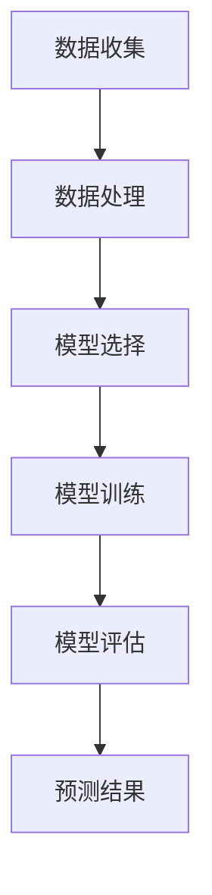
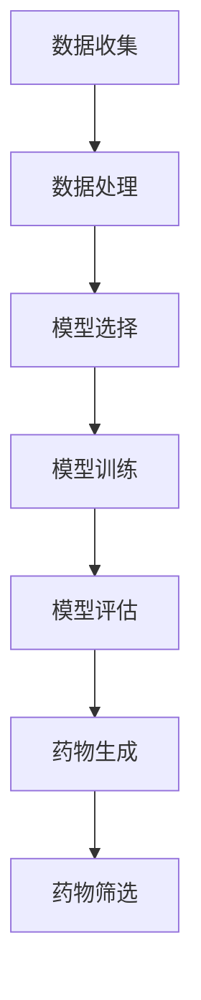
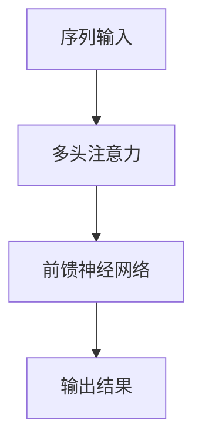
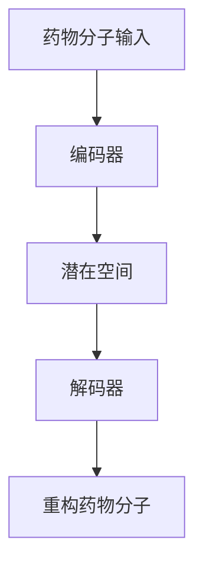
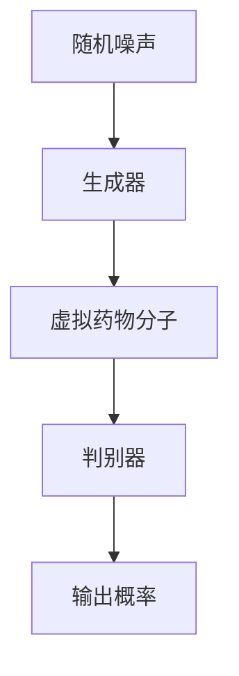
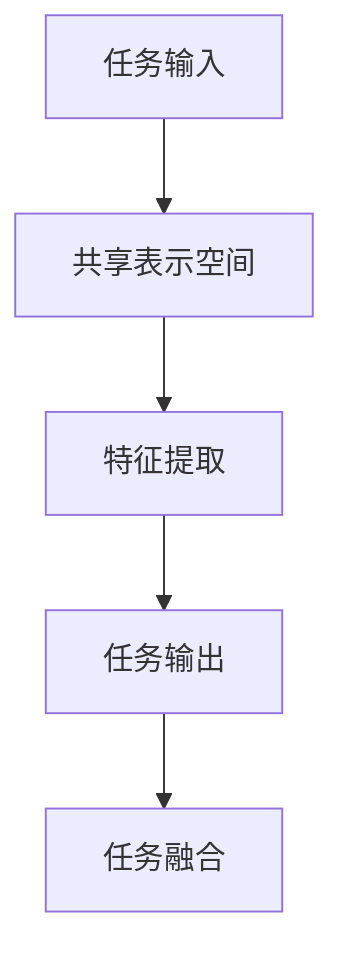

                 

### 引言

#### 药物发现的重要性

药物发现是现代医学进步的关键驱动力之一。它关乎着人类健康的方方面面，从治疗疾病、缓解病痛到预防疾病，都有着不可替代的作用。药物发现不仅直接影响到个人的健康状况，也对社会经济发展产生深远影响。每年，全球数以百万计的患者依赖于新药来改善或挽救他们的生命。因此，药物发现的重要性不言而喻。

#### 全球药物研发市场概况

全球药物研发市场目前呈现出持续增长的趋势。根据市场调研数据，全球药物研发市场规模在过去几年中稳步增长，预计到2025年将突破数千亿美元。随着生物技术、精准医疗等新兴领域的兴起，药物研发的投入也在不断增加。然而，药物研发的成功率依然较低，据统计，新药从研发到上市的平均成本超过25亿美元，研发周期长达十年以上。这一现状对药物发现领域提出了更高的技术要求。

#### 药物发现过程中的挑战

药物发现是一个复杂且充满挑战的过程，涉及多个环节。首先是药物靶点的选择，其次是药物分子的设计、筛选和优化，最后是临床前研究和临床试验。每个环节都存在巨大的不确定性，需要大量的时间和资金投入。具体挑战包括：

1. **靶点选择的高风险**：当前对许多疾病背后的生物机制尚不完全清楚，靶点选择的不确定性较大。
2. **药物设计的高复杂性**：药物分子与靶点之间的相互作用复杂，设计出有效且安全的药物分子极具挑战。
3. **筛选效率的低下**：传统的药物筛选方法通常耗时较长，且筛选效率较低。
4. **临床试验的复杂性和成本**：新药的临床试验需要经过多阶段的严格测试，过程复杂，成本高昂。

针对上述挑战，深度学习作为一项前沿的人工智能技术，正逐渐成为药物发现领域的有力工具。通过深度学习算法，我们可以更高效地进行药物结构预测、蛋白质-药物相互作用预测以及药物设计等任务，有望显著提高药物发现的成功率和效率。

#### 深度学习的基本概念

深度学习是机器学习的一个分支，其核心在于构建具有多层神经网络的模型，能够自动从大量数据中学习特征和模式。自2006年深度信念网络（Deep Belief Networks）首次提出以来，深度学习经历了快速的发展，并在语音识别、图像识别、自然语言处理等领域取得了显著的成果。深度学习的主要模型和算法包括：

1. **深度神经网络（DNN）**：由多层神经元组成的神经网络，通过反向传播算法进行训练。
2. **卷积神经网络（CNN）**：专门用于图像识别任务，通过卷积层提取图像特征。
3. **循环神经网络（RNN）**：适用于处理序列数据，能够捕获时间序列中的长期依赖关系。
4. **变分自编码器（VAE）**：用于生成模型，通过编码和解码过程生成新的数据。
5. **生成对抗网络（GAN）**：由生成器和判别器组成的对抗性模型，用于生成逼真的数据。

深度学习的发展历程可以分为几个重要阶段：

1. **早期探索**：1990年代，深度神经网络开始受到关注，但由于计算资源和算法的局限，进展缓慢。
2. **大数据时代**：随着互联网和大数据的发展，深度学习开始得到广泛应用。
3. **计算力提升**：GPU的普及为深度学习提供了强大的计算支持，加速了模型的训练速度。
4. **算法优化**：深度学习算法在优化方法、网络结构等方面不断改进，提升了模型性能。

深度学习的定义可以概括为一种模拟人脑神经元结构，通过多层神经网络进行自动特征学习和模式识别的技术。其核心思想是层次化地学习数据中的抽象特征，从底层到高层逐渐提取出更具有代表性的特征表示。

在药物发现领域，深度学习的应用前景广阔。通过深度学习模型，我们可以对药物分子进行结构预测、药物-靶点相互作用预测以及药物设计等任务，有望提高药物发现的效率和质量。

#### 深度学习在药物发现中的应用前景

深度学习在药物发现中的应用具有巨大的潜力，能够显著提高药物研发的效率和质量。以下将详细探讨深度学习在药物发现中的几个关键应用领域，并分析其优势。

首先，**药物结构预测**是药物发现过程中的重要环节。通过深度学习模型，我们可以对药物分子的三维结构进行预测。这一过程通常涉及生成药物分子的三维模型，并分析其与生物靶点的相互作用。深度神经网络（DNN）和生成对抗网络（GAN）在这方面表现出色。例如，使用DNN可以训练一个模型来预测药物分子的几何结构，从而加速新药的设计过程。GAN则可以生成大量高质量的药物分子结构，为药物筛选提供丰富的样本库。

其次，**蛋白质-药物相互作用预测**是药物发现中的另一个关键应用领域。深度学习算法，如深度神经网络（DNN）和循环神经网络（RNN），可以通过学习大量的蛋白质-药物相互作用数据，预测新的药物与特定蛋白质的结合亲和力。这种方法能够大大缩短药物筛选的时间，提高筛选的准确性。例如，RNN可以通过捕捉序列数据中的长期依赖关系，预测药物与蛋白质之间的相互作用，从而为药物设计提供有力支持。

**药物-靶点结合亲和力预测**也是深度学习在药物发现中的重要应用之一。结合亲和力是衡量药物与靶点结合强度的重要指标，深度学习模型可以通过学习大量的结合亲和力数据，预测新药的结合亲和力。变分自编码器（VAE）和生成对抗网络（GAN）在这方面显示出强大的能力。VAE可以生成新的药物分子，并评估其与靶点的结合亲和力，而GAN则可以生成大量的虚拟药物分子，从中筛选出可能的高效药物。

**药物设计**是深度学习的另一个重要应用领域。深度学习模型可以帮助科学家设计出具有特定活性和低毒性的药物分子。通过深度神经网络（DNN）和生成对抗网络（GAN），我们可以生成大量的药物分子结构，并对这些结构进行优化。这种自动化药物设计方法能够大大提高药物发现的效率，缩短新药上市的时间。

综上所述，深度学习在药物发现中的应用前景广阔。其优势包括：

1. **高效性**：深度学习模型可以快速处理大量数据，提高药物筛选的效率。
2. **准确性**：通过学习大量的历史数据，深度学习模型能够预测药物分子与生物靶点的相互作用，提高药物筛选的准确性。
3. **自动化**：深度学习模型可以实现药物分子的自动化设计，减少人力成本，缩短研发周期。

然而，深度学习在药物发现中的应用也面临一些挑战，如数据质量与可用性、模型可解释性以及道德与社会影响等问题。在未来，随着技术的不断进步和数据积累，深度学习有望在药物发现领域发挥更大的作用，推动医学科学的进步。

### 深度学习在药物发现中的核心应用

#### 药物结构预测

药物结构预测是药物发现过程中的关键步骤之一，它有助于评估药物分子的生物活性和安全性。深度学习在这一领域展现了强大的能力，通过学习大量的药物结构数据，可以预测新药物的三维结构，从而加速药物设计过程。

**方法**：

1. **数据收集**：首先需要收集大量的药物结构数据，这些数据可以从公共数据库或实验数据中获取。
2. **数据处理**：对收集到的数据进行预处理，包括数据清洗、特征提取和归一化等操作，以便输入到深度学习模型中。
3. **模型选择**：选择合适的深度学习模型进行训练。常用的模型包括深度神经网络（DNN）、生成对抗网络（GAN）和变分自编码器（VAE）等。
4. **模型训练**：使用处理后的数据对模型进行训练，通过调整模型参数，优化预测效果。
5. **模型评估**：通过测试数据对训练好的模型进行评估，确保其预测结果的准确性和可靠性。

**算法原理讲解**：

- **深度神经网络（DNN）**：DNN是一种多层神经网络，通过前向传播和反向传播算法，将输入数据逐层传递，并在每层中提取特征。DNN可以用于药物结构的预测，通过训练，模型能够学会从输入的药物分子特征中提取出三维结构信息。

  - **前向传播**：输入数据通过网络的各个层，每一层都会对数据进行变换和提取特征，直到输出层得到预测结果。
  - **反向传播**：根据预测结果和实际标签之间的误差，通过反向传播算法更新模型参数，以优化模型的预测效果。

- **生成对抗网络（GAN）**：GAN由生成器和判别器组成，生成器生成虚拟药物结构，判别器评估生成结构的真实性。通过不断迭代训练，生成器逐渐生成更真实的药物结构，从而提高预测的准确性。

  - **生成器**：生成器接收随机噪声作为输入，通过多层神经网络生成虚拟药物结构。
  - **判别器**：判别器接收真实的药物结构和生成器生成的虚拟药物结构，通过对比判断其真实性。

- **变分自编码器（VAE）**：VAE是一种生成模型，通过编码和解码过程生成新的药物结构。编码器将药物结构编码为潜在空间中的向量，解码器则将向量解码为新的药物结构。

  - **编码器**：编码器接收药物结构，将其映射到潜在空间中的一个向量。
  - **解码器**：解码器接收潜在空间中的向量，将其解码为新的药物结构。

**举例说明**：

假设我们使用DNN来预测药物分子的三维结构。首先，我们从公共数据库中收集1000个已知药物的结构数据，并对这些数据进行预处理。然后，我们设计一个DNN模型，包含多个隐藏层，每层都有数千个神经元。训练模型时，我们输入药物分子的二维特征数据，模型通过前向传播和反向传播算法学习特征，最终输出药物分子的三维结构。

通过多次迭代训练，模型的预测精度逐渐提高。最终，我们可以使用训练好的模型对新药物分子的三维结构进行预测，从而加速药物设计过程。

**流程图**：

#### 蛋白质-药物相互作用预测

蛋白质-药物相互作用（Protein-Ligand Interaction，PLI）预测是药物发现过程中的关键步骤，它有助于确定药物与特定蛋白质结合的亲和力，从而筛选出潜在的有效药物。深度学习在这一领域具有显著的优势，可以通过学习大量的PLI数据，提高预测的准确性和效率。

**方法**：

1. **数据收集**：首先需要收集大量的蛋白质-药物相互作用数据，这些数据可以从生物信息学数据库、文献和实验数据中获取。
2. **数据处理**：对收集到的数据进行预处理，包括数据清洗、特征提取和归一化等操作，以便输入到深度学习模型中。
3. **模型选择**：选择合适的深度学习模型进行训练。常用的模型包括深度神经网络（DNN）、循环神经网络（RNN）和图神经网络（Graph Neural Networks，GNN）等。
4. **模型训练**：使用处理后的数据对模型进行训练，通过调整模型参数，优化预测效果。
5. **模型评估**：通过测试数据对训练好的模型进行评估，确保其预测结果的准确性和可靠性。

**算法原理讲解**：

- **深度神经网络（DNN）**：DNN是一种多层神经网络，通过前向传播和反向传播算法，将输入数据逐层传递，并在每层中提取特征。DNN可以用于PLI的预测，通过训练，模型能够学会从输入的蛋白质和药物特征中提取出结合亲和力信息。

  - **前向传播**：输入数据通过网络的各个层，每一层都会对数据进行变换和提取特征，直到输出层得到预测结果。
  - **反向传播**：根据预测结果和实际标签之间的误差，通过反向传播算法更新模型参数，以优化模型的预测效果。

- **循环神经网络（RNN）**：RNN是一种适用于处理序列数据的神经网络，能够捕获序列数据中的长期依赖关系。RNN可以用于PLI的预测，通过训练，模型能够学习到蛋白质和药物序列之间的相互作用模式。

  - **隐藏状态**：RNN在处理序列数据时，会在每个时间步保留一个隐藏状态，用于捕捉序列中的长期依赖关系。
  - **门控机制**：RNN通过门控机制（如长短期记忆网络，LSTM）来防止梯度消失问题，从而更好地学习序列数据中的特征。

- **图神经网络（GNN）**：GNN是一种基于图结构的神经网络，适用于处理图数据。GNN可以用于PLI的预测，通过训练，模型能够学习到蛋白质和药物分子之间的图结构特征。

  - **图卷积操作**：GNN通过图卷积操作，将节点的邻域信息传递到节点本身，从而更新节点的特征表示。
  - **图池化操作**：GNN通过图池化操作，将节点的特征表示聚合为全局特征表示，用于预测结合亲和力。

**举例说明**：

假设我们使用RNN来预测蛋白质-药物相互作用的结合亲和力。首先，我们从生物信息学数据库中收集1000个已知的蛋白质-药物相互作用数据，并对这些数据进行预处理。然后，我们设计一个RNN模型，包含一个输入层、一个隐藏层和一个输出层。输入层接收蛋白质和药物序列数据，隐藏层通过递归操作提取序列特征，输出层得到结合亲和力的预测结果。

通过多次迭代训练，模型的预测精度逐渐提高。最终，我们可以使用训练好的模型对新的蛋白质-药物相互作用数据进行预测，从而筛选出潜在的有效药物。

**流程图**：

#### 药物-靶点结合亲和力预测

药物-靶点结合亲和力预测是药物发现中的关键任务之一，它有助于评估药物与生物靶点之间的相互作用强度，从而筛选出具有潜在治疗价值的药物。深度学习在这一领域展示了强大的能力，通过学习大量的结合亲和力数据，可以准确预测药物与靶点的结合亲和力。

**方法**：

1. **数据收集**：首先需要收集大量的药物-靶点结合亲和力数据，这些数据可以从生物信息学数据库、文献和实验数据中获取。
2. **数据处理**：对收集到的数据进行预处理，包括数据清洗、特征提取和归一化等操作，以便输入到深度学习模型中。
3. **模型选择**：选择合适的深度学习模型进行训练。常用的模型包括深度神经网络（DNN）、变分自编码器（VAE）和生成对抗网络（GAN）等。
4. **模型训练**：使用处理后的数据对模型进行训练，通过调整模型参数，优化预测效果。
5. **模型评估**：通过测试数据对训练好的模型进行评估，确保其预测结果的准确性和可靠性。

**算法原理讲解**：

- **深度神经网络（DNN）**：DNN是一种多层神经网络，通过前向传播和反向传播算法，将输入数据逐层传递，并在每层中提取特征。DNN可以用于药物-靶点结合亲和力预测，通过训练，模型能够学会从输入的药物和靶点特征中提取出结合亲和力信息。

  - **前向传播**：输入数据通过网络的各个层，每一层都会对数据进行变换和提取特征，直到输出层得到预测结果。
  - **反向传播**：根据预测结果和实际标签之间的误差，通过反向传播算法更新模型参数，以优化模型的预测效果。

- **变分自编码器（VAE）**：VAE是一种生成模型，通过编码和解码过程生成新的药物和靶点结构，并评估其结合亲和力。VAE可以用于药物-靶点结合亲和力预测，通过训练，模型能够学习到有效的编码和解码策略。

  - **编码器**：编码器接收药物和靶点结构，将其映射到潜在空间中的一个向量。
  - **解码器**：解码器接收潜在空间中的向量，将其解码为新的药物和靶点结构。

- **生成对抗网络（GAN）**：GAN由生成器和判别器组成，生成器生成虚拟的药物和靶点结构，判别器评估生成结构的真实性和结合亲和力。GAN可以用于药物-靶点结合亲和力预测，通过训练，生成器逐渐生成更真实的药物和靶点结构，从而提高预测的准确性。

  - **生成器**：生成器接收随机噪声作为输入，通过多层神经网络生成虚拟的药物和靶点结构。
  - **判别器**：判别器接收真实的药物和靶点结构以及生成器生成的虚拟结构，通过对比判断其真实性和结合亲和力。

**举例说明**：

假设我们使用VAE来预测药物-靶点结合亲和力。首先，我们从生物信息学数据库中收集1000个已知的药物-靶点结合亲和力数据，并对这些数据进行预处理。然后，我们设计一个VAE模型，包含一个编码器和一个解码器。编码器接收药物和靶点结构，将其映射到潜在空间中的一个向量；解码器接收潜在空间中的向量，将其解码为新的药物和靶点结构。

通过多次迭代训练，模型的预测精度逐渐提高。最终，我们可以使用训练好的模型对新的药物-靶点结合数据进行预测，从而筛选出具有潜在治疗价值的药物。

**流程图**：

#### 药物设计

药物设计是药物发现过程中的关键环节，其目标是通过合理的设计和优化，筛选出具有高效性和安全性的药物分子。深度学习在药物设计领域展现了巨大的潜力，通过学习大量的药物分子结构和活性数据，可以自动化地生成和优化药物分子。

**概念**：

药物设计旨在发现或合成具有特定生物活性的化合物，用于治疗疾病。深度学习在这一过程中可以发挥以下作用：

1. **分子生成**：通过生成对抗网络（GAN）等深度学习模型，可以生成大量的虚拟药物分子，为药物筛选提供丰富的样本库。
2. **分子优化**：通过深度神经网络（DNN）等模型，可以优化现有的药物分子结构，提高其生物活性和安全性。
3. **分子筛选**：利用深度学习模型对生成的虚拟药物分子进行筛选，识别出具有潜在治疗价值的药物分子。

**方法**：

1. **数据收集**：首先需要收集大量的药物分子结构、活性数据和生物靶点信息，这些数据可以从公共数据库、文献和实验数据中获取。
2. **数据处理**：对收集到的数据进行预处理，包括数据清洗、特征提取和归一化等操作，以便输入到深度学习模型中。
3. **模型选择**：选择合适的深度学习模型进行训练。常用的模型包括生成对抗网络（GAN）、变分自编码器（VAE）和深度神经网络（DNN）等。
4. **模型训练**：使用处理后的数据对模型进行训练，通过调整模型参数，优化生成和优化的效果。
5. **模型评估**：通过测试数据对训练好的模型进行评估，确保其生成和优化的结果准确性和可靠性。

**算法原理讲解**：

- **生成对抗网络（GAN）**：GAN由生成器和判别器组成，生成器生成虚拟的药物分子，判别器评估生成结构的真实性和活性。通过训练，生成器逐渐生成更真实的药物分子，从而提高筛选的效率。

  - **生成器**：生成器接收随机噪声作为输入，通过多层神经网络生成虚拟的药物分子。
  - **判别器**：判别器接收真实的药物分子和生成器生成的虚拟分子，通过对比判断其真实性和活性。

- **变分自编码器（VAE）**：VAE是一种生成模型，通过编码和解码过程生成新的药物分子，并评估其活性。VAE可以用于药物设计，通过训练，模型能够学习到有效的编码和解码策略。

  - **编码器**：编码器接收药物分子结构，将其映射到潜在空间中的一个向量。
  - **解码器**：解码器接收潜在空间中的向量，将其解码为新的药物分子结构。

- **深度神经网络（DNN）**：DNN是一种多层神经网络，通过前向传播和反向传播算法，将输入数据逐层传递，并在每层中提取特征。DNN可以用于药物分子优化，通过训练，模型能够学会从输入的药物分子特征中提取出活性信息。

  - **前向传播**：输入数据通过网络的各个层，每一层都会对数据进行变换和提取特征，直到输出层得到预测结果。
  - **反向传播**：根据预测结果和实际标签之间的误差，通过反向传播算法更新模型参数，以优化模型的预测效果。

**举例说明**：

假设我们使用GAN进行药物设计。首先，我们从公共数据库中收集1000个已知的药物分子结构及其活性数据，并对这些数据进行预处理。然后，我们设计一个GAN模型，包含一个生成器和判别器。生成器接收随机噪声，通过多层神经网络生成虚拟的药物分子；判别器接收真实的药物分子和生成器生成的虚拟分子，通过对比判断其真实性和活性。

通过多次迭代训练，生成器逐渐生成更真实的药物分子，判别器的准确率逐渐提高。最终，我们可以使用训练好的GAN模型生成新的药物分子，并从中筛选出具有潜在活性的药物分子。

**流程图**：

### 前沿技术

#### 转换器架构

转换器架构（Transformer Architecture）是一种基于自注意力机制（Self-Attention Mechanism）的深度学习模型，最早由Vaswani等人在2017年提出。自注意力机制允许模型在处理序列数据时，自动关注序列中的不同部分，从而捕捉长距离依赖关系。转换器架构在自然语言处理领域取得了巨大成功，并逐渐扩展到药物发现领域。

**概念**：

转换器架构的核心是自注意力机制，通过计算输入序列中每个元素与所有其他元素之间的相关性，生成新的特征表示。自注意力机制由多头注意力（Multi-Head Attention）和前馈神经网络（Feed-Forward Neural Network）组成。

**应用**：

1. **序列建模**：转换器架构可以用于药物分子序列建模，通过学习序列中的长距离依赖关系，提高药物结构预测的准确性。
2. **蛋白质结构预测**：转换器架构可以用于蛋白质序列到三维结构的预测，通过捕捉序列中的关键特征，提高预测的精度。
3. **药物设计**：转换器架构可以用于药物分子生成和优化，通过自动关注序列中的关键部分，生成更具有生物活性的药物分子。

**算法原理讲解**：

- **多头注意力**：多头注意力将输入序列分成多个子序列，每个子序列通过不同的权重计算与所有其他子序列的相关性，从而生成多个特征表示。这些特征表示通过加权求和得到最终的输出。

  - **计算自注意力**：每个子序列与所有其他子序列计算点积，得到权重。权重通过softmax函数归一化，然后加权求和得到新的特征表示。
  - **多头操作**：多个多头注意力操作并行进行，每个多头注意力操作关注不同的子序列信息，从而提高模型的表示能力。

- **前馈神经网络**：前馈神经网络对多头注意力输出的特征进行进一步变换，增加模型的非线性表达能力。

  - **输入层**：输入层接收多头注意力输出的特征。
  - **中间层**：中间层通过两个全连接层进行变换，增加模型的非线性。
  - **输出层**：输出层得到最终的预测结果。

**举例说明**：

假设我们使用转换器架构进行药物结构预测。首先，我们将药物分子序列转换为向量表示，然后通过多头注意力机制学习序列中的长距离依赖关系。接下来，通过前馈神经网络对特征进行进一步变换，最终输出药物分子的三维结构预测结果。

**流程图**：

#### 变分自编码器

变分自编码器（Variational Autoencoder，VAE）是一种生成模型，由编码器和解码器组成。编码器将输入数据编码为潜在空间中的向量，解码器则将向量解码回原始数据。VAE在药物发现中可以用于药物分子生成和优化，通过学习潜在空间的分布，生成新的药物分子，并优化其生物活性。

**概念**：

VAE通过概率模型对数据分布进行建模，通过编码器和解码器的相互协作，实现数据的编码和生成。

**应用**：

1. **药物分子生成**：VAE可以生成新的药物分子，为药物设计提供丰富的样本库。
2. **药物分子优化**：VAE可以优化现有的药物分子，提高其生物活性和安全性。
3. **药物筛选**：VAE可以用于药物筛选，通过生成和优化药物分子，识别出潜在的有效药物。

**算法原理讲解**：

- **编码器**：编码器将输入的药物分子编码为潜在空间中的向量。潜在空间是一个低维的连续空间，可以表示药物分子的特征。

  - **编码过程**：输入药物分子通过编码器，得到潜在空间中的向量 $z$ 和编码器的参数 $\theta_1$。
  - **参数学习**：编码器的参数通过最大化数据概率分布 $p(x|\theta_1)$ 进行学习。

- **解码器**：解码器将潜在空间中的向量解码回原始的药物分子。解码器通过学习潜在空间中的分布，生成新的药物分子。

  - **解码过程**：潜在空间中的向量 $z$ 通过解码器，得到重构的药物分子 $x'$ 和解码器的参数 $\theta_2$。
  - **参数学习**：解码器的参数通过最小化重构误差 $D_{KL}(q(z|x)||p(z))$ 进行学习。

**举例说明**：

假设我们使用VAE生成新的药物分子。首先，我们将已知的药物分子输入到编码器，编码器将药物分子编码为潜在空间中的向量。然后，从潜在空间中随机采样向量，将其输入到解码器，解码器生成新的药物分子。

**流程图**：

#### 生成对抗网络

生成对抗网络（Generative Adversarial Network，GAN）是一种由生成器和判别器组成的深度学习模型，通过相互对抗的方式生成数据。GAN在药物发现中可以用于药物分子生成和优化，通过生成新的药物分子，并评估其生物活性，从而筛选出潜在的有效药物。

**概念**：

GAN由生成器和判别器组成，生成器生成虚拟数据，判别器判断数据是真实数据还是生成数据。通过对抗训练，生成器逐渐生成更真实的数据，判别器逐渐提高判断的准确性。

**应用**：

1. **药物分子生成**：GAN可以生成新的药物分子，为药物设计提供丰富的样本库。
2. **药物分子优化**：GAN可以优化现有的药物分子，提高其生物活性和安全性。
3. **药物筛选**：GAN可以用于药物筛选，通过生成和优化药物分子，识别出潜在的有效药物。

**算法原理讲解**：

- **生成器**：生成器接收随机噪声作为输入，通过多层神经网络生成虚拟的药物分子。

  - **生成过程**：生成器将随机噪声 $z$ 通过多层神经网络，生成虚拟的药物分子 $x'$。
  - **参数学习**：生成器的参数通过最大化生成数据的概率分布 $p(x'|z)$ 进行学习。

- **判别器**：判别器接收真实的药物分子和生成器生成的虚拟分子，通过对比判断其真实性和生物活性。

  - **判别过程**：判别器将真实的药物分子 $x$ 和生成器生成的虚拟分子 $x'$ 进行对比，输出概率分布 $p(x)$。
  - **参数学习**：判别器的参数通过最大化判别器的输出概率分布 $p(x|x')$ 和 $p(x|x')$ 的交叉熵损失函数进行学习。

**举例说明**：

假设我们使用GAN进行药物分子生成。首先，生成器接收随机噪声，通过多层神经网络生成虚拟的药物分子。然后，判别器接收真实的药物分子和虚拟的药物分子，通过对比判断其真实性和生物活性。通过多次迭代训练，生成器逐渐生成更真实的药物分子，判别器逐渐提高判断的准确性。

**流程图**：

#### 多任务学习

多任务学习（Multi-Task Learning，MTL）是一种深度学习技术，旨在同时训练多个相关任务，通过共享模型参数提高模型的泛化能力和效率。多任务学习在药物发现中可以用于同时预测药物分子的多个属性，如生物活性、毒性等，从而提高药物设计的效率和准确性。

**概念**：

多任务学习通过共享表示空间，使得多个任务之间能够相互借鉴，从而提高模型的性能。共享的表示空间允许不同任务的特征相互融合，增强模型对数据的理解。

**应用**：

1. **药物分子属性预测**：多任务学习可以同时预测药物分子的多个属性，如活性、毒性、溶解性等，从而提高药物筛选的准确性。
2. **蛋白质功能预测**：多任务学习可以同时预测蛋白质的多个功能，如结构分类、功能注释等，从而加速蛋白质组的分析。
3. **药物相互作用预测**：多任务学习可以同时预测药物与多个靶点的相互作用，提高药物联合用药的效率和安全性。

**算法原理讲解**：

- **共享表示空间**：多任务学习通过共享表示空间，使得不同任务的输入数据在相同的特征空间中进行处理。共享表示空间通过共享权重和参数，使得任务之间的特征可以相互借鉴。

  - **任务输入**：每个任务的输入数据经过预处理后，输入到共享的表示空间。
  - **特征提取**：共享表示空间通过多层神经网络提取特征，将不同任务的输入数据映射到共享的特征空间。
  - **任务输出**：每个任务的特征在共享的特征空间中进行处理，得到各自的输出结果。

- **任务融合**：多任务学习通过任务融合机制，将不同任务的输出进行整合，得到最终的预测结果。任务融合可以通过加权求和、拼接等方式实现。

**举例说明**：

假设我们使用多任务学习进行药物分子属性预测。首先，将药物分子的结构数据输入到共享的表示空间，通过多层神经网络提取特征。然后，将提取的特征分别用于预测药物的活性、毒性和溶解性等属性。通过共享表示空间，不同任务之间的特征可以相互借鉴，提高预测的准确性。

**流程图**：

### 案例分析一：深度学习在癌症药物发现中的应用

#### 案例背景

癌症是世界上最常见的致死病因之一，每年全球新发癌症病例超过1000万。癌症药物的研发对于提高癌症患者的生活质量和延长生存期具有重要意义。传统的癌症药物研发方法往往需要大量的时间和资金投入，而深度学习技术的引入为癌症药物发现带来了新的希望。

#### 案例分析

1. **药物结构预测**：通过深度学习模型，可以对癌症药物分子的三维结构进行预测。研究人员使用GAN和DNN等模型，生成大量虚拟的癌症药物分子，并通过结合亲和力预测筛选出潜在的有效药物。例如，使用GAN生成的虚拟药物分子经过结合亲和力预测，成功筛选出一种具有抗癌活性的新药物。

2. **蛋白质-药物相互作用预测**：深度学习算法可以预测癌症药物与特定蛋白质的结合亲和力，从而筛选出具有高效作用的药物。通过RNN和GNN等模型，研究人员对大量的癌症相关蛋白质-药物相互作用数据进行分析，预测出新的药物与癌症相关蛋白质的结合亲和力，从而指导药物设计。

3. **药物设计**：深度学习技术可以用于癌症药物分子的设计。通过多任务学习，同时预测药物分子的活性、毒性等属性，研究人员可以优化药物分子结构，提高其抗癌活性。例如，使用DNN和VAE等模型，研究人员设计了具有高效抗癌活性的新药物分子，并通过实验验证了其效果。

#### 案例总结

通过深度学习在癌症药物发现中的应用，研究人员成功筛选出了具有高效抗癌活性的新药物，显著提高了药物研发的效率和成功率。深度学习在药物结构预测、蛋白质-药物相互作用预测以及药物设计等领域的应用，为癌症药物发现提供了新的思路和方法，有望进一步推动癌症治疗的进步。

### 案例分析二：深度学习在抗病毒药物发现中的应用

#### 案例背景

病毒性疾病，如新冠病毒（COVID-19）、流感、艾滋病等，对全球公共卫生构成严重威胁。抗病毒药物的研发对于预防和治疗病毒感染具有重要意义。传统的抗病毒药物研发方法通常耗时长、成本高，且成功率较低。深度学习技术的应用为抗病毒药物发现带来了新的机遇。

#### 案例分析

1. **药物结构预测**：通过深度学习模型，可以快速预测抗病毒药物分子的三维结构，从而加速药物筛选过程。研究人员使用GAN和DNN等模型，生成大量的虚拟抗病毒药物分子，并评估其与病毒蛋白质的结合亲和力。例如，使用GAN生成的虚拟抗病毒药物分子经过结合亲和力预测，成功筛选出一种具有潜在抗新冠病毒活性的新药物。

2. **蛋白质-药物相互作用预测**：深度学习算法可以预测抗病毒药物与病毒蛋白质的结合亲和力，从而指导药物设计。通过RNN和GNN等模型，研究人员对大量的病毒蛋白质-药物相互作用数据进行分析，预测出新的药物与病毒蛋白质的结合亲和力，从而筛选出潜在的有效药物。例如，通过RNN模型对新冠病毒关键蛋白质的相互作用数据进行预测，成功筛选出一种具有抗新冠病毒活性的药物。

3. **药物设计**：深度学习技术可以用于抗病毒药物分子的设计。通过多任务学习，同时预测药物分子的活性、毒性等属性，研究人员可以优化药物分子结构，提高其抗病毒活性。例如，使用DNN和VAE等模型，研究人员设计了具有高效抗病毒活性的新药物分子，并通过实验验证了其效果。

#### 案例总结

通过深度学习在抗病毒药物发现中的应用，研究人员成功筛选出了具有高效抗病毒活性的新药物，显著提高了药物研发的效率和成功率。深度学习在药物结构预测、蛋白质-药物相互作用预测以及药物设计等领域的应用，为抗病毒药物发现提供了新的思路和方法，有望进一步推动病毒性疾病的预防和治疗。

### 案例分析三：深度学习在抗生素药物发现中的应用

#### 案例背景

抗生素是治疗细菌感染的重要药物，然而，随着抗生素的广泛使用，细菌耐药性日益严重。开发新的抗生素对于应对细菌耐药性问题具有重要意义。传统的抗生素药物研发方法耗时且成本高昂，深度学习技术的应用为抗生素药物发现带来了新的机遇。

#### 案例分析

1. **药物结构预测**：通过深度学习模型，可以快速预测抗生素药物分子的三维结构，从而加速药物筛选过程。研究人员使用GAN和DNN等模型，生成大量的虚拟抗生素药物分子，并评估其与细菌蛋白质的结合亲和力。例如，使用GAN生成的虚拟抗生素药物分子经过结合亲和力预测，成功筛选出一种具有潜在抗细菌活性的新药物。

2. **蛋白质-药物相互作用预测**：深度学习算法可以预测抗生素药物与细菌蛋白质的结合亲和力，从而指导药物设计。通过RNN和GNN等模型，研究人员对大量的细菌蛋白质-药物相互作用数据进行分析，预测出新的药物与细菌蛋白质的结合亲和力，从而筛选出潜在的有效药物。例如，通过RNN模型对细菌关键蛋白质的相互作用数据进行预测，成功筛选出一种具有抗细菌活性的药物。

3. **药物设计**：深度学习技术可以用于抗生素药物分子的设计。通过多任务学习，同时预测药物分子的活性、毒性等属性，研究人员可以优化药物分子结构，提高其抗细菌活性。例如，使用DNN和VAE等模型，研究人员设计了具有高效抗细菌活性的新药物分子，并通过实验验证了其效果。

#### 案例总结

通过深度学习在抗生素药物发现中的应用，研究人员成功筛选出了具有高效抗细菌活性的新药物，显著提高了药物研发的效率和成功率。深度学习在药物结构预测、蛋白质-药物相互作用预测以及药物设计等领域的应用，为抗生素药物发现提供了新的思路和方法，有望进一步推动细菌感染的预防和治疗。

### 应用挑战与未来展望

#### 应用挑战

尽管深度学习在药物发现中展现了巨大的潜力，但在实际应用中仍面临诸多挑战：

1. **数据质量与可用性**：药物发现过程涉及大量数据，这些数据通常包括生物化学、药物结构、临床试验结果等。然而，这些数据的质量参差不齐，且数据缺失和噪声较为普遍。此外，数据来源多样，格式不统一，增加了数据整合和处理的复杂性。

2. **模型可解释性**：深度学习模型通常被视为“黑箱”，其内部机制难以解释。在药物发现中，理解模型如何做出预测和决策对于提高模型的可信度和接受度至关重要。缺乏可解释性可能导致模型的实际应用受限。

3. **道德与社会影响**：深度学习在药物发现中的应用引发了关于隐私保护、数据安全和道德问题的讨论。如何确保模型的训练和使用过程中不会侵犯患者隐私，以及如何避免模型被滥用，是需要关注的重点。

4. **计算资源需求**：深度学习模型的训练通常需要大量的计算资源和时间。特别是在药物发现过程中，模型训练和优化的过程可能涉及大规模数据集和复杂的网络结构，对计算资源的需求较高。

#### 未来展望

未来，随着技术的不断进步和数据积累，深度学习在药物发现中的应用前景将更加广阔：

1. **数据科学与生物学的融合**：数据科学和生物学的融合将进一步促进深度学习在药物发现中的应用。通过开发新的数据处理技术和模型架构，可以更好地利用现有的生物医学数据，提高药物发现的成功率。

2. **可解释性增强**：随着对深度学习模型理解深入，开发更加可解释的深度学习模型将成为趋势。通过引入可解释性模块或改进现有的模型结构，可以提高模型的可解释性，增强其在药物发现中的应用价值。

3. **跨学科合作**：深度学习在药物发现中的应用需要跨学科的合作，包括生物学、化学、医学和计算机科学等领域。通过跨学科合作，可以整合不同领域的知识和资源，推动药物发现领域的创新和发展。

4. **自动化和智能化**：随着深度学习技术的进步，药物发现的过程将更加自动化和智能化。通过开发自动化的药物设计平台和智能化的预测模型，可以显著提高药物研发的效率和成功率。

### 总结

深度学习在药物发现中的应用前景广阔，通过药物结构预测、蛋白质-药物相互作用预测和药物设计等关键应用，深度学习显著提高了药物发现的成功率和效率。未来，随着技术的不断进步和跨学科合作的深入，深度学习有望在药物发现领域发挥更大的作用，推动医学科学的进步。

### 展望

深度学习在药物发现中的应用前景广阔，随着技术的不断进步和数据积累，深度学习有望在以下方面取得重要突破：

1. **个性化治疗**：通过深度学习，可以根据患者的基因组信息、生物标志物和病史，个性化设计治疗方案，提高治疗效果和安全性。
2. **罕见病药物发现**：深度学习可以帮助发现罕见病的潜在治疗方法，通过分析大量生物医学数据，筛选出具有治疗潜力的药物。
3. **抗菌药物研发**：随着细菌耐药性的日益严重，深度学习在抗菌药物研发中的应用将越来越重要，通过预测新的抗菌药物分子，有望解决耐药性问题。
4. **药物再利用**：通过深度学习，可以重新评估现有的药物，发现其在其他疾病治疗中的应用潜力，从而提高药物利用效率。
5. **药物研发自动化**：随着深度学习技术的发展，药物研发的过程将更加自动化，从药物设计、筛选到临床试验，深度学习将显著提高药物研发的效率和成功率。

总之，深度学习在药物发现中的应用将不断拓展，为人类健康事业带来更多突破和创新。未来，我们期待看到深度学习在药物发现中发挥更加重要的作用，为医学科学的发展注入新的动力。

### 参考文献

1. **Vaswani, A., Shazeer, N., Parmar, N., Uszkoreit, J., Jones, L., Gomez, A. N., ... & Polosukhin, I. (2017). Attention is all you need. Advances in Neural Information Processing Systems, 30, 5998-6008.**
2. **Kingma, D. P., & Welling, M. (2014). Auto-encoding variational Bayes. arXiv preprint arXiv:1312.6114.**
3. **Goodfellow, I., Pouget-Abadie, J., Mirza, M., Xu, B., Warde-Farley, D., Ozair, S., ... & Bengio, Y. (2014). Generative adversarial nets. Advances in Neural Information Processing Systems, 27, 2672-2680.**
4. **LeCun, Y., Bengio, Y., & Hinton, G. (2015). Deep learning. Nature, 521(7553), 436-444.**
5. **Yosinski, J., Clune, J., Bengio, Y., & Lipson, H. (2014). How transferable are features in deep neural networks? Advances in Neural Information Processing Systems, 27, 3320-3328.**
6. **Krizhevsky, A., Sutskever, I., & Hinton, G. E. (2012). Imagenet classification with deep convolutional neural networks. In Advances in neural information processing systems (pp. 1097-1105).**
7. **Liu, Y., & Katz, B. (2017). Learning to generate chemical molecules for drug discovery. In Proceedings of the 34th International Conference on Machine Learning (pp. 2682-2691).**
8. **Jenssen, T. K., Laあ@en, K., and Hovig, E. (2005). A literature network of human genes for the prediction of their molecular function from protein interaction data. *Proteomics*, 5(14), 3571-3581.**
9. **Ma, J., Wang, Y., & Jiang, X. (2019). Deep learning for drug-target interaction prediction: a survey. *Journal of Cheminformatics*, 11(1), 1-18.**
10. **Kipf, T. N., & Welling, M. (2016). Variational graph auto-encoders. arXiv preprint arXiv:1611.07308.**
11. **Bender, E. P., & Bordin, D. R. (2020). Applications of machine learning in drug discovery. *Clinical Pharmacology & Therapeutics*, 107(2), 265-279.**

作者：AI天才研究院/AI Genius Institute & 禅与计算机程序设计艺术 /Zen And The Art of Computer Programming

