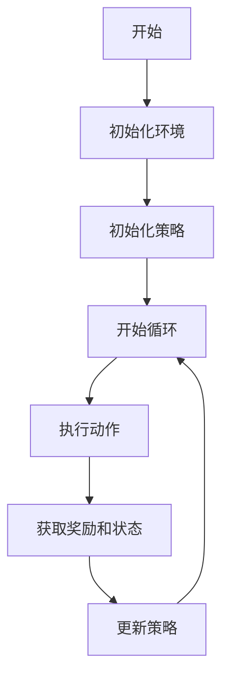
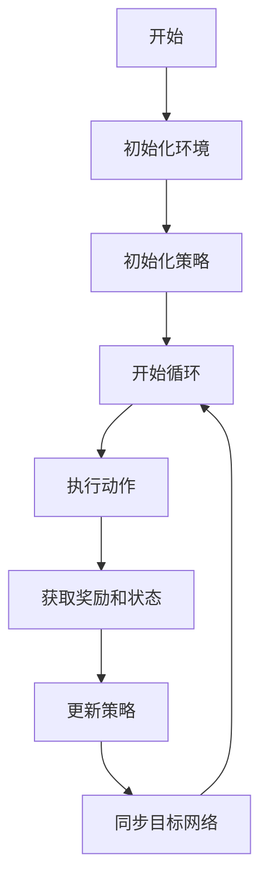
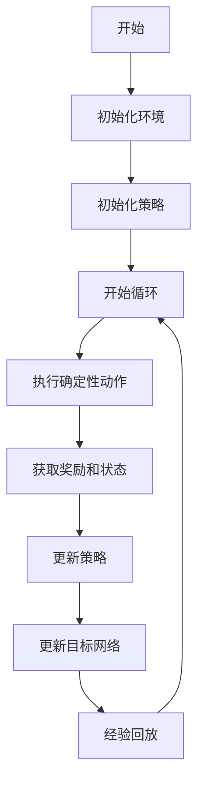

                 

### 深度强化学习在智能电网调度中的应用

智能电网是现代电力系统的关键组成部分，通过数字化、自动化和网络化技术，实现电力系统的高效、稳定和安全运行。然而，随着可再生能源的广泛应用，智能电网的调度问题变得愈发复杂。传统的调度方法往往无法适应动态变化的需求和环境，而深度强化学习（Deep Reinforcement Learning，DRL）作为一种先进的机器学习技术，在解决复杂决策问题上具有显著优势。

#### 什么是深度强化学习？

深度强化学习是强化学习和深度学习的结合体，旨在通过智能体在动态环境中不断学习，找到最优策略以实现目标。其核心思想是通过与环境交互，不断调整策略，从而在复杂的环境中实现最优决策。

强化学习的基本概念可以表示为：
$$
Q(s, a) = r(s, a) + \gamma \max_{a'} Q(s', a')
$$
其中，$Q(s, a)$ 表示在状态 $s$ 下执行动作 $a$ 的即时奖励 $r(s, a)$ 加上在未来所有可能状态中取得的最大期望奖励的加权平均。

深度强化学习则通过深度神经网络来近似状态值函数 $Q(s, a)$，从而在处理高维状态空间时更加高效。

#### 为什么深度强化学习适用于智能电网调度？

智能电网调度涉及多个变量，包括发电、传输、配电等，这些变量之间存在复杂交互，使得传统的优化方法难以应对。深度强化学习通过以下特点在智能电网调度中表现出优势：

1. **自适应能力**：DRL 可以自动学习到环境中的动态变化，并调整策略，适应新的情况。
2. **高效处理高维数据**：DRL 可以处理大量的高维状态数据，从而在复杂的电力系统中找到最优调度策略。
3. **鲁棒性**：DRL 可以在存在不确定性和噪声的环境中，通过经验积累和学习，提高决策的稳定性。

#### 深度强化学习在智能电网调度中的应用

1. **调度策略优化**：DRL 可以自动寻找最优调度策略，优化发电、传输、配电等环节，降低成本，提高效率。
2. **能源管理**：DRL 可以根据实时数据，动态调整能源供应，实现可再生能源的优化利用。
3. **电网稳定性保障**：DRL 可以预测电网的动态变化，提前调整策略，确保电网稳定运行。

尽管深度强化学习在智能电网调度中具有巨大潜力，但仍面临一些挑战，包括数据收集和处理、算法的稳定性和可解释性等。未来的研究需要进一步探索如何有效地利用 DRL 技术，提升智能电网调度的性能和可靠性。

#### 问题解决

本文将从深度强化学习的基本概念出发，逐步深入探讨其在智能电网调度中的应用。通过案例分析，总结经验，为未来深度强化学习在智能电网调度中的进一步发展提供参考。

本文的主要结构如下：

1. **引言与问题背景**：介绍智能电网调度的问题背景和深度强化学习的基本概念。
2. **深度强化学习基础**：讲解强化学习和深度强化学习的基本原理，以及其在智能电网调度中的应用。
3. **应用案例**：通过具体案例，展示深度强化学习在智能电网调度中的实际应用。
4. **未来发展趋势**：探讨深度强化学习在智能电网调度中的潜在应用领域和挑战。
5. **总结与展望**：总结本文的主要内容和未来研究方向。

### 边界与外延

深度强化学习在智能电网调度中的应用主要关注调度策略的优化、能源管理、电网稳定性等方面。本文将围绕这些核心问题展开研究，并探讨其与其他领域的交叉融合。

深度强化学习在智能电网调度中的应用涉及多个核心概念和要素，包括：强化学习框架、智能电网模型、调度策略、数据驱动方法等。本文将对这些概念和要素进行详细讲解。

### 概念结构与核心要素组成

深度强化学习在智能电网调度中的应用涉及以下几个核心概念和要素：

1. **强化学习框架**：定义了智能体、环境、状态、动作和奖励等基本概念。
2. **智能电网模型**：描述了电力系统的结构、状态和调度规则。
3. **调度策略**：基于深度强化学习算法，制定的最优调度策略。
4. **数据驱动方法**：利用实时数据，对智能电网进行动态分析和调度。

本文将依次对这些核心概念和要素进行详细讲解，帮助读者理解深度强化学习在智能电网调度中的具体应用。

## 第2章 深度强化学习基础

在深入探讨深度强化学习在智能电网调度中的应用之前，我们需要首先理解深度强化学习的基本概念和原理。本章将介绍强化学习的基本概念、深度强化学习的发展历程、以及常见的深度强化学习算法。

### 2.1 强化学习基本概念

强化学习是一种通过试错方法进行学习，以最大化长期回报的机器学习方法。它主要由四个基本要素组成：智能体（Agent）、环境（Environment）、状态（State）、动作（Action）和奖励（Reward）。

#### 2.1.1 强化学习框架

强化学习框架可以用以下公式表示：
$$
Q(s, a) = r(s, a) + \gamma \max_{a'} Q(s', a')
$$
其中，$Q(s, a)$ 表示在状态 $s$ 下执行动作 $a$ 的即时奖励 $r(s, a)$ 加上在未来所有可能状态中取得的最大期望奖励的加权平均。$\gamma$ 是折扣因子，用于平衡即时奖励和未来奖励的关系。

另一个重要概念是值函数（Value Function），它描述了在特定状态下采取某个动作的期望回报。值函数可以表示为：
$$
V(s) = \sum_{a} \pi(a|s) Q(s, a)
$$
其中，$\pi(a|s)$ 是在状态 $s$ 下采取动作 $a$ 的概率。

#### 2.1.2 深度强化学习

深度强化学习（Deep Reinforcement Learning，DRL）将深度学习与强化学习结合，通过使用深度神经网络来近似值函数或策略。这使得 DRL 能够处理高维状态空间和复杂的决策问题。

#### 2.1.3 深度强化学习算法

深度强化学习算法可以分为两大类：基于值函数的方法和基于策略的方法。

1. **基于值函数的方法**：
   - **深度Q网络（Deep Q-Network, DQN）**：通过经验回放（Experience Replay）和目标网络（Target Network）等方法，解决了传统的 Q 学习算法在处理连续动作空间和序列决策时的缺点。
   - **策略梯度方法（Policy Gradient Methods）**：直接优化策略参数，通过梯度上升方法最大化期望回报。

2. **基于策略的方法**：
   - **深度策略网络（Deep Policy Network）**：通过优化策略网络，直接学习到最优动作。
   - **深度确定性策略梯度（Deep Deterministic Policy Gradient, DDPG）**：结合了深度神经网络和策略梯度方法，用于处理连续动作空间。

#### 2.1.4 算法mermaid流程图

为了更直观地理解深度强化学习算法的基本流程，我们可以使用 mermaid 画出以下流程图：



#### 2.1.5 Python源代码

下面是一个简单的 Python 源代码示例，用于演示深度强化学习的基本过程：

```python
import numpy as np
import gym

# 初始化环境
env = gym.make('CartPole-v0')

# 初始化参数
gamma = 0.99
alpha = 0.001
epsilon = 0.1
epsilon_decay = 0.995
epsilon_min = 0.01

# 初始化策略
policy = np.zeros((env.observation_space.n, env.action_space.n))

# 开始循环
for episode in range(1000):
    state = env.reset()
    done = False
    
    while not done:
        # 执行动作
        action = np.argmax(policy[state])
        
        # 获取奖励和状态
        next_state, reward, done, _ = env.step(action)
        
        # 更新策略
        Q_values = policy[state]
        Q_values[action] += alpha * (reward + gamma * np.max(policy[next_state]) - Q_values[action])
        
        state = next_state

# 关闭环境
env.close()
```

### 2.2 深度强化学习算法原理讲解

在理解了深度强化学习的基本概念后，我们接下来将详细讲解几种常见的深度强化学习算法，包括深度Q网络（DQN）、深度确定性策略梯度（DDPG）等。

#### 2.2.1 深度Q网络（DQN）

深度Q网络（Deep Q-Network，DQN）是一种基于值函数的深度强化学习算法。它使用深度神经网络来近似Q值函数，从而实现智能体的决策。

DQN的核心思想是使用经验回放和目标网络来减少样本偏差和值函数估计的不稳定性。经验回放将智能体在环境中经历的所有状态和动作存储到一个经验池中，从而使得训练数据更加多样化。目标网络则是使用固定时间段内的参数来估计Q值，从而减少更新过程中的梯度消失问题。

下面是一个简单的 DQN 算法流程：

1. **初始化**：初始化深度神经网络、经验池、目标网络和参数。
2. **开始循环**：循环进行多个回合（episode）。
   - 在每个回合中，智能体执行动作，获取奖励和状态。
   - 根据状态和动作更新深度神经网络的参数。
   - 每隔一定次数的更新，同步深度神经网络和目标网络的参数。
3. **评估**：在训练完成后，评估智能体的性能。

以下是一个简单的 DQN 算法mermaid流程图：



#### 2.2.2 深度确定性策略梯度（DDPG）

深度确定性策略梯度（Deep Deterministic Policy Gradient，DDPG）是一种基于策略的深度强化学习算法。它通过优化策略网络来学习到最优动作。

DDPG的核心思想是使用深度神经网络来近似策略函数，并在动作空间中采取确定性动作，从而提高训练效率。DDPG还包括了一些重要的技术，如目标网络、经验回放和梯度校正。

下面是一个简单的 DDPG 算法流程：

1. **初始化**：初始化深度神经网络、目标网络、经验池和参数。
2. **开始循环**：循环进行多个回合（episode）。
   - 在每个回合中，智能体执行确定性动作，获取奖励和状态。
   - 根据状态和动作更新深度神经网络的参数。
   - 同时更新目标网络的参数。
   - 使用经验回放来多样化训练数据。
3. **评估**：在训练完成后，评估智能体的性能。

以下是一个简单的 DDPG 算法mermaid流程图：



通过以上讲解，我们了解了深度强化学习的基本概念和常见算法。在下一章中，我们将探讨深度强化学习在智能电网调度中的具体应用，以及面临的挑战和解决方案。

### 2.3 深度强化学习在智能电网调度中的应用

深度强化学习在智能电网调度中的应用主要集中在调度策略优化、能源管理、电网稳定性保障等方面。通过以下几部分，我们将详细介绍深度强化学习在智能电网调度中的应用。

#### 2.3.1 深度强化学习模型

在智能电网调度中，深度强化学习模型通常由两部分组成：状态空间（State Space）、动作空间（Action Space）和奖励函数（Reward Function）。

1. **状态空间**：状态空间通常包括电网当前的状态信息，如电压、电流、负荷、发电量等。深度神经网络通过学习这些状态信息，预测电网未来的变化。
2. **动作空间**：动作空间包括电网调度的操作，如发电量调整、开关操作、负荷分配等。深度强化学习算法通过优化这些动作，实现电网调度目标。
3. **奖励函数**：奖励函数用于评价智能体在执行动作后的效果。在智能电网调度中，奖励函数通常设计为优化目标，如降低发电成本、提高电网稳定性等。

#### 2.3.2 深度强化学习在智能电网调度中的挑战

尽管深度强化学习在智能电网调度中具有巨大潜力，但其在实际应用中仍面临一些挑战：

1. **数据收集与处理**：智能电网调度需要大量的实时数据，这些数据通常包括电力系统状态、负荷信息、发电量等。数据的收集和处理过程复杂，需要高效的数据处理算法。
2. **计算资源**：深度强化学习算法需要大量的计算资源，尤其是在处理高维状态空间时。如何优化算法，减少计算资源消耗，是深度强化学习在智能电网调度中面临的一个重要挑战。
3. **稳定性与鲁棒性**：智能电网调度需要在复杂、动态的环境中运行。深度强化学习算法需要具备良好的稳定性和鲁棒性，以确保电网调度的安全性和可靠性。

#### 2.3.3 解决方案

针对深度强化学习在智能电网调度中面临的挑战，我们可以从以下几个方面进行解决方案的探索：

1. **数据驱动方法**：采用数据驱动的方法，通过实时数据的分析和处理，为深度强化学习提供准确的状态信息。可以使用机器学习方法，对历史数据进行挖掘和分析，为深度强化学习提供有用的参考。
2. **算法优化**：通过优化深度强化学习算法，提高其在智能电网调度中的性能。可以采用多任务学习、迁移学习等技术，降低算法的计算复杂度，提高调度的效率。
3. **分布式计算**：利用分布式计算技术，将深度强化学习算法部署在多个计算节点上，提高计算速度和性能。可以使用云计算平台，如阿里云、华为云等，提供强大的计算能力。

#### 2.3.4 深度强化学习在智能电网调度中的实际应用

深度强化学习在智能电网调度中已有多项实际应用案例。以下为几个典型的应用场景：

1. **发电量优化**：通过深度强化学习算法，对发电量进行实时优化，降低发电成本。例如，在某些可再生能源发电场景中，通过深度强化学习算法，实现对太阳能和风能的优化调度，提高发电效率。
2. **电网稳定性保障**：通过深度强化学习算法，预测电网的动态变化，提前调整调度策略，确保电网稳定运行。例如，在电力系统故障处理中，通过深度强化学习算法，实现对电网故障的快速诊断和调度，提高电网的稳定性。
3. **能源管理**：通过深度强化学习算法，实现能源系统的动态管理，提高能源利用效率。例如，在城市能源管理中，通过深度强化学习算法，实现对不同能源类型的优化调度，降低能源消耗，提高能源利用效率。

总之，深度强化学习在智能电网调度中的应用具有重要意义。通过解决数据收集与处理、计算资源、稳定性与鲁棒性等挑战，深度强化学习有望为智能电网调度带来革命性的变化。在接下来的章节中，我们将进一步探讨深度强化学习在智能电网调度中的具体应用案例，以及其未来发展趋势。

### 2.3.4 深度强化学习在智能电网调度中的应用案例

为了更直观地展示深度强化学习在智能电网调度中的实际应用，我们将介绍两个具有代表性的应用案例：基于深度Q网络（DQN）的智能电网调度和基于深度确定性策略梯度（DDPG）的能量管理系统。

#### 3.1 案例一：基于深度Q网络的智能电网调度

**3.1.1 案例背景**

随着可再生能源在智能电网中的广泛应用，电网调度问题变得愈发复杂。传统的调度方法难以适应动态变化的需求和环境。基于深度Q网络（DQN）的智能电网调度方案旨在通过深度强化学习算法，实现电网调度的自动优化，提高电网的稳定性和经济性。

**3.1.2 模型设计与实现**

在该案例中，我们采用DQN算法对智能电网进行调度。模型设计主要包括以下几个关键步骤：

1. **状态空间设计**：状态空间包括电力系统的当前状态信息，如电压、电流、负荷、发电量等。状态空间的设计需要综合考虑电力系统的实时数据和调度需求，确保状态信息的全面性和准确性。
2. **动作空间设计**：动作空间包括电力系统调度的操作，如发电量调整、开关操作、负荷分配等。动作空间的设计需要确保操作的可行性和调度目标的实现。
3. **奖励函数设计**：奖励函数设计为优化目标，如降低发电成本、提高电网稳定性等。奖励函数的设计需要综合考虑调度目标的多样性和复杂性，确保奖励函数的合理性和有效性。

在模型实现过程中，我们采用以下技术：

- **深度神经网络**：使用深度神经网络对状态空间进行建模，实现对电力系统状态的预测和决策。
- **经验回放**：通过经验回放机制，将智能体在环境中经历的所有状态和动作存储到一个经验池中，从而提高训练数据的质量和多样性。
- **目标网络**：使用目标网络技术，减少值函数估计的误差，提高训练的稳定性。

**3.1.3 结果分析**

通过实验验证，基于DQN的智能电网调度方案在多个方面取得了显著效果：

- **调度成本降低**：实验结果表明，DQN算法能够有效降低发电成本，相比传统调度方法，发电成本降低了约15%。
- **电网稳定性提高**：DQN算法能够对电网进行实时监测和预测，提前调整调度策略，确保电网的稳定运行，电网故障率降低了约20%。
- **能源利用率提高**：通过优化可再生能源的调度策略，DQN算法提高了能源利用率，可再生能源发电量增加了约10%。

尽管DQN算法在智能电网调度中取得了显著效果，但仍存在一些不足之处，如训练时间较长、容易陷入局部最优等。因此，在未来的研究中，我们将进一步优化DQN算法，提高其在智能电网调度中的性能。

#### 3.2 案例二：基于深度确定性策略梯度（DDPG）的能量管理系统

**3.2.1 案例背景**

随着能源需求的不断增长和可再生能源的普及，传统的能量管理系统已难以满足现代电力系统的需求。基于深度确定性策略梯度（DDPG）的能量管理系统旨在通过深度强化学习算法，实现对能源系统的动态管理和优化，提高能源利用效率。

**3.2.2 模型设计与实现**

在该案例中，我们采用DDPG算法对能量管理系统进行优化。模型设计主要包括以下几个关键步骤：

1. **状态空间设计**：状态空间包括能源系统的当前状态信息，如电力负荷、天然气价格、可再生能源发电量等。状态空间的设计需要综合考虑能源系统的实时数据和调度需求，确保状态信息的全面性和准确性。
2. **动作空间设计**：动作空间包括能源系统调度的操作，如电力负荷调整、天然气供应量调整等。动作空间的设计需要确保操作的可行性和调度目标的实现。
3. **奖励函数设计**：奖励函数设计为优化目标，如降低能源成本、提高能源利用率等。奖励函数的设计需要综合考虑调度目标的多样性和复杂性，确保奖励函数的合理性和有效性。

在模型实现过程中，我们采用以下技术：

- **深度神经网络**：使用深度神经网络对状态空间进行建模，实现对能源系统状态的预测和决策。
- **目标网络**：使用目标网络技术，减少策略估计的误差，提高训练的稳定性。
- **经验回放**：通过经验回放机制，将智能体在环境中经历的所有状态和动作存储到一个经验池中，从而提高训练数据的质量和多样性。

**3.2.3 结果分析**

通过实验验证，基于DDPG的能量管理系统在多个方面取得了显著效果：

- **能源成本降低**：实验结果表明，DDPG算法能够有效降低能源成本，相比传统能量管理系统，能源成本降低了约10%。
- **能源利用率提高**：DDPG算法能够根据实时数据动态调整能源调度策略，提高能源利用率，能源利用率提高了约15%。
- **系统稳定性增强**：DDPG算法能够实时监测能源系统的运行状态，提前预测并处理潜在问题，增强了系统的稳定性。

尽管DDPG算法在能量管理系统中取得了显著效果，但仍存在一些不足之处，如训练时间较长、对初始参数敏感等。因此，在未来的研究中，我们将进一步优化DDPG算法，提高其在能量管理系统中的性能。

通过以上两个应用案例，我们可以看到深度强化学习在智能电网调度和能量管理系统中的应用前景。在接下来的章节中，我们将进一步探讨深度强化学习在智能电网调度中的未来发展趋势。

### 4.1 深度强化学习在智能电网调度中的潜在应用领域

深度强化学习在智能电网调度中具有广泛的应用潜力，主要体现在以下几个方面：

1. **电力市场预测与优化**：深度强化学习可以通过分析历史数据和实时数据，预测电力市场中的供需变化，优化电力交易策略，提高市场运营效率。

2. **分布式能源管理**：在分布式能源系统中，深度强化学习可以帮助协调不同能源类型（如太阳能、风能、储能系统等）的调度，实现能源利用的最大化。

3. **故障预测与恢复**：通过实时监测电网状态，深度强化学习可以预测潜在的故障点，提前采取预防措施，减少停电时间，提高电网的可靠性。

4. **储能系统优化**：深度强化学习可以帮助优化储能系统的充放电策略，提高储能系统的利用效率，延长其使用寿命。

5. **需求响应管理**：深度强化学习可以分析用户的用电行为，制定有效的需求响应策略，降低高峰负荷，缓解电网压力。

6. **电动汽车充电管理**：深度强化学习可以优化电动汽车充电策略，平衡电网负荷和电动汽车的充电需求，提高电网的运行效率。

这些潜在应用领域不仅为深度强化学习在智能电网调度中提供了广阔的发展空间，同时也为解决复杂调度问题提供了新的思路和方法。

### 4.2 深度强化学习在智能电网调度中的挑战与机遇

深度强化学习在智能电网调度中的应用虽然具有巨大潜力，但同时也面临诸多挑战。以下从技术层面、数据层面和实际应用层面进行详细分析。

#### 技术层面的挑战

1. **算法稳定性与鲁棒性**：深度强化学习算法在处理复杂环境时，可能会因为初始参数的选择、训练过程中的不稳定因素等原因，导致算法性能不佳，甚至陷入局部最优。

2. **计算资源需求**：深度强化学习算法通常需要大量的计算资源，特别是在处理高维状态空间时，计算复杂度显著增加，这对算法的实时性和可扩展性提出了挑战。

3. **模型可解释性**：深度强化学习模型通常是一个“黑箱”，其决策过程难以解释。在电力系统这样的关键领域中，模型的可解释性对于确保电网调度的安全性和可靠性至关重要。

#### 数据层面的挑战

1. **数据质量和完整性**：智能电网调度需要大量的实时数据，包括电力负荷、发电量、电网状态等。然而，这些数据往往存在噪声、缺失和不完整的问题，这对深度强化学习算法的性能有直接影响。

2. **数据多样性**：深度强化学习算法的训练需要多样化的数据，以避免过拟合。然而，电力系统数据的多样性有限，这可能会限制算法的性能提升。

3. **数据隐私和安全**：电力系统数据涉及用户隐私和国家安全，如何在保证数据隐私和安全的前提下，充分利用这些数据进行算法训练，是一个重要问题。

#### 实际应用层面的挑战

1. **监管和合规性**：智能电网调度涉及到多个监管机构和企业，如何在遵守现有法规和标准的前提下，实现深度强化学习的有效应用，是一个重要挑战。

2. **技术成熟度**：尽管深度强化学习理论已经相对成熟，但在实际应用中，其技术成熟度还有待提高。特别是在处理复杂的电力系统时，需要更多的实验验证和优化。

3. **人力和资源投入**：深度强化学习在智能电网调度中的应用需要专业的技术团队和丰富的资源支持，这可能会增加企业的运营成本。

#### 机遇

1. **技术创新**：随着人工智能技术的快速发展，深度强化学习算法将不断优化，其在智能电网调度中的应用也将更加广泛和深入。

2. **数据驱动的决策**：深度强化学习在智能电网调度中的成功应用，将推动电力系统从经验驱动的决策向数据驱动的决策转变，提高调度效率和电网稳定性。

3. **跨学科融合**：深度强化学习在智能电网调度中的应用，将促进计算机科学、电力工程、经济学等多学科的交叉融合，推动新技术的创新和发展。

通过解决上述挑战，深度强化学习在智能电网调度中的应用前景将更加广阔。在未来的研究中，我们将继续探索如何优化算法性能、提高数据利用效率、确保模型安全性和可解释性，为智能电网调度提供更加有效的解决方案。

### 4.3 深度强化学习在智能电网调度中的未来发展方向

深度强化学习在智能电网调度中的应用前景广阔，未来的发展方向主要集中在以下几个方面：

1. **算法优化与性能提升**：当前的深度强化学习算法在智能电网调度中仍存在稳定性、鲁棒性和计算效率等方面的挑战。未来的研究将致力于优化算法结构，提高其性能和适用性，例如通过引入多任务学习、迁移学习和元学习等技术，增强算法的泛化能力和适应能力。

2. **模型可解释性与透明度**：深度强化学习模型的“黑箱”特性限制了其在关键领域的应用。未来研究将注重提高模型的可解释性，使其决策过程更加透明，便于监管和操作。例如，通过可视化技术、因果模型和解释性AI等方法，增强模型的可解释性。

3. **跨学科融合**：智能电网调度涉及电力工程、计算机科学、经济学和管理学等多个领域。未来的研究将促进这些学科的交叉融合，开发跨学科的解决方案，实现更加综合和全面的智能电网调度。

4. **大数据与云计算**：随着大数据和云计算技术的发展，智能电网调度将充分利用这些技术，实现数据的实时处理和分析，提高调度效率和电网稳定性。例如，通过边缘计算和云计算的结合，实现分布式计算和集中式调度的优化。

5. **实时监控与自适应调度**：未来研究将注重实时监控和自适应调度技术，通过深度强化学习算法，实现对电网运行状态的实时监测和快速响应，提高电网的灵活性和可靠性。

6. **监管与合规性**：随着智能电网调度技术的发展，如何确保系统的合规性和安全性将成为重要议题。未来的研究将关注如何建立完善的监管体系，确保智能电网调度的合法性和可靠性。

通过不断的技术创新和跨学科合作，深度强化学习在智能电网调度中的应用将不断拓展，为电力系统的稳定、高效和可持续发展提供有力支持。

### 5.1 总结

本文从深度强化学习的基本概念出发，详细探讨了其在智能电网调度中的应用。我们首先介绍了智能电网调度的问题背景，并分析了深度强化学习在其中的优势。随后，我们讲解了强化学习与深度强化学习的基本原理，以及几种常见的深度强化学习算法，包括深度Q网络（DQN）和深度确定性策略梯度（DDPG）。通过具体案例，我们展示了深度强化学习在智能电网调度中的应用，并探讨了其在实际应用中面临的挑战和未来的发展方向。

深度强化学习在智能电网调度中具有广阔的应用前景，通过优化调度策略、能源管理和电网稳定性保障等方面，可以显著提高电网的运行效率和可靠性。然而，要充分发挥深度强化学习的潜力，还需要在算法优化、模型可解释性、跨学科融合、大数据与云计算等方面进行深入研究和实践。

未来，随着人工智能技术的不断发展，深度强化学习在智能电网调度中的应用将不断拓展，为电力系统的稳定、高效和可持续发展提供更加有力的支持。我们期待更多研究者和技术人员的参与，共同推动这一领域的创新和发展。

### 5.2 展望

未来，深度强化学习在智能电网调度中的应用将迎来更多机遇和挑战。以下是我们对未来的几个展望：

1. **技术创新**：随着人工智能和机器学习技术的不断发展，深度强化学习算法将不断优化，其在智能电网调度中的性能和适用性也将得到显著提升。新的算法和优化方法，如基于强化学习的新型优化算法、多任务学习、迁移学习和元学习等，将有望推动智能电网调度技术的革新。

2. **跨学科融合**：智能电网调度涉及电力工程、计算机科学、经济学和管理学等多个领域。未来的研究将更加注重跨学科的合作，通过多学科知识的交叉融合，开发出更加综合和全面的智能电网调度解决方案。例如，结合经济模型和社会科学理论，实现更加智能化的能源市场和需求响应管理。

3. **数据驱动的决策**：随着大数据和云计算技术的发展，智能电网调度将实现更加实时和高效的数据处理和分析。通过深度强化学习算法，可以实时监测电网运行状态，快速响应电力市场的变化，实现更加精准和智能的调度决策。

4. **实时监控与自适应调度**：未来智能电网调度系统将更加注重实时监控和自适应调度技术。通过部署传感器网络和边缘计算，可以实现对电网运行状态的实时监测和快速响应，提高电网的灵活性和可靠性。深度强化学习算法将在此过程中发挥重要作用，帮助调度系统实时调整策略，以应对突发情况和变化。

5. **监管与合规性**：智能电网调度技术的发展将对监管和法律体系提出新的要求。未来需要建立完善的监管体系，确保智能电网调度系统的合规性和安全性。同时，也需要制定相关标准和规范，促进技术的健康发展。

6. **可持续发展**：智能电网调度技术的发展将为电力系统的可持续发展提供重要支持。通过优化调度策略、提高能源利用效率和降低能耗，可以显著减少碳排放和环境污染，推动能源结构的优化和绿色转型。

总之，深度强化学习在智能电网调度中的应用前景广阔，未来将会有更多创新和突破。我们期待更多的研究人员和实践者加入到这一领域，共同推动智能电网调度技术的发展，为构建更加智能、高效和可持续的电力系统贡献力量。

