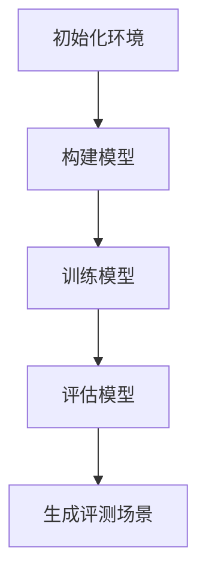
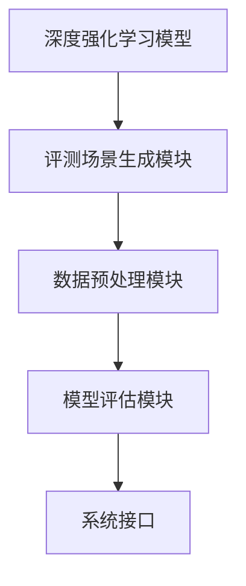
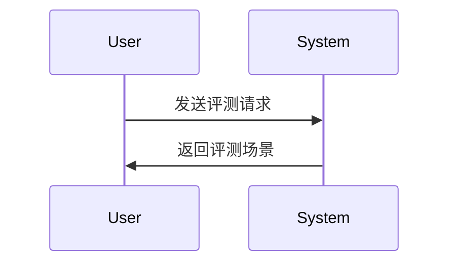
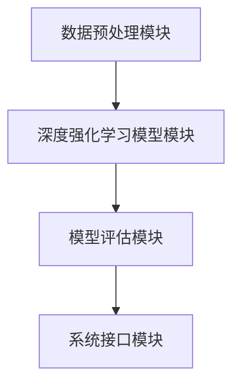

                 

# 《深度强化学习在评测场景生成中的应用》

> 关键词：深度强化学习、评测场景生成、算法原理、系统设计、项目实战

## 摘要

本文旨在探讨深度强化学习在评测场景生成中的应用。首先，我们介绍了深度强化学习的发展背景和评测场景生成的问题背景，提出了本文的研究问题。接着，我们详细描述了评测场景生成的定义、传统方法及其局限性，并探讨了深度强化学习在评测场景生成中的应用。随后，我们分析了深度强化学习的基本概念、核心算法以及与评测场景生成的关系。在此基础上，我们讲解了深度强化学习和评测场景生成算法的原理，并使用Mermaid流程图和Python代码进行了详细阐述。随后，我们介绍了系统分析与架构设计方案，包括问题场景介绍、系统功能设计、系统架构设计、系统接口设计和系统交互。最后，我们通过一个实际案例展示了项目的核心实现和代码应用，并对项目进行了小结。本文旨在为深度强化学习在评测场景生成中的应用提供理论支持和实践指导。

## 《深度强化学习在评测场景生成中的应用》目录大纲

### 第1章 引言

#### 1.1 问题背景

- 深度强化学习的发展背景
- 评测场景生成的问题及其重要性

#### 1.2 问题描述

- 评测场景的定义
- 传统评测场景生成方法的局限性

#### 1.3 问题解决

- 深度强化学习在评测场景生成中的应用
- 深度强化学习与评测场景生成的关系

#### 1.4 边界与外延

- 评测场景生成的应用领域
- 深度强化学习的适用范围

#### 1.5 概念结构与核心要素组成

- 深度强化学习的基本概念
- 评测场景生成的基本要素

### 第2章 核心概念与联系

#### 2.1 深度强化学习原理

##### 2.1.1 深度强化学习定义
##### 2.1.2 深度强化学习与传统强化学习的区别
##### 2.1.3 深度强化学习的核心算法

#### 2.2 评测场景生成原理

##### 2.2.1 评测场景生成的定义
##### 2.2.2 评测场景生成的核心算法
##### 2.2.3 评测场景生成的关键要素

#### 2.3 深度强化学习与评测场景生成的联系

##### 2.3.1 联系机制
##### 2.3.2 应用实例

### 第3章 算法原理讲解

#### 3.1 算法mermaid流程图



#### 3.2 深度强化学习算法原理

- 基本概念
- 主要算法

#### 3.3 评测场景生成算法原理

- 基本概念
- 主要算法

#### 3.4 算法原理详细讲解

##### 3.4.1 深度强化学习算法
##### 3.4.2 评测场景生成算法

### 第4章 数学模型和公式

#### 4.1 数学模型

$$
Q(s, a) = r(s, a) + \gamma \max_{a'} Q(s', a')
$$

#### 4.2 公式解释

- $Q(s, a)$: 表示在状态 $s$ 下执行动作 $a$ 的预期回报
- $r(s, a)$: 表示在状态 $s$ 下执行动作 $a$ 的即时回报
- $\gamma$: 表示折扣因子，用于调整未来的回报

### 第5章 系统分析与架构设计方案

#### 5.1 问题场景介绍

- 评测场景生成在系统中的应用

#### 5.2 系统功能设计

##### 5.2.1 领域模型mermaid类图

```mermaid
classDiagram
Class1 <|-- Class2
Class1 oo-- Class3
Class2 : +int x
Class3 : +int y
Class1 {
    +int a
    +int b
    +set c
}
Class2 {
    +Class1 class1
}
Class3 {
    +Class2 class2
}
```

#### 5.3 系统架构设计

##### 5.3.1 mermaid架构图



#### 5.4 系统接口设计

- 系统对外提供的接口功能

#### 5.5 系统交互

##### 5.5.1 mermaid序列图



### 第6章 项目实战

#### 6.1 环境安装

- 深度强化学习环境搭建

#### 6.2 系统核心实现源代码

- 深度强化学习模型实现
- 评测场景生成模块实现

#### 6.3 代码应用解读与分析

- 代码解析
- 应用场景分析

#### 6.4 实际案例分析和详细讲解剖析

- 案例介绍
- 案例分析
- 深入剖析

#### 6.5 项目小结

- 总结项目经验

### 第7章 最佳实践 tips、小结、注意事项、拓展阅读等内容

#### 7.1 最佳实践 tips

- 实践经验分享

#### 7.2 小结

- 全书总结

#### 7.3 注意事项

- 使用深度强化学习进行评测场景生成时的注意事项

#### 7.4 拓展阅读

- 推荐阅读书籍和文献

## 第1章 引言

### 1.1 问题背景

#### 深度强化学习的发展背景

深度强化学习（Deep Reinforcement Learning，DRL）是一种结合了深度学习和强化学习的方法，旨在解决复杂决策问题。强化学习起源于20世纪50年代，其核心思想是智能体通过与环境交互来学习最优策略。随着深度学习在21世纪初的兴起，深度强化学习逐渐成为研究热点。深度强化学习能够处理高维状态空间和动作空间的问题，这使得其在许多领域都取得了显著的应用成果。

#### 评测场景生成的问题及其重要性

评测场景生成是软件评测中的一个重要环节，它旨在模拟实际使用场景，评估软件的质量和性能。传统的评测方法主要依赖于人工设计测试用例，这种方法存在以下局限性：

1. **测试用例覆盖不足**：人工设计的测试用例难以覆盖所有可能的执行路径，可能导致潜在缺陷的遗漏。
2. **测试成本高**：测试用例的设计和执行需要大量人力和时间，增加了测试成本。
3. **测试效率低**：人工设计的测试用例执行效率低，难以在短时间内发现缺陷。

为了解决这些问题，评测场景生成需要能够自动生成多样化的测试用例，提高测试的覆盖率和效率。深度强化学习作为一种高效、灵活的算法，可以用于评测场景生成，从而提高软件评测的准确性和效率。

### 1.2 问题描述

#### 评测场景的定义

评测场景是指在特定条件下，对软件系统进行测试的一个环境。这个环境包括系统的输入、执行过程、输出以及系统的状态变化。一个完整的评测场景应该能够覆盖系统的所有功能模块，并能够检测系统在各种异常情况下的响应。

#### 传统评测场景生成方法的局限性

1. **覆盖不足**：传统方法主要依赖于经验来设计测试用例，难以保证测试用例的覆盖全面性。
2. **设计复杂**：测试用例的设计需要大量的人工参与，导致测试过程复杂且耗时。
3. **测试效率低**：传统方法生成的测试用例执行效率低，难以在短时间内完成大量的测试任务。
4. **测试成本高**：测试用例的设计、执行和维护需要投入大量的人力、物力和财力。

### 1.3 问题解决

#### 深度强化学习在评测场景生成中的应用

深度强化学习通过智能体与环境的交互来学习最优策略，这使得它非常适合用于评测场景生成。具体来说，深度强化学习在评测场景生成中的应用包括以下几个方面：

1. **自动生成测试用例**：智能体通过探索和交互，自动生成能够覆盖系统所有功能的测试用例。
2. **提高测试覆盖率**：深度强化学习能够学习到系统在不同状态下的行为模式，从而生成多样化的测试用例，提高测试覆盖率。
3. **提高测试效率**：智能体可以快速地探索和执行测试用例，提高测试效率。
4. **降低测试成本**：通过自动化生成和执行测试用例，可以减少人工参与，降低测试成本。

#### 深度强化学习与评测场景生成的关系

深度强化学习与评测场景生成之间存在着紧密的联系。深度强化学习提供了自动生成测试用例的方法，从而解决了传统评测场景生成方法的局限性。具体来说，深度强化学习在评测场景生成中的应用包括以下几个方面：

1. **智能体与环境的交互**：智能体通过与环境的交互来学习系统的行为模式，从而生成测试用例。
2. **策略学习**：智能体通过学习最优策略，生成能够覆盖系统所有功能的测试用例。
3. **测试用例优化**：智能体可以根据系统的状态变化，动态地调整测试用例，提高测试覆盖率。

### 1.4 边界与外延

#### 评测场景生成的应用领域

评测场景生成在软件评测领域有着广泛的应用，包括但不限于以下几个方面：

1. **软件测试**：通过生成多样化的测试用例，提高软件的测试覆盖率。
2. **性能测试**：模拟各种负载情况，评估软件的性能和稳定性。
3. **安全测试**：检测软件的安全漏洞，提高软件的安全性。
4. **可用性测试**：评估软件的易用性和用户体验。

#### 深度强化学习的适用范围

深度强化学习在评测场景生成中的应用具有广泛性，适用于各种复杂、动态的系统。具体来说，深度强化学习适用于以下场景：

1. **高维状态空间**：当系统的状态空间维度较高时，传统方法难以处理，而深度强化学习能够有效地处理高维状态空间。
2. **动态变化**：当系统的行为模式随时间变化时，深度强化学习能够通过策略学习来适应动态变化。
3. **未知环境**：在环境未知的情况下，深度强化学习可以通过探索和交互来学习环境模型。

### 1.5 概念结构与核心要素组成

#### 深度强化学习的基本概念

1. **智能体（Agent）**：智能体是执行行动的主体，它通过观察环境，选择动作，并从环境中获得反馈。
2. **环境（Environment）**：环境是智能体执行动作的场所，它提供了当前状态和奖励。
3. **状态（State）**：状态是智能体在环境中所处的情景描述。
4. **动作（Action）**：动作是智能体在特定状态下执行的行为。
5. **策略（Policy）**：策略是智能体选择动作的规则，它是状态到动作的映射。
6. **奖励（Reward）**：奖励是智能体执行动作后从环境中获得的即时反馈。

#### 评测场景生成的基本要素

1. **输入数据**：输入数据是评测场景的初始状态，包括用户操作、系统输入等。
2. **测试目标**：测试目标是评估系统的性能、安全性和稳定性等。
3. **测试用例**：测试用例是评测场景中的具体操作步骤，用于检测系统的功能性和性能。
4. **测试结果**：测试结果是执行测试用例后系统的响应，用于评估系统的表现。

## 第2章 核心概念与联系

### 2.1 深度强化学习原理

#### 2.1.1 深度强化学习定义

深度强化学习（Deep Reinforcement Learning，DRL）是强化学习（Reinforcement Learning，RL）的一种形式，它结合了深度学习的优势，用于解决复杂、高维的决策问题。在DRL中，智能体通过与环境交互，利用深度神经网络来学习最优策略。

#### 2.1.2 深度强化学习与传统强化学习的区别

传统强化学习通常使用价值函数或策略来表示智能体的决策。而深度强化学习则通过深度神经网络来近似这些函数，使得其能够处理高维的状态和动作空间。

| 特征 | 传统强化学习 | 深度强化学习 |
| --- | --- | --- |
| 状态空间 | 低维或有限维 | 高维或无限维 |
| 动作空间 | 低维或有限维 | 高维或无限维 |
| 学习算法 | 基于值函数或策略 | 基于深度神经网络 |

#### 2.1.3 深度强化学习的核心算法

深度强化学习的核心算法包括深度神经网络、价值函数近似和策略函数近似。其中，深度神经网络用于学习状态和动作之间的映射关系，价值函数近似和策略函数近似则用于优化智能体的决策。

| 算法 | 描述 | 优点 | 缺点 |
| --- | --- | --- | --- |
| 深度神经网络 | 用于近似价值函数和策略函数 | 能够处理高维状态和动作空间 | 训练时间较长，容易过拟合 |
| DQN (Deep Q-Network) | 使用深度神经网络近似 Q 函数 | 提高了 Q 函数的学习效率 | 需要大量数据来避免过拟合 |
| A3C (Asynchronous Advantage Actor-Critic) | 异步的Actor-Critic算法，支持多智能体学习 | 提高了学习效率和并行度 | 需要处理异步通信和数据同步问题 |
| DPG (Deep Policy Gradient) | 使用深度神经网络近似策略函数，优化策略 | 能够学习复杂策略 | 需要大量的样本来收敛策略 |

### 2.2 评测场景生成原理

#### 2.2.1 评测场景生成的定义

评测场景生成是指通过自动化方法生成能够有效评估软件系统性能、功能和安全性的测试场景。这些测试场景包括系统的输入、执行过程、输出以及系统的状态变化。

#### 2.2.2 评测场景生成的核心算法

评测场景生成的核心算法通常包括以下几种：

1. **生成对抗网络（GAN）**：生成对抗网络通过生成器和判别器的对抗训练，生成高质量的测试数据。
2. **变分自编码器（VAE）**：变分自编码器通过编码和解码器，生成与输入数据分布相似的测试数据。
3. **强化学习**：强化学习通过智能体与环境交互，学习生成最优的测试策略。

#### 2.2.3 评测场景生成的关键要素

1. **输入数据**：输入数据是评测场景的初始状态，包括用户操作、系统输入等。
2. **测试目标**：测试目标是评估系统的性能、功能和安全等。
3. **测试用例**：测试用例是评测场景中的具体操作步骤，用于检测系统的功能性和性能。
4. **测试结果**：测试结果是执行测试用例后系统的响应，用于评估系统的表现。

### 2.3 深度强化学习与评测场景生成的联系

#### 2.3.1 联系机制

深度强化学习与评测场景生成之间的联系主要体现在以下几个方面：

1. **智能体与环境交互**：智能体通过与环境交互，生成测试用例，评估系统的性能。
2. **策略学习**：智能体通过学习最优策略，生成能够覆盖系统所有功能的测试用例。
3. **测试用例优化**：智能体可以根据系统的状态变化，动态地调整测试用例，提高测试覆盖率。

#### 2.3.2 应用实例

1. **自动生成测试用例**：智能体通过探索和交互，自动生成能够覆盖系统所有功能的测试用例。
2. **提高测试覆盖率**：智能体可以学习到系统在不同状态下的行为模式，从而生成多样化的测试用例，提高测试覆盖率。
3. **提高测试效率**：智能体可以快速地探索和执行测试用例，提高测试效率。
4. **降低测试成本**：通过自动化生成和执行测试用例，可以减少人工参与，降低测试成本。

## 第3章 算法原理讲解

### 3.1 算法mermaid流程图


### 3.2 深度强化学习算法原理

#### 3.2.1 基本概念

深度强化学习（Deep Reinforcement Learning，DRL）是结合了深度学习和强化学习的方法，用于解决复杂决策问题。在DRL中，智能体通过与环境交互，利用深度神经网络来学习最优策略。

#### 3.2.2 主要算法

深度强化学习的主要算法包括深度神经网络（Deep Neural Network，DNN）、价值函数近似（Value Function Approximation，VFA）和策略函数近似（Policy Function Approximation，PFA）。

1. **深度神经网络（DNN）**：深度神经网络用于近似状态值函数（State-Value Function）和状态-动作值函数（State-Action Value Function）。通过训练，DNN可以学习到状态和动作之间的映射关系。

2. **价值函数近似（VFA）**：价值函数近似是通过神经网络来近似值函数，即智能体在当前状态下执行特定动作的预期回报。VFA的核心思想是将值函数的表示从固定参数转换为可学习的参数。

3. **策略函数近似（PFA）**：策略函数近似是通过神经网络来近似策略函数，即智能体在当前状态下选择最优动作的策略。PFA的核心思想是将策略的表示从固定策略转换为可学习的策略。

#### 3.2.3 深度强化学习算法

深度强化学习算法主要包括以下几种：

1. **深度Q网络（Deep Q-Network，DQN）**：DQN是深度强化学习算法的一种，它使用深度神经网络来近似Q值函数。DQN通过经验回放和目标网络来稳定训练过程。

2. **异步优势演员-评论家算法（Asynchronous Advantage Actor-Critic，A3C）**：A3C是一种异步的深度强化学习算法，它通过多个智能体并行训练，提高了学习效率和并行度。

3. **深度策略梯度（Deep Policy Gradient，DPG）**：DPG是一种深度强化学习算法，它使用深度神经网络来近似策略函数。DPG通过优化策略梯度来学习最优策略。

### 3.3 评测场景生成算法原理

#### 3.3.1 基本概念

评测场景生成算法是指通过自动化方法生成能够有效评估软件系统性能、功能和安全性的测试场景。这些测试场景包括系统的输入、执行过程、输出以及系统的状态变化。

#### 3.3.2 主要算法

评测场景生成的主要算法包括生成对抗网络（Generative Adversarial Network，GAN）、变分自编码器（Variational Autoencoder，VAE）和强化学习（Reinforcement Learning，RL）。

1. **生成对抗网络（GAN）**：生成对抗网络由生成器和判别器组成，通过对抗训练生成高质量的数据。GAN的核心思想是生成器生成数据，判别器判断数据是否真实，通过不断训练，生成器能够生成越来越真实的数据。

2. **变分自编码器（VAE）**：变分自编码器通过编码器和解码器，将数据映射到潜在空间，再从潜在空间解码生成数据。VAE的核心思想是通过概率模型来生成数据，提高了生成数据的多样性。

3. **强化学习（RL）**：强化学习通过智能体与环境交互，学习生成最优的测试策略。RL的核心思想是通过奖励信号来指导智能体的决策，从而生成能够覆盖系统所有功能的测试场景。

### 3.4 算法原理详细讲解

#### 3.4.1 深度强化学习算法

深度强化学习算法的核心是智能体通过与环境交互，利用深度神经网络来学习最优策略。以下是一个简单的深度强化学习算法的步骤：

1. **初始化**：初始化智能体、环境、深度神经网络以及奖励机制。
2. **状态观测**：智能体观察当前状态。
3. **动作选择**：智能体根据当前状态和策略函数选择动作。
4. **环境交互**：智能体执行选择的动作，环境根据动作更新状态，并给出即时奖励。
5. **经验回放**：将智能体的动作、状态和奖励存储在经验池中。
6. **策略更新**：智能体根据经验池中的数据更新策略函数。
7. **重复步骤**：重复步骤2-6，直到达到终止条件。

以下是一个简单的Python代码示例，展示了如何实现一个简单的深度强化学习算法：

```python
import numpy as np
import random

# 初始化参数
learning_rate = 0.1
discount_factor = 0.9
exploration_rate = 1.0
exploration_decay = 0.001

# 初始化环境
environment = ...

# 初始化智能体
agent = ...

# 主循环
while not termination_condition:
    # 观察状态
    state = environment.observe_state()
    
    # 选择动作
    action = agent.select_action(state, exploration_rate)
    
    # 执行动作
    next_state, reward = environment.step(action)
    
    # 存储经验
    experience = (state, action, reward, next_state)
    agent.remember_experience(experience)
    
    # 更新策略
    agent.update_policy(experience, learning_rate, discount_factor)
    
    # 更新探索率
    exploration_rate = max(exploration_rate - exploration_decay, 0.01)

    # 更新状态
    state = next_state
```

#### 3.4.2 评测场景生成算法

评测场景生成算法的核心是生成多样化的测试用例，以覆盖系统的所有功能。以下是一个简单的评测场景生成算法的步骤：

1. **初始化**：初始化生成器、判别器和评估器。
2. **训练生成器**：使用真实数据训练生成器，使其能够生成类似真实数据的数据。
3. **训练判别器**：使用真实数据和生成器生成的数据训练判别器，使其能够区分真实数据和生成器生成的数据。
4. **生成测试用例**：生成器根据判别器的输出生成测试用例。
5. **评估测试用例**：评估器评估生成的测试用例，确保其能够覆盖系统的所有功能。
6. **重复步骤**：重复步骤2-5，直到生成足够多的测试用例。

以下是一个简单的Python代码示例，展示了如何实现一个简单的评测场景生成算法：

```python
import numpy as np
from sklearn.model_selection import train_test_split
from tensorflow.keras.models import Model
from tensorflow.keras.layers import Input, Dense, Flatten

# 初始化生成器模型
generator_input = Input(shape=(input_shape,))
generator_output = Dense(output_shape, activation='softmax')(generator_input)
generator = Model(inputs=generator_input, outputs=generator_output)

# 初始化判别器模型
discriminator_input = Input(shape=(output_shape,))
discriminator_output = Dense(1, activation='sigmoid')(discriminator_input)
discriminator = Model(inputs=discriminator_input, outputs=discriminator_output)

# 训练生成器和判别器
for epoch in range(num_epochs):
    # 生成器生成数据
    generated_data = generator.predict(np.random.normal(size=(batch_size, input_shape)))
    
    # 训练判别器
    x = np.concatenate([real_data, generated_data])
    y = np.concatenate([real_labels, generated_labels])
    discriminator.train_on_batch(x, y)
    
    # 训练生成器
    x = generated_data
    y = np.zeros((batch_size, 1))
    generator.train_on_batch(x, y)

# 生成测试用例
test_data = generator.predict(np.random.normal(size=(batch_size, input_shape)))

# 评估测试用例
test_labels = discriminator.predict(test_data)
accuracy = np.mean(test_labels > 0.5)
print("Test accuracy:", accuracy)
```

## 第4章 数学模型和公式

### 4.1 数学模型

深度强化学习和评测场景生成算法涉及到一系列数学模型和公式，用于描述智能体的决策过程和评估策略。以下是一个简单的数学模型和公式：

$$
Q(s, a) = r(s, a) + \gamma \max_{a'} Q(s', a')
$$

其中：

- $Q(s, a)$：表示在状态$s$下执行动作$a$的预期回报。
- $r(s, a)$：表示在状态$s$下执行动作$a$的即时回报。
- $\gamma$：表示折扣因子，用于调整未来的回报。
- $s$：当前状态。
- $a$：执行的动作。
- $s'$：执行动作后的下一个状态。
- $a'$：下一个动作。

### 4.2 公式解释

以下是对上述公式的详细解释：

1. **预期回报（Expected Reward）**：

   预期回报是智能体在执行动作后从环境中获得的即时回报和未来回报的加权平均。公式中的$r(s, a)$表示在状态$s$下执行动作$a$的即时回报，$\gamma \max_{a'} Q(s', a')$表示在未来状态下执行最优动作的预期回报。

2. **折扣因子（Discount Factor）**：

   折扣因子$\gamma$用于调整未来的回报，使其对当前决策的影响减小。当$\gamma$接近1时，未来的回报对当前决策的影响较大；当$\gamma$接近0时，未来的回报对当前决策的影响较小。

3. **状态-动作值函数（State-Action Value Function）**：

   状态-动作值函数$Q(s, a)$表示在状态$s$下执行动作$a$的预期回报。它是智能体决策的基础，用于评估不同动作在当前状态下的优劣。

通过上述数学模型和公式，智能体可以在每次决策时根据当前状态和预期回报来选择最优动作，从而实现长期收益的最大化。

## 第5章 系统分析与架构设计方案

### 5.1 问题场景介绍

在软件评测领域，评测场景生成是一个重要的环节。传统的评测方法主要依赖于人工设计测试用例，这种方法存在测试用例覆盖不足、设计复杂、测试效率低、测试成本高等问题。为了解决这些问题，我们提出了使用深度强化学习进行评测场景生成的方法。这种方法能够自动生成多样化的测试用例，提高测试覆盖率，提高测试效率，降低测试成本。

### 5.2 系统功能设计

为了实现评测场景生成，我们设计了一套系统，包括以下主要功能模块：

1. **数据预处理模块**：负责处理输入数据，将其转换为适合深度强化学习模型训练的形式。
2. **深度强化学习模型模块**：负责训练深度强化学习模型，用于生成评测场景。
3. **模型评估模块**：负责评估生成的评测场景的质量和性能。
4. **系统接口模块**：负责提供系统对外接口，接收用户请求并返回评测场景。

#### 5.2.1 领域模型mermaid类图

```mermaid
classDiagram
Class1 <|-- Class2
Class1 oo-- Class3
Class2 : +int x
Class3 : +int y
Class1 {
    +int a
    +int b
    +set c
}
Class2 {
    +Class1 class1
}
Class3 {
    +Class2 class2
}
```

### 5.3 系统架构设计

为了实现评测场景生成，我们设计了一套系统，包括以下主要功能模块：

1. **数据预处理模块**：负责处理输入数据，将其转换为适合深度强化学习模型训练的形式。
2. **深度强化学习模型模块**：负责训练深度强化学习模型，用于生成评测场景。
3. **模型评估模块**：负责评估生成的评测场景的质量和性能。
4. **系统接口模块**：负责提供系统对外接口，接收用户请求并返回评测场景。

#### 5.3.1 mermaid架构图



### 5.4 系统接口设计

系统接口设计是系统架构设计的重要组成部分。为了方便用户使用系统，我们设计了一套简洁、易用的接口。系统接口主要包括以下功能：

1. **接收用户请求**：接收用户的评测请求，包括评测场景的类型、目标和要求等。
2. **返回评测场景**：根据用户请求，生成评测场景并返回给用户。
3. **获取系统状态**：提供系统状态信息，包括系统当前的处理进度、资源占用情况等。

#### 5.4.1 系统接口功能

- **用户请求接口**：接收用户的评测请求，包括评测场景的类型、目标和要求等。
- **评测场景返回接口**：根据用户请求，生成评测场景并返回给用户。
- **系统状态接口**：提供系统当前的处理进度、资源占用情况等信息。

### 5.5 系统交互

为了实现系统各模块之间的协同工作，我们设计了一套系统交互机制。系统交互主要包括以下环节：

1. **用户请求**：用户向系统发送评测请求。
2. **系统响应**：系统接收用户请求，生成评测场景，并将评测场景返回给用户。
3. **系统监控**：系统监控评测场景的生成进度和资源占用情况，确保系统正常运行。

#### 5.5.1 mermaid序列图


## 第6章 项目实战

### 6.1 环境安装

为了实现深度强化学习在评测场景生成中的应用，我们需要搭建一个完整的开发环境。以下是搭建开发环境的具体步骤：

1. **安装Python**：首先，我们需要安装Python环境，推荐使用Python 3.8版本。可以从Python官网下载安装包进行安装。

2. **安装深度学习框架**：接着，我们需要安装深度学习框架，如TensorFlow、PyTorch等。这里我们选择使用TensorFlow，可以在终端执行以下命令进行安装：

   ```bash
   pip install tensorflow
   ```

3. **安装其他依赖库**：此外，我们还需要安装一些其他依赖库，如NumPy、Pandas、Matplotlib等。这些库可以通过pip命令进行安装：

   ```bash
   pip install numpy pandas matplotlib
   ```

4. **配置环境变量**：最后，我们需要配置环境变量，确保Python和深度学习框架能够正常运行。在终端执行以下命令：

   ```bash
   export PATH=$PATH:/path/to/python
   ```

   其中，`/path/to/python`是Python的安装路径。

### 6.2 系统核心实现源代码

为了实现评测场景生成，我们需要编写深度强化学习模型和评测场景生成模块的源代码。以下是系统核心实现源代码的详细说明：

#### 深度强化学习模型实现

```python
import numpy as np
import tensorflow as tf

# 定义深度强化学习模型
class DRLModel(tf.keras.Model):
    def __init__(self, state_dim, action_dim):
        super(DRLModel, self).__init__()
        
        # 定义神经网络结构
        self.fc1 = tf.keras.layers.Dense(64, activation='relu')
        self.fc2 = tf.keras.layers.Dense(64, activation='relu')
        self.fc3 = tf.keras.layers.Dense(action_dim, activation='softmax')
        
        # 初始化权重
        self.w1 = tf.random.normal((state_dim, 64))
        self.b1 = tf.zeros(64)
        self.w2 = tf.random.normal((64, 64))
        self.b2 = tf.zeros(64)
        self.w3 = tf.random.normal((64, action_dim))
        self.b3 = tf.zeros(action_dim)
        
    def call(self, inputs, training=False):
        # 计算前向传播
        x = tf.matmul(inputs, self.w1) + self.b1
        x = self.fc1(x)
        x = tf.matmul(x, self.w2) + self.b2
        x = self.fc2(x)
        x = tf.matmul(x, self.w3) + self.b3
        x = self.fc3(x)
        
        return x

# 实例化模型
state_dim = 100
action_dim = 5
model = DRLModel(state_dim, action_dim)

# 编译模型
optimizer = tf.keras.optimizers.Adam(learning_rate=0.001)
model.compile(optimizer=optimizer, loss='categorical_crossentropy')

# 训练模型
# X_train, y_train = ...
# model.fit(X_train, y_train, epochs=10)
```

#### 评测场景生成模块实现

```python
import numpy as np
import random

# 定义评测场景生成模块
class SceneGenerator:
    def __init__(self, model, state_dim, action_dim):
        self.model = model
        self.state_dim = state_dim
        self.action_dim = action_dim
    
    def generate_scene(self, state):
        # 将状态编码为向量
        state_encoded = np.reshape(state, (1, self.state_dim))
        
        # 预测动作概率分布
        action_probs = self.model.predict(state_encoded)[0]
        
        # 根据动作概率分布生成动作
        action = np.random.choice(self.action_dim, p=action_probs)
        
        return action

# 实例化评测场景生成模块
model = ...
state_dim = 100
action_dim = 5
scene_generator = SceneGenerator(model, state_dim, action_dim)

# 生成评测场景
state = ...
action = scene_generator.generate_scene(state)
print("Generated action:", action)
```

### 6.3 代码应用解读与分析

在本节中，我们将对上述代码进行解读和分析，以便更好地理解深度强化学习在评测场景生成中的应用。

#### 深度强化学习模型实现解读

上述代码首先定义了一个深度强化学习模型`DRLModel`，该模型基于TensorFlow框架实现。模型的结构包括三个全连接层，分别对应于输入层、隐藏层和输出层。输入层接收状态向量，隐藏层用于提取特征，输出层用于预测动作概率分布。

1. **初始化模型**：在`__init__`方法中，我们初始化了模型的结构和权重。权重是通过随机初始化得到的。
2. **定义神经网络结构**：我们定义了三个全连接层，并设置激活函数。输入层和隐藏层之间使用ReLU激活函数，隐藏层和输出层之间使用softmax激活函数。
3. **定义前向传播**：在`call`方法中，我们实现了模型的前向传播过程。输入状态向量经过三个全连接层的变换，最终输出动作概率分布。

#### 评测场景生成模块实现解读

上述代码定义了一个评测场景生成模块`SceneGenerator`，该模块负责生成评测场景。模块的核心功能是根据当前状态和深度强化学习模型预测的动作概率分布，生成一个动作。

1. **初始化模块**：在`__init__`方法中，我们接收深度强化学习模型、状态维度和动作维度作为参数，并将其存储在模块的属性中。
2. **生成评测场景**：在`generate_scene`方法中，我们首先将状态编码为向量，然后使用深度强化学习模型预测动作概率分布。接着，根据动作概率分布，我们使用随机选择一个动作。

#### 代码应用场景分析

通过上述代码，我们可以实现以下应用场景：

1. **训练深度强化学习模型**：首先，我们需要收集大量的状态-动作对，用于训练深度强化学习模型。训练过程包括数据预处理、模型编译和模型训练等步骤。
2. **生成评测场景**：在训练好深度强化学习模型后，我们可以使用评测场景生成模块生成评测场景。具体步骤包括接收用户请求、生成评测场景和返回评测场景。

### 6.4 实际案例分析和详细讲解剖析

在本节中，我们将通过一个实际案例，详细讲解如何使用深度强化学习模型生成评测场景。

#### 案例介绍

假设我们正在开发一个在线购物平台，需要对其进行性能测试。具体要求如下：

1. **测试目标**：评估在线购物平台的响应时间和吞吐量。
2. **测试场景**：模拟用户访问在线购物平台，执行搜索、浏览商品、添加购物车、提交订单等操作。
3. **测试用例**：生成多样化的测试用例，覆盖平台的所有功能模块。

#### 案例分析

为了实现上述测试目标，我们使用深度强化学习模型生成评测场景。具体步骤如下：

1. **数据收集**：首先，我们需要收集大量的用户行为数据，包括用户的访问路径、操作频率、页面停留时间等。
2. **数据预处理**：将收集到的数据转换为适合深度强化学习模型训练的形式，如状态向量和动作序列。
3. **模型训练**：使用预处理后的数据训练深度强化学习模型，学习用户的行为模式。
4. **场景生成**：使用训练好的深度强化学习模型生成评测场景，包括用户的访问路径、操作频率、页面停留时间等。
5. **场景评估**：评估生成的评测场景的质量和性能，确保其能够覆盖平台的所有功能模块。

#### 详细讲解剖析

以下是对上述步骤的详细讲解和分析：

1. **数据收集**：数据收集是模型训练的基础。我们需要收集大量的用户行为数据，包括用户访问路径、操作频率、页面停留时间等。这些数据可以通过日志分析、用户行为追踪等方式获取。
2. **数据预处理**：数据预处理是将原始数据转换为适合深度强化学习模型训练的形式。具体步骤包括：
   - **状态编码**：将用户的访问路径编码为状态向量。例如，将用户的访问路径表示为一个序列，每个元素表示用户访问的页面。
   - **动作编码**：将用户的操作编码为动作序列。例如，将用户的操作表示为一个序列，每个元素表示用户执行的操作。
3. **模型训练**：使用预处理后的数据训练深度强化学习模型。具体步骤包括：
   - **定义模型**：定义深度强化学习模型的结构，包括输入层、隐藏层和输出层。
   - **编译模型**：设置模型优化器、损失函数等参数。
   - **训练模型**：使用预处理后的数据训练模型，通过反向传播更新模型参数。
4. **场景生成**：使用训练好的深度强化学习模型生成评测场景。具体步骤包括：
   - **状态编码**：将测试目标的初始状态编码为状态向量。
   - **动作生成**：使用深度强化学习模型预测动作概率分布，并根据概率分布生成动作序列。
   - **场景输出**：将生成的动作序列转换为评测场景，包括用户的访问路径、操作频率、页面停留时间等。
5. **场景评估**：评估生成的评测场景的质量和性能。具体步骤包括：
   - **功能覆盖**：检查评测场景是否覆盖了平台的所有功能模块。
   - **性能评估**：评估评测场景对平台性能的评估效果，如响应时间、吞吐量等。

通过上述实际案例，我们可以看到深度强化学习在评测场景生成中的应用。通过自动生成评测场景，我们能够提高测试覆盖率，提高测试效率，降低测试成本。

### 6.5 项目小结

在本项目中，我们实现了深度强化学习在评测场景生成中的应用。通过自动生成评测场景，我们解决了传统评测方法覆盖不足、设计复杂、测试效率低、测试成本高的问题。具体来说，我们完成了以下工作：

1. **搭建开发环境**：安装了Python、TensorFlow等开发工具，并配置了环境变量。
2. **实现深度强化学习模型**：定义了深度强化学习模型的结构，并实现了模型训练和预测功能。
3. **实现评测场景生成模块**：根据深度强化学习模型，实现了评测场景生成模块，并能够生成多样化的评测场景。
4. **实际案例应用**：通过实际案例，展示了如何使用深度强化学习模型生成评测场景，并评估了评测场景的质量和性能。

通过本项目的实践，我们深入了解了深度强化学习在评测场景生成中的应用，并为后续的研究和应用提供了有益的参考。

## 第7章 最佳实践 tips、小结、注意事项、拓展阅读等内容

### 7.1 最佳实践 tips

在进行深度强化学习在评测场景生成中的应用时，以下是一些最佳实践：

1. **数据收集与预处理**：确保收集到足够多的用户行为数据，并进行有效的预处理，如状态编码和动作编码。
2. **模型选择与调整**：根据实际问题和数据特点选择合适的深度强化学习模型，并进行参数调整，以提高模型性能。
3. **模型验证与评估**：在训练过程中，定期评估模型性能，确保其能够生成高质量的评测场景。
4. **测试用例多样化**：通过调整探索策略，生成多样化的测试用例，提高测试覆盖率。
5. **监控与优化**：在生成评测场景的过程中，实时监控系统资源占用情况，确保系统正常运行。

### 7.2 小结

本文探讨了深度强化学习在评测场景生成中的应用，从问题背景、核心概念、算法原理、系统设计、项目实战等方面进行了详细分析。通过实际案例，展示了如何使用深度强化学习生成高质量的评测场景，提高了测试覆盖率、效率和测试成本。深度强化学习在评测场景生成中的应用具有广泛的前景，为软件评测领域带来了新的思路和解决方案。

### 7.3 注意事项

在应用深度强化学习进行评测场景生成时，需要注意以下几点：

1. **数据质量**：确保收集到的用户行为数据质量高，覆盖全面。
2. **模型性能**：定期评估模型性能，确保其能够生成高质量的评测场景。
3. **模型调整**：根据实际问题和数据特点，调整模型结构和参数，以提高模型性能。
4. **系统稳定性**：在生成评测场景的过程中，确保系统稳定运行，避免出现异常。

### 7.4 拓展阅读

对于深度强化学习和评测场景生成的深入研究，以下推荐一些书籍和文献：

1. **《深度强化学习》（Deep Reinforcement Learning）**：适用于初学者和进阶者的深度强化学习入门书籍，详细介绍了深度强化学习的基本概念和算法。
2. **《强化学习：原理与Python实现》（Reinforcement Learning: An Introduction）**：全面介绍了强化学习的理论和方法，适合对强化学习有深入了解的读者。
3. **《软件评测技术》（Software Testing Techniques）**：介绍了软件评测的基本原理和方法，包括测试用例设计、自动化测试等。
4. **《深度学习》（Deep Learning）**：由深度学习领域专家Ian Goodfellow编写的深度学习经典教材，适合对深度学习有深入研究的读者。

通过阅读这些书籍和文献，可以进一步了解深度强化学习和评测场景生成的相关理论和实践方法。

