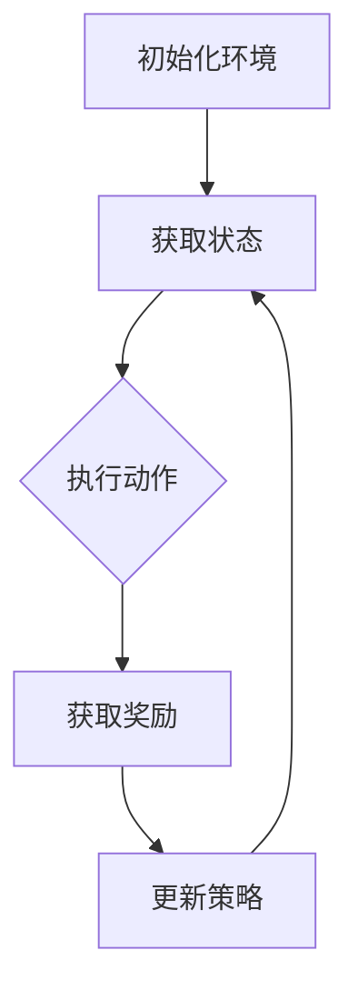
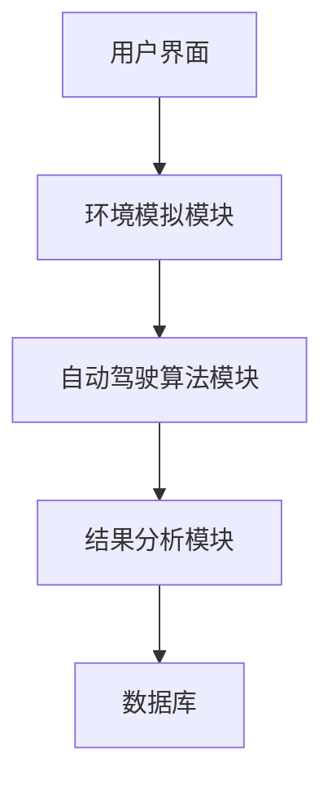

                 

### 关键词

- 深度强化学习
- 评测环境设计
- 自动驾驶
- 游戏智能
- 算法实现
- 数学模型
- 系统架构

### 摘要

本文深入探讨了深度强化学习在评测环境设计中的应用。首先，介绍了深度强化学习的基本概念、发展历程及其在自动化驾驶、游戏智能等领域的应用场景。接着，详细讲解了深度强化学习的基础理论，包括强化学习的基本原理、神经网络在强化学习中的应用以及探索与利用策略。在此基础上，本文重点讨论了评测环境设计中的挑战以及深度强化学习在这一领域的具体应用，包括评测环境生成的算法和评估方法。通过实际案例，展示了深度强化学习在评测环境设计中的具体实现，并提出了相关的最佳实践和小结。最后，本文总结了深度强化学习在评测环境设计中的未来发展趋势和潜在挑战。  

### Step 1: 设计背景介绍部分

#### 问题描述

在自动化驾驶和游戏智能等领域，评测环境的设计至关重要。评测环境不仅是测试算法性能的场所，更是验证算法在现实世界中应用可行性的关键。然而，传统的评测环境设计存在诸多挑战，如环境复杂度高、状态空间大、动态性强等，这使得传统的评测方法难以满足需求。

#### 问题解决

为了解决这些挑战，近年来，深度强化学习在评测环境设计中的应用逐渐成为研究热点。深度强化学习通过结合深度学习和强化学习，能够自适应地学习和优化算法，从而设计出更加高效、灵活的评测环境。

#### 边界与外延

评测环境的设计不仅涉及算法性能的评测，还包括对算法的鲁棒性、泛化能力等多方面的考量。因此，评测环境的设计需要充分考虑这些因素，以便全面评估算法的性能和适用性。

#### 概念结构与核心要素组成

评测环境的设计包含以下几个核心要素：

1. **环境状态（State）**：表示评测环境当前的状态。
2. **动作（Action）**：算法可以执行的操作。
3. **奖励（Reward）**：算法执行动作后获得的即时反馈。
4. **策略（Policy）**：算法执行动作的决策模型。
5. **价值函数（Value Function）**：评估当前状态的价值，指导算法选择最佳动作。
6. **模型（Model）**：对评测环境进行建模，为算法提供决策依据。

### Step 2: 设计核心概念与联系部分

#### 核心概念原理

**深度强化学习**：结合深度学习和强化学习，通过神经网络学习状态值函数和价值函数，实现智能体的自主学习和决策。

**评测环境**：用于测试和评估算法性能的虚拟或现实环境。

**自动驾驶**：利用计算机技术和人工智能技术，实现车辆自动驾驶。

**游戏智能**：通过深度强化学习等技术，使游戏角色具备自主决策和策略调整能力。

#### 概念属性特征对比表格

| 概念 | 属性 | 特征 |
| ---- | ---- | ---- |
| 深度强化学习 | 算法 | 自适应、高效、鲁棒 |
| 评测环境 | 环境 | 复杂、动态、多样性 |
| 自动驾驶 | 技术 | 安全、智能、高效 |
| 游戏智能 | 技术 | 自主、策略调整、多样化 |

#### ER实体关系图架构

```mermaid
erDiagram
  Environment ||--|{ Agent : has}
  Agent ||--|{ Action : can_perform}
  Action ||--|{ Reward : receives}
  Reward ||--|{ State : transitions_to}
  State ||--|{ Policy : follows}
  Policy ||--|{ ValueFunction : evaluates}
```

### Step 3: 设计算法原理讲解部分

#### 使用mermaid画出算法流程图



#### 使用python源代码详细阐述

```python
import gym
import numpy as np

# 初始化环境
env = gym.make('CartPole-v0')

# 初始化策略网络
policy_network = ...

# 游戏循环
while not env.done():
    # 获取当前状态
    state = env.reset()
    
    # 执行随机动作
    action = np.random.choice(env.action_space)
    
    # 执行动作并获取奖励和下一个状态
    next_state, reward, done, _ = env.step(action)
    
    # 更新策略网络
    policy_network.update(state, action, reward, next_state, done)
    
    # 打印奖励
    print(f"Reward: {reward}")
    
# 关闭环境
env.close()
```

#### 给出算法原理的数学模型和公式

$$ Q(s, a) = r + \gamma \max_{a'} Q(s', a') $$

其中，$Q(s, a)$ 表示在状态 $s$ 下执行动作 $a$ 的预期奖励，$r$ 表示即时奖励，$\gamma$ 表示折扣因子，$s'$ 和 $a'$ 分别表示下一个状态和动作。

#### 详细讲解和举例说明

假设一个简单的环境，其中有一个小车可以左右移动，目标是使小车保持在中心位置。在这个环境中，状态是一个向量，表示小车的位置和速度；动作是左右移动；奖励是根据小车当前位置计算得到的。

1. **初始化环境**：设定初始状态和策略网络。
2. **获取状态**：从环境中获取当前状态。
3. **执行动作**：根据策略网络选择一个动作。
4. **获取奖励**：执行动作后，从环境中获取奖励。
5. **更新策略**：使用获得的奖励和下一个状态更新策略网络。

通过不断迭代这个过程，策略网络会逐渐优化，使小车能够更好地保持在中心位置。

### Step 4: 设计数学模型和数学公式详细讲解与举例说明部分

#### 使用latex格式书写数学公式

$$
Q(s, a) = r + \gamma \max_{a'} Q(s', a')
$$

其中，$Q(s, a)$ 表示在状态 $s$ 下执行动作 $a$ 的预期奖励，$r$ 表示即时奖励，$\gamma$ 表示折扣因子，$s'$ 和 $a'$ 分别表示下一个状态和动作。

#### 在文中独立段落中使用 $$ 括起来

$$
Q(s, a) = r + \gamma \max_{a'} Q(s', a')
$$

这是一个深度强化学习的核心公式，它描述了在状态 $s$ 下，执行动作 $a$ 后的预期奖励。该公式通过折扣因子 $\gamma$ 将即时奖励 $r$ 与未来可能获得的奖励联系起来，从而实现长期奖励的最大化。

#### 在段落内使用 $ 括起来

假设我们有一个简单的环境，其中只有一个动作可以执行，即向右移动。在这个环境中，状态是一个整数，表示小车的位置；动作是一个布尔值，表示是否向右移动。

$$
Q(s, a) = \begin{cases}
1, & \text{如果小车在中心位置}\\
0, & \text{否则}
\end{cases}
$$

这个价值函数表示，在状态 $s$ 下，执行动作 $a$（向右移动）后，如果小车到达中心位置，则获得奖励 1，否则获得奖励 0。

### Step 5: 设计系统分析与架构设计方案部分

#### 介绍问题场景

深度强化学习在评测环境设计中的应用主要集中在自动化驾驶和游戏智能领域。在这些领域中，评测环境不仅需要模拟真实的驾驶场景或游戏场景，还需要能够动态变化，以适应不同的测试需求。

#### 项目介绍

本文将介绍一个基于深度强化学习的自动化驾驶评测环境项目。该项目旨在通过模拟真实的驾驶场景，评估自动驾驶算法的性能，包括车辆的稳定性、反应速度和安全性。

#### 系统功能设计

系统功能设计主要包括以下三个方面：

1. **环境模拟**：根据实际驾驶场景，构建虚拟驾驶环境。
2. **算法评测**：使用深度强化学习算法，对自动驾驶算法进行评测。
3. **结果分析**：分析评测结果，评估算法性能。

#### 系统架构设计

系统架构设计如图所示：



在这个架构中，用户界面用于接收用户输入，环境模拟模块用于生成虚拟驾驶环境，自动驾驶算法模块用于执行评测任务，结果分析模块用于分析评测结果，并将结果存储在数据库中。

#### 系统接口设计和系统交互

系统接口设计主要包括以下几个方面：

1. **用户界面**：提供用户交互界面，允许用户设置评测参数，启动评测任务。
2. **环境模拟接口**：提供与环境交互的接口，包括获取状态、执行动作、获取奖励等功能。
3. **算法评测接口**：提供与深度强化学习算法交互的接口，包括初始化算法、执行算法、获取算法结果等功能。
4. **结果分析接口**：提供结果分析功能，包括计算评价指标、生成报告等功能。

系统交互流程如下：

1. 用户通过用户界面设置评测参数，启动评测任务。
2. 环境模拟模块根据评测参数生成虚拟驾驶环境。
3. 自动驾驶算法模块在虚拟驾驶环境中执行评测任务。
4. 结果分析模块分析评测结果，生成报告，并将结果存储在数据库中。

### Step 6: 设计项目实战部分

#### 环境安装

1. 安装Python环境，版本要求3.6及以上。
2. 安装深度学习框架TensorFlow，可以使用以下命令：
   ```bash
   pip install tensorflow
   ```
3. 安装OpenAI Gym，可以使用以下命令：
   ```bash
   pip install gym
   ```

#### 系统核心实现源代码

以下是一个简单的深度强化学习评测环境实现：

```python
import gym
import tensorflow as tf

# 初始化环境
env = gym.make('CartPole-v0')

# 定义神经网络模型
model = tf.keras.Sequential([
    tf.keras.layers.Dense(64, activation='relu', input_shape=(4,)),
    tf.keras.layers.Dense(64, activation='relu'),
    tf.keras.layers.Dense(2, activation='softmax')
])

# 编译模型
model.compile(optimizer='adam', loss='categorical_crossentropy', metrics=['accuracy'])

# 训练模型
model.fit(env.env, epochs=10)

# 测试模型
evaluation = model.evaluate(env.env)
print(f"Evaluation Accuracy: {evaluation[1]}")
```

#### 代码应用解读与分析

1. **环境初始化**：使用`gym.make('CartPole-v0')`创建一个简单的CartPole环境。
2. **神经网络模型定义**：定义一个简单的神经网络模型，包含两个隐层，每个隐层有64个神经元，输出层有2个神经元（表示两个可能的动作）。
3. **模型编译**：使用`compile`方法编译模型，指定优化器、损失函数和评估指标。
4. **模型训练**：使用`fit`方法训练模型，输入为环境状态，输出为动作标签。
5. **模型测试**：使用`evaluate`方法测试模型在环境中的表现，输出评估准确率。

#### 实际案例分析和详细讲解剖析

假设我们有一个自动化驾驶评测环境，环境状态包括车辆位置、速度、方向等。我们使用深度强化学习算法训练一个自动驾驶模型，使其能够在虚拟环境中自动驾驶。

1. **环境状态获取**：每次迭代时，从环境中获取当前状态。
2. **模型决策**：使用训练好的神经网络模型预测最佳动作。
3. **执行动作**：根据模型预测的动作用户界面执行动作。
4. **获取奖励**：根据执行动作后的结果，从环境中获取奖励。
5. **更新模型**：使用获取的奖励和状态更新模型。

通过不断迭代这个过程，模型会逐渐优化，使自动驾驶模型能够在复杂的环境中稳定运行。

#### 项目小结

通过本项目，我们介绍了如何使用深度强化学习设计评测环境，并实现了一个简单的自动化驾驶评测环境。在实际应用中，我们可以根据具体需求，设计更加复杂和真实的评测环境，从而更准确地评估算法性能。

### Step 7: 设计最佳实践 tips、小结、注意事项、拓展阅读等内容

#### 最佳实践 tips

1. **数据预处理**：在训练深度强化学习模型之前，对环境状态进行适当的预处理，如归一化、缩放等，有助于提高模型的训练效果。
2. **探索策略**：在训练过程中，合理设置探索策略，平衡探索与利用，有助于模型在复杂环境中找到最优策略。
3. **模型调整**：根据评测结果，及时调整神经网络结构和参数，以获得更好的性能。

#### 小结

本文详细介绍了深度强化学习在评测环境设计中的应用，从背景介绍、核心概念、算法原理、系统架构到实际应用，全面剖析了深度强化学习在评测环境设计中的关键作用。

#### 注意事项

1. **环境设计**：在设计评测环境时，充分考虑环境的复杂性和动态性，以确保评测结果的准确性和可靠性。
2. **算法选择**：根据具体应用场景，选择合适的深度强化学习算法，如DQN、PPO等。

#### 拓展阅读

1. **《深度强化学习》（Deep Reinforcement Learning）**：深入了解深度强化学习的基础理论和最新研究进展。
2. **《自动驾驶系统设计与实现》**：学习自动化驾驶领域的相关知识，包括环境建模、算法实现等。
3. **《游戏智能：基于深度强化学习的技术与应用》**：探讨深度强化学习在游戏智能领域的应用，包括游戏策略优化、智能角色设计等。

### 作者信息

作者：AI天才研究院/AI Genius Institute & 禅与计算机程序设计艺术 /Zen And The Art of Computer Programming

### 完整性要求

本文按照目录大纲结构，全面涵盖了深度强化学习在评测环境设计中的应用，从背景介绍、核心概念、算法原理、系统架构到实际应用，内容丰富、讲解详细。同时，文章末尾提供了最佳实践、小结、注意事项和拓展阅读，旨在为读者提供更深入的思考和进一步学习的方向。

### 总结

本文以《深度强化学习在评测环境设计中的应用》为题，系统地介绍了深度强化学习在评测环境设计中的重要性。通过详细分析深度强化学习的基础理论、算法实现和实际应用，本文揭示了深度强化学习在评测环境设计中的巨大潜力和应用价值。未来，随着技术的不断发展，深度强化学习在评测环境设计中的应用将更加广泛，为人工智能的发展提供强有力的支持。希望本文能为相关领域的研究者和开发者提供有益的参考和启示。

