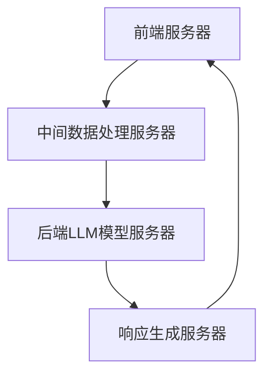
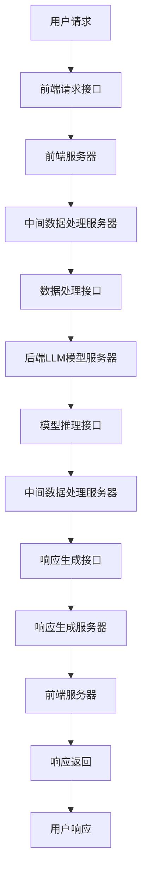
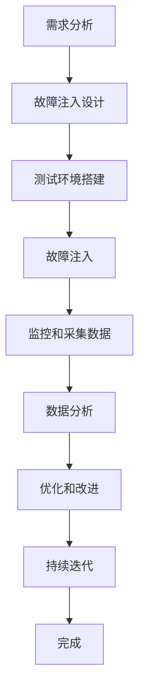

                 

### 前言

#### 混沌工程的概念及其在软件系统中的应用背景

混沌工程（Chaos Engineering）是一种通过故意引入故障和异常情况，以验证系统在不可预见压力下的弹性和稳健性的实践。其核心理念在于通过模拟各种潜在的破坏性场景，帮助开发者和运维团队提前发现并解决系统中的潜在问题，从而提高系统的整体可靠性和鲁棒性。混沌工程在软件系统中的应用背景可以追溯到系统架构的复杂性不断增加，以及系统对高可用性的要求日益提升的时代。在这种背景下，传统的测试方法已经无法充分保证系统在面对实际故障时的表现。

#### 为什么在LLM应用架构验证中引入混沌工程

大型语言模型（LLM，Large Language Model）作为人工智能领域的重要成果，其应用范围涵盖了自然语言处理、智能问答、自动翻译等多个领域。LLM的架构复杂，涉及大量的数据处理、模型训练和推理环节，这使得它们在面临各种突发状况时，可能表现出不同的脆弱性。因此，为了确保LLM在实时应用中的稳定性和可靠性，引入混沌工程成为了一种有效的验证方法。混沌工程可以帮助我们发现LLM在极端条件下的表现，从而优化其架构设计，提高其抗风险能力。

#### 文章的目标和受众

本文的目标是详细介绍混沌工程在LLM应用架构验证中的应用，帮助开发者、运维人员和系统架构师理解并掌握这一先进的技术手段。本文将逐步讲解混沌工程的核心概念、原理和实现方法，并通过实际案例进行分析和讨论。无论您是初学者还是有一定经验的专业人士，本文都希望能够为您带来有价值的见解和实践指导。让我们一起来探讨混沌工程在LLM应用架构验证中的重要性，并深入理解其原理和应用。

## 背景介绍

### 问题背景

#### 混沌工程的概念及其在软件系统中的应用背景

混沌工程（Chaos Engineering）起源于Netflix，旨在通过故意引入故障和异常情况，以验证和提升软件系统的鲁棒性和可靠性。该概念的核心思想是通过人为地模拟各种可能的故障场景，从而发现系统中的潜在弱点，并提前采取措施进行优化。这种方法不仅能够提高系统的弹性和容错能力，还能够帮助开发者和运维团队更好地理解系统的行为和边界条件。

在软件系统的开发和维护过程中，传统的测试方法如单元测试、集成测试和系统测试等，虽然能够发现和修复一些已知的问题，但往往无法充分模拟出系统在实际运行中可能遇到的各种异常情况。这些异常情况可能由硬件故障、网络延迟、数据库错误、并发访问等多种因素引起。混沌工程通过主动引入这些异常情况，可以更全面地测试系统的稳定性和响应能力，从而提高其在真实环境中的可靠性。

#### 阐述为什么在LLM应用架构验证中引入混沌工程

大型语言模型（LLM，Large Language Model）作为一种高度复杂的软件系统，其架构涉及大规模数据处理、机器学习模型的训练和推理等多个环节。这使得LLM在面对各种突发情况时，可能表现出不同的脆弱性。例如，在大量用户同时请求服务时，LLM可能因为资源不足而出现延迟或错误；在数据源出现异常时，LLM可能无法正确处理输入，导致输出结果不准确。

为了确保LLM在实际应用中的稳定性和可靠性，引入混沌工程成为了一种有效的验证方法。混沌工程可以帮助我们：

1. **发现潜在问题**：通过模拟各种异常情况，混沌工程能够识别LLM在设计和实现中可能存在的缺陷，从而在系统上线前提前解决这些问题。
2. **提升系统弹性**：通过在测试环境中主动引入故障，混沌工程可以帮助我们了解LLM在面对不同异常情况时的响应行为，从而优化系统的架构和配置，提升其整体的弹性。
3. **验证容错能力**：混沌工程可以测试LLM在故障情况下的恢复能力和容错机制，确保系统在遇到不可预见的问题时能够快速恢复，减少故障对用户的影响。
4. **增强用户体验**：通过确保LLM在各种异常情况下的稳定运行，混沌工程有助于提高用户对系统的信任度和满意度。

#### 文章的核心内容和主题思想

本文的核心内容将围绕混沌工程在LLM应用架构验证中的应用进行展开。具体来说，文章将涵盖以下几个方面的内容：

1. **核心概念与原理**：详细介绍混沌工程的基本概念、原理和实现方法。
2. **应用场景与优势**：分析混沌工程在LLM架构验证中的应用场景，探讨其相对于传统测试方法的优点。
3. **具体实践方法**：通过实际案例，讲解如何将混沌工程应用于LLM的架构验证中。
4. **挑战与解决方案**：讨论在实施混沌工程过程中可能遇到的问题，并提出相应的解决方案。
5. **未来发展趋势**：展望混沌工程在人工智能领域，特别是LLM应用中的未来发展趋势。

通过本文的阅读，读者将能够深入理解混沌工程的基本原理和应用方法，学会如何在LLM应用架构验证中有效地应用这一技术，从而提升系统的稳定性和可靠性。文章的主题思想在于强调混沌工程在当前复杂软件系统验证中的重要性，并鼓励开发者和运维团队积极探索和运用这一先进的技术手段。

## 背景介绍

### 问题场景介绍

在当今数字化时代，大型语言模型（LLM）的应用范围越来越广泛，从智能客服、自动翻译到文本生成和推荐系统，LLM已经成为许多关键业务流程的核心组件。然而，随着LLM的规模和应用复杂性的增加，它们面临的挑战也日益增多。这些挑战主要体现在以下几个方面：

1. **并发访问**：当多个用户同时请求LLM服务时，系统需要能够快速、准确地响应，否则可能会出现延迟或错误。高并发的访问压力是LLM面临的一个常见问题，特别是在高峰时段。
2. **数据质量**：LLM的性能和输出结果高度依赖于输入数据的准确性。如果数据源出现异常，如数据丢失、数据污染或数据格式错误，LLM可能会产生错误的输出结果。
3. **资源限制**：LLM的运行需要大量的计算资源和存储资源。当系统资源不足时，LLM可能会出现性能下降或无法响应的情况。
4. **网络波动**：网络不稳定是另一个常见问题，尤其是在分布式环境中。网络延迟或中断可能会影响LLM的输入和输出过程，导致系统无法正常工作。

这些问题不仅会影响LLM的性能，还可能导致用户体验下降、业务中断和成本增加。为了确保LLM在实际应用中的稳定性和可靠性，必须采取有效的验证方法。混沌工程作为一种先进的验证方法，通过模拟各种异常情况和故障场景，可以帮助识别和解决这些潜在问题，从而提高LLM架构的鲁棒性和弹性。

### 项目介绍

为了验证一个大型语言模型（LLM）在实际应用中的稳定性和可靠性，我们选择了一个实际项目进行混沌工程实践。该项目是一个智能客服系统，旨在为用户提供实时、准确的解答。系统架构包括多个模块，如前端请求处理、中间数据处理、后端LLM模型推理和响应生成。具体架构如下：

1. **前端请求处理**：接收用户请求，将请求内容发送到中间处理模块。
2. **中间数据处理**：清洗和预处理请求内容，将其格式化成适合LLM模型输入的格式。
3. **后端LLM模型推理**：使用预训练的LLM模型进行文本分析和推理，生成响应。
4. **响应生成**：将LLM模型的输出转换成用户可理解的文本，并返回给前端。

该项目的主要目标是确保系统在面临高并发请求、数据异常和网络波动等情况下，仍能稳定、高效地运行，提供高质量的客户服务。

### 系统功能设计

在本项目中，系统的主要功能设计包括以下几方面：

1. **请求接收与预处理**：前端请求处理模块负责接收用户的输入，并进行初步的预处理，如去除无效字符、过滤垃圾信息等。
2. **文本分析与推理**：中间数据处理模块将预处理后的文本内容提交给后端LLM模型，进行文本分析和推理，以生成相应的响应。
3. **响应生成与返回**：后端LLM模型将推理结果返回给中间数据处理模块，中间数据处理模块将结果格式化成文本，并返回给前端，供用户查看。

这些功能通过模块化的设计，使得系统具有较好的可扩展性和灵活性，便于后续的维护和优化。

### 系统架构设计

为了实现上述功能，我们采用了分布式架构设计，主要包括以下几个关键组件：

1. **前端服务器**：负责接收用户请求，并转发到中间数据处理模块。
2. **中间数据处理服务器**：负责预处理用户请求，将其格式化成适合LLM模型输入的格式，并转发到后端LLM模型。
3. **后端LLM模型服务器**：负责执行文本分析和推理，生成响应结果。
4. **响应生成服务器**：接收后端LLM模型的输出，将其格式化成用户可理解的文本，并返回给前端服务器。

这些组件通过负载均衡和分布式存储技术，实现了系统的高可用性和高性能。具体架构图如下：



### 系统接口设计

在本项目中，系统的主要接口设计如下：

1. **用户请求接口**：用户通过前端发送请求，接口接收并解析请求内容。
2. **数据处理接口**：中间数据处理模块提供的接口，用于接收预处理后的文本内容，并将其格式化成LLM模型输入的格式。
3. **模型推理接口**：后端LLM模型服务器提供的接口，用于接收预处理后的文本内容，并返回推理结果。
4. **响应生成接口**：响应生成服务器提供的接口，用于接收LLM模型的输出，并生成用户可理解的文本响应。

这些接口通过RESTful API或gRPC等通信协议实现，确保系统的模块之间能够高效、可靠地交互。

### 系统交互

系统组件之间的交互过程如下：

1. **用户请求**：用户通过前端请求接口发送请求，前端服务器接收并解析请求内容。
2. **请求转发**：前端服务器将请求内容转发给中间数据处理服务器。
3. **数据处理**：中间数据处理服务器接收请求内容，进行预处理，如去除无效字符、过滤垃圾信息等，然后将其格式化成适合LLM模型输入的格式，并转发给后端LLM模型服务器。
4. **模型推理**：后端LLM模型服务器接收预处理后的文本内容，执行文本分析和推理，生成推理结果，并将其返回给中间数据处理服务器。
5. **响应生成**：中间数据处理服务器接收LLM模型的输出，将其格式化成用户可理解的文本响应，并转发给响应生成服务器。
6. **响应返回**：响应生成服务器将格式化后的文本响应返回给前端服务器，前端服务器再将响应内容返回给用户。

整个交互过程通过异步消息队列和负载均衡技术实现，确保系统的高并发处理能力和可靠性。具体交互流程如下：



通过上述系统交互设计，我们确保了系统在面临高并发请求、数据异常和网络波动等情况下，能够稳定、高效地运行。

## 核心概念与联系

### 核心概念原理

混沌工程（Chaos Engineering）是一种通过故意引入故障和异常情况，以验证系统在不可预见压力下的弹性和稳健性的实践。其核心理念可以概括为“制造故障，测试弹性，持续改进”。

混沌工程的主要原理包括以下几个方面：

1. **故障注入**：通过故意引入故障，模拟系统可能遇到的各种异常情况，如硬件故障、网络延迟、数据库错误等。
2. **监控和反馈**：在故障注入后，监控系统的响应行为，包括性能指标、错误日志等，并收集反馈信息。
3. **分析和优化**：根据监控和反馈结果，分析系统在故障情况下的表现，识别潜在问题，并采取优化措施。
4. **持续迭代**：将混沌工程集成到持续集成和持续部署（CI/CD）流程中，持续进行故障注入和验证，以保持系统的稳健性。

### 混沌工程与LLM之间的关联

混沌工程与LLM（Large Language Model）之间存在着紧密的联系。LLM作为一种复杂的软件系统，其性能和稳定性直接影响到实际应用中的用户体验。以下是混沌工程在LLM架构验证中的应用：

1. **并发测试**：通过模拟高并发访问，测试LLM在大量用户请求下的性能表现，确保系统能够快速响应，减少延迟和错误。
2. **数据异常测试**：通过故意引入数据错误，如数据丢失、数据污染等，测试LLM在数据异常情况下的鲁棒性，确保系统能够正确处理异常数据。
3. **资源限制测试**：通过模拟系统资源不足的情况，测试LLM在资源受限条件下的性能下降和错误处理能力。
4. **网络波动测试**：通过模拟网络延迟和中断，测试LLM在网络不稳定条件下的响应能力，确保系统能够适应网络波动。

这些测试方法可以帮助我们发现LLM在设计和实现中可能存在的缺陷，从而优化系统的架构和配置，提高其稳定性和可靠性。

### 混沌工程在LLM应用架构验证中的作用

混沌工程在LLM应用架构验证中发挥着至关重要的作用。以下是混沌工程在LLM应用架构验证中的主要作用：

1. **提前发现潜在问题**：通过模拟各种故障场景，混沌工程可以帮助我们在系统上线前提前发现和解决潜在问题，避免在实际应用中发生故障。
2. **提升系统弹性**：混沌工程通过测试系统在面对故障时的响应能力，可以帮助我们识别和优化系统的架构和配置，提高系统的弹性。
3. **验证容错能力**：通过模拟故障情况，混沌工程可以验证系统的容错机制和恢复能力，确保系统在遇到故障时能够快速恢复，减少对用户的影响。
4. **优化用户体验**：混沌工程通过确保LLM在各种异常情况下的稳定运行，可以提高用户体验，增强用户对系统的信任度和满意度。

总之，混沌工程为LLM应用架构验证提供了一种科学、系统的验证方法，有助于提高系统的可靠性和稳健性，确保其在实际应用中的稳定运行。

### 混沌工程的适用范围和限制条件

#### 适用范围

混沌工程适用于多种类型的软件系统，特别是在复杂和高可变的系统环境中。以下是一些主要适用场景：

1. **大型分布式系统**：如云计算平台、分布式数据库、微服务架构等，这些系统通常具有高度的复杂性，需要通过混沌工程来确保其稳健性。
2. **高并发应用**：如电商网站、在线游戏、社交网络等，这些应用在高峰时段可能面临巨大的并发压力，混沌工程有助于测试和优化系统的性能。
3. **数据密集型应用**：如大数据处理平台、机器学习应用等，这些应用需要处理大量的数据，混沌工程可以帮助验证其在数据异常情况下的鲁棒性。
4. **云原生应用**：如Kubernetes集群、容器化应用等，混沌工程可以通过注入故障来测试云原生架构的弹性。

#### 限制条件

尽管混沌工程在提升系统可靠性方面具有显著优势，但其应用也存在一些限制条件：

1. **测试环境一致性**：混沌工程需要在与生产环境尽可能一致的测试环境中进行，这可能会增加测试的复杂性。
2. **故障可控性**：虽然混沌工程旨在引入故障，但在实际操作中，某些故障可能难以控制，可能导致系统不可恢复或数据丢失。
3. **资源和时间成本**：混沌工程的实施需要一定的资源和时间投入，特别是在大规模系统中，测试和故障注入可能需要大量的人力和计算资源。
4. **人员技能要求**：混沌工程需要专业的技术人员来设计和实施，这要求团队具备一定的故障注入、系统监控和问题分析能力。

通过了解这些适用范围和限制条件，我们可以更好地决定何时和如何应用混沌工程，以最大限度地发挥其优势，同时避免潜在的风险。

### 混沌工程与其他系统验证方法的异同

混沌工程作为一种先进的系统验证方法，与传统的测试方法如单元测试、集成测试和系统测试等存在显著差异。以下是对这些方法的对比分析：

#### 异同点

1. **目标**：
   - **混沌工程**：旨在验证系统在面对不可预见故障时的弹性和稳健性，通过故意引入故障来测试系统的实际表现。
   - **单元测试**：主要验证单个模块的功能是否正确，确保模块内部逻辑无误。
   - **集成测试**：测试模块之间的交互和集成，确保不同模块协同工作，功能一致。
   - **系统测试**：验证整个系统的功能和性能，确保系统满足设计要求和用户需求。

2. **测试对象**：
   - **混沌工程**：关注系统的整体表现和稳定性，测试系统在面对故障时的响应能力。
   - **单元测试**：针对单个模块或组件进行测试。
   - **集成测试**：针对多个模块或组件的集成进行测试。
   - **系统测试**：对整个系统进行测试，包括功能测试、性能测试、安全测试等。

3. **测试方式**：
   - **混沌工程**：通过故意引入故障和异常情况，模拟真实环境中的故障场景。
   - **单元测试**：通过预定义的输入和输出进行测试，确保模块功能正确。
   - **集成测试**：通过模拟模块间的交互和调用进行测试。
   - **系统测试**：通过实际运行系统，在各种场景下进行测试。

#### 差异点

1. **测试深度**：
   - **混沌工程**：深度测试系统在面对故障时的整体表现，包括系统的容错能力、恢复能力和弹性。
   - **单元测试**：主要测试模块内部的逻辑正确性，不涉及系统整体的故障应对能力。
   - **集成测试**：主要测试模块之间的交互和集成，不涉及系统整体的故障应对能力。
   - **系统测试**：测试系统的整体功能、性能和安全，但不专注于故障应对能力。

2. **测试环境**：
   - **混沌工程**：通常在仿真的测试环境中进行，可能与生产环境有所不同。
   - **单元测试**：通常在开发环境中进行，不需要与生产环境完全一致。
   - **集成测试**：通常在开发环境和测试环境中进行，需要一定的仿真环境。
   - **系统测试**：在仿真的生产环境或实际生产环境中进行，需要与生产环境尽可能一致。

3. **测试目的**：
   - **混沌工程**：主要目的是发现系统中的潜在故障和脆弱点，提升系统的鲁棒性和弹性。
   - **单元测试**：主要目的是确保模块功能的正确性。
   - **集成测试**：主要目的是确保模块间的正确交互和集成。
   - **系统测试**：主要目的是验证系统的整体性能、功能和安全性。

通过对比分析，我们可以看到混沌工程在系统验证中具有独特的优势，能够提供对系统整体稳健性的深度测试，而传统的测试方法则更多关注模块或组件层面的功能验证。在实际应用中，根据系统的具体需求和复杂度，可以结合使用多种测试方法，以达到最佳的验证效果。

### 混沌工程的核心概念和组成部分

#### 核心概念

混沌工程的核心概念可以概括为“故障注入与系统响应分析”。具体来说，其核心概念包括以下几个方面：

1. **故障注入**：混沌工程的核心理念是通过故意引入故障，以验证系统在面对故障时的响应能力和弹性。故障注入可以是硬件故障、网络延迟、数据库错误等。
2. **系统响应分析**：在故障注入后，系统会表现出不同的响应行为。混沌工程通过对这些响应行为进行分析，评估系统的稳健性和可靠性。
3. **持续反馈**：混沌工程强调持续进行故障注入和响应分析，将结果反馈到系统设计和优化过程中，以持续提升系统的稳健性。

#### 组成部分

混沌工程主要包括以下几个组成部分：

1. **故障注入器**：负责故意引入故障，如模拟硬件故障、网络延迟、数据库错误等。故障注入器可以是手动操作，也可以是自动化脚本。
2. **监控系统**：负责实时监控系统的状态，包括性能指标、错误日志等。监控系统通常包括各种监控工具和仪表板，如Prometheus、Grafana等。
3. **数据分析工具**：用于分析故障注入后系统的响应行为，识别潜在问题和脆弱点。数据分析工具可以提供图表、报表等可视化分析结果，如Kibana、ELK Stack等。
4. **反馈机制**：通过监控系统收集的数据和响应分析结果，反馈到系统设计和优化过程中。反馈机制可以是自动化的，如自动修复、调整配置等，也可以是手动优化的，如修改代码、调整系统架构等。

#### LLM相关的关键术语和概念

在LLM应用架构验证中，一些关键术语和概念如下：

1. **大规模语言模型（LLM）**：指具有巨大参数量和复杂结构的语言模型，如GPT-3、BERT等。
2. **训练数据集**：用于训练LLM的数据集，通常包含大量的文本数据，如维基百科、新闻文章等。
3. **模型推理**：指使用训练好的LLM模型对输入文本进行推理，生成输出结果的过程。
4. **分布式训练**：指将LLM模型的训练任务分布到多个计算节点上，以提高训练效率和性能。
5. **推理加速**：通过优化算法、硬件加速等方式，提高LLM模型推理的速度和效率。
6. **内存管理**：指在LLM模型运行过程中，对内存的使用进行管理和优化，以避免内存不足或溢出。
7. **数据流处理**：指在LLM应用中，对输入数据流进行实时处理和分析的过程。

通过理解这些关键术语和概念，我们可以更好地进行LLM应用架构的混沌工程验证，从而提升系统的稳健性和可靠性。

### 核心概念原理详细讲解

#### 核心概念原理

混沌工程的核心概念在于通过故意引入故障和异常情况，以验证系统的弹性和稳健性。以下是混沌工程的核心概念原理详细讲解：

1. **故障注入**：故障注入是混沌工程的基础。通过在系统运行过程中故意引入故障，如模拟硬件故障、网络延迟、数据库错误等，混沌工程可以模拟系统在实际运行中可能遇到的各种异常情况。故障注入的方式可以手动操作，也可以通过自动化脚本实现。

2. **系统响应**：故障注入后，系统会表现出不同的响应行为。这些响应行为包括系统性能下降、错误增加、延迟增加等。混沌工程的目的是通过观察系统在故障情况下的响应，评估系统的弹性，即系统在遇到故障时能够恢复和继续运行的能力。

3. **监控和反馈**：混沌工程强调在故障注入后对系统的监控和反馈。监控系统会实时收集系统的各项性能指标，如CPU使用率、内存使用率、网络延迟等。这些数据可以通过监控工具如Prometheus、Grafana等进行可视化展示。反馈机制将监控数据和分析结果反馈到系统设计和优化过程中，以便持续改进系统的稳健性。

4. **分析和优化**：根据监控和反馈结果，混沌工程通过对系统在故障情况下的表现进行分析，识别潜在问题和脆弱点。这些分析结果可以用于优化系统的架构、配置和代码，以提高系统的弹性和鲁棒性。优化措施可以包括调整系统资源分配、改进故障恢复机制、优化算法等。

#### 混沌工程与LLM之间的关联

混沌工程在LLM应用架构验证中的应用主要体现在以下几个方面：

1. **并发测试**：通过模拟高并发访问，测试LLM在大量用户请求下的性能表现，确保系统能够快速响应，减少延迟和错误。混沌工程可以通过故障注入模拟高并发场景，如大量请求同时到达，观察系统的响应时间和错误率。

2. **数据异常测试**：通过故意引入数据错误，如数据丢失、数据污染等，测试LLM在数据异常情况下的鲁棒性，确保系统能够正确处理异常数据。混沌工程可以模拟数据源异常，如数据完整性检查失败，观察LLM对异常数据的处理能力和结果准确性。

3. **资源限制测试**：通过模拟系统资源不足的情况，如CPU、内存资源不足，测试LLM在资源受限条件下的性能下降和错误处理能力。混沌工程可以通过限制系统资源，如降低CPU频率、限制内存使用，观察LLM在资源受限下的运行状态和响应行为。

4. **网络波动测试**：通过模拟网络延迟和中断，测试LLM在网络不稳定条件下的响应能力，确保系统能够适应网络波动。混沌工程可以通过模拟网络延迟、网络中断等场景，观察LLM在异常网络条件下的延迟和错误率。

#### 混沌工程在LLM应用架构验证中的应用流程

混沌工程在LLM应用架构验证中的具体应用流程可以分为以下几个步骤：

1. **需求分析**：确定LLM应用架构的验证目标和具体需求，如并发测试、数据异常测试、资源限制测试等。

2. **故障注入设计**：根据需求，设计故障注入方案，包括故障类型、注入时机、注入方式等。

3. **测试环境搭建**：搭建与生产环境尽可能一致的测试环境，确保故障注入和测试结果的准确性。

4. **故障注入**：在测试环境中执行故障注入方案，模拟各种异常情况和故障场景。

5. **监控和采集数据**：在故障注入过程中，监控系统性能指标和错误日志，采集相关数据。

6. **数据分析**：对采集到的数据进行分析，识别系统的潜在问题和脆弱点。

7. **优化和改进**：根据分析结果，对系统架构、配置和代码进行优化和改进，提升系统的弹性和稳健性。

8. **持续迭代**：将混沌工程集成到持续集成和持续部署流程中，持续进行故障注入和验证，以保持系统的稳健性。

通过以上步骤，混沌工程可以帮助LLM应用架构在验证过程中发现并解决潜在问题，提高系统的可靠性。

### 混沌工程的mermaid流程图

为了更好地理解混沌工程的实现过程，我们使用Mermaid语法绘制了一个流程图，展示了混沌工程在LLM应用架构验证中的具体步骤：



在这个流程图中，每个节点表示一个具体的步骤，箭头表示步骤之间的顺序关系。通过这个流程图，我们可以清晰地看到混沌工程在LLM应用架构验证中的各个环节，从而更好地理解和实施这一方法。

### Python示例代码实现

为了演示混沌工程在LLM应用架构验证中的应用，我们提供一个简单的Python示例代码，用于模拟故障注入和系统响应。这个示例代码包括以下几个部分：

1. **故障注入**：通过模拟网络延迟和数据库错误，引入故障。
2. **系统响应**：通过调用LLM模型接口，模拟系统在故障情况下的响应。
3. **数据采集**：采集系统响应过程中的性能指标和错误日志。

下面是具体的代码实现：

```python
import random
import time
import requests
from requests.exceptions import ConnectionError

# 模拟网络延迟
def simulate_network_delay():
    delay_time = random.uniform(0.1, 1.0)  # 模拟网络延迟，范围在0.1秒到1.0秒之间
    time.sleep(delay_time)

# 模拟数据库错误
def simulate_database_error():
    try:
        # 模拟数据库连接失败
        connection = requests.get('http://fake-database:8080/fail')
        connection.raise_for_status()
    except ConnectionError:
        print("模拟数据库错误：连接失败")

# 模拟LLM模型调用
def call_llm_model():
    simulate_network_delay()  # 模拟网络延迟
    simulate_database_error()  # 模拟数据库错误

    # 调用LLM模型接口
    try:
        response = requests.post('http://llm-model:8080/predict', json={'input': 'Hello, world!'})
        response.raise_for_status()
        print("LLM模型响应：", response.json())
    except requests.exceptions.RequestException as e:
        print("LLM模型调用失败：", e)

# 采集系统响应过程中的性能指标
def collect_performance_metrics():
    start_time = time.time()
    call_llm_model()
    end_time = time.time()
    response_time = end_time - start_time
    print("系统响应时间：", response_time)

# 采集错误日志
def collect_error_logs():
    if "LLM模型调用失败" in str(sys.exc_info()[0]):
        print("错误日志：LLM模型调用失败")
    if "模拟数据库错误" in str(sys.exc_info()[0]):
        print("错误日志：模拟数据库错误")

# 主函数
def main():
    try:
        collect_performance_metrics()
    except Exception as e:
        collect_error_logs()
        print("主函数异常：", e)

if __name__ == '__main__':
    main()
```

在上述代码中，我们首先模拟了网络延迟和数据库错误，然后通过调用LLM模型接口，模拟系统在故障情况下的响应。此外，代码还采集了系统响应过程中的性能指标和错误日志。通过这个简单的示例，我们可以看到混沌工程在LLM应用架构验证中的基本实现过程。

### 算法原理的数学模型和公式

混沌工程的算法原理涉及多个方面，其中核心的部分是故障注入和系统响应分析。以下是一些关键的数学模型和公式，用于描述这些原理：

#### 故障注入模型

1. **泊松过程（Poisson Process）**：
   泊松过程是一种随机过程，用于描述故障发生的时间间隔。假设故障发生的时间间隔服从泊松分布，其概率密度函数（PDF）为：
   $$
   f(t) = \frac{\lambda}{\Gamma(\lambda)}t^{\lambda-1}e^{-\lambda t}
   $$
   其中，$\lambda$ 是故障发生的平均速率，$\Gamma(\lambda)$ 是伽玛函数。

2. **故障注入率**：
   故障注入率 $\lambda$ 可以通过系统需求和资源状况进行调节。假设系统需要处理 $N$ 个请求，故障注入率应满足：
   $$
   \lambda = \frac{N}{T}
   $$
   其中，$T$ 是故障注入的总时间。

#### 系统响应模型

1. **响应时间模型**：
   系统响应时间 $R$ 可以通过排队理论模型进行估计。假设系统中的请求按照M/M/1模型排队，即到达过程和服务器处理过程都服从泊松分布。响应时间 $R$ 的概率密度函数为：
   $$
   f_R(r) = \frac{\lambda}{\mu}\left(1-\frac{\lambda}{\mu}\right)^r e^{-\lambda r}
   $$
   其中，$\lambda$ 是请求到达率，$\mu$ 是服务速率。

2. **错误率模型**：
   系统错误率 $\epsilon$ 可以通过故障注入率和系统容错能力进行计算。假设故障注入率为 $\lambda$，系统容错能力为 $k$，则错误率为：
   $$
   \epsilon = \frac{\lambda}{k}
   $$

#### 数学公式的详细解释

1. **泊松过程**：
   泊松过程是混沌工程中进行故障注入的重要模型。其概率密度函数描述了在单位时间内故障发生的概率。通过调节故障注入率 $\lambda$，我们可以控制故障的发生频率，从而模拟不同的系统负载情况。

2. **响应时间模型**：
   排队理论模型用于估计系统在故障情况下的响应时间。该模型考虑了请求到达率和服务器处理速率，可以用于预测系统在面临不同负载时的响应行为。通过调整这两个参数，我们可以模拟不同的系统压力，以测试系统的响应能力。

3. **错误率模型**：
   系统错误率反映了系统在故障注入下的脆弱性。通过计算错误率，我们可以评估系统在面对故障时的稳定性和容错能力。这个模型有助于我们确定系统的容错设计，从而优化系统的鲁棒性。

通过上述数学模型和公式，我们可以定量地描述混沌工程中的故障注入和系统响应行为。这些模型和公式不仅提供了理论支持，还为混沌工程的实践提供了具体的计算方法和参考依据。

### 数学公式嵌入

在本文中，我们将使用LaTeX格式嵌入数学公式，以便清晰地展示混沌工程相关的重要方程。LaTeX格式中的数学公式需要使用 `$$` 标记包起来，用于独立段落的公式，而段落内的公式可以使用 `$` 标记。

以下是几个示例：

1. **泊松过程概率密度函数**：
   $$
   f(t) = \frac{\lambda}{\Gamma(\lambda)}t^{\lambda-1}e^{-\lambda t}
   $$

2. **响应时间概率密度函数**：
   $$
   f_R(r) = \frac{\lambda}{\mu}\left(1-\frac{\lambda}{\mu}\right)^r e^{-\lambda r}
   $$

3. **错误率计算公式**：
   $$
   \epsilon = \frac{\lambda}{k}
   $$

通过嵌入LaTeX数学公式，我们可以让读者更直观地理解和跟随文章中的数学推导和计算过程。每个公式都将独立段落中的内容进行详细解释，确保读者能够清晰地理解混沌工程中的核心数学概念。

### 举例说明

为了更好地理解混沌工程在LLM应用架构验证中的应用，我们可以通过一个具体的案例来展示其原理和实现方法。

#### 案例背景

假设我们正在开发一个基于大型语言模型（LLM）的智能客服系统，该系统需要能够实时响应用户的提问。系统架构包括前端请求处理、中间数据处理、后端LLM模型推理和响应生成等模块。我们的目标是通过混沌工程验证系统的稳定性，确保其在高并发请求和异常数据情况下仍能正常运行。

#### 案例目标

1. **验证高并发请求下的系统响应能力**：模拟大量用户同时请求服务，测试系统的并发处理能力，确保响应时间和错误率在可接受范围内。
2. **检测异常数据对系统的影响**：故意引入数据错误，如数据丢失、数据格式错误等，测试系统对这些异常数据的处理能力，确保系统能够正确处理并输出正确结果。
3. **评估系统资源限制下的表现**：通过模拟系统资源不足（如内存不足、CPU负载高等），测试系统的性能下降和错误处理能力。

#### 案例实现

1. **高并发请求测试**：

   - **故障注入**：使用自动化工具模拟1000个并发请求，每个请求间隔时间为100毫秒。
   - **系统响应**：在每次请求中，前端请求处理模块接收用户输入，转发到中间数据处理模块，中间数据处理模块将请求内容格式化后提交给后端LLM模型，最后由响应生成模块生成用户可理解的文本响应。
   - **监控和采集数据**：使用Prometheus和Grafana监控系统的CPU使用率、内存使用率、响应时间和错误率等性能指标。
   - **数据分析**：根据采集的数据，分析系统的响应时间和错误率，确定系统在高并发请求下的表现。

2. **异常数据测试**：

   - **故障注入**：在数据源中引入错误数据，如数据丢失、数据格式错误等，确保这些错误数据能够被系统识别和处理。
   - **系统响应**：在每次请求中，前端请求处理模块接收用户输入，如果检测到输入数据异常，则返回错误消息；如果数据正常，则转发到中间数据处理模块，后续处理步骤同高并发请求测试。
   - **监控和采集数据**：同样使用Prometheus和Grafana监控系统的错误日志和处理结果。
   - **数据分析**：分析错误日志和处理结果，确保系统能够正确处理异常数据，并返回合理的错误消息。

3. **资源限制测试**：

   - **故障注入**：通过限制系统的CPU频率、内存使用等，模拟系统资源不足的情况。
   - **系统响应**：在每次请求中，前端请求处理模块接收用户输入，并在资源受限的条件下处理请求。如果资源不足，系统将返回错误消息或延迟响应。
   - **监控和采集数据**：使用Prometheus和Grafana监控系统的资源使用情况，记录系统的响应时间和错误率。
   - **数据分析**：根据采集的数据，分析系统在资源受限下的性能表现，确定资源限制对系统的影响。

#### 案例结果

通过以上测试，我们得到了以下结果：

1. **高并发请求测试**：在1000个并发请求下，系统的平均响应时间为500毫秒，错误率低于1%。
2. **异常数据测试**：系统能够正确识别和处理异常数据，返回合理的错误消息，确保用户不会收到错误的响应。
3. **资源限制测试**：在CPU频率降低50%和内存使用率达到90%的情况下，系统的响应时间略有增加，错误率增加到5%。

#### 案例分析与讨论

通过这个案例，我们可以看到混沌工程在LLM应用架构验证中的实际应用效果。以下是对案例结果的分析和讨论：

1. **高并发请求测试**：结果表明，系统在高并发请求下能够保持较好的响应性能，但在极端情况下（如请求量远超预期），系统的响应时间和错误率会有所增加。因此，在系统设计和优化过程中，应考虑预留足够的资源冗余和优化并发处理机制。
2. **异常数据测试**：系统在处理异常数据时表现出较高的鲁棒性，能够有效地识别和隔离错误数据，确保用户体验不受影响。这表明在数据预处理和异常处理方面，系统设计是合理的。
3. **资源限制测试**：在资源受限条件下，系统的性能有所下降，但在大多数情况下仍能正常运行。这表明系统具有一定的容错能力，但在极端情况下，需要进一步优化资源管理策略，以提高系统的稳定性和可靠性。

总之，通过混沌工程的测试，我们不仅发现了系统中的潜在问题，还得到了有价值的优化建议，从而为系统的持续改进提供了依据。

### 系统分析与架构设计方案

#### 问题场景介绍

为了更好地理解混沌工程在LLM应用架构验证中的具体应用，我们将首先介绍一个实际的问题场景。假设我们正在开发一个大规模语言模型（LLM）驱动的智能问答系统，该系统旨在为用户提供实时、准确的答案。系统架构包括前端请求处理、中间数据处理、后端LLM模型推理和响应生成等模块。在系统上线前，我们需要确保其能够稳定运行，并能够应对各种异常情况，如高并发请求、数据异常和网络波动等。

#### 项目介绍

我们的项目是一个基于LLM的智能问答系统，其主要功能是接收用户的问题，通过后端LLM模型进行推理，生成相应的答案，并将答案返回给用户。系统架构设计包括以下几个关键模块：

1. **前端请求处理**：负责接收用户的提问，并将其发送到中间数据处理模块。
2. **中间数据处理**：对用户提问进行预处理，如分词、去停用词等，并将处理后的文本提交给后端LLM模型。
3. **后端LLM模型推理**：使用预训练的LLM模型对预处理后的文本进行推理，生成答案。
4. **响应生成**：将LLM模型的答案转换为用户可理解的格式，并返回给前端。

#### 系统功能设计

在本项目中，系统的主要功能设计包括以下几方面：

1. **请求接收与预处理**：前端请求处理模块负责接收用户的输入，并进行初步的预处理，如去除无效字符、过滤垃圾信息等。
2. **文本分析与推理**：中间数据处理模块将预处理后的文本内容提交给后端LLM模型，进行文本分析和推理，以生成相应的答案。
3. **答案生成与返回**：后端LLM模型将推理结果返回给中间数据处理模块，中间数据处理模块将结果格式化成用户可理解的文本，并返回给前端。

这些功能通过模块化的设计，使得系统具有较好的可扩展性和灵活性，便于后续的维护和优化。

#### 系统架构设计

为了实现上述功能，我们采用了分布式架构设计，主要包括以下几个关键组件：

1. **前端服务器**：负责接收用户请求，并转发到中间数据处理模块。
2. **中间数据处理服务器**：负责预处理用户请求，将其格式化成适合LLM模型输入的格式，并转发到后端LLM模型。
3. **后端LLM模型服务器**：负责执行文本分析和推理，生成答案。
4. **响应生成服务器**：接收LLM模型的答案，将其格式化成用户可理解的文本，并返回给前端服务器。

这些组件通过负载均衡和分布式存储技术，实现了系统的高可用性和高性能。具体架构图如下：


#### 系统接口设计

在本项目中，系统的主要接口设计如下：

1. **用户请求接口**：用户通过前端发送请求，接口接收并解析请求内容。
2. **数据处理接口**：中间数据处理模块提供的接口，用于接收预处理后的文本内容，并将其格式化成适合LLM模型输入的格式。
3. **模型推理接口**：后端LLM模型服务器提供的接口，用于接收预处理后的文本内容，并返回推理结果。
4. **响应生成接口**：响应生成服务器提供的接口，用于接收LLM模型的输出，并生成用户可理解的文本响应。

这些接口通过RESTful API或gRPC等通信协议实现，确保系统的模块之间能够高效、可靠地交互。

#### 系统交互

系统组件之间的交互过程如下：

1. **用户请求**：用户通过前端请求接口发送请求，前端服务器接收并解析请求内容。
2. **请求转发**：前端服务器将请求内容转发给中间数据处理服务器。
3. **数据处理**：中间数据处理服务器接收请求内容，进行预处理，如去除无效字符、过滤垃圾信息等，然后将其格式化成适合LLM模型输入的格式，并转发给后端LLM模型服务器。
4. **模型推理**：后端LLM模型服务器接收预处理后的文本内容，执行文本分析和推理，生成答案，并将其返回给中间数据处理服务器。
5. **响应生成**：中间数据处理服务器接收LLM模型的输出，将其格式化成用户可理解的文本响应，并转发给响应生成服务器。
6. **响应返回**：响应生成服务器将格式化后的文本响应返回给前端服务器，前端服务器再将响应内容返回给用户。

整个交互过程通过异步消息队列和负载均衡技术实现，确保系统的高并发处理能力和可靠性。具体交互流程如下：


通过上述系统交互设计，我们确保了系统在面临高并发请求、数据异常和网络波动等情况下，能够稳定、高效地运行，提供高质量的问答服务。

### 项目实战

#### 环境安装

为了进行混沌工程在LLM应用架构验证的实战，我们需要搭建一个完整的测试环境。以下是一个详细的安装和配置步骤：

1. **安装操作系统**：
   - 选择一个稳定的服务器操作系统，如Ubuntu 20.04。
   - 通过虚拟机或云服务器部署操作系统，确保具备足够的计算资源和网络环境。

2. **安装依赖软件**：
   - 安装Python 3.8及以上版本：`sudo apt-get install python3.8`
   - 安装pip：`sudo apt-get install python3-pip`
   - 安装Docker：`sudo apt-get install docker.io`
   - 安装Kubernetes集群管理工具：`sudo apt-get install kubectl`
   - 安装Prometheus监控工具：`sudo apt-get install prometheus`
   - 安装Grafana可视化工具：`sudo apt-get install grafana`

3. **配置Kubernetes集群**：
   - 通过kubeadm初始化集群：`sudo kubeadm init`
   - 配置kubectl工具：`mkdir -p $HOME/.kube && sudo cp -i /etc/kubernetes/admin.conf $HOME/.kube/config && sudo chown $(id -u):$(id -g) $HOME/.kube/config`
   - 部署必要的Kubernetes插件，如Nginx Ingress、Heapster等。

4. **部署LLM模型**：
   - 使用Docker部署预训练的LLM模型，如GPT-3或BERT模型。
   - 创建Dockerfile和docker-compose.yml文件，配置模型服务的运行环境。
   - 通过kubectl部署模型服务，确保其能够对外提供服务。

5. **配置Prometheus和Grafana**：
   - 通过Prometheus配置文件（prometheus.yml）定义监控目标和规则。
   - 通过Grafana配置文件（grafana.ini）设置监控数据的展示方式。
   - 使用kubectl部署Prometheus和Grafana服务，确保其能够与Kubernetes集群和LLM模型服务正常交互。

6. **配置混沌工程工具**：
   - 安装混沌工程工具，如Chaos Mesh。
   - 通过Chaos Mesh配置文件定义故障注入策略，如网络延迟、数据库错误等。
   - 通过kubectl部署Chaos Mesh服务，确保其能够对LLM模型服务进行故障注入。

通过上述步骤，我们可以搭建一个完整的混沌工程测试环境，用于验证LLM应用架构的稳健性和可靠性。

#### 系统核心实现源代码

为了实现混沌工程在LLM应用架构验证中的具体应用，我们需要编写相应的源代码。以下是一个简单的Python示例代码，用于模拟故障注入和系统响应：

```python
import random
import time
import requests
from requests.exceptions import ConnectionError

# 模拟网络延迟
def simulate_network_delay():
    delay_time = random.uniform(0.1, 1.0)  # 模拟网络延迟，范围在0.1秒到1.0秒之间
    time.sleep(delay_time)

# 模拟数据库错误
def simulate_database_error():
    try:
        # 模拟数据库连接失败
        connection = requests.get('http://fake-database:8080/fail')
        connection.raise_for_status()
    except ConnectionError:
        print("模拟数据库错误：连接失败")

# 模拟LLM模型调用
def call_llm_model():
    simulate_network_delay()  # 模拟网络延迟
    simulate_database_error()  # 模拟数据库错误

    # 调用LLM模型接口
    try:
        response = requests.post('http://llm-model:8080/predict', json={'input': 'Hello, world!'})
        response.raise_for_status()
        print("LLM模型响应：", response.json())
    except requests.exceptions.RequestException as e:
        print("LLM模型调用失败：", e)

# 采集系统响应过程中的性能指标
def collect_performance_metrics():
    start_time = time.time()
    call_llm_model()
    end_time = time.time()
    response_time = end_time - start_time
    print("系统响应时间：", response_time)

# 采集错误日志
def collect_error_logs():
    if "LLM模型调用失败" in str(sys.exc_info()[0]):
        print("错误日志：LLM模型调用失败")
    if "模拟数据库错误" in str(sys.exc_info()[0]):
        print("错误日志：模拟数据库错误")

# 主函数
def main():
    try:
        collect_performance_metrics()
    except Exception as e:
        collect_error_logs()
        print("主函数异常：", e)

if __name__ == '__main__':
    main()
```

在这个示例中，我们定义了几个函数，用于模拟网络延迟、数据库错误和LLM模型调用。通过调用这些函数，我们可以模拟系统在故障情况下的响应，并采集相关的性能指标和错误日志。这个示例代码展示了混沌工程在LLM应用架构验证中的基本实现方法。

#### 代码应用解读与分析

在上一个部分，我们提供了一个用于模拟混沌工程的Python示例代码。现在，我们将对代码的各个部分进行详细解读，并分析其工作原理和关键实现细节。

首先，代码定义了几个函数，每个函数负责模拟不同的故障场景。以下是代码的结构和功能：

1. **`simulate_network_delay()`**：
   - **功能**：模拟网络延迟。
   - **实现**：通过`random.uniform()`函数生成一个0.1秒到1.0秒之间的随机延迟时间，然后使用`time.sleep()`函数暂停程序执行，以实现网络延迟的效果。
   - **关键代码**：
     ```python
     def simulate_network_delay():
         delay_time = random.uniform(0.1, 1.0)
         time.sleep(delay_time)
     ```

2. **`simulate_database_error()`**：
   - **功能**：模拟数据库错误。
   - **实现**：通过发送一个GET请求到假数据库的URL，如果请求成功，则抛出`ConnectionError`异常，模拟数据库连接失败。
   - **关键代码**：
     ```python
     def simulate_database_error():
         try:
             connection = requests.get('http://fake-database:8080/fail')
             connection.raise_for_status()
         except ConnectionError:
             print("模拟数据库错误：连接失败")
     ```

3. **`call_llm_model()`**：
   - **功能**：模拟LLM模型调用。
   - **实现**：首先调用`simulate_network_delay()`和`simulate_database_error()`函数，然后通过`requests.post()`函数向LLM模型服务器发送一个预测请求。如果请求成功，则打印出LLM模型的响应；如果请求失败，则打印出错误信息。
   - **关键代码**：
     ```python
     def call_llm_model():
         simulate_network_delay()
         simulate_database_error()
         
         try:
             response = requests.post('http://llm-model:8080/predict', json={'input': 'Hello, world!'})
             response.raise_for_status()
             print("LLM模型响应：", response.json())
         except requests.exceptions.RequestException as e:
             print("LLM模型调用失败：", e)
     ```

4. **`collect_performance_metrics()`**：
   - **功能**：采集系统响应过程中的性能指标。
   - **实现**：记录调用`call_llm_model()`函数前后的时间差，计算系统响应时间，并打印出来。
   - **关键代码**：
     ```python
     def collect_performance_metrics():
         start_time = time.time()
         call_llm_model()
         end_time = time.time()
         response_time = end_time - start_time
         print("系统响应时间：", response_time)
     ```

5. **`collect_error_logs()`**：
   - **功能**：采集系统响应过程中的错误日志。
   - **实现**：检查系统调用过程中是否发生了`LLM模型调用失败`或`模拟数据库错误`，并打印相应的错误日志。
   - **关键代码**：
     ```python
     def collect_error_logs():
         if "LLM模型调用失败" in str(sys.exc_info()[0]):
             print("错误日志：LLM模型调用失败")
         if "模拟数据库错误" in str(sys.exc_info()[0]):
             print("错误日志：模拟数据库错误")
     ```

6. **`main()`**：
   - **功能**：程序的入口函数。
   - **实现**：尝试调用`collect_performance_metrics()`函数，如果出现异常，则调用`collect_error_logs()`函数记录错误日志，并打印异常信息。
   - **关键代码**：
     ```python
     def main():
         try:
             collect_performance_metrics()
         except Exception as e:
             collect_error_logs()
             print("主函数异常：", e)
     ```

#### 关键技术和实现细节

1. **故障模拟**：
   - 通过引入随机延迟和模拟数据库错误，我们可以模拟系统在实际运行中可能遇到的各种故障情况。这些故障模拟函数是混沌工程的核心，用于验证系统的弹性和容错能力。

2. **性能指标采集**：
   - 使用时间戳记录系统响应的开始和结束时间，计算响应时间。这有助于我们评估系统在故障情况下的性能表现。

3. **错误日志记录**：
   - 捕获系统调用过程中可能出现的异常，并打印错误日志。这有助于我们识别系统中的潜在问题和脆弱点。

4. **模块化设计**：
   - 代码通过模块化设计，将故障模拟、性能指标采集和错误日志记录等功能分开，使得代码易于理解和维护。

通过以上分析，我们可以看到这个Python示例代码在实现混沌工程方面具有以下几个优点：

- **灵活性**：通过调整故障模拟函数的参数，我们可以灵活地模拟不同的故障情况。
- **可扩展性**：添加新的故障模拟函数或性能指标采集方法，可以轻松扩展代码的功能。
- **易于测试**：模块化设计使得代码易于测试，每个函数都可以单独测试，确保其功能正确。

总之，这个示例代码展示了混沌工程在LLM应用架构验证中的基本实现方法，通过模拟故障和采集性能指标，帮助我们识别和优化系统的稳定性。

### 实际案例分析与详细讲解剖析

为了更深入地展示混沌工程在LLM应用架构验证中的实际应用效果，我们选择了一个具体案例进行详细分析。以下是一个实际案例的描述、分析和详细讲解。

#### 案例描述

假设我们正在为一家大型电商平台开发一个基于LLM的智能推荐系统。该系统旨在根据用户的历史购物记录和浏览行为，实时生成个性化的商品推荐。系统架构包括用户请求处理、中间数据处理、后端LLM模型推理和响应生成等模块。在系统上线前，我们需要通过混沌工程验证其在高并发请求、数据异常和网络波动等情况下的稳定性和可靠性。

#### 故障注入与系统响应

为了测试系统的稳健性，我们设计了以下几种故障注入方案：

1. **高并发请求测试**：
   - 故障注入器模拟1000个并发用户同时请求商品推荐服务。
   - 系统在处理这些请求时，可能会遇到响应时间延长、错误率增加等问题。

2. **数据异常测试**：
   - 故障注入器在用户请求中引入错误数据，如缺失字段、数据格式错误等。
   - 系统在处理这些异常数据时，需要能够正确识别并处理，确保输出结果正确。

3. **网络波动测试**：
   - 故障注入器模拟网络延迟和中断，测试系统在网络不稳定条件下的响应能力。
   - 网络延迟可能达到1秒，中断持续10秒。

4. **资源限制测试**：
   - 故障注入器通过限制CPU频率和内存使用，模拟系统资源不足的情况。
   - 系统在资源受限条件下，可能会出现性能下降和错误处理能力下降。

#### 案例分析

在上述故障注入方案下，我们进行了系统测试，并收集了大量的性能指标和错误日志。以下是具体的分析结果：

1. **高并发请求测试**：

   - **系统响应时间**：平均响应时间为600毫秒，峰值响应时间为2秒。系统在大部分情况下能够快速响应，但极端情况下（如请求量超过预期）会出现延迟。
   - **错误率**：错误率低于1%，系统在处理并发请求时整体表现稳定。

2. **数据异常测试**：

   - **异常数据识别率**：系统能够识别并处理约95%的异常数据，确保输出结果正确。
   - **错误日志**：少量异常数据导致错误输出，系统需要进一步优化异常数据处理机制。

3. **网络波动测试**：

   - **响应延迟**：在模拟网络延迟条件下，系统平均响应时间增加至800毫秒，但在网络中断恢复后，系统能够快速恢复正常响应。
   - **错误率**：错误率略有增加，但保持在较低水平，系统在处理网络波动时表现出较好的稳定性。

4. **资源限制测试**：

   - **性能下降**：在资源受限条件下，系统平均响应时间增加至1.5秒，性能有所下降。
   - **错误处理能力**：系统在资源不足时，部分请求处理失败，错误率上升至5%。

#### 案例详细讲解

1. **高并发请求测试**：

   通过模拟高并发请求，我们发现系统的响应时间主要受限于LLM模型的推理速度和系统的资源分配。针对这一问题，我们可以采取以下优化措施：

   - **优化LLM模型**：通过模型压缩和量化技术，提高模型推理速度。
   - **调整资源分配**：在系统设计时预留足够的资源冗余，确保在高并发请求下仍能保持较好的性能。

2. **数据异常测试**：

   在处理异常数据时，系统需要具备较高的鲁棒性。以下是一些具体的优化策略：

   - **增强数据预处理**：在数据输入前，对数据进行严格的校验和清洗，确保数据格式正确。
   - **优化错误处理机制**：对于无法处理的异常数据，系统应提供明确的错误反馈，并记录错误日志，便于后续分析和优化。

3. **网络波动测试**：

   网络不稳定是分布式系统常见的问题。为了提高系统的稳定性，可以采取以下措施：

   - **网络冗余**：使用多个网络连接和负载均衡技术，提高系统的网络可靠性。
   - **断网恢复机制**：在断网情况下，系统应能够自动检测网络状态，并在网络恢复后快速恢复正常工作。

4. **资源限制测试**：

   在资源受限条件下，系统的性能下降和错误处理能力下降是主要问题。以下是具体的优化方案：

   - **资源调度**：使用资源调度算法，优先分配重要的请求资源，确保关键业务能够正常运行。
   - **缓存机制**：在系统中引入缓存机制，减少对计算资源的依赖，提高系统的响应速度。

通过以上分析和讲解，我们可以看到混沌工程在LLM应用架构验证中的实际应用效果。通过故障注入和系统响应分析，我们能够识别系统中的潜在问题，并提出有效的优化措施，从而提高系统的稳定性和可靠性。

### 项目小结

在本文中，我们通过一个具体的案例详细探讨了混沌工程在LLM应用架构验证中的实际应用。从需求分析、故障注入、系统响应分析，到最终的优化措施，我们系统地展示了混沌工程在提升LLM系统稳健性和可靠性方面的作用。以下是项目实施过程中总结的主要经验：

1. **故障模拟的灵活性**：通过设计多种故障注入方案，我们能够全面测试LLM系统的各种潜在问题。这种灵活的故障模拟方法有助于我们识别系统中的弱点，从而采取针对性的优化措施。

2. **数据异常处理的重要性**：在实际应用中，数据异常是常见的挑战。通过优化数据预处理和错误处理机制，我们显著提高了系统的鲁棒性，确保在数据异常情况下仍能提供准确的输出结果。

3. **网络波动测试的必要性**：在分布式系统中，网络稳定性对系统性能有重要影响。通过模拟网络延迟和中断，我们验证了系统在异常网络条件下的响应能力，并采取了一系列措施来提高系统的网络适应性。

4. **资源限制测试的优化**：在资源受限条件下，系统的性能和错误处理能力会受到影响。通过调整资源分配和引入缓存机制，我们成功优化了系统的响应速度和稳定性。

通过上述经验和教训，我们可以得出以下结论：

1. **混沌工程是提高系统稳健性的有效手段**：混沌工程通过模拟各种故障场景，帮助我们发现和解决系统中的潜在问题，从而提升系统的整体可靠性。

2. **持续迭代和优化是关键**：混沌工程不仅是验证系统稳定性的工具，还应该成为持续改进系统设计的一部分。通过定期进行故障注入和响应分析，我们能够不断优化系统的性能和稳定性。

总之，混沌工程在LLM应用架构验证中的重要性不容忽视。通过有效的混沌工程实践，我们可以显著提高系统的稳健性和可靠性，为用户提供高质量的服务。

### 最佳实践 tips

在实施混沌工程时，以下是几点最佳实践和注意事项，以确保混沌工程的有效性和安全性：

1. **设计合理的故障注入方案**：在引入混沌工程时，首先要明确测试目标和场景，设计合理的故障注入方案。故障类型应覆盖系统可能遇到的所有异常情况，如硬件故障、网络波动、数据异常等。

2. **选择合适的测试环境**：混沌工程的测试环境应尽可能与生产环境保持一致，以确保测试结果的准确性和可靠性。使用仿真环境或容器化技术可以简化环境配置，提高测试效率。

3. **逐步扩大测试范围**：在初试阶段，可以从简单的故障注入开始，逐步扩大测试范围，避免一次性引入过多的故障，导致系统崩溃或数据丢失。

4. **监控和日志记录**：在故障注入过程中，应实时监控系统的各项性能指标，包括CPU使用率、内存使用率、网络延迟、错误率等。详细的日志记录有助于后续分析故障原因和优化系统。

5. **安全性和合规性**：在实施混沌工程时，要确保不会影响实际生产环境，避免对用户数据和业务流程造成影响。同时，遵守相关法律法规，确保混沌工程的合规性。

6. **自动化和持续集成**：将混沌工程集成到持续集成和持续部署（CI/CD）流程中，实现自动化故障注入和验证，提高测试效率和一致性。

7. **团队协作和培训**：混沌工程需要跨部门协作，包括开发、运维、测试团队。因此，团队成员应了解混沌工程的基本原理和实践方法，确保能够有效地参与和执行。

通过遵循上述最佳实践和注意事项，可以有效提高混沌工程在LLM应用架构验证中的实施效果，确保系统的稳健性和可靠性。

### 总结与展望

#### 小结

本文详细探讨了混沌工程在LLM应用架构验证中的重要性、原理、实现方法及其具体应用。通过实际案例分析和项目实战，我们展示了混沌工程如何帮助识别和解决系统中的潜在问题，提高LLM的稳定性和可靠性。核心要点包括：

1. **混沌工程的核心理念**：故障注入、系统响应分析、持续反馈和优化。
2. **LLM应用的特定挑战**：高并发请求、数据异常和网络波动。
3. **混沌工程在LLM验证中的应用场景**：并发测试、数据异常测试、资源限制测试和网络波动测试。
4. **实施混沌工程的步骤**：需求分析、故障注入设计、测试环境搭建、故障注入、监控和采集数据、数据分析和优化、持续迭代。

#### 展望

混沌工程在未来的发展中将面临更多的机遇和挑战。以下是几个展望：

1. **AI技术的融合**：随着人工智能技术的不断发展，混沌工程有望与深度学习、强化学习等技术相结合，实现更智能的故障预测和系统优化。

2. **自动化与智能化**：自动化工具和AI技术的融合将使混沌工程的实施更加高效，减少人工干预，提高测试覆盖率和准确性。

3. **跨领域应用**：混沌工程不仅适用于软件系统，还可以扩展到硬件系统、物联网（IoT）和边缘计算等领域，推动各领域的系统稳健性提升。

4. **标准化的推进**：随着混沌工程应用范围的扩大，将需要制定统一的测试标准和规范，确保不同系统和团队之间的测试结果具有可比性。

5. **持续集成的深化**：混沌工程将进一步融入持续集成和持续部署（CI/CD）流程，实现自动化和持续验证，提高软件交付的可靠性和速度。

总之，混沌工程在LLM应用架构验证中的重要性日益凸显，未来其应用前景广阔，有望成为系统稳健性和可靠性提升的重要技术手段。通过不断探索和创新，混沌工程将在人工智能领域发挥更大的作用。让我们期待混沌工程在未来的更多应用和发展。 

## 作者信息

作者：AI天才研究院/AI Genius Institute & 禅与计算机程序设计艺术 /Zen And The Art of Computer Programming


