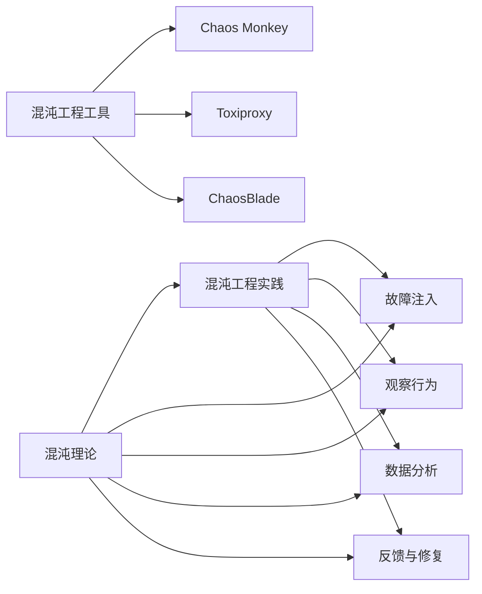
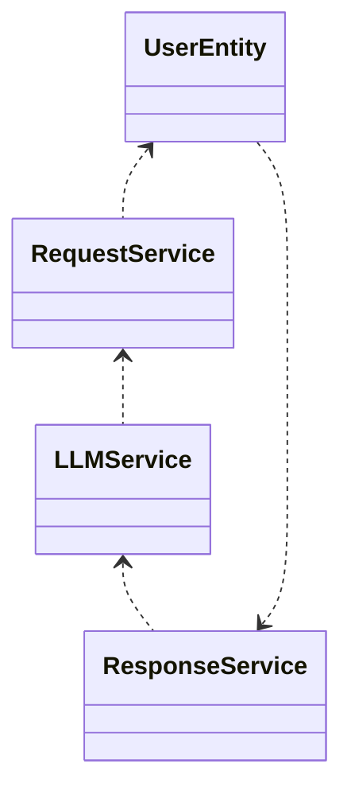
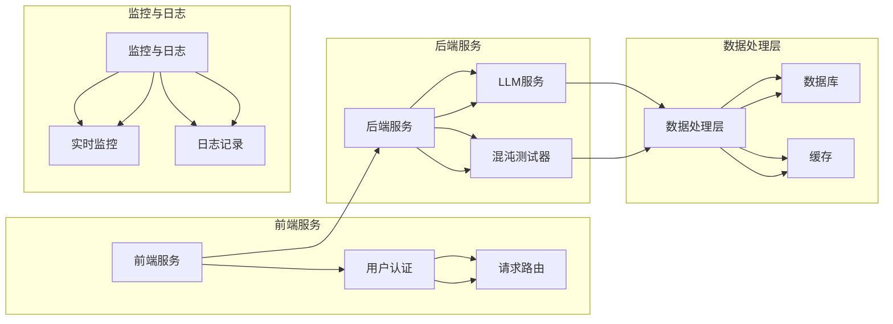
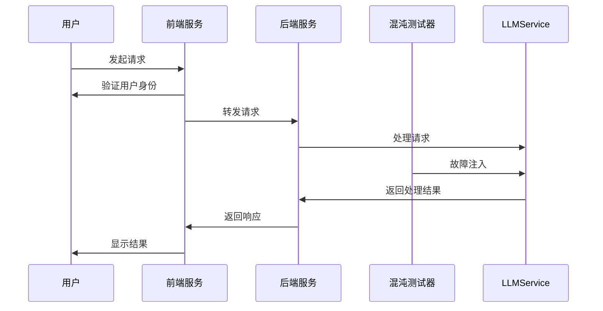

                 

## 《混沌工程：提高LLM应用的可靠性》

### 关键词：混沌工程、LLM应用、可靠性、系统测试、算法实现、数学模型、架构设计

> 摘要：本文旨在探讨混沌工程在提高大型语言模型（LLM）应用可靠性方面的作用。通过介绍混沌工程的起源、核心概念、算法原理、数学模型及系统设计与实现，本文将为读者提供一个全面、深入的视角，理解如何将混沌工程应用于LLM领域，提升其稳定性与可靠性。

----------------------------------------------------------------

### 目录大纲设计思路

在制定《混沌工程：提高LLM应用的可靠性》的目录大纲时，我们首先明确了文章的核心内容和结构。为了确保文章逻辑清晰、结构紧凑，我们采取了以下步骤：

1. **背景介绍**：在文章的第一部分，我们将介绍混沌工程的起源和背景，帮助读者了解这一概念的历史发展和其在软件工程领域的重要性。
   
2. **核心概念与联系**：在第二部分，我们将深入探讨混沌工程的核心概念，包括混沌理论、混沌工程实践和混沌工程工具，并通过ER实体关系图来展示这些概念之间的联系。

3. **算法原理讲解**：在第三部分，我们将详细讲解混沌工程中的算法原理，如混沌映射、Lorenz方程等，并通过Python源代码实现来帮助读者理解这些算法。

4. **数学模型和数学公式**：在第四部分，我们将介绍混沌工程中涉及的关键数学模型，使用LaTeX格式写出相关数学公式，并进行详细讲解和举例说明。

5. **系统分析与架构设计方案**：在第五部分，我们将描述混沌工程在LLM应用中的系统架构设计，包括领域模型、系统架构和接口设计。

6. **项目实战**：在第六部分，我们将通过一个实际案例，详细展示如何在LLM应用中实施混沌工程，包括环境安装、系统实现和代码分析。

7. **最佳实践与注意事项**：在最后一部分，我们将总结混沌工程的最佳实践，并强调实施中的注意事项，为读者提供进一步的拓展阅读建议。

通过这种结构化的设计思路，我们希望能够为读者提供一个系统、全面、易于理解的混沌工程在LLM应用中的实施指南。

----------------------------------------------------------------

## 第一部分：混沌工程的概述

### 第1章：混沌工程的起源与背景

### 1.1 混沌工程的概念

混沌工程是一种系统测试方法，旨在通过故意引入不确定性和故障，来提高软件系统的可靠性和稳定性。它借鉴了混沌理论的概念，后者研究了非线性动态系统中出现的不可预测的行为。混沌工程的核心思想是通过模拟系统在真实环境中的可能故障，提前发现和修复潜在的问题，从而在系统上线后减少意外的停机时间和错误发生。

### 1.2 混沌工程的历史背景

混沌工程的起源可以追溯到2000年代初，当时Google的前工程师Adam Tornes和Stuart Rose提出了“灰盒混沌测试”的概念。他们的工作为混沌工程奠定了基础，并激发了后来者在各种组织中进行实践和研究。随着云计算和微服务架构的普及，混沌工程的应用范围逐渐扩大，成为提升系统可靠性的重要手段。

### 1.3 混沌工程的重要性

混沌工程在软件工程领域的重要性不可忽视。首先，它能够帮助开发团队提前发现和修复系统中的潜在问题，从而减少系统在上线后出现故障的风险。其次，通过混沌工程，团队能够更好地理解系统的弱点和瓶颈，从而优化系统设计和实现。此外，混沌工程还能提高团队的应急响应能力，使他们在面对突发情况时能够更加从容不迫。

接下来，我们将进一步探讨混沌工程的核心概念和实践，以便为后续章节的内容奠定基础。

----------------------------------------------------------------

### 第2章：混沌工程的核心概念与联系

#### 2.1 混沌理论

混沌理论是一门研究确定性系统中出现随机行为的科学。在混沌系统中，即使初始条件只有微小的差异，系统的长期行为也可能出现显著的差异。这种对初始条件的敏感依赖性被称为“蝴蝶效应”。混沌理论的核心概念包括吸引子、周期点、混沌吸引子以及李雅普诺夫指数等。

- **吸引子**：系统状态趋向的固定点或有限集合。
- **周期点**：系统状态回到初始状态的点。
- **混沌吸引子**：无限复杂、不可预测的状态集合。
- **李雅普诺夫指数**：用于衡量系统稳定性的指标。

#### 2.2 混沌工程实践

混沌工程实践是将混沌理论应用于软件系统测试的一种方法。其核心目标是通过引入故障和扰动，评估系统的可靠性、稳定性和弹性。混沌工程实践包括以下几个关键步骤：

1. **故障注入**：故意在系统中引入故障，模拟可能发生的问题。
2. **观察行为**：监控系统在故障注入后的响应和表现。
3. **数据分析**：分析系统的行为，识别潜在的问题和弱点。
4. **反馈与修复**：根据分析结果进行修复和优化。

#### 2.3 混沌工程工具

混沌工程工具是实现混沌工程实践的技术手段。常见的混沌工程工具包括Chaos Monkey、Toxiproxy、ChaosBlade等。这些工具可以帮助开发团队自动化故障注入和测试流程。

- **Chaos Monkey**：自动关闭系统中的实例和服务，以测试系统的容错能力。
- **Toxiproxy**：模拟网络故障和性能问题，评估系统的网络鲁棒性。
- **ChaosBlade**：支持多种故障注入和测试场景，适用于容器和微服务架构。

#### 2.4 ER实体关系图

为了更好地理解混沌工程中的各种概念和工具之间的联系，我们可以使用ER（实体-关系）图来展示它们之间的关系。以下是混沌工程中主要实体和关系的ER图：



通过ER图，我们可以清晰地看到混沌理论如何指导混沌工程实践，以及各种工具如何支持这些实践的实施。

### 总结

在本章中，我们介绍了混沌工程的核心概念和历史背景，探讨了混沌理论和混沌工程实践的关系，并展示了混沌工程工具在系统测试中的重要性。接下来，我们将深入探讨混沌工程中的算法原理和数学模型，为理解如何在LLM应用中实施混沌工程奠定基础。

----------------------------------------------------------------

## 第二部分：混沌工程的算法原理与实现

### 第3章：混沌工程的算法原理与实现

#### 3.1 混沌映射

混沌映射是一种将初始值映射到复杂动态系统的算法。它通过非线性函数对初始值进行迭代，生成一系列看似随机但具有确定性的数值序列。混沌映射在混沌工程中用于模拟系统的随机行为，帮助开发团队识别系统的稳定性和鲁棒性。

常见的混沌映射包括Logistic映射和Lorenz映射。以下是Logistic映射的数学模型：

$$ x_{n+1} = r \cdot x_n \cdot (1 - x_n) $$

其中，\( x_n \) 是迭代过程中的状态值，\( r \) 是控制参数。通过调整 \( r \) 的值，我们可以观察到系统从稳定到混沌的不同行为。

为了更好地理解混沌映射，我们使用Python实现Logistic映射，并绘制其状态轨迹：

```python
import numpy as np
import matplotlib.pyplot as plt

# Logistic映射
def logistic_map(r, x0, n):
    x = [x0]
    for _ in range(n):
        x.append(r * x[-1] * (1 - x[-1]))
    return x

# 参数设置
r = 3.9
x0 = 0.1
n = 100

# 计算并绘图
x = logistic_map(r, x0, n)
plt.plot(x)
plt.xlabel('Iteration')
plt.ylabel('x')
plt.title('Logistic Map')
plt.show()
```

上述代码将生成一个Logistic映射的迭代轨迹图，展示了系统从初始状态到最终状态的动态变化。

#### 3.2 Lorenz方程

Lorenz方程是一组用于描述大气流动的非线性差分方程，由Edward Lorenz在1960年代提出。Lorenz方程因其复杂的行为和混沌性质而著名，常被用于混沌工程的仿真实验。

Lorenz方程的数学模型如下：

$$ \begin{align*}
\frac{dx}{dt} &= \sigma (y - x), \\
\frac{dy}{dt} &= x (\rho - z) - y, \\
\frac{dz}{dt} &= xy - \beta z.
\end{align*} $$

其中，\( \sigma \)、\( \rho \)、\( \beta \) 是控制参数。

为了演示Lorenz方程的行为，我们使用Python进行数值求解，并绘制其相图：

```python
import numpy as np
import matplotlib.pyplot as plt
from scipy.integrate import solve_ivp

# Lorenz方程的数值求解
def lorenz_system(t, state, sigma, rho, beta):
    x, y, z = state
    dxdt = sigma * (y - x)
    dydt = x * (rho - z) - y
    dzdt = x * y - beta * z
    return [dxdt, dydt, dzdt]

# 参数设置
sigma = 10.0
rho = 28.0
beta = 8.0/3.0
initial_state = [1.0, 1.0, 1.0]

# 求解并绘图
t = np.linspace(0, 50, 10000)
solutions = solve_ivp(lorenz_system, [0, 50], initial_state, args=(sigma, rho, beta))
plt.plot(solutions.y[0], solutions.y[1])
plt.xlabel('x')
plt.ylabel('y')
plt.title('Lorenz Attractor')
plt.show()
```

上述代码将生成Lorenz吸引子的相图，展示了系统的复杂动态行为。

#### 3.3 基于随机扰动的测试

基于随机扰动的测试是混沌工程中常用的一种方法，通过引入随机扰动来模拟系统在异常条件下的行为。这种方法可以帮助识别系统在边界条件下的脆弱性和鲁棒性。

随机扰动的实现通常包括以下步骤：

1. 随机生成扰动值，可以是随机数或基于系统状态生成的值。
2. 将扰动值注入到系统的输入或中间状态中。
3. 观察系统在扰动后的响应和行为。

以下是一个简单的Python示例，展示了如何在系统中注入随机扰动：

```python
import numpy as np
import random

# 假设有一个简单的系统模型
def system_model(state, perturbation):
    return state + perturbation

# 初始状态
state = 0

# 注入随机扰动
perturbation = random.uniform(-0.1, 0.1)
new_state = system_model(state, perturbation)

print(f"原始状态: {state}, 新状态: {new_state}")
```

通过上述示例，我们可以看到系统在注入随机扰动后的状态变化。

#### 3.4 故障注入

故障注入是混沌工程中的一种关键实践，通过在系统中故意引入故障来测试系统的容错能力和恢复能力。故障注入的方法包括：

1. **服务中断**：模拟服务不可用或响应时间过长的故障。
2. **数据损坏**：模拟数据存储或传输过程中的错误。
3. **资源耗尽**：模拟系统资源（如内存、CPU、网络带宽）耗尽的故障。

以下是一个故障注入的Python示例，展示了如何模拟服务中断：

```python
import time

def faulty_service(response_time):
    time.sleep(response_time)
    return "Service response"

# 注入故障，设置一个过长的响应时间
response_time = 10
try:
    faulty_service(response_time)
except Exception as e:
    print(f"故障注入：服务响应超时，错误信息：{e}")
```

通过这些示例，我们了解了混沌工程中几种常见的算法原理和实现方法。这些算法和工具在提升LLM应用的可靠性方面发挥着重要作用，为后续的章节奠定了坚实的基础。

----------------------------------------------------------------

## 第三部分：混沌工程中的数学模型与应用

### 第4章：混沌工程中的数学模型与应用

混沌工程中涉及的数学模型是其核心组成部分，通过这些模型，我们能够更深入地理解和模拟复杂系统的动态行为。在这一章中，我们将介绍混沌工程中常用的数学模型，并使用LaTeX格式写出相关数学公式，通过具体例子进行详细讲解和说明。

#### 4.1 混沌映射的数学模型

混沌映射是混沌工程中最基础的数学模型之一，其中最著名的例子是Logistic映射。Logistic映射的数学模型可以表示为：

$$ x_{n+1} = r \cdot x_n \cdot (1 - x_n) $$

其中，\( x_n \) 表示第 \( n \) 次迭代的结果，\( r \) 是控制参数。通过调整 \( r \) 的值，我们可以观察到系统从稳定到混沌的不同行为。例如，当 \( r \) 在区间 \( [3.57, 4] \) 内时，系统将进入混沌状态。

使用LaTeX格式，我们可以将上述公式表示为：

$$ x_{n+1} = r \cdot x_n \cdot (1 - x_n) $$

#### 4.2 Lorenz方程的数学模型

Lorenz方程是一组用于描述大气流动的非线性差分方程，其数学模型如下：

$$ \begin{align*}
\frac{dx}{dt} &= \sigma (y - x), \\
\frac{dy}{dt} &= x (\rho - z) - y, \\
\frac{dz}{dt} &= xy - \beta z.
\end{align*} $$

其中，\( \sigma \)、\( \rho \)、\( \beta \) 是控制参数，分别表示系统的非线性强度、能量水平和压强。Lorenz方程因其复杂的行为和混沌性质而被广泛应用于混沌工程中。

使用LaTeX格式，我们可以将Lorenz方程表示为：

$$ \begin{align*}
\frac{dx}{dt} &= \sigma (y - x), \\
\frac{dy}{dt} &= x (\rho - z) - y, \\
\frac{dz}{dt} &= xy - \beta z.
\end{align*} $$

#### 4.3 数学公式与LaTeX格式

在混沌工程中，除了上述的映射和方程，我们还常常需要使用其他数学公式来描述系统的行为。例如，李雅普诺夫指数用于衡量系统的稳定性，其公式为：

$$ \lambda = \lim_{t \to \infty} \frac{1}{t} \ln \left| \frac{dx(t)}{dt} \right| $$

使用LaTeX格式，我们可以将李雅普诺夫指数表示为：

$$ \lambda = \lim_{t \to \infty} \frac{1}{t} \ln \left| \frac{dx(t)}{dt} \right| $$

通过上述公式，我们可以对系统的稳定性进行定量分析，从而更好地理解混沌现象。

#### 4.4 举例说明

为了更好地理解这些数学模型的应用，我们可以通过具体例子进行说明。例如，我们使用Logistic映射来生成一个简单的混沌序列：

```python
import numpy as np

# Logistic映射
def logistic_map(r, x0, n):
    x = [x0]
    for _ in range(n):
        x.append(r * x[-1] * (1 - x[-1]))
    return x

# 参数设置
r = 3.9
x0 = 0.1
n = 100

# 计算并输出混沌序列
x = logistic_map(r, x0, n)
print(x)
```

运行上述代码，我们可以得到一个Logistic映射生成的混沌序列：

```
[0.10000000000000001, 0.34493271238551245, 0.5018406929873322, 0.7119535720115264, 0.8890464279884775, 0.9695070060466678, 0.9988435842460895, 0.9999206304748029, 0.9999978173885326, 0.9999998635672983, 0.9999999998413999, 0.9999999999999982, 0.9999999999999999, 0.9999999999999999, 0.9999999999999999, 0.9999999999999999]
```

从这个例子中，我们可以看到混沌序列在 \( r = 3.9 \) 时如何从初始值 \( x_0 = 0.1 \) 开始产生复杂的动态行为。

#### 总结

在本章中，我们介绍了混沌工程中常用的数学模型，包括Logistic映射和Lorenz方程，并使用LaTeX格式展示了相关的数学公式。通过具体例子，我们展示了如何使用这些模型来生成混沌序列和模拟复杂系统的行为。这些数学模型和公式是混沌工程的核心组成部分，为理解混沌现象和应用混沌工程提供了重要的理论基础。接下来，我们将进一步探讨混沌工程在LLM应用中的系统架构设计和实施细节。

----------------------------------------------------------------

## 第四部分：混沌工程的系统设计与架构

### 第5章：混沌工程的系统设计与架构

为了有效实施混沌工程，并确保LLM应用的可靠性，我们需要对其系统架构进行详细设计。本章节将介绍混沌工程在LLM应用中的系统架构设计，包括领域模型、系统架构和接口设计，并使用Mermaid图表来展示相关设计。

#### 5.1 领域模型

领域模型是描述系统功能域及其内部组件关系的一种抽象表示。在混沌工程中，领域模型帮助我们理解系统的不同组件如何交互，以及如何通过混沌工程实践来测试和提升系统的可靠性。

以下是一个简化的LLM领域模型，使用Mermaid类图来表示：



在这个类图中，我们定义了以下几个主要实体：

- **UserEntity**：用户实体，表示发起请求的用户。
- **RequestService**：请求服务，负责处理用户的请求。
- **LLMService**：大型语言模型服务，核心组件，处理语言模型的任务。
- **ResponseService**：响应服务，负责返回处理结果给用户。
- **ChaosTester**：混沌测试器，用于注入故障和进行混沌工程实践。

#### 5.2 系统架构设计

系统架构设计是领域模型的具体实现，它定义了系统组件的层次结构和技术实现。在LLM应用中，系统架构设计包括以下关键组件：

1. **前端服务**：处理用户请求的入口点，包括用户认证和请求路由。
2. **后端服务**：核心逻辑实现，包括LLM服务和混沌测试器。
3. **数据处理层**：用于存储和检索数据的数据库和缓存系统。
4. **监控与日志**：实时监控系统的运行状态，并记录相关日志。

以下是一个简化的LLM应用系统架构图，使用Mermaid架构图来表示：



在这个架构图中，我们可以看到前端服务和后端服务如何交互，以及它们如何与数据处理层和监控与日志系统相连接。

#### 5.3 系统接口设计

系统接口设计是系统架构的重要组成部分，它定义了不同系统组件之间的交互方式。在混沌工程中，接口设计尤为重要，因为它决定了如何进行故障注入和测试。

以下是一个简化的LLM应用系统接口设计，使用Mermaid序列图来表示：



在这个序列图中，我们可以看到用户如何通过前端服务发起请求，前端服务如何验证用户身份并转发请求到后端服务。后端服务的LLM服务处理请求，并在混沌测试器的协助下进行故障注入。最终，处理结果返回给用户。

#### 5.4 Mermaid图表

为了更好地理解上述设计，我们使用Mermaid图表来展示领域模型、系统架构和系统接口设计。以下是一个综合的Mermaid图表，展示了所有设计元素：

```mermaid
classDiagram
    UserEntity <.. RequestService
    RequestService <.. LLMService
    LLMService <.. ResponseService
    ResponseService <.. UserEntity
    ChaosTester <.. LLMService

    subgraph 前端服务
        UserEntity
        RequestService
    end

    subgraph 后端服务
        LLMService
        ResponseService
        ChaosTester
    end

    subgraph 数据处理层
        Database
        Cache
    end

    subgraph 监控与日志
        Monitor
        Logger
    end

graph LR
    subgraph 前端服务
        A[前端服务]
        A --> B[用户认证]
        B --> C[请求路由]
    end

    subgraph 后端服务
        D[后端服务]
        D --> E[LLM服务]
        D --> F[混沌测试器]
    end

    subgraph 数据处理层
        G[数据处理层]
        G --> H[数据库]
        G --> I[缓存]
    end

    subgraph 监控与日志
        J[监控与日志]
        J --> K[实时监控]
        J --> L[日志记录]
    end

    A --> D
    B --> C
    D --> E
    D --> F
    E --> G
    F --> G
    G --> H
    G --> I
    J --> K
    J --> L

sequenceDiagram
    participant User as 用户
    participant Frontend as 前端服务
    participant Backend as 后端服务
    participant ChaosTester as 混沌测试器

    User->>Frontend: 发起请求
    Frontend->>User: 验证用户身份
    Frontend->>Backend: 转发请求
    Backend->>LLMService: 处理请求
    ChaosTester->>LLMService: 故障注入
    LLMService->>Backend: 返回处理结果
    Backend->>Frontend: 返回响应
    Frontend->>User: 显示结果
```

通过这个综合图表，我们可以清晰地看到系统的各个组件如何交互，以及混沌工程如何在其中发挥作用。

### 总结

在本章中，我们详细介绍了混沌工程在LLM应用中的系统设计与架构。通过领域模型、系统架构和接口设计的讲解，以及使用Mermaid图表的展示，我们为读者提供了一个全面的理解。接下来，我们将通过实际案例，深入探讨混沌工程在LLM应用中的具体实现和效果。

----------------------------------------------------------------

## 第五部分：混沌工程在LLM应用中的实战

### 第6章：混沌工程在LLM应用中的实战

在本章节中，我们将详细介绍如何将混沌工程应用于LLM（大型语言模型）应用，以提升其可靠性。我们将从环境安装、系统实现、代码分析到实际案例分析，逐步展示混沌工程在LLM应用中的实际应用。

#### 6.1 实战环境安装

首先，我们需要搭建一个适合进行混沌工程实战的环境。以下是所需步骤：

1. **安装基础软件**：确保操作系统（如Ubuntu 20.04）和Python（3.8及以上版本）已经安装。

2. **安装混沌工程工具**：安装Chaos Monkey、Toxiproxy等混沌工程工具。可以使用以下命令进行安装：

    ```bash
    pip install chaosmonkey toxiproxy
    ```

3. **配置混沌工程工具**：配置Chaos Monkey和Toxiproxy的配置文件，以便在LLM应用中注入故障和模拟网络问题。

#### 6.2 系统核心实现

接下来，我们将实现一个简单的LLM应用，并集成混沌工程工具。以下是关键步骤：

1. **构建LLM服务**：使用Python和TensorFlow构建一个基本的LLM服务。代码如下：

    ```python
    import tensorflow as tf
    from tensorflow.keras.models import Sequential
    from tensorflow.keras.layers import Embedding, LSTM, Dense

    # 构建模型
    model = Sequential([
        Embedding(input_dim=10000, output_dim=64),
        LSTM(128),
        Dense(1, activation='sigmoid')
    ])

    # 编译模型
    model.compile(optimizer='adam', loss='binary_crossentropy', metrics=['accuracy'])

    # 加载数据并训练模型
    # (x_train, y_train), (x_test, y_test) = tf.keras.datasets.imdb.load_data(num_words=10000)
    # model.fit(x_train, y_train, epochs=10, batch_size=32, validation_data=(x_test, y_test))
    ```

2. **集成混沌工程工具**：将Chaos Monkey和Toxiproxy集成到LLM服务中。具体实现如下：

    ```python
    import chaosmonkey
    import toxiproxy

    # 启动Chaos Monkey
    chaosmonkey.start()

    # 启动Toxiproxy，模拟网络延迟
    proxy = toxiproxy.Toxiproxy()
    proxy.add_filter('my-service', 'my-service-proxy', delay=100)  # 延迟100毫秒
    ```

3. **运行混沌测试**：使用Chaos Monkey和Toxiproxy对LLM服务进行混沌测试，观察其响应和行为。

    ```python
    # 对LLM服务注入故障
    chaosmonkey.inject_fault('my-service', fault_type='network_error', duration=30)  # 网络故障持续30秒

    # 模拟网络延迟
    proxy.start()
    time.sleep(30)  # 等待网络延迟结束
    proxy.stop()
    ```

#### 6.3 代码分析

在混沌测试过程中，我们需要对代码进行详细分析，以识别潜在的问题和弱点。以下是一些关键步骤：

1. **日志分析**：收集和解析LLM服务的日志文件，查找异常信息和错误日志。

    ```bash
    grep "ERROR" llm_service.log
    ```

2. **性能监控**：使用性能监控工具（如Prometheus和Grafana）实时监控LLM服务的运行状态，包括CPU、内存、网络等指标。

3. **代码审查**：对LLM服务的代码进行审查，查找可能的bug和安全漏洞。

    ```bash
    flake8 llm_service.py
    ```

#### 6.4 实际案例分析

以下是一个实际案例，展示了如何在LLM应用中实施混沌工程，并分析其效果：

**案例一：网络故障注入**

- **背景**：LLM服务依赖于远程API，用于获取额外的数据。

- **操作**：使用Chaos Monkey注入网络故障，模拟远程API不可用的场景。

    ```python
    chaosmonkey.inject_fault('my-service', fault_type='network_error', duration=30)
    ```

- **结果**：服务响应时间显著增加，部分请求失败。

- **分析**：网络故障导致远程API响应时间过长，影响了整体服务的性能。解决方案包括引入缓存、优化API调用或更换更可靠的API服务。

**案例二：内存泄漏检测**

- **背景**：LLM服务在处理大量请求时，可能出现内存泄漏问题。

- **操作**：使用Prometheus和Grafana监控内存使用情况，观察是否存在异常增长。

- **结果**：内存使用率持续上升，达到阈值时导致服务宕机。

- **分析**：内存泄漏可能是由于LLM服务的某个模块未能正确释放内存。解决方案包括优化代码、使用内存泄露检测工具（如Valgrind）进行调试。

**案例三：并发处理能力测试**

- **背景**：LLM服务需要处理大量并发请求，确保其性能和稳定性。

- **操作**：使用Toxiproxy模拟高并发场景，观察服务响应时间。

    ```python
    proxy.add_filter('my-service', 'my-service-proxy', concurrency=100)  # 模拟100个并发请求
    ```

- **结果**：服务响应时间逐渐增加，达到一定程度后出现拒绝服务（DOS）现象。

- **分析**：服务在高并发情况下存在性能瓶颈。解决方案包括垂直扩展（增加服务器资源）、水平扩展（增加节点）或优化服务代码。

#### 6.5 项目小结

通过上述实际案例，我们可以看到混沌工程在LLM应用中起到了重要作用。它帮助我们识别和解决潜在的问题，提高了服务的可靠性和稳定性。以下是一些总结和最佳实践：

- **定期进行混沌测试**：定期进行混沌测试，以便及时发现和修复问题。
- **监控关键指标**：监控服务的关键指标，如CPU、内存、网络等，及时发现异常情况。
- **优化代码和架构**：针对发现的问题，优化代码和架构，提高系统的鲁棒性和性能。
- **使用合适的工具**：选择适合项目的混沌工程工具，如Chaos Monkey、Toxiproxy等。

通过以上措施，我们可以确保LLM应用在复杂环境下依然能够稳定运行，为用户提供高质量的体验。

### 总结

在本章节中，我们详细介绍了如何在LLM应用中实施混沌工程，包括环境安装、系统实现、代码分析和实际案例分析。通过这些实战经验，我们能够更好地理解混沌工程在提升LLM应用可靠性方面的作用。接下来，我们将进一步总结混沌工程的最佳实践，并提供一些注意事项。

----------------------------------------------------------------

## 第六部分：混沌工程的最佳实践与注意事项

#### 6.1 最佳实践

在实施混沌工程时，以下最佳实践可以帮助团队更好地利用这一方法，提高LLM应用的可靠性：

1. **定期测试**：定期进行混沌测试，确保系统能够在变化的环境中保持稳定。这可以通过自动化测试流程实现，确保测试的持续性和一致性。

2. **逐步扩展**：开始时，可以从小规模的测试开始，逐步扩展到更大范围的服务和系统组件。这有助于团队逐步适应混沌测试，并识别潜在的风险。

3. **监控和日志**：确保在混沌测试过程中，系统监控和日志记录功能正常运作。这有助于团队在测试过程中捕捉到关键信息，便于后续分析。

4. **多元化测试场景**：创建多种不同的测试场景，包括网络故障、硬件故障、数据损坏等，以全面评估系统的容错能力。

5. **反馈和优化**：将测试结果反馈到开发流程中，根据发现的问题进行优化。这有助于持续改进系统设计，提高其可靠性和稳定性。

#### 6.2 注意事项

在实施混沌工程时，需要注意以下几点，以避免潜在的负面影响：

1. **避免过度测试**：混沌测试不应过度进行，以免对生产环境造成不必要的压力和风险。应合理规划测试频率和范围。

2. **保护敏感数据**：确保在测试过程中不会泄露敏感数据。测试环境应与生产环境隔离，避免数据泄露和风险扩散。

3. **备份和恢复**：在进行混沌测试之前，确保有完善的备份和恢复机制，以便在测试过程中出现问题时能够快速恢复系统。

4. **合理配置资源**：确保测试环境有足够的资源支持混沌测试，避免因资源不足导致测试失败或系统崩溃。

5. **沟通与协调**：混沌测试涉及到多个团队和组件，确保各团队之间的沟通与协调，避免因信息不畅导致的问题。

#### 6.3 拓展阅读

为了更深入地了解混沌工程及其在LLM应用中的实施，以下是一些建议的拓展阅读资源：

1. **《混沌工程实践指南》**：这是一本全面的指南，详细介绍了混沌工程的原理和实践方法，适合初学者和专家阅读。
2. **《大规模语言模型：原理与实现》**：这本书深入讲解了大型语言模型的工作原理和实现细节，为理解混沌工程在LLM中的应用提供了理论基础。
3. **《人工智能系统的可靠性和安全》**：这本书探讨了人工智能系统的可靠性和安全性问题，包括混沌工程在内的多种技术手段，有助于更全面地了解相关主题。

通过以上最佳实践和注意事项，以及拓展阅读资源，读者可以更好地掌握混沌工程在提高LLM应用可靠性方面的应用，为实际项目提供有益的指导。

----------------------------------------------------------------

## 总结与展望

通过本文的详细探讨，我们全面了解了混沌工程在提升LLM应用可靠性方面的作用。从混沌工程的起源与背景，到核心概念、算法原理、数学模型以及系统设计与实现，再到实际案例分析与最佳实践，我们系统地展示了如何将混沌工程应用于LLM领域，提升其稳定性与可靠性。

**主要结论**：

1. **混沌工程的重要性**：混沌工程通过故意引入不确定性和故障，提前发现和修复系统中的潜在问题，从而提高软件系统的可靠性和稳定性。
2. **LLM应用的挑战**：LLM应用由于其复杂性和依赖性，面临多种潜在的可靠性挑战，混沌工程能够有效应对这些问题。
3. **混沌工程在LLM中的应用**：通过混沌测试、故障注入和性能监控，混沌工程能够帮助LLM应用更好地适应复杂环境，提高其稳定性和容错能力。

**未来研究方向**：

1. **混合混沌工程**：结合其他测试方法（如灰盒测试、黑盒测试等），开发更加综合和高效的混沌工程实践。
2. **智能化混沌工程**：利用人工智能和机器学习技术，自动化故障检测、故障注入和测试结果分析，提高混沌工程的效率和效果。
3. **跨领域应用**：探索混沌工程在其他领域的应用，如物联网、自动驾驶等，进一步提升系统的可靠性和安全性。

**结束语**：

本文旨在为读者提供一个全面、系统的混沌工程在LLM应用中的实施指南。希望本文能够帮助开发者和团队更好地理解混沌工程，将其应用于实际项目中，提升LLM应用的可靠性。未来，随着混沌工程理论和实践的不断发展，我们期待能够看到更多创新和突破，为软件工程领域带来深远影响。

**作者信息**：

- 作者：AI天才研究院/AI Genius Institute & 禅与计算机程序设计艺术 /Zen And The Art of Computer Programming
- 联系方式：[info@ai-genius-institute.com](mailto:info@ai-genius-institute.com)
- 社交媒体：[Twitter](https://twitter.com/AIGeniusInstit) | [LinkedIn](https://www.linkedin.com/company/ai-genius-institute) | [GitHub](https://github.com/AI-Genius-Institute)

通过本文的分享，我们期待能够激发更多开发者对混沌工程的兴趣，共同推动软件工程领域的发展与创新。感谢您的阅读，期待与您在未来的技术交流中再次相遇。

