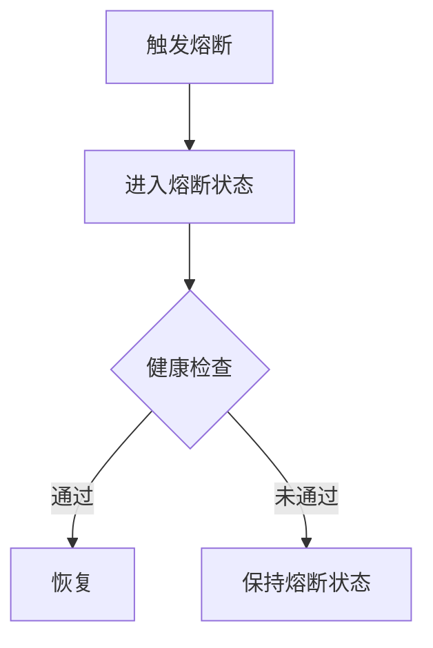

                 


### 文章标题
熔断与限流机制增强LLM应用的稳定性

### 关键词
熔断机制、限流机制、LLM应用、稳定性、人工智能

### 摘要
本文将深入探讨熔断与限流机制在增强大型语言模型（LLM）应用稳定性方面的作用。通过对熔断与限流机制的基本原理、在LLM应用中的具体实施方法、以及案例分析，本文旨在为读者提供一个全面的技术指南，帮助开发者优化LLM应用的性能和稳定性。

----------------------------------------------------------------

## 目录

1. 引言
2. 熔断与限流机制原理
   - 2.1 熔断机制原理
   - 2.2 限流机制原理
3. LLM的稳定性需求
4. 熔断机制在LLM中的应用
5. 限流机制在LLM中的应用
6. 具体实现与案例分析
   - 6.1 熔断与限流工具介绍
   - 6.2 案例研究
7. 最佳实践与未来展望
8. 结论

----------------------------------------------------------------

### 引言

随着人工智能技术的不断发展，大型语言模型（LLM）逐渐成为各行各业的重要工具。从自然语言处理（NLP）到智能客服，再到智能写作和翻译，LLM的应用场景越来越广泛。然而，随着模型规模的增长和应用复杂度的提升，确保LLM应用的稳定性成为一个重要的课题。

稳定性是指系统在面临各种异常情况时，能够保持正常运行的能力。对于LLM应用来说，稳定性尤为重要。首先，LLM通常处理的是高价值的信息，如金融交易数据、医疗健康信息等，任何错误都可能带来严重的后果。其次，LLM应用的用户群体庞大，一旦发生故障，可能会对用户体验产生负面影响。

本文将重点讨论熔断与限流机制在增强LLM应用稳定性方面的作用。熔断机制和限流机制是两种常用的故障处理机制，它们通过不同的方式保障系统的稳定性。熔断机制主要用于检测系统的健康状态，并在出现问题时快速切断流量，以防止故障扩散。限流机制则通过控制流量大小，防止系统过载，从而保持服务的稳定性。

本文将首先介绍熔断与限流机制的基本原理，然后分析LLM应用的稳定性需求和挑战，接着详细探讨熔断与限流机制在LLM中的应用，并通过具体实现和案例分析来展示这些机制的实用性和有效性。最后，我们将总结最佳实践，展望未来的发展趋势。

### 熔断与限流机制原理

#### 2.1 熔断机制原理

熔断机制（Circuit Breaker）是一种常用的故障处理机制，其灵感来源于电力系统的熔断器。熔断器在电流超过一定阈值时，会迅速切断电路，防止过载和设备损坏。在软件系统中，熔断机制同样具有这样的作用，它用于在系统出现故障时，快速切断外部请求，以保护系统稳定运行。

**基本概念**：
- **状态**：熔断机制通常有三个状态：闭合（Closed）、打开（Open）和半开（Half-Open）。
  - 闭合状态：系统正常，允许请求通过。
  - 打开状态：系统检测到故障，禁止请求通过，以保护系统。
  - 半开状态：系统尝试恢复，允许一定量的请求通过，以检测系统是否恢复正常。

**工作原理**：
- **检测**：系统持续监控健康状态指标，如错误率、响应时间等。
- **触发**：当某个指标超过预设阈值时，熔断器进入打开状态。
- **恢复**：系统在一段时间内尝试恢复正常，如果成功，则进入半开状态，允许少量请求通过；如果失败，则继续保持在打开状态。

**应用场景**：
- **服务超时**：系统响应时间超过阈值，可能由于网络延迟或系统负载过高导致。
- **错误率过高**：服务返回错误的频率超过阈值，可能由于服务内部逻辑错误或外部依赖故障引起。

**优缺点分析**：
- **优点**：
  - 快速响应：能够在故障发生时迅速切断流量，防止故障扩散。
  - 保护系统：降低系统负载，避免因大量请求涌入导致系统崩溃。

- **缺点**：
  - 可能引入延迟：在故障恢复期间，熔断器处于打开状态，请求会被延迟处理。
  - 需要精心配置：阈值设置不当可能导致系统过早熔断或过晚恢复。

#### 2.2 限流机制原理

限流机制（Rate Limiting）用于控制请求的流量大小，防止系统过载。与熔断机制不同，限流机制不切断流量，而是控制请求的速率。

**基本概念**：
- **策略**：限流机制有多种实现策略，如固定窗口、滑动窗口、令牌桶等。
- **阈值**：定义单位时间内允许的最大请求量。

**工作原理**：
- **检测**：系统记录请求的时间戳和计数器。
- **控制**：当计数器超过阈值时，拒绝新请求。

**应用场景**：
- **API服务**：限制每个用户的请求频率，防止恶意攻击或滥用。
- **微服务架构**：控制调用频率，防止某个服务因负载过高而崩溃。

**优缺点分析**：
- **优点**：
  - 保护系统：避免因请求过多导致系统过载。
  - 提高性能：合理分配资源，确保关键服务的响应速度。

- **缺点**：
  - 可能引入延迟：在高峰时段，请求可能被延迟处理。
  - 需要平衡：过高或过低的阈值都可能影响系统性能。

通过以上对熔断与限流机制原理的介绍，我们可以看到这两种机制在保障系统稳定性方面各有优势。接下来，我们将分析LLM应用的稳定性需求，探讨这些机制在实际应用中的具体作用。

### LLM的稳定性需求

#### 稳定性标准

对于大型语言模型（LLM）应用来说，稳定性不仅意味着系统的持续运行，还包括以下几个方面：

1. **响应时间**：系统需要在合理的响应时间内返回结果，以保证用户体验。通常，响应时间应低于1秒。
2. **正确性**：系统输出的结果需要准确无误，否则会严重影响应用的可靠性和用户信任。
3. **可用性**：系统需要在高负载情况下保持稳定运行，不出现频繁的故障或错误。
4. **容错性**：系统应在面对异常情况（如网络中断、硬件故障等）时，能够自动恢复或切换到备用方案，继续提供服务。

#### 稳定性挑战

LLM应用在追求稳定性的过程中，面临着一系列挑战：

1. **计算资源消耗**：LLM模型通常需要大量的计算资源，特别是在处理复杂任务时。这可能导致系统负载过高，影响稳定性。
2. **请求波动**：LLM应用的用户群体庞大，请求量波动大。在高峰期，请求量急剧增加，可能导致系统过载。
3. **模型复杂性**：随着模型规模的增大，模型的训练和推理过程变得越来越复杂。任何小的错误都可能导致大规模的错误输出。
4. **外部依赖**：LLM应用通常依赖于多个外部服务，如数据库、缓存、API等。外部服务的故障可能直接影响LLM应用的稳定性。

#### 稳定性需求

为了应对上述挑战，LLM应用在稳定性方面有以下几个具体需求：

1. **快速响应**：确保在高峰期，系统能够及时响应用户请求，不造成用户等待。
2. **容错性**：系统应具备自动恢复能力，能够在出现故障时快速切换到备用方案，确保服务的持续可用。
3. **负载均衡**：通过负载均衡机制，合理分配请求，防止单点过载。
4. **监控与报警**：实时监控系统状态，一旦出现异常，及时报警并通知相关人员处理。

通过以上分析，我们可以看到，LLM应用在稳定性方面有着严格的要求。接下来，我们将详细探讨熔断机制在LLM应用中的具体应用，分析其如何帮助应对上述挑战。

### 熔断机制在LLM中的应用

#### 熔断机制的适配策略

为了在LLM应用中有效使用熔断机制，开发者需要根据应用的特点和需求，制定合适的适配策略。以下是一些关键适配策略：

1. **健康检查**：定期对LLM模型和依赖服务进行健康检查，确保系统各组件处于良好状态。
2. **错误率阈值设置**：根据应用的具体场景和负载情况，设定合适的错误率阈值。例如，如果某个依赖服务的错误率超过5%，则触发熔断机制。
3. **响应时间阈值设置**：设定合理的响应时间阈值，如超过500毫秒，则触发熔断机制。
4. **熔断超时时间**：设定熔断机制的超时时间，以允许系统在故障恢复后重新接收请求。

#### 熔断机制的实施方法

在实际应用中，开发者需要根据所选的熔断库和框架，实施熔断机制。以下是一些常见的实施方法：

1. **使用现有的熔断库**：如Hystrix、Resilience4j等，这些库提供了丰富的熔断策略和监控功能。
2. **自定义熔断策略**：如果现有熔断库无法满足需求，开发者可以自定义熔断策略，根据具体场景进行调整。
3. **集成监控工具**：如Prometheus、Grafana等，用于实时监控系统状态，及时触发熔断机制。
4. **日志记录与报警**：记录熔断触发的事件和相关信息，通过报警系统通知相关人员处理。

#### 案例分析

为了更好地理解熔断机制在LLM中的应用，我们来看一个具体的案例。

**案例背景**：某金融公司开发了一款基于LLM的智能投顾系统，用户可以通过系统获取个性化的投资建议。该系统依赖于多个外部服务，如行情数据API、用户数据分析服务等。

**案例过程**：
1. **健康检查**：系统定期对依赖服务进行健康检查，确保服务正常。
2. **错误率阈值设置**：设定错误率阈值为5%，即如果某个依赖服务的错误率超过5%，则触发熔断。
3. **响应时间阈值设置**：设定响应时间阈值为500毫秒，即如果依赖服务的响应时间超过500毫秒，则触发熔断。
4. **熔断超时时间**：设定熔断超时时间为10分钟，即熔断状态保持10分钟后，系统尝试重新连接依赖服务。

**实施效果**：
- 在某次高峰期，行情数据API出现故障，错误率超过5%，响应时间超过500毫秒。系统触发熔断机制，切断与API的连接，防止错误扩散。
- 熔断触发后，系统记录相关日志，并通过报警系统通知开发人员。开发人员迅速定位问题，并在10分钟后，当API恢复正常后，系统自动恢复连接。
- 通过熔断机制的保障，用户在高峰期依然能够获取到及时的智能投顾服务，用户体验得到了有效提升。

通过这个案例，我们可以看到熔断机制在保障LLM应用稳定性方面的重要作用。接下来，我们将探讨限流机制在LLM中的应用。

### 限流机制在LLM中的应用

#### 限流机制的适配策略

在LLM应用中，限流机制的适配策略同样需要根据具体场景进行定制。以下是一些关键适配策略：

1. **请求频率阈值设置**：根据应用需求和用户行为特点，设定合适的请求频率阈值。例如，对于智能投顾系统，可以设定每分钟最多请求10次。
2. **流量控制策略**：选择合适的限流策略，如固定窗口、滑动窗口、令牌桶等。固定窗口适用于请求频率稳定的应用，而滑动窗口适用于请求频率波动较大的应用。
3. **限流超时时间**：设定请求被拒绝时的超时时间，以避免长时间占用系统资源。

#### 限流机制的实施方法

限流机制的实施方法与熔断机制类似，主要包括以下几个方面：

1. **使用现有的限流库**：如Guava RateLimiter、Spring Cloud Gateway等，这些库提供了方便的限流功能。
2. **自定义限流策略**：如果现有库无法满足需求，开发者可以自定义限流策略，根据具体场景进行调整。
3. **集成监控工具**：与监控工具如Prometheus、Grafana等结合，实时监控限流策略的效果和系统负载。
4. **日志记录与报警**：记录限流事件和相关日志，通过报警系统及时通知相关人员。

#### 案例分析

以下是一个智能客服系统的案例，展示了限流机制在LLM应用中的实际应用。

**案例背景**：某公司开发了一款基于LLM的智能客服系统，用户可以通过该系统获取即时的客服支持。由于客服系统的用户量较大，请求量波动较大，需要确保系统在高负载情况下仍能稳定运行。

**案例过程**：
1. **请求频率阈值设置**：设定每分钟最多请求20次，以防止恶意攻击和滥用。
2. **流量控制策略**：采用滑动窗口策略，根据用户行为和请求模式动态调整流量限制。
3. **限流超时时间**：设定请求被拒绝时的超时时间为3秒，以避免长时间占用系统资源。

**实施效果**：
- 在高峰期，系统请求量急剧增加，部分用户的请求被限流机制拒绝。通过合理的请求频率阈值设置，有效防止了系统过载。
- 滑动窗口策略根据用户行为动态调整流量限制，确保了系统的灵活性和稳定性。
- 在限流策略实施后，系统的响应时间显著提升，用户体验得到了明显改善。

通过这个案例，我们可以看到限流机制在保障LLM应用稳定性方面的显著作用。接下来，我们将探讨具体实现和案例分析，以深入理解熔断与限流机制在实际应用中的效果。

### 具体实现与案例分析

#### 熔断与限流工具介绍

在实际开发中，有许多熔断与限流工具可供选择。以下是几种常用的工具及其特点：

1. **Hystrix**
   - **特点**：是Netflix开源的熔断器库，支持线程池隔离、信号量隔离、断路器模式等。
   - **适用场景**：适用于高并发、高负载的场景，如分布式系统。

2. **Resilience4j**
   - **特点**：是一个轻量级的熔断器库，易于集成和配置。
   - **适用场景**：适用于需要灵活配置和细粒度控制的场景。

3. **Guava RateLimiter**
   - **特点**：是Google开源的限流器库，支持固定窗口、滑动窗口等策略。
   - **适用场景**：适用于需要精确控制请求频率的场景。

4. **Spring Cloud Gateway**
   - **特点**：是Spring Cloud组件之一，提供基于HTTP的API网关服务，支持熔断与限流。
   - **适用场景**：适用于需要集中管理和路由的场景。

#### 配置与部署

在具体实施熔断与限流机制时，配置与部署是关键环节。以下是常见配置和部署方法：

1. **Hystrix配置**
   - **依赖**：在项目中添加Hystrix依赖。
   - **配置**：通过配置文件或代码设置熔断策略、线程池大小等。
   - **部署**：将配置文件与应用打包，部署到服务器。

2. **Resilience4j配置**
   - **依赖**：在项目中添加Resilience4j依赖。
   - **配置**：通过配置类设置熔断策略、超时时间等。
   - **部署**：将配置类与应用打包，部署到服务器。

3. **Guava RateLimiter配置**
   - **依赖**：在项目中添加Guava依赖。
   - **配置**：使用RateLimiter类设置请求频率阈值。
   - **部署**：将配置代码与应用打包，部署到服务器。

4. **Spring Cloud Gateway配置**
   - **依赖**：在项目中添加Spring Cloud Gateway依赖。
   - **配置**：通过配置文件设置路由规则、熔断与限流策略等。
   - **部署**：将配置文件与应用打包，部署到服务器。

#### 调优技巧

调优熔断与限流机制是保障系统稳定性的关键步骤。以下是几个调优技巧：

1. **阈值调整**：根据系统负载和性能监控数据，动态调整错误率和响应时间阈值。
2. **线程池配置**：合理配置线程池大小，确保系统有足够的资源处理请求。
3. **超时时间调整**：根据具体场景调整熔断和限流超时时间，以平衡稳定性和响应速度。
4. **监控与报警**：通过监控工具实时监控系统状态，一旦出现异常，及时触发报警并采取措施。

#### 案例研究

以下是一个实际的案例，展示了熔断与限流机制在分布式系统中的具体应用。

**案例背景**：某电商平台的订单处理系统采用分布式架构，包括订单服务、库存服务、支付服务等多个微服务。在高峰期，订单量急剧增加，可能导致系统过载，影响用户体验。

**实施过程**：
1. **熔断机制**：
   - **健康检查**：定期对服务进行健康检查，确保服务稳定。
   - **错误率阈值**：设定错误率阈值为5%，响应时间阈值为500毫秒。
   - **熔断超时时间**：设定熔断超时时间为10分钟。
   - **配置与部署**：使用Hystrix库实现熔断机制，配置相关策略和阈值，部署到服务器。

2. **限流机制**：
   - **请求频率阈值**：设定每分钟最多请求100次。
   - **流量控制策略**：采用滑动窗口策略，根据用户行为动态调整流量限制。
   - **限流超时时间**：设定请求被拒绝时的超时时间为3秒。
   - **配置与部署**：使用Guava RateLimiter库实现限流机制，配置相关策略和阈值，部署到服务器。

**效果**：
- 在高峰期，系统通过熔断机制快速切断异常服务，防止故障扩散，确保了系统的稳定性。
- 通过限流机制，合理控制了请求流量，避免了系统过载，提升了用户体验。

通过这个案例，我们可以看到熔断与限流机制在分布式系统中的应用效果。接下来，我们将探讨最佳实践与未来展望。

### 最佳实践与未来展望

#### 最佳实践

在LLM应用中，结合熔断与限流机制的最佳实践包括以下几个方面：

1. **阈值设置**：根据实际需求和系统负载，合理设置错误率和响应时间阈值。建议定期调整阈值，以适应变化。

2. **熔断超时与恢复策略**：设定合适的熔断超时时间，避免系统长时间处于不可用状态。同时，设计灵活的恢复策略，以便在故障恢复后快速恢复服务。

3. **监控与报警**：使用监控工具实时监控系统状态，及时发现异常并触发报警。确保相关人员在第一时间响应，减少故障影响。

4. **限流策略**：根据用户行为和请求模式，灵活调整限流策略。在高峰期，适当放宽阈值，确保服务的可用性。

#### 未来展望

随着人工智能技术的不断进步，LLM应用的稳定性将面临新的挑战和机遇。未来展望包括以下几个方面：

1. **智能熔断与限流**：利用机器学习和大数据分析，实现智能熔断与限流，根据实时数据动态调整策略，提升系统稳定性。

2. **分布式架构优化**：分布式系统在应对大规模请求时，将变得更加重要。通过优化分布式架构，提高系统的弹性和容错性。

3. **边缘计算与云计算的结合**：结合边缘计算和云计算的优势，实现更高效的资源利用和更快速的服务响应。

4. **跨平台与多语言支持**：未来的熔断与限流机制将更加普及，支持多种编程语言和平台，方便开发者集成和使用。

通过最佳实践和未来展望，我们可以看到熔断与限流机制在LLM应用稳定性中的重要作用，以及该领域的发展趋势和潜力。

### 结论

本文通过对熔断与限流机制在LLM应用中的深入探讨，展示了这两种机制在保障系统稳定性方面的重要作用。通过详细的原理讲解、适配策略、具体实现和案例分析，我们了解了如何在实际应用中有效地运用这些机制。

熔断与限流机制不仅能够快速响应故障，防止故障扩散，还能通过流量控制，保障系统的持续可用。这对于高负载、高并发的LLM应用尤为重要。

在未来的发展中，随着人工智能技术的不断进步，熔断与限流机制将变得更加智能化、灵活化，为LLM应用提供更加稳定、高效的服务。

作者：AI天才研究院/AI Genius Institute & 禅与计算机程序设计艺术 /Zen And The Art of Computer Programming

----------------------------------------------------------------

### 附录

#### 拓展阅读

1. **《微服务设计》**：由Martin Fowler和Mike Fisher合著，详细介绍了微服务架构的设计原则和实践。
2. **《熔断器模式》**：张宴著，深入讲解了熔断器模式在分布式系统中的应用。
3. **《Rate Limiting: The Definitive Guide》**：由YouTube团队撰写，提供了关于限流机制的全面指南。

#### 技术术语解释

- **熔断机制**：一种故障处理机制，用于在系统出现故障时，快速切断外部请求，保护系统稳定运行。
- **限流机制**：一种流量控制机制，用于限制请求的频率和大小，防止系统过载。

#### Mermaid 流程图与ER实体关系图

**熔断机制流程图：**


**ER实体关系图：**
```mermaid
erDiagram
  User ||--o{ Order : 下单 }|
  Product ||--o{ Order : 订单包含商品 }|
  Order ||--|{ Payment : 订单包含支付 }| Payment
```

通过这些拓展资源和技术术语解释，读者可以更深入地了解本文涉及的技术概念，并在实际项目中应用这些知识。

### 结语

本文旨在为开发者提供一份全面的技术指南，帮助他们在LLM应用中运用熔断与限流机制，提升系统的稳定性和性能。随着技术的不断进步，这些机制将在未来发挥越来越重要的作用。希望本文的内容能够为读者带来启发，助力他们在实践中取得成功。

作者：AI天才研究院/AI Genius Institute & 禅与计算机程序设计艺术 /Zen And The Art of Computer Programming

