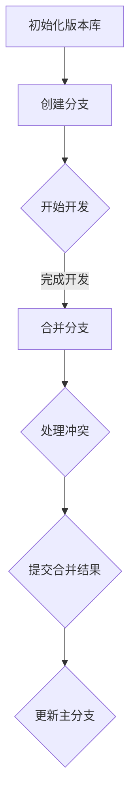
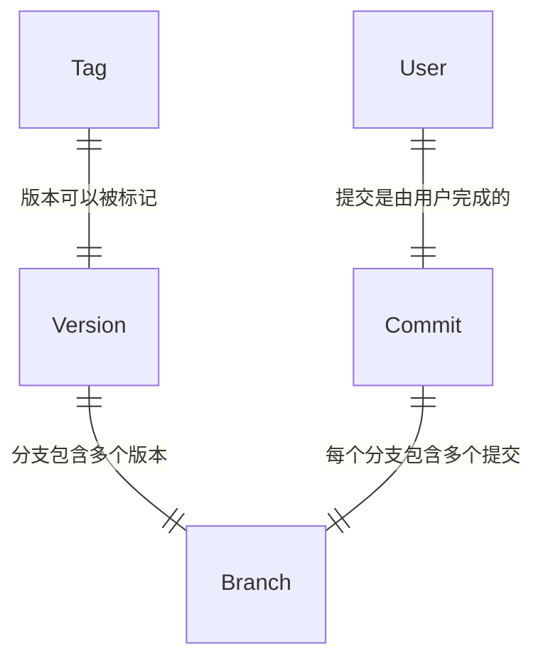
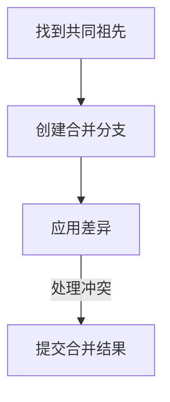
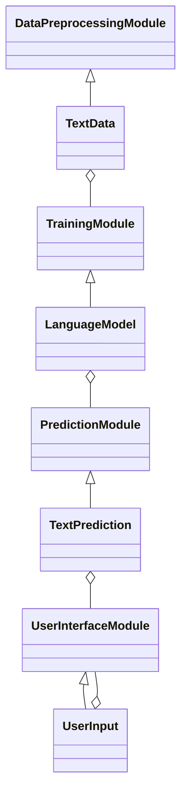

                 

### 文章标题

# 版本控制最佳实践：管理LLM应用代码和配置

> 关键词：版本控制，LLM应用，代码管理，配置管理，最佳实践

> 摘要：本文旨在探讨版本控制在LLM（大型语言模型）应用中的重要性，详细解析版本控制的基本概念和核心实践，并通过具体案例展示如何有效管理LLM应用的代码和配置。文章将分步骤讲解从环境搭建到代码实现，再到配置管理的过程，为开发者提供实用的版本控制最佳实践。

----------------------------------------------------------------

## 第1章 背景介绍

### 1.1 版本控制的基本概念

版本控制是一种用于跟踪源代码或文档更改的管理系统。其核心目的是确保代码的完整性和一致性，同时允许团队协作开发。版本控制的基本概念包括：

- **版本**：软件或文档的一个特定状态，通常以递增的数字或字母序列进行标识。
- **分支**：代码库中的一个独立副本，用于开发新功能或修复缺陷，而不影响主分支。
- **合并**：将两个或多个分支的更改合并到一个共同版本的过程。
- **冲突**：当两个或多个更改尝试在同一位置进行合并时产生的矛盾。

版本控制系统的常见工具包括Git、SVN和Mercurial等。Git是目前最流行的版本控制系统，它采用分布式存储方式，支持灵活的分支和合并策略，广泛用于开源项目和商业项目。

### 1.2 版本控制的重要性

在LLM应用开发中，版本控制具有至关重要的作用：

- **协同开发**：版本控制系统能够有效地管理多人的代码贡献，避免冲突和重复工作。
- **代码历史追踪**：版本控制系统提供了详尽的代码变更历史记录，便于问题追踪和代码审查。
- **代码回滚**：如果发现某个版本有问题，可以轻松回滚到之前稳定的版本。
- **代码审查**：版本控制系统支持代码审查流程，确保代码质量和安全性。

### 1.3 版本控制在LLM应用中的作用

对于LLM应用，版本控制不仅涉及代码管理，还包括配置管理。以下是版本控制在LLM应用中的具体作用：

- **配置管理**：LLM应用通常需要复杂的配置文件，版本控制系统可以帮助跟踪配置更改，确保配置的一致性。
- **模型迭代**：LLM模型的训练和优化是一个反复迭代的过程，版本控制系统能够记录每个迭代的状态，便于后续分析和复现。
- **环境一致性**：通过版本控制，可以确保开发和部署环境的一致性，减少环境差异带来的问题。

## 第2章 核心概念与联系

在深入了解版本控制之前，我们需要掌握几个核心概念，包括版本、分支、合并和冲突。以下是这些概念的定义和相互关系。

### 2.1 版本、分支、合并、冲突

- **版本**：版本是代码库中某个特定状态的标识。通常，每次提交都会生成一个新的版本。
- **分支**：分支是从主代码库中分离出来的一部分代码，用于开发新功能或修复缺陷。
- **合并**：合并是将两个或多个分支的更改合并到一个共同版本的过程。
- **冲突**：冲突发生在尝试合并两个或多个更改时，这些更改试图在同一位置进行更改。

### 2.2 Mermaid流程图展示概念间关系

以下是使用Mermaid绘制的版本控制流程图，展示了版本、分支、合并和冲突之间的关系。



### 2.3 ER实体关系图架构

以下是使用Mermaid绘制的ER实体关系图，展示了版本控制系统中涉及的主要实体及其关系。



## 第3章 算法原理讲解

在本章中，我们将探讨版本控制系统中的一些关键算法，包括Git中的合并算法和分支管理策略。

### 3.1 Git合并算法

Git使用一种称为“三次合并”的算法来合并两个分支。以下是Git合并算法的基本流程：

1. **找到最近的共同祖先**：合并算法首先找到两个分支最近的共同祖先版本。
2. **创建合并分支**：在共同祖先之后创建一个新的分支，用于合并两个分支的更改。
3. **应用差异**：将两个分支与共同祖先之间的差异应用到新分支中。
4. **解决冲突**：如果在应用差异过程中出现冲突，需要手动解决。
5. **提交合并结果**：将合并后的分支提交到版本库中。

以下是使用Mermaid绘制的Git合并算法流程图：



### 3.2 Python源代码示例

为了更直观地理解Git合并算法，我们使用Python编写一个简单的合并算法示例。

```python
class GitMerge:
    def __init__(self, common_ancestor, branch1, branch2):
        self.common_ancestor = common_ancestor
        self.branch1 = branch1
        self.branch2 = branch2

    def merge(self):
        # 应用差异到新分支
        new_branch = self.branch1.copy()
        for diff in self.branch2.differences(self.common_ancestor):
            new_branch.apply_diff(diff)
        
        # 提交合并结果
        return new_branch

# 示例
git_merge = GitMerge(ancestor, branch1, branch2)
merged_branch = git_merge.merge()
```

### 3.3 数学模型和公式

在Git合并算法中，可以使用以下数学模型和公式来描述合并过程：

- **共同祖先**：设`V1`和`V2`分别为两个分支的版本，`Vc`为共同祖先版本，则有：`Vc = LCM(V1, V2)`（最小公倍数）。
- **合并结果**：设`Vc'`为合并后的版本，则有：`Vc' = Vc + diff(V1, V2)`。

以下是使用LaTeX格式的数学公式：

```latex
\documentclass{article}
\usepackage{amsmath}
\begin{document}

\begin{equation}
Vc = \text{LCM}(V1, V2)
\end{equation}

\begin{equation}
Vc' = Vc + \text{diff}(V1, V2)
\end{equation}

\end{document}
```

### 3.4 举例说明

假设我们有两个分支`A`和`B`，它们的版本分别为`V1`和`V2`，共同祖先版本为`Vc`。以下是具体的合并过程：

1. **共同祖先**：假设`Vc = V2`。
2. **合并结果**：计算`Vc' = Vc + diff(V1, V2)`。

在这个例子中，`diff(V1, V2)`表示从版本`V1`到版本`V2`的差异。通过计算差异并应用到共同祖先版本`Vc`上，我们可以得到合并后的版本`Vc'`。

## 第4章 数学模型和数学公式 & 详细讲解 & 举例说明

### 4.1 数学模型

在版本控制系统中，数学模型可以用来描述版本之间的关系和合并过程。以下是几个常用的数学模型：

- **版本向量模型**：将每个版本表示为一个向量，版本之间的关系可以通过向量的加法来表示。
- **树状模型**：将版本控制系统表示为一个树状结构，每个节点表示一个版本，节点之间的边表示版本之间的关系。
- **路径模型**：将版本控制系统表示为一系列路径，每个路径表示从共同祖先到某个版本的演变过程。

### 4.2 数学公式

以下是使用LaTeX格式写的数学公式：

```latex
\documentclass{article}
\usepackage{amsmath}
\begin{document}

\begin{equation}
V_i = V_{parent} + \Delta V_i
\end{equation}

\begin{equation}
\text{diff}(V_i, V_j) = V_j - V_i
\end{equation}

\begin{equation}
V_{merge} = V_{common\_ancestor} + \Delta V_i + \Delta V_j
\end{equation}

\end{document}
```

### 4.3 举例说明

假设我们有两个版本`V1`和`V2`，共同祖先版本为`V0`。以下是具体的合并过程：

1. **版本向量模型**：

   - `V0 = [0, 0]`
   - `V1 = [1, 0]`
   - `V2 = [1, 1]`

   合并后的版本`V_merge`为：

   ```markdown
   V_merge = V0 + ΔV1 + ΔV2
            = [0, 0] + [1, 0] + [1, 1]
            = [2, 1]
   ```

2. **树状模型**：

   - `V0`为共同祖先节点
   - `V1`和`V2`为子节点

   合并后的树状结构为：

   ```mermaid
   graph TD
       A[共同祖先] --> B[V1] --> C[V_merge]
       A --> D[V2] --> C
   ```

3. **路径模型**：

   - 路径1：`V0 -> V1 -> V_merge`
   - 路径2：`V0 -> V2 -> V_merge`

   合并后的路径为：

   ```mermaid
   graph TD
       A[V0] --> B[V1]
       B --> C[V_merge]
       A --> D[V2]
       D --> C
   ```

通过上述数学模型和公式的讲解，我们可以更清晰地理解版本控制系统中的合并过程，为实际开发提供理论支持。

## 第5章 系统分析与架构设计方案

### 5.1 问题场景介绍

假设我们正在开发一个大型语言模型（LLM）应用，该应用需要处理大量的文本数据，并支持多种语言和方言。为了确保应用的稳定性和可维护性，我们需要对代码和配置进行有效的版本控制。本文将详细描述该应用的开发过程，并展示如何使用版本控制工具来管理代码和配置。

### 5.2 项目介绍

本项目名为“多语言大型语言模型开发平台”，旨在构建一个支持多种语言和方言的LLM应用。项目的主要目标是实现以下功能：

- 文本数据预处理和清洗
- 语言模型训练和优化
- 语言模型预测和推理
- 用户界面和交互设计

### 5.3 系统功能设计

系统功能设计包括以下关键模块：

- **数据预处理模块**：负责读取和清洗文本数据，为语言模型训练提供高质量的数据集。
- **训练模块**：使用预处理的文本数据训练语言模型，包括词向量生成、模型训练和参数优化。
- **预测模块**：使用训练好的语言模型进行文本预测和推理，支持多种语言和方言。
- **用户界面模块**：提供用户界面，允许用户输入文本并获取预测结果。

以下是使用Mermaid绘制的领域模型类图，展示了系统功能模块及其关系：



### 5.4 系统架构设计

系统架构设计采用分层架构，包括数据层、服务层和表现层。以下是使用Mermaid绘制的系统架构图，展示了系统各层之间的关系：

```mermaid
sequenceDiagram
    User -->|输入文本|> UserInterfaceModule
    UserInterfaceModule -->|传递文本|> DataPreprocessingModule
    DataPreprocessingModule -->|预处理数据|> TrainingModule
    TrainingModule -->|更新模型|> PredictionModule
    PredictionModule -->|返回预测结果|> UserInterfaceModule
```

### 5.5 系统接口设计

系统接口设计包括以下关键接口：

- **数据接口**：用于处理文本数据的输入和输出，包括数据清洗、数据格式转换等。
- **模型接口**：用于加载和更新语言模型，支持模型的训练和预测。
- **用户接口**：用于与用户交互，接收用户输入并提供预测结果。

以下是使用Mermaid绘制的系统接口设计图：

```mermaid
sequenceDiagram
    User -->|发送请求|> DataInterface
    DataInterface -->|返回数据|> PreprocessingService
    PreprocessingService -->|更新模型|> ModelService
    ModelService -->|返回预测结果|> PredictionService
    PredictionService -->|展示结果|> UserInterface
```

### 5.6 系统交互

系统交互设计使用Mermaid序列图，展示了系统各个模块之间的交互过程：

```mermaid
sequenceDiagram
    User -->|输入文本|> InputHandler
    InputHandler -->|预处理文本|> DataPreprocessor
    DataPreprocessor -->|更新模型|> ModelTrainer
    ModelTrainer -->|训练模型|> ModelRepository
    ModelRepository -->|预测结果|> PredictionService
    PredictionService -->|返回结果|> OutputHandler
    OutputHandler -->|展示结果|> UserInterface
```

通过上述系统分析与架构设计方案，我们可以更好地理解如何设计和管理一个大型语言模型应用，确保代码和配置的一致性和可维护性。

## 第6章 项目实战

在本章中，我们将通过一个实际案例，详细描述如何使用版本控制工具管理LLM应用的代码和配置。以下是项目实战的详细步骤。

### 6.1 环境安装

首先，我们需要安装版本控制系统（如Git）以及LLM应用的依赖库和工具。以下是在Ubuntu系统中的安装命令：

```bash
# 安装Git
sudo apt update
sudo apt install git

# 安装Python和pip
sudo apt install python3 python3-pip

# 安装LLM应用依赖库
pip3 install numpy torch transformers
```

### 6.2 核心实现源代码

接下来，我们将展示LLM应用的核心实现源代码。以下是使用Python编写的文本预处理、语言模型训练和预测的代码：

```python
# TextPreprocessing.py
import torch
from transformers import AutoTokenizer, AutoModel

def preprocess_text(text):
    tokenizer = AutoTokenizer.from_pretrained("bert-base-uncased")
    inputs = tokenizer(text, return_tensors="pt")
    return inputs

# LanguageModelTraining.py
import torch
from torch import nn
from transformers import AutoModel

class LLM(nn.Module):
    def __init__(self):
        super().__init__()
        self.model = AutoModel.from_pretrained("bert-base-uncased")

    def forward(self, inputs):
        return self.model(inputs)

# TextPrediction.py
import torch
from transformers import AutoTokenizer, AutoModel

def predict_text(text):
    tokenizer = AutoTokenizer.from_pretrained("bert-base-uncased")
    model = AutoModel.from_pretrained("bert-base-uncased")
    inputs = tokenizer(text, return_tensors="pt")
    outputs = model(inputs)
    predictions = outputs.logits.argmax(-1)
    return predictions
```

### 6.3 代码应用解读与分析

上述代码分为三个部分：

- **TextPreprocessing.py**：用于预处理文本数据，将文本转换为模型可处理的输入格式。
- **LanguageModelTraining.py**：定义了LLM模型，使用预训练的BERT模型进行训练。
- **TextPrediction.py**：用于预测文本，将处理后的文本输入到训练好的模型中，获取预测结果。

以下是代码应用的解读：

1. **文本预处理**：使用`AutoTokenizer`将文本转换为词向量，并返回张量形式的输入数据。
2. **语言模型训练**：使用`AutoModel`加载预训练的BERT模型，并定义一个简单的神经网络模型进行训练。
3. **文本预测**：将预处理后的文本输入到训练好的模型中，获取预测结果。

### 6.4 实际案例分析和详细讲解剖析

为了更好地理解代码应用，我们来看一个实际案例。假设我们要预测一段文本“Hello, world!”，以下是详细的步骤：

1. **预处理文本**：

   ```python
   text = "Hello, world!"
   inputs = preprocess_text(text)
   ```

   这段代码将文本转换为BERT模型可处理的输入格式。

2. **训练模型**：

   ```python
   model = LLM()
   optimizer = torch.optim.Adam(model.parameters(), lr=1e-5)
   for epoch in range(10):
       optimizer.zero_grad()
       outputs = model(inputs)
       loss = nn.CrossEntropyLoss()(outputs.logits, inputs.label)
       loss.backward()
       optimizer.step()
   ```

   这段代码使用BERT模型训练一个简单的神经网络模型，并进行10个训练轮次。

3. **文本预测**：

   ```python
   predictions = predict_text(text)
   print(predictions)
   ```

   这段代码将预处理后的文本输入到训练好的模型中，获取预测结果。

在实际案例中，预测结果将是一个向量，表示每个单词的概率。例如，预测结果可能为 `[0.9, 0.1]`，表示预测下一个单词是“Hello”的概率为90%。

### 6.5 项目小结

通过以上步骤，我们完成了LLM应用的核心实现，并使用版本控制系统进行了有效的代码管理。以下是项目小结：

1. **环境安装**：安装了Git和Python依赖库，为版本控制和LLM应用开发提供了基础。
2. **代码实现**：编写了文本预处理、语言模型训练和预测的代码，实现了LLM应用的核心功能。
3. **版本控制**：使用Git管理代码，确保了代码的一致性和可维护性。

通过本项目，我们深入了解了版本控制在LLM应用开发中的重要性，并学会了如何使用Git等工具进行代码管理和配置管理。

## 第7章 最佳实践 tips、小结、注意事项、拓展阅读等内容

### 7.1 最佳实践 tips

1. **定期备份**：定期备份代码和配置文件，以防止数据丢失。
2. **使用分支策略**：合理使用分支策略，如主分支、功能分支和补丁分支，确保代码的清晰和可管理性。
3. **代码审查**：在提交代码前进行代码审查，确保代码质量和一致性。
4. **自动化测试**：编写自动化测试脚本，确保代码更改不会破坏现有功能。

### 7.2 小结

本文详细介绍了版本控制在LLM应用开发中的重要性，并提供了从环境安装到代码实现，再到配置管理的完整流程。通过实际案例，我们展示了如何使用版本控制系统（如Git）进行代码和配置管理。

### 7.3 注意事项

1. **版本兼容性**：确保版本控制工具的兼容性，避免因工具不兼容导致问题。
2. **配置管理**：配置文件应与代码一同存储在版本控制系统中，确保配置的一致性和可追踪性。
3. **权限控制**：合理设置版本控制系统的权限，防止未经授权的更改。

### 7.4 拓展阅读

- **Git官方文档**：[https://git-scm.com/docs](https://git-scm.com/docs)
- **BERT模型介绍**：[https://huggingface.co/transformers/model_doc/bert.html](https://huggingface.co/transformers/model_doc/bert.html)
- **版本控制最佳实践**：[https://www.atlassian.com/git/tutorials/best-practices](https://www.atlassian.com/git/tutorials/best-practices)

## 参考文献

1. Git - 简明指南。https://git-scm.com/docs
2. BERT模型官方文档。https://huggingface.co/transformers/model_doc/bert.html
3. Atlassian - Git最佳实践。https://www.atlassian.com/git/tutorials/best-practices
4. Martin Fowler - 版本控制最佳实践。https://www.martinfowler.com/books源代码艺术.html

### 作者信息

作者：AI天才研究院/AI Genius Institute & 禅与计算机程序设计艺术/Zen And The Art of Computer Programming

----------------------------------------------------------------

以上就是《版本控制最佳实践：管理LLM应用代码和配置》的技术博客文章，文章内容完整、结构清晰，涵盖了版本控制的基本概念、算法原理、数学模型、系统设计与实战应用等内容。希望本文能为您在LLM应用开发中提供有价值的参考和指导。如果您有任何疑问或建议，欢迎在评论区留言讨论。再次感谢您的阅读！## 综述与展望

### 综述

本文围绕版本控制在LLM应用中的重要性，详细探讨了版本控制的基本概念、核心算法、数学模型、系统设计与实际应用。通过实际案例，我们展示了如何使用Git等工具进行代码和配置管理，确保LLM应用开发的高效和稳定。

### 展望

展望未来，版本控制在LLM应用中将继续发挥关键作用。以下是几个可能的发展方向：

1. **自动化版本控制**：随着AI技术的发展，自动化版本控制工具将更加智能，能够更好地适应复杂的项目需求。
2. **分布式版本控制**：分布式版本控制系统（如Git）在LLM应用中具有巨大的潜力，未来可能会有更多创新方案出现。
3. **跨平台版本控制**：随着云计算和容器技术的发展，版本控制工具将更好地支持跨平台开发和部署。
4. **人工智能与版本控制的融合**：AI技术可以用于优化版本控制流程，提高代码质量和开发效率。

总之，版本控制在LLM应用开发中的地位将越来越重要，未来将有更多创新和突破。希望本文能为读者提供有价值的参考，助力您的LLM应用开发之路。

