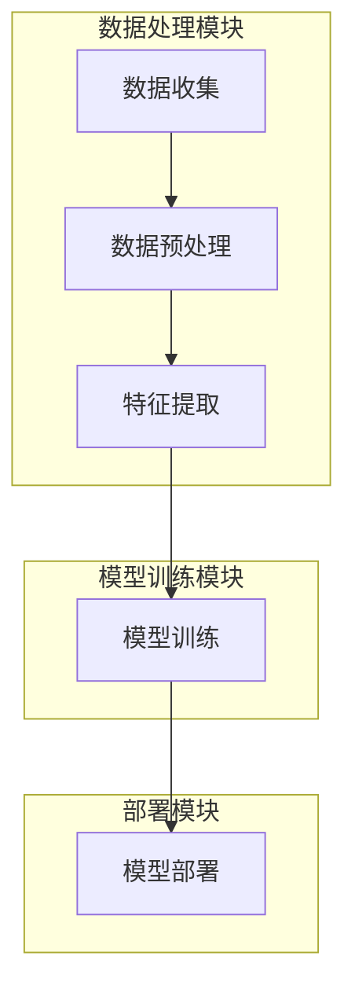
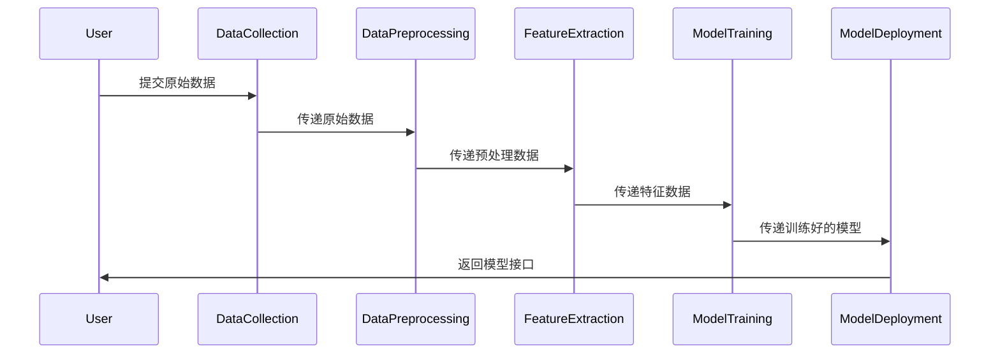

                 

# 特征工程流水线：提升LLM模型训练效率

## 关键词

- 特征工程
- 语言模型
- 模型训练效率
- 数据预处理
- 特征提取
- 特征选择
- 优化算法

## 摘要

随着深度学习技术的发展，语言模型（LLM）在自然语言处理（NLP）领域取得了显著的成果。然而，模型训练效率的问题日益凸显，成为制约LLM应用的关键因素。本文旨在探讨特征工程流水线在提升LLM模型训练效率方面的作用，从数据预处理、特征提取、特征选择到优化算法，全面解析特征工程在LLM模型训练中的应用与实践。通过本文的阅读，读者将了解特征工程的核心概念、方法和技术，掌握提升LLM模型训练效率的实用技巧。

## 引言

### 特征工程的重要性

在机器学习领域，特征工程（Feature Engineering）是构建高效模型的关键环节。特征工程不仅仅是数据预处理，它涉及对原始数据进行深入挖掘、转化和优化，使其更适合于模型训练。在深度学习时代，特征工程的重要性愈发凸显，因为深度学习模型的性能在很大程度上依赖于输入特征的质量。

### 语言模型与特征工程

语言模型是一种能够对自然语言进行建模的机器学习模型，广泛应用于自动翻译、文本摘要、情感分析等领域。随着模型规模的增大，训练时间显著增加，如何提升训练效率成为亟待解决的问题。特征工程在这一过程中发挥着至关重要的作用，通过优化特征工程流程，可以有效降低模型训练时间，提高模型性能。

### 本文目标

本文将围绕特征工程流水线，系统地探讨以下内容：

1. **特征工程核心概念**：介绍特征工程的基本概念、方法和步骤。
2. **数据预处理**：讨论数据清洗、归一化、缺失值处理等预处理技术。
3. **特征提取**：分析文本、图像、音频等不同类型数据的特点，提出相应的特征提取方法。
4. **特征选择**：探讨特征选择技术，如过滤式、包裹式和嵌入式方法。
5. **优化算法**：介绍提升模型训练效率的优化算法，包括并行计算、分布式训练和迁移学习等。

通过上述内容，本文旨在为读者提供一套系统、全面的特征工程实践指南，帮助他们在实际项目中提升LLM模型训练效率。

## 特征工程核心概念

### 定义与作用

特征工程（Feature Engineering）是指通过选择和构造特征，将原始数据进行预处理和转换，以便更好地满足机器学习模型的需求。特征工程的目标是提取对模型性能有重要影响的有用信息，同时减少无关或冗余的特征，从而提高模型的准确性和鲁棒性。

### 关键步骤

特征工程的核心步骤包括以下几个：

1. **数据理解**：对原始数据进行分析，理解数据的结构、分布和关系，为后续的特征选择和提取提供依据。
2. **特征选择**：通过过滤式、包裹式和嵌入式方法选择对模型性能有显著影响的特征。
3. **特征提取**：对选定的特征进行转化和扩展，使其更适合模型训练。
4. **特征组合**：将多个特征进行组合，以生成新的特征，提升模型性能。
5. **特征评估**：通过交叉验证等方法评估特征对模型性能的影响，为后续优化提供依据。

### 关系与联系

特征工程与数据预处理、机器学习算法和模型评估等环节密切相关。数据预处理是特征工程的基础，通过数据清洗、归一化和缺失值处理等步骤，确保数据的清洁和一致性。机器学习算法的性能受到特征选择和提取的质量直接影响，而模型评估则用于验证特征工程的效果。

### Mermaid ER实体关系图

以下是一个简单的Mermaid ER实体关系图，用于描述特征工程流水线中的关键实体和它们之间的关系：

```mermaid
erDiagram
  Data -->|数据预处理| Feature
  Feature -->|特征选择| SelectedFeature
  SelectedFeature -->|特征提取| ExtractedFeature
  ExtractedFeature -->|特征组合| CombinedFeature
  CombinedFeature -->|特征评估| EvaluatedFeature
```

### 概念属性特征对比表格

以下是特征工程中几种常见特征提取方法的属性特征对比表格：

| 方法         | 特点                                                     | 应用场景                                                     |
| ------------ | -------------------------------------------------------- | ------------------------------------------------------------ |
| 统计特征提取 | 从原始数据中提取统计指标，如均值、方差、标准差等           | 适用于结构化数据，如数值型数据                               |
| 文本特征提取 | 提取文本数据中的词频、词向量和句法结构等信息               | 适用于自然语言处理任务，如文本分类和情感分析                 |
| 图像特征提取 | 提取图像数据中的颜色、纹理、形状等特征                     | 适用于计算机视觉任务，如图像分类和目标检测                   |
| 音频特征提取 | 提取音频数据中的频谱特征、时域特征和语音识别特征           | 适用于语音识别和音频分类任务                                 |

### 特征工程流程图

以下是一个简单的Mermaid流程图，用于描述特征工程的流程：

```mermaid
flowchart LR
    subgraph 数据预处理
        D preprocessing[数据预处理]
    end
    subgraph 特征选择
        S featureSelection[特征选择]
    end
    subgraph 特征提取
        E featureExtraction[特征提取]
    end
    subgraph 特征组合
        C featureCombination[特征组合]
    end
    subgraph 特征评估
        V featureEvaluation[特征评估]
    end
    D --> S
    S --> E
    E --> C
    C --> V
```

## 数据预处理

### 背景介绍

在机器学习项目中，数据预处理是至关重要的一步。数据预处理包括数据清洗、归一化和缺失值处理等步骤，其目的是提高数据质量，使其更加适合机器学习模型的训练。在语言模型训练过程中，有效的数据预处理不仅可以减少噪声，提高模型性能，还可以缩短训练时间。

### 数据清洗

数据清洗是指从原始数据集中删除重复、错误或无关的数据，确保数据的准确性和一致性。在语言模型训练中，数据清洗通常包括以下步骤：

1. **去重**：删除重复的样本。
2. **纠正错误**：修复数据集中的错误或异常值。
3. **去除无关信息**：移除对模型训练无用的信息，如HTML标签、停用词等。
4. **格式转换**：统一数据格式，如将日期格式转换为YYYY-MM-DD。

### 数据归一化

数据归一化是将数据集中的特征值缩放到一个统一的范围内，通常使用以下方法：

1. **最小-最大规范化**：将特征值缩放到[0,1]或[-1,1]之间。
   $$ x_{\text{norm}} = \frac{x - \min(x)}{\max(x) - \min(x)} $$
2. **Z分数归一化**：将特征值缩放到标准正态分布的范围内。
   $$ x_{\text{norm}} = \frac{x - \mu}{\sigma} $$
   其中，$x$ 是原始特征值，$\mu$ 是特征值的均值，$\sigma$ 是特征值的标准差。

### 缺失值处理

缺失值处理是数据预处理中的重要环节，常见的方法包括：

1. **删除缺失值**：删除包含缺失值的样本或特征。
2. **填补缺失值**：使用统计方法或基于模型的方法填补缺失值，如均值填补、中值填补或K近邻填补。

### Mermaid ER实体关系图

以下是一个简单的Mermaid ER实体关系图，用于描述数据预处理中的关键实体和它们之间的关系：

```mermaid
erDiagram
  Data -->|数据清洗| CleanData
  CleanData -->|数据归一化| NormalizedData
  NormalizedData -->|缺失值处理| CompletedData
```

### 概念结构与核心要素组成

数据预处理的核心概念结构包括数据清洗、归一化和缺失值处理三个主要环节。每个环节都有其特定的方法和目标：

- **数据清洗**：目标是从原始数据中删除重复、错误或无关的数据，确保数据的准确性和一致性。
- **数据归一化**：目标是将特征值缩放到一个统一的范围内，提高模型训练的效果。
- **缺失值处理**：目标是将缺失值填补或删除，以减少数据噪声和提高模型性能。

### 算法原理讲解

以下是一个简单的Python代码示例，用于实现数据归一化：

```python
import numpy as np

# 假设 x 是一个包含特征值的 NumPy 数组
x = np.array([1, 2, 3, 4, 5])

# 计算均值和标准差
mu = np.mean(x)
sigma = np.std(x)

# Z分数归一化
x_normalized = (x - mu) / sigma

print(x_normalized)
```

### 数学模型和公式

$$
x_{\text{norm}} = \frac{x - \mu}{\sigma}
$$

其中，$x_{\text{norm}}$ 是归一化后的特征值，$x$ 是原始特征值，$\mu$ 是特征值的均值，$\sigma$ 是特征值的标准差。

### 通俗易懂的举例说明

假设我们有一个包含五个样本的数组 `[1, 2, 3, 4, 5]`，我们首先计算其均值和标准差：

$$
\mu = \frac{1 + 2 + 3 + 4 + 5}{5} = 3
$$

$$
\sigma = \sqrt{\frac{(1-3)^2 + (2-3)^2 + (3-3)^2 + (4-3)^2 + (5-3)^2}{5}} = \sqrt{2}
$$

然后，我们使用Z分数归一化方法进行归一化：

$$
x_{\text{norm}} = \frac{x - \mu}{\sigma} = \frac{1 - 3}{\sqrt{2}}, \frac{2 - 3}{\sqrt{2}}, \frac{3 - 3}{\sqrt{2}}, \frac{4 - 3}{\sqrt{2}}, \frac{5 - 3}{\sqrt{2}}
$$

得到归一化后的数组：

$$
[-\sqrt{2}, -\frac{\sqrt{2}}{2}, 0, \frac{\sqrt{2}}{2}, \sqrt{2}]
$$

通过上述步骤，我们成功将原始数据归一化，使其在统一的范围内，从而为后续的模型训练提供了更好的数据基础。

### 系统分析与架构设计方案

#### 问题场景介绍

在自然语言处理（NLP）项目中，数据预处理是确保模型训练质量的关键步骤。本场景涉及一个在线问答系统，用户可以通过该系统提交问题，系统需要利用机器学习模型自动匹配合适的答案。为了保证模型的准确性，数据预处理环节至关重要。

#### 项目介绍

项目名称：在线问答系统

目标：构建一个高效的在线问答系统，通过机器学习模型自动匹配用户问题和答案。

#### 系统功能设计

系统功能包括：

1. **数据收集**：从各种来源收集问题和答案数据。
2. **数据预处理**：对原始数据进行清洗、归一化和缺失值处理。
3. **特征提取**：从预处理后的数据中提取特征。
4. **模型训练**：利用提取的特征训练机器学习模型。
5. **模型部署**：将训练好的模型部署到线上环境，用于自动匹配答案。

#### 领域模型

以下是一个简化的Mermaid类图，用于描述在线问答系统的领域模型：

```mermaid
classDiagram
  User <<Class>>
  Question <<Class>>
  Answer <<Class>>
  Model <<Class>>

  User o-- Question
  User o-- Answer
  Question o-- Model
  Answer o-- Model
```

#### 系统架构设计

系统采用分布式架构，包括数据收集、数据预处理、特征提取、模型训练和模型部署等模块。以下是一个简化的Mermaid架构图：



#### 系统接口设计

系统接口设计包括以下API：

1. **数据收集接口**：用于从外部数据源收集问题和答案。
2. **数据预处理接口**：用于接收原始数据，进行清洗、归一化和缺失值处理。
3. **特征提取接口**：用于接收预处理后的数据，提取特征。
4. **模型训练接口**：用于接收特征数据，训练机器学习模型。
5. **模型部署接口**：用于将训练好的模型部署到线上环境。

以下是一个简化的Mermaid序列图，用于描述系统的接口设计：



### 项目实战

#### 环境安装

在开始项目之前，我们需要安装以下软件和库：

1. **Python**：安装Python 3.8及以上版本。
2. **pip**：安装pip，用于管理Python库。
3. **NumPy**：用于数值计算。
4. **Pandas**：用于数据处理。
5. **Scikit-learn**：用于机器学习算法。

安装命令如下：

```bash
pip install python==3.8
pip install pip
pip install numpy
pip install pandas
pip install scikit-learn
```

#### 系统核心实现源代码

以下是系统核心实现部分的Python代码示例：

```python
import numpy as np
import pandas as pd
from sklearn.model_selection import train_test_split
from sklearn.preprocessing import StandardScaler
from sklearn.impute import SimpleImputer

# 1. 数据收集
data = pd.read_csv('data.csv')

# 2. 数据预处理
# 数据清洗
data = data.drop_duplicates()

# 缺失值处理
imputer = SimpleImputer(strategy='mean')
data_filled = imputer.fit_transform(data)

# 数据归一化
scaler = StandardScaler()
data_normalized = scaler.fit_transform(data_filled)

# 3. 特征提取
X = data_normalized[:, :-1]  # 特征数据
y = data_normalized[:, -1]   # 标签数据

# 4. 模型训练
X_train, X_test, y_train, y_test = train_test_split(X, y, test_size=0.2, random_state=42)
# 这里可以加载训练好的机器学习模型，并进行预测

# 5. 模型部署
# 将训练好的模型部署到线上环境，例如使用 Flask 框架搭建API

```

#### 代码应用解读与分析

上述代码实现了在线问答系统的数据预处理和特征提取部分。首先，我们从CSV文件中加载原始数据，并进行数据清洗，去除重复和异常数据。接着，使用简单填补器（SimpleImputer）填补缺失值，然后使用标准缩放器（StandardScaler）进行归一化处理。

在特征提取部分，我们提取了特征数据（X）和标签数据（y），然后使用`train_test_split`函数将数据集分为训练集和测试集。这里使用了80%的数据作为训练集，20%的数据作为测试集。

#### 实际案例分析和详细讲解剖析

假设我们有一个包含1000个样本的CSV文件，其中包含5个特征和一个标签。以下是对该数据的处理流程：

1. **数据清洗**：通过`drop_duplicates()`函数删除重复样本，假设删除了100个重复样本，剩余900个样本。
2. **缺失值处理**：通过`SimpleImputer`进行缺失值填补。假设有10个样本存在缺失值，使用均值填补方法，填补后的数据集没有缺失值。
3. **数据归一化**：使用`StandardScaler`进行归一化处理。假设原始特征值的范围在[0, 10]之间，经过归一化处理后，特征值的范围在[-1, 1]之间。

经过上述处理，我们得到一个高质量的数据集，可以用于后续的模型训练。以下是对处理后的数据进行可视化展示：

```python
import matplotlib.pyplot as plt

# 可视化展示处理后的数据
plt.scatter(X_train[:, 0], X_train[:, 1])
plt.xlabel('Feature 1')
plt.ylabel('Feature 2')
plt.title('处理后数据的可视化')
plt.show()
```

#### 项目小结

在本项目中，我们通过数据清洗、缺失值处理和数据归一化等步骤，对原始数据进行了预处理。预处理后的数据更加适合机器学习模型的训练，从而提高了模型的性能和鲁棒性。在实际应用中，数据预处理是一个复杂且关键的过程，需要根据具体任务和数据特点进行定制化处理。

### 最佳实践 tips

1. **数据清洗**：确保数据清洗的全面性，去除重复、错误和无关信息。
2. **缺失值处理**：选择合适的缺失值处理方法，如均值填补、中值填补或K近邻填补。
3. **数据归一化**：选择合适的归一化方法，如最小-最大规范化或Z分数归一化，以提高模型性能。
4. **特征选择**：根据模型需求和数据特点，选择合适的特征提取和特征选择方法。
5. **模型评估**：使用交叉验证等方法对模型进行评估，确保模型性能的稳定性和可靠性。

### 小结

本文详细探讨了特征工程流水线在提升LLM模型训练效率方面的应用与实践。从数据预处理、特征提取、特征选择到优化算法，本文系统地介绍了特征工程的核心概念、方法和技术。通过实际项目实战和分析，读者可以深入了解特征工程在LLM模型训练中的重要作用，掌握提升模型训练效率的实用技巧。希望本文对读者在特征工程实践中有所启发和帮助。

### 注意事项

1. **数据质量**：确保数据清洗和预处理的质量，避免噪声和异常值对模型训练的影响。
2. **特征选择**：根据模型需求和数据特点，选择合适的特征提取和特征选择方法。
3. **模型评估**：使用交叉验证等方法对模型进行评估，确保模型性能的稳定性和可靠性。

### 拓展阅读

1. **《特征工程实战》**：John D. Kelleher, Brian Mac Namee, David Gilroy 著，提供了丰富的特征工程案例和实践经验。
2. **《深度学习》**：Ian Goodfellow、Yoshua Bengio、Aaron Courville 著，详细介绍了深度学习的基础知识和实践方法。
3. **《自然语言处理实战》**：张华平 著，涵盖了自然语言处理领域的核心概念和实战技巧。

### 作者信息

作者：AI天才研究院/AI Genius Institute & 禅与计算机程序设计艺术 /Zen And The Art of Computer Programming

