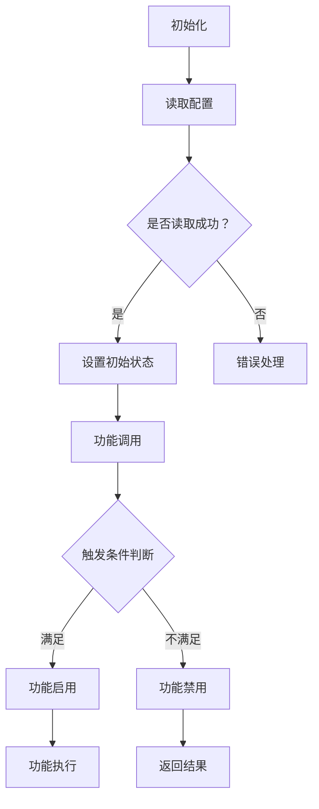
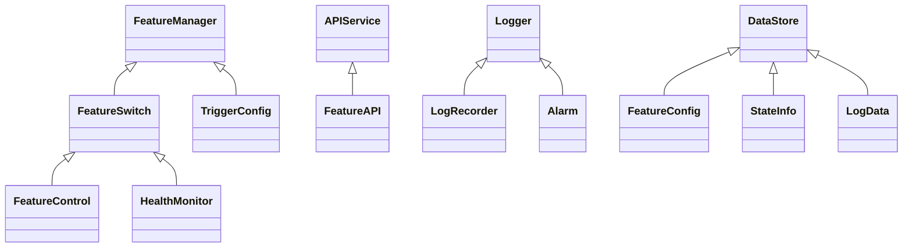

                 

# 特性开关：灵活控制AI功能发布的工具

> 关键词：特性开关，AI功能发布，灵活控制，系统架构，实现方法，应用案例，最佳实践

> 摘要：本文将深入探讨特性开关这一灵活控制AI功能发布的重要工具。我们将逐步分析特性开关的概念、原理、架构设计、实现方法，以及在不同应用场景中的实际应用，帮助读者全面理解特性开关的价值和作用。

## 引言

### 1.1 什么是特性开关

特性开关（Feature Switch）是一种软件工程概念，用于动态地启用或禁用软件系统中的特定功能。它允许开发团队在不影响整个系统稳定性的情况下，独立地对功能模块进行测试和部署。特性开关的本质是通过对系统配置或代码层面的控制，实现功能的开关状态。

### 1.1.1 特性开关的定义

特性开关是一个逻辑控制开关，它定义了系统功能的开启或关闭条件。这种开关通常通过配置文件、代码注释或特定的API接口来实现。

### 1.1.2 特性开关在AI系统中的作用

在AI系统中，特性开关的作用尤为重要。首先，它可以确保新功能的平稳上线，避免因功能问题导致的系统崩溃。其次，特性开关可以帮助团队快速迭代和测试，提高开发效率。最后，特性开关可以实现功能的灰度发布，逐步扩大新功能的覆盖范围，降低风险。

### 1.1.3 特性开关的重要性

特性开关在AI系统开发中具有重要意义。它不仅提高了系统的可维护性和可扩展性，还降低了新功能发布的风险。通过特性开关，开发团队能够更加灵活地控制系统的功能，实现快速迭代和高效开发。

### 1.2 AI功能发布的挑战

AI功能发布的挑战主要体现在以下几个方面：

#### 1.2.1 功能迭代的困难

AI系统的迭代速度往往很快，新功能不断涌现。如何在不影响系统稳定性的情况下快速部署这些新功能，成为了一个难题。

#### 1.2.2 安全性与可控性需求

AI系统通常涉及敏感数据和关键业务，因此在发布新功能时，安全性问题和可控性需求尤为重要。

#### 1.2.3 特性开关如何解决这些问题

特性开关通过提供一种灵活的发布机制，能够解决上述问题。它允许开发团队在发布新功能时，先在一个小范围内进行测试，确保功能稳定后，再逐步扩大覆盖范围。同时，特性开关还提供了丰富的监控和日志功能，有助于及时发现和解决问题。

## 背景介绍

### 2.1 特性开关的基本原理

#### 2.1.1 特性开关的工作机制

特性开关的工作机制主要包括以下几个方面：

1. **配置管理**：特性开关通过配置文件或数据库来管理特性状态。
2. **API接口**：系统通过特定的API接口调用特性开关，实现对功能的控制。
3. **代码集成**：特性开关需要与系统代码紧密集成，以便在运行时动态地启用或禁用功能。

#### 2.1.2 特性开关的架构设计

特性开关的架构设计通常包括以下几个核心组件：

1. **配置管理器**：负责管理特性配置。
2. **特性控制器**：实现特性开关的逻辑控制。
3. **日志与监控**：记录特性开关的操作日志，并监控系统状态。

#### 2.1.3 特性开关的组成部分

特性开关的主要组成部分包括：

1. **特性定义**：定义了特性的名称、描述、状态等信息。
2. **触发器**：定义了触发特性开关的条件。
3. **执行器**：负责执行特性开关的操作，如启用或禁用功能。

### 2.2 特性开关的架构设计

#### 2.2.1 系统架构

特性开关的系统架构通常采用分布式设计，以确保高可用性和可扩展性。系统架构包括以下几个关键模块：

1. **特性管理模块**：负责管理特性配置和状态。
2. **API服务模块**：提供特性开关的API接口。
3. **日志监控模块**：记录和监控特性开关的操作。

#### 2.2.2 数据流设计

特性开关的数据流设计包括以下几个方面：

1. **特性配置加载**：系统启动时，从配置文件或数据库中加载特性配置。
2. **特性请求处理**：客户端通过API请求特性开关，系统根据配置和触发器决定是否执行操作。
3. **特性状态更新**：执行操作后，更新特性状态并记录日志。

#### 2.2.3 控制流设计

特性开关的控制流设计主要包括以下几个方面：

1. **特性启用/禁用**：根据特性配置和触发器决定是否启用或禁用功能。
2. **异常处理**：在特性开关操作过程中，捕获和处理异常情况。
3. **权限控制**：确保只有授权用户才能操作特性开关。

### 2.3 特性开关的实现方法

#### 2.3.1 编码实现

特性开关的编码实现通常涉及以下几个方面：

1. **配置管理**：通过代码或配置文件管理特性配置。
2. **API接口**：设计并实现特性开关的API接口。
3. **代码集成**：将特性开关与系统代码集成，实现功能的动态控制。

#### 2.3.2 配置管理

特性开关的配置管理主要包括以下几个方面：

1. **特性定义**：定义特性的名称、描述、状态等信息。
2. **触发器配置**：定义触发特性开关的条件。
3. **配置加载**：从配置文件或数据库中加载特性配置。

#### 2.3.3 系统集成与部署

特性开关的系统集成与部署包括以下几个方面：

1. **集成测试**：在系统集成测试阶段，确保特性开关的正常工作。
2. **部署**：将特性开关部署到生产环境，并确保其稳定运行。
3. **监控与维护**：持续监控特性开关的状态，并及时处理异常情况。

## 核心技术

### 3.1 特性开关的核心功能

特性开关的核心功能主要包括以下几个方面：

#### 3.1.1 功能控制

功能控制是特性开关最基本的功能，它允许开发团队动态地启用或禁用系统中的特定功能。功能控制通常通过API接口实现，开发人员可以在代码中灵活地调用特性开关，实现功能的动态控制。

#### 3.1.2 优雅降级

优雅降级是特性开关的一项重要功能，它允许开发团队在系统负载过高或功能出现问题时，自动将部分功能降级或禁用，以保障系统的稳定性和可用性。优雅降级通常通过配置触发器实现，当触发条件满足时，系统会自动执行降级操作。

#### 3.1.3 健康监控

健康监控是特性开关的另一个核心功能，它允许开发团队实时监控特性开关的状态，及时发现并解决问题。健康监控通常通过日志记录和报警机制实现，开发人员可以通过监控系统日志，了解特性开关的运行状态。

### 3.2 特性开关的实现细节

#### 3.2.1 接口设计

特性开关的接口设计需要考虑以下几个方面：

1. **RESTful API**：设计RESTful风格的API接口，便于与其他系统集成。
2. **参数设计**：定义API接口的参数，包括特性名称、状态、触发条件等。
3. **权限控制**：确保只有授权用户才能调用特性开关接口。

#### 3.2.2 数据存储

特性开关的数据存储需要考虑以下几个方面：

1. **关系型数据库**：使用关系型数据库存储特性配置和状态信息。
2. **NoSQL数据库**：对于大规模数据存储，可以考虑使用NoSQL数据库，如MongoDB。
3. **缓存**：使用缓存技术，如Redis，提高数据访问速度。

#### 3.2.3 安全机制

特性开关的安全机制包括以下几个方面：

1. **身份认证**：实现用户身份认证，确保只有授权用户才能操作特性开关。
2. **权限控制**：实现权限控制，确保用户只能操作自己有权限的特性和操作。
3. **数据加密**：对存储和传输的数据进行加密，保障数据安全。

### 3.3 特性开关的性能优化

#### 3.3.1 负载均衡

特性开关的性能优化需要考虑以下几个方面：

1. **负载均衡**：使用负载均衡器，如Nginx，分配请求到多个实例，提高系统性能。
2. **线程池**：使用线程池技术，提高并发处理能力。
3. **异步处理**：使用异步处理技术，减少同步操作对系统性能的影响。

#### 3.3.2 缓存策略

特性开关的缓存策略包括以下几个方面：

1. **本地缓存**：在特性开关内部实现本地缓存，提高数据访问速度。
2. **分布式缓存**：使用分布式缓存，如Redis，实现跨节点数据共享。
3. **缓存一致性**：保证缓存数据与存储数据的一致性，避免数据不一致问题。

#### 3.3.3 高可用性设计

特性开关的高可用性设计包括以下几个方面：

1. **主从架构**：采用主从架构，确保主节点故障时，从节点能够自动接管。
2. **故障转移**：实现故障转移机制，确保系统在故障情况下能够快速恢复。
3. **集群部署**：将特性开关部署到多个节点，提高系统容错能力。

## 应用场景

### 4.1 不同AI应用场景下的特性开关

特性开关在不同AI应用场景下具有不同的应用价值。以下是一些典型的应用场景：

#### 4.1.1 机器学习应用

在机器学习应用中，特性开关可以帮助开发团队在训练和部署模型时，灵活地调整模型的参数和超参数，实现模型的优化和调试。

#### 4.1.2 自然语言处理

在自然语言处理（NLP）领域，特性开关可以用于控制文本分类、情感分析、命名实体识别等功能模块的开关状态，实现功能的灵活发布和迭代。

#### 4.1.3 计算机视觉

在计算机视觉领域，特性开关可以用于控制图像识别、目标检测、人脸识别等功能模块的开关状态，实现功能的逐步上线和优化。

### 4.2 特性开关在项目中的应用案例

#### 4.2.1 案例一：在线教育平台

在线教育平台在发布新功能时，可以使用特性开关实现灰度发布，逐步扩大新功能的覆盖范围。通过特性开关，平台可以确保新功能的稳定性和安全性，避免因功能问题导致的系统崩溃。

#### 4.2.2 案例二：金融风控系统

金融风控系统在发布新功能时，需要考虑安全性和可控性。特性开关可以帮助团队在发布新功能时，先在一个小范围内进行测试，确保功能稳定后再逐步扩大覆盖范围。此外，特性开关还可以实现功能的优雅降级，降低系统风险。

#### 4.2.3 案例三：智能语音助手

智能语音助手在发布新功能时，可以使用特性开关实现功能的灵活控制。例如，在发布新技能时，可以先在一个用户群体中进行测试，确保技能稳定后再逐步扩大覆盖范围。特性开关还可以用于控制语音助手的响应速度和智能程度，实现个性化体验。

## 案例研究

### 5.1 案例一：特性开关在电商平台的应用

#### 5.1.1 背景介绍

电商平台在发布新功能时，需要确保功能的稳定性和用户体验。特性开关可以帮助团队在发布新功能时，先在一个小范围内进行测试，确保功能稳定后再逐步扩大覆盖范围。此外，特性开关还可以用于控制功能的访问权限和价格策略，实现精细化运营。

#### 5.1.2 系统设计

电商平台采用特性开关实现功能控制的系统设计主要包括以下几个方面：

1. **特性定义**：定义电商平台的新功能，如购物车、优惠券、推荐系统等。
2. **触发器配置**：配置触发特性开关的条件，如用户角色、访问权限等。
3. **API接口**：设计特性开关的API接口，供前端和后台系统调用。

#### 5.1.3 实现过程

电商平台实现特性开关的功能包括以下几个步骤：

1. **特性定义与配置**：开发团队定义新功能，并配置触发器。
2. **接口设计与开发**：开发特性开关的API接口，实现功能控制的逻辑。
3. **系统集成与测试**：将特性开关集成到电商平台系统中，并进行功能测试。
4. **部署与上线**：将特性开关部署到生产环境，并逐步扩大功能覆盖范围。

#### 5.1.4 应用效果

电商平台采用特性开关后，实现了以下效果：

1. **功能稳定性提升**：通过特性开关，新功能在发布前经过充分测试，确保稳定性和用户体验。
2. **开发效率提高**：特性开关降低了新功能的发布风险，提高了开发团队的效率。
3. **精细化运营**：特性开关实现了对功能的精细化控制，有助于电商平台实现个性化运营和精细化营销。

### 5.2 案例二：特性开关在医疗领域的应用

#### 5.2.1 背景介绍

医疗领域在发布新功能时，需要考虑安全性和可控性。特性开关可以帮助团队在发布新功能时，先在一个小范围内进行测试，确保功能稳定后再逐步扩大覆盖范围。此外，特性开关还可以用于控制医疗数据的访问权限和使用范围，保障患者隐私和安全。

#### 5.2.2 系统设计

医疗领域采用特性开关实现功能控制的系统设计主要包括以下几个方面：

1. **特性定义**：定义医疗领域的新功能，如电子病历、智能诊断、健康监测等。
2. **触发器配置**：配置触发特性开关的条件，如医生角色、患者身份等。
3. **API接口**：设计特性开关的API接口，供前端和后台系统调用。

#### 5.2.3 实现过程

医疗领域实现特性开关的功能包括以下几个步骤：

1. **特性定义与配置**：开发团队定义新功能，并配置触发器。
2. **接口设计与开发**：开发特性开关的API接口，实现功能控制的逻辑。
3. **系统集成与测试**：将特性开关集成到医疗系统中，并进行功能测试。
4. **部署与上线**：将特性开关部署到生产环境，并逐步扩大功能覆盖范围。

#### 5.2.4 应用效果

医疗领域采用特性开关后，实现了以下效果：

1. **功能稳定性提升**：通过特性开关，新功能在发布前经过充分测试，确保稳定性和患者安全。
2. **开发效率提高**：特性开关降低了新功能的发布风险，提高了开发团队的效率。
3. **隐私安全保护**：特性开关实现了对医疗数据的精细化控制，保障了患者隐私和安全。

### 5.3 案例三：特性开关在自动驾驶中的应用

#### 5.3.1 背景介绍

自动驾驶系统在发布新功能时，需要考虑安全性和可控性。特性开关可以帮助团队在发布新功能时，先在一个小范围内进行测试，确保功能稳定后再逐步扩大覆盖范围。此外，特性开关还可以用于控制自动驾驶系统的行驶速度、行驶路线等，实现自动驾驶的精细控制。

#### 5.3.2 系统设计

自动驾驶系统采用特性开关实现功能控制的系统设计主要包括以下几个方面：

1. **特性定义**：定义自动驾驶的新功能，如自动泊车、车道保持、智能导航等。
2. **触发器配置**：配置触发特性开关的条件，如车速、环境条件等。
3. **API接口**：设计特性开关的API接口，供前端和后台系统调用。

#### 5.3.3 实现过程

自动驾驶系统实现特性开关的功能包括以下几个步骤：

1. **特性定义与配置**：开发团队定义新功能，并配置触发器。
2. **接口设计与开发**：开发特性开关的API接口，实现功能控制的逻辑。
3. **系统集成与测试**：将特性开关集成到自动驾驶系统中，并进行功能测试。
4. **部署与上线**：将特性开关部署到生产环境，并逐步扩大功能覆盖范围。

#### 5.3.4 应用效果

自动驾驶系统采用特性开关后，实现了以下效果：

1. **功能稳定性提升**：通过特性开关，新功能在发布前经过充分测试，确保稳定性和安全性。
2. **开发效率提高**：特性开关降低了新功能的发布风险，提高了开发团队的效率。
3. **自动驾驶精细控制**：特性开关实现了对自动驾驶系统的精细控制，提高了自动驾驶的稳定性和可靠性。

## 最佳实践

### 6.1 最佳实践

在实施特性开关时，以下最佳实践有助于提高效果：

1. **明确功能边界**：在定义特性时，明确功能的边界和职责，避免功能重叠和冲突。
2. **合理配置触发器**：根据实际需求，合理配置触发器，确保特性开关的灵活性。
3. **全面测试**：在特性开关部署前，进行全面测试，确保功能正常和稳定性。
4. **监控与反馈**：持续监控特性开关的状态，及时反馈和解决问题。

### 6.2 注意事项

在实施特性开关时，需要注意以下几点：

1. **安全性**：确保特性开关的安全性，避免未经授权的操作。
2. **可扩展性**：设计特性开关时，考虑系统的可扩展性，以便未来新增功能。
3. **文档与培训**：提供详细的文档和培训，确保团队成员了解特性开关的使用方法。

### 6.3 拓展阅读

以下是一些与特性开关相关的拓展阅读：

1. 《特性开关：设计与实战》
2. 《特性管理：构建可扩展的系统》
3. 《分布式系统中的特性开关》

## 结束语

特性开关是一种强大的工具，它帮助开发团队在发布新功能时，实现灵活控制和高可用性。通过特性开关，团队可以降低新功能发布的风险，提高开发效率，并实现功能的精细化控制。在AI系统开发中，特性开关发挥着重要作用，为团队的持续迭代和优化提供了有力支持。让我们共同努力，充分利用特性开关这一工具，打造更高效、更稳定的AI系统。

## 作者信息

作者：AI天才研究院/AI Genius Institute & 禅与计算机程序设计艺术 /Zen And The Art of Computer Programming

---

本文旨在深入探讨特性开关这一重要工具，帮助读者全面理解其在AI系统开发中的应用和价值。文章内容涵盖了特性开关的基本概念、原理、架构设计、实现方法、应用场景和实际案例。通过本文的阅读，读者可以掌握特性开关的核心技术和最佳实践，为后续的项目实践提供参考。感谢大家的阅读，希望本文对您的学习和工作有所帮助。

### 附录：核心概念、算法原理、系统架构与项目实战

#### A.1 核心概念

特性开关（Feature Switch）：

- 定义：特性开关是一种用于动态控制软件系统中功能模块的机制。
- 功能：允许开发团队在不影响系统稳定性的情况下，独立地对功能模块进行启用或禁用。

#### A.2 算法原理

特性开关的核心算法原理主要涉及以下几个方面：

1. **开关状态管理**：

   - 初始化：根据配置文件或数据库初始化特性开关的状态。
   - 更新：根据用户操作或系统触发条件，更新特性开关的状态。

2. **触发条件判断**：

   - 设计触发条件：根据业务需求，设计触发特性开关的条件，如用户角色、环境变量等。
   - 判断触发条件：在系统运行过程中，根据预设的触发条件判断是否触发特性开关。

3. **功能控制**：

   - 功能启用/禁用：根据特性开关的状态，控制功能模块的启用或禁用。

#### A.3 算法原理Mermaid流程图



#### A.4 系统架构

特性开关的系统架构设计如下：

1. **特性管理模块**：负责特性定义、状态管理和触发器配置。
2. **API服务模块**：提供特性开关的API接口，供前端和后台系统调用。
3. **日志监控模块**：记录特性开关的操作日志，并提供监控和报警功能。
4. **数据存储模块**：存储特性配置、状态信息和日志数据。

#### A.5 系统架构Mermaid类图



#### A.6 项目实战

##### A.6.1 环境安装

1. 安装必要的开发环境，如Python、Node.js等。
2. 安装特性开关的依赖库，如Flask、Django等。

##### A.6.2 系统核心实现

以下是一个简单的特性开关实现示例：

```python
from flask import Flask, request, jsonify

app = Flask(__name__)

# 特性配置
features = {
    "feature1": {"status": "off", "description": "功能1"},
    "feature2": {"status": "on", "description": "功能2"},
}

# 功能控制API
@app.route("/toggle_feature", methods=["POST"])
def toggle_feature():
    feature_name = request.form.get("feature_name")
    if feature_name in features:
        features[feature_name]["status"] = "off" if features[feature_name]["status"] == "on" else "on"
        return jsonify({"status": "success", "message": f"特性'{feature_name}'状态更新成功。"})
    else:
        return jsonify({"status": "error", "message": f"特性'{feature_name}'不存在。"})

# 主函数
if __name__ == "__main__":
    app.run(debug=True)
```

##### A.6.3 代码应用解读与分析

在上述代码中，我们使用Flask框架实现了特性开关的基本功能。具体解读如下：

1. **特性配置**：在`features`字典中，我们定义了两个特性，并初始化其状态为“off”或“on”。
2. **功能控制API**：`/toggle_feature`接口接受一个`POST`请求，包含特性名称。根据特性名称，更新特性的状态。
3. **响应处理**：更新特性状态后，返回相应的响应消息。

##### A.6.4 实际案例分析和详细讲解剖析

以下是一个实际案例：一个电商平台希望在用户登录时，启用新功能“购物车推荐”。通过特性开关，我们可以实现以下步骤：

1. **特性定义**：定义新特性“购物车推荐”，初始状态为“off”。
2. **触发器配置**：配置触发条件，如用户登录成功。
3. **功能控制**：当用户登录成功时，调用特性开关接口，将“购物车推荐”特性状态更新为“on”。
4. **功能启用**：在用户登录成功后，根据特性状态启用“购物车推荐”功能。

通过上述步骤，电商平台可以逐步扩大新功能的覆盖范围，确保功能的稳定性和用户体验。

##### A.6.5 项目小结

特性开关在项目开发中具有重要作用，可以帮助团队实现新功能的灵活控制和高可用性。通过实际案例，我们展示了如何使用特性开关实现功能的动态发布和管理。在后续的项目中，团队可以根据业务需求，结合特性开关的优势，优化系统的功能发布流程，提高开发效率和产品质量。

