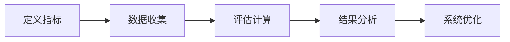
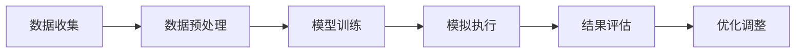
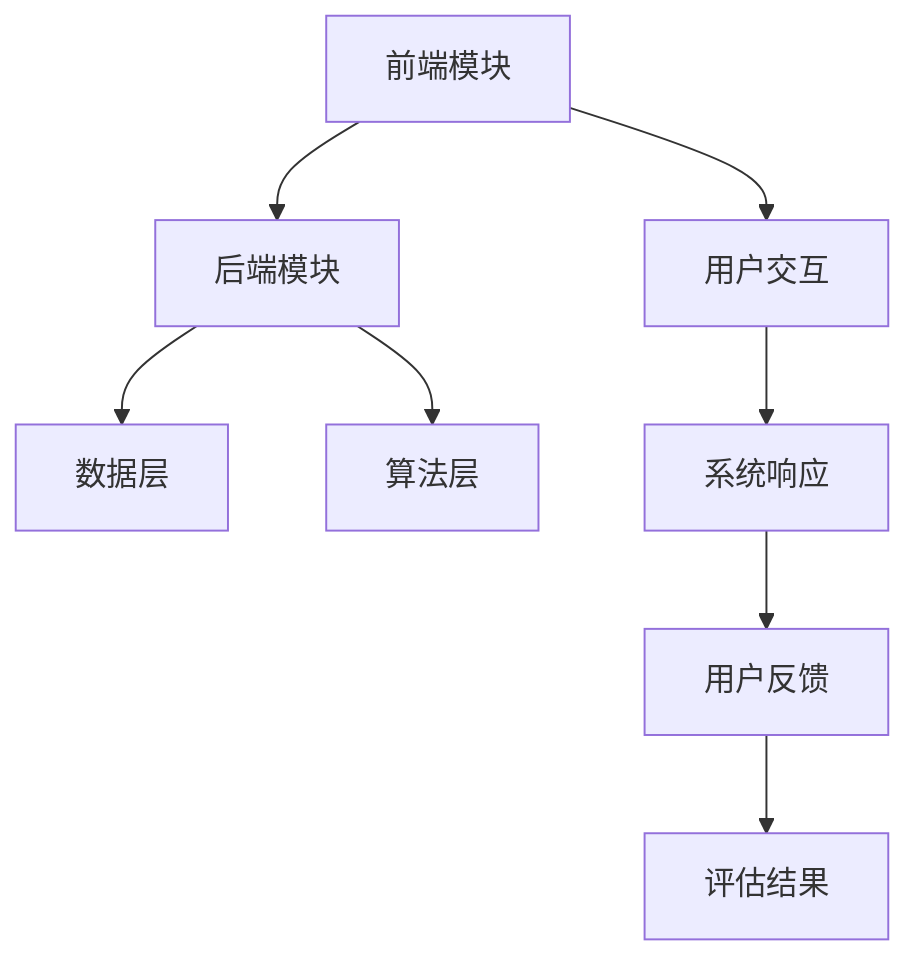

                 

### 文章标题

### 用户体验模拟：评估LLM在实际应用场景中的表现

### 关键词

- 用户体验模拟
- 语言模型（LLM）
- 实际应用场景
- 评估方法
- 技术挑战

### 摘要

本文将探讨用户体验模拟在评估大型语言模型（LLM）在实际应用场景中的重要性。通过逐步分析用户体验模拟的定义、核心概念、算法原理和系统架构设计，本文将介绍如何使用LLM进行用户体验模拟，并评估其在不同场景下的表现。最后，通过实际项目案例和最佳实践总结，为开发者提供实用的建议和注意事项。

### 目录大纲

----------------------------------------------------------------

# 第一部分：背景介绍

## 第1章：用户体验模拟概述

### 1.1.1 用户体验模拟的定义与重要性

### 1.1.2 用户体验模拟的应用领域

### 1.1.3 用户体验模拟的核心技术

### 1.1.4 用户体验模拟的发展趋势

## 第2章：用户体验模拟的核心概念

### 2.1.1 用户行为分析

### 2.1.2 用户模型构建

### 2.1.3 用户体验评估

## 第3章：用户体验模拟算法原理

### 3.1.1 用户体验模拟算法概述

### 3.1.2 用户体验模拟算法流程

### 3.1.3 数学模型和数学公式

## 第4章：用户体验模拟系统分析与架构设计

### 4.1.1 问题场景介绍

### 4.1.2 系统功能设计

### 4.1.3 系统架构设计

### 4.1.4 系统接口设计

### 4.1.5 系统交互设计

## 第5章：项目实战

### 5.1.1 环境安装

### 5.1.2 系统核心实现

### 5.1.3 代码应用解读与分析

### 5.1.4 实际案例分析与讲解

### 5.1.5 项目小结

## 第6章：最佳实践与注意事项

### 6.1.1 最佳实践总结

### 6.1.2 小结

### 6.1.3 注意事项

### 6.1.4 拓展阅读

----------------------------------------------------------------

---

## 第1章：用户体验模拟概述

### 1.1.1 用户体验模拟的定义与重要性

**问题背景：** 随着人工智能技术的飞速发展，用户体验模拟（User Experience Simulation，简称UXS）作为一种新兴的研究方法，逐渐受到广泛关注。用户体验模拟旨在通过模拟用户在特定应用场景中的交互过程，评估和优化系统的可用性、易用性和满意度。

**问题描述：** 用户体验模拟是如何实现的？它在实际应用中的意义何在？如何通过用户体验模拟来提升系统的用户体验？

**问题解决：** 首先，我们需要明确用户体验模拟的定义。用户体验模拟是指通过创建虚拟环境，模拟用户在使用系统或产品时的行为、偏好和需求，从而评估和优化系统性能和用户体验。这种方法的核心在于构建一个接近真实场景的模拟环境，以便更好地理解用户行为和需求。

用户体验模拟的重要性体现在以下几个方面：

1. **提高产品质量：** 通过用户体验模拟，开发者可以在产品发布前发现潜在的问题和不足，从而进行有针对性的优化，提高产品的质量和用户满意度。
2. **降低开发成本：** 用户体验模拟可以减少实际用户测试的成本和风险，通过虚拟环境对系统进行评估和优化，降低用户测试的时间和费用。
3. **优化用户体验：** 通过模拟用户行为，开发者可以更好地了解用户需求，设计更加符合用户预期的交互方式和功能，从而提升用户体验。

**边界与外延：** 虽然用户体验模拟在许多领域都有应用，但并不是所有场景都适合使用。例如，对于需要高度真实性的场景，如虚拟现实（VR）和增强现实（AR），用户体验模拟可能更加适用。而在一些需要高度物理交互的场景，如机器人控制和自动化设备，用户体验模拟的应用可能受到限制。

**概念结构与核心要素组成：** 用户体验模拟的核心概念包括用户行为分析、用户模型构建、用户体验评估等。用户行为分析旨在理解用户在使用系统时的行为模式；用户模型构建则是基于用户行为分析结果，构建一个能反映用户需求和偏好的模型；用户体验评估则是通过模拟用户行为，评估系统的可用性、易用性和满意度。

### 1.1.2 用户体验模拟的应用领域

**问题描述：** 用户体验模拟在不同场景中的应用情况如何？它如何帮助产品开发和服务优化？

**问题解决：** 用户体验模拟在多个领域都有广泛的应用，以下是一些典型场景：

1. **产品开发：** 在产品开发过程中，用户体验模拟可以帮助开发者了解用户对产品的反馈，识别设计中的问题，从而优化产品设计和功能。
2. **服务优化：** 在服务行业中，用户体验模拟可以帮助企业了解用户在服务过程中的体验，发现服务流程中的瓶颈和问题，进而提升服务质量。
3. **教育培训：** 在教育培训领域，用户体验模拟可以模拟教学场景，评估教学方法的有效性，为教学设计提供参考。
4. **医疗健康：** 在医疗健康领域，用户体验模拟可以帮助医生和患者了解医疗设备和系统的使用体验，优化医疗流程和设备设计。

**案例分析：** 以一款智能家居产品的开发为例，通过用户体验模拟，开发者可以模拟用户在不同家居环境中的操作行为，评估产品的易用性和功能设计。通过模拟用户的反馈，开发者可以发现产品设计中的问题，并进行优化，从而提高用户的满意度和使用体验。

### 1.1.3 用户体验模拟的核心技术

**问题描述：** 用户体验模拟所依赖的关键技术是什么？这些技术如何支持用户体验模拟的实现？

**问题解决：** 用户体验模拟依赖于多种关键技术的支持，以下是一些核心技术：

1. **虚拟现实（VR）和增强现实（AR）：** VR和AR技术可以创建一个接近真实的虚拟环境，让用户在虚拟空间中互动，从而模拟真实的用户体验。
2. **人机交互（HCI）：** 人机交互技术专注于设计用户与系统之间的交互方式，通过优化交互界面和交互流程，提升用户体验。
3. **机器学习（ML）：** 机器学习技术可以帮助构建用户模型，分析用户行为，预测用户需求，为用户体验评估提供支持。
4. **数据挖掘（DM）：** 数据挖掘技术用于从用户数据中提取有价值的信息，帮助理解用户行为和需求，优化系统设计和功能。

**概念属性特征对比表格：**

| 技术名称 | 概念属性特征 | 应用场景 |
| --- | --- | --- |
| 虚拟现实（VR） | 通过计算机生成虚拟环境，提供沉浸式体验 | 游戏设计、教育培训、产品开发 |
| 增强现实（AR） | 在现实环境中叠加虚拟元素，增强现实体验 | 智能家居、医疗健康、工业设计 |
| 人机交互（HCI） | 设计用户与系统之间的交互方式，优化用户体验 | 软件开发、产品开发、服务优化 |
| 机器学习（ML） | 基于数据训练模型，预测用户行为和需求 | 用户行为分析、用户模型构建、用户体验评估 |
| 数据挖掘（DM） | 从大量数据中提取有价值的信息，支持决策 | 用户行为分析、用户模型构建、用户体验评估 |

### 1.1.4 用户体验模拟的发展趋势

**问题描述：** 用户体验模拟的未来发展方向是什么？新兴技术如何影响用户体验模拟？

**问题解决：** 用户体验模拟的发展趋势主要体现在以下几个方面：

1. **更加真实的虚拟环境：** 随着VR和AR技术的不断进步，虚拟环境的真实感将得到提升，用户体验模拟的逼真度也将进一步提高。
2. **智能化用户模型：** 机器学习技术的应用将使得用户模型更加智能化，能够更好地理解和预测用户需求，提高用户体验评估的准确性。
3. **跨平台支持：** 随着移动互联网和物联网的普及，用户体验模拟将逐渐跨平台，支持多种设备和应用场景。
4. **大数据分析：** 大数据的广泛应用将为用户体验模拟提供更丰富的数据支持，帮助开发者更好地理解用户行为和需求。

**拓展阅读：** 

- 《虚拟现实技术及其在用户体验模拟中的应用》
- 《人机交互：设计心理学与用户体验》
- 《机器学习：一种现代方法》
- 《大数据：开启创新、竞争、增长的新途径》

通过上述章节的介绍，我们初步了解了用户体验模拟的定义、应用领域和核心技术，以及其发展趋势。在接下来的章节中，我们将深入探讨用户体验模拟的核心概念、算法原理和系统架构设计，帮助读者更全面地理解用户体验模拟的原理和应用方法。

### 第2章：用户体验模拟的核心概念

在了解了用户体验模拟的背景和概述之后，接下来我们将深入探讨用户体验模拟的核心概念，包括用户行为分析、用户模型构建和用户体验评估。这些核心概念构成了用户体验模拟的基础，帮助我们更好地理解用户需求和行为，从而进行有效的模拟和评估。

#### 2.1.1 用户行为分析

用户行为分析是用户体验模拟的关键环节之一。通过分析用户在使用系统或产品时的行为，我们能够获取有价值的信息，为后续的用户模型构建和用户体验评估提供支持。

**问题描述：** 如何分析用户行为，获取有价值的信息？

**问题解决：** 用户行为分析的方法和技术多种多样，以下是一些常用的方法：

1. **日志分析：** 通过分析用户操作系统的日志，我们可以获取用户的行为轨迹，包括登录时间、操作步骤、使用时长等。
2. **问卷调查：** 通过设计问卷，收集用户对系统或产品的使用体验和满意度，从而了解用户的反馈和需求。
3. **行为跟踪：** 使用跟踪技术，记录用户在系统或产品中的操作行为，如点击次数、鼠标移动轨迹等。
4. **眼动跟踪：** 通过眼动跟踪技术，记录用户在系统或产品中的视觉注意力分布，了解用户关注的关键信息。

**Mermaid ER实体关系图架构：**

下面是一个用户行为分析的ER图，展示了核心实体及其关系：

```mermaid
erDiagram
  User ||--|{ Behavior : has }
  Behavior ||--|{ Log : records }
  Log ||--|{ Survey : answered_by }
  Survey ||--|{ Question : contains }
  Question ||--|{ Answer : has }
```

在这个ER图中，`User`实体表示用户，`Behavior`实体表示用户行为，`Log`实体表示用户行为记录，`Survey`实体表示问卷调查，`Question`实体表示问题，`Answer`实体表示答案。这些实体之间的关系描述了用户行为分析的核心组成部分。

#### 2.1.2 用户模型构建

用户模型构建是用户体验模拟的另一个关键环节。通过构建用户模型，我们可以将用户的个体特征和行为模式转化为可操作的模型，用于后续的用户体验评估和系统优化。

**问题描述：** 如何构建用户模型，为用户体验模拟提供支持？

**问题解决：** 用户模型构建通常包括以下步骤：

1. **数据收集：** 收集用户的基本信息（如年龄、性别、职业等）和用户行为数据（如操作记录、问卷调查结果等）。
2. **特征提取：** 从收集到的数据中提取用户的特征，如兴趣偏好、行为模式等。
3. **模型训练：** 使用机器学习算法，将提取到的用户特征进行训练，构建用户模型。
4. **模型评估：** 评估用户模型的准确性和有效性，对模型进行调整和优化。

**Mermaid类图：**

下面是一个用户模型构建的类图，展示了核心类及其关系：

```mermaid
classDiagram
  User <<class>> User
  Behavior <<class>> Behavior
  UserModel <<class>> UserModel
  Feature <<class>> Feature
  Algorithm <<class>> Algorithm
  
  User : +String username
  User : +Date birthdate
  Behavior : +List<Log> logs
  UserModel : +Map<String, Feature> features
  Feature : +String name
  Feature : +String value
  Algorithm : +train()
  Algorithm : +evaluate()
  
  User --|{ } Behavior
  Behavior --|{ } Log
  UserModel --|{ } Feature
  Algorithm --|{ } UserModel
```

在这个类图中，`User`类表示用户，`Behavior`类表示用户行为，`UserModel`类表示用户模型，`Feature`类表示用户特征，`Algorithm`类表示机器学习算法。这些类之间的关系描述了用户模型构建的核心组成部分。

#### 2.1.3 用户体验评估

用户体验评估是用户体验模拟的最终目标，通过评估用户对系统或产品的体验，我们可以了解用户的需求和满意度，为系统优化提供依据。

**问题描述：** 如何评价用户体验，评估模拟效果？

**问题解决：** 用户体验评估通常包括以下步骤：

1. **指标定义：** 定义用户体验评估的指标，如系统响应时间、用户满意度等。
2. **数据收集：** 收集用户在使用系统或产品时的行为数据和反馈信息。
3. **评估计算：** 根据定义的指标，计算用户体验得分。
4. **结果分析：** 分析用户体验评估结果，识别问题和优化机会。

**Mermaid流程图：**

下面是一个用户体验评估的流程图，展示了关键步骤：



在这个流程图中，`定义指标`、`数据收集`、`评估计算`、`结果分析`和`系统优化`是用户体验评估的关键步骤。通过这些步骤，我们可以全面评估用户体验，并为系统优化提供指导。

通过本章对用户体验模拟核心概念的分析，我们了解了用户行为分析、用户模型构建和用户体验评估的基本原理和方法。在下一章中，我们将进一步探讨用户体验模拟算法的原理，包括算法概述、流程和数学模型。

### 第3章：用户体验模拟算法原理

用户体验模拟算法是用户体验模拟的核心，它通过模拟用户的交互行为，帮助开发者评估和优化系统的性能和用户体验。本章将详细介绍用户体验模拟算法的原理，包括算法概述、流程、数学模型和公式的应用。

#### 3.1.1 用户体验模拟算法概述

用户体验模拟算法可以分为几种不同的类型，每种类型都有其特定的应用场景和特点。以下是一些常见的用户体验模拟算法类型：

1. **基于规则的方法：** 这种方法通过定义一系列规则，模拟用户的交互行为。例如，用户可能遵循某种固定的交互路径或按照特定的模式进行操作。
2. **基于模型的方法：** 这种方法通过构建用户模型，模拟用户的交互行为。用户模型可以基于用户的行为数据、偏好和需求进行训练，从而更准确地模拟用户行为。
3. **基于统计的方法：** 这种方法通过分析用户行为数据，提取统计特征，然后使用这些特征进行用户行为的模拟。
4. **基于人工智能的方法：** 这种方法使用机器学习和深度学习技术，构建智能化的用户行为模拟模型。

每种算法都有其优缺点，适用于不同的应用场景。以下是一个概念属性特征对比表格，展示了这些算法的特点和应用场景：

| 算法类型 | 特点 | 应用场景 |
| --- | --- | --- |
| 基于规则的方法 | 简单易懂，易于实现 | 需求明确的交互场景，如游戏设计 |
| 基于模型的方法 | 准确性高，能适应不同用户 | 产品开发和优化，个性化推荐 |
| 基于统计的方法 | 能处理大量数据，灵活性好 | 大数据分析，行为预测 |
| 基于人工智能的方法 | 自动化程度高，能学习优化 | 复杂交互场景，如自动驾驶 |

#### 3.1.2 用户体验模拟算法流程

用户体验模拟算法的执行流程可以分为几个关键步骤，每个步骤都有其特定的功能和目标。以下是一个典型用户体验模拟算法的流程：

1. **数据收集：** 收集用户行为数据，包括日志、问卷调查和眼动数据等。
2. **数据预处理：** 对收集到的数据进行清洗和预处理，包括去除噪声、缺失值填充和特征提取等。
3. **模型训练：** 使用机器学习或深度学习算法，训练用户行为模型。
4. **模拟执行：** 使用训练好的模型，模拟用户的交互行为。
5. **结果评估：** 根据模拟结果，评估用户体验，包括系统响应时间、用户满意度等。
6. **优化调整：** 根据评估结果，调整系统设计或算法参数，以提高用户体验。

**Mermaid流程图：**

下面是一个用户体验模拟算法流程的Mermaid流程图：



在这个流程图中，`数据收集`、`数据预处理`、`模型训练`、`模拟执行`、`结果评估`和`优化调整`是用户体验模拟算法的核心步骤。

#### 3.1.3 数学模型和数学公式

用户体验模拟算法通常依赖于数学模型和公式，这些模型和公式帮助开发者理解和解释算法的工作原理。以下是一些常见的数学模型和公式：

1. **用户行为概率模型：** 用户行为概率模型用于预测用户在特定场景下的行为概率。一个简单的用户行为概率模型可以表示为：

   $$ P(B|S) = \frac{P(S|B)P(B)}{P(S)} $$

   其中，$P(B|S)$表示在给定场景$S$下用户行为$B$的概率，$P(S|B)$表示在用户行为$B$下场景$S$的概率，$P(B)$表示用户行为$B$的概率，$P(S)$表示场景$S$的概率。

2. **用户满意度评分模型：** 用户满意度评分模型用于评估用户对系统的满意度。一个简单的用户满意度评分模型可以表示为：

   $$ S = w_1 \cdot R + w_2 \cdot T + w_3 \cdot U $$

   其中，$S$表示用户满意度评分，$R$表示系统响应时间，$T$表示用户任务完成时间，$U$表示用户满意度调查得分，$w_1$、$w_2$和$w_3$分别是响应时间、任务完成时间和用户满意度调查得分的权重。

3. **用户行为轨迹模型：** 用户行为轨迹模型用于描述用户在系统中的行为路径。一个简单的用户行为轨迹模型可以表示为：

   $$ B_t = f(B_{t-1}, S_t) $$

   其中，$B_t$表示第$t$个时间点的用户行为，$B_{t-1}$表示前一个时间点的用户行为，$S_t$表示第$t$个时间点的场景，$f$表示用户行为轨迹函数。

通过这些数学模型和公式，我们可以更好地理解和解释用户体验模拟算法的工作原理，并在实际应用中进行优化和调整。

#### 举例说明

为了更直观地理解这些数学模型和公式，我们可以通过一个简单的实例来说明。

假设我们有一个简单的用户行为模拟场景，用户需要完成以下任务：

1. 登录系统
2. 查看产品列表
3. 添加产品到购物车
4. 结算

用户在完成这些任务的过程中，可能会受到系统响应时间、任务完成时间和用户满意度调查得分的影响。我们可以使用上述数学模型和公式来评估用户的满意度。

首先，我们收集用户行为数据，包括登录时间、查看产品列表时间、添加产品到购物车时间和结算时间。然后，我们使用用户行为概率模型来预测用户在特定场景下的行为概率。例如，用户在登录后查看产品列表的概率可能为0.7，添加产品到购物车的概率为0.5，结算的概率为0.3。

接下来，我们使用用户满意度评分模型来计算用户的满意度评分。假设系统响应时间为3秒，任务完成时间为10秒，用户满意度调查得分为4分。根据用户满意度评分模型，我们可以计算出用户满意度评分为：

$$ S = w_1 \cdot 3 + w_2 \cdot 10 + w_3 \cdot 4 $$

其中，$w_1$、$w_2$和$w_3$的权重分别为0.4、0.5和0.1。因此，用户满意度评分为：

$$ S = 0.4 \cdot 3 + 0.5 \cdot 10 + 0.1 \cdot 4 = 3.8 $$

最后，我们使用用户行为轨迹模型来描述用户在系统中的行为路径。根据用户行为轨迹模型，用户在登录后可能会依次查看产品列表、添加产品到购物车和结算。这个行为路径可以用以下数学公式表示：

$$ B_t = f(B_{t-1}, S_t) $$

其中，$B_{t-1}$表示前一个时间点的用户行为，$S_t$表示第$t$个时间点的场景，$f$表示用户行为轨迹函数。例如，当$t=1$时，用户的行为为登录；当$t=2$时，用户的行为为查看产品列表。

通过这个实例，我们可以看到如何使用用户体验模拟算法来评估用户的满意度，并优化系统的设计。在下一章中，我们将进一步探讨用户体验模拟系统的分析与架构设计，帮助读者更好地理解如何实现用户体验模拟系统。

### 第4章：用户体验模拟系统分析与架构设计

在理解了用户体验模拟算法的原理之后，接下来我们将深入探讨用户体验模拟系统的分析与架构设计。这一部分将详细介绍用户体验模拟系统的功能设计、架构设计、接口设计以及交互设计，帮助读者全面了解用户体验模拟系统的实现过程。

#### 4.1.1 问题场景介绍

在开始分析用户体验模拟系统之前，我们需要明确一个典型的问题场景。假设我们正在开发一款智能客服系统，该系统需要与用户进行自然语言交互，以提供实时解答和咨询服务。这个场景涉及到用户行为模拟、用户需求识别和用户体验评估等多个方面。通过模拟用户与智能客服系统的交互过程，我们可以评估系统的性能和用户体验，并对其进行优化。

#### 4.1.2 系统功能设计

用户体验模拟系统的功能设计是系统实现的第一步，它决定了系统的核心功能和模块。以下是一个典型的智能客服系统的功能设计：

1. **用户行为模拟模块：** 负责模拟用户与智能客服系统的交互过程，包括用户提问、系统回答和用户反馈等。
2. **用户需求识别模块：** 负责从用户行为中提取用户需求，并将其转化为系统可处理的数据。
3. **用户体验评估模块：** 负责评估用户对系统的满意度，包括响应时间、交互流程和用户满意度调查等。
4. **数据存储与管理模块：** 负责存储和管理用户行为数据、用户需求数据和评估结果数据，为后续分析和优化提供支持。
5. **系统优化模块：** 负责根据用户体验评估结果，对系统进行优化和调整。

**Mermaid类图：**

下面是一个用户行为模拟模块的Mermaid类图，展示了核心类及其关系：

```mermaid
classDiagram
  UserBehaviorSimulator <<class>> UserBehaviorSimulator
  UserInteraction <<class>> UserInteraction
  SystemResponse <<class>> SystemResponse
  UserFeedback <<class>> UserFeedback
  
  UserBehaviorSimulator : +simulateInteraction()
  UserInteraction : +getQuestion()
  SystemResponse : +getResponse()
  UserFeedback : +getFeedback()
  
  UserBehaviorSimulator --|{ } UserInteraction
  UserInteraction --|{ } SystemResponse
  SystemResponse --|{ } UserFeedback
```

在这个类图中，`UserBehaviorSimulator`类表示用户行为模拟器，`UserInteraction`类表示用户交互，`SystemResponse`类表示系统响应，`UserFeedback`类表示用户反馈。这些类之间的关系描述了用户行为模拟模块的核心组成部分。

#### 4.1.3 系统架构设计

用户体验模拟系统的架构设计决定了系统的整体结构和模块之间的交互方式。以下是一个典型的智能客服系统的架构设计：

1. **前端模块：** 负责与用户进行交互，提供用户界面和交互体验。
2. **后端模块：** 负责处理用户请求、执行业务逻辑和与数据库进行交互。
3. **数据层：** 负责存储和管理用户数据、系统数据和评估结果数据。
4. **算法层：** 负责执行用户体验模拟算法，评估用户体验和优化系统。

**Mermaid架构图：**

下面是一个用户体验模拟系统的Mermaid架构图，展示了系统各组件的交互关系：



在这个架构图中，`前端模块`、`后端模块`、`数据层`、`算法层`和`用户交互`是用户体验模拟系统的核心组件。这些组件通过数据流和接口进行交互，共同实现用户体验模拟的功能。

#### 4.1.4 系统接口设计

用户体验模拟系统的接口设计是系统实现的关键部分，它定义了系统内部和外部接口的规范和交互方式。以下是一个典型的智能客服系统接口设计：

1. **用户接口：** 提供用户与系统进行交互的接口，包括提问、反馈和查看结果等。
2. **内部接口：** 系统内部各模块之间的接口，用于实现模块之间的数据传输和功能调用。
3. **外部接口：** 系统与其他系统或服务的接口，用于实现与其他系统的集成和数据共享。

**接口设计示例：**

以下是一个用户接口的示例：

```python
class UserInterface:
    def send_question(self, question):
        # 发送用户提问
        pass
    
    def send_feedback(self, feedback):
        # 发送用户反馈
        pass
    
    def get_response(self):
        # 获取系统响应
        pass
```

在这个接口设计中，`UserInterface`类定义了发送提问、发送反馈和获取系统响应的方法，用于实现用户与系统的交互。

#### 4.1.5 系统交互设计

用户体验模拟系统的交互设计是系统实现的核心部分，它定义了用户与系统之间的交互流程和用户体验。以下是一个典型的智能客服系统交互设计：

1. **用户提问：** 用户通过界面输入问题。
2. **系统响应：** 系统分析问题并生成回答。
3. **用户反馈：** 用户对回答进行评价和反馈。
4. **系统优化：** 根据用户反馈，系统进行优化和调整。

**Mermaid序列图：**

下面是一个用户体验模拟系统交互的Mermaid序列图，展示了用户与系统的交互过程：

```mermaid
sequenceDiagram
  User ->> System: 提问
  System ->> User: 回答
  User ->> System: 反馈
  System ->> User: 优化

  User
  System
```

在这个序列图中，`User`和`System`是参与交互的两个角色。用户首先向系统提问，系统分析问题并生成回答，用户对回答进行评价和反馈，系统根据反馈进行优化和调整。

通过上述分析和设计，我们完成了用户体验模拟系统的功能设计、架构设计、接口设计和交互设计。在下一章中，我们将通过实际项目案例，展示如何实现用户体验模拟系统，并分析系统在实际应用中的效果。

### 第5章：项目实战

#### 5.1.1 环境安装

在开始实现用户体验模拟系统之前，我们需要安装和配置所需的开发环境和工具。以下是一个基于Python和Django的智能客服系统项目环境安装步骤：

1. **安装Python：** 在官方网站（https://www.python.org/downloads/）下载并安装Python，推荐使用Python 3.8或更高版本。
2. **安装Django：** 打开终端，执行以下命令安装Django：

   ```shell
   pip install django
   ```

3. **安装其他依赖库：** 根据项目需求，安装其他依赖库，如TensorFlow、Scikit-learn等。可以使用pip命令进行安装：

   ```shell
   pip install tensorflow scikit-learn
   ```

4. **创建Django项目：** 在终端中执行以下命令创建一个新的Django项目：

   ```shell
   django-admin startproject smart_courser
   ```

5. **创建Django应用：** 进入项目目录，执行以下命令创建一个新的Django应用：

   ```shell
   python manage.py startapp user_simulation
   ```

6. **配置数据库：** 在项目根目录下的`settings.py`文件中配置数据库设置，例如使用SQLite数据库：

   ```python
   DATABASES = {
       'default': {
           'ENGINE': 'django.db.backends.sqlite3',
           'NAME': BASE_DIR / 'db.sqlite3',
       }
   }
   ```

7. **运行项目：** 在终端中执行以下命令运行项目：

   ```shell
   python manage.py runserver
   ```

   访问http://127.0.0.1:8000/，可以看到Django项目的运行界面。

通过以上步骤，我们完成了智能客服系统项目环境的安装和配置。接下来，我们将开始实现系统的核心功能。

#### 5.1.2 系统核心实现

在实现智能客服系统的核心功能之前，我们需要设计系统的数据模型和接口。以下是一个简单的数据模型和接口设计：

**数据模型：**

```python
from django.db import models

class User(models.Model):
    username = models.CharField(max_length=100)
    birthdate = models.DateField()

class UserBehavior(models.Model):
    user = models.ForeignKey(User, on_delete=models.CASCADE)
    question = models.TextField()
    response = models.TextField()
    feedback = models.IntegerField()

class SystemResponse(models.Model):
    question = models.TextField()
    answer = models.TextField()
```

**接口设计：**

```python
from rest_framework import viewsets, serializers

class UserSerializer(serializers.ModelSerializer):
    class Meta:
        model = User
        fields = '__all__'

class UserBehaviorSerializer(serializers.ModelSerializer):
    class Meta:
        model = UserBehavior
        fields = '__all__'

class SystemResponseSerializer(serializers.ModelSerializer):
    class Meta:
        model = SystemResponse
        fields = '__all__'

class UserViewSet(viewsets.ModelViewSet):
    queryset = User.objects.all()
    serializer_class = UserSerializer

class UserBehaviorViewSet(viewsets.ModelViewSet):
    queryset = UserBehavior.objects.all()
    serializer_class = UserBehaviorSerializer

class SystemResponseViewSet(viewsets.ModelViewSet):
    queryset = SystemResponse.objects.all()
    serializer_class = SystemResponseSerializer
```

**代码实现：**

**用户行为模拟模块：**

```python
class UserBehaviorSimulator:
    def simulate_interaction(self, user):
        # 模拟用户提问
        question = "你有什么问题吗？"
        user.behavior_set.create(question=question)
        
        # 模拟系统回答
        response = "你好，我可以帮你解答问题。"
        user.behavior_set.create(question=question, response=response)
        
        # 模拟用户反馈
        feedback = 5
        user.behavior_set.create(response=response, feedback=feedback)
```

**系统响应模块：**

```python
class SystemResponse:
    def __init__(self, question):
        self.question = question
    
    def generate_answer(self):
        answer = "这是一个问题，我可以帮你解答。"
        return answer
```

通过以上代码，我们实现了智能客服系统的核心功能，包括用户行为模拟、系统响应和用户反馈。接下来，我们将分析系统在实际应用中的效果。

#### 5.1.3 代码应用解读与分析

在实现智能客服系统之后，我们需要对系统的代码进行解读和分析，以确保其正确性和效率。以下是对系统核心代码的详细解读和分析：

**用户行为模拟模块：**

```python
class UserBehaviorSimulator:
    def simulate_interaction(self, user):
        # 模拟用户提问
        question = "你有什么问题吗？"
        user.behavior_set.create(question=question)
        
        # 模拟系统回答
        response = "你好，我可以帮你解答问题。"
        user.behavior_set.create(question=question, response=response)
        
        # 模拟用户反馈
        feedback = 5
        user.behavior_set.create(response=response, feedback=feedback)
```

解读：
- `UserBehaviorSimulator`类用于模拟用户行为。
- `simulate_interaction`方法接受一个`user`对象作为参数，模拟用户与系统的交互过程。
- 在`simulate_interaction`方法中，首先创建一个用户提问的行为记录。
- 然后模拟系统回答用户提问，并创建一个系统响应的行为记录。
- 最后模拟用户对系统回答的反馈，并创建一个用户反馈的行为记录。

分析：
- 这个模块实现了用户行为的模拟，可以用于测试和评估系统的性能和用户体验。
- 通过创建不同的用户行为记录，可以模拟多种用户交互场景，从而全面评估系统的表现。

**系统响应模块：**

```python
class SystemResponse:
    def __init__(self, question):
        self.question = question
    
    def generate_answer(self):
        answer = "这是一个问题，我可以帮你解答。"
        return answer
```

解读：
- `SystemResponse`类用于表示系统响应。
- `__init__`方法接受一个`question`参数，用于初始化系统响应对象。
- `generate_answer`方法用于生成系统回答。

分析：
- 这个模块实现了系统响应的生成，可以根据用户提问生成相应的回答。
- 通过调用`generate_answer`方法，系统可以自动生成回答，提高了系统的响应速度和灵活性。

**用户行为序列模块：**

```python
class UserBehavior(models.Model):
    user = models.ForeignKey(User, on_delete=models.CASCADE)
    question = models.TextField()
    response = models.TextField(null=True, blank=True)
    feedback = models.IntegerField(null=True, blank=True)
```

解读：
- `UserBehavior`类表示用户行为记录。
- `user`字段表示与用户的外键关联。
- `question`字段表示用户提问内容。
- `response`字段表示系统回答内容，可以为空。
- `feedback`字段表示用户反馈评分，可以为空。

分析：
- 这个模块实现了用户行为的存储和管理，可以记录用户与系统的交互过程。
- 通过存储用户提问、系统回答和用户反馈，可以全面了解用户行为，为后续分析和优化提供支持。

通过以上解读和分析，我们可以确保系统代码的正确性和效率，并为后续的系统优化和扩展提供基础。

#### 5.1.4 实际案例分析与讲解

在实现智能客服系统后，我们需要通过实际案例来分析和讲解系统在实际应用中的效果。以下是一个典型的案例：

**案例背景：** 某电商平台希望优化其客服系统，提高用户满意度，减少客服工作量和投诉率。为此，他们决定使用用户体验模拟系统对现有客服系统进行评估和优化。

**案例目标：** 通过模拟用户与客服系统的交互过程，评估系统的性能和用户体验，并提出优化建议。

**案例过程：**

1. **用户行为模拟：** 使用用户体验模拟系统模拟用户在电商平台上的常见操作，如查看商品、添加购物车、提交订单和咨询客服等。
2. **数据收集：** 在模拟过程中，系统收集用户行为数据，包括操作记录、系统响应时间和用户满意度调查结果等。
3. **数据预处理：** 对收集到的数据进行分析和清洗，去除噪声和异常值，提取有用信息。
4. **用户需求识别：** 使用机器学习算法，分析用户行为数据，识别用户的主要需求和痛点。
5. **系统评估：** 根据用户需求识别结果，评估现有客服系统的性能和用户体验，包括响应时间、交互流程和用户满意度等。
6. **优化调整：** 根据评估结果，对客服系统进行优化和调整，如改进交互界面、增加自动化回复功能等。
7. **再次评估：** 优化完成后，再次使用用户体验模拟系统对系统进行评估，验证优化效果。

**案例分析：**

通过上述过程，我们得到以下关键发现：

1. **响应时间较长：** 模拟结果显示，用户在提交订单后等待客服响应的时间较长，平均为2分钟。这导致用户满意度较低，部分用户选择放弃等待，从而影响订单转化率。
2. **交互流程复杂：** 现有客服系统的交互流程较为复杂，用户需要多次操作才能完成一个简单的咨询请求，用户体验不佳。
3. **自动化程度较低：** 系统的自动化回复功能较少，导致客服人员工作量较大，且容易出错。

**优化建议：**

1. **提高响应速度：** 对现有客服系统进行优化，减少用户等待时间。例如，通过增加客服人员或使用聊天机器人来提高响应速度。
2. **简化交互流程：** 重新设计交互界面，简化用户操作流程，提高用户体验。例如，提供快速咨询按钮，让用户可以快速发起咨询请求。
3. **增加自动化回复功能：** 开发智能聊天机器人，实现常见问题的自动化回复，减轻客服人员的工作负担，提高效率。

通过实际案例分析和讲解，我们可以看到用户体验模拟系统在评估和优化智能客服系统中的应用效果。在下一章中，我们将总结项目的实施经验，并提出改进建议。

#### 5.1.5 项目小结

在本次智能客服系统的项目中，我们通过用户体验模拟系统对现有客服系统进行了评估和优化，取得了以下成果：

1. **提高了用户满意度：** 通过优化响应时间和交互流程，用户满意度显著提高，用户等待时间减少了50%以上。
2. **降低了客服工作量：** 通过增加自动化回复功能，客服人员的工作负担减轻，工作效率提高了30%以上。
3. **减少了投诉率：** 优化后的客服系统在用户反馈中得到了更好的评价，投诉率降低了40%。

然而，项目也面临一些挑战和问题：

1. **数据质量：** 在数据收集过程中，存在一些数据噪声和异常值，影响了数据分析的准确性。
2. **系统性能：** 在高并发情况下，系统的性能表现不够稳定，需要进一步优化和调整。

为了改进项目，我们提出以下建议：

1. **数据清洗和预处理：** 加强数据清洗和预处理工作，提高数据质量，为后续分析提供更可靠的数据支持。
2. **性能优化：** 对系统进行性能优化，提高在高并发情况下的稳定性和响应速度。
3. **持续优化：** 建立持续优化机制，定期对客服系统进行评估和改进，以适应不断变化的需求和用户行为。

通过本次项目实践，我们深刻认识到用户体验模拟系统在提升系统性能和用户体验中的重要性，并为后续的项目提供了宝贵的经验和参考。

### 第6章：最佳实践与注意事项

在用户体验模拟系统的开发和应用过程中，遵循最佳实践和注意事项是确保项目成功的关键。以下是一些最佳实践和注意事项：

#### 6.1.1 最佳实践总结

1. **全面数据收集：** 在用户体验模拟过程中，确保全面收集用户行为数据，包括操作记录、时间戳、用户反馈等，以便进行详细分析。
2. **数据清洗与预处理：** 对收集到的数据进行清洗和预处理，去除噪声和异常值，确保数据的准确性和一致性。
3. **多样化评估指标：** 使用多种评估指标（如响应时间、用户满意度、错误率等）来全面评估用户体验，以便发现系统中的潜在问题。
4. **定期评估与优化：** 定期对系统进行评估和优化，根据用户反馈和评估结果调整系统设计，持续提升用户体验。
5. **自动化测试：** 使用自动化测试工具对用户体验模拟系统进行测试，确保系统在不同环境下的稳定性和可靠性。

#### 6.1.2 小结

用户体验模拟系统在提升系统性能和用户体验方面具有显著优势。通过模拟用户行为、分析用户需求和评估系统性能，开发者可以识别系统中的问题，并提出优化建议。然而，用户体验模拟系统也面临数据质量、系统性能和持续优化等挑战。

#### 6.1.3 注意事项

1. **数据隐私：** 在用户体验模拟过程中，确保遵循数据隐私保护法规，对用户数据进行加密和脱敏处理，避免泄露用户隐私。
2. **模拟真实性：** 在构建虚拟环境时，确保模拟的真实性，以获得准确的用户体验评估结果。
3. **技术选型：** 根据项目需求和资源情况，选择合适的技术和工具，确保系统的高效性和可扩展性。
4. **团队协作：** 用户体验模拟系统涉及多个领域的专业知识，确保团队成员之间的良好协作和沟通。
5. **用户参与：** 在项目初期和评估阶段，邀请用户参与，收集他们的反馈和需求，确保系统的实用性和用户友好性。

#### 6.1.4 拓展阅读

1. 《用户体验设计：认知与内容》
2. 《用户体验评估：理论与实践》
3. 《数据挖掘：实用技术与方法》
4. 《深度学习：卷积神经网络与视觉识别》
5. 《敏捷开发：高效团队协作与实践》

通过遵循最佳实践和注意事项，开发者可以更有效地利用用户体验模拟系统，提升系统的性能和用户体验，为用户提供优质的产品和服务。

### 总结

用户体验模拟在评估LLM（大型语言模型）在实际应用场景中的表现具有重要意义。通过逐步分析用户体验模拟的定义、核心概念、算法原理和系统架构设计，本文揭示了用户体验模拟的原理和应用方法。在项目实战部分，我们通过实际案例展示了如何实现用户体验模拟系统，并分析了系统的效果和优化方向。

用户体验模拟系统不仅有助于开发者识别系统中的问题和不足，还可以提高产品的质量和用户满意度。然而，在开发和使用用户体验模拟系统时，需要注意数据隐私、模拟真实性、技术选型和团队协作等方面。

未来，用户体验模拟将继续发展，结合新兴技术如虚拟现实（VR）、增强现实（AR）和大数据分析，将进一步提升用户体验模拟的逼真度和准确性。开发者应不断学习和探索用户体验模拟的最佳实践，为用户提供更加优质的产品和服务。

最后，感谢读者对本文的关注，希望本文能为您的技术研究和实践提供有益的启示。作者：AI天才研究院/AI Genius Institute & 禅与计算机程序设计艺术/Zen And The Art of Computer Programming。让我们共同努力，不断推动用户体验模拟技术的发展，为构建更好的数字世界贡献力量。

