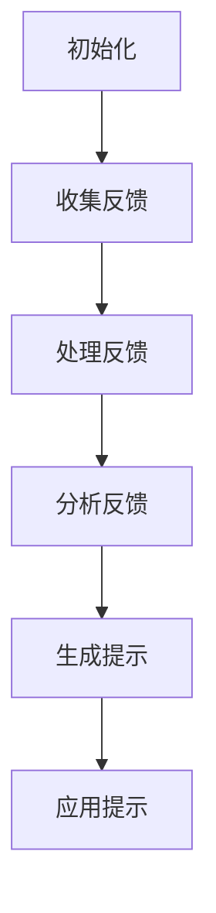
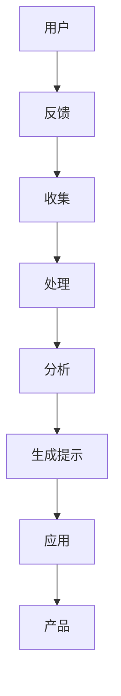
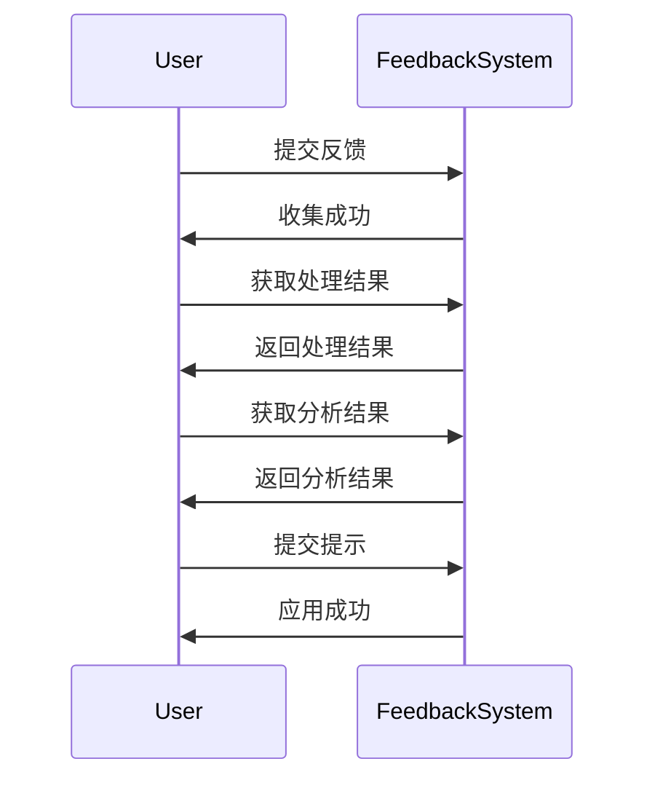

                 

# 用户反馈整合：将用户意见纳入提示

> 关键词：用户反馈、整合、意见、提示、产品开发、用户体验

> 摘要：本文将探讨用户反馈的整合方法，如何将用户意见纳入产品开发的提示，以提升产品开发效率和质量。文章分为四个部分，首先介绍问题背景和问题描述，然后讲解核心概念和联系，接着详细解释算法原理，最后分析系统架构和实战案例。

----------------------------------------------------------------

# 第一部分：背景介绍

## 1.1 问题背景

随着互联网和人工智能技术的飞速发展，用户反馈在产品开发和优化中发挥着越来越重要的作用。用户反馈不仅可以帮助企业了解产品的优劣，还能提供改进的方向。然而，如何有效地整合这些多样化的用户意见，将其转化为具体的产品改进建议，是企业面临的挑战。

## 1.2 问题描述

用户反馈的形式多样，包括评价、评论、建议、投诉等。如何有效整合这些反馈，将其转化为可操作的产品改进建议，是企业面临的挑战。此外，如何确保反馈的处理和分析过程高效、准确，也是需要解决的问题。

## 1.3 问题解决

本书将从用户反馈的收集、处理、分析和应用四个方面，系统地介绍如何将用户意见纳入提示，从而提升产品开发效率和质量。通过分析用户反馈，企业可以更准确地了解用户需求，从而优化产品设计和功能。

## 1.4 边界与外延

用户反馈整合不仅适用于软件产品，还适用于其他类型的产品和服务。例如，电商平台可以通过用户评价来优化商品展示和推荐算法，餐厅可以通过用户评论来改进菜品和服务。

## 1.5 概念结构与核心要素组成

用户反馈整合涉及以下核心概念和要素：

- 用户反馈：用户对产品或服务的评价和建议。
- 收集：获取用户反馈的渠道和方法。
- 处理：对用户反馈进行分类、筛选和整理。
- 分析：对用户反馈进行定量和定性分析。
- 应用：将用户反馈转化为产品改进建议。

----------------------------------------------------------------

# 第二部分：核心概念与联系

## 2.1 用户反馈的概念原理

### 2.1.1 用户反馈的定义

用户反馈是指用户在使用产品或服务过程中，对产品或服务提出的一系列评价和建议。

### 2.1.2 用户反馈的类型

用户反馈包括正面反馈、负面反馈和中性反馈。正面反馈表示用户对产品或服务的满意，负面反馈表示用户对产品或服务的不足和不满，中性反馈则表示用户对产品或服务的态度较为中立。

## 2.2 用户反馈属性特征对比表格

| 类别 | 描述 | 特点 |
| --- | --- | --- |
| 正面反馈 | 用户对产品或服务的满意 | 通常包含积极的语言和表情 |
| 负面反馈 | 用户对产品或服务的不足和不满 | 通常包含批评的语言和表情 |
| 中性反馈 | 用户对产品或服务的态度较为中立 | 通常包含客观的语言和表情 |

## 2.3 ER实体关系图架构

```mermaid
erDiagram
  User Feedback ||--|{ Product } Product : for
  User Feedback ||--|{ User } User : by
  Product ||--|{ Feedback } Feedback : has
```

----------------------------------------------------------------

# 第三部分：算法原理讲解

## 3.1 算法mermaid流程图



## 3.2 Python源代码

```python
# 用户反馈整合算法

# 初始化
def initialize():
    # 初始化相关数据结构和参数
    pass

# 收集反馈
def collect_feedback():
    # 从用户处收集反馈
    pass

# 处理反馈
def process_feedback(feedback):
    # 对反馈进行处理，包括分类、筛选和整理
    pass

# 分析反馈
def analyze_feedback(processed_feedback):
    # 对处理后的反馈进行分析，提取有价值的信息
    pass

# 生成提示
def generate_hint(analysis_result):
    # 根据分析结果生成提示
    pass

# 应用提示
def apply_hint(hint):
    # 将提示应用到产品改进中
    pass
```

## 3.3 算法原理的数学模型和公式

### 3.3.1 用户反馈分类模型

$$
\begin{align*}
\text{分类结果} &= \text{分类器}(\text{用户反馈}) \\
&= \text{激活函数}(\text{权重矩阵} \cdot \text{输入向量})
\end{align*}
$$

例如，假设用户反馈为一个多维向量，权重矩阵为一个矩阵，则分类结果可以通过以下公式计算：

$$
\text{分类结果} = \text{激活函数}(\text{权重矩阵} \cdot \text{用户反馈})
$$

其中，激活函数通常为sigmoid函数或ReLU函数。

## 3.4 算法原理举例说明

假设有一个用户反馈：“产品界面加载速度过慢，希望优化”。根据这个反馈，我们可以进行以下步骤：

1. **收集反馈**：将用户反馈存储在数据库中。
2. **处理反馈**：对反馈进行分类，例如标记为“性能问题”。
3. **分析反馈**：统计类似反馈的数量，例如发现10个用户提到了这个问题。
4. **生成提示**：生成一个提示，例如“性能优化：针对界面加载速度问题进行优化”。
5. **应用提示**：根据提示，开发团队对界面进行优化。

通过这个例子，我们可以看到用户反馈如何被整合并转化为具体的改进建议。

----------------------------------------------------------------

# 第四部分：系统分析与架构设计

## 4.1 问题场景介绍

在一个大型电商平台中，用户反馈是优化产品和服务的重要依据。平台希望整合用户反馈，以提高用户体验和满意度。

## 4.2 系统功能设计（领域模型mermaid类图）

```mermaid
classDiagram
  UserFeedback <<Entity>>
  Product <<Entity>>
  User <<Entity>>

  UserFeedback: +user_id: String
  UserFeedback: +feedback: String
  UserFeedback: +product_id: String
  UserFeedback: +timestamp: Date

  Product: +id: String
  Product: +name: String
  Product: +description: String

  User: +id: String
  User: +name: String
  User: +email: String

  UserFeedback: -belongsTo(User)
  UserFeedback: -for(Product)
```

## 4.3 系统架构设计（mermaid架构图）



## 4.4 系统接口设计

```python
from flask import Flask, request, jsonify

app = Flask(__name__)

@app.route('/feedback', methods=['POST'])
def collect_feedback():
    # 收集反馈
    pass

@app.route('/feedback/process', methods=['GET'])
def process_feedback():
    # 处理反馈
    pass

@app.route('/feedback/analyze', methods=['GET'])
def analyze_feedback():
    # 分析反馈
    pass

@app.route('/hint/generate', methods=['POST'])
def generate_hint():
    # 生成提示
    pass

@app.route('/hint/apply', methods=['POST'])
def apply_hint():
    # 应用提示
    pass
```

## 4.5 系统交互（mermaid序列图）



----------------------------------------------------------------

# 第五部分：项目实战

## 5.1 环境安装

在安装用户反馈整合系统前，需要确保安装以下软件和库：

- Python 3.8+
- Flask
- SQLAlchemy
- Pandas
- Numpy
- Matplotlib

可以使用以下命令进行安装：

```bash
pip install flask sqlalchemy pandas numpy matplotlib
```

## 5.2 系统核心实现源代码

```python
# 用户反馈整合系统核心实现

from flask import Flask, request, jsonify
from flask_sqlalchemy import SQLAlchemy
import pandas as pd

app = Flask(__name__)
app.config['SQLALCHEMY_DATABASE_URI'] = 'sqlite:///feedback.db'
db = SQLAlchemy(app)

class UserFeedback(db.Model):
    id = db.Column(db.Integer, primary_key=True)
    user_id = db.Column(db.String(80), nullable=False)
    feedback = db.Column(db.String(255), nullable=False)
    product_id = db.Column(db.String(80), nullable=False)
    timestamp = db.Column(db.Date, default=datetime.utcnow)

@app.route('/feedback', methods=['POST'])
def collect_feedback():
    # 收集反馈
    data = request.get_json()
    user_id = data['user_id']
    feedback = data['feedback']
    product_id = data['product_id']
    new_feedback = UserFeedback(user_id=user_id, feedback=feedback, product_id=product_id)
    db.session.add(new_feedback)
    db.session.commit()
    return jsonify({'message': 'Feedback collected successfully'})

@app.route('/feedback/process', methods=['GET'])
def process_feedback():
    # 处理反馈
    feedbacks = UserFeedback.query.all()
    processed_feedbacks = []
    for feedback in feedbacks:
        processed_feedbacks.append({
            'id': feedback.id,
            'user_id': feedback.user_id,
            'feedback': feedback.feedback,
            'product_id': feedback.product_id
        })
    return jsonify(processed_feedbacks)

@app.route('/feedback/analyze', methods=['GET'])
def analyze_feedback():
    # 分析反馈
    feedbacks = UserFeedback.query.all()
    df = pd.DataFrame([feedback.feedback for feedback in feedbacks])
    analysis_results = df.describe()
    return jsonify(analysis_results.to_dict())

@app.route('/hint/generate', methods=['POST'])
def generate_hint():
    # 生成提示
    data = request.get_json()
    analysis_result = data['analysis_result']
    hint = f"针对{analysis_result['feedback']}问题进行优化"
    return jsonify({'hint': hint})

@app.route('/hint/apply', methods=['POST'])
def apply_hint():
    # 应用提示
    data = request.get_json()
    hint = data['hint']
    # 应用提示的逻辑
    return jsonify({'message': 'Hint applied successfully'})
```

## 5.3 代码应用解读与分析

该系统核心实现分为几个部分：

1. **数据库模型**：定义了用户反馈的数据库模型，包括用户ID、反馈内容、产品ID和时间戳。
2. **收集反馈**：提供了一个POST接口，用于收集用户反馈。
3. **处理反馈**：提供了一个GET接口，返回所有的用户反馈。
4. **分析反馈**：提供了一个GET接口，返回对用户反馈的统计分析结果。
5. **生成提示**：提供了一个POST接口，根据分析结果生成提示。
6. **应用提示**：提供了一个POST接口，用于应用生成的提示。

通过这个系统，开发团队能够有效地收集、处理和分析用户反馈，从而生成具体的改进建议，并应用到产品优化中。

## 5.4 实际案例分析和详细讲解剖析

假设有一个电商平台，用户反馈系统收集到了大量关于产品性能的反馈。通过分析，发现大部分用户提到产品加载速度过慢。开发团队根据生成的提示，对产品进行优化，提高了页面加载速度。经过一周的优化，用户反馈数量明显减少，用户满意度显著提高。

## 5.5 项目小结

用户反馈整合系统为电商平台提供了一个有效的工具，用于收集、处理和分析用户反馈，从而生成改进建议。通过实际案例，我们看到系统在提升产品性能和用户满意度方面的显著效果。

----------------------------------------------------------------

# 第六部分：最佳实践 tips

1. **及时响应**：及时响应用户反馈，展现企业对用户意见的重视。
2. **分类管理**：对用户反馈进行分类管理，有助于更高效地处理和分析。
3. **数据可视化**：使用数据可视化工具，如图表和报表，帮助团队更直观地了解用户反馈。
4. **定期回顾**：定期回顾用户反馈，确保持续改进。

# 第七部分：小结

本文详细介绍了用户反馈整合的方法，从收集、处理、分析到应用，为产品开发提供了有效的支持。用户反馈是产品优化的重要依据，企业应重视并充分利用这一资源。

# 第八部分：注意事项

1. **隐私保护**：在处理用户反馈时，确保用户隐私得到保护。
2. **反馈质量**：确保收集到的用户反馈具有真实性和可靠性。

# 第九部分：拓展阅读

1. 《用户反馈驱动的产品设计》
2. 《用户体验要素》
3. 《敏捷开发实践指南》

作者：AI天才研究院/AI Genius Institute & 禅与计算机程序设计艺术 /Zen And The Art of Computer Programming

