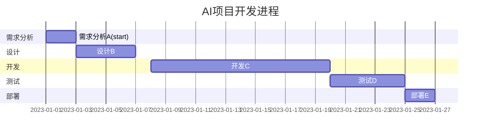
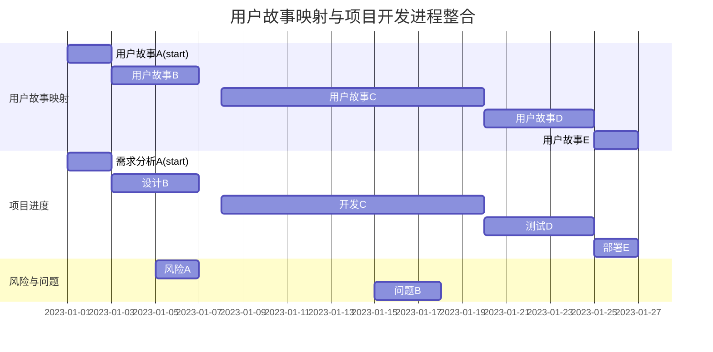

                 

# 《用户故事映射：可视化AI项目开发进程》

## 关键词
- 用户故事映射
- 可视化工具
- AI项目开发
- 敏捷开发
- 项目管理

## 摘要
本文将探讨用户故事映射在AI项目开发中的应用，以及如何通过可视化工具来提升项目开发进程的可视化管理。文章将详细阐述用户故事的定义与特点、用户故事映射的过程、用户故事映射在AI项目开发中的应用，以及可视化在项目管理中的作用。通过实际案例分析和最佳实践分享，帮助读者深入了解用户故事映射与可视化工具在AI项目开发中的重要性。

### 目录

1. 引言
   1.1 问题背景与意义
   1.2 问题描述与目标
   1.3 边界与外延
   1.4 核心概念与联系
   1.5 本章小结

2. 用户故事映射的理论与实践
   2.1 用户故事映射的概念与特点
   2.2 用户故事的撰写
   2.3 用户故事映射的过程
   2.4 用户故事映射在AI项目开发中的应用
   2.5 用户故事映射的可视化实现
   2.6 用户故事映射的案例分析
   2.7 本章小结

3. AI项目开发进程的可视化管理
   3.1 AI项目开发进程概述
   3.2 可视化工具在项目开发进程管理中的应用
   3.3 可视化用户故事映射与项目开发进程的整合
   3.4 可视化管理案例分析
   3.5 可视化管理技巧与最佳实践
   3.6 本章小结

4. AI项目开发全流程可视化实践
   4.1 AI项目开发环境搭建
   4.2 用户故事映射实践
   4.3 AI项目开发实践
   4.4 用户故事映射与可视化整合
   4.5 实践案例分析
   4.6 项目小结
   4.7 本章小结

5. 可视化AI项目开发的未来趋势

### 1. 引言

#### 1.1 问题背景与意义

随着人工智能技术的快速发展，越来越多的企业和组织开始将AI技术应用于实际项目中。然而，在AI项目开发过程中，如何有效地管理项目进程、确保项目质量和按时交付成为了一个重要的问题。传统的项目管理方法往往难以应对AI项目开发中的复杂性，导致项目进度延误、成本超支和需求变更等问题。

用户故事映射（User Story Mapping）是一种敏捷开发方法，它通过将用户需求以故事的形式进行组织和可视化，帮助开发团队更好地理解用户需求、规划项目开发和优化项目进度。而可视化工具则为用户故事映射提供了强大的技术支持，使得项目进程更加透明、易于理解和跟踪。

本文旨在探讨用户故事映射在AI项目开发中的应用，通过可视化工具提升项目开发进程的管理效果，帮助开发团队更好地应对AI项目开发的挑战。

#### 1.2 问题描述与目标

在AI项目开发过程中，开发团队往往面临以下问题：

- **需求变更频繁**：AI项目通常涉及到复杂的技术和算法，需求变更较为频繁，导致项目进度难以预测和控制。
- **沟通不畅**：开发团队与客户、产品经理等利益相关者之间的沟通不畅，可能导致项目目标不明确、需求理解不一致等问题。
- **进度难以跟踪**：传统的项目管理方法难以适应AI项目开发的迭代性和复杂性，导致项目进度难以跟踪和监控。

为了解决这些问题，本文提出以下目标：

- **明确项目目标**：通过用户故事映射，帮助开发团队更好地理解用户需求，明确项目目标，确保项目方向的正确性。
- **提升沟通效率**：利用可视化工具，将用户故事映射和项目进展以直观的方式展示给所有利益相关者，提高沟通效率。
- **优化项目进度**：通过用户故事映射和可视化工具，实时监控项目进度，及时调整项目计划，确保项目按时交付。

#### 1.3 边界与外延

本文的研究范围主要涵盖以下方面：

- **用户故事映射**：探讨用户故事映射的概念、过程和最佳实践。
- **可视化工具**：分析各类可视化工具的功能和特点，选择适合AI项目开发的可视化工具。
- **AI项目开发**：分析AI项目开发中的核心问题和挑战，探讨如何利用用户故事映射和可视化工具解决这些问题。

本文的外延包括：

- **用户故事映射在其他领域中的应用**：虽然本文主要关注AI项目开发，但用户故事映射在软件工程、敏捷开发等领域也有广泛应用，可为其提供有益的参考。
- **可视化工具的其他应用领域**：本文主要探讨可视化工具在AI项目开发中的应用，但可视化工具在其他领域（如数据分析、项目管理等）同样具有重要价值。

#### 1.4 核心概念与联系

在本文中，我们将介绍以下核心概念：

- **用户故事映射**：一种敏捷开发方法，通过将用户需求以故事的形式进行组织和可视化，帮助开发团队更好地理解用户需求、规划项目开发和优化项目进度。
- **用户故事**：描述用户需求的简单故事，通常包含用户角色、目标功能和条件。
- **可视化工具**：用于将用户故事映射和项目进展以直观的方式展示的工具，如思维导图、类图、时序图等。

这些核心概念之间的联系如下：

- **用户故事映射**：用户故事映射的核心是用户故事，通过将用户需求以故事的形式进行组织和可视化，帮助开发团队更好地理解用户需求、规划项目开发和优化项目进度。
- **用户故事**：用户故事是用户需求的具体描述，是用户故事映射的基础。
- **可视化工具**：可视化工具用于将用户故事映射和项目进展以直观的方式展示，有助于提高沟通效率和项目进度监控。

#### 1.5 本章小结

本文介绍了用户故事映射在AI项目开发中的应用背景、问题、目标和边界与外延，阐述了用户故事映射、用户故事和可视化工具等核心概念及其联系。在接下来的章节中，我们将详细探讨用户故事映射的理论与实践，以及可视化AI项目开发的实现路径。通过实际案例分析和最佳实践分享，帮助读者深入了解用户故事映射与可视化工具在AI项目开发中的重要性。

### 2. 用户故事映射的理论与实践

#### 2.1 用户故事映射的概念与特点

用户故事映射（User Story Mapping）是一种敏捷开发方法，通过将用户需求以故事的形式进行组织和可视化，帮助开发团队更好地理解用户需求、规划项目开发和优化项目进度。用户故事映射具有以下特点：

1. **故事性**：用户故事映射的核心是用户故事，用户故事是一种简单的故事形式，描述用户在特定场景下的需求。这种故事形式易于理解和传达，有助于开发团队更好地把握用户需求。
2. **可视化**：用户故事映射通过将用户故事以图表的形式进行组织和展示，使得项目进展和用户需求一目了然。这种可视化方式有助于提高沟通效率和项目透明度。
3. **迭代性**：用户故事映射支持迭代开发，开发团队可以根据项目进展和用户反馈，不断调整和优化用户故事，确保项目方向的正确性。
4. **协作性**：用户故事映射鼓励团队成员之间的协作和沟通，通过共同参与用户故事映射的过程，团队成员可以更好地理解用户需求，提高项目成功率。

#### 2.2 用户故事的撰写

撰写用户故事是用户故事映射的关键步骤，一个优秀的用户故事应具备以下结构：

1. **用户角色**：描述故事涉及的用户角色，如用户、管理员、客户等。
2. **目标功能**：描述用户希望通过故事实现的具体功能，如查看订单、管理库存、支付等。
3. **条件**：描述用户在使用故事时需要满足的条件，如登录、权限等。

以下是一个典型的用户故事示例：

```plaintext
用户角色：管理员
目标功能：查看订单
条件：登录系统、具有查看订单的权限
```

在撰写用户故事时，还需注意以下几点：

1. **简洁性**：用户故事应尽量简洁明了，避免使用复杂的术语和冗长的描述。
2. **具体性**：用户故事应具体描述用户需求，避免抽象和模糊的描述。
3. **可测试性**：用户故事应具备可测试性，即可以通过自动化测试来验证用户故事是否实现。

#### 2.3 用户故事映射的过程

用户故事映射的过程可以分为以下几个步骤：

1. **收集用户故事**：与用户、产品经理、利益相关者等沟通，收集用户故事。
2. **排序用户故事**：将收集到的用户故事按照优先级进行排序，通常采用MoSCoW方法（必须、应该、可以、可能）。
3. **绘制用户故事地图**：将排序后的用户故事以图表的形式进行组织和展示，形成用户故事地图。
4. **迭代优化**：根据项目进展和用户反馈，不断调整和优化用户故事地图。

以下是一个用户故事地图的示例：

```plaintext
+------------------+----------------------------------+
| 用户故事地图示例 |                                      |
+------------------+----------------------------------+
| 1. 用户注册       |        [必须]                      |
| 2. 用户登录       |        [必须]                      |
| 3. 用户查看订单   |        [必须]                      |
| 4. 用户管理订单   |        [应该]                      |
| 5. 用户支付       |        [应该]                      |
| 6. 用户评价       |        [可以]                      |
| 7. 用户反馈       |        [可能]                      |
+------------------+----------------------------------+
```

#### 2.4 用户故事映射在AI项目开发中的应用

在AI项目开发中，用户故事映射具有以下应用：

1. **需求分析**：通过用户故事映射，开发团队可以更好地理解用户需求，确保项目方向的正确性。
2. **项目规划**：用户故事映射可以帮助开发团队规划项目开发和资源分配，确保项目按时交付。
3. **风险评估**：用户故事映射可以识别项目中潜在的风险，如需求变更、技术难点等，以便团队提前应对。
4. **迭代开发**：用户故事映射支持迭代开发，开发团队可以根据项目进展和用户反馈，不断调整和优化项目。

以下是一个用户故事映射在AI项目开发中的应用案例：

```plaintext
+------------------+----------------------------------+
| 用户故事映射案例 |                                      |
+------------------+----------------------------------+
| 1. 智能问答系统  |        [必须]                      |
| 2. 智能推荐系统  |        [必须]                      |
| 3. 智能图像识别  |        [应该]                      |
| 4. 智能语音识别  |        [应该]                      |
| 5. 智能自然语言处理 |        [可以]                      |
+------------------+----------------------------------+
```

#### 2.5 用户故事映射的可视化实现

可视化工具在用户故事映射中发挥着重要作用，以下介绍几种常用的可视化工具：

1. **思维导图**：思维导图是一种用于组织和展示用户故事的图形工具，可以帮助开发团队更好地理解和分析用户需求。
2. **类图**：类图是一种用于描述系统类和类关系的图形工具，可以帮助开发团队更好地理解系统的功能和结构。
3. **时序图**：时序图是一种用于描述用户故事执行顺序和交互关系的图形工具，可以帮助开发团队更好地理解用户故事的具体实现。

以下是一个用户故事映射的可视化实现示例：

```mermaid
gantt
    dateFormat  YYYY-MM-DD
    title 用户故事映射

    section 用户注册
    注册A(start) : 2023-01-01
    登录B : 2023-01-02
    查看订单C : 2023-01-03
    管理订单D : 2023-01-04
    支付E : 2023-01-05

    section 用户支付
    支付A(start) : 2023-01-06
    评价B : 2023-01-07
    反馈C : 2023-01-08
```

#### 2.6 用户故事映射的案例分析

以下是一个用户故事映射在AI项目开发中的案例分析：

**案例一：智能问答系统**

**需求背景**：某公司希望开发一款智能问答系统，以解决客户常见问题。

**用户故事映射**：

```plaintext
+------------------+----------------------------------+
| 用户故事映射案例 |                                      |
+------------------+----------------------------------+
| 1. 智能问答系统  |        [必须]                      |
| 2. 问题分类      |        [必须]                      |
| 3. 智能匹配      |        [必须]                      |
| 4. 问题反馈      |        [应该]                      |
+------------------+----------------------------------+
```

**可视化实现**：

```mermaid
gantt
    dateFormat  YYYY-MM-DD
    title 智能问答系统用户故事映射

    section 问题分类
    问题分类A(start) : 2023-01-01
    问题匹配B : 2023-01-02
    问题反馈C : 2023-01-03

    section 智能匹配
    智能匹配A(start) : 2023-01-04
    智能回复B : 2023-01-05
    智能学习C : 2023-01-06
```

**实施效果**：通过用户故事映射和可视化工具，开发团队清晰地掌握了项目需求，项目进度得到有效监控，项目成功交付。

#### 2.7 本章小结

本章介绍了用户故事映射的概念、特点、撰写方法、映射过程以及在AI项目开发中的应用。通过实际案例分析和可视化实现，展示了用户故事映射在AI项目开发中的重要性。在接下来的章节中，我们将探讨AI项目开发进程的可视化管理，以及如何通过可视化工具提升项目开发效率。

### 3. AI项目开发进程的可视化管理

#### 3.1 AI项目开发进程概述

AI项目开发进程通常包括以下几个阶段：

1. **需求分析**：与客户、产品经理等利益相关者沟通，明确项目需求。
2. **设计**：根据需求分析，设计系统的功能和架构。
3. **开发**：编写代码、实现系统功能。
4. **测试**：对系统进行功能测试、性能测试等，确保系统质量。
5. **部署**：将系统部署到生产环境，并进行上线运维。

在AI项目开发中，由于涉及到复杂的技术和算法，项目进程更加复杂，需要更加精细化的管理。

#### 3.2 可视化工具在项目开发进程管理中的应用

可视化工具在AI项目开发进程管理中发挥着重要作用，可以帮助团队更好地监控项目进度、识别风险、优化资源分配等。以下介绍几种常用的可视化工具：

1. **甘特图**：甘特图是一种用于展示项目进度和任务的图形工具，可以直观地展示项目进展情况。
2. **看板**：看板是一种用于展示项目任务状态和进度的图形工具，通常用于敏捷开发团队的项目管理。
3. **思维导图**：思维导图是一种用于展示项目结构、任务关联和思维过程的图形工具。
4. **类图**：类图是一种用于展示系统类和类关系的图形工具，可以直观地展示系统架构。
5. **时序图**：时序图是一种用于展示用户故事执行顺序和交互关系的图形工具，可以直观地展示系统运行过程。

以下是一个AI项目开发进程的可视化示例：



#### 3.3 可视化用户故事映射与项目开发进程的整合

可视化用户故事映射与项目开发进程的整合，可以帮助团队更好地理解项目需求、监控项目进度，以及识别和解决潜在问题。以下是一种整合的方法：

1. **用户故事映射与项目进度整合**：将用户故事映射与项目进度结合起来，展示每个用户故事的状态和进度，如“未开始”、“进行中”、“已完成”等。
2. **用户故事关联与任务整合**：将用户故事与具体任务关联，展示每个任务的状态和进度，以便团队更好地了解任务完成情况。
3. **风险与问题可视化**：在可视化工具中展示项目中潜在的风险和问题，以便团队及时识别和解决。

以下是一个用户故事映射与项目开发进程整合的示例：



#### 3.4 可视化管理案例分析

以下是一个AI项目开发可视化管理案例：

**案例一：人脸识别系统**

**项目背景**：某公司希望开发一款人脸识别系统，用于员工考勤和安防监控。

**可视化工具应用**：

- **用户故事映射**：开发团队与客户沟通，确定系统需求，绘制用户故事映射，展示系统功能模块和实现顺序。
- **甘特图**：使用甘特图展示项目进度，明确每个阶段的时间安排和任务分工。
- **看板**：使用看板展示项目任务状态和进度，实时监控项目进展。
- **风险与问题可视化**：在可视化工具中展示项目中潜在的风险和问题，如算法训练时间过长、数据质量不高等。

**实施效果**：通过可视化工具，开发团队能够更好地理解项目需求，监控项目进度，及时识别和解决风险和问题，确保项目按时交付。

#### 3.5 可视化管理技巧与最佳实践

以下是可

