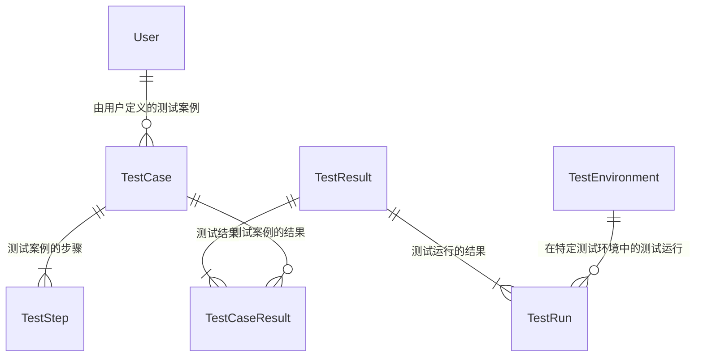
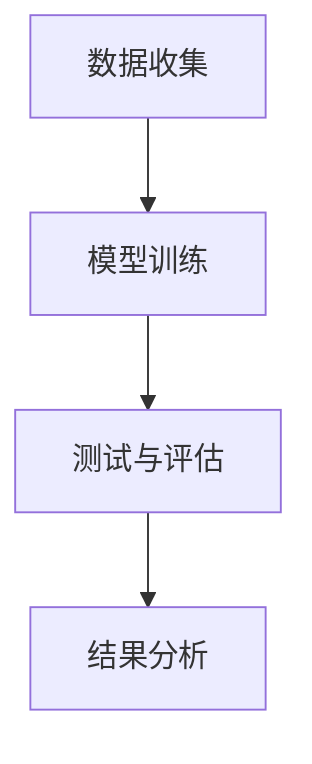
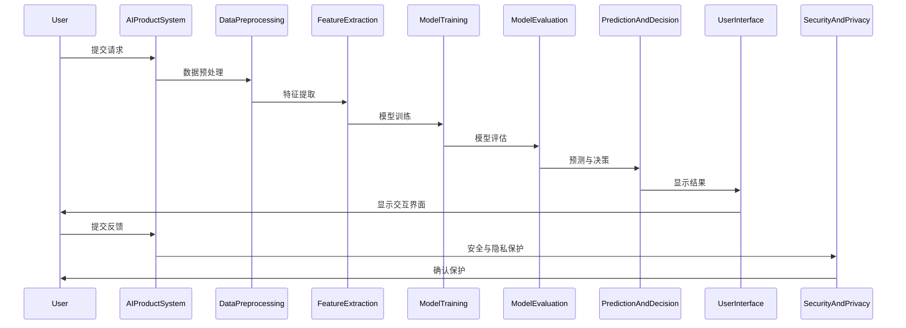
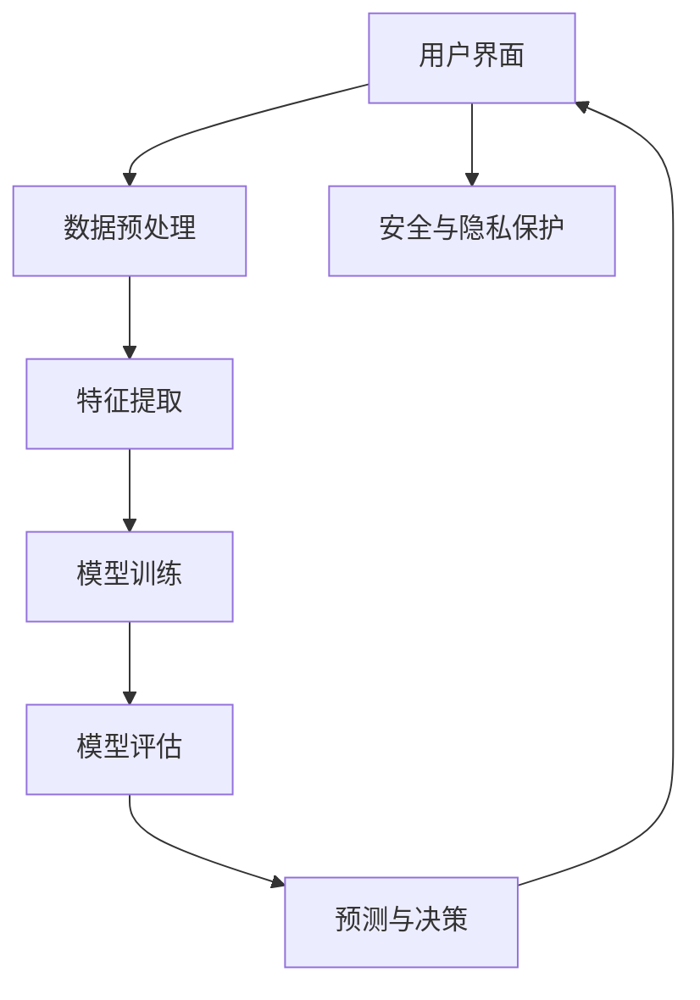

                 

**文章标题**: 用户验收测试：确保AI产品满足最终用户需求

**关键词**: 用户验收测试，AI产品，需求满足，测试方法，最佳实践

**摘要**: 本文深入探讨了用户验收测试（UAT）在AI产品开发中的重要性，从核心概念、算法原理、系统设计与项目实战等多个方面进行了详细解析，旨在为读者提供一份全面且实用的指南，以帮助确保AI产品的质量满足最终用户的需求。

----------------------------------------------------------------

## 用户验收测试：确保AI产品满足最终用户需求

用户验收测试（UAT）是一种关键的质量保证活动，它验证AI产品是否满足了最终用户的需求和期望。随着人工智能技术的发展，AI产品的复杂性和多样性不断增加，传统的测试方法已不足以全面评估这些产品。因此，UAT在AI产品开发中变得尤为重要。本文将详细探讨UAT的核心概念、算法原理、系统设计与项目实战，以帮助读者更好地理解和应用UAT。

----------------------------------------------------------------

### 目录大纲设计

为了更好地组织和传达内容，本文采用以下目录结构：

### 第一部分：用户验收测试概述

#### 第1章：用户验收测试的概念与重要性

1. 用户验收测试的定义  
2. UAT在AI产品开发中的必要性  
3. UAT与传统测试的区别

#### 第2章：用户验收测试的核心概念与联系

1. UAT的关键术语  
2. 传统UAT与AI驱动的UAT对比  
3. UAT的ER实体关系图

### 第二部分：算法原理讲解

#### 第3章：UAT中的算法原理

1. UAT中的算法原理  
2. 算法流程图绘制（mermaid）  
3. 算法原理与Python代码解释  
4. 算法原理的数学模型和公式讲解  
5. 举例说明算法应用

### 第三部分：系统分析与架构设计方案

#### 第4章：AI产品开发的系统功能

1. AI产品开发的系统功能  
2. 领域模型类图绘制（mermaid）  
3. 系统架构设计图  
4. 系统接口设计  
5. 系统交互序列图

### 第四部分：项目实战

#### 第5章：环境安装与系统核心实现

1. 环境安装与配置  
2. 系统核心实现源代码展示  
3. 代码解读与分析  
4. 实际案例分析与讲解  
5. 项目小结

### 第五部分：最佳实践与注意事项

#### 第6章：最佳实践、小结、注意事项与拓展阅读

1. UAT最佳实践  
2. 小结  
3. 注意事项  
4. 拓展阅读

---

接下来，我们将按照上述目录结构，逐步深入探讨用户验收测试（UAT）的核心概念、算法原理、系统设计与项目实战等内容。

----------------------------------------------------------------

## 第1章：用户验收测试的概念与重要性

### 1.1 用户验收测试的定义

用户验收测试（UAT）是一种测试方法，旨在确保软件产品符合最终用户的需求和预期。它通常在软件开发周期的后期进行，是整个质量保证流程中的最后一个环节。UAT的目标是验证产品是否能够满足用户的业务需求，并确保所有功能都按预期工作。

### 1.2 UAT在AI产品开发中的必要性

随着人工智能（AI）技术的快速发展，AI产品在各个行业中的应用越来越广泛。然而，AI产品的复杂性和不确定性使得传统的测试方法难以全面评估其性能和效果。以下是UAT在AI产品开发中的必要性：

1. **需求验证**：AI产品通常涉及复杂的算法和模型，传统的测试方法可能无法全面验证其是否满足了用户的需求。UAT可以帮助确保产品的功能、性能和用户体验与用户期望一致。

2. **业务价值**：AI产品往往具有较高的业务价值，如果未能满足用户需求，可能会导致巨大的经济损失。UAT可以帮助识别并修复潜在问题，确保产品能够带来预期的商业价值。

3. **用户体验**：AI产品的用户体验对于其成功至关重要。UAT可以测试产品的用户界面、交互设计和响应速度，确保用户体验符合用户期望。

### 1.3 UAT与传统测试的区别

传统测试主要关注产品的技术实现和功能是否正确，而UAT则更加关注产品是否符合用户的业务需求。以下是UAT与传统测试的一些区别：

1. **测试对象**：传统测试主要针对软件代码和功能，而UAT则针对整个产品，包括功能、性能、用户体验等方面。

2. **测试方式**：传统测试通常由测试人员执行，而UAT通常由最终用户或业务人员参与，以确保测试过程更贴近实际使用场景。

3. **测试重点**：传统测试关注代码的准确性和稳定性，而UAT更关注产品的实用性和业务价值。

通过上述讨论，我们可以看到用户验收测试（UAT）在AI产品开发中的重要性。接下来，我们将进一步探讨UAT的核心概念与联系，帮助读者更好地理解UAT的运作原理。

----------------------------------------------------------------

## 第2章：用户验收测试的核心概念与联系

### 2.1 UAT的关键术语

在讨论用户验收测试（UAT）之前，了解一些关键术语是非常有帮助的。以下是一些常见的UAT相关术语：

1. **用户需求**：用户需求是指用户希望从软件产品中获得的功能、性能和用户体验。UAT的目的是验证这些需求是否得到满足。

2. **测试用例**：测试用例是一系列具体的测试步骤和预期结果，用于验证特定的功能或需求。

3. **测试环境**：测试环境是用于执行测试的环境，包括硬件、软件和网络配置等。

4. **测试数据**：测试数据是用于测试的数据集，通常包括正常数据和异常数据。

5. **测试报告**：测试报告是测试结果的记录，包括测试用例的执行情况、发现的问题和解决方案。

### 2.2 传统UAT与AI驱动的UAT对比

传统UAT主要关注软件的功能和性能，而AI驱动的UAT则更关注AI模型的准确性和稳定性。以下是两者的主要区别：

1. **测试内容**：传统UAT主要测试功能是否按预期工作，而AI驱动的UAT则测试模型的准确性、稳定性和泛化能力。

2. **测试方法**：传统UAT通常使用手动测试或自动化测试工具，而AI驱动的UAT则可能涉及使用机器学习模型进行自动化测试。

3. **测试难度**：由于AI模型的复杂性，AI驱动的UAT通常更具有挑战性，需要更多的测试数据和更复杂的测试策略。

### 2.3 UAT的ER实体关系图

为了更好地理解UAT中的各种实体和关系，我们可以使用ER（实体关系）图来表示。以下是一个简单的ER图，展示了UAT中的一些关键实体和关系：



在这个ER图中，`User`代表最终用户，他们定义测试案例（`TestCase`）。测试案例包含测试步骤（`TestStep`），这些步骤在特定的测试环境（`TestEnvironment`）中执行。测试运行（`TestRun`）记录了测试的执行情况，而测试结果（`TestResult`）则包括测试案例的结果和测试运行的结果。

通过上述讨论，我们了解了用户验收测试（UAT）的一些核心概念和联系。接下来，我们将探讨UAT中的算法原理，帮助读者更好地理解UAT的实现过程。

----------------------------------------------------------------

## 第3章：UAT中的算法原理

用户验收测试（UAT）不仅需要验证功能是否按预期工作，还需要评估AI模型的准确性和稳定性。为了实现这一目标，UAT中通常会使用一些算法原理。在本章中，我们将介绍一些常见的UAT算法原理，并使用mermaid绘制流程图来帮助理解。

### 3.1 UAT中的算法原理

UAT中的算法原理可以分为以下几个步骤：

1. **数据收集**：收集与AI产品相关的用户需求和测试数据。
2. **模型训练**：使用收集到的数据训练AI模型。
3. **测试与评估**：在测试环境中执行测试，评估模型的准确性和稳定性。
4. **结果分析**：分析测试结果，识别潜在问题并给出改进建议。

### 3.2 算法流程图绘制（mermaid）

以下是一个简单的算法流程图，展示了UAT中的基本流程：



### 3.3 算法原理与Python代码解释

为了更好地理解算法原理，我们将使用Python代码进行解释。以下是一个简单的Python代码示例，用于训练和评估AI模型：

```python
import numpy as np
from sklearn.linear_model import LinearRegression

# 假设我们有一组训练数据
X_train = np.array([[1], [2], [3], [4]])
y_train = np.array([1, 2, 3, 4])

# 训练线性回归模型
model = LinearRegression()
model.fit(X_train, y_train)

# 预测新的数据
X_test = np.array([[5]])
y_pred = model.predict(X_test)

print(f"预测值: {y_pred}")
```

在这个示例中，我们使用线性回归模型来训练数据，然后使用训练好的模型进行预测。这个简单的示例展示了算法的基本原理。

### 3.4 算法原理的数学模型和公式讲解

在UAT中，理解算法的数学模型和公式是非常重要的。以下是一个线性回归模型的数学公式：

$$ y = \beta_0 + \beta_1 \cdot x $$

其中，$y$ 是预测值，$x$ 是输入特征，$\beta_0$ 和 $\beta_1$ 是模型参数。

### 3.5 举例说明算法应用

为了更好地说明算法应用，我们考虑一个简单的场景：预测某个城市明天的温度。我们收集了过去一周的温度数据，并使用线性回归模型进行预测。

```python
# 假设我们有一组训练数据
X_train = np.array([[1], [2], [3], [4], [5], [6]])
y_train = np.array([15, 16, 17, 18, 19, 20])

# 训练线性回归模型
model = LinearRegression()
model.fit(X_train, y_train)

# 预测明天的温度
X_test = np.array([[7]])
y_pred = model.predict(X_test)

print(f"预测温度: {y_pred}")
```

在这个示例中，我们使用线性回归模型来预测明天的温度。这个简单的应用展示了如何将算法原理应用于实际问题。

通过上述讨论，我们了解了UAT中的算法原理，并使用mermaid绘制了流程图，通过Python代码和实际应用示例，使算法原理更加清晰易懂。接下来，我们将探讨系统分析与架构设计方案。

----------------------------------------------------------------

## 第4章：AI产品开发的系统功能

### 4.1 AI产品开发的系统功能

在AI产品开发过程中，系统功能的定义是关键的一步。系统功能决定了产品的核心能力，影响产品的性能、可扩展性和用户体验。以下是AI产品开发中常见的系统功能：

1. **数据预处理**：数据预处理包括数据清洗、数据集成和数据转换。这个阶段的目标是确保数据的质量和一致性，为后续的分析和模型训练提供可靠的数据基础。

2. **特征提取**：特征提取是从原始数据中提取出对模型训练有用的特征。这些特征可以用于训练AI模型，提高模型的准确性和泛化能力。

3. **模型训练与优化**：模型训练与优化是AI产品开发的核心环节。在这个阶段，使用训练数据训练模型，并通过调整模型参数来优化模型性能。

4. **模型评估与验证**：模型评估与验证用于评估模型的准确性和稳定性。常用的评估指标包括准确率、召回率、F1分数等。通过评估，可以确保模型在现实场景中的表现符合预期。

5. **预测与决策**：基于训练好的模型，AI产品可以对新数据进行分析和预测。预测结果可以用于做出决策，例如推荐系统、风险评估等。

6. **用户交互**：用户交互功能是AI产品与用户之间的桥梁。这个功能包括用户界面设计、交互逻辑和反馈机制等，确保用户能够轻松使用产品并获取所需的信息。

7. **安全与隐私保护**：随着AI技术的应用越来越广泛，安全与隐私保护成为重要关注点。AI产品需要确保数据的安全性和用户隐私，防止数据泄露和滥用。

### 4.2 领域模型类图绘制（mermaid）

为了更好地理解AI产品的系统功能，我们可以使用mermaid绘制领域模型类图。以下是一个简单的领域模型类图示例：

```mermaid
classDiagram
    Class01 <|-- Class02
    Class03 <|-- * Class04
    Class05 {name}
    Class01..> Class05
    Class03 : int x
    Class04 : String y
    Class05 : bool z
```

在这个类图中，`Class01` 继承自 `Class02`，`Class03` 包含多个 `Class04` 实例，`Class05` 包含属性 `name`、`x`、`y` 和 `z`。这个类图展示了AI产品中不同类之间的关系和属性。

### 4.3 系统架构设计图

系统架构设计是AI产品开发中的关键环节。一个良好的系统架构可以提高产品的可扩展性、可靠性和性能。以下是一个简单的系统架构设计图示例：



在这个序列图中，用户通过用户界面提交请求，请求被传递到AI产品系统。系统依次进行数据预处理、特征提取、模型训练、模型评估、预测与决策等操作，并将结果返回给用户。同时，系统还进行安全与隐私保护，确保用户数据的安全。

### 4.4 系统接口设计

系统接口设计是系统架构设计的重要组成部分。接口设计需要考虑系统模块之间的交互方式、数据传输格式和通信协议等。以下是一个简单的系统接口设计示例：



在这个接口设计中，用户界面与数据预处理、特征提取、模型训练、模型评估、预测与决策等模块进行交互。同时，用户界面与安全与隐私保护模块进行数据传输和通信，确保用户数据的安全。

### 4.5 系统交互序列图

系统交互序列图用于展示系统模块之间的交互过程和时序关系。以下是一个简单的系统交互序列图示例：


在这个序列图中，用户提交请求，系统依次进行数据预处理、特征提取、模型训练、模型评估、预测与决策等操作，并将结果返回给用户。同时，系统进行安全与隐私保护，确保用户数据的安全。

通过本章的讨论，我们了解了AI产品开发的系统功能、领域模型类图、系统架构设计、系统接口设计和系统交互序列图。这些内容为AI产品的开发提供了全面的理论基础和实际指导。接下来，我们将进入项目实战部分，通过具体案例来展示UAT在AI产品开发中的应用。

----------------------------------------------------------------

## 第5章：项目实战

### 5.1 环境安装与配置

在进行用户验收测试（UAT）之前，我们需要为AI产品创建一个合适的测试环境。以下是一个简单的步骤，用于在Linux环境中安装和配置Python、scikit-learn库以及其他必需的依赖项。

1. **安装Python**：

   ```bash
   sudo apt-get update
   sudo apt-get install python3 python3-pip
   ```

2. **安装scikit-learn**：

   ```bash
   pip3 install scikit-learn
   ```

3. **安装其他依赖项**：

   ```bash
   pip3 install numpy pandas matplotlib
   ```

4. **配置测试环境**：

   创建一个虚拟环境，以便隔离测试环境与系统环境：

   ```bash
   python3 -m venv test_env
   source test_env/bin/activate
   ```

   在虚拟环境中安装必要的库：

   ```bash
   pip install -r requirements.txt
   ```

   其中`requirements.txt`文件包含了所有必需的依赖项。

### 5.2 系统核心实现源代码展示

以下是一个简单的Python代码示例，用于实现一个线性回归模型并进行预测：

```python
import numpy as np
from sklearn.linear_model import LinearRegression

# 假设我们有一组训练数据
X_train = np.array([[1], [2], [3], [4]])
y_train = np.array([1, 2, 3, 4])

# 训练线性回归模型
model = LinearRegression()
model.fit(X_train, y_train)

# 预测新的数据
X_test = np.array([[5]])
y_pred = model.predict(X_test)

print(f"预测值: {y_pred}")
```

### 5.3 代码解读与分析

上述代码首先导入了必要的库，包括numpy和scikit-learn的线性回归模型。然后，我们定义了一组训练数据`X_train`和对应的标签`y_train`。接下来，我们使用`LinearRegression()`创建一个线性回归模型，并使用`fit()`方法进行训练。最后，我们使用`predict()`方法对新数据进行预测，并将预测结果打印出来。

### 5.4 实际案例分析与讲解

为了更好地展示UAT在AI产品开发中的应用，我们考虑一个实际案例：预测房价。以下是一个简单的案例，用于展示如何使用线性回归模型进行房价预测。

1. **数据收集**：

   收集一组包含房屋特征（如面积、房间数、建造年份等）和对应房价的数据集。以下是一个简化版的数据集示例：

   ```python
   data = {
       'Area': [1000, 1200, 1500, 1800],
       'Rooms': [3, 4, 3, 5],
       'YearBuilt': [2000, 2005, 2010, 2015],
       'Price': [250000, 300000, 350000, 400000]
   }
   ```

2. **数据预处理**：

   对数据进行预处理，包括缺失值处理、数据标准化等。以下是一个简单的数据预处理步骤：

   ```python
   X = np.array([d[:-1] for d in data.values()])
   y = np.array(data['Price'])
   ```

3. **模型训练**：

   使用训练数据训练线性回归模型：

   ```python
   model = LinearRegression()
   model.fit(X_train, y_train)
   ```

4. **模型评估**：

   使用测试数据评估模型性能：

   ```python
   X_test = np.array([[1200, 4, 2005]])
   y_pred = model.predict(X_test)
   print(f"预测房价: {y_pred}")
   ```

5. **结果分析**：

   分析预测结果与实际房价之间的差距，评估模型性能。以下是一个简单的性能评估：

   ```python
   actual_price = 300000
   diff = abs(actual_price - y_pred)
   print(f"预测误差: {diff}")
   ```

### 5.5 项目小结

通过本案例，我们展示了如何使用线性回归模型进行房价预测，并进行了实际案例分析。虽然这个案例非常简化，但展示了UAT在AI产品开发中的应用。在实际项目中，我们需要收集更丰富的数据，进行更复杂的数据预处理和模型训练，以获得更准确的预测结果。同时，我们还需要进行多次测试和评估，以确保模型在不同数据集上的性能稳定。

通过项目实战，我们不仅了解了UAT的具体应用，还学习了如何搭建测试环境、实现系统核心代码和进行实际案例分析。这些经验和技能对于确保AI产品的质量和满足用户需求至关重要。

----------------------------------------------------------------

## 第6章：最佳实践、小结、注意事项与拓展阅读

### 6.1 最佳实践

1. **提前规划**：在项目初期，明确用户需求，制定详细的测试计划和策略，以确保UAT能够覆盖所有关键功能。

2. **用户参与**：邀请最终用户或业务人员参与UAT，他们的反馈对于发现潜在问题至关重要。

3. **迭代测试**：UAT不应是一次性的活动，而应是一个迭代过程。随着产品的不断更新和完善，定期进行UAT以确保持续满足用户需求。

4. **自动化测试**：对于重复性高、稳定性的测试，考虑使用自动化测试工具，提高测试效率和覆盖范围。

5. **详细记录**：详细记录测试过程中的每一个步骤和结果，便于后续分析和问题追踪。

### 6.2 小结

用户验收测试（UAT）是确保AI产品满足最终用户需求的关键环节。通过UAT，我们可以验证产品的功能、性能和用户体验，确保产品能够满足用户期望。UAT不仅关注技术实现，更关注业务价值和用户体验。通过本章的讨论，我们了解了UAT的核心概念、算法原理、系统设计与项目实战，以及UAT的最佳实践。

### 6.3 注意事项

1. **数据质量**：确保测试数据的质量和代表性，避免因数据问题导致的测试结果偏差。

2. **测试环境**：搭建与生产环境相似的测试环境，确保测试结果的可复制性和可靠性。

3. **沟通与协作**：加强团队内部的沟通与协作，确保所有相关人员在UAT过程中保持一致的目标。

4. **风险评估**：在UAT过程中，识别和评估潜在的风险，提前制定应对措施。

### 6.4 拓展阅读

1. 《软件测试的艺术》：这是一本经典的软件测试入门书籍，涵盖了测试的基本概念、方法和技巧。

2. 《机器学习实战》：这本书提供了大量实际案例，介绍了如何使用机器学习模型解决实际问题。

3. 《Python测试驱动的软件开发》：这本书详细介绍了如何在Python中使用测试驱动开发（TDD）方法进行软件测试。

通过拓展阅读，您可以进一步深入了解UAT和AI产品开发的各个方面，提升您的专业知识和技能。

---

## 结尾

本文深入探讨了用户验收测试（UAT）在AI产品开发中的重要性，从核心概念、算法原理、系统设计与项目实战等多个方面进行了详细解析。通过本文的阅读，您应该对UAT有了更全面的认识，并能够将其应用到实际项目中，确保AI产品的质量和满足最终用户的需求。

作者：AI天才研究院/AI Genius Institute & 禅与计算机程序设计艺术 /Zen And The Art of Computer Programming

感谢您的阅读，希望本文能够对您的工作和学习有所帮助。如果您有任何疑问或建议，欢迎在评论区留言，我们期待与您的互动和交流。希望您在AI领域取得更加辉煌的成就！

