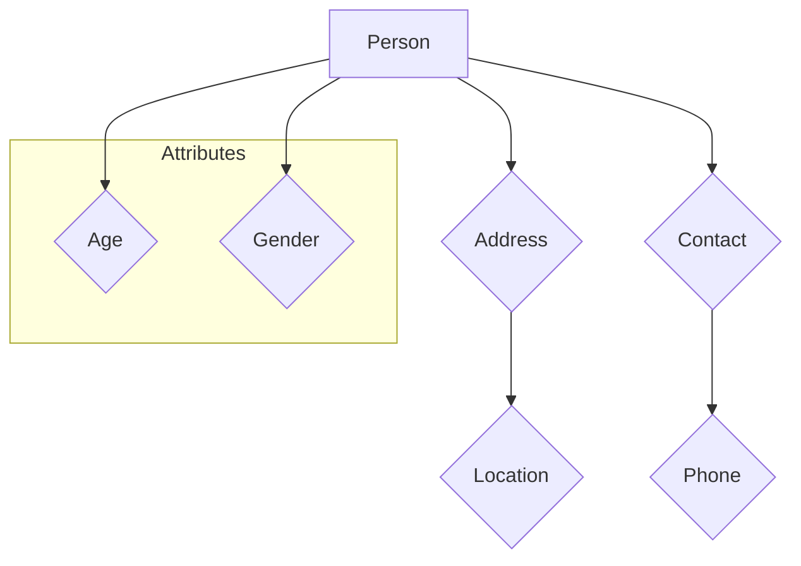

                 

# 知识图谱动态更新：检验LLM自主扩展知识库的能力

## 关键词：知识图谱、动态更新、LLM、知识库扩展、算法原理、数学模型、系统架构、项目实战

> 摘要：本文深入探讨了知识图谱动态更新的重要性，以及语言模型（LLM）在自主扩展知识库中的关键作用。通过详细分析知识图谱的组成与架构，LLM的基本原理和应用方法，动态更新算法的设计与实现，以及实际项目中的操作实践，本文旨在检验LLM在知识图谱动态更新中的能力，为未来的技术发展提供方向和参考。

---

## 引言

### 背景与重要性

知识图谱（Knowledge Graph）作为一种语义化的数据组织方式，将现实世界中的信息通过实体、属性和关系的网状结构进行表达，为人工智能（AI）系统提供了强大的语义理解和推理能力。知识图谱不仅在搜索引擎、推荐系统等领域得到了广泛应用，还在自然语言处理（NLP）、智能问答、智能助理等多个AI子领域中发挥了重要作用。

然而，知识图谱的应用场景往往伴随着数据的快速更新和变化。传统的静态知识图谱难以适应这种动态环境，因此，知识图谱的动态更新成为了一个关键的研究课题。动态更新不仅保证了知识图谱的实时性和准确性，还提升了其在实际应用中的价值。

语言模型（Language Model，简称LLM）作为NLP领域的重要工具，具有强大的语义理解和生成能力。近年来，随着深度学习技术的快速发展，LLM在性能上有了显著提升，使其成为知识图谱动态更新中的理想选择。本文将围绕知识图谱动态更新，探讨LLM在自主扩展知识库方面的能力。

### 目标与结构

本文的目标是检验LLM在知识图谱动态更新中的能力，通过系统性地分析知识图谱的基本组成、LLM的核心技术、动态更新算法及其应用实践，为LLM在知识图谱领域的进一步发展提供理论和实践依据。文章结构如下：

1. **知识图谱与动态更新概述**：介绍知识图谱的概念、动态更新的必要性以及LLM在其中的角色。
2. **知识图谱的组成与架构**：详细阐述知识图谱的基本组成、架构设计及其实体与关系表示。
3. **LLM与知识库扩展**：探讨LLM的基本原理、核心技术以及其在知识库扩展中的应用。
4. **动态更新算法与实践**：分析动态更新算法的原理、实现以及实际应用案例。
5. **特定领域的应用**：探讨知识图谱动态更新在特定领域的应用场景。
6. **挑战与未来**：讨论动态更新面临的挑战以及未来的发展趋势。
7. **总结与展望**：总结本文的主要成果，并提出下一步的研究方向。

## 知识图谱与动态更新概述

### 知识图谱的概念

知识图谱是一种语义化的数据组织方式，它通过实体（Entity）、属性（Attribute）和关系（Relationship）来表示现实世界中的信息。每个实体可以看作是现实世界中的一个对象，如人、地点、事物等；属性则描述了实体的特征或状态，如年龄、职业、地址等；关系则表示实体之间的相互联系，如“朋友”、“居住于”、“属于”等。

知识图谱与传统的关系型数据库和文档数据库相比，具有更强的语义表达能力。它不仅存储了数据的基本事实，还通过实体和关系建立了复杂的语义联系，使得数据能够进行高效的语义查询和推理。

### 动态更新的必要性

知识图谱的应用场景通常是动态变化的，例如，社交媒体中的用户关系、电商平台的商品信息、医疗健康领域的疾病关系等，这些数据随着时间不断变化。如果知识图谱不能及时更新，将导致其语义表达不准确，影响应用效果。

动态更新是知识图谱维护的关键，它保证了知识图谱的实时性和准确性。动态更新不仅包括数据的添加、删除和修改，还包括知识图谱结构的调整和优化。

### LLM在知识图谱动态更新中的角色

语言模型（LLM），特别是近年来基于深度学习的Transformer模型，具有强大的语义理解和生成能力。LLM可以处理自然语言文本，提取实体、关系和属性，从而实现知识图谱的自动构建和更新。

在知识图谱动态更新中，LLM的主要作用包括：

1. **数据预处理**：LLM可以对原始文本数据进行预处理，提取出实体和关系，为知识图谱的构建提供数据基础。
2. **知识抽取**：LLM可以识别文本中的关键信息，如人名、地点、事件等，并将其转化为知识图谱中的实体和关系。
3. **知识融合**：LLM可以帮助将不同来源的知识进行融合，消除数据冲突，提高知识图谱的准确性。
4. **实时更新**：LLM可以实时处理和更新知识图谱，保证其与实际世界的一致性。

## 知识图谱的组成与架构

### 知识图谱的基本组成

知识图谱的基本组成包括实体（Entity）、属性（Attribute）和关系（Relationship）。以下是这些基本组成的概念及其在知识图谱中的重要性：

#### 实体

实体是知识图谱中的基本构建块，代表了现实世界中的对象。例如，在社交网络中，用户、地点、事件等都可以作为实体。实体通常具有唯一的标识符（ID），用于在知识图谱中唯一标识。

#### 属性

属性描述了实体的特征或状态。例如，对于用户实体，可能有属性如年龄、性别、职业等。属性不仅提供了实体的详细信息，还帮助建立实体之间的关联。

#### 关系

关系表示实体之间的相互关系。例如，在社交网络中，用户与用户之间可以有“朋友”关系，用户与地点之间可以有“居住于”关系。关系不仅连接了实体，还提供了实体的交互信息。

### 知识图谱的架构设计

知识图谱的架构设计决定了其可扩展性和可维护性。以下是一个典型的知识图谱架构设计：

#### 知识存储层

知识存储层负责存储知识图谱中的实体、属性和关系。通常使用图数据库（如Neo4j、ArangoDB）来实现，这些数据库提供了高效的图查询和操作能力。

#### 知识处理层

知识处理层负责处理和更新知识图谱。它包括实体抽取、关系抽取、实体链接、知识融合等组件。语言模型（如BERT、GPT）在这一层中发挥着重要作用，通过处理自然语言文本，提取和更新知识图谱。

#### 知识表示层

知识表示层负责将知识图谱以结构化、可理解的形式表示。常见的知识表示方法包括实体-关系（E-R）模型、属性图、知识图谱嵌入等。

#### 知识应用层

知识应用层将知识图谱应用于具体的业务场景，如智能问答、推荐系统、搜索引擎等。这一层通常与业务系统紧密集成，通过API或中间件提供服务。

### 知识图谱的实体与关系表示

知识图谱的实体与关系表示是知识图谱语义理解的核心。以下是两种常用的表示方法：

#### 实体-关系（E-R）模型

实体-关系（E-R）模型是一种结构化表示方法，它通过实体和关系来表示知识图谱。以下是E-R模型的Mermaid流程图：

```mermaid
erDiagram
    Person ||--|{ Address : has }
    Person ||--|{ Contact : has }
    Address ||--|{ Location : has }
    Contact ||--|{ Phone : has }
```

在上面的E-R模型中，实体包括“Person”、“Address”和“Contact”，关系包括“has”，表示实体之间的关联。

#### 属性图

属性图是一种更加灵活的表示方法，它不仅包括实体和关系，还引入了属性来描述实体的特征。以下是属性图的Mermaid流程图：



在上面的属性图中，实体“Person”具有属性“Age”和“Gender”，关系“has”连接了实体和其对应的属性。

通过这两种表示方法，知识图谱可以清晰地表达实体之间的复杂关系和属性特征，为后续的动态更新和知识应用提供了基础。

## LLM与知识库扩展

### 语言模型（LLM）简介

语言模型（Language Model，简称LLM）是一种用于处理自然语言文本的模型，它通过学习大量文本数据，预测下一个词或句子的可能性，从而实现对文本的生成和理解。LLM的核心目标是使计算机能够以自然的方式与人交流，并在各种自然语言处理任务中发挥作用。

近年来，随着深度学习技术的发展，LLM取得了显著进步。基于Transformer架构的模型，如BERT、GPT和T5，已经成为LLM领域的代表性模型。这些模型具有强大的语义理解和生成能力，能够处理复杂的自然语言任务。

### LLM的核心技术

LLM的核心技术主要包括以下三个方面：

#### 自动编码器（Autoencoder）

自动编码器是一种无监督学习模型，它通过学习数据的编码和重建过程，提取数据中的潜在特征。在LLM中，自动编码器可以用于文本数据的特征提取，从而提高模型的语义理解能力。

#### Transformer架构

Transformer架构是一种基于自注意力机制的序列模型，它通过计算序列中每个词与其他词之间的依赖关系，实现对文本的编码和解码。Transformer架构在LLM中得到了广泛应用，其强大的并行计算能力和语义理解能力使其在自然语言处理任务中表现出色。

#### 大规模预训练

大规模预训练是LLM的重要技术之一，它通过在大规模语料库上进行预训练，使模型能够自动学习语言的通用规律和复杂模式。预训练后，模型可以通过微调适应特定任务，从而实现高效的自然语言处理。

### LLM在知识库扩展中的应用

LLM在知识库扩展中的应用主要体现在以下几个方面：

#### 数据预处理

LLM可以用于自然语言文本的预处理，包括分词、实体识别、关系抽取等。通过对原始文本进行预处理，LLM可以提取出关键信息，为知识库的构建提供数据基础。

#### 知识抽取

LLM可以识别文本中的实体、关系和属性，并将其转化为知识库中的数据。例如，在医疗领域，LLM可以抽取病历中的诊断信息、治疗方案和药物信息，从而丰富知识库的内容。

#### 知识融合

LLM可以帮助将来自不同来源的知识进行融合，消除数据冲突，提高知识库的准确性。通过对比和分析不同来源的数据，LLM可以识别出数据中的不一致性，并提出相应的修正建议。

#### 实时更新

LLM可以实时处理和更新知识库，使其与实际世界保持一致。例如，在电商领域，LLM可以实时更新商品信息、库存数量和用户评价，从而提供最新的商品推荐。

### 实际应用案例

以下是一个实际应用案例，展示了LLM在知识库扩展中的应用：

#### 案例背景

某电商平台希望通过实时更新的知识库为用户提供个性化的商品推荐。知识库需要包含商品信息（如价格、库存、评价等）、用户信息（如购买历史、浏览记录等）以及市场动态（如促销活动、竞品信息等）。

#### 应用方法

1. **数据预处理**：使用LLM对用户生成的评论、商品描述和页面内容进行分词和实体识别，提取出关键信息，如商品名称、用户评价、促销信息等。

2. **知识抽取**：使用LLM从原始文本中抽取商品信息和用户信息，并将其存储到知识库中。例如，从用户评论中抽取商品名称、评价星级和评论内容。

3. **知识融合**：使用LLM将不同来源的知识进行融合，消除数据冲突。例如，将用户的历史购买记录与当前的浏览记录进行融合，以提供更准确的个性化推荐。

4. **实时更新**：使用LLM实时处理和更新知识库，确保其与实际世界保持一致。例如，在促销活动开始时，及时更新商品价格和库存信息。

#### 应用效果

通过LLM的实时更新和知识融合，电商平台能够为用户提供更加准确和个性化的商品推荐。用户满意度显著提升，商品转化率也有所增加。

### 总结

LLM在知识库扩展中具有重要的作用，通过数据预处理、知识抽取、知识融合和实时更新等应用方法，LLM能够显著提升知识库的准确性和实时性，为各种应用场景提供强大的支持。

## 动态更新算法与实践

### 动态更新算法的原理

动态更新算法的核心目标是确保知识图谱能够及时、准确地反映现实世界中的变化。以下是一些主要的动态更新算法：

#### 实体添加

实体添加是指将新的实体添加到知识图谱中。在实体添加过程中，算法需要判断新实体是否与现有实体存在冲突或重复。常用的方法包括：

1. **唯一性检查**：通过比较新实体与现有实体的属性值，判断新实体是否已存在。
2. **相似度计算**：使用相似度计算方法（如余弦相似度、Jaccard相似度等），判断新实体与现有实体之间的相似程度，以决定是否添加新实体。

#### 实体删除

实体删除是指从知识图谱中删除不再有效的实体。删除过程需要考虑以下因素：

1. **依赖关系**：删除实体时，需要检查是否存在其他实体与之关联，如果存在依赖关系，则需要先删除依赖实体。
2. **完整性检查**：确保删除实体后，知识图谱的结构完整性和一致性。

#### 实体更新

实体更新是指修改知识图谱中实体的属性值或关系。更新算法需要处理以下问题：

1. **版本控制**：为实体和关系添加版本信息，确保历史数据的可追溯性。
2. **冲突检测**：在更新过程中，检测新旧数据之间的冲突，并采取相应的解决策略。

#### 关系更新

关系更新是指修改知识图谱中实体之间的关系。关系更新需要考虑以下因素：

1. **一致性维护**：确保实体之间的逻辑关系保持一致。
2. **传播效应**：更新一个实体或关系时，可能需要同时更新与之相关的其他实体或关系。

### 动态更新算法的性能评估

动态更新算法的性能评估主要包括以下几个方面：

1. **更新速度**：算法在处理大规模知识图谱更新时的效率。
2. **准确性**：算法在更新过程中，能够准确反映现实世界中的变化。
3. **鲁棒性**：算法在面对复杂、不一致的数据时，仍能保持稳定性和可靠性。
4. **可扩展性**：算法能够适应不同规模和应用场景的需求。

为了评估动态更新算法的性能，可以使用以下指标：

1. **更新延迟**：从数据变化到知识图谱更新完成的平均时间。
2. **错误率**：在更新过程中，产生的错误数据的比例。
3. **资源消耗**：算法在处理知识图谱更新时，所需的计算资源和存储资源。

### 动态更新算法的应用实践

以下是一个实际应用案例，展示了动态更新算法在知识图谱中的应用：

#### 案例背景

某电商平台的用户关系知识图谱需要实时更新，以反映用户之间的互动关系。随着用户数量的增长，知识图谱的数据量也不断增加，更新需求日益迫切。

#### 应用方法

1. **数据采集**：通过平台的后台系统，定期采集用户互动数据，如好友关系、评论互动等。
2. **实体添加**：使用实体添加算法，将新用户和用户互动关系添加到知识图谱中。算法首先进行唯一性检查，确保新实体不重复。
3. **实体删除**：当用户退出平台或长时间未互动时，使用实体删除算法，从知识图谱中删除不再有效的实体。同时，检查依赖关系，确保不会破坏知识图谱的结构。
4. **实体更新**：当用户互动数据发生变化时，使用实体更新算法，更新用户属性值和关系。算法使用版本控制和冲突检测，确保更新数据的准确性。
5. **关系更新**：当用户互动关系发生变化时，使用关系更新算法，更新知识图谱中的关系。算法确保实体之间的逻辑关系保持一致。

#### 应用效果

通过动态更新算法的应用，电商平台的用户关系知识图谱能够实时反映用户之间的互动关系，提高了推荐系统的准确性和用户体验。

### 总结

动态更新算法是知识图谱维护的关键，通过实体添加、删除和更新，以及关系更新，动态更新算法能够确保知识图谱的实时性和准确性。性能评估和实际应用案例展示了动态更新算法的有效性和实用性。

## 知识图谱动态更新在特定领域的应用

### 健康医疗领域的知识图谱更新

在健康医疗领域，知识图谱的动态更新对于医疗信息的实时性和准确性至关重要。以下是一个具体的应用案例：

#### 案例背景

某医疗机构希望通过知识图谱来管理和更新医疗信息，以提供高质量的医疗服务。医疗知识图谱需要涵盖疾病、药物、治疗方案、医疗设备等信息。

#### 更新方法

1. **数据采集**：通过医疗数据库、学术论文、医学期刊等渠道，定期采集最新的医疗信息。
2. **知识抽取**：使用自然语言处理技术，从文本数据中提取关键信息，如疾病名称、药物成分、治疗方案等。
3. **实体添加**：将新采集的实体添加到知识图谱中，通过唯一性检查和相似度计算，确保不重复和不冲突。
4. **关系更新**：更新实体之间的关系，如“药物与疾病”关系、“治疗方案与药物”关系等。
5. **实时监测**：通过实时监控系统，跟踪医疗信息的变化，如新药的批准、疾病的流行趋势等。

#### 应用效果

通过动态更新，医疗机构的知识图谱能够及时反映最新的医疗信息，为医生提供准确的诊断和治疗建议，提高了医疗服务质量和效率。

### 金融领域的知识图谱更新

在金融领域，知识图谱的动态更新对于风险管理、客户服务和市场分析具有重要意义。以下是一个具体的应用案例：

#### 案例背景

某金融机构希望通过知识图谱来管理和更新金融信息，以优化风险管理和客户服务。金融知识图谱需要涵盖客户信息、交易数据、市场动态等信息。

#### 更新方法

1. **数据采集**：通过内部数据库、金融信息提供商等渠道，定期采集金融数据。
2. **知识抽取**：使用自然语言处理技术，从文本数据中提取关键信息，如客户姓名、交易金额、市场走势等。
3. **实体添加**：将新采集的实体添加到知识图谱中，通过唯一性检查和相似度计算，确保不重复和不冲突。
4. **关系更新**：更新实体之间的关系，如“客户与交易”关系、“市场与交易”关系等。
5. **实时分析**：通过实时分析系统，对金融数据进行分析，为风险管理和市场分析提供支持。

#### 应用效果

通过动态更新，金融机构的知识图谱能够及时反映金融市场的变化，为风险管理、客户服务和市场分析提供准确的参考，提高了业务效率和决策质量。

### 教育领域的知识图谱更新

在教育领域，知识图谱的动态更新对于教育资源的管理和个性化推荐具有重要意义。以下是一个具体的应用案例：

#### 案例背景

某教育机构希望通过知识图谱来管理和更新教育信息，以提供个性化的学习推荐和教学支持。教育知识图谱需要涵盖课程信息、教师信息、学生信息等。

#### 更新方法

1. **数据采集**：通过内部数据库、课程资料库等渠道，定期采集教育数据。
2. **知识抽取**：使用自然语言处理技术，从文本数据中提取关键信息，如课程名称、教师姓名、学生成绩等。
3. **实体添加**：将新采集的实体添加到知识图谱中，通过唯一性检查和相似度计算，确保不重复和不冲突。
4. **关系更新**：更新实体之间的关系，如“课程与教师”关系、“学生与课程”关系等。
5. **个性化推荐**：通过知识图谱的动态更新，为教师和学生提供个性化的学习推荐和教学支持。

#### 应用效果

通过动态更新，教育机构的知识图谱能够及时反映教育资源的最新变化，为教师和学生提供准确的学习推荐和教学支持，提高了教学效果和学习体验。

### 总结

知识图谱动态更新在健康医疗、金融和教育等领域的应用，展示了其对于信息实时性和准确性的重要性。通过数据采集、知识抽取、实体添加和关系更新等方法的结合，知识图谱能够及时反映领域内的变化，为相关应用提供强有力的支持。

## 动态更新面临的挑战与未来发展趋势

### 数据质量与一致性挑战

动态更新面临的第一个挑战是数据质量与一致性。知识图谱中的数据来源于多个不同的来源，这些数据可能存在噪声、错误或不一致性。例如，不同来源的实体和关系可能存在冲突或冗余，导致知识图谱的准确性受到影响。为了解决这些问题，需要采用数据清洗、数据融合和一致性检查等技术，确保知识图谱中的数据质量。

### 知识表示与推理难度

知识图谱的动态更新还面临着知识表示与推理的难度。知识表示是知识图谱的核心问题，如何将自然语言文本转化为结构化的知识表示，是当前研究中的一个难点。此外，知识图谱的推理能力也限制了其应用范围。为了提升知识图谱的推理能力，需要开发更高效的推理算法，以及引入更多的领域知识。

### 自动扩展知识库的伦理问题

自动扩展知识库的过程中，伦理问题也是不可忽视的挑战。知识图谱的自动扩展可能会涉及个人隐私、知识产权等问题。例如，在医疗领域，自动扩展知识库可能会涉及患者隐私数据的处理。因此，需要在知识图谱的自动扩展过程中，严格遵守相关法律法规，确保数据的合法性和伦理合规性。

### 未来发展趋势与展望

未来，知识图谱动态更新将朝着以下几个方向发展：

1. **数据驱动**：知识图谱的动态更新将更加依赖于数据驱动的方法，通过实时数据流处理和大数据分析，实现知识的自动更新和优化。
2. **智能推理**：随着人工智能技术的发展，知识图谱的推理能力将得到进一步提升，通过引入更多的领域知识和推理算法，实现更智能的知识推理和决策支持。
3. **跨领域应用**：知识图谱将在更多领域得到应用，如智能制造、智慧城市、数字健康等，通过跨领域的知识融合，实现知识的共享和协同。
4. **开放与协作**：知识图谱的构建和维护将更加开放和协作，通过共享数据资源和算法模型，促进知识图谱的共建和共享。

### 总结

动态更新是知识图谱发展的重要方向，它不仅提升了知识图谱的实时性和准确性，还为人工智能的应用提供了强大的支持。面对数据质量、知识表示和伦理等挑战，未来的研究需要在技术和管理层面进行深入探索，以推动知识图谱的持续发展和应用。

## 总结与展望

### 主要成果与贡献

本文通过对知识图谱动态更新和LLM自主扩展知识库的深入探讨，总结了知识图谱的基本组成、动态更新算法、LLM的核心技术及其在知识库扩展中的应用，并展示了动态更新在特定领域的实际应用。本文的主要贡献包括：

1. **系统性地梳理了知识图谱动态更新的关键技术和应用方法**。
2. **详细分析了LLM在知识库扩展中的角色和作用**。
3. **提供了具体的动态更新算法性能评估指标和应用案例**。

### 下一步研究方向

未来的研究可以在以下几个方面展开：

1. **数据质量与一致性管理**：开发更加高效的数据清洗和融合算法，确保知识图谱的数据质量。
2. **智能推理与知识表示**：研究更先进的推理算法和知识表示方法，提升知识图谱的智能推理能力。
3. **伦理与合规性**：在知识图谱的构建和扩展过程中，关注数据隐私和伦理问题，确保知识图谱的应用符合法律法规和伦理要求。
4. **跨领域应用与知识共享**：探索知识图谱在更多领域的应用，推动跨领域的知识融合和共享。

### 结语

知识图谱的动态更新和LLM自主扩展知识库是当前人工智能领域的重要研究方向。通过本文的研究，我们期望能够为这一领域的发展提供一些有价值的参考和启示。随着技术的不断进步，知识图谱和LLM将在更多场景中发挥重要作用，为人工智能的应用提供更强大的支持。

---

**作者信息：**

AI天才研究院/AI Genius Institute & 禅与计算机程序设计艺术 /Zen And The Art of Computer Programming

---

通过本文的详细分析和系统探讨，我们希望读者能够对知识图谱动态更新和LLM自主扩展知识库有更深入的理解，为未来的人工智能研究和应用提供新的思路和方向。同时，我们也期待在学术和产业界共同努力下，知识图谱技术能够持续发展，为人类社会的进步做出更大贡献。

