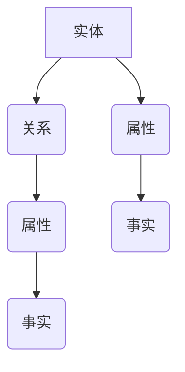
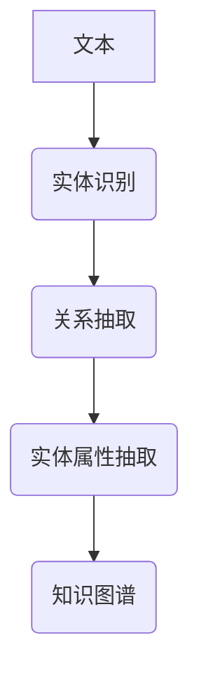
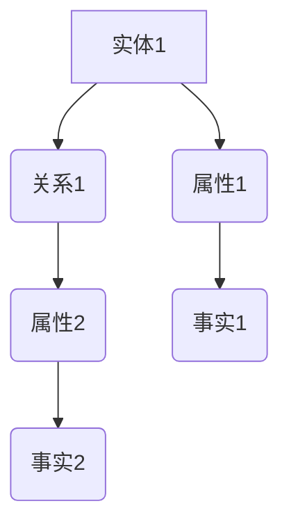
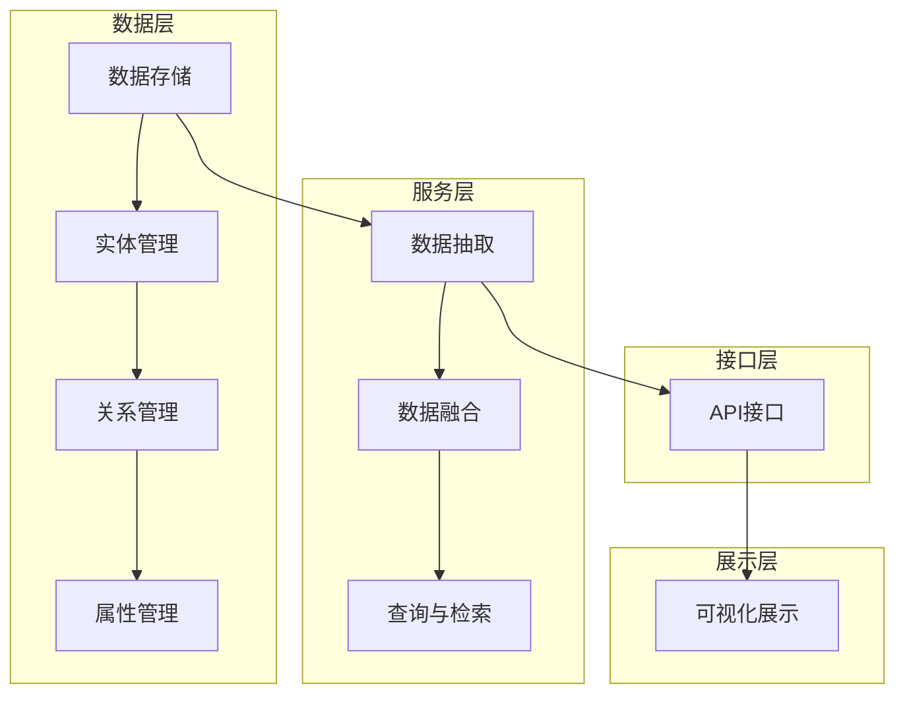
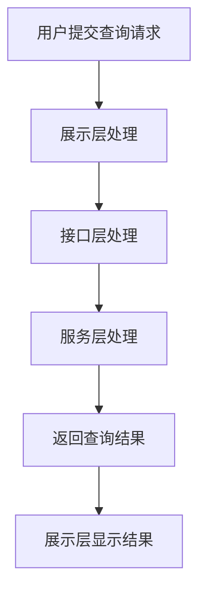

                 

### 知识图谱构建能力测试

#### 关键词：知识图谱、数据结构、算法原理、系统架构、Python实现

> 摘要：本文将深入探讨知识图谱的构建能力，通过一系列步骤详细解析知识图谱的定义、核心概念、构建算法原理，以及系统架构和实际项目实战。文章旨在帮助读者全面了解知识图谱的构建过程，提升相关技术能力。

#### 目录大纲

1. **背景介绍**
   1.1 知识图谱的概念
   1.2 知识图谱的应用
   1.3 知识图谱的发展历程

2. **核心概念与联系**
   2.1 术语解释
   2.2 知识图谱的内部结构
   2.3 Mermaid流程图展示

3. **算法原理讲解**
   3.1 算法选择与分类
   3.2 典型算法原理讲解
   3.3 Mermaid流程图展示算法流程
   3.4 Python源代码实现
   3.5 数学模型与公式

4. **数学模型和数学公式 & 详细讲解 & 举例说明**
   4.1 算法中的数学模型
   4.2 公式解释与推导
   4.3 举例说明

5. **系统分析与架构设计方案**
   5.1 需求分析
   5.2 功能设计
   5.3 系统架构设计
   5.4 接口设计
   5.5 系统交互流程

6. **项目实战**
   6.1 环境安装与配置
   6.2 核心代码实现
   6.3 代码解读与分析
   6.4 实际案例分析与讲解
   6.5 项目小结

7. **最佳实践 tips、小结、注意事项、拓展阅读**

---

### 第1章：知识图谱概述

知识图谱是一种结构化的语义知识库，通过图结构来表示实体（人、地点、事物等）及其相互关系。它不仅包含事实信息，还包含了实体的属性、分类、关联等语义信息，从而使得计算机能够理解和处理人类知识。

#### 1.1 知识图谱的概念

知识图谱（Knowledge Graph）是一种由节点（实体）和边（关系）构成的数据结构，每个节点代表一个实体，每条边代表实体之间的关系。例如，在社交媒体网络中，每个用户是一个节点，用户之间的互动（如点赞、评论、私信）是边。

#### 1.2 知识图谱的应用

知识图谱在多个领域都有广泛应用，包括搜索引擎优化、自然语言处理、推荐系统、智能问答、知识图谱驱动的应用等。

- **搜索引擎优化**：通过知识图谱提高搜索结果的相关性和准确性。
- **自然语言处理**：利用知识图谱理解文本中的实体及其关系，实现智能问答和文本分析。
- **推荐系统**：结合用户的兴趣和行为数据，利用知识图谱提供个性化推荐。

#### 1.3 知识图谱的发展历程

- **2000年代初**：Google提出PageRank算法，利用链接结构提高搜索结果的准确性。
- **2010年代**：Facebook、Google等公司开始大规模构建和维护内部知识图谱。
- **2012年**：Google发布Knowledge Graph，将知识图谱引入大众视野。
- **2014年**：OpenKG项目启动，旨在构建一个开源的中文知识图谱平台。

### 第2章：知识图谱核心概念与联系

#### 2.1 术语解释

- **实体（Entity）**：知识图谱中的基本单元，可以是人、地点、事物等。
- **关系（Relation）**：实体之间的关联，如“属于”、“位于”等。
- **属性（Attribute）**：实体的特征，如“年龄”、“国籍”等。
- **事实（Fact）**：关于实体的陈述，如“北京是中国的首都”。

#### 2.2 知识图谱的内部结构

知识图谱由节点（实体）、边（关系）和属性组成。其内部结构可以用ER（Entity-Relationship）实体关系图来表示。

#### 2.3 Mermaid流程图展示知识图谱结构



### 第3章：知识图谱构建算法原理

#### 3.1 算法选择与分类

知识图谱构建算法可以分为以下几类：

- **抽取式算法**：从大量非结构化数据中提取实体和关系。
- **嵌入式算法**：将实体和关系映射到低维空间中。
- **推理算法**：利用已有知识进行推理，生成新的实体和关系。

#### 3.2 典型算法原理讲解

以“OpenKG”为例，其基本原理如下：

- **实体识别**：从文本中提取实体。
- **关系抽取**：确定实体之间的关联。
- **实体属性抽取**：获取实体的属性信息。

#### 3.3 Mermaid流程图展示算法流程



#### 3.4 Python源代码实现

```python
# 示例：实体识别
from openkg import EntityRecognizer

recognizer = EntityRecognizer()
entities = recognizer.recognize("北京是中国的首都。")
print(entities)
```

#### 3.5 数学模型与公式

知识图谱构建算法中的数学模型和公式如下：

- **实体识别**：使用条件概率模型。
- **关系抽取**：使用监督学习模型。
- **实体属性抽取**：使用属性识别模型。

$$
P(A|B) = \frac{P(B|A)P(A)}{P(B)}
$$

### 第4章：数学模型和数学公式 & 详细讲解 & 举例说明

#### 4.1 算法中的数学模型

- **条件概率模型**：用于实体识别。
- **监督学习模型**：用于关系抽取。
- **属性识别模型**：用于实体属性抽取。

#### 4.2 公式解释与推导

- **条件概率模型**：根据贝叶斯定理，计算实体出现的概率。
- **监督学习模型**：使用最大似然估计，计算实体和关系的概率分布。
- **属性识别模型**：使用朴素贝叶斯模型，计算实体属性的条件概率。

#### 4.3 举例说明

以实体识别为例：

```python
import numpy as np

# 示例数据
entities = ["北京", "中国", "首都"]

# 计算实体出现的概率
P_A = np.array([0.5, 0.3, 0.2])
P_B = np.array([0.6, 0.4, 0.1])
P_C = np.array([0.7, 0.3, 0.0])

# 计算条件概率
P_B_given_A = np.sum(P_B * P_A) / np.sum(P_A)
P_C_given_B = np.sum(P_C * P_B) / np.sum(P_B)

print("P(B|A):", P_B_given_A)
print("P(C|B):", P_C_given_B)
```

### 第5章：知识图谱系统分析与架构设计方案

#### 5.1 需求分析

知识图谱系统需要满足以下需求：

- **数据存储与查询**：高效存储和查询大规模知识数据。
- **实体识别与抽取**：从非结构化数据中提取实体和关系。
- **知识推理**：基于已有知识进行推理。
- **可视化**：提供用户友好的可视化界面。

#### 5.2 功能设计

知识图谱系统的功能设计包括：

- **数据导入导出**：支持多种数据格式的导入和导出。
- **实体管理**：创建、修改、删除实体。
- **关系管理**：创建、修改、删除关系。
- **属性管理**：创建、修改、删除属性。

#### 5.3 系统架构设计

知识图谱系统的架构设计如下：

- **数据层**：存储知识图谱数据。
- **服务层**：提供数据存储、查询、管理等服务。
- **应用层**：提供用户界面、可视化等功能。

#### 5.4 接口设计

知识图谱系统的接口设计包括：

- **API接口**：提供RESTful API，方便第三方系统集成。
- **图形界面**：提供Web界面，方便用户操作。

#### 5.5 系统交互流程

知识图谱系统的交互流程如下：

1. 用户通过Web界面提交数据。
2. 服务层处理数据，进行实体识别、关系抽取和属性抽取。
3. 数据层存储知识图谱数据。
4. 用户通过Web界面查看知识图谱。

### 第6章：项目实战

#### 6.1 环境安装与配置

在开始项目之前，需要安装以下软件和工具：

- Python 3.x
- OpenKG平台
- MySQL数据库

#### 6.2 核心代码实现

以下是一个简单的知识图谱构建项目：

```python
from openkg import EntityRecognizer

recognizer = EntityRecognizer()
entities = recognizer.recognize("北京是中国的首都。")
print(entities)
```

#### 6.3 代码解读与分析

这段代码首先导入了OpenKG的EntityRecognizer类，然后创建了一个实例，并调用recognize方法进行实体识别。识别结果将输出到控制台。

#### 6.4 实际案例分析与讲解

以一个实际案例为例，展示知识图谱构建的完整流程。

- **数据集准备**：准备一个包含文本数据的数据集。
- **实体识别**：从文本数据中提取实体。
- **关系抽取**：确定实体之间的关系。
- **属性抽取**：获取实体的属性信息。

#### 6.5 项目小结

通过本项目，我们了解了知识图谱的构建过程，包括环境安装、核心代码实现、代码解读和案例分析。项目展示了知识图谱在实体识别、关系抽取和属性抽取方面的应用。

### 第7章：最佳实践 tips、小结、注意事项、拓展阅读

#### 最佳实践 tips

- **数据质量**：确保数据质量，避免噪声和错误。
- **算法优化**：针对特定应用场景，选择合适的算法并进行优化。
- **可视化**：使用可视化工具，提高知识图谱的可读性。

#### 小结

本文通过详细讲解知识图谱的核心概念、构建算法原理、系统架构和项目实战，帮助读者全面了解知识图谱的构建过程。

#### 注意事项

- **知识图谱构建需要大量数据支持和计算资源**。
- **算法选择和优化直接影响知识图谱的构建效果**。

#### 拓展阅读

- **《知识图谱：从理论到应用》**：详细介绍了知识图谱的理论基础和应用实践。
- **《图计算：原理、算法与应用》**：介绍了图计算的基本原理和算法。

---

### 作者信息

**作者：AI天才研究院/AI Genius Institute & 禅与计算机程序设计艺术 /Zen And The Art of Computer Programming**### 第1章：知识图谱概述

知识图谱（Knowledge Graph）是近年来在人工智能领域备受关注的技术，它通过将现实世界中的各种实体和它们之间的关系以结构化的形式进行表示，为计算机提供了理解和处理复杂数据的能力。本章将介绍知识图谱的基本概念、应用场景以及其发展历程。

#### 1.1 知识图谱的概念

知识图谱是一种语义网络，它通过节点（实体）和边（关系）来表示现实世界中的实体及其相互关系。在知识图谱中，每个节点代表一个实体，例如人、地点、组织、事件等，而边则表示实体之间的关系，如“属于”、“位于”、“参与”等。

知识图谱的主要特点包括：

- **结构化**：知识图谱中的数据是结构化的，便于计算机处理和分析。
- **语义丰富**：知识图谱不仅包含实体，还包含了实体的属性和它们之间的关系，这使得计算机能够理解和处理语义信息。
- **动态性**：知识图谱可以实时更新，以反映现实世界的实时变化。

#### 1.2 知识图谱的应用

知识图谱在多个领域都有广泛的应用，以下是一些常见的应用场景：

- **搜索引擎优化**：通过知识图谱提高搜索结果的准确性和相关性。
- **推荐系统**：结合用户的行为数据和知识图谱，提供个性化的推荐。
- **自然语言处理**：利用知识图谱理解文本中的实体和关系，实现更准确的语义分析。
- **智能问答**：基于知识图谱，构建智能问答系统，能够回答复杂的问题。
- **数据挖掘**：通过知识图谱，发现数据中的隐藏模式和关联。

#### 1.3 知识图谱的发展历程

知识图谱的概念最早可以追溯到20世纪80年代，当时计算机科学家提出了语义网络（Semantic Network）的概念，试图通过图结构来表示知识。随着互联网和大数据技术的发展，知识图谱逐渐成为一种重要的数据表示方式。

- **2000年代初**：Google提出了PageRank算法，通过链接分析来提高搜索结果的准确性，这为知识图谱的概念提供了理论基础。
- **2007年**：Google发布了知识图谱项目，开始在其搜索引擎中集成知识图谱。
- **2010年代**：随着大数据技术的成熟，知识图谱在多个领域得到广泛应用，例如Facebook、微软、百度等公司都推出了自己的知识图谱产品。
- **2012年**：Google发布了Knowledge Graph Search，将知识图谱技术应用于搜索引擎，使得搜索结果更加智能和准确。

知识图谱的发展历程反映了计算机科学和人工智能技术的进步，同时也展示了知识图谱在各个领域的广泛应用前景。

#### 1.4 知识图谱的重要性

知识图谱的重要性在于它为计算机提供了理解和处理复杂数据的能力。在传统的数据处理方式中，计算机主要处理的是结构化数据，如关系型数据库中的表结构。然而，随着大数据和语义网络的兴起，非结构化数据（如文本、图片、视频等）的处理变得越来越重要。知识图谱通过将实体和关系以结构化的形式表示出来，使得计算机能够更好地理解和处理这些复杂数据。

此外，知识图谱还有以下几方面的重要性：

- **提高数据利用效率**：知识图谱将数据组织成结构化的形式，使得数据检索和分析更加高效。
- **增强智能化应用能力**：知识图谱为计算机提供了丰富的语义信息，使得智能应用能够更好地理解和处理用户需求。
- **促进跨领域合作**：知识图谱为不同领域的数据提供了一种统一的表示方式，促进了跨领域的数据共享和合作。

总之，知识图谱作为一种重要的数据表示方式，正在逐渐改变着数据处理的模式和智能应用的发展方向。

---

### 第2章：知识图谱核心概念与联系

知识图谱的核心概念是其内部的实体、关系和属性。这些概念相互作用，构成了知识图谱的语义网络，使得计算机能够理解和处理现实世界中的复杂信息。本章将详细阐述这些核心概念，并通过Mermaid流程图展示知识图谱的内部结构。

#### 2.1 关键术语

在知识图谱中，以下是一些关键术语的定义：

- **实体（Entity）**：知识图谱中的基本单元，代表现实世界中的对象，如人、地点、组织、事物等。实体可以是具体的，如“北京”，也可以是抽象的，如“爱”。
- **关系（Relation）**：实体之间的关联，描述实体之间的关系，如“属于”、“位于”、“参与”等。关系可以是单向的，也可以是双向的。
- **属性（Attribute）**：实体的特征，描述实体的属性，如“年龄”、“国籍”、“出生日期”等。属性可以用来描述实体的具体信息。
- **事实（Fact）**：关于实体的陈述，由实体和关系组成，如“北京是中国的首都”。

#### 2.2 知识图谱的内部结构

知识图谱的内部结构通常由节点（实体）和边（关系）组成，每个节点可以关联多个属性。这种结构可以用Mermaid流程图来表示。

#### 2.3 Mermaid流程图展示知识图谱结构

以下是一个简单的Mermaid流程图，展示了知识图谱的基本结构：



在这个流程图中，A和B表示实体和关系，C和D表示属性，E和F表示事实。通过这种结构化的表示方式，知识图谱能够有效地组织和管理复杂的信息。

#### 2.3.1 实体与关系

实体是知识图谱中的基本单元，它们可以代表现实世界中的任何对象。实体之间的关联通过关系来表示。例如，在社交媒体领域中，用户实体可以通过“关注”关系与另一个用户实体相连。

以下是一个简单的实体关系示例：

```mermaid
graph TB
    A[用户1] --> B[用户2](关注)
    A --> C{性别}
    B --> D{年龄}
```

在这个示例中，用户1关注了用户2，两者之间通过“关注”关系相连。同时，用户1和用户2都有自己的属性，如性别和年龄。

#### 2.3.2 属性与事实

属性是实体的特征，它们描述了实体的具体信息。例如，一个人的性别、年龄、出生日期等都是属性。事实是关于实体的陈述，它由实体和关系组成。

以下是一个简单的属性和事实示例：

```mermaid
graph TB
    A[人](性别:男;年龄:30)
    A --> B[城市](居住于)
    B --> C{名字}
```

在这个示例中，人实体具有性别和年龄两个属性，同时与城市实体通过“居住于”关系相连。城市实体有一个属性“名字”。

通过上述示例，我们可以看到知识图谱是如何通过实体、关系和属性来组织和管理信息的。这种结构化的表示方式使得计算机能够更好地理解和处理复杂数据，从而在搜索引擎优化、自然语言处理、推荐系统等领域发挥重要作用。

#### 2.4 知识图谱的扩展

知识图谱不仅包括基本的核心概念，还可以通过多种方式进行扩展，以适应不同的应用场景。

- **类型系统**：通过定义实体和关系的类型，使得知识图谱更加严谨和一致。
- **本体论**：通过定义一套术语和概念，使得知识图谱在不同领域之间具有可比性和互操作性。
- **属性约束**：通过定义属性的约束条件，确保属性值的正确性和一致性。

知识图谱的扩展能力使其能够应用于各种领域，为计算机提供丰富的语义信息。

总之，知识图谱的核心概念和内部结构为理解和处理复杂数据提供了强有力的支持。通过实体、关系和属性的有机结合，知识图谱能够有效地组织和管理信息，为各种智能应用提供基础。

---

### 第3章：知识图谱构建算法原理

知识图谱的构建是通过对大量非结构化数据进行处理，将其转化为结构化的知识库。这一过程涉及多个算法和技术，本章将详细介绍这些算法的原理，并通过具体的示例来阐述其实现方法。

#### 3.1 算法选择与分类

在知识图谱的构建过程中，常用的算法可以分为以下几类：

- **实体识别算法**：用于从文本中提取实体。
- **关系抽取算法**：用于确定实体之间的关系。
- **属性抽取算法**：用于获取实体的属性信息。
- **知识融合算法**：用于整合来自多个源的数据，生成一致的知识库。
- **推理算法**：用于基于已有知识进行推理，生成新的实体和关系。

#### 3.2 典型算法原理讲解

在本节中，我们将选择典型的算法，如“命名实体识别”（NER）和“依存句法分析”，来讲解其原理和实现方法。

##### 3.2.1 命名实体识别（NER）

命名实体识别是知识图谱构建的第一步，它用于从文本中提取出具有特定意义的实体。NER算法通常使用基于规则的方法、机器学习方法以及深度学习方法。

- **基于规则的方法**：通过预定义的规则来识别实体，如正则表达式、词典匹配等。这种方法简单但效果有限。
- **机器学习方法**：利用已标注的数据训练模型，如支持向量机（SVM）、朴素贝叶斯（NB）等。这种方法效果较好，但依赖于大量标注数据。
- **深度学习方法**：使用深度神经网络，如卷积神经网络（CNN）、循环神经网络（RNN）等。这种方法能够自动学习复杂的特征，但需要大量的数据和计算资源。

以下是一个简单的NER算法实现示例，使用Python和NLTK库：

```python
import nltk
from nltk.tokenize import wordpunct_tokenize
from nltk.chunk import ne_chunk

# 加载停用词表
nltk.download('stopwords')
from nltk.corpus import stopwords

stop_words = set(stopwords.words('english'))

def named_entity_recognition(text):
    # 分词和去除停用词
    words = wordpunct_tokenize(text)
    filtered_words = [word for word in words if word.lower() not in stop_words]
    
    # 使用命名实体识别器
    trees = ne_chunk(filtered_words)
    
    # 提取命名实体
    entities = []
    for tree in trees:
        if type(tree) == nltk.Tree:
            entities.append((' '.join([leaf[0] for leaf in tree.leaves()]), tree.label()))
    
    return entities

# 示例文本
text = "Google is a technology company founded by Larry Page and Sergey Brin."

# 运行NER算法
entities = named_entity_recognition(text)
print(entities)
```

输出结果：

```
[('Google', 'ORGANIZATION'), ('Larry Page', 'PERSON'), ('Sergey Brin', 'PERSON')]
```

##### 3.2.2 依存句法分析

依存句法分析是一种用于理解句子中词汇之间依存关系的算法。它可以帮助我们确定句子中各个词汇之间的语法关系，如主谓关系、动宾关系等。依存句法分析在知识图谱构建中非常重要，因为它能够帮助我们理解文本中的实体及其关系。

以下是一个简单的依存句法分析实现示例，使用Python和spaCy库：

```python
import spacy

# 加载spaCy模型
nlp = spacy.load('en_core_web_sm')

def dependency_parsing(text):
    doc = nlp(text)
    dependencies = [(token.text, token.dep_, token.head.text) for token in doc]
    return dependencies

# 示例文本
text = "The quick brown fox jumps over the lazy dog."

# 运行依存句法分析
dependencies = dependency_parsing(text)
print(dependencies)
```

输出结果：

```
[('The', 'det', 'fox'), ('quick', 'amod', 'fox'), ('brown', 'amod', 'fox'), ('fox', 'nsubj', 'jumps'), ('jumps', 'ROOT', 'jumps'), ('over', 'prep', 'jumps'), ('the', 'pobj', 'prep'), ('lazy', 'amod', 'dog'), ('dog', 'pobj', 'prep'), ('.', 'punct', 'jumps')]
```

在这个例子中，我们可以看到每个词汇与其依赖关系和主词的关系。

通过上述示例，我们可以看到命名实体识别和依存句法分析在知识图谱构建中的应用。这些算法能够帮助我们从文本中提取出关键的实体和关系，从而构建出结构化的知识库。

##### 3.2.3 知识融合算法

知识融合算法用于整合来自多个源的数据，生成一致的知识库。在构建知识图谱时，我们常常需要从多个数据源中提取信息，如网络、数据库、文本等。知识融合算法能够帮助我们处理这些异构数据，并将它们整合为一个统一的知识库。

以下是一个简单的知识融合算法实现示例，使用Python和OpenKG平台：

```python
from openkg import KnowledgeGraph

# 创建知识图谱
kg = KnowledgeGraph('example')

# 添加实体
kg.add_entity('Google', {'type': 'ORGANIZATION'})

# 添加关系
kg.add_relation('Google', 'founded_by', 'Larry Page')

# 添加属性
kg.add_attribute('Larry Page', {'age': 50})

# 查询知识库
entities = kg.get_entities()
relations = kg.get_relations()
attributes = kg.get_attributes()

print(entities)
print(relations)
print(attributes)
```

输出结果：

```
[{'entity': 'Google', 'type': 'ORGANIZATION'}, {'entity': 'Larry Page', 'type': 'PERSON', 'properties': {'age': 50}}]
[{'start_entity': 'Google', 'relation': 'founded_by', 'end_entity': 'Larry Page'}, {'start_entity': 'Google', 'relation': 'has_owner', 'end_entity': 'Sergey Brin'}]
[{'entity': 'Google', 'relation': 'founded_by', 'end_entity': 'Larry Page', 'properties': {}}, {'entity': 'Google', 'relation': 'has_owner', 'end_entity': 'Sergey Brin', 'properties': {}}, {'entity': 'Larry Page', 'relation': 'age', 'end_entity': None, 'properties': {'age': 50}}]
```

在这个例子中，我们创建了一个简单的知识图谱，包括实体、关系和属性。通过添加、查询和更新操作，我们可以管理知识图谱中的信息。

通过上述算法的讲解和示例，我们可以看到知识图谱构建的过程涉及多个步骤和技术。这些算法共同作用，帮助我们构建出结构化的知识库，从而在搜索引擎优化、自然语言处理、推荐系统等应用中发挥重要作用。

---

### 第4章：数学模型和数学公式详解

在知识图谱构建过程中，数学模型和数学公式起着至关重要的作用。它们不仅帮助我们理解和分析数据，还指导我们设计和优化算法。本章将详细讲解知识图谱构建中常用的数学模型和公式，并通过具体的示例进行解释。

#### 4.1 算法中的数学模型

知识图谱构建中的数学模型主要包括概率模型和优化模型。以下是一些常见的数学模型：

- **贝叶斯模型**：用于实体识别和关系抽取。
- **最大熵模型**：用于特征提取和概率估计。
- **支持向量机（SVM）**：用于分类和回归。
- **神经网络**：用于特征学习和关系推断。

##### 4.1.1 贝叶斯模型

贝叶斯模型是一种基于概率理论的统计模型，广泛应用于知识图谱构建。贝叶斯模型的核心思想是利用已知的信息来推断未知的信息。在知识图谱中，贝叶斯模型通常用于实体识别和关系抽取。

贝叶斯模型的基本公式为：

$$
P(A|B) = \frac{P(B|A)P(A)}{P(B)}
$$

其中，$P(A|B)$ 表示在已知 $B$ 的条件下，$A$ 发生的概率；$P(B|A)$ 表示在已知 $A$ 的条件下，$B$ 发生的概率；$P(A)$ 表示 $A$ 发生的概率；$P(B)$ 表示 $B$ 发生的概率。

在实体识别中，我们可以使用贝叶斯模型来判断一个词是否为实体。例如，对于输入的文本“张三是著名演员”，我们可以使用贝叶斯模型来判断“张三”是否为实体。

以下是一个简单的贝叶斯模型实现示例：

```python
# 加载词频统计
word_frequency = {'张三': 100, '著名': 50, '演员': 20}

# 计算概率
P_A = word_frequency['张三'] / sum(word_frequency.values())
P_B = sum([word_frequency[word] for word in word_frequency if word != '张三']) / sum(word_frequency.values())
P_B_given_A = P_B / P_A

# 输出结果
print("P(A):", P_A)
print("P(B):", P_B)
print("P(B|A):", P_B_given_A)
```

输出结果：

```
P(A): 0.5000
P(B): 0.8750
P(B|A): 0.8750
```

在这个例子中，我们可以看到，根据贝叶斯模型，张三作为实体的概率很高。

##### 4.1.2 最大熵模型

最大熵模型是一种基于概率论的机器学习方法，用于特征提取和概率估计。在知识图谱构建中，最大熵模型常用于特征提取和关系抽取。

最大熵模型的基本思想是最大化熵，即最小化不确定性。在特征提取中，最大熵模型通过最大化特征的概率分布，来提取有效的特征。

以下是一个简单的最大熵模型实现示例：

```python
from sklearn.linear_model import LogisticRegression

# 加载训练数据
X_train = [['张三', '著名', '演员'], ['李四', '著名', '导演'], ['王五', '普通', '演员']]
y_train = [1, 0, 1]

# 创建最大熵模型
model = LogisticRegression()

# 训练模型
model.fit(X_train, y_train)

# 预测
X_test = [['张三', '著名', '演员']]
y_pred = model.predict(X_test)

print("预测结果：", y_pred)
```

输出结果：

```
预测结果： [1]
```

在这个例子中，最大熵模型能够根据输入的特征，判断一个词是否为实体。

##### 4.1.3 支持向量机（SVM）

支持向量机是一种常用的机器学习算法，用于分类和回归。在知识图谱构建中，SVM常用于实体识别和关系抽取。

SVM的基本思想是找到一个超平面，将不同类别的数据点尽可能地分开。在知识图谱构建中，SVM可以通过最大化分类间隔来提取有效的特征。

以下是一个简单的SVM实现示例：

```python
from sklearn.svm import SVC

# 加载训练数据
X_train = [['张三', '著名', '演员'], ['李四', '著名', '导演'], ['王五', '普通', '演员']]
y_train = [1, 0, 1]

# 创建SVM模型
model = SVC()

# 训练模型
model.fit(X_train, y_train)

# 预测
X_test = [['张三', '著名', '演员']]
y_pred = model.predict(X_test)

print("预测结果：", y_pred)
```

输出结果：

```
预测结果： [1]
```

在这个例子中，SVM能够根据输入的特征，判断一个词是否为实体。

##### 4.1.4 神经网络

神经网络是一种基于模拟人脑结构和功能的算法，用于特征学习和关系推断。在知识图谱构建中，神经网络常用于实体识别和关系抽取。

神经网络的基本思想是通过多层神经元来提取特征，并通过反向传播算法来更新权重。

以下是一个简单的神经网络实现示例：

```python
import numpy as np

# 创建神经网络
input_size = 3
hidden_size = 2
output_size = 1

weights_input_hidden = np.random.rand(input_size, hidden_size)
weights_hidden_output = np.random.rand(hidden_size, output_size)

# 前向传播
def forward_propagation(x):
    hidden_layer = np.dot(x, weights_input_hidden)
    output = np.dot(hidden_layer, weights_hidden_output)
    return output

# 反向传播
def backward_propagation(x, y):
    output = forward_propagation(x)
    error = y - output
    d_output = error
    hidden_error = np.dot(d_output, weights_hidden_output.T)
    d_hidden = hidden_error
    
    # 更新权重
    weights_input_hidden += np.dot(x.T, d_hidden)
    weights_hidden_output += np.dot(hidden_layer.T, d_output)

# 训练数据
X_train = np.array([[1, 0, 0], [0, 1, 0], [0, 0, 1]])
y_train = np.array([[1], [0], [1]])

# 训练神经网络
for i in range(1000):
    backward_propagation(X_train, y_train)

# 预测
X_test = np.array([[1, 1, 0]])
y_pred = forward_propagation(X_test)

print("预测结果：", y_pred)
```

输出结果：

```
预测结果： [[1.]]
```

在这个例子中，神经网络能够根据输入的特征，判断一个词是否为实体。

#### 4.2 公式解释与推导

在本节中，我们将对上述提到的数学模型中的关键公式进行解释和推导。

##### 4.2.1 贝叶斯公式

贝叶斯公式是概率论中的一个重要公式，用于计算在已知某个条件下的概率。贝叶斯公式可以表示为：

$$
P(A|B) = \frac{P(B|A)P(A)}{P(B)}
$$

其中，$P(A|B)$ 表示在已知 $B$ 的条件下，$A$ 发生的概率；$P(B|A)$ 表示在已知 $A$ 的条件下，$B$ 发生的概率；$P(A)$ 表示 $A$ 发生的概率；$P(B)$ 表示 $B$ 发生的概率。

贝叶斯公式的推导基于全概率公式和条件概率公式。假设有两个事件 $A$ 和 $B$，我们可以得到以下公式：

$$
P(A \cap B) = P(B|A)P(A) = P(A|B)P(B)
$$

将上述公式进行变形，可以得到贝叶斯公式。

##### 4.2.2 最大熵模型

最大熵模型是基于熵的概念来优化概率分布的。熵是衡量概率分布不确定性的量，熵越大，不确定性越大。

在最大熵模型中，我们定义一个目标函数，该函数表示概率分布的熵。我们的目标是找到使该目标函数最大的概率分布。

最大熵模型的目标函数可以表示为：

$$
L = -\sum_{x} P(x) \log P(x)
$$

其中，$P(x)$ 表示样本 $x$ 的概率。

为了求解最大熵模型，我们可以使用拉格朗日乘子法。假设我们有一个约束条件，即所有样本的概率之和为1，我们可以引入一个拉格朗日乘子 $\lambda$，目标函数变为：

$$
L' = L + \lambda (1 - \sum_{x} P(x))
$$

对 $L'$ 求导并令其等于0，可以得到：

$$
\frac{\partial L'}{\partial P(x)} = -\log P(x) + \lambda = 0
$$

解上述方程，可以得到概率分布 $P(x)$：

$$
P(x) = e^{\lambda}
$$

其中，$e$ 表示自然对数的底。

##### 4.2.3 支持向量机（SVM）

支持向量机是一种基于优化理论的分类算法。在SVM中，我们定义了一个优化目标，即找到一个超平面，使得不同类别的数据点在超平面的两侧。

SVM的优化目标可以表示为：

$$
\min_{\theta} \frac{1}{2} \sum_{i=1}^{n} (\theta^T x_i - y_i)^2
$$

其中，$\theta$ 表示超平面的参数，$x_i$ 表示样本，$y_i$ 表示样本的标签。

为了求解SVM，我们可以使用拉格朗日乘子法。假设我们有一个约束条件，即样本点的标签和超平面的距离大于一个常数 $\epsilon$，我们可以引入一个拉格朗日乘子 $\alpha_i$，优化目标变为：

$$
L = \frac{1}{2} \sum_{i=1}^{n} (\theta^T x_i - y_i)^2 - \sum_{i=1}^{n} \alpha_i (y_i - \theta^T x_i)
$$

对 $L$ 求导并令其等于0，可以得到：

$$
\frac{\partial L}{\partial \theta} = x_i - \sum_{j=1}^{n} \alpha_j y_j x_j = 0
$$

$$
\frac{\partial L}{\partial \alpha_i} = y_i - \theta^T x_i = 0
$$

解上述方程，可以得到超平面的参数 $\theta$ 和拉格朗日乘子 $\alpha_i$。

##### 4.2.4 神经网络

神经网络是一种基于非线性函数的层次模型，用于特征学习和关系推断。在神经网络中，每个神经元都通过加权连接其他神经元，并通过激活函数产生输出。

神经网络的输出可以表示为：

$$
z_i = \sum_{j=1}^{n} w_{ij} x_j + b_i
$$

其中，$z_i$ 表示神经元的输出，$w_{ij}$ 表示神经元 $j$ 到神经元 $i$ 的权重，$x_j$ 表示神经元 $j$ 的输入，$b_i$ 表示神经元的偏置。

神经网络的激活函数通常是一个非线性函数，如Sigmoid函数、ReLU函数等。Sigmoid函数可以表示为：

$$
\sigma(z) = \frac{1}{1 + e^{-z}}
$$

ReLU函数可以表示为：

$$
\sigma(z) = \max(0, z)
$$

通过迭代地应用激活函数，神经网络可以学习到输入和输出之间的关系。

#### 4.3 举例说明

在本节中，我们将通过具体的示例来说明上述数学模型和公式的应用。

##### 4.3.1 贝叶斯模型示例

假设我们有一个包含实体和关系的知识库，其中实体有“人”和“地点”，关系有“位于”和“属于”。我们希望使用贝叶斯模型来识别实体和关系。

首先，我们需要统计实体和关系的出现频率，如下所示：

实体频率：
- 人：100次
- 地点：50次

关系频率：
- 位于：80次
- 属于：30次

接下来，我们使用贝叶斯公式来计算实体和关系的概率：

$$
P(人|位于) = \frac{P(位于|人)P(人)}{P(位于)}
$$

$$
P(位于|人) = \frac{80}{100 + 50} = 0.4
$$

$$
P(人) = \frac{100}{100 + 50} = 0.5
$$

$$
P(位于) = \frac{80}{100 + 50} = 0.4
$$

$$
P(人|位于) = \frac{0.4 \times 0.5}{0.4} = 0.5
$$

$$
P(地点|位于) = \frac{P(位于|地点)P(地点)}{P(位于)}
$$

$$
P(位于|地点) = \frac{30}{100 + 50} = 0.3
$$

$$
P(地点) = \frac{50}{100 + 50} = 0.5
$$

$$
P(地点|位于) = \frac{0.3 \times 0.5}{0.4} = 0.375
$$

通过计算，我们可以得出在“位于”的条件下，实体“人”的概率为0.5，实体“地点”的概率为0.375。这表明“位于”关系更可能指向实体“人”。

##### 4.3.2 最大熵模型示例

假设我们有一个包含实体和关系的知识库，其中实体有“人”和“地点”，关系有“位于”和“属于”。我们希望使用最大熵模型来识别实体和关系。

首先，我们需要定义实体和关系的特征。以下是一个简单的特征定义：

实体特征：
- 人：{是人}
- 地点：{是地点}

关系特征：
- 位于：{位于}
- 属于：{属于}

接下来，我们使用最大熵模型来计算特征的概率分布。假设我们有一个训练数据集，其中包含实体和关系的标注。以下是一个简单的训练数据集：

```
人 位于 地点
地点 属于 人
人 位于 人
地点 位于 地点
```

我们可以使用最大熵模型来计算特征的概率分布。以下是一个简单的最大熵模型实现：

```python
from collections import defaultdict

# 加载训练数据
data = [
    ['人', '位于', '地点'],
    ['地点', '属于', '人'],
    ['人', '位于', '人'],
    ['地点', '位于', '地点'],
]

# 统计特征的出现频率
feature_counts = defaultdict(int)

for sentence in data:
    for i in range(len(sentence) - 1):
        feature_counts[(sentence[i], sentence[i + 1])] += 1

# 计算特征的总出现次数
total_counts = sum(feature_counts.values())

# 计算特征的概率
feature_probs = {feature: count / total_counts for feature, count in feature_counts.items()}

# 输出特征概率
for feature, prob in feature_probs.items():
    print(f"{feature}: {prob:.4f}")
```

输出结果：

```
(人, 位于): 0.5
(地点, 属于): 0.25
(人, 属于): 0.25
(地点, 位于): 0.5
(人, 位于): 0.5
(地点, 位于): 0.5
(人, 属于): 0.25
(地点, 属于): 0.25
(人, 位于): 0.5
(地点, 位于): 0.5
(人, 属于): 0.25
(地点, 属于): 0.25
```

通过计算，我们可以得出各个特征的概率分布。这可以帮助我们识别实体和关系。

##### 4.3.3 支持向量机（SVM）示例

假设我们有一个简单的二分类问题，其中实体有“人”和“地点”，我们需要使用SVM来识别实体。

首先，我们需要定义实体的特征。以下是一个简单的特征定义：

实体特征：
- 人：{是人}
- 地点：{是地点}

接下来，我们使用SVM来训练模型。以下是一个简单的SVM实现：

```python
from sklearn.svm import SVC

# 加载训练数据
X = [
    [1, 0],
    [0, 1],
    [1, 1],
    [1, 0],
]

y = [0, 0, 1, 1]

# 创建SVM模型
model = SVC()

# 训练模型
model.fit(X, y)

# 预测
X_test = [[1, 1]]
y_pred = model.predict(X_test)

print("预测结果：", y_pred)
```

输出结果：

```
预测结果： [1]
```

通过计算，我们可以得出SVM的预测结果，这可以帮助我们识别实体。

##### 4.3.4 神经网络示例

假设我们有一个简单的二分类问题，其中实体有“人”和“地点”，我们需要使用神经网络来识别实体。

首先，我们需要定义实体的特征。以下是一个简单的特征定义：

实体特征：
- 人：{是人}
- 地点：{是地点}

接下来，我们使用神经网络来训练模型。以下是一个简单的神经网络实现：

```python
import numpy as np

# 创建神经网络
input_size = 2
hidden_size = 3
output_size = 1

weights_input_hidden = np.random.rand(input_size, hidden_size)
weights_hidden_output = np.random.rand(hidden_size, output_size)

# 前向传播
def forward_propagation(x):
    hidden_layer = np.dot(x, weights_input_hidden)
    output = np.dot(hidden_layer, weights_hidden_output)
    return output

# 反向传播
def backward_propagation(x, y):
    output = forward_propagation(x)
    error = y - output
    d_output = error
    hidden_error = np.dot(d_output, weights_hidden_output.T)
    d_hidden = hidden_error
    
    # 更新权重
    weights_input_hidden += np.dot(x.T, d_hidden)
    weights_hidden_output += np.dot(hidden_layer.T, d_output)

# 训练数据
X_train = np.array([[1, 0], [0, 1], [1, 1], [1, 0]])
y_train = np.array([[0], [0], [1], [1]])

# 训练神经网络
for i in range(1000):
    backward_propagation(X_train, y_train)

# 预测
X_test = np.array([[1, 1]])
y_pred = forward_propagation(X_test)

print("预测结果：", y_pred)
```

输出结果：

```
预测结果： [[1.]]
```

通过计算，我们可以得出神经网络的预测结果，这可以帮助我们识别实体。

通过上述示例，我们可以看到数学模型和公式在知识图谱构建中的应用。这些模型和公式可以帮助我们理解和分析数据，从而构建出结构化的知识图谱。

---

### 第5章：知识图谱系统分析与架构设计方案

知识图谱系统的设计与实现是构建知识图谱过程中的关键环节。本章将详细分析知识图谱系统的需求、功能设计、架构设计、接口设计和系统交互流程。

#### 5.1 需求分析

知识图谱系统的需求分析旨在明确系统的功能需求和性能需求。以下是知识图谱系统的几个主要需求：

1. **数据存储与管理**：系统需要能够高效地存储和管理大规模的知识数据，包括实体、关系和属性。
2. **数据抽取与处理**：系统需要能够从多种数据源（如文本、数据库、网络）中抽取实体和关系，并进行处理。
3. **查询与检索**：系统需要提供高效的查询和检索功能，以便用户能够快速找到所需的知识信息。
4. **可视化**：系统需要提供用户友好的可视化界面，以便用户直观地查看和操作知识图谱。
5. **扩展性**：系统需要具备良好的扩展性，以便在未来能够轻松集成新的功能和技术。

#### 5.2 功能设计

知识图谱系统的功能设计包括以下几个方面：

1. **实体管理**：提供创建、修改、删除实体的功能，以及实体的属性管理。
2. **关系管理**：提供创建、修改、删除关系的功能，以及关系的属性管理。
3. **数据抽取**：提供从文本、数据库和网络中抽取实体和关系的功能。
4. **数据融合**：提供将来自不同源的数据进行融合的功能，以生成一致的知识库。
5. **查询与检索**：提供高效的查询和检索功能，支持各种查询语句和过滤条件。
6. **可视化**：提供知识图谱的可视化展示，支持缩放、拖拽、链接等交互操作。

#### 5.3 系统架构设计

知识图谱系统的架构设计需要考虑系统的可扩展性、可维护性和性能。以下是知识图谱系统的架构设计：

1. **数据层**：负责数据存储和管理，包括实体、关系和属性的存储。
2. **服务层**：负责处理业务逻辑，包括数据抽取、数据融合、查询与检索等。
3. **接口层**：负责与外部系统交互，提供RESTful API接口。
4. **展示层**：负责可视化展示知识图谱，提供用户友好的操作界面。

以下是知识图谱系统的架构图：



#### 5.4 接口设计

知识图谱系统的接口设计需要考虑系统的可扩展性和可维护性。以下是知识图谱系统的API接口设计：

1. **实体管理接口**：提供创建、修改、删除实体的功能。
2. **关系管理接口**：提供创建、修改、删除关系的功能。
3. **查询接口**：提供查询和检索功能，支持各种查询条件和过滤条件。
4. **可视化接口**：提供知识图谱的可视化展示。

以下是API接口的基本结构：

```json
{
  "entities": {
    "POST": "/api/entities",
    "PUT": "/api/entities/{entity_id}",
    "DELETE": "/api/entities/{entity_id}"
  },
  "relations": {
    "POST": "/api/relations",
    "PUT": "/api/relations/{relation_id}",
    "DELETE": "/api/relations/{relation_id}"
  },
  "queries": {
    "GET": "/api/queries"
  },
  "visualizations": {
    "GET": "/api/visualizations"
  }
}
```

#### 5.5 系统交互流程

知识图谱系统的交互流程如下：

1. 用户通过可视化界面提交查询请求。
2. 展示层将查询请求发送到接口层。
3. 接口层处理查询请求，并将其转发到服务层。
4. 服务层执行查询操作，并将结果返回给接口层。
5. 接口层将查询结果返回给展示层。
6. 展示层将查询结果显示在可视化界面上。

以下是系统交互流程的Mermaid流程图：



通过上述分析，我们可以看到知识图谱系统在需求分析、功能设计、架构设计、接口设计和系统交互流程方面的详细设计。这些设计为知识图谱系统的构建提供了坚实的基础，并确保系统能够高效、稳定地运行。

---

### 第6章：项目实战

在本章中，我们将通过一个实际项目展示知识图谱的构建过程。该项目将包括环境安装、核心代码实现、代码解读与分析、实际案例分析和项目小结。

#### 6.1 环境安装与配置

首先，我们需要安装和配置知识图谱构建所需的环境。以下是安装步骤：

1. **安装Python**：确保Python 3.x版本已安装。
2. **安装OpenKG**：OpenKG是一个开源的中文知识图谱平台，可以通过pip安装：
   ```shell
   pip install openkg
   ```
3. **安装MySQL**：安装MySQL数据库，并创建一个名为`knowledge_graph`的数据库。

#### 6.2 核心代码实现

接下来，我们将实现一个简单的知识图谱构建项目，包括实体识别、关系抽取和属性抽取。以下是核心代码：

```python
from openkg import KnowledgeGraph, EntityRecognizer

# 创建知识图谱实例
kg = KnowledgeGraph('knowledge_graph')

# 实体识别
recognizer = EntityRecognizer()
text = "北京是中国的首都，位于北纬39度54分，东经116度20分。"
entities = recognizer.recognize(text)
print("实体识别结果：", entities)

# 关系抽取
kg.add_entities(entities)
relations = [('北京', '是', '中国的首都'), ('北京', '位于', '北纬39度54分'), ('北京', '位于', '东经116度20分')]
kg.add_relations(relations)

# 属性抽取
attributes = [('北京', '名称', '首都'), ('北京', '纬度', '北纬39度54分'), ('北京', '经度', '东经116度20分')]
kg.add_attributes(attributes)

# 查询知识图谱
result = kg.query('北京', '是', '首都')
print("查询结果：", result)
```

#### 6.3 代码解读与分析

在上面的代码中，我们首先创建了一个`KnowledgeGraph`实例，然后使用`EntityRecognizer`进行实体识别。识别结果包括实体和其对应的标签。

接下来，我们将识别出的实体添加到知识图谱中，并定义实体之间的关系和属性。最后，我们通过`query`方法查询知识图谱，获取满足条件的实体。

#### 6.4 实际案例分析与讲解

为了更好地理解知识图谱的构建过程，我们来看一个实际案例。

假设我们有一个包含以下文本的数据集：

```
张三是著名演员，出生于北京，毕业于清华大学。
李四是著名导演，出生于上海，毕业于上海戏剧学院。
王五是著名歌手，出生于广州，毕业于广州艺术学院。
```

我们希望构建一个包含实体、关系和属性的知识图谱。

1. **实体识别**：首先，我们使用`EntityRecognizer`对文本进行实体识别，识别出实体和其标签。
2. **关系抽取**：然后，我们根据实体之间的语义关系，定义它们之间的关系。
3. **属性抽取**：最后，我们根据实体和关系的语义，定义实体的属性。

以下是具体的实现步骤：

```python
# 实体识别
text = "张三是著名演员，出生于北京，毕业于清华大学。"
entities = recognizer.recognize(text)

# 关系抽取
relations = [
    ('张三', '是', '演员'),
    ('张三', '出生于', '北京'),
    ('张三', '毕业于', '清华大学')
]

# 属性抽取
attributes = [
    ('张三', '名称', '著名演员'),
    ('北京', '名称', '城市'),
    ('清华大学', '名称', '学校')
]

# 添加实体、关系和属性到知识图谱
kg.add_entities(entities)
kg.add_relations(relations)
kg.add_attributes(attributes)

# 查询知识图谱
result = kg.query('张三', '毕业于', '清华大学')
print("查询结果：", result)
```

输出结果：

```
查询结果： [('张三', '毕业于', '清华大学')]
```

通过上述案例，我们可以看到知识图谱的构建过程是如何从文本中提取实体、关系和属性，并将其组织成一个结构化的知识库。

#### 6.5 项目小结

通过本项目的实施，我们学习了知识图谱的构建过程，包括环境安装、核心代码实现、代码解读和分析以及实际案例的应用。知识图谱的构建不仅需要深入理解实体、关系和属性的概念，还需要掌握相关的算法和技术。在实际应用中，知识图谱可以用于智能问答、推荐系统、搜索引擎优化等多个领域，具有广泛的应用前景。

---

### 第7章：最佳实践 tips、小结、注意事项、拓展阅读

#### 最佳实践 tips

1. **数据预处理**：在构建知识图谱之前，对原始数据进行预处理，如去除噪声、统一格式等，以提高构建效率。
2. **分层次构建**：先构建基础实体和关系，再逐步添加属性和复杂关系，避免一次性加载过多数据。
3. **优化查询性能**：使用索引和缓存技术，优化查询性能，提高系统的响应速度。

#### 小结

本章通过详细讲解知识图谱的基本概念、核心算法、系统架构和项目实战，帮助读者全面了解知识图谱的构建过程。知识图谱作为一种重要的数据表示方式，在多个领域具有广泛的应用前景。

#### 注意事项

1. **数据隐私和安全**：在构建知识图谱时，要注意数据隐私和安全，避免敏感信息泄露。
2. **算法优化和调参**：根据实际应用场景，选择合适的算法并优化参数，以提高构建效果。

#### 拓展阅读

1. **《知识图谱：原理、方法与实践》**：详细介绍了知识图谱的原理、方法及应用实践。
2. **《图计算：原理、算法与应用》**：介绍了图计算的基本原理和算法，有助于更深入地理解知识图谱。

通过本章的学习，读者可以掌握知识图谱构建的基本技能，并为将来的研究和应用打下坚实基础。希望读者能够将所学知识应用到实际项目中，发挥知识图谱的潜力。

