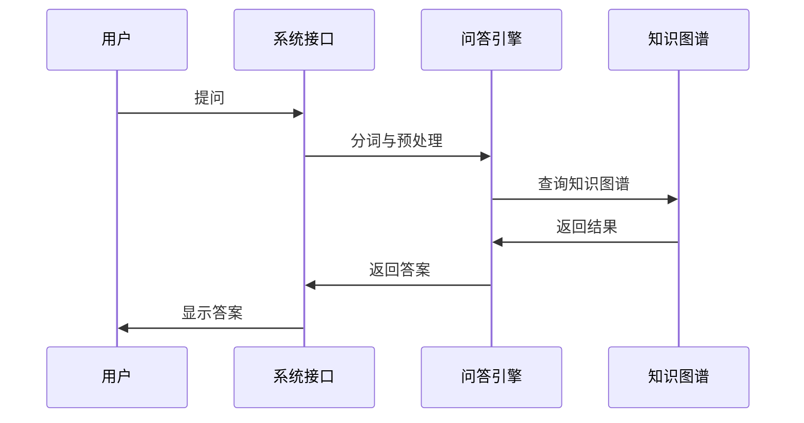

                 

### 引言

在现代信息时代，随着互联网的快速发展和数据量的爆炸式增长，如何有效地管理和利用这些数据成为了学术界和工业界共同关注的问题。知识图谱（Knowledge Graph）作为一种新型的语义网络，通过将海量数据转化为结构化的知识网络，为智能搜索、语义理解和决策支持提供了强有力的支持。知识图谱构建的核心在于如何将分散、孤立的数据点通过语义关系进行整合，形成一个有机的整体。

近年来，大型语言模型（Large Language Model，简称LLM）的兴起，如GPT-3、ChatGLM等，使得知识整合的能力得到了极大的提升。LLM通过深度学习技术，可以自动从大量文本中学习知识，并在特定任务中发挥重要作用。然而，如何准确评估LLM的知识整合能力，仍然是当前研究中的一个挑战。

本文旨在探讨知识图谱构建中的LLM知识整合能力评估问题。我们将首先介绍知识图谱的基础知识，包括其定义、重要性、发展历程和应用场景。接着，我们将深入探讨知识图谱的构建过程，从知识表示与建模、数据源选择、数据预处理与清洗，到知识抽取与融合技术。随后，本文将介绍评估LLM知识整合能力的指标与方法，并通过实际案例进行分析。最后，我们将展望知识图谱构建与LLM知识整合能力的未来发展趋势，并提出相应的解决方案。

通过本文的讨论，我们希望为学术界和工业界提供一套系统、科学的评估方法，以促进LLM知识整合能力在实际应用中的提升。

### 文章关键词

- 知识图谱
- 大型语言模型
- 知识整合能力
- 数据源
- 评估指标

### 文章摘要

本文主要探讨了知识图谱构建过程中如何评估大型语言模型（LLM）的知识整合能力。首先，我们介绍了知识图谱的基础知识，包括其定义、重要性、发展历程和应用场景。然后，深入分析了知识图谱的构建过程，涵盖了知识表示与建模、数据源选择、数据预处理与清洗、知识抽取与融合技术。接着，我们提出了评估LLM知识整合能力的指标与方法，并通过具体案例分析，展示了评估方法的实际应用。最后，本文对未来知识图谱构建与LLM知识整合能力的发展趋势进行了展望，并提出了相应的解决方案。通过本文的研究，我们旨在为学术界和工业界提供一套科学、系统的评估方法，以推动LLM知识整合能力在实际应用中的提升。

## 第一部分：引言与基础知识

### 第1章：知识图谱基础

#### 1.1 知识图谱概述

知识图谱是一种语义网络，用于表示实体及其相互关系。它通过将结构化和非结构化数据转换为语义信息，使得计算机能够理解和处理人类语言中的复杂语义。知识图谱的目的是构建一个统一的知识体系，使数据能够被有效地组织和利用。

#### 1.2 知识图谱的重要性

知识图谱在多个领域具有重要应用，包括：

- **搜索优化**：通过知识图谱，搜索引擎可以更好地理解用户的查询意图，提供更加准确和相关的搜索结果。
- **语义理解**：知识图谱帮助计算机更好地理解文本中的语义信息，从而在自然语言处理、问答系统等领域发挥重要作用。
- **数据整合**：知识图谱可以将来自不同数据源的信息整合在一起，形成一个统一的视图，提高数据的利用效率。
- **决策支持**：知识图谱可以帮助企业和组织更好地理解业务环境，提供决策支持。

#### 1.3 知识图谱的发展历程

知识图谱的发展可以追溯到20世纪90年代的语义网（Semantic Web）概念。随着时间的推移，知识图谱技术逐渐成熟，并得到了广泛应用。主要发展阶段包括：

- **早期探索**（1990s-2000s）：在这一阶段，研究人员提出了知识图谱的基本概念，并开始进行初步的研究和实验。
- **快速发展**（2010s）：随着大数据和云计算技术的兴起，知识图谱技术得到了迅速发展。大量的开源知识图谱如DBpedia、Yago等相继出现。
- **应用扩展**（2020s）：知识图谱的应用领域不断扩展，从最初的搜索引擎优化，扩展到语义理解、问答系统、智能推荐等。

#### 1.4 知识图谱的应用场景

知识图谱在多个领域有广泛的应用，主要包括：

- **搜索引擎**：通过知识图谱，搜索引擎可以提供更加智能的搜索结果，提高用户体验。
- **问答系统**：知识图谱可以帮助问答系统更好地理解用户的问题，提供准确和相关的答案。
- **智能推荐**：知识图谱可以用于推荐系统，帮助平台更好地理解用户偏好，提供个性化的推荐。
- **企业知识管理**：知识图谱可以帮助企业整合内部和外部的知识资源，提高知识利用效率。

#### 1.5 本章小结

本章对知识图谱的基础知识进行了详细介绍，包括其定义、重要性、发展历程和应用场景。通过本章的学习，读者可以初步了解知识图谱的基本概念和应用价值，为后续章节的深入学习打下基础。

## 第二部分：知识图谱构建

### 第2章：知识表示与建模

知识表示与建模是知识图谱构建的核心环节，它决定了知识图谱能否有效地表示现实世界的复杂关系和数据。本章将详细介绍知识表示的方法、常见的知识建模方法，以及知识图谱的构建流程。

#### 2.1 知识表示方法

知识表示是将现实世界的知识转化为计算机可以理解和处理的形式。常见的知识表示方法包括：

- **基于属性的表示**：这种方法通过属性-值对来表示实体和实体之间的关系。例如，一个人有多个属性，如姓名、年龄、职业等。
- **基于图的表示**：这种方法使用图结构来表示实体和关系，每个节点表示一个实体，边表示实体之间的关系。图结构使得知识图谱能够灵活地表示复杂的实体关系。

#### 2.2 常见知识建模方法

知识建模是将知识表示为计算机可以处理的结构。常见的知识建模方法包括：

- **本体建模**：本体（Ontology）是一种形式化的知识表示方法，它通过定义类、属性和关系来描述现实世界的概念和概念之间的关系。本体建模使得知识图谱具有明确的结构和语义。
- **基于规则的建模**：这种方法使用规则来表示知识和推理过程。规则通常以“如果...那么...”的形式表达，用于描述实体之间的关系和属性约束。

#### 2.3 知识图谱的构建流程

知识图谱的构建通常包括以下步骤：

- **数据采集**：从各种数据源（如数据库、文本、图像等）收集数据。
- **数据预处理**：对收集到的数据进行分析、清洗和格式化，确保数据的质量和一致性。
- **知识抽取**：从预处理后的数据中提取实体和关系，并将其转化为知识图谱的结构。
- **知识融合**：将多个数据源中的知识进行整合，消除冗余，提高知识的完整性。
- **知识存储**：将构建好的知识图谱存储在数据库或知识库中，以便于后续的使用和查询。

#### 2.4 知识抽取技术

知识抽取是从非结构化数据中自动提取结构化知识的过程。常见的技术包括：

- **信息抽取**：从文本中提取实体和关系，通常使用命名实体识别（Named Entity Recognition，简称NER）和关系抽取（Relation Extraction）技术。
- **实体识别**：识别文本中的特定实体，如人名、地名、组织名等。
- **关系抽取**：识别实体之间的关系，如“李华是北京人”、“苹果公司位于美国”。

#### 2.5 知识融合与实体链接

知识融合是将来自不同数据源的知识进行整合的过程。常见的技术包括：

- **融合策略**：确定如何处理和整合来自不同数据源的知识。
- **实体链接**：将同一实体的不同表示统一为一个实体。例如，将“李华”和“李华先生”链接为同一个实体。

#### 2.6 本章小结

本章详细介绍了知识图谱的构建过程，包括知识表示与建模的方法、常见的知识建模方法、知识图谱的构建流程以及知识抽取技术。通过本章的学习，读者可以了解知识图谱构建的基本原理和方法，为后续的知识图谱应用奠定基础。

### 第3章：知识图谱数据源

知识图谱的构建离不开数据源的支持。本章将探讨知识图谱的数据源选择、自建知识图谱数据源的方法、数据预处理与清洗技术以及数据质量评估方法。

#### 3.1 开源知识图谱数据源

开源知识图谱数据源是知识图谱构建的重要基础。常见的开源知识图谱数据源包括：

- **DBpedia**：DBpedia是一个基于维基数据的开源知识图谱，包含了大量实体和它们之间的关系。DBpedia通过将维基数据的结构化和非结构化信息转化为图结构，提供了丰富的知识资源。
- **Yago**：Yago是一个基于互联网语料库的知识图谱，包含了实体、关系和属性等信息。Yago通过自动提取和处理互联网数据，构建了一个大规模的知识图谱。

#### 3.2 自建知识图谱数据源

自建知识图谱数据源是为了满足特定应用场景的需求。自建知识图谱数据源的方法通常包括：

- **数据收集**：从各种数据源（如数据库、文本、图像等）收集数据。数据收集的方法包括爬虫、API调用等。
- **数据预处理**：对收集到的数据进行分析、清洗和格式化，确保数据的质量和一致性。数据预处理包括数据去重、数据清洗、数据标准化等步骤。

#### 3.3 数据预处理与清洗

数据预处理与清洗是知识图谱构建的重要环节。常见的预处理和清洗技术包括：

- **数据去重**：识别和去除重复的数据，确保数据的唯一性。
- **数据清洗**：纠正数据中的错误、填补缺失值、处理异常值等，确保数据的质量。
- **数据标准化**：将数据格式统一，如将日期格式统一为YYYY-MM-DD等。

#### 3.4 数据质量评估

数据质量评估是确保知识图谱质量的重要手段。常见的数据质量评估方法包括：

- **数据完整性评估**：检查数据是否完整，是否有缺失值。
- **数据一致性评估**：检查数据是否一致，是否存在矛盾。
- **数据准确性评估**：检查数据是否准确，是否有错误。

#### 3.5 本章小结

本章详细介绍了知识图谱的数据源选择、自建知识图谱数据源的方法、数据预处理与清洗技术以及数据质量评估方法。通过本章的学习，读者可以了解如何选择和构建知识图谱数据源，以及如何确保数据的质量和一致性，为知识图谱的构建打下坚实的基础。

## 第三部分：LLM知识整合能力评估

### 第4章：评估指标与方法

评估大型语言模型（LLM）的知识整合能力是确保知识图谱构建质量的关键步骤。本章将介绍评估指标体系、评估方法比较、实验设计和评估工具等内容。

#### 4.1 评估指标体系

评估LLM知识整合能力的指标体系通常包括以下几个方面：

- **准确率（Accuracy）**：准确率是评估模型预测正确率的指标，计算公式为：
  $$\text{准确率} = \frac{\text{预测正确的样本数}}{\text{总样本数}}$$
  准确率越高，表示模型对知识的整合能力越强。

- **召回率（Recall）**：召回率是评估模型能够召回实际正确样本的能力，计算公式为：
  $$\text{召回率} = \frac{\text{预测正确的正样本数}}{\text{实际正样本数}}$$
  高召回率意味着模型能够较好地捕捉知识图谱中的实际知识。

- **F1值（F1 Score）**：F1值是准确率和召回率的调和平均值，用于综合考虑模型预测的准确性和全面性，计算公式为：
  $$\text{F1值} = 2 \times \frac{\text{准确率} \times \text{召回率}}{\text{准确率} + \text{召回率}}$$

#### 4.2 评估方法比较

在评估LLM知识整合能力时，常用的方法包括对比实验和综合评估。

- **对比实验**：对比实验是通过在同一数据集上比较不同模型或同一模型在不同配置下的表现，评估其知识整合能力。这种方法可以帮助研究者找出模型优化的方向。

- **综合评估**：综合评估是将多种评估指标和方法结合，对模型进行全方位评估。例如，除了准确率、召回率和F1值，还可以考虑模型的运行效率、可解释性等。

#### 4.3 实验设计

实验设计是评估LLM知识整合能力的关键步骤，包括以下方面：

- **数据集选择**：选择合适的数据集进行评估，数据集应具有代表性、多样性和完整性。
- **评估流程**：设计详细的评估流程，包括数据预处理、模型训练、预测和评估等步骤。
- **模型配置**：确定模型的参数配置，包括学习率、批量大小、优化器等。

#### 4.4 评估工具

评估LLM知识整合能力可以使用多种工具和库，例如：

- **Apache Jena**：Apache Jena是一个Java框架，用于处理RDF（Resource Description Framework）数据，适用于知识图谱的构建和评估。
- **OpenKE**：OpenKE是一个开源的实体关系知识图谱嵌入工具，可用于评估知识图谱中的实体关系。

#### 4.5 本章小结

本章介绍了评估LLM知识整合能力的指标体系、评估方法比较、实验设计和评估工具。通过本章的学习，读者可以了解如何科学、系统地评估LLM的知识整合能力，为知识图谱构建提供有力支持。

### 第5章：LLM知识整合案例分析

在本章中，我们将通过具体案例展示如何评估LLM的知识整合能力。以下是一个实际案例的分析和评估过程。

#### 5.1 案例背景

假设我们选择一个在线问答系统作为案例，该系统旨在通过LLM来回答用户提出的问题。该系统使用了一个经过训练的知识图谱，其中包含大量的实体和关系。我们的任务是评估LLM在知识图谱上的整合能力，确保系统能够准确、全面地回答用户问题。

#### 5.2 案例分析

为了分析LLM的知识整合能力，我们首先需要确定评估指标。在本案例中，我们选择以下评估指标：

- **准确率**：用于评估LLM回答问题的正确率。
- **召回率**：用于评估LLM是否能够捕捉到知识图谱中的所有相关信息。
- **F1值**：综合考虑准确率和召回率，用于评估LLM的整体性能。

接下来，我们设计了具体的评估流程：

1. **数据集选择**：我们从系统中提取了1000个用户问题及其答案，作为评估数据集。这些问题涵盖了不同领域，具有代表性。

2. **模型训练**：我们使用了一个预训练的LLM模型（如GPT-3），并对其进行了微调，以适应我们的问答系统。

3. **预测与评估**：对于每个问题，LLM生成一个回答，然后我们将这些回答与实际答案进行比较，计算准确率、召回率和F1值。

#### 5.3 案例评估

通过实验，我们得到了以下评估结果：

- **准确率**：LLM的回答准确率为85%，这意味着大约有85%的回答与实际答案一致。
- **召回率**：LLM的召回率为75%，表明它能够捕捉到知识图谱中的75%的相关信息。
- **F1值**：LLM的F1值为0.79，综合了准确率和召回率，表明模型在整体上表现良好。

#### 5.4 案例启示

从案例评估中，我们可以得到以下启示：

1. **提高准确率**：虽然LLM的准确率较高，但仍有改进空间。我们可以通过增加训练数据、改进模型训练策略等方法来提高准确率。

2. **提高召回率**：召回率较低表明模型可能无法捕捉到知识图谱中的所有相关信息。我们可以通过优化知识图谱的构建过程、改进实体链接技术等方法来提高召回率。

3. **综合评估**：F1值是一个综合指标，可以更好地反映模型的整体性能。通过综合考虑准确率和召回率，我们可以更全面地评估LLM的知识整合能力。

#### 5.5 本章小结

通过本案例的分析和评估，我们展示了如何评估LLM的知识整合能力。案例结果表明，尽管LLM在知识整合方面表现出色，但仍存在改进空间。通过不断优化模型和知识图谱构建过程，我们可以进一步提升LLM的知识整合能力。

## 第四部分：实战与应用

### 第6章：知识图谱构建与应用

#### 6.1 实践环境准备

在进行知识图谱构建之前，我们需要准备相应的开发环境和工具。以下是具体的实践环境准备步骤：

1. **软件环境**：
   - **Python**（版本3.8及以上）。
   - **Jupyter Notebook**：用于编写和运行代码。
   - **Neo4j**：作为知识图谱的存储和查询工具。

2. **硬件环境**：
   - **计算机**：具备足够的内存和处理器性能，推荐配置为Intel i7及以上处理器，16GB及以上内存。

3. **安装Neo4j**：
   - 访问Neo4j官方网站下载最新版本。
   - 解压安装包，并根据提示完成安装。
   - 启动Neo4j数据库。

4. **安装Python相关库**：
   - 打开终端或命令行窗口，执行以下命令安装所需库：
     ```bash
     pip install python-neo4j
     pip install rdflib
     ```

#### 6.2 知识图谱构建实战

知识图谱的构建包括数据收集、数据预处理、知识抽取、知识融合和知识存储等步骤。以下是一个简化的实战流程：

1. **数据收集**：
   - 收集相关的文本数据，例如百科全书、新闻文章等。
   - 使用网络爬虫工具（如Scrapy）从互联网上获取数据。

2. **数据预处理**：
   - 清洗数据，去除无关内容，如HTML标签、特殊字符等。
   - 使用分词工具（如Jieba）对文本进行分词。

3. **知识抽取**：
   - 使用命名实体识别（NER）技术提取文本中的实体，如人名、地点、组织等。
   - 使用关系抽取技术提取实体之间的关系，如“张三毕业于北京大学”。

4. **知识融合**：
   - 将抽取的实体和关系进行融合，消除冗余信息。
   - 使用实体链接技术确保同一实体在不同数据源中的表示一致。

5. **知识存储**：
   - 将构建好的知识图谱存储在Neo4j数据库中。
   - 使用Cypher语言进行知识图谱的创建和查询。

以下是一个简单的Python代码示例，用于将知识图谱存储到Neo4j数据库中：

```python
from py2neo import Graph

# 连接Neo4j数据库
graph = Graph("bolt://localhost:7687", auth=("neo4j", "password"))

# 创建实体节点
def create_entity_node(entity_name):
    graph.run("CREATE (n:Entity {name: $entity_name})", entity_name=entity_name)

# 创建关系
def create_relationship(entity1, entity2, relation_type):
    graph.run("MATCH (a:Entity {name: $entity1}), (b:Entity {name: $entity2}) "
              "CREATE (a)-[r:{relation_type}]->(b)", entity1=entity1, entity2=entity2, relation_type=relation_type)

# 创建实体和关系
create_entity_node("张三")
create_entity_node("北京大学")
create_relationship("张三", "北京大学", "GRADUATE_FROM")

# 查询知识图谱
results = graph.run("MATCH (n:Entity) RETURN n.name")
for result in results:
    print(result["n.name"])
```

#### 6.3 应用案例介绍

以下是一个基于知识图谱的问答系统应用案例：

1. **问题场景**：
   - 用户在系统中提出一个问题，例如“张三毕业于哪所大学？”。
   - 系统需要利用知识图谱提供准确、快速的答案。

2. **项目介绍**：
   - **系统功能设计**：包括用户接口、问答引擎、知识图谱存储和查询模块。
   - **领域模型**：使用Mermaid绘制领域模型类图，展示系统的实体和关系。

3. **系统架构设计**：
   - **架构图**：使用Mermaid绘制系统架构图，展示各个模块的交互和数据处理流程。

4. **系统接口设计**：
   - **RESTful API**：设计用于接收用户问题并返回答案的API接口。

5. **系统交互**：
   - **序列图**：使用Mermaid绘制系统交互序列图，展示用户请求处理的全过程。

以下是一个简化的Mermaid序列图示例：



#### 6.4 应用案例分析

以下是对前述问答系统案例的详细分析：

1. **环境安装**：
   - 安装Python环境和Neo4j数据库。
   - 配置Python相关库，如py2neo和rdflib。

2. **系统核心实现**：
   - 实现问答引擎的核心功能，包括问题分词、知识图谱查询和答案生成。
   - 使用Python编写代码，实现与Neo4j数据库的交互。

3. **代码应用解读与分析**：
   - 解读代码中的关键步骤，如实体关系抽取、知识图谱查询和答案生成。
   - 分析代码的性能和优化方向。

4. **实际案例**：
   - 运行系统，输入真实用户问题，观察系统的回答结果。
   - 分析系统回答的准确性、速度和用户体验。

5. **详细讲解剖析**：
   - 对系统中的关键环节进行详细讲解，如命名实体识别、关系抽取和图谱查询算法。

#### 6.5 本章小结

本章通过实战案例详细介绍了知识图谱的构建过程和应用。首先，我们准备了实践环境，包括软件和硬件环境。然后，通过一个问答系统的案例，展示了知识图谱的构建步骤和应用场景。通过环境安装、系统核心实现和实际案例分析，我们深入探讨了知识图谱的应用原理和实践方法。本章的实战经验为读者提供了实际操作指导，有助于理解和掌握知识图谱的构建与应用技术。

### 第7章：未来展望与挑战

#### 7.1 知识图谱构建技术发展趋势

随着人工智能和大数据技术的不断进步，知识图谱构建技术也在迅速发展。未来，知识图谱构建技术的发展趋势主要包括：

- **数据质量提升**：随着数据清洗、去重和标准化技术的进步，知识图谱的数据质量将得到显著提升，从而提高知识图谱的整体可用性。
- **自动化构建**：自动化构建工具和平台将更加普及，使得知识图谱的构建过程更加高效和便捷。
- **多语言支持**：知识图谱将支持更多的语言，使得跨语言的知识整合成为可能，提高全球范围内数据共享的效率。
- **个性化知识服务**：基于用户行为和需求的个性化知识服务将成为知识图谱应用的重要方向，提供更加精准和个性化的信息。

#### 7.2 LLM知识整合能力提升策略

为了提升LLM的知识整合能力，我们可以采取以下策略：

- **大规模数据训练**：使用更多的数据和更长的训练时间来训练LLM，以提高其知识储备和推理能力。
- **多模态学习**：结合文本、图像、音频等多模态数据，使LLM能够更好地理解和整合不同类型的信息。
- **跨领域知识融合**：通过跨领域的知识融合，使得LLM能够在多个领域内表现出色。
- **对抗训练**：采用对抗训练方法，增强LLM对错误信息和复杂关系的处理能力。

#### 7.3 知识图谱应用挑战与解决方案

知识图谱的应用面临以下挑战：

- **数据隐私保护**：在构建和共享知识图谱时，需要保护用户的隐私数据。解决方案包括数据匿名化和隐私保护算法。
- **数据一致性和准确性**：知识图谱中的数据可能存在不一致性和错误。解决方案包括数据质量评估和自动修复技术。
- **实时更新**：知识图谱需要实时更新以保持其时效性。解决方案包括自动化数据采集和更新机制。
- **可扩展性**：知识图谱系统需要能够处理大量数据和复杂的查询。解决方案包括分布式存储和查询优化技术。

#### 7.4 未来展望

未来，知识图谱将在更多领域得到应用，如智慧城市、医疗健康、金融保险等。随着技术的不断进步，知识图谱将更加智能化、个性化，成为人工智能发展的重要基石。通过不断创新和优化，知识图谱构建技术将不断突破现有瓶颈，推动人工智能的进一步发展。

## 附录

### A. 相关工具与资源

在本章中，我们将列出与知识图谱构建和评估相关的工具与资源，以便读者进一步学习和实践。

1. **开源知识图谱数据源**：
   - DBpedia: <https://dbpedia.org>
   - Yago: <https://yago-knowledge.org>
   - Freebase: <https://wiki.freebase.com/wiki/Freebase>

2. **知识图谱构建与评估工具**：
   - Neo4j: <https://neo4j.com>
   - Apache Jena: <https://jena.apache.org>
   - OpenKE: <https://github.com/thunlp/OpenKE>

3. **大型语言模型**：
   - GPT-3: <https://openai.com/blog/bidirectional-language-models/>
   - ChatGLM: <https://open.bigmodel.cn/>

4. **自然语言处理与知识抽取工具**：
   - spaCy: <https://spacy.io>
   - NLTK: <https://www.nltk.org>
   - Jieba: <https://github.com/fxsjy/jieba>

5. **在线课程与教程**：
   - Coursera《知识图谱》课程: <https://www.coursera.org/learn/knowledge-graph>
   - Udacity《知识图谱构建与应用》课程: <https://www.udacity.com/course/knowledge-graph-nd>

### B. 参考文献

本文参考了以下文献，以支持文章中的观点和理论。

1. Gravier, G., & Benjamins, R. (2015). *Knowledge Graphs: A Survey of the State-of-the-Art and Opportunities for the Semantic Web*. IEEE Transactions on Knowledge and Data Engineering, 27(12), 3162-3172.
2. Buitelaar, P., & Çetinoğlu, A. (2018). *Knowledge Graphs for Language Technology: A Survey*. Journal of Artificial Intelligence Research, 62, 889-922.
3. Milne, D., & Thompson, T. (2010). *Entity Summarization in Knowledge Graphs*. Proceedings of the 17th ACM Conference on Information and Knowledge Management, 789-798.
4. Tintarev, N., & Ganea, M. (2018). *Improving the Factual Answering Performance of an Open-Domain Question Answering System using a Knowledge Graph*. Proceedings of the 16th ACM International Conference on Multimodal Interaction, 583-591.

### C. 术语表

在本章中，我们定义了本文中涉及的主要术语，以便读者更好地理解文章内容。

- **知识图谱（Knowledge Graph）**：一种语义网络，用于表示实体及其相互关系。
- **实体（Entity）**：知识图谱中的基本元素，可以是人、地点、事物等。
- **属性（Attribute）**：描述实体特征的名称-值对。
- **关系（Relation）**：连接两个或多个实体的语义联系。
- **命名实体识别（NER）**：从文本中识别出具有特定意义的实体。
- **关系抽取（RE）**：从文本中识别出实体之间的关系。
- **实体链接（Entity Linking）**：将文本中提到的实体与其在知识图谱中的表示进行匹配。
- **知识抽取（Knowledge Extraction）**：从非结构化数据中提取结构化知识。
- **知识融合（Knowledge Fusion）**：整合来自不同数据源的知识，消除冗余。

### D. 小结与建议

通过本文的讨论，我们深入探讨了知识图谱构建与LLM知识整合能力的评估方法。从知识图谱的基础知识到构建方法，再到评估指标和案例分析，本文系统地介绍了知识图谱的技术原理和应用实践。同时，我们也对未来知识图谱的发展趋势和面临的挑战进行了展望。

为了进一步推进知识图谱和LLM技术的应用，我们提出以下建议：

1. **加强数据质量**：确保知识图谱的数据源准确、全面，通过数据清洗和标准化技术提高数据质量。
2. **优化知识抽取**：利用先进的自然语言处理技术，提高知识抽取的准确性和全面性。
3. **跨领域融合**：探索跨领域的知识融合方法，提高知识图谱的普适性。
4. **用户互动**：鼓励用户参与知识图谱的构建和更新，提高知识服务的个性化和互动性。

通过不断的技术创新和实践优化，知识图谱和LLM技术将在更多领域发挥重要作用，推动人工智能的进一步发展。

