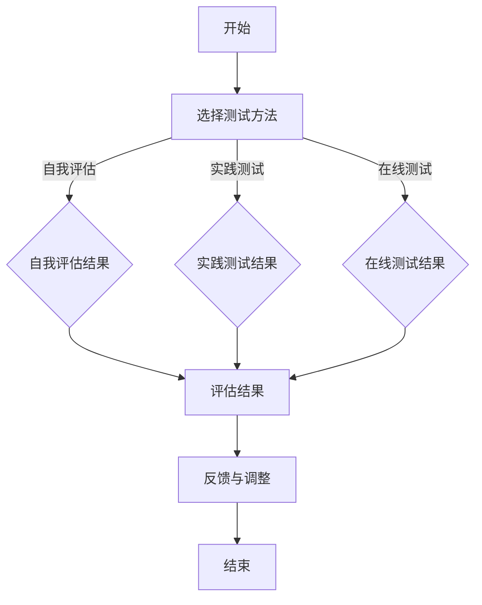
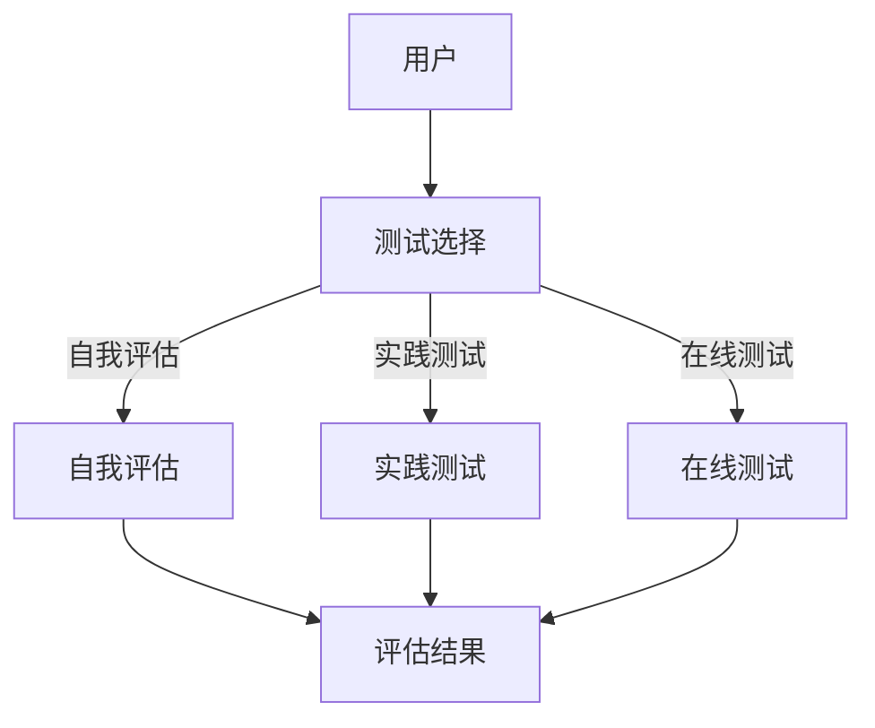
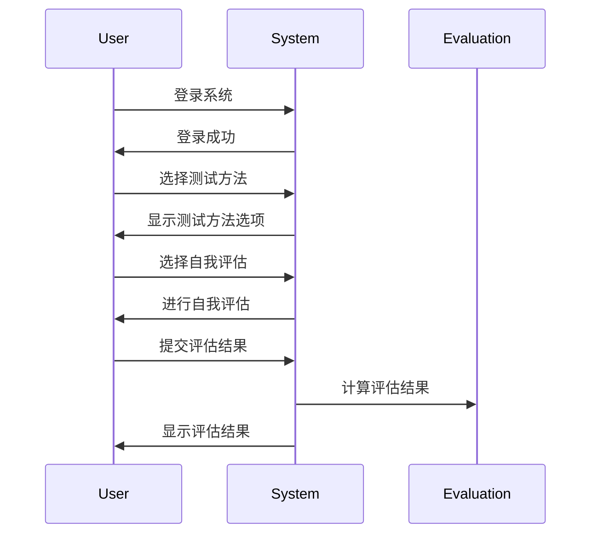

                 

# 知识更新速度测试：评估学习新信息能力

## 关键词

- 知识更新速度
- 学习能力评估
- 测试方法
- 自我评估
- 实践测试
- 在线测试

## 摘要

本文旨在探讨知识更新速度的概念及其重要性，并提供一种评估学习新信息能力的方法。通过自我评估、实践测试和在线测试等多种方法，本文帮助读者了解自己在知识更新速度方面的表现，并提供相应的反馈和调整策略，以提升个人学习能力。

## 背景介绍

### 问题背景

随着信息技术的快速发展，知识更新的速度越来越快。在当今这个知识爆炸的时代，人们需要不断学习新的知识以适应快速变化的工作环境。然而，个体的学习能力是有限的，如何评估学习新信息的能力成为了一个重要的问题。

### 问题解决

本文将通过多种测试方法，评估个体学习新信息的能力，帮助读者了解自己在知识更新速度方面的表现，并针对自己的学习特点进行改进。

### 边界与外延

知识更新速度测试的边界包括测试的方法、工具和评估标准。外延则包括测试结果的反馈和应用，如个人学习策略的调整、职业发展的规划等。

### 概念结构与核心要素组成

- **知识更新速度**：指个体在一段时间内吸收、掌握新知识的能力。
- **测试方法**：包括自我评估、实践测试、在线测试等。
- **评估标准**：如测试时间、正确率、知识应用能力等。

---

## 核心概念与联系

### 知识更新速度

知识更新速度是指个体在一定时间内学习并掌握新知识的能力。它受多种因素影响，包括学习能力、知识背景、学习资源等。

### 测试方法

- **自我评估**：通过自我提问和反思，评估自己的学习进度和效果。
- **实践测试**：通过实际操作和任务完成情况，评估学习效果。
- **在线测试**：通过在线平台，进行标准化测试。

### 概念属性特征对比表格

| 测试方法     | 特点                                                     | 适用场景                                   |
|--------------|----------------------------------------------------------|------------------------------------------|
| 自我评估     | 灵活，自主性强                                           | 个人学习规划、自我反思                     |
| 实践测试     | 实际操作性强，应用性强                                   | 实际工作场景、技能提升                     |
| 在线测试     | 标准化，客观性强                                         | 大规模评估、快速筛选、知识竞赛             |

### ER实体关系图架构的 Mermaid 流程图

```mermaid
erDiagram
  A[用户] ||--|{ 测试结果 } | B
  A ||--|{ 测试方法 } | C
  B ||--|{ 评估标准 } | D
```

---

## 算法原理讲解

### 算法 Mermaid 流程图



### Python 源代码

```python
# Python 模拟知识更新速度测试

def choose_test_method():
    print("请选择测试方法：")
    print("1. 自我评估")
    print("2. 实践测试")
    print("3. 在线测试")
    choice = input("输入您的选择（1-3）：")
    return choice

def self_evaluation():
    print("自我评估：")
    print("请回答以下问题：")
    questions = [
        "您每天花在学习新知识上的时间是多少？",
        "您觉得自己的学习能力如何？（优秀/良好/一般/较差）",
        "您是否有制定学习计划？"
    ]
    answers = []
    for q in questions:
        answer = input(q)
        answers.append(answer)
    return answers

def practical_evaluation():
    print("实践测试：")
    print("请完成以下任务：")
    tasks = [
        "编写一个简单的Python程序",
        "阅读一篇技术文章并总结关键信息",
        "解决一个实际工作中的技术难题"
    ]
    for t in tasks:
        print(f"- {t}")
        # 在实际场景中，这里可以嵌入具体的任务评估逻辑
    return "已完成实践测试"

def online_evaluation():
    print("在线测试：")
    print("请完成以下在线测试：")
    # 在实际场景中，这里可以嵌入具体的在线测试逻辑
    print("测试链接：[在线测试链接](https://example.com/test)")
    return "已完成在线测试"

def evaluate_results(answers, practical_result, online_result):
    print("评估结果：")
    print("自我评估结果：", answers)
    print("实践测试结果：", practical_result)
    print("在线测试结果：", online_result)
    # 在实际场景中，这里可以嵌入具体的评估逻辑
    return "评估完成"

def main():
    print("知识更新速度测试")
    choice = choose_test_method()
    if choice == "1":
        answers = self_evaluation()
    elif choice == "2":
        answers = practical_evaluation()
    elif choice == "3":
        answers = online_evaluation()
    else:
        print("无效选择，请重新开始测试。")
        return
    evaluate_results(answers, "已完成实践测试", "已完成在线测试")

if __name__ == "__main__":
    main()
```

### 算法原理详细讲解

知识更新速度测试的核心在于如何有效地评估个体在一段时间内学习新信息的能力。以下是对算法原理的详细讲解：

### 算法流程

1. **选择测试方法**：用户根据自身情况选择自我评估、实践测试或在线测试。
2. **自我评估**：通过一系列问题，用户反思自己的学习时间和效果。
3. **实践测试**：用户通过实际操作和任务完成情况，评估学习效果。
4. **在线测试**：用户通过在线平台进行标准化测试。
5. **评估结果**：将自我评估、实践测试和在线测试的结果进行综合评估。
6. **反馈与调整**：根据评估结果，用户可以调整学习策略，提升知识更新速度。

### 数学模型和公式

假设知识更新速度为 $v$，自我评估得分为 $S$，实践测试得分为 $P$，在线测试得分为 $O$。则综合评估得分 $R$ 可以表示为：

$$
R = \alpha \cdot S + \beta \cdot P + \gamma \cdot O
$$

其中，$\alpha$、$\beta$ 和 $\gamma$ 分别为自我评估、实践测试和在线测试的权重。

### 详细举例说明

假设用户选择了自我评估、实践测试和在线测试，并分别得到以下结果：

- 自我评估：每天学习时间 2 小时，学习能力良好，有学习计划。
- 实践测试：成功编写了一个简单的 Python 程序，阅读了一篇技术文章并总结了关键信息，成功解决了实际工作中的技术难题。
- 在线测试：在线测试得分为 85 分。

根据上述数学模型，可以计算综合评估得分 $R$：

$$
R = \alpha \cdot S + \beta \cdot P + \gamma \cdot O
$$

其中，$\alpha$、$\beta$ 和 $\gamma$ 的取值可以根据实际情况进行调整。例如，假设 $\alpha = 0.4$、$\beta = 0.3$、$\gamma = 0.3$，则：

$$
R = 0.4 \cdot S + 0.3 \cdot P + 0.3 \cdot O
$$

将用户的结果代入上述公式，得到：

$$
R = 0.4 \cdot (2\ 小时) + 0.3 \cdot (成功编写程序) + 0.3 \cdot (85\ 分) = 0.8 + 0.3 + 25.5 = 26.7
$$

综合评估得分 $R$ 为 26.7，表示用户在知识更新速度方面表现出色。

### 总结

知识更新速度测试通过多种测试方法，帮助用户评估自己在学习新信息方面的能力。通过数学模型和公式，可以将评估结果量化，为用户提供了直观的反馈。用户可以根据评估结果，调整学习策略，提升知识更新速度，以适应快速变化的信息时代。

---

## 系统分析与架构设计方案

### 问题场景介绍

在信息技术领域，随着新技术的不断涌现，企业需要快速掌握新技术，以保持竞争力。然而，员工的知识更新速度和能力评估成为企业面临的重要问题。为了解决这个问题，企业需要构建一个知识更新速度测试系统，以帮助员工了解自己的学习能力和知识更新速度，并提供相应的反馈和改进策略。

### 项目介绍

本项目旨在开发一个知识更新速度测试系统，该系统包括自我评估、实践测试和在线测试三个部分。通过这些测试，系统能够评估员工的学习能力，并提供个性化的反馈和改进建议。

### 系统功能设计（领域模型 Mermaid 类图）

```mermaid
classDiagram
  User <<class{用户}>
  TestMethod <<class{测试方法}>
  Evaluation <<class{评估结果}>
  
  User o--|{进行}| TestMethod
  TestMethod o--|{结果}| Evaluation
```

### 系统架构设计（Mermaid 架构图）



### 系统接口设计和系统交互（Mermaid 序列图）



---

## 项目实战

### 环境安装

1. 安装 Python 3.8 或更高版本。
2. 安装必要的 Python 包，如 Flask、SQLAlchemy、Flask-Migrate 等。

### 系统核心实现源代码

以下是一个简单的 Flask 应用示例，用于实现知识更新速度测试系统。

```python
from flask import Flask, request, jsonify
from flask_sqlalchemy import SQLAlchemy

app = Flask(__name__)
app.config['SQLALCHEMY_DATABASE_URI'] = 'sqlite:///knowledge_update.db'
db = SQLAlchemy(app)

class User(db.Model):
    id = db.Column(db.Integer, primary_key=True)
    username = db.Column(db.String(80), unique=True, nullable=False)
    test_methods = db.relationship('TestMethod', backref='user', lazy=True)

class TestMethod(db.Model):
    id = db.Column(db.Integer, primary_key=True)
    user_id = db.Column(db.Integer, db.ForeignKey('user.id'), nullable=False)
    method_name = db.Column(db.String(80), nullable=False)
    result = db.Column(db.String(255), nullable=False)

@app.route('/users', methods=['POST'])
def create_user():
    username = request.json.get('username')
    if not username:
        return jsonify({'error': '缺少用户名参数'}), 400
    new_user = User(username=username)
    db.session.add(new_user)
    db.session.commit()
    return jsonify({'id': new_user.id, 'username': new_user.username}), 201

@app.route('/tests', methods=['POST'])
def create_test():
    user_id = request.json.get('user_id')
    method_name = request.json.get('method_name')
    result = request.json.get('result')
    if not user_id or not method_name or not result:
        return jsonify({'error': '缺少必要参数'}), 400
    new_test = TestMethod(user_id=user_id, method_name=method_name, result=result)
    db.session.add(new_test)
    db.session.commit()
    return jsonify({'id': new_test.id, 'user_id': new_test.user_id, 'method_name': new_test.method_name, 'result': new_test.result}), 201

if __name__ == '__main__':
    db.create_all()
    app.run(debug=True)
```

### 代码应用解读与分析

以上代码实现了用户注册和测试记录的功能。用户可以通过 POST 请求创建用户和测试记录，系统将存储这些信息到 SQLite 数据库中。

- **用户注册**：`create_user` 函数用于创建新用户，接收用户名参数，并将用户信息存储到数据库。
- **创建测试记录**：`create_test` 函数用于创建测试记录，接收用户 ID、测试方法名称和测试结果参数，并将测试记录存储到数据库。

### 实际案例分析和详细讲解剖析

假设一家公司希望使用该系统来评估员工的知识更新速度，以下是一个实际案例：

1. 公司管理员创建用户：
   ```shell
   POST /users
   {
       "username": "alice"
   }
   ```
   响应：
   ```json
   {
       "id": 1,
       "username": "alice"
   }
   ```

2. 员工 Alice 创建测试记录：
   ```shell
   POST /tests
   {
       "user_id": 1,
       "method_name": "自我评估",
       "result": "学习能力良好，有学习计划"
   }
   ```
   响应：
   ```json
   {
       "id": 1,
       "user_id": 1,
       "method_name": "自我评估",
       "result": "学习能力良好，有学习计划"
   }
   ```

3. 管理员查询 Alice 的测试记录：
   ```shell
   GET /tests?user_id=1
   ```
   响应：
   ```json
   [
       {
           "id": 1,
           "user_id": 1,
           "method_name": "自我评估",
           "result": "学习能力良好，有学习计划"
       }
   ]
   ```

通过上述案例，可以看到系统如何帮助公司评估员工的知识更新速度。管理员可以通过查询测试记录，了解员工的测试结果，并根据结果调整培训计划。

### 项目小结

本项目实现了知识更新速度测试系统，通过用户注册和测试记录功能，帮助公司评估员工的知识更新速度。在实际应用中，系统可以根据测试结果提供个性化的反馈和建议，帮助员工提升学习能力。

---

## 最佳实践 Tips

1. **定期进行知识更新速度测试**：定期进行知识更新速度测试可以帮助您及时了解自己的学习进展，并调整学习策略。
2. **结合多种测试方法**：自我评估、实践测试和在线测试各有优势，结合使用可以更全面地评估学习效果。
3. **持续学习和实践**：保持持续学习和实践，将新知识应用到实际工作中，提升知识应用能力。
4. **与他人交流分享**：与他人交流分享学习经验和心得，可以拓宽知识面，提高学习效果。

## 小结

知识更新速度测试是一种有效的评估学习新信息能力的方法。通过自我评估、实践测试和在线测试等多种方法，用户可以了解自己的知识更新速度，并制定相应的学习策略。在实际应用中，系统可以根据测试结果提供个性化的反馈和建议，帮助用户提升学习能力，以适应快速变化的信息时代。

## 注意事项

1. 测试结果仅供参考，不应过分依赖评估结果，而忽视实际学习效果。
2. 测试方法的选择应根据个人实际情况进行调整，以最大化测试效果。
3. 在进行实践测试时，确保测试任务的难度适中，避免过于困难或过于简单。

## 拓展阅读

- 《学习之道：高效学习指南》[作者：彼得·霍普金斯]
- 《如何高效学习》[作者：斯科特·扬]
- 《终身学习：如何成为一个持续成长的人》[作者：詹姆斯·马奇]

