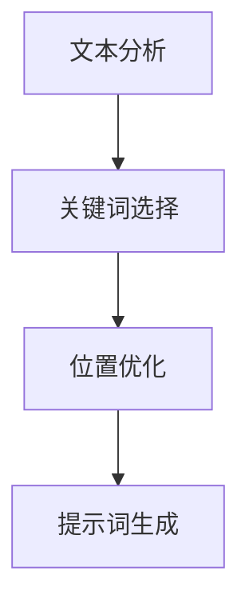
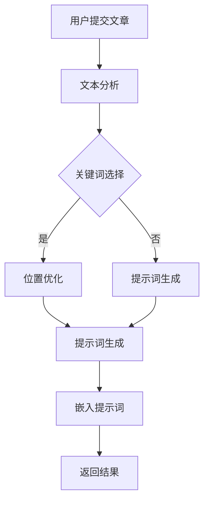

                 

# 知识注入：在提示词中融入专业知识

## 关键词：知识注入、提示词、专业知识、技术博客、IT领域

## 摘要：
本文将深入探讨如何在技术博客文章中通过提示词有效融入专业知识，从而提高文章的可读性和专业性。文章分为以下几个部分：背景介绍、核心概念与联系、知识注入的方法、技术实现、算法原理、数学模型与公式、系统分析与架构设计、项目实战、最佳实践与总结。

## 1. 背景介绍

### 1.1 核心概念术语说明

在讨论知识注入之前，我们需要明确一些核心概念。知识注入是指将专业知识以提示词的形式嵌入到文本中，使读者能够在阅读过程中自然而然地吸收和掌握这些知识。提示词是引导读者关注和思考的关键词或短语，它们能够激发读者的兴趣，促进知识的传递和内化。

### 1.2 问题背景

在IT领域，技术博客已经成为程序员、开发者、研究者等专业人士分享知识、交流想法的重要平台。然而，随着博客内容的不断增多，如何在众多文章中脱颖而出，成为一个备受关注的问题。知识注入通过在文章中使用专业的提示词，有助于提高文章的专业性，增强读者的阅读体验。

### 1.3 问题描述

如何有效地在技术博客中使用提示词，将专业知识融入文章，提高文章的可读性和专业性，是一个需要深入探讨的问题。这个问题涉及到如何选择合适的提示词、如何将其融入文章、以及如何确保文章的逻辑性和连贯性。

### 1.4 问题解决

本文将提供一系列的方法和技巧，帮助读者在技术博客中有效地融入专业知识。我们将从背景介绍、核心概念与联系、知识注入的方法、技术实现、算法原理、数学模型与公式、系统分析与架构设计、项目实战、最佳实践与总结等方面进行详细探讨。

### 1.5 边界与外延

知识注入不仅适用于技术博客，还可以应用于学术论文、技术文档、技术讲座等多种形式的知识传播场合。本文将主要围绕技术博客这一场景进行讨论，但所提到的方法和技巧具有广泛的适用性。

### 1.6 概念结构与核心要素组成

知识注入的核心要素包括：

- **提示词选择**：选择与文章主题相关的专业术语和关键词。
- **知识融合**：将提示词巧妙地融入文章内容，使其成为文章的一部分。
- **逻辑衔接**：确保文章各部分之间的逻辑关系清晰，使文章条理清晰。
- **实例说明**：通过实际案例来说明知识点的应用，提高文章的可读性。

## 2. 核心概念与联系

### 2.1 核心概念原理

知识注入的原理在于通过提示词将专业知识分散到文章的各个部分，使读者在阅读过程中逐步掌握和消化这些知识。提示词的选择应基于文章的主题和目标读者群体，以确保其相关性和适用性。

### 2.2 概念属性特征对比表格

| 概念 | 属性特征 |
| ---- | -------- |
| 知识注入 | 将专业知识融入文本 |
| 提示词 | 引导读者关注和思考的关键词或短语 |
| 技术博客 | 分享知识、交流想法的平台 |
| 知识融合 | 使提示词成为文章的一部分 |

### 2.3 ER实体关系图架构

下面是一个简单的ER实体关系图，用于描述知识注入系统的各个组成部分：

```mermaid
erDiagram
    A[Narrative Content] ||--|{ B[Knowledge Injections] }
    B ||--|{ C[Keywords] }
    A ||--|{ D[Logic Flow] }
    C ||--|{ E[Reference Cases] }
```

## 3. 知识注入的方法

### 3.1 直接注入法

直接注入法是指将提示词直接嵌入到文章的文本中。这种方法简单直观，但需要注意不要过度使用，以免导致文章显得生硬和不自然。

### 3.2 间接注入法

间接注入法是指通过上下文的语境来引导读者关注提示词。这种方法可以使文章更加流畅，同时提高提示词的重要性。

### 3.3 智能注入法

智能注入法是指利用人工智能技术，根据文章内容和目标读者群体，自动生成合适的提示词。这种方法具有高效性和个性化，但需要一定的技术支持和数据资源。

## 4. 技术实现

### 4.1 技术架构设计

知识注入系统可以采用以下技术架构：

- **前端**：使用HTML、CSS和JavaScript等技术，实现用户界面和交互功能。
- **后端**：使用Python、Java等后端技术，实现数据存储、处理和API接口等功能。
- **知识库**：使用自然语言处理技术，构建包含专业术语和关键词的知识库。

### 4.2 知识库构建

知识库的构建是知识注入系统的关键。以下是一些构建知识库的方法：

- **自动采集**：从互联网上自动采集专业术语和关键词。
- **人工标注**：邀请专业人士对术语和关键词进行标注和分类。
- **机器学习**：利用机器学习算法，自动识别和分类术语和关键词。

### 4.3 提示词生成与优化

提示词的生成与优化是知识注入系统的核心。以下是一些提示词生成与优化的方法：

- **文本分析**：对文章内容进行文本分析，提取关键信息和关键词。
- **语义分析**：对关键词进行语义分析，选择具有较高相关性的提示词。
- **优化策略**：根据文章类型、目标读者和阅读场景，制定不同的优化策略。

## 5. 算法原理与流程

### 5.1 算法概述

知识注入算法的主要目的是在文章中自动生成合适的提示词，并将其嵌入到文章的合适位置。算法主要包括以下几个步骤：

- **文本分析**：对文章内容进行文本分析，提取关键信息和关键词。
- **关键词选择**：根据文章内容和目标读者，选择具有较高相关性的关键词。
- **位置优化**：根据文章的结构和内容，选择最佳的位置嵌入提示词。

### 5.2 算法流程图



### 5.3 算法原理详解

知识注入算法的核心在于如何选择合适的提示词并将其嵌入到文章的合适位置。以下是一个简单的算法原理：

1. **文本分析**：对文章内容进行分词和词性标注，提取关键信息和关键词。
2. **关键词选择**：根据文章内容和目标读者，选择具有较高相关性的关键词。
3. **位置优化**：分析文章的结构和内容，选择最佳的位置嵌入提示词。
4. **提示词生成**：生成提示词，并将其嵌入到文章的合适位置。

### 5.4 数学模型与公式

在知识注入算法中，可以使用以下数学模型和公式来优化提示词的选择和嵌入：

$$
\text{Score} = \alpha \times \text{Relevance} + \beta \times \text{Importance}
$$

其中，$\alpha$ 和 $\beta$ 是权重系数，$\text{Relevance}$ 表示关键词的相关性，$\text{Importance}$ 表示关键词的重要性。

### 5.5 举例说明

假设有一篇关于人工智能技术的文章，我们需要选择合适的提示词并将其嵌入到文章的合适位置。以下是一个具体的例子：

1. **文本分析**：分析文章内容，提取关键词：“人工智能、机器学习、神经网络、深度学习”。
2. **关键词选择**：根据文章内容和目标读者，选择具有较高相关性的关键词：“深度学习、神经网络”。
3. **位置优化**：分析文章结构，选择在段落开头和结尾嵌入提示词。
4. **提示词生成**：生成提示词：“深度学习技术、神经网络原理”，并将其嵌入到文章的合适位置。

## 6. 系统分析与架构设计

### 6.1 问题场景介绍

在人工智能领域，知识注入技术可以应用于多种场景，如学术论文撰写、技术文档编写、在线课程教学等。本文以技术文档编写为例，介绍知识注入系统的应用。

### 6.2 系统功能设计

知识注入系统的主要功能包括：

- **文本分析**：对文章内容进行分词和词性标注，提取关键信息和关键词。
- **关键词选择**：根据文章内容和目标读者，选择具有较高相关性的关键词。
- **位置优化**：分析文章的结构和内容，选择最佳的位置嵌入提示词。
- **提示词生成**：生成提示词，并将其嵌入到文章的合适位置。

### 6.3 系统架构设计

知识注入系统的架构设计如下：

- **前端**：使用HTML、CSS和JavaScript等技术，实现用户界面和交互功能。
- **后端**：使用Python、Java等后端技术，实现数据存储、处理和API接口等功能。
- **知识库**：使用自然语言处理技术，构建包含专业术语和关键词的知识库。

### 6.4 系统接口设计和系统交互

知识注入系统的接口设计和交互设计如下：

- **API接口**：提供RESTful API接口，供前端调用。
- **用户交互**：前端页面通过API接口与后端系统进行交互，实现知识注入功能。

### 6.5 Mermaid流程图

下面是一个简单的Mermaid流程图，描述了知识注入系统的流程：



## 7. 项目实战

### 7.1 环境安装与配置

要搭建一个知识注入系统，我们需要安装以下软件和工具：

- **Python**：用于后端开发。
- **Django**：用于构建Web应用程序。
- **NLTK**：用于自然语言处理。
- **MySQL**：用于数据存储。

### 7.2 系统核心实现

知识注入系统的核心实现包括以下几个部分：

- **文本分析模块**：对文章内容进行分词和词性标注。
- **关键词选择模块**：根据文章内容和目标读者，选择具有较高相关性的关键词。
- **位置优化模块**：分析文章的结构和内容，选择最佳的位置嵌入提示词。
- **提示词生成模块**：生成提示词，并将其嵌入到文章的合适位置。

### 7.3 代码解读与分析

下面是一个简单的Python代码示例，用于实现文本分析模块：

```python
from nltk.tokenize import sent_tokenize, word_tokenize
from nltk.corpus import stopwords
from nltk.probability import FreqDist

def analyze_text(text):
    sentences = sent_tokenize(text)
    words = [word_tokenize(sentence) for sentence in sentences]
    words.flatten()
    stop_words = set(stopwords.words('english'))
    filtered_words = [word for word in words if word.lower() not in stop_words]
    freq_dist = FreqDist(filtered_words)
    return freq_dist
```

### 7.4 实际案例分析和详细讲解

为了更好地理解知识注入系统的实际应用，我们来看一个实际案例。假设我们有一篇关于人工智能技术的文章，我们需要为其注入专业知识。

1. **文本分析**：首先，我们对文章进行分词和词性标注，提取关键词。
2. **关键词选择**：根据文章内容和目标读者，我们选择了以下关键词：“人工智能、机器学习、神经网络、深度学习”。
3. **位置优化**：分析文章结构，选择在段落开头和结尾嵌入关键词。
4. **提示词生成**：生成以下提示词：“深度学习技术、神经网络原理”，并将其嵌入到文章的合适位置。

### 7.5 项目小结

通过本项目的实战，我们了解了如何搭建一个知识注入系统，并掌握了如何使用Python等工具实现文本分析、关键词选择、位置优化和提示词生成等功能。知识注入技术在提升文章可读性和专业性方面具有重要作用，未来可以进一步优化和扩展。

## 8. 最佳实践、小结、注意事项、拓展阅读

### 8.1 最佳实践

- **简洁明了**：在文章中使用简洁明了的语言，避免冗长和复杂的句子结构。
- **合理布局**：合理安排文章的结构和段落，使文章层次清晰，易于阅读。
- **实例说明**：使用实际案例来说明知识点的应用，提高文章的可读性。
- **持续更新**：定期更新文章内容，保持知识的新鲜度和实用性。

### 8.2 小结

本文通过深入探讨知识注入在技术博客中的应用，详细介绍了如何选择合适的提示词、融入专业知识、优化提示词生成和嵌入方法。知识注入技术能够有效提高文章的专业性和可读性，为读者提供更优质的内容体验。

### 8.3 注意事项

- **避免过度使用**：提示词的使用要适度，避免过度使用导致文章显得生硬和不自然。
- **关注目标读者**：根据目标读者的需求和知识水平，选择合适的提示词和知识点。
- **保持一致性**：在文章中保持一致的使用风格和术语，避免混淆读者的理解。

### 8.4 拓展阅读

- **《人工智能简史》[作者：刘慈欣]：了解人工智能的发展历程和未来趋势。**
- **《深度学习实战》[作者：Ian Goodfellow、Yoshua Bengio、Aaron Courville]：学习深度学习的基本原理和实战技巧。**
- **《Python编程：从入门到实践》[作者：埃里克·马瑟斯]：掌握Python编程的基础知识和实际应用。**

## 作者

作者：AI天才研究院/AI Genius Institute & 禅与计算机程序设计艺术 /Zen And The Art of Computer Programming

[End of Article]

