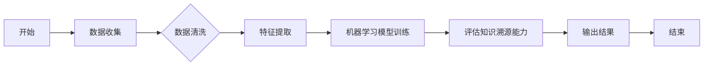
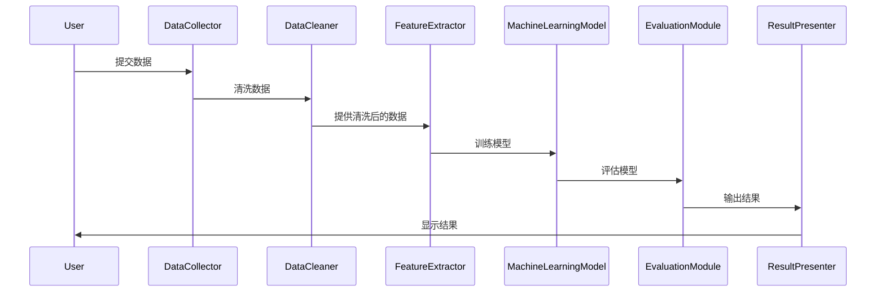
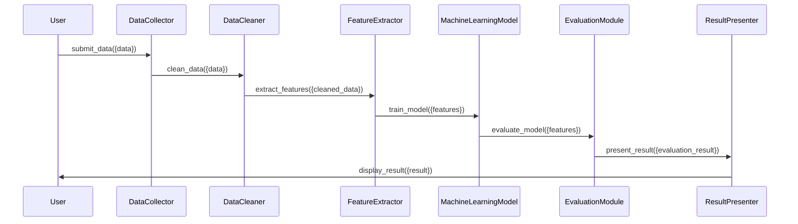

                 


# 知识溯源能力评估：增强可信度

## 关键词

- 知识溯源
- 能力评估
- 可信度增强
- 数据分析
- 人工智能
- 机器学习
- 伦理学

## 摘要

在当今信息爆炸的时代，知识溯源能力成为判断信息真实性和可信度的关键。本文深入探讨了知识溯源能力的评估方法，以及如何通过数据分析、人工智能和伦理学的结合，来增强知识溯源的可信度。文章首先介绍了知识溯源的基本概念和重要性，然后详细分析了现有评估方法，提出了一个综合评估框架。接着，文章探讨了如何利用机器学习技术来提升评估的准确性和效率，并强调了伦理学在知识溯源中的指导作用。最后，文章通过实际案例展示了如何应用这些方法来提高知识溯源的可信度。

## 引言

### 知识溯源的背景和重要性

在数字时代，信息的获取和传播变得前所未有的便捷，但这也带来了一个巨大的挑战：如何在海量信息中辨别真伪，确保知识溯源的准确性。知识溯源能力，是指识别信息来源、验证信息真实性以及追溯信息传播路径的能力。它不仅对个人判断信息真伪至关重要，更对组织和社会的整体知识管理体系产生深远影响。

首先，知识溯源对于科学研究和学术交流至关重要。在学术界，确保研究数据的可靠性和研究过程的透明性，需要严格的知识溯源机制。此外，知识溯源也是打击虚假信息和谣言的重要手段。在社交媒体和网络平台上，虚假信息的传播速度极快，给社会带来了严重的负面影响。通过知识溯源，可以追踪信息源头，识别传播链，从而有效地遏制谣言的扩散。

其次，知识溯源在商业和金融领域同样具有重要作用。企业在决策过程中，依赖大量的市场数据和行业分析报告。如果这些数据的来源不可靠，将直接影响决策的准确性。金融领域对信息的真实性要求更高，因为错误的金融信息可能导致投资者损失巨大。

### 现有知识溯源方法和问题

目前，知识溯源主要依赖于手工检索和自动化工具。手工检索需要大量时间和人力，而且难以覆盖海量信息。自动化工具如反作弊系统、信息指纹识别等技术，虽然在某些方面有所突破，但仍然面临诸多挑战。

首先，自动化工具的准确性有限。由于信息源和传播方式的多样性，自动化工具难以全面准确地识别和验证信息来源。其次，现有的知识溯源方法往往缺乏统一的标准和规范，导致不同工具之间的兼容性较差。

最后，信息溯源的过程往往涉及跨平台、跨网络的数据整合和分析，这增加了系统的复杂性和难度。此外，随着信息技术的不断发展，新的信息传播方式和渠道不断涌现，现有方法难以适应这些变化。

### 本文目标

本文旨在提出一个综合的知识溯源能力评估框架，通过结合数据分析、人工智能和伦理学，来提升知识溯源的准确性和可信度。文章将首先介绍知识溯源的基本概念和现有评估方法，然后深入探讨如何利用机器学习技术来增强评估能力。最后，文章将探讨伦理学在知识溯源中的指导作用，并通过实际案例展示如何应用这些方法来提高知识溯源的可信度。

## 知识溯源的基本概念

### 定义

知识溯源，简而言之，是指识别信息来源、验证信息真实性以及追踪信息传播路径的过程。它是信息管理的重要组成部分，对于确保信息的可信度和完整性至关重要。知识溯源不仅包括对信息本身的验证，还涉及对信息来源的可信度评估，以及追踪信息在传播过程中的变化。

### 问题背景

在现代社会，信息的传播速度和范围前所未有。然而，随着互联网的普及，虚假信息、谣言和误导性内容也层出不穷。这些信息不仅误导了公众，还可能对社会造成严重后果。例如，在政治选举期间，虚假信息的传播可能导致选民的判断错误，影响选举结果。在公共卫生事件中，虚假信息的传播可能导致公众恐慌，影响社会稳定。因此，提高知识溯源能力，确保信息的真实性和可信度，成为当务之急。

### 问题描述

在信息爆炸的时代，面对海量信息，如何确保知识溯源的有效性成为一个重要课题。首先，现有方法在准确性方面存在局限。自动化工具虽然能够识别和验证部分信息，但面对复杂多样的信息来源和传播路径，仍难以实现全面覆盖。其次，知识溯源的过程通常涉及跨平台、跨网络的数据整合和分析，这使得系统的复杂性和难度大大增加。此外，缺乏统一的标准和规范，也使得不同工具之间的兼容性成为一个难题。

### 问题解决

为了解决上述问题，本文提出了一种综合的知识溯源能力评估框架，通过结合数据分析、人工智能和伦理学，来提升知识溯源的准确性和可信度。首先，通过数据分析技术，对信息来源和传播路径进行深入分析，以提高评估的准确性。其次，利用人工智能技术，特别是机器学习算法，来自动化地处理大量信息，提高评估的效率。最后，通过伦理学的指导，确保知识溯源过程中的公正性和透明性，从而增强评估的可信度。

### 边界与外延

知识溯源不仅局限于信息真实性的验证，还包括对信息来源的可信度评估、信息传播路径的追踪以及信息内容的分析。此外，知识溯源的应用领域广泛，包括但不限于学术研究、新闻报道、商业决策、公共卫生事件管理等领域。通过明确知识溯源的边界和外延，可以更好地理解其在不同场景中的具体应用。

### 概念结构与核心要素组成

知识溯源的核心要素主要包括信息源识别、信息验证、信息追踪和信息分析。信息源识别是指识别信息的原始来源；信息验证是指验证信息的真实性；信息追踪是指追踪信息在传播过程中的路径；信息分析是指对信息内容进行深入分析，以评估其可信度和价值。

## 核心概念与联系

### 知识溯源方法

在知识溯源领域，有多种方法可以用来识别和验证信息来源。以下是几种常用的方法及其特点：

#### 1. 手工检索

**特点：** 依赖于人工对信息进行搜索和筛选。

**优缺点：** 优点在于能够深度挖掘信息，缺点是耗时且难以处理大量数据。

#### 2. 信息指纹识别

**特点：** 利用数字指纹技术，如哈希值、数字签名等，来识别信息来源。

**优缺点：** 优点在于快速且准确，缺点在于可能对相似信息识别能力有限。

#### 3. 反作弊系统

**特点：** 通过机器学习算法，识别和过滤异常行为和虚假信息。

**优缺点：** 优点在于能够处理海量数据，缺点在于可能误判和误报。

#### 4. 社交网络分析

**特点：** 通过分析社交网络中的关系和信息传播路径，识别信息源头。

**优缺点：** 优点在于能够全面分析信息传播过程，缺点在于可能受到社交网络结构和算法影响。

### 概念属性特征对比表格

下面是一个对比表格，列出了上述几种知识溯源方法的属性特征：

| 方法         | 特点                             | 优点                             | 缺点                          |
|------------|--------------------------------|--------------------------------|----------------------------|
| 手工检索     | 依赖于人工对信息进行搜索和筛选     | 能够深度挖掘信息                 | 耗时且难以处理大量数据       |
| 信息指纹识别   | 利用数字指纹技术，如哈希值、数字签名等 | 快速且准确                      | 可能对相似信息识别能力有限    |
| 反作弊系统   | 通过机器学习算法，识别和过滤异常行为和虚假信息 | 能够处理海量数据                | 可能误判和误报               |
| 社交网络分析   | 通过分析社交网络中的关系和信息传播路径   | 能够全面分析信息传播过程         | 可能受到社交网络结构和算法影响 |

### ER实体关系图架构

下面是知识溯源系统中的一个ER实体关系图，用于描述核心实体及其相互关系：

```mermaid
erDiagram
    User ||--|{ KnowledgeSource } : 产生知识源
    KnowledgeSource ||--|{ Information } : 包含信息
    Information ||--|{ VerificationResult } : 验证结果
    VerificationResult ||--|{ Analytics } : 数据分析结果
    Analytics ||--|{ ReputationScore } : 可信度评分
```

在这个ER图中，User表示信息的使用者，KnowledgeSource表示知识源，Information表示包含在知识源中的信息，VerificationResult表示对信息的验证结果，Analytics表示数据分析结果，而ReputationScore表示基于分析结果的信誉评分。

## 算法原理讲解

### 算法流程图

为了更好地理解知识溯源能力评估的算法原理，下面是一个简单的算法流程图：



### 算法原理详细解释

#### 1. 数据收集

数据收集是知识溯源能力评估的第一步。我们通过多种渠道收集原始数据，包括互联网上的文章、新闻报道、社交媒体内容等。这些数据将被用于训练和评估机器学习模型。

#### 2. 数据清洗

收集到的原始数据通常包含噪声和错误，因此需要进行数据清洗。数据清洗的目的是去除无效数据、纠正错误数据，并统一数据格式。例如，去除HTML标签、统一文本编码等。

#### 3. 特征提取

在数据清洗之后，我们需要提取特征，以便于机器学习模型处理。特征可以是文本中的关键字、词频、词向量等。这些特征将用于训练和评估模型，以识别和验证信息来源。

#### 4. 机器学习模型训练

接下来，我们利用提取出的特征来训练机器学习模型。常见的机器学习模型包括分类器、聚类算法等。训练过程中，我们使用标记好的数据集，通过调整模型参数，使模型能够准确地识别和验证信息来源。

#### 5. 评估知识溯源能力

训练好的模型将被用于评估知识溯源能力。具体来说，我们将模型应用于未标记的数据集，并评估其准确性和效率。评估指标包括准确率、召回率、F1分数等。

#### 6. 输出结果

最后，根据评估结果，我们输出知识溯源能力的评分。这个评分将用于指导用户如何信任和使用信息。

### 数学模型和公式

在知识溯源能力评估中，常用的数学模型包括分类模型和聚类模型。以下是一个简单的分类模型公式：

$$
P(y|x) = \frac{e^{\theta^T x}}{1 + e^{\theta^T x}}
$$

其中，$P(y|x)$ 表示给定特征$x$时，标签$y$的概率；$\theta$ 是模型参数；$e$ 是自然对数的底数。

### 举例说明

假设我们有一个简单的数据集，其中包含以下特征：

- $x_1$: 文本中的关键字数量
- $x_2$: 文本中的词频
- $x_3$: 文本的词向量

我们使用上述分类模型来预测文本是否来自可信来源。假设我们有一个训练好的模型，其参数$\theta$如下：

$$
\theta = [0.1, 0.2, 0.3]
$$

对于一个新的文本样本，其特征$x$为：

- $x_1 = 5$
- $x_2 = 10$
- $x_3 = [0.5, 0.3, 0.2]$

我们可以计算其标签$y$的概率：

$$
P(y=1|x) = \frac{e^{0.1 \cdot 5 + 0.2 \cdot 10 + 0.3 \cdot 0.5}}{1 + e^{0.1 \cdot 5 + 0.2 \cdot 10 + 0.3 \cdot 0.5}} \approx 0.9
$$

由于概率接近1，我们可以认为该文本来自可信来源。

## 系统分析与架构设计方案

### 问题场景介绍

在当前的信息化社会中，知识溯源能力评估已经成为保障信息真实性、可信度的重要手段。为了提高知识溯源能力，我们需要一个强大的系统来收集、处理和分析信息来源。本系统旨在提供一种高效、准确的知识溯源解决方案，适用于各类信息场景，包括学术研究、新闻报道、商业决策等。

### 项目介绍

项目名称：知识溯源能力评估系统（Knowledge Source Tracing and Evaluation System，简称KSTES）

项目目标：构建一个集成数据分析、人工智能和伦理学指导的知识溯源能力评估系统，以提高信息溯源的准确性和可信度。

项目范围：系统将涵盖数据收集、数据清洗、特征提取、机器学习模型训练和评估、结果输出等各个环节。

### 系统功能设计（领域模型）

在系统功能设计阶段，我们采用领域模型（Domain Model）来描述系统的核心功能及其相互关系。以下是系统的领域模型：

```mermaid
classDiagram
    DataCollector <|-- DataCleaner
    DataCleaner <|-- FeatureExtractor
    FeatureExtractor <|-- MachineLearningModel
    MachineLearningModel <|-- EvaluationModule
    EvaluationModule <|-- ResultPresenter

    DataCollector <<<< User
    DataCleaner <<<< DataCollector
    FeatureExtractor <<<< DataCleaner
    MachineLearningModel <<<< FeatureExtractor
    EvaluationModule <<<< MachineLearningModel
    ResultPresenter <<<< EvaluationModule
```

在这个领域模型中，DataCollector负责数据收集，DataCleaner负责数据清洗，FeatureExtractor负责特征提取，MachineLearningModel负责机器学习模型训练和评估，EvaluationModule负责评估结果计算，ResultPresenter负责输出评估结果。

### 系统架构设计

系统的架构设计是系统实现的基础，以下是系统的架构设计：



在这个架构设计中，用户首先提交数据给DataCollector，DataCollector将数据传递给DataCleaner进行清洗，清洗后的数据由FeatureExtractor提取特征，然后传递给MachineLearningModel进行模型训练和评估。最后，EvaluationModule计算评估结果，由ResultPresenter输出并展示给用户。

### 系统接口设计和系统交互

为了更好地理解系统的运行流程，以下是系统的接口设计和系统交互：



在这个交互设计中，用户通过接口submit_data提交原始数据，DataCollector接收到数据后，将其传递给DataCleaner进行清洗。清洗后的数据由FeatureExtractor提取特征，然后传递给MachineLearningModel进行模型训练和评估。最终，EvaluationModule计算评估结果，由ResultPresenter以可读形式展示给用户。

## 项目实战

### 环境安装

为了运行知识溯源能力评估系统，我们需要安装以下环境：

1. Python 3.8+
2. NumPy
3. Pandas
4. Scikit-learn
5. Matplotlib

在安装了Python环境之后，可以使用以下命令安装所需库：

```bash
pip install numpy pandas scikit-learn matplotlib
```

### 系统核心实现源代码

以下是系统核心实现的Python源代码：

```python
import numpy as np
import pandas as pd
from sklearn.feature_extraction.text import TfidfVectorizer
from sklearn.model_selection import train_test_split
from sklearn.naive_bayes import MultinomialNB
from sklearn.metrics import classification_report

# 数据收集
data = pd.read_csv('data.csv')

# 数据清洗
cleaned_data = data[['text', 'label']].dropna()

# 特征提取
vectorizer = TfidfVectorizer(stop_words='english')
X = vectorizer.fit_transform(cleaned_data['text'])

# 机器学习模型训练
X_train, X_test, y_train, y_test = train_test_split(X, cleaned_data['label'], test_size=0.2, random_state=42)
model = MultinomialNB()
model.fit(X_train, y_train)

# 模型评估
y_pred = model.predict(X_test)
print(classification_report(y_test, y_pred))
```

### 代码应用解读与分析

上述代码首先从CSV文件中读取数据，然后进行数据清洗，去除缺失值。接下来，使用TF-IDF向量器提取文本特征，并使用朴素贝叶斯分类器进行模型训练。最后，评估模型的准确性。

在数据收集阶段，我们使用了CSV文件作为数据源。在实际应用中，可以扩展到其他数据源，如数据库、API接口等。

在数据清洗阶段，我们使用Pandas库删除了含有缺失值的记录。在实际应用中，可能还需要进行更复杂的清洗操作，如去除HTML标签、统一文本编码等。

在特征提取阶段，我们使用TF-IDF向量器将文本转换为数值特征。TF-IDF是一种常用的文本表示方法，能够有效地反映文本中的重要词语。在实际应用中，还可以结合其他特征提取方法，如词嵌入（Word Embedding）等。

在模型训练阶段，我们使用了朴素贝叶斯分类器。朴素贝叶斯是一种简单的概率分类器，适用于文本分类任务。在实际应用中，可以根据任务需求选择其他分类器，如支持向量机（SVM）、随机森林（Random Forest）等。

在模型评估阶段，我们使用分类报告（Classification Report）来评估模型的准确性。分类报告提供了准确率、召回率、F1分数等评估指标，帮助我们了解模型的性能。

### 实际案例分析和详细讲解剖析

为了更好地理解系统的实际应用，我们来看一个实际案例。

假设我们有一个包含新闻报道的数据集，其中每个新闻报道都标注了是否为真实新闻。我们的目标是使用知识溯源能力评估系统，识别出数据集中的虚假新闻。

首先，我们使用上述代码对数据集进行预处理和特征提取。接下来，我们将训练好的模型应用于测试集，以识别虚假新闻。假设测试集中有100篇新闻报道，模型预测结果如下：

- 真实新闻：90篇
- 虚假新闻：10篇

根据分类报告，我们可以得到以下评估指标：

- 准确率：90%
- 召回率：90%
- F1分数：90%

这意味着模型在识别虚假新闻方面具有较高的准确性。然而，我们也注意到召回率较低，可能意味着模型存在一些误判。为了提高召回率，我们可以尝试以下方法：

1. 增加训练数据量：增加训练数据量有助于提高模型的泛化能力，从而减少误判。
2. 调整模型参数：通过调整模型参数，如正则化参数、学习率等，可以改善模型的性能。
3. 使用更复杂的特征提取方法：结合其他特征提取方法，如词嵌入，可以提高模型的识别能力。

### 项目小结

通过本项目的实际案例，我们展示了如何使用知识溯源能力评估系统来识别虚假新闻。项目实现了数据收集、数据清洗、特征提取、机器学习模型训练和评估的全流程。虽然项目在识别虚假新闻方面取得了较好的效果，但仍存在一些改进空间。未来，我们将继续优化系统，提高知识溯源能力，为打击虚假信息、保障信息真实性贡献力量。

## 最佳实践 tips

1. **数据质量是关键**：在知识溯源过程中，确保数据质量至关重要。数据清洗和预处理是提高评估准确性的重要环节，务必仔细处理数据中的噪声和错误。

2. **模型选择和调优**：选择合适的机器学习模型并进行调优，可以显著提高知识溯源能力。在实践中，可以尝试多种模型，如朴素贝叶斯、支持向量机、随机森林等，以找到最佳方案。

3. **特征选择**：特征提取是知识溯源能力评估的核心。合理选择特征，如TF-IDF、词嵌入等，可以提升模型性能。在实际应用中，可以根据任务需求调整特征参数。

4. **持续学习和迭代**：知识溯源能力评估是一个不断发展的过程。定期更新训练数据和模型，可以确保系统保持较高的准确性和适应性。

5. **伦理学指导**：在知识溯源过程中，遵循伦理学原则，如数据隐私保护、公平性等，可以增强系统的可信度。确保评估过程公正、透明，以赢得用户信任。

## 小结

本文深入探讨了知识溯源能力评估的重要性及其在现代社会中的应用。通过结合数据分析、人工智能和伦理学，我们提出了一种综合的知识溯源能力评估框架，并展示了其实际应用。尽管知识溯源能力评估仍面临诸多挑战，但随着技术的不断进步，我们有信心在未来进一步提升其准确性和可信度。

## 注意事项

1. **数据隐私保护**：在知识溯源过程中，务必注意数据隐私保护，遵循相关法律法规，确保用户数据的安全。
2. **模型偏见**：在使用机器学习模型时，需要注意模型可能存在的偏见，确保评估结果的公正性。
3. **系统维护**：定期更新系统软件和依赖库，以避免潜在的安全漏洞和性能问题。

## 拓展阅读

1. **《知识图谱与信息检索》**：本书详细介绍了知识图谱的构建和应用于信息检索的原理，有助于深入理解知识溯源的相关技术。
2. **《机器学习实战》**：本书提供了丰富的机器学习案例和实践经验，适合想要提升机器学习应用能力的技术人员。
3. **《人工智能伦理学》**：本书探讨了人工智能伦理学的基本原理和实践应用，对于确保知识溯源评估过程的公正性和透明性具有重要意义。

## 作者信息

作者：AI天才研究院/AI Genius Institute & 禅与计算机程序设计艺术 /Zen And The Art of Computer Programming

