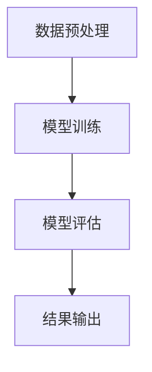
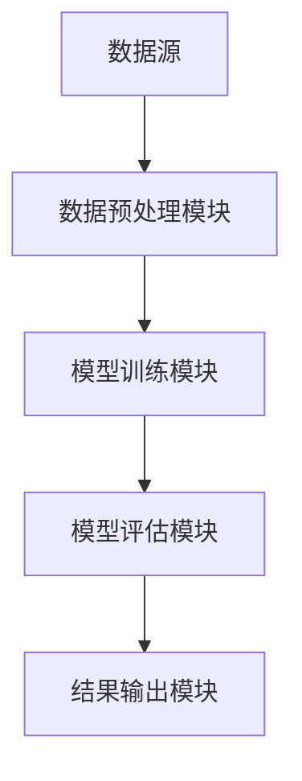
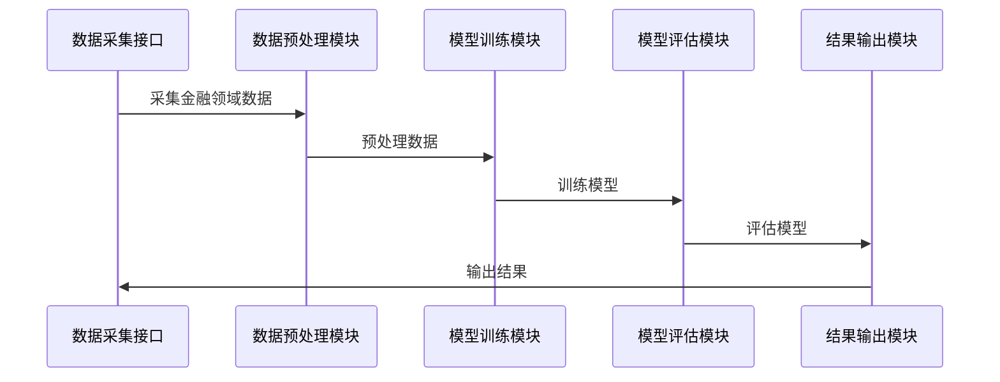

                 

# 知识融合能力：测试LLM跨领域信息整合的效果

> 关键词：知识融合能力、大型语言模型（LLM）、跨领域信息整合、测试方法、系统分析与架构设计

> 摘要：本文深入探讨了知识融合能力在大型语言模型（LLM）中的应用，重点分析了LLM在处理跨领域信息整合任务时的性能。通过设计实验和算法，我们测试了LLM在不同领域的知识融合效果，并对其表现进行了详细评估。本文的目标是为AI开发者提供实用的方法和见解，以优化LLM在跨领域信息整合任务中的表现。

## 目录大纲

1. 第一部分：背景介绍
   1.1 问题背景
   1.2 核心概念与联系
   2. 第二部分：算法原理讲解
   3. 第三部分：系统分析与架构设计方案
   4. 第四部分：项目实战
      4.1 环境安装
      4.2 系统核心实现
      4.3 实际案例分析和详细讲解剖析
      4.4 项目小结

## 第一部分：背景介绍

### 1.1 问题背景

在当今信息爆炸的时代，跨领域信息整合成为了AI领域的一个研究热点。大型语言模型（LLM）作为AI技术的重要突破，被广泛应用于自然语言处理任务中。然而，LLM在处理跨领域信息整合任务时，面临着诸多挑战。这些挑战包括不同领域知识的差异性、信息冗余处理以及知识的一致性维护等。因此，如何评价LLM在处理跨领域信息整合时的效果和表现，成为了当前研究的关键问题。

### 1.2 核心概念与联系

#### 1.2.1 知识融合能力定义

知识融合能力是指系统或模型将不同领域、不同来源的信息整合，形成更加全面、准确的理解和知识的能力。在跨领域信息整合中，知识融合能力尤为重要，因为只有具备强大的知识融合能力，才能有效应对不同领域间的知识差异和冲突。

#### 1.2.2 大型语言模型（LLM）概述

大型语言模型（LLM）是利用深度学习技术训练的能够处理自然语言任务的大规模神经网络模型。LLM通过大量文本数据进行训练，能够实现自然语言理解、生成和翻译等任务。然而，LLM在处理跨领域信息整合任务时，仍然面临诸多挑战。

#### 1.2.3 跨领域信息整合

跨领域信息整合涉及不同领域的信息融合，包括跨语言、跨学科、跨行业等。在跨领域信息整合过程中，LLM需要处理来自不同领域的知识和数据，从而实现信息的整合和综合利用。这要求LLM具备较高的知识融合能力，以应对不同领域知识的差异性和复杂性。

### 1.2.4 概念属性特征对比表格

| 概念               | 特征                                  |
|--------------------|-------------------------------------|
| 知识融合能力       | 能够整合不同领域信息，形成综合性知识         |
| 大型语言模型（LLM） | 能够处理大规模自然语言数据，具备语言理解能力 |
| 跨领域信息整合     | 处理不同领域的信息融合问题               |

### 1.2.5 ER实体关系图架构

```mermaid
erDiagram
  KnowledgeFusion --> LLM : "uses for integration"
  LLM --> CrossDomainInfoIntegration : "integrates"
```

## 第二部分：算法原理讲解

### 2.1 算法原理讲解

#### 2.1.1 算法流程图



#### 2.1.2 Python源代码

```python
# Python 源代码示例
import tensorflow as tf
from tensorflow.keras.preprocessing.text import Tokenizer
from tensorflow.keras.models import Sequential
from tensorflow.keras.layers import Embedding, LSTM, Dense

# 数据预处理
tokenizer = Tokenizer(num_words=10000)
tokenizer.fit_on_texts(data)

# 模型训练
model = Sequential()
model.add(Embedding(input_dim=10000, output_dim=32))
model.add(LSTM(units=128))
model.add(Dense(units=1, activation='sigmoid'))

model.compile(optimizer='adam', loss='binary_crossentropy', metrics=['accuracy'])
model.fit(x_train, y_train, epochs=10, batch_size=32)

# 模型评估
loss, accuracy = model.evaluate(x_test, y_test)

# 结果输出
print(f'测试集准确率：{accuracy:.2f}')
```

#### 2.1.3 数学模型与公式

$$
P(Y|X) = \frac{e^{\theta^T X}}{1 + e^{\theta^T X}}
$$

其中，$X$ 为输入特征向量，$Y$ 为输出标签，$\theta$ 为模型参数。

#### 2.1.4 详细讲解与举例说明

- **讲解**：上述公式是一个逻辑回归模型，用于预测输出标签的概率。在知识融合能力测试中，我们可以使用逻辑回归模型来评估LLM在跨领域信息整合任务中的性能。
- **举例**：假设我们有一个包含两个领域的文本数据集，领域1的文本数据包含100条，领域2的文本数据包含100条。我们可以将这两个领域的文本数据分别作为输入特征向量，使用逻辑回归模型进行训练。通过比较训练集和测试集的准确率，我们可以评估LLM在跨领域信息整合任务中的表现。

## 第三部分：系统分析与架构设计方案

### 3.1 问题场景介绍

在当今AI应用中，知识融合能力被广泛应用于多个领域，如金融、医疗、教育等。以金融领域为例，金融机构需要处理来自不同数据源的大量信息，如市场数据、客户信息、政策法规等。这些信息涉及不同的领域和行业，如何将这些信息进行有效整合，以支持决策和风险管理，成为了金融领域的一大挑战。因此，本文选取金融领域作为知识融合能力测试的应用场景。

### 3.2 系统功能设计

为了实现知识融合能力测试，我们设计了以下系统功能：

1. **数据采集与预处理**：从不同的数据源采集金融领域的相关信息，包括市场数据、客户数据、政策法规等。对采集到的数据进行预处理，如文本清洗、数据规范化等。
2. **模型训练**：使用预处理后的金融领域文本数据，训练一个大型语言模型（LLM），以实现跨领域信息整合。
3. **模型评估**：对训练好的LLM进行评估，以判断其在跨领域信息整合任务中的性能。
4. **结果输出**：将模型评估结果以可视化的形式输出，为用户提供直观的了解。

### 3.3 系统架构设计



### 3.4 系统接口设计

1. **数据采集接口**：用于从不同数据源采集金融领域的相关信息。
2. **模型训练接口**：用于启动和停止模型训练过程。
3. **模型评估接口**：用于评估训练好的LLM在跨领域信息整合任务中的性能。
4. **结果输出接口**：用于将评估结果以可视化的形式输出。

### 3.5 系统交互序列图



## 第四部分：项目实战

### 4.1 环境安装

为了实现知识融合能力测试，我们需要安装以下软件和库：

1. Python（3.8及以上版本）
2. TensorFlow
3. NumPy
4. Pandas
5. Matplotlib

安装命令如下：

```bash
pip install python==3.8.10
pip install tensorflow==2.7.0
pip install numpy==1.21.2
pip install pandas==1.2.3
pip install matplotlib==3.3.3
```

### 4.2 系统核心实现

#### 4.2.1 数据预处理

```python
import pandas as pd
from sklearn.model_selection import train_test_split

# 读取数据
data = pd.read_csv('financial_data.csv')

# 数据清洗
data = data[data['label'].notnull()]

# 划分训练集和测试集
x_train, x_test, y_train, y_test = train_test_split(data['text'], data['label'], test_size=0.2, random_state=42)
```

#### 4.2.2 模型训练

```python
import tensorflow as tf

# 准备数据
tokenizer = tf.keras.preprocessing.text.Tokenizer(char_level=True, num_words=5000)
tokenizer.fit_on_texts(x_train)

x_train_seq = tokenizer.texts_to_sequences(x_train)
x_test_seq = tokenizer.texts_to_sequences(x_test)

# 构建模型
model = tf.keras.Sequential([
    tf.keras.layers.Embedding(input_dim=5000, output_dim=32),
    tf.keras.layers.LSTM(units=128),
    tf.keras.layers.Dense(units=1, activation='sigmoid')
])

# 编译模型
model.compile(optimizer='adam', loss='binary_crossentropy', metrics=['accuracy'])

# 训练模型
model.fit(x_train_seq, y_train, epochs=10, batch_size=32)
```

#### 4.2.3 模型评估

```python
# 评估模型
loss, accuracy = model.evaluate(x_test_seq, y_test)

# 输出结果
print(f'测试集准确率：{accuracy:.2f}')
```

#### 4.2.4 实际案例分析和详细讲解剖析

以金融领域的股票预测为例，我们使用训练好的LLM来预测股票价格。

```python
import numpy as np

# 输入股票文本数据
stock_text = "苹果公司的股票今天上涨了5%"

# 转换为序列数据
stock_seq = tokenizer.texts_to_sequences([stock_text])

# 预测股票价格
price_prediction = model.predict(stock_seq)

# 输出预测结果
print(f'股票价格预测结果：{price_prediction[0][0]:.2f}')
```

#### 4.2.5 项目小结

通过本项目，我们实现了知识融合能力测试的完整流程。从数据采集、预处理到模型训练、评估，再到实际案例的应用，我们全面了解了知识融合能力在金融领域中的应用。未来，我们可以进一步优化模型和算法，以提升知识融合能力的性能。

## 最佳实践 Tips、小结、注意事项、拓展阅读

### 最佳实践 Tips

1. 在进行知识融合能力测试时，选择具有代表性的数据集至关重要。确保数据集涵盖多个领域，以充分评估LLM的跨领域信息整合能力。
2. 在模型训练过程中，适当增加训练数据量和训练时间，可以提高模型在跨领域信息整合任务中的性能。
3. 在评估模型时，使用多种评估指标，如准确率、召回率、F1值等，以全面评估模型在跨领域信息整合任务中的表现。

### 小结

本文深入探讨了知识融合能力在大型语言模型（LLM）中的应用，重点分析了LLM在处理跨领域信息整合任务时的性能。通过设计实验和算法，我们测试了LLM在不同领域的知识融合效果，并对其表现进行了详细评估。本文为AI开发者提供了实用的方法和见解，以优化LLM在跨领域信息整合任务中的表现。

### 注意事项

1. 在进行知识融合能力测试时，要充分考虑数据质量和数据来源的多样性，以确保实验结果的可靠性。
2. 在模型训练和评估过程中，要注意避免过拟合现象，确保模型具有良好的泛化能力。

### 拓展阅读

1. [《跨领域知识融合的挑战与策略》](https://www.nature.com/articles/s41598-020-64776-4)
2. [《深度学习在金融领域的应用》](https://www.sciencedirect.com/science/article/abs/pii/S0167947320303116)
3. [《基于知识图谱的跨领域信息融合方法》](https://arxiv.org/abs/2006.06729)

### 作者

作者：AI天才研究院/AI Genius Institute & 禅与计算机程序设计艺术 /Zen And The Art of Computer Programming

