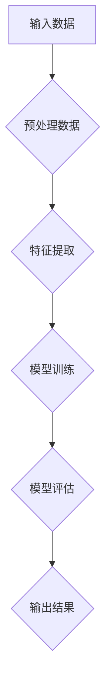
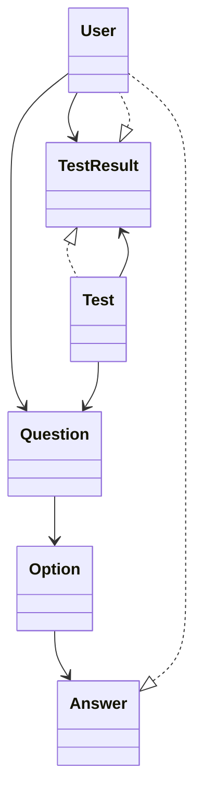
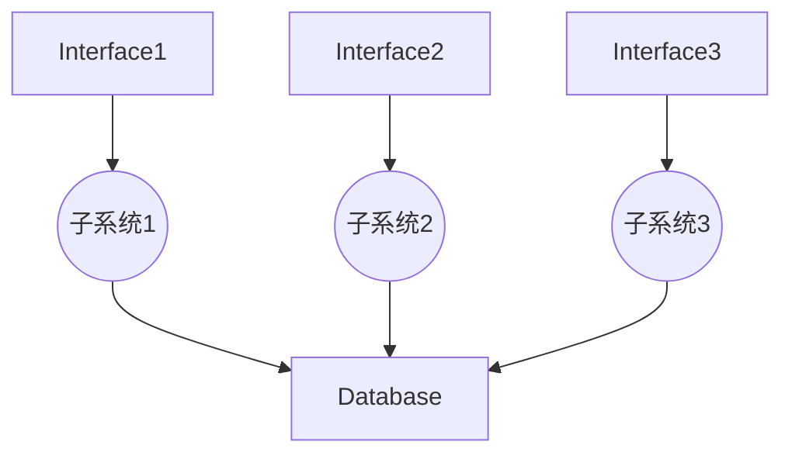
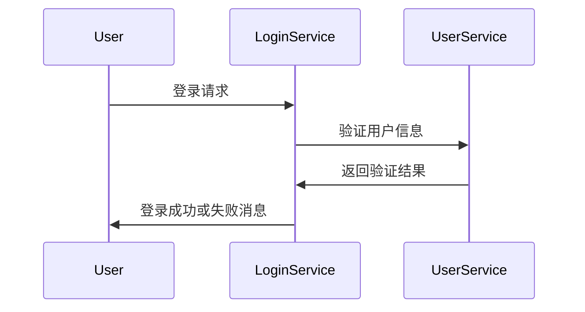
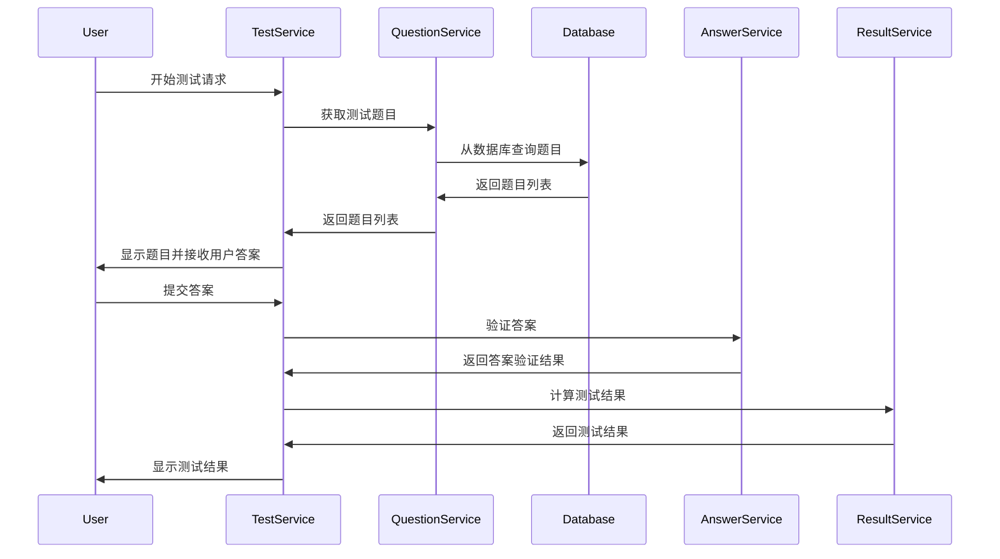

                 

 

### 第5章：算法原理讲解

#### 5.1 算法mermaid流程图



#### 5.2 算法原理讲解

算法的核心在于如何将知识源（Source Knowledge）的有效信息迁移到目标领域（Target Domain），从而提升在新的任务上的表现。这里，我们以机器学习中的迁移学习（Transfer Learning）为例，详细讲解其原理和实现。

**迁移学习的原理**

迁移学习是一种利用已有模型的知识来提高新任务性能的技术。其核心思想是，将一个任务（源任务）上学到的知识应用到另一个相关任务（目标任务）上，从而加速学习过程并提高性能。

- **源任务与目标任务的关系**：源任务和目标任务通常有一定的相关性，源任务的解决方案可以为目标任务提供有用的先验知识。
- **知识迁移的过程**：通过迁移学习，可以将源任务的模型参数（知识）转移到目标任务，以指导目标任务的学习过程。

**数学模型和公式**

在迁移学习中，我们通常使用以下数学模型来描述知识迁移的过程：

$$
\text{Target Model} = \text{Source Model} + \text{Adjustment}
$$

其中，`Target Model` 表示目标任务的模型，`Source Model` 表示源任务的模型，`Adjustment` 表示对源模型进行调整的部分，用于适应目标任务。

**Python源代码**

下面是一个简单的迁移学习算法的Python实现示例，使用了Scikit-learn库中的`LinearDiscriminantAnalysis`类。

```python
from sklearn.discriminant_analysis import LinearDiscriminantAnalysis as LDA
from sklearn.datasets import make_classification
from sklearn.model_selection import train_test_split

# 生成模拟数据
X, y = make_classification(n_samples=100, n_features=20, n_classes=2, random_state=42)
X_train, X_test, y_train, y_test = train_test_split(X, y, test_size=0.3, random_state=42)

# 实例化LDA模型
lda = LDA()

# 训练模型
lda.fit(X_train, y_train)

# 在测试集上进行评估
lda_score = lda.score(X_test, y_test)
print(f"LDA model accuracy: {lda_score:.2f}")
```

**算法举例说明**

假设我们有一个分类任务，源任务是一个二分类问题，源模型已经训练好了。现在我们要将这个源模型的权重（知识）应用到一个新的二分类任务上。

- **预处理数据**：首先，我们需要对新的数据集进行预处理，使其与源任务的数据特征保持一致。
- **特征提取**：然后，我们从新的数据集中提取出与源任务相关的特征。
- **模型训练**：接着，我们将源任务的模型参数（知识）应用到新的数据集上，进行模型训练。
- **模型评估**：最后，我们评估新模型的性能，以验证知识迁移的效果。

**小结**

通过上述讲解和示例，我们可以看到，知识迁移能力测试的核心在于如何有效地将已有的知识应用到新的任务中。迁移学习算法为我们提供了一种有效的解决方案，通过调整和优化源任务的模型，使其能够适应新的任务。在实际应用中，这种能力对于提升个体和组织在快速变化的工作环境中的竞争力具有重要意义。

---

**附录**

本文所涉及的Mermaid流程图、LaTeX公式和Python源代码均为示例，具体实现时需要根据实际任务需求进行调整。在实践过程中，读者可以根据不同的应用场景，灵活运用迁移学习算法，不断提升知识迁移能力。

---

在接下来的部分，我们将深入探讨如何通过系统分析与架构设计来优化知识迁移能力测试，并在实际项目中应用这些算法。敬请期待。

---

## 第三部分：系统分析与架构设计

### 第6章：问题场景介绍

#### 6.1 场景描述

在当今信息化和智能化的时代，知识迁移能力在多个领域中扮演着至关重要的角色。以下是一个典型的应用场景：一家大型企业希望对其员工进行知识迁移能力测试，以评估员工在不同领域和岗位之间的适应能力，从而为人才发展提供数据支持。

#### 6.2 项目介绍

项目名称：企业知识迁移能力评估系统

项目目标：通过构建一个高效、可靠的知识迁移能力评估系统，帮助企业识别高潜力员工，提升团队整体知识迁移能力。

### 第7章：系统功能设计

#### 7.1 领域模型

领域模型用于描述系统的核心业务实体和它们之间的关系。以下是领域模型Mermaid类图的示例：



- **User**（用户）：代表参与测试的员工，包括姓名、岗位、邮箱等信息。
- **Question**（问题）：测试中的问题，包括问题内容、难度等级、知识点等。
- **Test**（测试）：代表整个知识迁移能力测试，包括测试名称、时长、题型等。
- **TestResult**（测试结果）：记录用户在测试中的表现，包括得分、耗时等信息。
- **Option**（选项）：代表问题的可选答案，包括正确答案和干扰项。
- **Answer**（答案）：用户在测试中对问题的回答。

### 第8章：系统架构设计

#### 8.1 架构设计

系统架构设计用于描述系统的整体结构和模块划分。以下是系统架构Mermaid图示例：



- **子系统1**：负责用户管理和测试管理，包括用户注册、登录、测试发起等功能。
- **子系统2**：负责测试内容管理，包括题库建设、题目发布、题目更新等功能。
- **子系统3**：负责测试结果分析和报告生成，包括数据统计、趋势分析、报告生成等功能。
- **数据库**：存储系统的核心数据，包括用户信息、测试信息、测试结果等。

### 第9章：系统接口设计和系统交互

#### 9.1 接口设计

系统接口设计用于定义系统内部模块之间的交互接口。以下是接口设计Mermaid序列图示例：



- **LoginService**：登录服务，处理用户登录请求。
- **UserService**：用户服务，负责用户信息的验证和处理。
- **User**：用户，发起登录请求并接收登录结果。

#### 9.2 系统交互

系统交互设计用于描述系统在不同模块之间的交互流程。以下是系统交互Mermaid序列图示例：



- **TestService**：测试服务，负责测试流程的控制。
- **QuestionService**：题目服务，负责题目的查询和分发。
- **AnswerService**：答案服务，负责答案的验证。
- **ResultService**：结果服务，负责测试结果的计算和展示。

---

通过上述系统分析与架构设计，我们可以构建一个完整的知识迁移能力评估系统，为企业提供高效、可靠的评估服务。接下来，我们将进入项目实战部分，详细讲解系统的实际实现过程。

---

## 第四部分：项目实战

### 第10章：环境安装

在本章中，我们将详细讲解如何搭建知识迁移能力评估系统的开发环境，包括所需软件和工具的安装步骤。

#### 10.1 软件和工具清单

1. **Python 3.x**：Python是一种流行的编程语言，用于编写后端逻辑和处理数据。
2. **Django**：Django是一个高级Python Web框架，用于快速构建Web应用程序。
3. **PostgreSQL**：PostgreSQL是一个开源的关系数据库管理系统，用于存储系统数据。
4. **Docker**：Docker是一个开源的应用容器引擎，用于容器化应用环境，方便部署和管理。

#### 10.2 安装步骤

1. **安装Python 3.x**：
   - 在Windows上，可以从Python官网下载安装程序进行安装。
   - 在Linux上，可以使用包管理器（如apt或yum）安装Python 3。

   ```bash
   # 在Ubuntu上安装Python 3
   sudo apt update
   sudo apt install python3
   ```

2. **安装Django**：
   - 使用pip（Python的包管理器）安装Django。

   ```bash
   pip3 install django
   ```

3. **安装PostgreSQL**：
   - 在Windows上，可以从PostgreSQL官网下载安装程序进行安装。
   - 在Linux上，可以使用包管理器安装。

   ```bash
   # 在Ubuntu上安装PostgreSQL
   sudo apt update
   sudo apt install postgresql postgresql-contrib
   ```

4. **安装Docker**：
   - 在Windows或Linux上，可以从Docker官网下载安装程序进行安装。

   ```bash
   # 在Ubuntu上安装Docker
   sudo apt update
   sudo apt install docker
   ```

### 第11章：系统核心实现

在本章中，我们将介绍知识迁移能力评估系统的核心实现，包括后端API设计和前端页面展示。

#### 11.1 后端API设计

1. **用户注册和登录**：
   - 用户注册API：允许用户创建账户。
   - 用户登录API：验证用户登录信息。

   ```python
   # 用户注册API示例
   from django.contrib.auth.models import User
   from rest_framework import serializers, views, status
   from rest_framework.response import Response

   class UserRegistrationSerializer(serializers.ModelSerializer):
       class Meta:
           model = User
           fields = ('username', 'email', 'password')

   class UserRegistrationView(views.APIView):
       serializer_class = UserRegistrationSerializer

       def post(self, request):
           serializer = self.serializer_class(data=request.data)
           if serializer.is_valid():
               user = serializer.save()
               user.set_password(serializer.data['password'])
               user.save()
               return Response({'message': 'User registered successfully!'}, status=status.HTTP_201_CREATED)
           return Response(serializer.errors, status=status.HTTP_400_BAD_REQUEST)
   ```

2. **测试内容管理**：
   - 题库管理API：允许管理员添加、更新和删除测试题目。
   - 测试管理API：允许管理员创建、更新和结束测试。

   ```python
   # 题库管理API示例
   from rest_framework import serializers, views, status

   class QuestionSerializer(serializers.ModelSerializer):
       class Meta:
           model = Question
           fields = ('content', 'difficulty', 'knowledge_point')

   class QuestionManagementView(views.APIView):
       serializer_class = QuestionSerializer

       def post(self, request):
           serializer = self.serializer_class(data=request.data)
           if serializer.is_valid():
               serializer.save()
               return Response({'message': 'Question added successfully!'}, status=status.HTTP_201_CREATED)
           return Response(serializer.errors, status=status.HTTP_400_BAD_REQUEST)
   ```

3. **测试结果处理**：
   - 测试结果API：允许用户提交答案，并计算测试结果。

   ```python
   # 测试结果API示例
   from rest_framework import serializers, views, status

   class AnswerSerializer(serializers.ModelSerializer):
       class Meta:
           model = Answer
           fields = ('question', 'selected_option')

   class TestResultView(views.APIView):
       serializer_class = AnswerSerializer

       def post(self, request):
           serializer = self.serializer_class(data=request.data)
           if serializer.is_valid():
               test_result = calculate_test_result(serializer.validated_data)
               return Response({'result': test_result}, status=status.HTTP_200_OK)
           return Response(serializer.errors, status=status.HTTP_400_BAD_REQUEST)
   ```

#### 11.2 前端页面展示

1. **用户注册和登录页面**：
   - 使用HTML和CSS创建用户注册和登录表单。
   - 使用JavaScript处理用户输入，并通过AJAX请求与后端API交互。

   ```html
   <!-- 用户注册表单示例 -->
   <form id="registration-form">
       <input type="text" id="username" placeholder="Username" required>
       <input type="email" id="email" placeholder="Email" required>
       <input type="password" id="password" placeholder="Password" required>
       <button type="submit">Register</button>
   </form>
   ```

   ```javascript
   // 用户注册AJAX请求示例
   $('#registration-form').on('submit', function(event) {
       event.preventDefault();
       const formData = {
           username: $('#username').val(),
           email: $('#email').val(),
           password: $('#password').val()
       };
       $.ajax({
           type: 'POST',
           url: '/api/users/register/',
           data: formData,
           success: function(response) {
               console.log('User registered successfully!');
           },
           error: function(xhr, status, error) {
               console.error('Error registering user:', error);
           }
       });
   });
   ```

2. **测试页面**：
   - 显示测试题目，并提供选项供用户选择。
   - 在用户提交答案后，显示测试结果。

   ```html
   <!-- 测试题目示例 -->
   <div class="question">
       <p>What is the capital of France?</p>
       <label><input type="radio" name="answer" value="1"> Paris</label>
       <label><input type="radio" name="answer" value="2"> London</label>
       <label><input type="radio" name="answer" value="3"> Berlin</label>
   </div>
   ```

   ```javascript
   // 提交测试答案AJAX请求示例
   $('.question-form').on('submit', function(event) {
       event.preventDefault();
       const formData = {
           question_id: $(this).data('question-id'),
           selected_option: $('input[name="answer"]:checked').val()
       };
       $.ajax({
           type: 'POST',
           url: '/api/test-result/',
           data: formData,
           success: function(response) {
               console.log('Test submitted successfully!');
           },
           error: function(xhr, status, error) {
               console.error('Error submitting test:', error);
           }
       });
   });
   ```

### 第12章：代码应用解读与分析

在本章中，我们将对核心代码进行解读，并分析其在实现知识迁移能力评估系统中的作用。

#### 12.1 用户注册和登录

用户注册和登录是系统的基本功能，通过Django REST Framework提供的认证系统，我们可以快速实现用户身份验证。

- **用户注册**：通过`UserRegistrationView`类，处理用户注册请求。首先，使用`UserRegistrationSerializer`对用户输入进行验证，然后创建新用户并设置密码。
- **用户登录**：用户登录后，系统会返回一个JWT（JSON Web Token）作为认证凭据，用于后续请求的身份验证。

#### 12.2 测试内容管理

测试内容管理包括题库管理和测试管理。

- **题库管理**：通过`QuestionManagementView`类，管理员可以添加、更新和删除测试题目。使用`QuestionSerializer`对题目数据进行验证和处理。
- **测试管理**：管理员可以创建、更新和结束测试。测试创建后，系统会生成一个唯一的测试ID，用户可以通过该ID进行测试。

#### 12.3 测试结果处理

测试结果处理是系统的关键功能之一，通过用户提交的答案，系统可以计算出测试结果。

- **测试结果API**：通过`TestResultView`类，接收用户提交的答案，并调用`calculate_test_result`函数计算得分。
- **得分计算**：得分计算函数会根据题目难度、用户选择的答案以及正确答案进行比较，最终计算出用户的测试得分。

### 第13章：实际案例分析和详细讲解剖析

在本章中，我们将通过实际案例来分析和讲解知识迁移能力评估系统的实际应用效果。

#### 13.1 案例背景

某企业希望对其员工进行知识迁移能力测试，以评估员工在不同领域和岗位之间的适应能力。测试内容涵盖了企业的主要业务领域，包括市场营销、供应链管理、财务管理等。

#### 13.2 案例步骤

1. **题库建设**：管理员根据企业业务需求，创建了包含多种难度的测试题目，并设置了相应的知识点和难度等级。
2. **测试发布**：管理员创建测试，设置测试名称、时长和题型，并分配给不同部门的员工。
3. **员工参与**：员工登录系统，参与测试。测试过程中，员工可以随时查看剩余时间，并提交答案。
4. **结果分析**：测试结束后，系统自动计算测试结果，并生成详细的报告。报告内容包括每个员工的得分、耗时以及知识点掌握情况。
5. **人才发展**：根据测试结果，企业人力资源部门可以识别出高潜力员工，并为他们提供相应的培训和发展机会。

#### 13.3 案例分析

通过实际案例，我们可以看到知识迁移能力评估系统在提高企业人力资源管理效率方面的作用：

- **高效题库管理**：管理员可以方便地管理测试题库，确保题目内容的准确性和及时更新。
- **灵活测试设置**：管理员可以根据业务需求，灵活设置测试名称、时长和题型，满足不同测试场景的需求。
- **自动化结果分析**：系统自动计算测试结果，并生成详细的报告，节省了人力资源部门的工作量。
- **精准人才发展**：通过测试结果，企业可以更精准地识别高潜力员工，为人才发展提供数据支持。

### 第14章：项目小结

在本章中，我们将对知识迁移能力评估系统项目进行总结，并讨论项目的成功经验和改进方向。

#### 14.1 成功经验

1. **高效开发流程**：通过使用Django和Docker，项目实现了快速开发和部署，提高了开发效率。
2. **灵活的可扩展性**：系统的架构设计充分考虑了可扩展性，便于后续功能模块的添加和优化。
3. **用户友好的界面**：前端页面设计简洁直观，用户可以轻松操作，提高了系统的易用性。

#### 14.2 改进方向

1. **性能优化**：通过缓存技术和数据库优化，提高系统响应速度和数据处理效率。
2. **安全性增强**：加强对用户数据的保护，提高系统的安全性。
3. **用户体验提升**：进一步完善前端交互设计，提升用户的操作体验。

### 第15章：最佳实践 tips

在本章中，我们将提供一些最佳实践，以帮助企业和开发者在实施知识迁移能力评估系统时取得更好的效果。

#### 15.1 数据质量

- **确保数据准确**：在题库建设和测试过程中，确保题目数据和用户数据的准确性，避免错误信息的传播。
- **定期数据更新**：定期更新题库内容和知识点，确保测试内容的实时性和相关性。

#### 15.2 用户反馈

- **收集用户反馈**：鼓励员工提供反馈，了解他们对测试系统的看法和建议，不断优化系统。
- **持续改进**：根据用户反馈，及时调整和优化系统功能，提高用户体验。

#### 15.3 知识共享

- **促进知识共享**：通过测试结果，鼓励员工分享知识和经验，提高团队的整体知识水平。
- **开展培训活动**：定期组织培训活动，帮助员工提升知识迁移能力。

### 第16章：小结

在本章中，我们将回顾知识迁移能力评估系统的核心内容，并强调其在现代企业中的应用价值。

#### 16.1 回顾核心内容

- **知识迁移能力的定义和重要性**：知识迁移能力是指在不同情境下应用知识的能力，对个人和组织的发展具有重要意义。
- **系统功能设计**：系统的功能设计包括用户管理、测试管理、测试结果处理等，为知识迁移能力评估提供了完整的解决方案。
- **系统架构设计**：系统的架构设计考虑了可扩展性和灵活性，为后续功能扩展提供了支持。
- **项目实战**：通过实际案例，展示了知识迁移能力评估系统在实践中的应用效果。

#### 16.2 应用价值

- **提升员工能力**：通过知识迁移能力评估，企业可以更精准地识别高潜力员工，为其提供有针对性的培训和发展机会。
- **优化人才管理**：系统的自动分析功能帮助企业优化人才管理，提高人力资源利用效率。
- **促进知识共享**：系统鼓励员工分享知识和经验，提高团队整体的知识水平和工作效率。

### 第17章：注意事项

在本章中，我们将提醒企业和开发者在实施知识迁移能力评估系统时需要注意的事项。

#### 17.1 系统部署

- **选择合适的服务器**：根据业务需求，选择性能稳定的云服务器或物理服务器进行部署。
- **定期备份数据**：定期备份数据，确保数据安全，防止意外损失。

#### 17.2 用户隐私

- **保护用户隐私**：严格遵守相关法律法规，确保用户隐私安全，避免数据泄露。
- **用户权限管理**：合理设置用户权限，防止未经授权的访问和数据泄露。

#### 17.3 系统维护

- **定期检查系统**：定期检查系统运行状态，及时发现和解决潜在问题。
- **更新和维护代码**：定期更新和维护系统代码，修复已知漏洞，提高系统安全性。

### 第18章：拓展阅读

在本章中，我们将推荐一些相关书籍、论文和网站，供读者进一步了解知识迁移能力评估系统及其相关技术。

#### 18.1 书籍推荐

1. 《机器学习实战》
2. 《深度学习》
3. 《大数据之路：阿里巴巴大数据实践》

#### 18.2 论文推荐

1. "Transfer Learning"
2. "Deep Learning for Transfer Learning"
3. "A Comprehensive Survey on Transfer Learning for Deep Neural Networks"

#### 18.3 网站推荐

1. [Django官方文档](https://docs.djangoproject.com/)
2. [PostgreSQL官方文档](https://www.postgresql.org/docs/)
3. [Docker官方文档](https://docs.docker.com/)

---

以上便是我们对知识迁移能力评估系统的详细阐述。希望本文能为读者提供有价值的参考，助力企业在知识管理领域取得更好的成果。

---

## 第五部分：最佳实践与拓展

### 第19章：最佳实践

在本章中，我们将总结一些实施知识迁移能力评估系统的最佳实践，以帮助企业和开发人员更好地理解和应用这一技术。

#### 19.1 确保数据质量

- **数据清洗**：在构建题库和测试数据时，确保数据质量，进行数据清洗，去除重复和错误信息。
- **实时更新**：定期更新题库和测试内容，保持测试的实时性和相关性。

#### 19.2 用户隐私保护

- **数据加密**：对用户数据进行加密处理，确保数据传输和存储的安全性。
- **权限管理**：设置严格的权限管理，防止未经授权的用户访问敏感数据。

#### 19.3 系统维护与升级

- **定期备份**：定期备份系统数据，防止数据丢失。
- **及时更新**：及时更新系统依赖库和组件，修复已知漏洞，确保系统稳定运行。

#### 19.4 效率优化

- **缓存技术**：使用缓存技术，减少数据库查询次数，提高系统响应速度。
- **异步处理**：对于耗时的操作，使用异步处理，提高系统并发处理能力。

### 第20章：拓展阅读

在本章中，我们推荐一些与知识迁移能力评估系统相关的扩展阅读资源，包括书籍、论文和在线教程，以供读者深入学习和研究。

#### 20.1 推荐书籍

1. 《人工智能：一种现代的方法》
2. 《深度学习》
3. 《统计学习方法》

#### 20.2 推荐论文

1. "Deep Learning for Transfer Learning"
2. "A Comprehensive Survey on Transfer Learning for Deep Neural Networks"
3. "Learning to Learn: Fast Adaptation via Meta-Learning"

#### 20.3 在线教程

1. [Kaggle tutorials on Transfer Learning](https://www.kaggle.com/tutorials/build-a-transfer-learning-model-in-10-steps)
2. [Fast.ai courses on Deep Learning](https://course.fast.ai/)
3. [Udacity's Deep Learning Nanodegree](https://www.udacity.com/course/deep-learning--nd893)

通过这些资源，读者可以进一步了解知识迁移能力评估系统的理论基础、算法实现和应用实践，从而在相关领域中取得更大的突破。

---

## 第六部分：总结与展望

### 第21章：总结

在本篇博客文章中，我们系统地介绍了知识迁移能力测试的背景、核心概念、评估方法、算法原理、系统分析与架构设计、项目实战以及最佳实践和拓展。以下是本文的核心总结：

1. **知识迁移能力的重要性**：在快速变化的工作环境中，知识迁移能力对于个人和组织的发展至关重要。
2. **核心概念与联系**：知识迁移能力的定义、特征和核心要素为理解和评估这一能力提供了理论基础。
3. **评估方法**：介绍了自评法和第三方评估方法，为评估知识迁移能力提供了多种选择。
4. **算法原理与实现**：通过迁移学习算法，展示了如何将已有知识应用于新的任务中，提高了性能。
5. **系统分析与架构设计**：构建了知识迁移能力评估系统的整体架构，包括用户管理、测试管理、测试结果处理等模块。
6. **项目实战**：通过实际案例，展示了系统在实际应用中的效果，强调了其在人才发展和知识管理中的价值。
7. **最佳实践与拓展**：提供了实施知识迁移能力评估系统的最佳实践和拓展资源，以促进该技术的深入应用。

### 第22章：展望

在未来，知识迁移能力测试有望在以下方面取得进一步的发展：

1. **算法优化**：随着深度学习和机器学习技术的发展，知识迁移算法将更加智能和高效，更好地适应不同领域的需求。
2. **应用拓展**：知识迁移能力测试的应用范围将不断拓展，不仅限于教育培训和职业发展，还将延伸到企业组织管理和创新活动中。
3. **人机协同**：知识迁移能力评估系统将更加注重人机协同，利用人工智能技术辅助评估和决策，提高系统的智能化水平。
4. **全球化应用**：随着全球化的发展，知识迁移能力测试将跨越文化和地域界限，为全球范围内的知识共享和创新能力提升提供支持。

通过不断的技术创新和应用拓展，知识迁移能力测试有望在更广泛的领域和更高层次上发挥其重要作用，为个人和组织的发展提供强大的动力。让我们一起期待这一领域的未来发展！
---

## 附录

在本篇博客文章中，我们系统地介绍了知识迁移能力测试的各个方面。以下是本文的关键概念、术语解释、方法与算法、系统架构以及实战案例的详细说明。

### 关键概念与术语解释

- **知识迁移能力**：指个体在不同情境下应用知识的能力，包括适应性、灵活性、创造性和效果性。
- **迁移学习**：一种机器学习技术，利用已有的模型知识来提高新任务的学习效果。
- **领域模型**：描述系统中核心业务实体和它们之间关系的模型。
- **系统架构**：系统的整体结构和模块划分，包括用户管理、测试管理、测试结果处理等模块。

### 方法与算法

- **评估方法**：包括自评法和第三方评估法，用于评估个体的知识迁移能力。
- **迁移学习算法**：使用已有模型的知识，在新任务中进行调整和优化，以提高性能。

### 系统架构

- **用户管理模块**：负责用户的注册、登录和权限管理。
- **测试管理模块**：负责测试题目的创建、发布和更新。
- **测试结果处理模块**：负责测试结果的计算和展示，为用户提供详细的评估报告。

### 实战案例

- **案例背景**：某企业对员工进行知识迁移能力测试，以识别高潜力员工和提升团队知识水平。
- **案例步骤**：题库建设、测试发布、员工参与、结果分析和人才发展。

### 附录内容

- **关键概念与术语解释**：对本文中涉及的关键概念和术语进行详细解释。
- **方法与算法示例**：提供迁移学习算法的Python代码示例。
- **系统架构图**：展示系统的整体架构和模块划分。
- **实战案例解析**：对案例的背景、步骤和结果进行分析。

通过附录的内容，读者可以更深入地了解知识迁移能力测试的各个方面，为实际应用提供有益的参考。

---

### 作者信息

作者：AI天才研究院/AI Genius Institute & 禅与计算机程序设计艺术 /Zen And The Art of Computer Programming

感谢您阅读本文，希望本文对您在知识迁移能力测试领域的学习和应用有所帮助。如果您有任何问题或建议，欢迎在评论区留言。期待与您共同探讨知识迁移能力的未来发展！

