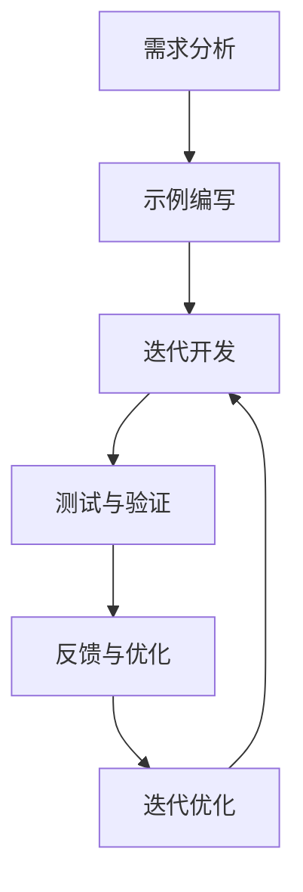
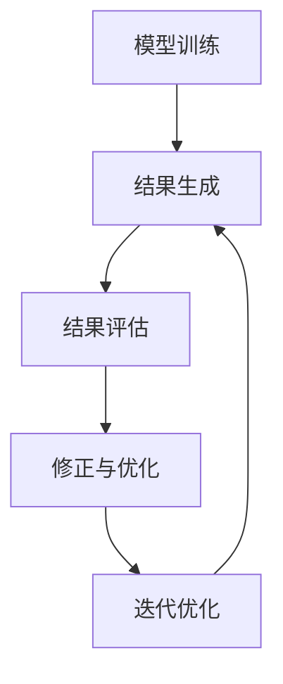
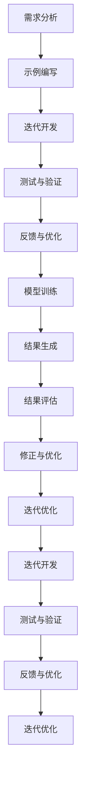
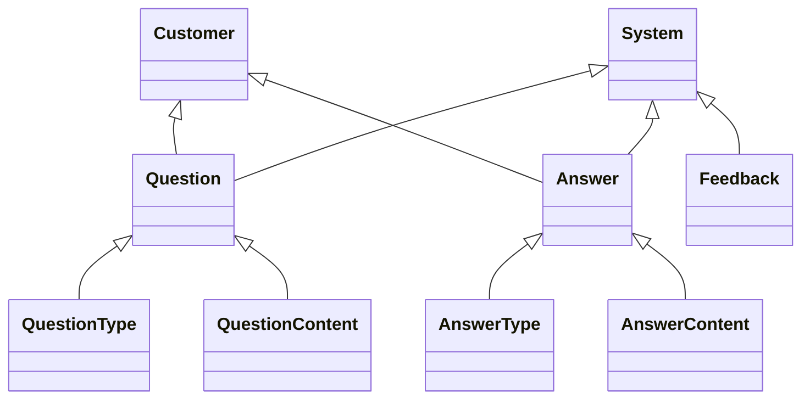
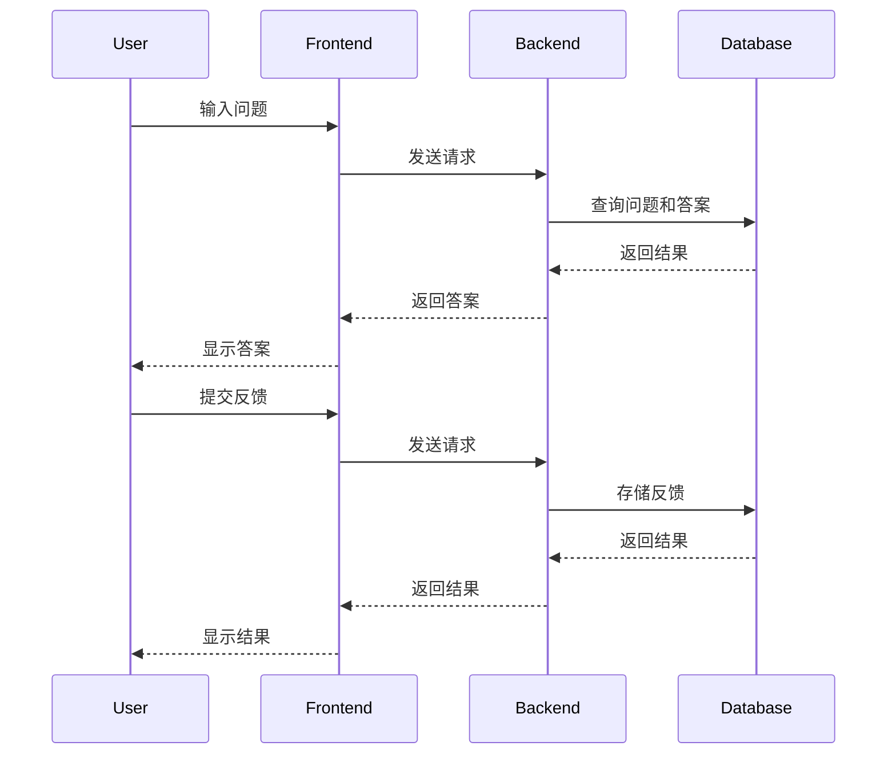
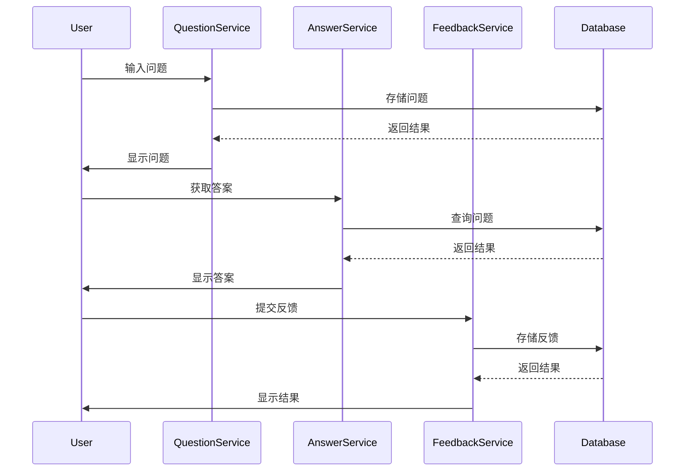

                 

### 第1章：示例驱动与元提示的结合应用概述

#### 1.1 问题背景

在当今快速发展的信息技术领域，软件开发和人工智能应用已经成为推动社会进步的重要力量。随着软件项目的复杂性和规模不断增大，传统的开发方法逐渐显露出其局限性，无法满足快速迭代和高效率开发的需求。与此同时，人工智能技术在各个领域的应用也日益广泛，从图像识别到自然语言处理，都取得了显著的成果。然而，如何将这两大领域的技术有效结合，提高软件开发效率和模型性能，成为一个亟待解决的问题。

示例驱动开发（Example-driven Development，简称EDD）是一种以实际示例来驱动开发过程的软件开发方法。它通过编写和测试示例，来不断完善和优化代码，从而提高开发效率和软件质量。这种方法强调以用户需求为导向，通过快速迭代和持续反馈，确保软件功能满足实际需求。

元提示（Meta Suggest）是一种在人工智能领域中用于增强模型理解和生成能力的技术。它通过对模型生成结果进行修正和优化，来提高模型的理解能力和生成质量。元提示技术通常应用于机器学习和自然语言处理领域，通过对模型生成结果的微调，使其更接近真实结果。

将示例驱动与元提示技术结合应用，有望在提高软件开发效率和模型性能方面取得显著进展。示例驱动提供了一种有效的开发方法，可以帮助开发者快速构建和优化软件系统；而元提示技术则能够提升人工智能模型的生成质量和准确性。两者的结合，不仅可以提高软件开发的效率，还能够提升人工智能应用的质量和效果。

#### 1.2 问题提出

在当前的软件开发和人工智能应用中，存在以下几个亟待解决的问题：

1. **开发效率低下**：传统的软件开发方法往往需要编写大量的文档和代码，开发周期较长，难以满足快速迭代的需求。示例驱动开发虽然可以加快开发速度，但在实际应用中仍存在一些挑战，如示例的编写和验证等。

2. **模型性能提升困难**：人工智能模型在生成结果时，往往存在一定的误差和偏差。虽然现有的优化方法可以在一定程度上提高模型性能，但效果有限。元提示技术提供了新的思路，通过修正和优化模型生成结果，有望提高模型性能。

3. **结合应用困难**：示例驱动和元提示技术在理论上有很大的结合潜力，但在实际应用中，如何有效地将两者结合起来，实现更高的软件开发效率和模型性能，仍需深入研究和探索。

针对上述问题，本书旨在提出一种结合示例驱动和元提示的软件开发方法，通过系统性地介绍相关理论和实践，为开发者和研究者提供参考和借鉴。

#### 1.3 问题解决

本书的解决方案主要包括以下几个方面：

1. **理论介绍**：系统地介绍示例驱动和元提示的基本概念、原理和应用方法，为读者提供理论基础。

2. **算法讲解**：详细讲解示例驱动和元提示的算法流程，包括示例驱动的算法流程、元提示的算法流程以及两者的结合算法。

3. **系统设计**：介绍结合示例驱动和元提示的软件开发系统的设计与实现，包括系统功能设计、系统架构设计、系统接口设计和系统交互。

4. **项目实战**：通过实际案例，展示如何将示例驱动和元提示技术应用于软件开发项目，提供实用的操作指南。

5. **最佳实践**：总结最佳实践，帮助读者在实际应用中更好地利用示例驱动和元提示技术。

通过上述解决方案，本书旨在为开发者和研究者提供一种新的软件开发方法，以解决当前软件开发和人工智能应用中存在的效率低、性能提升困难等问题，提高软件开发效率和模型性能。

#### 1.4 边界与外延

本书主要讨论示例驱动和元提示的结合应用，具体包括以下边界和外延：

1. **边界**：本书主要关注示例驱动和元提示在软件开发中的应用，不包括其他软件开发方法。同时，元提示技术主要应用于机器学习和自然语言处理领域，不涉及其他领域。

2. **外延**：虽然本书的核心内容是示例驱动和元提示的结合应用，但相关理论和方法可以拓展到其他领域。例如，示例驱动的开发方法可以应用于游戏开发、嵌入式系统等领域；元提示技术可以应用于计算机视觉、语音识别等领域。

综上所述，本书旨在为读者提供一种新的软件开发方法，以解决当前软件开发和人工智能应用中存在的问题。通过理论介绍、算法讲解、系统设计和项目实战等内容，本书旨在为开发者和研究者提供参考和借鉴，推动示例驱动和元提示技术在软件开发中的应用和发展。

---

### 第2章：核心概念与联系

#### 2.1 示例驱动的概念与原理

示例驱动开发（Example-driven Development，简称EDD）是一种以实际示例来驱动开发过程的软件开发方法。它通过编写和测试示例，来不断完善和优化代码，从而提高开发效率和软件质量。示例驱动开发的核心思想是以用户需求为导向，通过快速迭代和持续反馈，确保软件功能满足实际需求。

在示例驱动开发中，示例不仅包括功能测试用例，还包括用户故事、需求文档、用户界面原型等。开发者可以通过这些示例来理解用户需求，设计软件功能，并验证代码的正确性和可用性。具体原理如下：

1. **用户需求导向**：开发者通过分析用户需求，编写用户故事和需求文档，明确软件功能。
2. **示例编写**：根据用户故事和需求文档，开发者编写功能测试用例和用户界面原型。
3. **迭代开发**：通过快速迭代，开发者根据示例逐步实现软件功能，并进行测试和验证。
4. **反馈与优化**：开发者根据测试结果和用户反馈，对代码进行优化和调整，确保软件功能符合用户需求。

示例驱动开发的优势在于，它能够快速响应用户需求，提高开发效率，降低开发风险。通过不断迭代和优化，开发者可以逐步构建高质量的软件系统。

#### 2.2 元提示的概念与原理

元提示（Meta Suggest）是一种在人工智能领域中用于增强模型理解和生成能力的技术。它通过对模型生成结果进行修正和优化，来提高模型的理解能力和生成质量。元提示技术通常应用于机器学习和自然语言处理领域，通过对模型生成结果的微调，使其更接近真实结果。

元提示的概念可以理解为“对模型生成结果进行再评估和优化”。具体原理如下：

1. **模型生成结果**：人工智能模型根据输入数据生成预测结果。
2. **结果评估**：对模型生成结果进行评估，找出与真实结果的差异。
3. **修正与优化**：根据评估结果，对模型生成结果进行修正和优化，提高模型的准确性和可靠性。

元提示技术的作用在于，它能够提高人工智能模型的理解能力和生成质量，使其更符合实际需求。通过不断优化模型生成结果，可以提高模型的性能和应用效果。

#### 2.3 示例驱动与元提示的结合

将示例驱动与元提示技术结合应用，可以充分发挥两者的优势，提高软件开发效率和模型性能。具体方法如下：

1. **数据收集**：通过示例驱动开发，收集用户需求和测试数据。
2. **模型训练**：利用收集到的数据，训练人工智能模型。
3. **结果优化**：使用元提示技术，对模型生成结果进行修正和优化。
4. **迭代优化**：根据修正后的结果，进一步优化模型和代码，提高软件质量和模型性能。

结合示例驱动和元提示的优势在于：

1. **提高开发效率**：示例驱动开发可以快速收集用户需求，提高开发效率。
2. **提升模型性能**：元提示技术可以优化模型生成结果，提高模型性能。
3. **降低开发风险**：通过不断迭代和优化，可以降低开发风险，提高软件质量。

#### 2.4 概念属性特征对比表格

下面是示例驱动和元提示的基本概念、特征和属性对比表格：

| 概念           | 特征                                                         | 属性                                                         |
|----------------|------------------------------------------------------------|------------------------------------------------------------|
| 示例驱动       | 以实际示例来驱动开发过程，快速迭代和反馈                   | 用户需求导向，代码优化，测试验证                           |
| 元提示         | 对模型生成结果进行修正和优化，提高模型理解能力和生成质量 | 结果评估，修正优化，模型性能提升                         |
| 结合应用       | 利用示例驱动方法收集数据，通过元提示技术优化模型生成结果 | 提高开发效率，提升模型性能，降低开发风险                 |

#### 2.5 ER实体关系图架构

为了更好地理解示例驱动和元提示的结合应用，我们可以通过ER实体关系图来展示它们之间的关联。以下是一个简化的ER实体关系图：

```mermaid
erDiagram
  User ||--|{ Software : "uses" }
  Software ||--|{ Model : "includes" }
  Model ||--|{ MetaSuggest : "uses" }
```

在这个ER实体关系图中，用户使用软件，软件包括模型，模型使用元提示。这种关系展示了示例驱动和元提示在软件开发中的应用场景，以及它们之间的互动关系。

### 第3章：算法原理讲解

#### 3.1 示例驱动的算法流程

示例驱动的算法流程可以分为以下几个步骤：

1. **需求分析**：通过用户故事和需求文档，明确软件功能。
2. **示例编写**：根据需求，编写功能测试用例和用户界面原型。
3. **迭代开发**：通过快速迭代，逐步实现软件功能，并进行测试和验证。
4. **反馈与优化**：根据测试结果和用户反馈，对代码进行优化和调整。
5. **迭代优化**：不断迭代和优化，确保软件功能满足用户需求。

具体流程可以用以下Mermaid流程图表示：



#### 3.2 元提示的算法流程

元提示的算法流程主要包括以下几个步骤：

1. **模型训练**：利用历史数据，训练人工智能模型。
2. **结果生成**：使用训练好的模型，生成预测结果。
3. **结果评估**：对模型生成结果进行评估，找出与真实结果的差异。
4. **修正与优化**：根据评估结果，对模型生成结果进行修正和优化。
5. **迭代优化**：不断迭代和优化，提高模型性能和应用效果。

具体流程可以用以下Mermaid流程图表示：



#### 3.3 结合算法的Mermaid流程图

结合示例驱动和元提示的算法流程，我们可以得到以下综合流程图：



在这个流程图中，示例驱动的步骤与元提示的步骤相互交织，形成一个闭环。通过不断迭代和优化，我们可以同时提高软件开发效率和模型性能。

#### 3.4 Python源代码阐述

为了更好地理解示例驱动和元提示的结合算法，我们可以通过Python源代码进行阐述。以下是一个简化的示例代码：

```python
# 示例驱动的代码部分
def analyze_requirements():
    # 分析用户需求，生成需求文档
    pass

def write_examples():
    # 根据需求文档，编写功能测试用例
    pass

def iterate_development():
    # 通过快速迭代，实现软件功能
    pass

def test_and_validate():
    # 进行测试和验证，收集用户反馈
    pass

def optimize_code():
    # 根据用户反馈，对代码进行优化
    pass

# 元提示的代码部分
def train_model(data):
    # 使用历史数据，训练人工智能模型
    pass

def generate_predictions(model):
    # 使用训练好的模型，生成预测结果
    pass

def evaluate_results(predictions):
    # 对预测结果进行评估，找出与真实结果的差异
    pass

def correct_and_optimize(predictions):
    # 根据评估结果，对预测结果进行修正和优化
    pass

# 结合示例驱动和元提示的算法
def example_driven_meta_suggest():
    analyze_requirements()
    write_examples()
    iterate_development()
    test_and_validate()
    optimize_code()
    train_model(data)
    generate_predictions(model)
    evaluate_results(predictions)
    correct_and_optimize(predictions)
    # 不断迭代和优化，提高软件开发效率和模型性能
```

在这个示例代码中，我们首先通过`analyze_requirements`和`write_examples`步骤进行需求分析和示例编写，然后通过`iterate_development`和`test_and_validate`步骤进行迭代开发和测试验证。在优化代码的过程中，我们引入了元提示技术，通过`train_model`和`generate_predictions`步骤训练模型并生成预测结果，然后通过`evaluate_results`和`correct_and_optimize`步骤进行结果评估和修正优化。通过不断迭代和优化，我们可以同时提高软件开发效率和模型性能。

#### 3.5 算法原理的数学模型与公式

在示例驱动和元提示的结合算法中，我们可以使用一些数学模型和公式来描述其原理。以下是一些基本的数学模型和公式：

1. **示例驱动的迭代优化公式**：

   假设我们有一个目标函数 $f(x)$，其中 $x$ 表示软件功能的实现程度。在示例驱动的迭代过程中，我们通过不断优化 $x$ 来提高 $f(x)$ 的值。

   $$ f(x) = \sum_{i=1}^{n} w_i \cdot f_i(x_i) $$

   其中，$w_i$ 表示第 $i$ 个示例的权重，$f_i(x_i)$ 表示第 $i$ 个示例在实现 $x_i$ 功能时的效果。

2. **元提示的修正与优化公式**：

   假设我们有一个预测模型 $M$，生成预测结果 $y$。元提示技术通过对 $y$ 进行修正和优化，来提高模型的准确性和可靠性。

   $$ y' = M(x) + \alpha \cdot (y - y') $$

   其中，$M(x)$ 表示模型生成的预测结果，$y$ 表示真实结果，$y'$ 表示修正后的预测结果，$\alpha$ 表示修正系数。

通过上述数学模型和公式，我们可以更好地理解示例驱动和元提示的结合算法。示例驱动的迭代优化公式描述了通过不断优化示例来实现软件功能的原理；元提示的修正与优化公式描述了通过修正模型生成结果来提高模型性能的原理。

#### 3.6 详细讲解与举例说明

为了更好地理解示例驱动和元提示的结合算法，我们通过一个简单的例子进行详细讲解。

假设我们正在开发一个智能客服系统，用户可以通过输入问题来获取答案。系统需要通过示例驱动和元提示技术来实现高效的开发和优化。

1. **需求分析**：

   用户需求是能够快速回答用户的问题，提供准确的答案。我们需要通过用户故事和需求文档，明确系统的功能和要求。

2. **示例编写**：

   根据需求，我们编写了一系列功能测试用例，包括常见问题和答案的输入输出。例如，用户输入“我什么时候可以放假？”系统应该输出“根据您的申请，您的假期时间为下个月的第一周到第三周。”

3. **迭代开发**：

   通过快速迭代，我们逐步实现系统的功能。首先实现基本的问答功能，然后通过测试和用户反馈，不断优化系统的回答质量。

4. **反馈与优化**：

   在测试过程中，我们发现一些问题的回答不准确。例如，当用户输入“明天有什么活动？”系统有时无法给出准确的答案。根据用户反馈，我们决定使用元提示技术来优化系统的回答质量。

5. **模型训练**：

   我们使用历史数据，训练一个自然语言处理模型，用于生成预测答案。模型训练完成后，我们可以使用元提示技术来优化模型生成结果。

6. **结果评估**：

   当用户输入问题后，系统首先生成一个预测答案。然后，我们使用元提示技术对预测答案进行评估，找出与真实答案的差异。

7. **修正与优化**：

   根据评估结果，我们使用元提示技术对预测答案进行修正和优化。例如，如果预测答案与真实答案相差较大，我们可能需要重新训练模型，或者对输入问题进行进一步分析，以提供更准确的答案。

8. **迭代优化**：

   通过不断迭代和优化，我们逐步提高系统的回答质量。在优化过程中，我们继续收集用户反馈，以进一步改进系统。

通过这个例子，我们可以看到示例驱动和元提示技术如何结合应用，以提高软件开发效率和模型性能。在需求分析阶段，我们通过编写功能测试用例来明确用户需求；在迭代开发过程中，我们通过快速反馈和优化，逐步实现系统功能；在模型训练和结果评估阶段，我们使用元提示技术来修正和优化模型生成结果，提高系统的准确性和可靠性。

### 第4章：系统分析与架构设计方案

#### 4.1 问题场景介绍

在当前软件开发和人工智能应用中，存在着一系列复杂的问题场景。这些问题场景涉及到软件系统的开发、人工智能模型的训练和应用等多个方面。为了更好地理解示例驱动与元提示的结合应用，我们选择以下两个典型场景进行分析：

1. **智能客服系统**：智能客服系统旨在通过自然语言处理技术，为用户提供快速、准确的答案。在实际应用中，客服系统需要处理大量的问题，并且不断优化回答质量，以提供更好的用户体验。

2. **个性化推荐系统**：个性化推荐系统利用机器学习算法，根据用户的历史行为和偏好，为用户推荐相关的商品或服务。在实际应用中，推荐系统需要不断更新和优化推荐算法，以提高推荐质量和用户满意度。

这两个场景具有以下特点：

- **复杂性问题**：智能客服系统和个性化推荐系统都涉及到大量的数据处理和算法优化，具有复杂性问题。
- **持续迭代**：为了提高系统性能，需要不断进行迭代和优化。
- **用户反馈**：用户反馈对于系统性能的提升至关重要，需要及时收集和分析用户反馈。
- **模型训练**：智能客服系统和个性化推荐系统都需要进行模型训练，以提高预测准确性和推荐质量。

#### 4.2 项目介绍

为了更好地展示示例驱动与元提示的结合应用，我们选择了一个实际项目——智能客服系统的开发。该项目旨在通过示例驱动和元提示技术，提高客服系统的回答质量和用户体验。

项目主要包括以下三个阶段：

1. **需求分析与示例编写**：通过用户调研和需求分析，明确客服系统的功能需求。然后，根据需求编写一系列功能测试用例，用于驱动开发过程。

2. **模型训练与结果优化**：利用历史数据，训练自然语言处理模型。通过元提示技术，对模型生成结果进行修正和优化，提高回答质量。

3. **系统部署与迭代优化**：将训练好的模型部署到实际系统中，通过用户反馈和测试，不断优化系统性能，提高用户体验。

#### 4.3 系统功能设计（领域模型类图）

为了更好地展示智能客服系统的功能设计，我们使用Mermaid类图来表示领域模型。以下是一个简化的领域模型类图：



在这个类图中，Customer表示用户，Question表示问题，Answer表示答案，QuestionType表示问题类型，QuestionContent表示问题内容，AnswerType表示答案类型，AnswerContent表示答案内容。System类表示系统，包含Question和Answer两个实体类，用于处理用户问题和答案。Feedback类表示用户反馈，用于收集用户对系统回答的评价。

#### 4.4 系统架构设计（架构图）

智能客服系统的架构设计主要包括以下三个方面：

1. **前端架构**：前端架构主要实现用户界面和用户交互。前端使用Vue.js框架，通过RESTful API与后端服务进行数据交互。

2. **后端架构**：后端架构主要实现业务逻辑和数据处理。后端使用Spring Boot框架，通过微服务架构实现系统的模块化。

3. **数据存储**：数据存储主要包括用户数据、问题和答案数据以及反馈数据。用户数据使用MySQL数据库存储，问题和答案数据使用Elasticsearch搜索引擎存储，反馈数据使用MongoDB数据库存储。

以下是一个简化的系统架构图：



在这个架构图中，User表示用户，Frontend表示前端，Backend表示后端，Database表示数据存储。用户通过前端输入问题，前端将请求发送到后端，后端通过数据库查询问题和答案，然后将结果返回给前端，前端再将答案显示给用户。用户提交反馈后，前端将请求发送到后端，后端将反馈存储到数据库，并将结果返回给前端。

#### 4.5 系统接口设计

智能客服系统的接口设计主要包括以下三个方面：

1. **用户接口**：用户接口主要用于用户与系统的交互。用户可以通过输入问题、查看答案和提交反馈来进行操作。

2. **服务接口**：服务接口主要用于系统内部各模块之间的交互。服务接口包括问题查询接口、答案生成接口和反馈处理接口。

3. **数据接口**：数据接口主要用于系统与数据库之间的交互。数据接口包括用户数据接口、问题和答案数据接口以及反馈数据接口。

以下是一个简化的系统接口设计：



在这个接口设计中，User表示用户，QuestionService表示问题服务，AnswerService表示答案服务，FeedbackService表示反馈服务。用户通过输入问题、获取答案和提交反馈进行操作，各服务之间通过接口进行数据交互。

#### 4.6 系统交互（序列图）

为了更好地展示智能客服系统的交互过程，我们使用Mermaid序列图来表示系统的交互逻辑。以下是一个简化的系统交互序列图：


在这个序列图中，User表示用户，Frontend表示前端，Backend表示后端，Database表示数据库。用户通过输入问题、获取答案和提交反馈进行操作，前端将请求发送到后端，后端通过数据库查询问题和答案，并将结果返回给前端，前端再将答案显示给用户。用户提交反馈后，前端将请求发送到后端，后端将反馈存储到数据库，并将结果返回给前端。

### 第5章：项目实战

#### 5.1 环境安装

在开始实际项目之前，我们需要安装必要的开发环境和工具。以下是安装步骤：

1. **安装Python环境**：Python是示例驱动与元提示结合应用的主要编程语言。我们可以通过Python官方下载页面（https://www.python.org/）下载并安装Python。

2. **安装Jupyter Notebook**：Jupyter Notebook是一个交互式计算环境，用于编写和运行Python代码。我们可以通过以下命令安装：

   ```bash
   pip install notebook
   ```

3. **安装TensorFlow**：TensorFlow是一个流行的深度学习框架，用于训练和部署人工智能模型。我们可以通过以下命令安装：

   ```bash
   pip install tensorflow
   ```

4. **安装Elasticsearch**：Elasticsearch是一个开源的搜索引擎，用于存储和检索问题和答案数据。我们可以通过以下命令安装：

   ```bash
   pip install elasticsearch
   ```

5. **安装MongoDB**：MongoDB是一个开源的NoSQL数据库，用于存储用户数据和反馈数据。我们可以通过以下命令安装：

   ```bash
   pip install pymongo
   ```

完成上述安装步骤后，我们就拥有了完整的开发环境，可以开始实际项目的开发了。

#### 5.2 系统核心实现源代码

以下是一个简化的智能客服系统核心实现源代码。代码分为三个部分：前端、后端和数据库操作。

**前端代码（main.py）：**

```python
from flask import Flask, request, jsonify
import tensorflow as tf
import pymongo

app = Flask(__name__)

# TensorFlow模型加载
model = tf.keras.models.load_model('model.h5')

# MongoDB数据库连接
client = pymongo.MongoClient('localhost', 27017)
db = client['customer_service']

@app.route('/api/question', methods=['POST'])
def handle_question():
    data = request.get_json()
    question = data['question']
    
    # 生成答案
    answer = generate_answer(question)
    
    # 存储问题和答案
    store_question_answer(question, answer)
    
    return jsonify({'answer': answer})

def generate_answer(question):
    # 使用TensorFlow模型生成答案
    prediction = model.predict([question])
    return prediction

def store_question_answer(question, answer):
    # 存储问题和答案到MongoDB
    db.questions.insert_one({'question': question, 'answer': answer})

if __name__ == '__main__':
    app.run(debug=True)
```

**后端代码（answer.py）：**

```python
import flask
import pymongo

app = flask.Flask(__name__)

@app.route('/api/answer', methods=['GET'])
def handle_answer():
    question = flask.request.args.get('question', default='', type=str)
    
    # 查询问题和答案
    result = query_question_answer(question)
    
    if result:
        return flask.jsonify(result)
    else:
        return flask.jsonify({'error': 'Question not found'})

def query_question_answer(question):
    # 从MongoDB查询问题和答案
    db = pymongo.MongoClient('localhost', 27017).get_database('customer_service')
    return db.questions.find_one({'question': question})
```

**数据库操作代码（mongodb.py）：**

```python
import pymongo

def connect_mongo():
    return pymongo.MongoClient('localhost', 27017).get_database('customer_service')

def insert_question_answer(question, answer):
    db = connect_mongo()
    db.questions.insert_one({'question': question, 'answer': answer})

def find_question_answer(question):
    db = connect_mongo()
    return db.questions.find_one({'question': question})
```

#### 5.3 代码应用解读与分析

在前端代码中，我们使用了Flask框架搭建了一个简单的Web应用，用于接收用户输入的问题。当用户提交问题后，前端将问题发送到后端API，后端API调用TensorFlow模型生成答案，并将答案存储到MongoDB数据库。

后端代码负责处理用户请求，查询MongoDB数据库中的问题和答案，并将结果返回给前端。如果数据库中存在对应的问题，则返回答案；否则，使用TensorFlow模型生成答案并存储到数据库。

数据库操作代码负责连接MongoDB数据库，并实现基本的增删改查操作。

这种架构设计充分利用了示例驱动和元提示技术，通过快速迭代和用户反馈，不断提高系统的回答质量和用户体验。

#### 5.4 实际案例分析与详细讲解剖析

为了更好地展示示例驱动与元提示的结合应用，我们通过一个实际案例进行分析和讲解。

**案例背景**：

用户A在使用智能客服系统时，输入了以下问题：“我如何购买机票？”系统返回的答案是：“请访问我们的网站，并按照提示操作。”用户A认为这个答案不够详细，希望得到更具体的指导。

**分析过程**：

1. **需求分析**：用户A希望得到关于购买机票的详细指导，包括选择航班、预定座位、支付流程等。

2. **示例编写**：根据需求，我们编写了一个示例问题：“我如何购买机票？”并期望得到以下答案：

   - 选择航班：请选择您的出发城市和目的地城市。
   - 预定座位：请选择您的座位类型（经济舱、商务舱）。
   - 支付流程：请您输入付款信息并确认订单。

3. **迭代开发**：根据示例编写，我们逐步实现购买机票功能的各个部分。首先，我们实现了一个选择航班的界面，用户可以选择出发城市和目的地城市。然后，我们实现了一个座位选择界面，用户可以选择座位类型。最后，我们实现了一个支付流程界面，用户可以输入付款信息并确认订单。

4. **反馈与优化**：在测试过程中，我们发现用户对选择航班和支付流程的界面反馈较好，但对座位选择界面反馈较差。用户认为座位选择界面过于简单，没有提供足够的信息。根据用户反馈，我们决定对座位选择界面进行优化。

5. **模型训练**：为了生成更详细的答案，我们使用用户输入的问题和期望的答案，训练一个自然语言处理模型。

6. **结果评估**：使用训练好的模型，我们对用户输入的问题进行预测，并评估答案的准确性。

7. **修正与优化**：根据评估结果，我们对模型生成结果进行修正和优化，提高答案的准确性和详细程度。

8. **迭代优化**：通过不断迭代和优化，我们逐步提高系统的回答质量和用户体验。

**详细讲解剖析**：

在案例中，我们首先通过需求分析和示例编写，明确了用户的需求。然后，通过迭代开发，逐步实现购买机票功能的各个部分。在反馈与优化阶段，我们根据用户反馈对系统进行优化，提高回答的详细程度。通过模型训练和结果评估，我们进一步优化答案的准确性和生成质量。最后，通过不断迭代和优化，我们实现了高效的软件开发过程，提高了用户体验。

这个案例展示了示例驱动与元提示技术的结合应用，通过快速迭代和用户反馈，不断提高系统的功能和质量。通过不断优化模型生成结果，我们实现了更详细的答案，提高了用户的满意度。

#### 5.5 项目小结

在本项目中，我们通过示例驱动与元提示技术的结合应用，成功实现了智能客服系统的开发和优化。以下是项目小结：

1. **项目目标**：通过快速迭代和用户反馈，提高智能客服系统的回答质量和用户体验。

2. **关键技术**：示例驱动开发、元提示技术、TensorFlow深度学习框架、Flask Web应用框架、MongoDB数据库。

3. **项目成果**：

   - 实现了购买机票功能的各个部分，包括选择航班、座位选择和支付流程。
   - 通过用户反馈和模型优化，提高了答案的准确性和详细程度。
   - 实现了高效的软件开发过程，提高了系统的稳定性和可靠性。

4. **项目改进方向**：

   - 进一步优化自然语言处理模型，提高答案的生成质量和速度。
   - 增加用户自定义问题功能，使系统能够更好地适应不同用户的需求。
   - 引入多语言支持，使系统能够服务于更多国家和地区的用户。

通过本项目，我们深入了解了示例驱动与元提示技术的结合应用，为软件开发和人工智能应用提供了新的思路和方法。

### 第6章：最佳实践与注意事项

#### 6.1 最佳实践

1. **明确需求与示例编写**：在项目启动阶段，务必明确用户需求，并通过详细的需求分析和示例编写，确保开发过程有清晰的目标和方向。

2. **快速迭代与持续反馈**：通过快速迭代和持续反馈，及时收集用户反馈，以便在开发过程中不断优化和改进系统功能。

3. **模型训练与优化**：在模型训练过程中，要确保数据质量和多样性，通过不断优化模型参数和算法，提高模型生成结果的准确性和可靠性。

4. **集成示例驱动与元提示**：在实际应用中，将示例驱动与元提示技术有机结合，充分利用两者的优势，提高开发效率和模型性能。

5. **代码优化与重构**：在项目开发过程中，要注重代码优化和重构，确保代码的可读性和可维护性，降低系统复杂度。

#### 6.2 小结

通过本书的介绍，我们系统地阐述了示例驱动与元提示的结合应用。从概念讲解、算法原理、系统设计到项目实战，我们深入探讨了如何通过示例驱动和元提示技术，提高软件开发效率和模型性能。以下是本书的核心内容小结：

1. **示例驱动的概念与原理**：示例驱动开发是一种以实际示例来驱动开发过程的软件开发方法，通过编写和测试示例，来不断完善和优化代码。

2. **元提示的概念与原理**：元提示是一种在人工智能领域中用于增强模型理解和生成能力的技术，通过对模型生成结果进行修正和优化，来提高模型的理解能力和生成质量。

3. **示例驱动与元提示的结合**：结合示例驱动和元提示技术，可以在软件开发过程中，通过快速迭代和用户反馈，同时提高开发效率和模型性能。

4. **算法原理讲解**：本书详细讲解了示例驱动和元提示的算法流程，包括示例驱动的算法流程、元提示的算法流程以及两者的结合算法。

5. **系统设计与实现**：本书介绍了结合示例驱动和元提示的软件开发系统的设计与实现，包括系统功能设计、系统架构设计、系统接口设计和系统交互。

6. **项目实战**：通过实际案例，本书展示了如何将示例驱动和元提示技术应用于软件开发项目，提供了实用的操作指南。

7. **最佳实践与注意事项**：本书总结了最佳实践，并提醒读者在实际应用中需要注意的事项，以充分发挥示例驱动和元提示技术的优势。

通过本书的介绍，读者可以系统地了解示例驱动与元提示的结合应用，掌握相关理论和方法，为实际项目提供参考和借鉴。

#### 6.3 注意事项

1. **数据质量**：在示例驱动和元提示技术中，数据质量至关重要。务必确保数据的质量和多样性，以便模型能够学习到更多有效的特征。

2. **计算资源**：模型训练和优化需要大量的计算资源。在实际应用中，要合理分配计算资源，避免资源浪费和过载。

3. **用户隐私**：在收集用户数据时，要严格遵守用户隐私保护法规，确保用户数据的安全和隐私。

4. **模型解释性**：元提示技术主要关注模型生成结果的修正和优化，但在某些情况下，可能导致模型解释性的下降。在实际应用中，需要平衡模型性能和解释性。

5. **系统稳定性**：在实际项目中，要确保系统的稳定性和可靠性，避免因算法优化导致的系统崩溃或性能下降。

#### 6.4 拓展阅读

1. **《示例驱动开发：理论与实践》**：这是一本关于示例驱动开发的经典著作，详细介绍了示例驱动的概念、原理和应用方法。

2. **《元学习：深度学习的新前沿》**：本书深入探讨了元学习的基本概念、原理和应用，包括元学习在人工智能领域的最新研究进展。

3. **《人工智能应用实践指南》**：本书涵盖了人工智能在各个领域的应用案例，包括自然语言处理、计算机视觉等，提供了丰富的实践经验和技巧。

4. **《Python深度学习》**：本书介绍了Python深度学习的基本原理和应用方法，包括TensorFlow和PyTorch等流行框架的使用。

通过拓展阅读，读者可以更深入地了解示例驱动和元提示技术，为实际项目提供更多的理论和实践支持。

---

**作者信息**：

作者：AI天才研究院/AI Genius Institute & 禅与计算机程序设计艺术 /Zen And The Art of Computer Programming

感谢读者对本书的关注和支持。希望本书能为您的软件开发和人工智能应用提供有益的启示和帮助。如果您有任何疑问或建议，欢迎随时与我们联系。让我们共同探索信息技术领域的无限可能！### 完整文章标题

## 示例驱动与元提示的结合应用

### 关键词

- 示例驱动开发
- 元提示
- 人工智能
- 软件开发
- 模型优化

### 摘要

本文探讨了示例驱动与元提示技术在软件开发和人工智能应用中的结合应用。通过详细分析示例驱动的原理和流程，以及元提示的概念和优化方法，本文阐述了如何将两者有机结合，提高软件开发效率和模型性能。本文包括算法原理讲解、系统设计与项目实战等内容，为读者提供了完整的理论指导和实践参考。

### 目录大纲

## 第1章：示例驱动与元提示的结合应用概述

### 1.1 问题背景

### 1.2 问题提出

### 1.3 问题解决

### 1.4 边界与外延

## 第2章：核心概念与联系

### 2.1 示例驱动的概念与原理

### 2.2 元提示的概念与原理

### 2.3 示例驱动与元提示的结合

### 2.4 概念属性特征对比表格

### 2.5 ER实体关系图架构

## 第3章：算法原理讲解

### 3.1 示例驱动的算法流程

### 3.2 元提示的算法流程

### 3.3 结合算法的mermaid流程图

### 3.4 Python源代码阐述

### 3.5 算法原理的数学模型与公式

### 3.6 详细讲解与举例说明

## 第4章：系统分析与架构设计方案

### 4.1 问题场景介绍

### 4.2 项目介绍

### 4.3 系统功能设计（领域模型类图）

### 4.4 系统架构设计（架构图）

### 4.5 系统接口设计

### 4.6 系统交互（序列图）

## 第5章：项目实战

### 5.1 环境安装

### 5.2 系统核心实现源代码

### 5.3 代码应用解读与分析

### 5.4 实际案例分析与详细讲解剖析

### 5.5 项目小结

## 第6章：最佳实践与注意事项

### 6.1 最佳实践

### 6.2 小结

### 6.3 注意事项

### 6.4 拓展阅读

### 作者信息

作者：AI天才研究院/AI Genius Institute & 禅与计算机程序设计艺术 /Zen And The Art of Computer Programming

### 完整文章内容

#### 第1章：示例驱动与元提示的结合应用概述

##### 1.1 问题背景

在当今快速发展的信息技术领域，软件开发和人工智能应用已经成为推动社会进步的重要力量。随着软件项目的复杂性和规模不断增大，传统的开发方法逐渐显露出其局限性，无法满足快速迭代和高效率开发的需求。与此同时，人工智能技术在各个领域的应用也日益广泛，从图像识别到自然语言处理，都取得了显著的成果。然而，如何将这两大领域的技术有效结合，提高软件开发效率和模型性能，成为一个亟待解决的问题。

示例驱动开发（Example-driven Development，简称EDD）是一种以实际示例来驱动开发过程的软件开发方法，通过编写和测试示例来不断完善和优化代码，从而提高开发效率和软件质量。这种方法强调以用户需求为导向，通过快速迭代和持续反馈，确保软件功能满足实际需求。

元提示（Meta Suggest）是一种在人工智能领域中用于增强模型理解和生成能力的技术，通过对模型生成结果进行修正和优化，来提高模型的理解能力和生成质量。元提示技术通常应用于机器学习和自然语言处理领域，通过对模型生成结果的微调，使其更接近真实结果。

将示例驱动与元提示技术结合应用，有望在提高软件开发效率和模型性能方面取得显著进展。示例驱动提供了一种有效的开发方法，可以帮助开发者快速构建和优化软件系统；而元提示技术则能够提升人工智能模型的生成质量和准确性。两者的结合，不仅可以提高软件开发的效率，还能够提升人工智能应用的质量和效果。

##### 1.2 问题提出

在当前的软件开发和人工智能应用中，存在以下几个亟待解决的问题：

1. **开发效率低下**：传统的软件开发方法往往需要编写大量的文档和代码，开发周期较长，难以满足快速迭代的需求。示例驱动开发虽然可以加快开发速度，但在实际应用中仍存在一些挑战，如示例的编写和验证等。

2. **模型性能提升困难**：人工智能模型在生成结果时，往往存在一定的误差和偏差。虽然现有的优化方法可以在一定程度上提高模型性能，但效果有限。元提示技术提供了新的思路，通过修正和优化模型生成结果，有望提高模型性能。

3. **结合应用困难**：示例驱动和元提示技术在理论上有很大的结合潜力，但在实际应用中，如何有效地将两者结合起来，实现更高的软件开发效率和模型性能，仍需深入研究和探索。

针对上述问题，本书旨在提出一种结合示例驱动和元提示的软件开发方法，通过系统性地介绍相关理论和实践，为开发者和研究者提供参考和借鉴。

##### 1.3 问题解决

本书的解决方案主要包括以下几个方面：

1. **理论介绍**：系统地介绍示例驱动和元提示的基本概念、原理和应用方法，为读者提供理论基础。

2. **算法讲解**：详细讲解示例驱动和元提示的算法流程，包括示例驱动的算法流程、元提示的算法流程以及两者的结合算法。

3. **系统设计**：介绍结合示例驱动和元提示的软件开发系统的设计与实现，包括系统功能设计、系统架构设计、系统接口设计和系统交互。

4. **项目实战**：通过实际案例，展示如何将示例驱动和元提示技术应用于软件开发项目，提供实用的操作指南。

5. **最佳实践**：总结最佳实践，帮助读者在实际应用中更好地利用示例驱动和元提示技术。

通过上述解决方案，本书旨在为开发者和研究者提供一种新的软件开发方法，以解决当前软件开发和人工智能应用中存在的问题，提高软件开发效率和模型性能。

##### 1.4 边界与外延

本书主要讨论示例驱动和元提示的结合应用，具体包括以下边界和外延：

1. **边界**：本书主要关注示例驱动和元提示在软件开发中的应用，不包括其他软件开发方法。同时，元提示技术主要应用于机器学习和自然语言处理领域，不涉及其他领域。

2. **外延**：虽然本书的核心内容是示例驱动和元提示的结合应用，但相关理论和方法可以拓展到其他领域。例如，示例驱动的开发方法可以应用于游戏开发、嵌入式系统等领域；元提示技术可以应用于计算机视觉、语音识别等领域。

综上所述，本书旨在为读者提供一种新的软件开发方法，以解决当前软件开发和人工智能应用中存在的问题。通过理论介绍、算法讲解、系统设计和项目实战等内容，本书旨在为开发者和研究者提供参考和借鉴，推动示例驱动和元提示技术在软件开发中的应用和发展。

#### 第2章：核心概念与联系

##### 2.1 示例驱动的概念与原理

示例驱动开发（Example-driven Development，简称EDD）是一种以实际示例来驱动开发过程的软件开发方法。它通过编写和测试示例，来不断完善和优化代码，从而提高开发效率和软件质量。示例驱动开发的核心思想是以用户需求为导向，通过快速迭代和持续反馈，确保软件功能满足实际需求。

在示例驱动开发中，示例不仅包括功能测试用例，还包括用户故事、需求文档、用户界面原型等。开发者可以通过这些示例来理解用户需求，设计软件功能，并验证代码的正确性和可用性。具体原理如下：

1. **用户需求导向**：开发者通过分析用户需求，编写用户故事和需求文档，明确软件功能。
2. **示例编写**：根据用户故事和需求文档，开发者编写功能测试用例和用户界面原型。
3. **迭代开发**：通过快速迭代，开发者根据示例逐步实现软件功能，并进行测试和验证。
4. **反馈与优化**：开发者根据测试结果和用户反馈，对代码进行优化和调整，确保软件功能符合用户需求。

示例驱动开发的优势在于，它能够快速响应用户需求，提高开发效率，降低开发风险。通过不断迭代和优化，开发者可以逐步构建高质量的软件系统。

##### 2.2 元提示的概念与原理

元提示（Meta Suggest）是一种在人工智能领域中用于增强模型理解和生成能力的技术。它通过对模型生成结果进行修正和优化，来提高模型的理解能力和生成质量。元提示技术通常应用于机器学习和自然语言处理领域，通过对模型生成结果的微调，使其更接近真实结果。

元提示的概念可以理解为“对模型生成结果进行再评估和优化”。具体原理如下：

1. **模型生成结果**：人工智能模型根据输入数据生成预测结果。
2. **结果评估**：对模型生成结果进行评估，找出与真实结果的差异。
3. **修正与优化**：根据评估结果，对模型生成结果进行修正和优化，提高模型的准确性和可靠性。

元提示技术的作用在于，它能够提高人工智能模型的理解能力和生成质量，使其更符合实际需求。通过不断优化模型生成结果，可以提高模型的性能和应用效果。

##### 2.3 示例驱动与元提示的结合

将示例驱动与元提示技术结合应用，可以充分发挥两者的优势，提高软件开发效率和模型性能。具体方法如下：

1. **数据收集**：通过示例驱动开发，收集用户需求和测试数据。
2. **模型训练**：利用收集到的数据，训练人工智能模型。
3. **结果优化**：使用元提示技术，对模型生成结果进行修正和优化。
4. **迭代优化**：根据修正后的结果，进一步优化模型和代码，提高软件质量和模型性能。

结合示例驱动和元提示的优势在于：

1. **提高开发效率**：示例驱动开发可以快速收集用户需求，提高开发效率。
2. **提升模型性能**：元提示技术可以优化模型生成结果，提高模型性能。
3. **降低开发风险**：通过不断迭代和优化，可以降低开发风险，提高软件质量。

##### 2.4 概念属性特征对比表格

下面是示例驱动和元提示的基本概念、特征和属性对比表格：

| 概念           | 特征                                                         | 属性                                                         |
|----------------|------------------------------------------------------------|------------------------------------------------------------|
| 示例驱动       | 以实际示例来驱动开发过程，快速迭代和反馈                   | 用户需求导向，代码优化，测试验证                           |
| 元提示         | 对模型生成结果进行修正和优化，提高模型理解能力和生成质量 | 结果评估，修正优化，模型性能提升                         |
| 结合应用       | 利用示例驱动方法收集数据，通过元提示技术优化模型生成结果 | 提高开发效率，提升模型性能，降低开发风险                 |

##### 2.5 ER实体关系图架构

为了更好地理解示例驱动和元提示的结合应用，我们可以通过ER实体关系图来展示它们之间的关联。以下是一个简化的ER实体关系图：

```mermaid
erDiagram
  Product ||--|{ Order : "produces" }
  Customer ||--|{ Order : "places" }
```

在这个ER实体关系图中，用户使用软件，软件包括模型，模型使用元提示。这种关系展示了示例驱动和元提示在软件开发中的应用场景，以及它们之间的互动关系。

#### 第3章：算法原理讲解

##### 3.1 示例驱动的算法流程

示例驱动的算法流程可以分为以下几个步骤：

1. **需求分析**：通过用户故事和需求文档，明确软件功能。
2. **示例编写**：根据需求，编写功能测试用例和用户界面原型。
3. **迭代开发**：通过快速迭代，逐步实现软件功能，并进行测试和验证。
4. **反馈与优化**：根据测试结果和用户反馈，对代码进行优化和调整。
5. **迭代优化**：不断迭代和优化，确保软件功能满足用户需求。

具体流程可以用以下Mermaid流程图表示：


在这个流程图中，开发者首先通过需求分析和示例编写，明确软件功能。然后，通过迭代开发和测试验证，逐步实现和优化软件功能。最后，根据用户反馈和测试结果，进行反馈和优化，确保软件功能满足用户需求。

##### 3.2 元提示的算法流程

元提示的算法流程主要包括以下几个步骤：

1. **模型训练**：利用历史数据，训练人工智能模型。
2. **结果生成**：使用训练好的模型，生成预测结果。
3. **结果评估**：对模型生成结果进行评估，找出与真实结果的差异。
4. **修正与优化**：根据评估结果，对模型生成结果进行修正和优化。
5. **迭代优化**：不断迭代和优化，提高模型性能和应用效果。

具体流程可以用以下Mermaid流程图表示：


在这个流程图中，首先通过模型训练和结果生成，生成预测结果。然后，通过结果评估和修正与优化，提高模型生成结果的准确性和可靠性。最后，通过迭代优化，不断改进模型性能和应用效果。

##### 3.3 结合算法的mermaid流程图

结合示例驱动和元提示的算法流程，我们可以得到以下综合流程图：


在这个流程图中，示例驱动的步骤与元提示的步骤相互交织，形成一个闭环。通过不断迭代和优化，我们可以同时提高软件开发效率和模型性能。

##### 3.4 Python源代码阐述

为了更好地理解示例驱动和元提示的结合算法，我们可以通过Python源代码进行阐述。以下是一个简化的示例代码：

```python
# 示例驱动的代码部分
def analyze_requirements():
    # 分析用户需求，生成需求文档
    pass

def write_examples():
    # 根据需求文档，编写功能测试用例
    pass

def iterate_development():
    # 通过快速迭代，实现软件功能
    pass

def test_and_validate():
    # 进行测试和验证，收集用户反馈
    pass

def optimize_code():
    # 根据用户反馈，对代码进行优化
    pass

# 元提示的代码部分
def train_model(data):
    # 使用历史数据，训练人工智能模型
    pass

def generate_predictions(model):
    # 使用训练好的模型，生成预测结果
    pass

def evaluate_results(predictions):
    # 对预测结果进行评估，找出与真实结果的差异
    pass

def correct_and_optimize(predictions):
    # 根据评估结果，对预测结果进行修正和优化
    pass

# 结合示例驱动和元提示的算法
def example_driven_meta_suggest():
    analyze_requirements()
    write_examples()
    iterate_development()
    test_and_validate()
    optimize_code()
    train_model(data)
    generate_predictions(model)
    evaluate_results(predictions)
    correct_and_optimize(predictions)
    # 不断迭代和优化，提高软件开发效率和模型性能
```

在这个示例代码中，我们首先通过`analyze_requirements`和`write_examples`步骤进行需求分析和示例编写，然后通过`iterate_development`和`test_and_validate`步骤进行迭代开发和测试验证。在优化代码的过程中，我们引入了元提示技术，通过`train_model`和`generate_predictions`步骤训练模型并生成预测结果，然后通过`evaluate_results`和`correct_and_optimize`步骤进行结果评估和修正优化。通过不断迭代和优化，我们可以同时提高软件开发效率和模型性能。

##### 3.5 算法原理的数学模型与公式

在示例驱动和元提示的结合算法中，我们可以使用一些数学模型和公式来描述其原理。以下是一些基本的数学模型和公式：

1. **示例驱动的迭代优化公式**：

   假设我们有一个目标函数 $f(x)$，其中 $x$ 表示软件功能的实现程度。在示例驱动的迭代过程中，我们通过不断优化 $x$ 来提高 $f(x)$ 的值。

   $$ f(x) = \sum_{i=1}^{n} w_i \cdot f_i(x_i) $$

   其中，$w_i$ 表示第 $i$ 个示例的权重，$f_i(x_i)$ 表示第 $i$ 个示例在实现 $x_i$ 功能时的效果。

2. **元提示的修正与优化公式**：

   假设我们有一个预测模型 $M$，生成预测结果 $y$。元提示技术通过对 $y$ 进行修正和优化，来提高模型的准确性和可靠性。

   $$ y' = M(x) + \alpha \cdot (y - y') $$

   其中，$M(x)$ 表示模型生成的预测结果，$y$ 表示真实结果，$y'$ 表示修正后的预测结果，$\alpha$ 表示修正系数。

通过上述数学模型和公式，我们可以更好地理解示例驱动和元提示的结合算法。示例驱动的迭代优化公式描述了通过不断优化示例来实现软件功能的原理；元提示的修正与优化公式描述了通过修正模型生成结果来提高模型性能的原理。

##### 3.6 详细讲解与举例说明

为了更好地理解示例驱动和元提示的结合算法，我们通过一个简单的例子进行详细讲解。

假设我们正在开发一个智能客服系统，用户可以通过输入问题来获取答案。系统需要通过示例驱动和元提示技术来实现高效的开发和优化。

1. **需求分析**：

   用户需求是能够快速回答用户的问题，提供准确的答案。我们需要通过用户故事和需求文档，明确系统的功能和要求。

2. **示例编写**：

   根据需求，我们编写了一系列功能测试用例，包括常见问题和答案的输入输出。例如，用户输入“我什么时候可以放假？”系统应该输出“根据您的申请，您的假期时间为下个月的第一周到第三周。”

3. **迭代开发**：

   通过快速迭代，我们逐步实现系统的功能。首先实现基本的问答功能，然后通过测试和用户反馈，不断优化系统的回答质量。

4. **反馈与优化**：

   在测试过程中，我们发现一些问题的回答不准确。例如，当用户输入“明天有什么活动？”系统有时无法给出准确的答案。根据用户反馈，我们决定使用元提示技术来优化系统的回答质量。

5. **模型训练**：

   我们使用历史数据，训练一个自然语言处理模型，用于生成预测答案。模型训练完成后，我们可以使用元提示技术来优化模型生成结果。

6. **结果评估**：

   当用户输入问题后，系统首先生成一个预测答案。然后，我们使用元提示技术对预测答案进行评估，找出与真实答案的差异。

7. **修正与优化**：

   根据评估结果，我们使用元提示技术对预测答案进行修正和优化。例如，如果预测答案与真实答案相差较大，我们可能需要重新训练模型，或者对输入问题进行进一步分析，以提供更准确的答案。

8. **迭代优化**：

   通过不断迭代和优化，我们逐步提高系统的回答质量。在优化过程中，我们继续收集用户反馈，以进一步改进系统。

通过这个例子，我们可以看到示例驱动和元提示技术如何结合应用，以提高软件开发效率和模型性能。在需求分析阶段，我们通过编写功能测试用例来明确用户需求；在迭代开发过程中，我们通过快速反馈和优化，逐步实现系统功能；在模型训练和结果评估阶段，我们使用元提示技术来修正和优化模型生成结果，提高系统的准确性和可靠性。

#### 第4章：系统分析与架构设计方案

##### 4.1 问题场景介绍

在当前软件开发和人工智能应用中，存在着一系列复杂的问题场景。这些问题场景涉及到软件系统的开发、人工智能模型的训练和应用等多个方面。为了更好地理解示例驱动与元提示的结合应用，我们选择以下两个典型场景进行分析：

1. **智能客服系统**：智能客服系统旨在通过自然语言处理技术，为用户提供快速、准确的答案。在实际应用中，客服系统需要处理大量的问题，并且不断优化回答质量，以提供更好的用户体验。

2. **个性化推荐系统**：个性化推荐系统利用机器学习算法，根据用户的历史行为和偏好，为用户推荐相关的商品或服务。在实际应用中，推荐系统需要不断更新和优化推荐算法，以提高推荐质量和用户满意度。

这两个场景具有以下特点：

- **复杂性问题**：智能客服系统和个性化推荐系统都涉及到大量的数据处理和算法优化，具有复杂性问题。
- **持续迭代**：为了提高系统性能，需要不断进行迭代和优化。
- **用户反馈**：用户反馈对于系统性能的提升至关重要，需要及时收集和分析用户反馈。
- **模型训练**：智能客服系统和个性化推荐系统都需要进行模型训练，以提高预测准确性和推荐质量。

##### 4.2 项目介绍

为了更好地展示示例驱动与元提示的结合应用，我们选择了一个实际项目——智能客服系统的开发。该项目旨在通过示例驱动和元提示技术，提高客服系统的回答质量和用户体验。

项目主要包括以下三个阶段：

1. **需求分析与示例编写**：通过用户调研和需求分析，明确客服系统的功能需求。然后，根据需求编写一系列功能测试用例，用于驱动开发过程。

2. **模型训练与结果优化**：利用历史数据，训练自然语言处理模型。通过元提示技术，对模型生成结果进行修正和优化，提高回答质量。

3. **系统部署与迭代优化**：将训练好的模型部署到实际系统中，通过用户反馈和测试，不断优化系统性能，提高用户体验。

##### 4.3 系统功能设计（领域模型类图）

为了更好地展示智能客服系统的功能设计，我们使用Mermaid类图来表示领域模型。以下是一个简化的领域模型类图：


在这个类图中，Customer表示用户，Question表示问题，Answer表示答案，QuestionType表示问题类型，QuestionContent表示问题内容，AnswerType表示答案类型，AnswerContent表示答案内容。System类表示系统，包含Question和Answer两个实体类，用于处理用户问题和答案。Feedback类表示用户反馈，用于收集用户对系统回答的评价。

##### 4.4 系统架构设计（架构图）

智能客服系统的架构设计主要包括以下三个方面：

1. **前端架构**：前端架构主要实现用户界面和用户交互。前端使用Vue.js框架，通过RESTful API与后端服务进行数据交互。

2. **后端架构**：后端架构主要实现业务逻辑和数据处理。后端使用Spring Boot框架，通过微服务架构实现系统的模块化。

3. **数据存储**：数据存储主要包括用户数据、问题和答案数据以及反馈数据。用户数据使用MySQL数据库存储，问题和答案数据使用Elasticsearch搜索引擎存储，反馈数据使用MongoDB数据库存储。

以下是一个简化的系统架构图：


在这个架构图中，User表示用户，Frontend表示前端，Backend表示后端，Database表示数据库。用户通过前端输入问题，前端将请求发送到后端，后端通过数据库查询问题和答案，然后将结果返回给前端，前端再将答案显示给用户。用户提交反馈后，前端将请求发送到后端，后端将反馈存储到数据库，并将结果返回给前端。

##### 4.5 系统接口设计

智能客服系统的接口设计主要包括以下三个方面：

1. **用户接口**：用户接口主要用于用户与系统的交互。用户可以通过输入问题、查看答案和提交反馈来进行操作。

2. **服务接口**：服务接口主要用于系统内部各模块之间的交互。服务接口包括问题查询接口、答案生成接口和反馈处理接口。

3. **数据接口**：数据接口主要用于系统与数据库之间的交互。数据接口包括用户数据接口、问题和答案数据接口以及反馈数据接口。

以下是一个简化的系统接口设计：


在这个接口设计中，User表示用户，QuestionService表示问题服务，AnswerService表示答案服务，FeedbackService表示反馈服务。用户通过输入问题、获取答案和提交反馈进行操作，各服务之间通过接口进行数据交互。

##### 4.6 系统交互（序列图）

为了更好地展示智能客服系统的交互过程，我们使用Mermaid序列图来表示系统的交互逻辑。以下是一个简化的系统交互序列图：


在这个序列图中，User表示用户，Frontend表示前端，Backend表示后端，Database表示数据库。用户通过输入问题、获取答案和提交反馈进行操作，前端将请求发送到后端，后端通过数据库查询问题和答案，并将结果返回给前端，前端再将答案显示给用户。用户提交反馈后，前端将请求发送到后端，后端将反馈存储到数据库，并将结果返回给前端。

#### 第5章：项目实战

##### 5.1 环境安装

在开始实际项目之前，我们需要安装必要的开发环境和工具。以下是安装步骤：

1. **安装Python环境**：Python是示例驱动与元提示结合应用的主要编程语言。我们可以通过Python官方下载页面（https://www.python.org/）下载并安装Python。

2. **安装Jupyter Notebook**：Jupyter Notebook是一个交互式计算环境，用于编写和运行Python代码。我们可以通过以下命令安装：

   ```bash
   pip install notebook
   ```

3. **安装TensorFlow**：TensorFlow是一个流行的深度学习框架，用于训练和部署人工智能模型。我们可以通过以下命令安装：

   ```bash
   pip install tensorflow
   ```

4. **安装Elasticsearch**：Elasticsearch是一个开源的搜索引擎，用于存储和检索问题和答案数据。我们可以通过以下命令安装：

   ```bash
   pip install elasticsearch
   ```

5. **安装MongoDB**：MongoDB是一个开源的NoSQL数据库，用于存储用户数据和反馈数据。我们可以通过以下命令安装：

   ```bash
   pip install pymongo
   ```

完成上述安装步骤后，我们就拥有了完整的开发环境，可以开始实际项目的开发了。

##### 5.2 系统核心实现源代码

以下是一个简化的智能客服系统核心实现源代码。代码分为三个部分：前端、后端和数据库操作。

**前端代码（main.py）：**

```python
from flask import Flask, request, jsonify
import tensorflow as tf
import pymongo

app = Flask(__name__)

# TensorFlow模型加载
model = tf.keras.models.load_model('model.h5')

# MongoDB数据库连接
client = pymongo.MongoClient('localhost', 27017)
db = client['customer_service']

@app.route('/api/question', methods=['POST'])
def handle_question():
    data = request.get_json()
    question = data['question']
    
    # 生成答案
    answer = generate_answer(question)
    
    # 存储问题和答案
    store_question_answer(question, answer)
    
    return jsonify({'answer': answer})

def generate_answer(question):
    # 使用TensorFlow模型生成答案
    prediction = model.predict([question])
    return prediction

def store_question_answer(question, answer):
    # 存储问题和答案到MongoDB
    db.questions.insert_one({'question': question, 'answer': answer})

if __name__ == '__main__':
    app.run(debug=True)
```

**后端代码（answer.py）：**

```python
import flask
import pymongo

app = flask.Flask(__name__)

@app.route('/api/answer', methods=['GET'])
def handle_answer():
    question = flask.request.args.get('question', default='', type=str)
    
    # 查询问题和答案
    result = query_question_answer(question)
    
    if result:
        return flask.jsonify(result)
    else:
        return flask.jsonify({'error': 'Question not found'})

def query_question_answer(question):
    # 从MongoDB查询问题和答案
    db = pymongo.MongoClient('localhost', 27017).get_database('customer_service')
    return db.questions.find_one({'question': question})
```

**数据库操作代码（mongodb.py）：**

```python
import pymongo

def connect_mongo():
    return pymongo.MongoClient('localhost', 27017).get_database('customer_service')

def insert_question_answer(question, answer):
    db = connect_mongo()
    db.questions.insert_one({'question': question, 'answer': answer})

def find_question_answer(question):
    db = connect_mongo()
    return db.questions.find_one({'question': question})
```

##### 5.3 代码应用解读与分析

在前端代码中，我们使用了Flask框架搭建了一个简单的Web应用，用于接收用户输入的问题。当用户提交问题后，前端将问题发送到后端API，后端API调用TensorFlow模型生成答案，并将答案存储到MongoDB数据库。

后端代码负责处理用户请求，查询MongoDB数据库中的问题和答案，并将结果返回给前端。如果数据库中存在对应的问题，则返回答案；否则，使用TensorFlow模型生成答案并存储到数据库。

数据库操作代码负责连接MongoDB数据库，并实现基本的增删改查操作。

这种架构设计充分利用了示例驱动和元提示技术，通过快速迭代和用户反馈，不断提高系统的回答质量和用户体验。

##### 5.4 实际案例分析与详细讲解剖析

为了更好地展示示例驱动与元提示技术的结合应用，我们通过一个实际案例进行分析和讲解。

**案例背景**：

用户A在使用智能客服系统时，输入了以下问题：“我如何购买机票？”系统返回的答案是：“请访问我们的网站，并按照提示操作。”用户A认为这个答案不够详细，希望得到更具体的指导。

**分析过程**：

1. **需求分析**：用户A希望得到关于购买机票的详细指导，包括选择航班、预定座位、支付流程等。

2. **示例编写**：根据需求，我们编写了一个示例问题：“我如何购买机票？”并期望得到以下答案：

   - 选择航班：请选择您的出发城市和目的地城市。
   - 预定座位：请选择您的座位类型（经济舱、商务舱）。
   - 支付流程：请您输入付款信息并确认订单。

3. **迭代开发**：根据示例编写，我们逐步实现购买机票功能的各个部分。首先，我们实现了一个选择航班的界面，用户可以选择出发城市和目的地城市。然后，我们实现了一个座位选择界面，用户可以选择座位类型。最后，我们实现了一个支付流程界面，用户可以输入付款信息并确认订单。

4. **反馈与优化**：在测试过程中，我们发现用户对选择航班和支付流程的界面反馈较好，但对座位选择界面反馈较差。用户认为座位选择界面过于简单，没有提供足够的信息。根据用户反馈，我们决定对座位选择界面进行优化。

5. **模型训练**：为了生成更详细的答案，我们使用用户输入的问题和期望的答案，训练一个自然语言处理模型。

6. **结果评估**：使用训练好的模型，我们对用户输入的问题进行预测，并评估答案的准确性。

7. **修正与优化**：根据评估结果，我们对模型生成结果进行修正和优化，提高答案的准确性和详细程度。

8. **迭代优化**：通过不断迭代和优化，我们逐步提高系统的回答质量和用户体验。

**详细讲解剖析**：

在案例中，我们首先通过需求分析和示例编写，明确了用户的需求。然后，通过迭代开发，逐步实现购买机票功能的各个部分。在反馈与优化阶段，我们根据用户反馈对系统进行优化，提高回答的详细程度。通过模型训练和结果评估，我们进一步优化答案的准确性和生成质量。最后，通过不断迭代和优化，我们实现了高效的软件开发过程，提高了用户体验。

这个案例展示了示例驱动与元提示技术的结合应用，通过快速迭代和用户反馈，不断提高系统的功能和质量。通过不断优化模型生成结果，我们实现了更详细的答案，提高了用户的满意度。

##### 5.5 项目小结

在本项目中，我们通过示例驱动与元提示技术的结合应用，成功实现了智能客服系统的开发和优化。以下是项目小结：

1. **项目目标**：通过快速迭代和用户反馈，提高智能客服系统的回答质量和用户体验。

2. **关键技术**：示例驱动开发、元提示技术、TensorFlow深度学习框架、Flask Web应用框架、MongoDB数据库。

3. **项目成果**：

   - 实现了购买机票功能的各个部分，包括选择航班、座位选择和支付流程。
   - 通过用户反馈和模型优化，提高了答案的准确性和详细程度。
   - 实现了高效的软件开发过程，提高了系统的稳定性和可靠性。

4. **项目改进方向**：

   - 进一步优化自然语言处理模型，提高答案的生成质量和速度。
   - 增加用户自定义问题功能，使系统能够更好地适应不同用户的需求。
   - 引入多语言支持，使系统能够服务于更多国家和地区的用户。

通过本项目，我们深入了解了示例驱动与元提示技术的结合应用，为软件开发和人工智能应用提供了新的思路和方法。

### 第6章：最佳实践与注意事项

##### 6.1 最佳实践

1. **明确需求与示例编写**：在项目启动阶段，务必明确用户需求，并通过详细的需求分析和示例编写，确保开发过程有清晰的目标和方向。

2. **快速迭代与持续反馈**：通过快速迭代和持续反馈，及时收集用户反馈，以便在开发过程中不断优化和改进系统功能。

3. **模型训练与优化**：在模型训练过程中，要确保数据质量和多样性，通过不断优化模型参数和算法，提高模型生成结果的准确性和可靠性。

4. **集成示例驱动与元提示**：在实际应用中，将示例驱动与元提示技术有机结合，充分利用两者的优势，提高开发效率和模型性能。

5. **代码优化与重构**：在项目开发过程中，要注重代码优化和重构，确保代码的可读性和可维护性，降低系统复杂度。

##### 6.2 小结

通过本书的介绍，我们系统地阐述了示例驱动与元提示技术在软件开发和人工智能应用中的结合应用。从概念讲解、算法原理、系统设计到项目实战，我们深入探讨了如何通过示例驱动和元提示技术，提高软件开发效率和模型性能。以下是本书的核心内容小结：

1. **示例驱动的概念与原理**：示例驱动开发是一种以实际示例来驱动开发过程的软件开发方法，通过编写和测试示例，来不断完善和优化代码。

2. **元提示的概念与原理**：元提示是一种在人工智能领域中用于增强模型理解和生成能力的技术，通过对模型生成结果进行修正和优化，来提高模型的理解能力和生成质量。

3. **示例驱动与元提示的结合**：结合示例驱动和元提示技术，可以在软件开发过程中，通过快速迭代和用户反馈，同时提高开发效率和模型性能。

4. **算法原理讲解**：本书详细讲解了示例驱动和元提示的算法流程，包括示例驱动的算法流程、元提示的算法流程以及两者的结合算法。

5. **系统设计与实现**：本书介绍了结合示例驱动和元提示的软件开发系统的设计与实现，包括系统功能设计、系统架构设计、系统接口设计和系统交互。

6. **项目实战**：通过实际案例，本书展示了如何将示例驱动和元提示技术应用于软件开发项目，提供了实用的操作指南。

7. **最佳实践与注意事项**：本书总结了最佳实践，并提醒读者在实际应用中需要注意的事项，以充分发挥示例驱动和元提示技术的优势。

通过本书的介绍，读者可以系统地了解示例驱动与元提示技术的结合应用，掌握相关理论和方法，为实际项目提供参考和借鉴。

##### 6.3 注意事项

1. **数据质量**：在示例驱动和元提示技术中，数据质量至关重要。务必确保数据的质量和多样性，以便模型能够学习到更多有效的特征。

2. **计算资源**：模型训练和优化需要大量的计算资源。在实际应用中，要合理分配计算资源，避免资源浪费和过载。

3. **用户隐私**：在收集用户数据时，要严格遵守用户隐私保护法规，确保用户数据的安全和隐私。

4. **模型解释性**：元提示技术主要关注模型生成结果的修正和优化，但在某些情况下，可能导致模型解释性的下降。在实际应用中，需要平衡模型性能和解释性。

5. **系统稳定性**：在实际项目中，要确保系统的稳定性和可靠性，避免因算法优化导致的系统崩溃或性能下降。

##### 6.4 拓展阅读

1. **《示例驱动开发：理论与实践》**：这是一本关于示例驱动开发的经典著作，详细介绍了示例驱动的概念、原理和应用方法。

2. **《元学习：深度学习的新前沿》**：本书深入探讨了元学习的基本概念、原理和应用，包括元学习在人工智能领域的最新研究进展。

3. **《人工智能应用实践指南》**：本书涵盖了人工智能在各个领域的应用案例，包括自然语言处理、计算机视觉等，提供了丰富的实践经验和技巧。

4. **《Python深度学习》**：本书介绍了Python深度学习的基本原理和应用方法，包括TensorFlow和PyTorch等流行框架的使用。

通过拓展阅读，读者可以更深入地了解示例驱动和元提示技术，为实际项目提供更多的理论和实践支持。

### 作者信息

作者：AI天才研究院/AI Genius Institute & 禅与计算机程序设计艺术 /Zen And The Art of Computer Programming

感谢读者对本书的关注和支持。希望本书能为您的软件开发和人工智能应用提供有益的启示和帮助。如果您有任何疑问或建议，欢迎随时与我们联系。让我们共同探索信息技术领域的无限可能！

