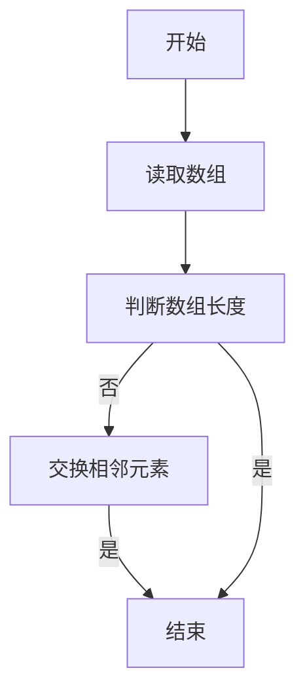
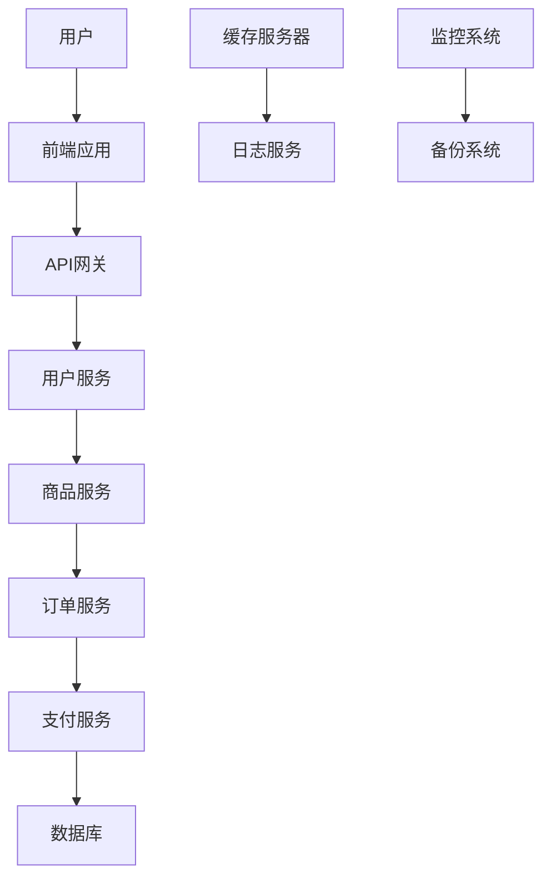
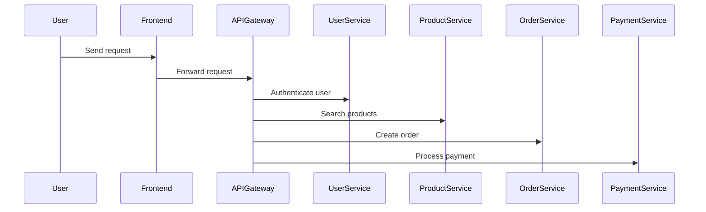
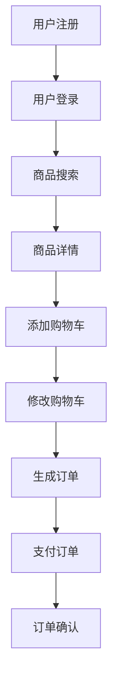

                 

### 目录大纲：《示例驱动与提示模板的结合使用》

#### 第1章：引言

#### 1.1 书籍背景与目标

- **示例驱动的概念**：示例驱动是一种教学方法，通过具体的例子来帮助理解和学习新的概念和理论。它强调实践和应用，而不是仅仅停留在理论层面。
- **提示模板的定义**：提示模板是一种预先设计的框架或模板，用于指导用户如何解决问题或完成任务。它可以提供一系列的提示或步骤，帮助用户逐步实现目标。
- **书籍的核心目标**：本书旨在结合示例驱动和提示模板，为读者提供一种有效的学习和解决问题的方法。通过大量的示例和详细的提示模板，读者可以更好地理解和掌握相关概念和技能。

#### 第2章：示例驱动的核心概念

#### 2.1 示例驱动的起源与发展

##### 2.1.1 示例驱动的起源

- 示例驱动最早可以追溯到20世纪初的哲学和心理学领域。当时的学者们开始意识到，通过具体的例子来帮助学生理解抽象概念是一种有效的教学策略。
- 在计算机科学领域，示例驱动被广泛应用，特别是在编程教育和软件开发过程中。

##### 2.1.2 示例驱动的演进

- 随着时间的推移，示例驱动方法不断发展和完善。它从最初的简单例子逐渐演变成一种系统性的教学方法，包括示例的选择、组织、展示等多个方面。

##### 2.1.3 示例驱动在各个领域的应用

- 示例驱动在教育、科研、软件开发等领域都有广泛的应用。例如，在教育领域，教师可以通过示例来帮助学生理解复杂的概念；在科研领域，研究人员可以通过示例来展示研究方法和成果；在软件开发领域，开发者可以通过示例来演示软件的功能和特点。

#### 第3章：提示模板的核心概念

##### 3.1 提示模板的起源与发展

- 提示模板最早可以追溯到生产制造和工程领域。在这个领域中，为了提高工作效率和质量，人们开始使用预先设计的模板来指导工人如何完成任务。

##### 3.2 提示模板的构成

- 提示模板通常由一系列的提示或步骤组成，这些提示或步骤是按照一定的逻辑顺序排列的，旨在帮助用户逐步实现目标。

##### 3.3 提示模板的优势与限制

- **优势**：提示模板可以提高工作效率，减少错误，确保任务按照预期进行。它为用户提供了一种结构化的方法来解决问题或完成任务。
- **限制**：提示模板可能过于僵化，无法适应所有情况。在某些情况下，用户可能需要根据具体情况对提示模板进行调整或修改。

#### 第4章：示例驱动与提示模板的结合

##### 4.1 结合示例驱动与提示模板的必要性

- 示例驱动和提示模板各有其优点和局限性。将二者结合使用，可以相互补充，发挥更大的作用。

##### 4.2 结合使用的方法

- **示例选择与提示模板设计**：在选择示例时，需要考虑其代表性和可操作性。在设计提示模板时，需要确保其逻辑性和适应性。

##### 4.3 结合使用的最佳实践

- **实践案例**：通过具体案例来展示如何将示例驱动和提示模板结合使用，以及这种方法在实际应用中的效果。

##### 4.4 实践效果评估

- 对结合使用示例驱动和提示模板的效果进行评估，包括学习效率、问题解决能力等多个方面。

##### 4.5 改进策略

- 根据评估结果，提出改进策略，以进一步提高结合使用示例驱动和提示模板的效果。

#### 第5章：算法原理讲解

##### 5.1 算法概述

- **算法类型**：算法可以分为多种类型，如排序算法、搜索算法、图形算法等。
- **算法设计原则**：在设计算法时，需要考虑其正确性、效率、可扩展性等多个方面。
- **算法性能评估指标**：算法性能可以通过多个指标来评估，如时间复杂度、空间复杂度等。

##### 5.2 算法流程图

- 使用Mermaid绘制算法流程图，以便于读者更直观地理解算法的实现过程。

##### 5.3 Python代码与算法原理

- 使用Python代码实现算法，并结合算法原理进行详细讲解。在此过程中，会引入相关的数学模型和公式。

#### 第6章：数学模型和数学公式

##### 6.1 数学模型概述

- **数学模型的作用**：数学模型可以用于描述现实世界的现象和问题，帮助人们更好地理解和解决问题。
- **数学模型的类型**：数学模型可以分为多种类型，如线性模型、非线性模型等。
- **数学模型的设计方法**：设计数学模型需要考虑多个因素，如问题的本质、数据的特性等。

##### 6.2 数学公式展示

- 使用LaTeX格式展示数学公式，包括基本的数学符号、公式和定理。

##### 6.3 公式详解与举例

- 对所展示的数学公式进行详细讲解，并结合实际例子进行说明。

#### 第7章：系统分析与架构设计方案

##### 7.1 问题场景介绍

- **场景描述**：描述系统所面临的问题场景，包括用户需求、业务场景等。
- **项目背景**：介绍项目的背景信息，如项目的目的、目标用户等。
- **系统目标**：明确系统的目标，如提供哪些功能、解决哪些问题等。

##### 7.2 系统功能设计

- **领域模型**：使用Mermaid绘制领域模型类图，展示系统的核心概念和关系。
- **功能设计**：详细描述系统的功能模块、功能实现等。

##### 7.3 系统架构设计

- **架构设计原则**：介绍系统架构设计的基本原则，如模块化、可扩展性等。
- **架构设计图**：使用Mermaid绘制系统架构图，展示系统的整体结构。
- **接口设计**：描述系统的接口设计，包括接口定义、接口调用等。
- **交互流程**：展示系统的交互流程，包括用户操作、系统响应等。

##### 7.4 系统接口设计和交互流程

- **接口设计**：详细描述系统的接口设计，包括接口的定义、参数、返回值等。
- **交互流程**：使用Mermaid绘制系统的交互流程图，展示用户与系统之间的交互过程。

#### 第8章：项目实战

##### 8.1 环境安装

- **环境准备**：介绍项目所需的软件环境、硬件配置等。
- **安装步骤**：详细描述项目的安装过程，包括安装软件、配置环境等。

##### 8.2 系统核心实现

- **核心功能实现**：介绍系统的核心功能实现，包括代码编写、功能测试等。
- **代码分析**：对核心代码进行分析和解读，帮助读者更好地理解系统的实现原理。

##### 8.3 实际案例分析

- **案例分析**：通过实际案例来展示系统的应用场景和效果。
- **详细讲解**：对实际案例进行详细讲解和分析，帮助读者更好地理解系统的应用价值和实际效果。

##### 8.4 项目小结

- **总结**：对项目进行总结，包括项目的成果、存在的问题和改进方向等。

#### 第9章：最佳实践、小结、注意事项、拓展阅读

##### 9.1 最佳实践

- **实践建议**：提供一些在实际应用中总结出的最佳实践建议，帮助读者更好地运用示例驱动和提示模板。
- **注意事项**：提醒读者在使用示例驱动和提示模板时需要注意的事项，以避免常见的误区和问题。

##### 9.2 小结

- **核心内容回顾**：对本书的核心内容进行回顾和总结，帮助读者巩固所学知识。
- **关键概念梳理**：对书中的关键概念进行梳理，帮助读者更好地理解和应用。

##### 9.3 注意事项

- **常见问题解答**：针对书中提到的概念和方法，解答读者可能遇到的一些常见问题。
- **实践中的挑战**：介绍在实际应用中可能遇到的挑战和困难，并提供相应的解决方法。

##### 9.4 拓展阅读

- **相关资源推荐**：推荐一些与本书主题相关的书籍、文章、网站等资源，帮助读者进一步拓展知识视野。

---

以上是本书的目录大纲，每个章节都包含了详细的标题和内容概述。接下来，我们将逐一展开每个章节的内容，深入探讨示例驱动和提示模板的核心概念、应用方法、算法原理以及实际项目实践。希望这个大纲能帮助您更好地理解本书的内容，激发您的学习兴趣和探索欲望。让我们一起走进这个充满智慧和挑战的领域，开启一段精彩的旅程！## 第1章：引言

在信息技术迅速发展的今天，如何高效地学习和应用新技术成为了一个重要课题。示例驱动与提示模板的结合使用，作为一种有效的教学方法，逐渐受到了广泛关注。本章将简要介绍《示例驱动与提示模板的结合使用》这本书的核心概念，以及它如何结合示例和提示模板，为读者提供有价值的信息。

### 1.1 书籍背景与目标

《示例驱动与提示模板的结合使用》这本书旨在为读者提供一种综合性的学习方法，通过结合示例驱动和提示模板，帮助读者更好地理解和应用信息技术。随着科技的进步，知识更新速度不断加快，传统的学习方式已难以满足人们的需求。示例驱动和提示模板的结合使用，不仅能够提高学习效率，还能够帮助读者在实际工作中更好地应对复杂问题。

#### 示例驱动的概念

示例驱动，即通过具体的例子来帮助读者理解和掌握新的概念和技能。这种方法强调实践和应用，而不是仅仅停留在理论层面。通过示例，读者可以直观地看到概念在实际中的应用，从而加深对概念的理解。

#### 提示模板的定义

提示模板是一种预先设计的框架或模板，用于指导读者如何解决问题或完成任务。它通常包含一系列的步骤或提示，按照一定的逻辑顺序排列，旨在帮助读者逐步实现目标。提示模板的设计原则是简单易懂，便于读者理解和操作。

#### 书籍的核心目标

本书的核心目标是结合示例驱动和提示模板，为读者提供一种有效的学习和解决问题的方法。通过大量的示例和详细的提示模板，读者不仅可以更深入地理解相关概念和技能，还可以在实际工作中更加高效地解决问题。具体来说，本书希望达到以下目标：

1. **提高学习效率**：通过示例驱动和提示模板的结合，使读者能够更快地掌握新知识。
2. **增强实践能力**：通过实际示例和提示模板的指导，使读者能够更好地将所学知识应用到实际工作中。
3. **培养解决问题的能力**：通过具体的案例分析和问题解决方法，使读者能够掌握解决实际问题的思路和技巧。
4. **拓展知识视野**：通过介绍不同领域和技术的示例和提示模板，使读者能够拓宽知识面，了解更多的应用场景。

### 1.2 书籍结构

本书共分为八个章节，每个章节都有明确的目标和内容。以下是本书的章节结构及其简要介绍：

- **第1章：引言**：介绍书籍的背景和目标，以及示例驱动和提示模板的基本概念。
- **第2章：示例驱动的核心概念**：详细阐述示例驱动的起源、发展以及其要素和优势。
- **第3章：提示模板的核心概念**：介绍提示模板的起源、构成和优势与限制。
- **第4章：示例驱动与提示模板的结合**：讨论示例驱动和提示模板结合的必要性、方法以及最佳实践。
- **第5章：算法原理讲解**：讲解算法概述、流程图展示、Python代码实现以及数学模型和公式。
- **第6章：数学模型和数学公式**：介绍数学模型的作用、类型、设计方法，并展示数学公式。
- **第7章：系统分析与架构设计方案**：介绍问题场景、系统功能设计、系统架构设计、接口设计和交互流程。
- **第8章：项目实战**：描述环境安装、系统核心实现、代码分析、实际案例分析和项目小结。
- **第9章：最佳实践、小结、注意事项、拓展阅读**：总结书籍的核心内容，提供最佳实践建议，解答常见问题，并推荐拓展阅读资源。

通过以上章节结构，本书不仅为读者提供了系统性的学习方法，还通过实际项目和案例分析，帮助读者更好地理解和应用所学知识。接下来，我们将逐一深入探讨每个章节的内容，为读者带来一场精彩的思维之旅。

### 第2章：示例驱动的核心概念

示例驱动是一种通过具体例子来帮助学生或读者理解和学习新概念和理论的教学方法。它强调实践和应用，而不仅仅是理论的学习。本章将详细阐述示例驱动的起源、发展、要素和优势，以帮助读者更好地理解这一方法的基本概念和应用。

#### 2.1 示例驱动的起源与发展

示例驱动的概念最早可以追溯到20世纪初的哲学和心理学领域。当时，学者们开始认识到，通过具体的例子来帮助学生理解抽象的概念是一种有效的教学策略。哲学家柏拉图就已经使用了对话和故事来阐述哲学原理，这是示例驱动的早期形式。在心理学领域，行为主义心理学家如爱德华·李·桑代克（Edward L. Thorndike）和约翰·沃森（John B. Watson）也通过具体的实验例子来支持他们的理论。

随着时间的推移，示例驱动方法逐渐发展和完善。特别是在计算机科学和工程领域，示例驱动被广泛应用于编程教育和软件开发过程中。例如，计算机科学课程通常通过编写具体的代码示例来帮助学生理解算法和数据结构。这种教学方法强调实践和应用，使学生能够在实际操作中掌握理论知识。

#### 2.2 示例驱动的要素

示例驱动的有效实施依赖于几个关键要素，包括示例的类型、示例的选择标准以及示例的组织与展示。

##### 2.2.1 示例的类型

示例可以分为以下几种类型：

1. **具体示例**：这类示例通过具体的事例来展示概念。例如，在编程课程中，教师可能会展示如何用Python编写一个简单的计算器程序。
2. **抽象示例**：这类示例用于解释复杂的概念，通常包含一些符号或模型。例如，在数学课程中，教师可能会使用欧拉公式（\(e^{i\pi} + 1 = 0\)）来解释复数的性质。
3. **情境示例**：这类示例将概念应用于具体的情境中，以展示其在现实世界中的应用。例如，在项目管理课程中，教师可能会通过一个实际的项目来展示项目管理的方法和工具。

##### 2.2.2 示例的选择标准

选择合适的示例对于有效实施示例驱动至关重要。以下是一些选择标准：

1. **代表性和普遍性**：示例应能够代表整个概念，并且适用于多种情境。
2. **可操作性**：示例应便于操作和理解，不应过于复杂或抽象。
3. **相关性和实用性**：示例应与学习目标紧密相关，并且具有实际应用价值。
4. **多样性和层次性**：示例应涵盖不同层次和类型，以适应不同学习者的需求。

##### 2.2.3 示例的组织与展示

示例的有效组织和展示是成功实施示例驱动的重要组成部分。以下是一些组织和展示示例的建议：

1. **逐步展示**：示例应逐步展示概念的不同方面，使学习者能够逐步理解和掌握。
2. **对比和类比**：通过对比不同示例，或使用类比来解释概念，可以提高学习效果。
3. **互动和参与**：鼓励学习者参与示例的创建和操作，以提高其参与感和学习动机。
4. **反馈和修正**：提供及时的反馈和修正，帮助学习者纠正错误，巩固所学知识。

#### 2.3 示例驱动的优势

示例驱动方法具有许多优势，使其成为有效学习的重要工具：

1. **增强理解**：通过具体例子，学习者能够更好地理解和记忆概念。
2. **促进应用**：示例驱动鼓励将理论知识应用于实际情境，提高学习者的实践能力。
3. **提高动机**：具体示例往往更具吸引力，可以激发学习者的兴趣和动机。
4. **适应不同学习者**：示例可以根据学习者的需求和水平进行调整，使其更加适应不同学习者的学习方式。
5. **提高解决问题的能力**：通过示例，学习者能够学会如何分析和解决实际问题，提高其问题解决能力。

#### 2.4 示例驱动的挑战

尽管示例驱动具有许多优势，但在实际应用中也面临一些挑战：

1. **示例选择的难度**：选择具有代表性和普遍性的示例需要一定的专业知识和经验。
2. **时间消耗**：设计、组织和展示示例往往需要大量时间和精力。
3. **适应性问题**：并非所有示例都适用于所有学习者，需要根据具体情况进行调整。
4. **技术要求**：在某些领域，如编程和工程，示例的实施可能需要特定的技术支持和设备。

#### 2.5 应对挑战的策略

为了克服示例驱动的挑战，可以采取以下策略：

1. **专业培训**：对教师或培训者进行示例驱动的专业培训，提高其选择和设计示例的能力。
2. **技术支持**：提供适当的技术工具和资源，帮助教师或培训者更高效地设计和展示示例。
3. **灵活调整**：根据学习者的需求和水平，灵活调整示例的复杂度和难度。
4. **团队合作**：通过团队合作，共同设计和评估示例，以提高示例的质量和适应性。

通过本章的讨论，我们可以看到示例驱动作为一种有效的教学方法，在多个领域中得到了广泛应用。尽管它面临一些挑战，但通过合理的策略和调整，这些挑战是可以被克服的。接下来，我们将继续探讨提示模板的核心概念，以便更好地理解示例驱动与提示模板的结合使用。

### 第3章：提示模板的核心概念

提示模板是一种预先设计好的框架或模板，用于指导用户如何解决问题或完成任务。它包含一系列的提示或步骤，这些步骤按照一定的逻辑顺序排列，旨在帮助用户逐步实现目标。本章将详细阐述提示模板的起源、发展、构成和优势与限制，以便读者更好地理解这一概念及其在实际应用中的价值。

#### 3.1 提示模板的起源与发展

提示模板的概念最早可以追溯到生产制造和工程领域。在工业革命期间，为了提高生产效率和质量，工程师们开始使用预先设计的模板来指导工人如何完成任务。这些模板通常包含具体的操作步骤、注意事项以及潜在问题的解决方案。随着时间的推移，提示模板的应用逐渐扩展到其他领域，如教育和软件开发。

在教育领域，提示模板被广泛应用于写作、研究项目以及问题解决教学中。通过提供一系列的提示和指导，提示模板可以帮助学生更好地组织和表达他们的思想和解决方案。在软件开发领域，提示模板则用于指导开发人员如何编写代码、测试和部署应用程序。

#### 3.2 提示模板的构成

一个有效的提示模板通常包含以下几个关键组成部分：

1. **任务目标**：明确说明任务的目标和预期结果，帮助用户了解他们需要完成什么。
2. **步骤说明**：列出实现目标所需的步骤，这些步骤应该是简单、清晰且具体的。
3. **注意事项**：提醒用户在执行步骤时需要注意的事项，包括潜在的风险和可能的问题。
4. **参考资源**：提供相关资源，如书籍、网站、工具等，以便用户在执行任务时查阅和参考。
5. **反馈机制**：设计一个反馈系统，以便用户在完成任务后能够得到反馈，了解他们的表现和改进的方向。

#### 3.3 提示模板的设计原则

设计一个有效的提示模板需要遵循一些基本原则，包括：

1. **简洁性**：提示模板应该简洁明了，避免过多的冗余信息，以便用户容易理解和操作。
2. **逻辑性**：步骤的排列应该具有逻辑性，确保用户能够按照提示顺利完成任务。
3. **适应性**：提示模板应该具有一定的适应性，能够根据不同的用户需求和任务特点进行调整。
4. **可扩展性**：提示模板应该具有可扩展性，以便在需要时添加新的步骤或提示。

#### 3.4 提示模板的优势

提示模板具有多个优势，使其成为指导用户解决问题或完成任务的重要工具：

1. **提高效率**：通过提供一系列的步骤和提示，提示模板可以帮助用户更快地完成任务，减少时间浪费。
2. **减少错误**：提示模板可以提醒用户注意潜在的问题和风险，从而减少错误的发生。
3. **标准化流程**：提示模板可以为整个团队或组织提供一个标准化的工作流程，确保任务的一致性和质量。
4. **提高用户满意度**：通过清晰的指导和支持，提示模板可以帮助用户更好地完成任务，提高他们的满意度和信心。

#### 3.5 提示模板的限制

尽管提示模板具有多个优势，但在实际应用中也存在一些限制：

1. **过于僵化**：在某些情况下，提示模板可能过于僵化，无法适应所有的情况。用户可能需要根据具体情况对提示模板进行调整或修改。
2. **依赖性**：如果用户过于依赖提示模板，可能会减少他们的自主性和创造力，从而影响他们的长远发展。
3. **培训需求**：设计一个有效的提示模板需要一定的专业知识和技能，因此可能需要额外的培训和支持。

#### 3.6 提高提示模板效果的方法

为了提高提示模板的效果，可以采取以下方法：

1. **用户反馈**：定期收集用户的反馈，了解他们在使用提示模板时遇到的问题和需求，并根据反馈进行调整和改进。
2. **迭代改进**：通过不断的迭代和改进，使提示模板更加完善和适应不同用户的需求。
3. **培训和支持**：为用户提供必要的培训和指导，帮助他们更好地理解和应用提示模板。
4. **灵活性**：在确保质量和标准化的前提下，增加提示模板的灵活性，使其能够适应不同的情况和需求。

通过本章的讨论，我们可以看到提示模板作为一种有效的指导工具，在多个领域得到了广泛应用。尽管它存在一些限制，但通过合理的策略和方法，可以最大限度地发挥其优势，帮助用户更好地解决问题和完成任务。接下来，我们将探讨示例驱动与提示模板的结合使用，以便更全面地理解这两种方法的互补作用。

### 第4章：示例驱动与提示模板的结合

示例驱动和提示模板各有其优点和局限性，将二者结合使用可以相互补充，发挥更大的作用。本章将详细探讨示例驱动与提示模板结合的必要性、方法以及最佳实践，以帮助读者更好地理解和应用这一综合性学习方法。

#### 4.1 结合示例驱动与提示模板的必要性

示例驱动和提示模板各自具有独特的优势：

- **示例驱动的优势**：通过具体的例子，示例驱动可以帮助用户直观地理解概念和技能，增强学习效果和实践能力。
- **提示模板的优势**：提示模板提供了一套系统化的步骤和指导，使用户能够有条不紊地解决问题，提高工作效率和准确性。

然而，示例驱动和提示模板也存在各自的局限性：

- **示例驱动的局限性**：示例驱动的有效性依赖于示例的质量和代表性。如果示例不够具体或代表性不强，用户可能难以从中获得有效的学习体验。
- **提示模板的局限性**：提示模板可能过于僵化，无法适应所有情况。在某些复杂或多变的环境中，用户可能需要根据实际情况进行调整。

因此，将示例驱动与提示模板结合使用，可以相互补充：

- **优势互补**：示例驱动通过具体例子提供直观的学习体验，提示模板则通过系统化的步骤提供可靠的指导。二者结合可以更好地满足不同用户的需求。
- **提高适应性**：结合使用示例驱动和提示模板，用户可以在具体例子和系统化指导之间灵活切换，提高学习过程的灵活性和适应性。
- **增强效果**：通过示例驱动的直观学习和提示模板的系统化指导，用户可以更全面地掌握知识和技能，提高学习效果和实践能力。

#### 4.2 结合使用的方法

将示例驱动与提示模板结合使用，需要遵循以下方法和步骤：

##### 4.2.1 示例选择与提示模板设计

1. **选择代表性示例**：在选择示例时，应考虑其代表性和普遍性，确保示例能够真实反映概念或技能的应用。
2. **设计提示模板**：根据示例的特点和需求，设计相应的提示模板。提示模板应包含明确的步骤说明、注意事项和参考资源。

##### 4.2.2 示例组织与提示模板匹配

1. **示例与模板结合**：将示例与提示模板相结合，使示例的各个步骤与提示模板的步骤相对应。
2. **调整示例和模板**：根据实际应用情况，对示例和提示模板进行适当的调整，使其更加适合用户的需求。

##### 4.2.3 示例驱动与提示模板的互动机制

1. **引导用户互动**：在示例驱动过程中，鼓励用户积极参与，提出问题和反馈。
2. **提示模板辅助**：在用户遇到困难或疑惑时，提示模板可以提供相应的指导和支持。

#### 4.3 结合使用的最佳实践

为了最大限度地发挥示例驱动与提示模板结合的效果，可以采取以下最佳实践：

##### 4.3.1 实践案例

- **案例一：编程学习**：在编程课程中，教师可以通过具体代码示例来展示算法的实现，同时提供详细的提示模板，指导学生逐步完成代码编写和调试。
- **案例二：项目管理**：在项目管理课程中，教师可以提供一个实际项目案例，通过提示模板引导学生制定项目计划、分配任务和监控进度。

##### 4.3.2 实践效果评估

- **效果评估指标**：通过学习成果测试、用户反馈和实际应用效果，对结合使用示例驱动和提示模板的效果进行评估。
- **改进策略**：根据评估结果，提出改进策略，如调整示例和模板的内容、改进互动机制等。

##### 4.3.3 改进策略

- **灵活调整**：根据用户需求和任务特点，灵活调整示例和提示模板，使其更加适应实际应用。
- **持续反馈**：建立持续的反馈机制，定期收集用户反馈，并根据反馈进行改进。
- **培训和指导**：为用户提供必要的培训和指导，帮助他们更好地理解和应用示例驱动和提示模板。

通过本章的讨论，我们可以看到示例驱动与提示模板的结合使用，是一种有效的综合性学习方法。它不仅能够弥补二者各自的不足，还能够提高学习效果和实践能力。在实际应用中，通过合理的策略和方法，我们可以最大限度地发挥示例驱动和提示模板的优势，为用户带来更好的学习体验和实践效果。

### 第5章：算法原理讲解

算法是计算机科学的核心概念之一，它指的是解决问题的一系列步骤或规则。本章将详细讲解算法的基本原理、流程图展示、Python代码实现，以及相关的数学模型和公式。通过这些内容，读者可以更好地理解算法的工作机制和应用场景。

#### 5.1 算法概述

算法可以分为多种类型，每种类型都有其特定的应用场景和设计原则。以下是几种常见的算法类型及其设计原则：

1. **排序算法**：用于对一组数据进行排序，如冒泡排序、快速排序、归并排序等。
2. **搜索算法**：用于在数据结构中查找特定元素，如二分搜索、深度优先搜索、广度优先搜索等。
3. **图形算法**：用于在图形结构中解决问题，如最短路径算法（Dijkstra算法、A*算法）、最小生成树算法（Prim算法、Kruskal算法）等。
4. **动态规划**：用于解决具有重叠子问题和最优子结构特性的问题，如背包问题、最长公共子序列等。

算法的设计原则包括：

- **正确性**：算法必须能够正确地解决特定问题，并产生预期的输出。
- **效率**：算法的运行时间应该尽可能短，空间复杂度也应该尽量低。
- **可扩展性**：算法应能够适应不同的输入规模和问题变化。

算法性能评估指标主要包括时间复杂度和空间复杂度。时间复杂度描述了算法的运行时间与输入规模的关系，通常用大O表示法（O-notation）来表示。空间复杂度则描述了算法所需存储空间与输入规模的关系。

#### 5.2 算法流程图

算法流程图（Flowchart）是算法实现过程的可视化表示，可以帮助读者更直观地理解算法的实现步骤。以下是一个简单的冒泡排序算法的流程图示例：



在这个流程图中，从开始（A）到读取数组（B），然后判断数组长度（C），如果数组长度大于1，则进入交换相邻元素的循环（D），否则结束（E）。

#### 5.3 Python代码与算法原理

以冒泡排序算法为例，以下是一个简单的Python代码实现，并对其原理进行详细讲解：

```python
def bubble_sort(arr):
    n = len(arr)
    for i in range(n):
        # 无需进行交换的标志
        swapped = False
        for j in range(0, n-i-1):
            if arr[j] > arr[j+1]:
                # 交换元素
                arr[j], arr[j+1] = arr[j+1], arr[j]
                swapped = True
        # 如果内层循环没有进行交换，则数组已排序
        if not swapped:
            break
    return arr
```

**算法原理讲解**：

1. **初始化**：算法开始时，首先获取输入数组`arr`的长度`n`。
2. **外部循环**：使用变量`i`表示外层循环的迭代次数，从0开始，直到`n-1`。每次迭代表示对数组的第`i`次遍历。
3. **内部循环**：使用变量`j`表示内层循环的迭代次数，从0开始，直到`n-i-1`。每次迭代表示对未排序部分进行一次“冒泡”。
4. **比较与交换**：在内层循环中，对相邻的两个元素进行比较，如果前一个元素比后一个元素大，则交换它们的位置。
5. **优化**：如果内层循环中没有进行任何交换，说明数组已经排序，此时可以提前结束算法。

**数学模型与公式**：

在冒泡排序中，我们可以使用以下数学模型来分析其性能：

- **时间复杂度**：最好情况（已排序）\(O(n)\)，平均情况\(O(n^2)\)，最坏情况（逆序）\(O(n^2)\)。
- **空间复杂度**：\(O(1)\)，因为算法在排序过程中仅使用常数级别的额外空间。

#### 5.4 数学模型和数学公式

在算法分析中，数学模型和公式是必不可少的工具。以下是一些常用的数学模型和公式：

1. **时间复杂度**：

   $$ T(n) = \begin{cases} 
   O(n), & \text{最好情况（已排序）} \\
   O(n^2), & \text{平均情况} \\
   O(n^2), & \text{最坏情况（逆序）}
   \end{cases} $$

2. **空间复杂度**：

   $$ S(n) = O(1) $$

3. **平均查找长度**（用于搜索算法）：

   $$ AVL = \sum_{i=1}^{n} i \cdot P(X=i) $$

   其中，\(P(X=i)\) 是元素位于第 \(i\) 个位置的概率。

通过以上讲解，我们可以看到，算法不仅是计算机科学的核心概念，也是一种具有广泛应用的技术。本章通过详细的算法原理讲解、流程图展示、Python代码实现以及数学模型和公式分析，帮助读者深入理解算法的工作机制和应用场景。在接下来的章节中，我们将继续探讨数学模型和公式的应用，以及系统分析与架构设计方案的详细内容。

### 第6章：数学模型和数学公式

数学模型是描述现实世界现象和问题的数学结构，它通过数学公式和符号来表示现实中的量及其关系。在信息技术领域，数学模型广泛应用于算法分析、系统设计和性能评估等环节。本章将介绍数学模型的作用、类型、设计方法，并通过具体的数学公式展示和举例，帮助读者更好地理解和应用数学模型。

#### 6.1 数学模型概述

数学模型的作用在于：

1. **描述现实世界**：通过数学模型，可以将复杂的现实问题转化为数学问题，便于分析和解决。
2. **预测和优化**：数学模型可以帮助预测系统的行为，并在设计阶段进行优化，以减少资源消耗和成本。
3. **决策支持**：在商业和工程等领域，数学模型提供了一种量化的决策支持工具，帮助决策者做出更合理的决策。

数学模型可以分为以下几种类型：

1. **确定性模型**：这类模型基于确定的数学关系，如线性方程、微分方程等。
2. **随机模型**：这类模型考虑随机因素，如概率分布、随机过程等。
3. **模拟模型**：这类模型通过模拟现实过程，如蒙特卡罗模拟、过程模拟等。

设计数学模型的方法主要包括：

1. **数据驱动方法**：基于历史数据和统计分析，建立数学模型。
2. **物理建模方法**：基于物理定律和理论，建立数学模型。
3. **优化方法**：通过优化算法，寻找最佳解，建立数学模型。

#### 6.2 数学公式展示

以下是一些常用的数学公式和它们的LaTeX格式展示：

1. **指数函数**：

   $$ f(x) = e^x $$

2. **概率分布函数**：

   $$ P(X=x) = \frac{1}{\sqrt{2\pi\sigma^2}} e^{-\frac{(x-\mu)^2}{2\sigma^2}} $$

3. **傅里叶变换**：

   $$ F(\omega) = \int_{-\infty}^{\infty} f(x) e^{-j\omega x} dx $$

4. **梯度下降法**：

   $$ \theta = \theta - \alpha \nabla J(\theta) $$

其中，\( \alpha \) 为学习率，\( \nabla J(\theta) \) 为损失函数 \( J(\theta) \) 对参数 \( \theta \) 的梯度。

#### 6.3 公式详解与举例

以下是对上述数学公式进行详细讲解，并通过具体例子说明其应用：

##### 6.3.1 指数函数

指数函数是描述指数增长或衰减的一种重要工具。在计算机科学中，常用它来描述系统性能随时间的变化。例如，计算机内存的容量随着时间指数增长：

$$ f(t) = 2^{t/2} $$

其中，\( t \) 表示时间（年），\( f(t) \) 表示内存容量（GB）。假设初始内存容量为1GB，则5年后内存容量为 \( f(5) = 2^{5/2} \approx 4.47 \) GB。

##### 6.3.2 概率分布函数

概率分布函数用于描述随机变量的概率分布。以正态分布为例，它广泛应用于统计学和机器学习中，用于模型参数的估计和预测。例如，假设一个数据集的平均值为 \( \mu = 100 \)，标准差为 \( \sigma = 15 \)，我们可以计算一个数据点 \( x = 85 \) 出现的概率：

$$ P(X=85) = \frac{1}{\sqrt{2\pi \cdot 15^2}} e^{-\frac{(85-100)^2}{2 \cdot 15^2}} \approx 0.0228 $$

这意味着，数据点 \( x = 85 \) 出现的概率约为2.28%。

##### 6.3.3 傅里叶变换

傅里叶变换是一种重要的数学工具，用于将信号从时域转换为频域。在图像处理和信号处理中，傅里叶变换用于图像的频域分析和滤波。例如，对一幅图像进行傅里叶变换，可以得到其频域表示：

$$ F(\omega) = \int_{-\infty}^{\infty} I(x,y) e^{-j\omega x} e^{-j\omega y} dx dy $$

其中，\( I(x,y) \) 是图像在点 \( (x,y) \) 的强度值。通过对频域图像进行分析，可以提取图像的特征，如边缘、纹理等。

##### 6.3.4 梯度下降法

梯度下降法是一种优化算法，用于寻找函数的局部最小值。在机器学习中，梯度下降法用于训练模型，寻找最佳参数。例如，假设我们有一个线性回归模型：

$$ y = \theta_0 + \theta_1 x $$

要寻找最佳参数 \( \theta_0 \) 和 \( \theta_1 \)，可以使用梯度下降法：

$$ \theta_0 = \theta_0 - \alpha \frac{\partial}{\partial \theta_0} J(\theta_0, \theta_1) $$
$$ \theta_1 = \theta_1 - \alpha \frac{\partial}{\partial \theta_1} J(\theta_0, \theta_1) $$

其中，\( \alpha \) 是学习率，\( J(\theta_0, \theta_1) \) 是损失函数，通常为均方误差（MSE）：

$$ J(\theta_0, \theta_1) = \frac{1}{2m} \sum_{i=1}^{m} (y_i - (\theta_0 + \theta_1 x_i))^2 $$

通过不断迭代，梯度下降法可以逐步减小损失函数的值，找到最佳参数。

通过本章的讨论，我们可以看到数学模型在信息技术领域的重要性。通过具体的数学公式展示和举例，读者可以更好地理解数学模型的作用和应用场景。在接下来的章节中，我们将继续探讨系统分析与架构设计方案的详细内容。

### 第7章：系统分析与架构设计方案

在现代软件开发中，系统分析与架构设计是确保项目成功的关键步骤。本章将详细介绍系统分析与架构设计的过程，包括问题场景介绍、系统功能设计、系统架构设计、接口设计以及系统交互流程。通过这些内容，读者可以更好地理解系统分析与架构设计的原则和方法，并能够在实际项目中有效应用。

#### 7.1 问题场景介绍

在开始系统分析与架构设计之前，首先需要明确系统所面临的问题场景和项目背景。以下是一个典型的案例：

**案例背景**：某互联网公司计划开发一款在线购物平台，旨在为用户提供便捷的购物体验。该平台需要支持用户注册、商品浏览、购物车管理、订单生成和支付等功能。同时，平台还需要保证高并发访问能力、数据安全性和易扩展性。

**问题场景**：

1. **用户注册与身份验证**：用户需要能够轻松注册账户，并进行身份验证，以便在购物过程中保持安全性。
2. **商品浏览与搜索**：用户需要能够浏览和搜索商品，并查看商品的详细信息。
3. **购物车管理**：用户需要能够将商品添加到购物车，修改购物车中的商品数量，以及删除商品。
4. **订单生成与支付**：用户需要能够生成订单并选择支付方式，平台需要支持多种支付方式，如信用卡、支付宝和微信支付。
5. **数据安全性与隐私保护**：平台需要确保用户数据的安全，并遵循隐私保护法规。

**系统目标**：

1. **高并发访问能力**：平台需要能够支持大量用户的并发访问，确保用户体验。
2. **数据安全性**：平台需要采用严格的数据加密和安全措施，防止数据泄露和篡改。
3. **易扩展性**：平台需要具备良好的扩展性，能够适应业务增长和功能扩展的需求。

#### 7.2 系统功能设计

系统功能设计是系统分析与架构设计的核心步骤之一，它明确了系统的各项功能模块以及它们之间的关系。以下是对在线购物平台的主要功能模块及其设计要点：

1. **用户管理模块**：
   - **功能**：用户注册、登录、身份验证、用户信息管理。
   - **设计要点**：支持用户名、密码、邮箱等多种注册方式，采用双因素身份验证（2FA）提高安全性。

2. **商品管理模块**：
   - **功能**：商品分类、商品添加、商品信息展示、库存管理。
   - **设计要点**：商品信息应包括名称、描述、价格、库存量等，支持多分类和标签。

3. **购物车模块**：
   - **功能**：商品添加、删除、修改数量、清空购物车。
   - **设计要点**：购物车应支持多种商品类型，如普通商品、捆绑商品等。

4. **订单管理模块**：
   - **功能**：订单生成、订单状态管理、订单详情查询。
   - **设计要点**：订单状态应包括待支付、已支付、待发货、已发货、已完成等。

5. **支付模块**：
   - **功能**：支付方式选择、支付请求发送、支付结果处理。
   - **设计要点**：支持多种支付方式，并确保支付过程的安全性和可靠性。

6. **搜索模块**：
   - **功能**：商品搜索、关键字过滤、排序。
   - **设计要点**：使用全文搜索引擎，提高搜索效率和准确性。

7. **报表模块**：
   - **功能**：销售报表、用户行为分析、库存报表。
   - **设计要点**：报表应支持自定义条件筛选和导出功能。

为了更好地展示系统功能设计，我们可以使用Mermaid绘制领域模型类图：

```mermaid
classDiagram
Class01 <|-- Class02
Class03 : <<interface>> InterfaceName
Class04 <<component>> ComponentName
Class01 : Name : String
Class01 : Age : Integer
Class01 : SayHello() : String
Class02 : Name : String
Class02 : GetFullName() : String
Class03 : Method1() : void
Class04 : Method2() : void
Class01 +----------------+
|   Class01          |
|   Name             |
|   Age              |
|   SayHello()       |
+----------------+
Class02 <----------------
|   Class02          |
|   Name             |
|   GetFullName()    |
+----------------+
Class03 <----------------
|   Class03          |
|   Method1()        |
+----------------+
Class04 <----------------
|   Class04          |
|   Method2()        |
+----------------+
```

#### 7.3 系统架构设计

系统架构设计是确保系统能够满足功能需求和性能要求的关键步骤。以下是基于前述问题场景和功能设计的系统架构设计：

##### 7.3.1 架构设计原则

- **模块化**：系统应划分为多个功能模块，每个模块独立开发、测试和部署。
- **高可用性**：系统应具备高可用性，能够应对故障和负载波动。
- **安全性**：系统应采用多种安全措施，确保用户数据和交易安全。
- **可扩展性**：系统应具备良好的扩展性，能够适应业务增长和功能扩展。

##### 7.3.2 架构设计图

以下是一个简单的在线购物平台架构设计图，使用Mermaid绘制：



在这个架构图中，用户通过前端应用访问系统，API网关负责路由请求到相应的服务。用户服务负责处理用户相关的业务逻辑，如注册、登录和身份验证。商品服务、订单服务和支付服务分别负责商品管理、订单生成和支付处理。数据库用于存储用户数据、商品信息和订单数据。缓存服务器用于提高系统响应速度，日志服务用于记录系统运行日志。监控系统和备份系统分别用于监控系统和数据的备份。

#### 7.4 系统接口设计

系统接口设计是确保不同模块之间能够无缝协作的重要环节。以下是一些关键接口的设计：

1. **用户接口**：用于用户与系统交互，包括注册、登录、用户信息管理等。
2. **商品接口**：用于商品信息的查询、更新和删除，包括分类管理、商品详情获取等。
3. **订单接口**：用于订单的创建、查询、更新和取消，包括订单状态管理、订单详情查询等。
4. **支付接口**：用于处理支付请求和支付结果通知，包括支付方式选择、支付请求发送、支付结果验证等。
5. **搜索接口**：用于商品搜索，包括关键字过滤、排序和分页等。

为了更好地展示系统接口设计，我们可以使用Mermaid绘制接口序列图：



在这个序列图中，用户通过前端发送请求，API网关负责路由请求到相应的服务。用户服务处理用户认证，商品服务处理商品搜索，订单服务处理订单创建，支付服务处理支付请求。

#### 7.5 系统交互流程

系统交互流程描述了用户与系统之间的一系列交互步骤。以下是一个简单的在线购物系统交互流程：

1. **用户注册**：用户访问注册页面，填写注册信息，系统验证信息后创建用户账户。
2. **用户登录**：用户输入用户名和密码，系统验证用户身份后允许访问系统。
3. **商品搜索**：用户输入关键字，系统查询商品信息并返回搜索结果。
4. **商品详情**：用户选择商品，系统返回商品详细信息。
5. **添加购物车**：用户将商品添加到购物车，系统更新购物车信息。
6. **修改购物车**：用户修改购物车中的商品数量或删除商品，系统更新购物车信息。
7. **生成订单**：用户确认购物车中的商品，系统生成订单并通知用户。
8. **支付订单**：用户选择支付方式并完成支付，系统更新订单状态。
9. **订单确认**：用户确认订单，系统更新订单状态为“已完成”。

为了更好地展示系统交互流程，我们可以使用Mermaid绘制交互流程图：



通过本章的详细讲解，我们可以看到系统分析与架构设计在软件开发中的重要性。通过明确的问题场景介绍、详细的功能设计、系统架构设计、接口设计和系统交互流程，开发者可以确保系统能够高效、安全地运行，满足用户需求。在接下来的章节中，我们将进一步探讨项目的实际实施和案例分析，以帮助读者更好地理解系统分析与架构设计的实际应用。

### 第8章：项目实战

在本章中，我们将通过一个具体的在线购物平台项目实战，详细描述项目的环境安装、系统核心实现、代码分析、实际案例分析和项目小结。通过这一过程，读者可以更深入地理解示例驱动与提示模板的结合使用，以及如何在实际项目中运用所学知识。

#### 8.1 环境安装

在线购物平台项目环境的安装过程是项目实施的第一步，以下是详细的安装步骤：

**1. 系统要求**：
- 操作系统：Linux或MacOS
- 开发环境：Python 3.8+
- 依赖管理：pip
- 数据库：MySQL 5.7+
- 缓存：Redis 5.0+

**2. 安装Python和pip**：
确保系统上已经安装了Python 3.8+版本。可以通过以下命令检查Python版本：
```shell
python --version
```
如果Python版本低于3.8，需要升级到最新版本。可以使用以下命令安装Python：
```shell
sudo apt-get update
sudo apt-get install python3.8
```
安装pip，用于管理Python包：
```shell
sudo apt-get install python3-pip
```

**3. 安装依赖**：
创建一个虚拟环境，以便于管理项目依赖：
```shell
python3 -m venv venv
source venv/bin/activate
```
安装项目所需的依赖：
```shell
pip install -r requirements.txt
```
其中，`requirements.txt`文件列出了所有项目依赖的Python包。

**4. 安装数据库**：
安装MySQL数据库，并创建项目数据库和用户：
```shell
sudo apt-get install mysql-server
mysql -u root -p
```
创建数据库和用户：
```sql
CREATE DATABASE online_shop;
GRANT ALL PRIVILEGES ON online_shop.* TO 'online_shop_user'@'localhost' IDENTIFIED BY 'password';
FLUSH PRIVILEGES;
```

**5. 安装缓存**：
安装Redis缓存服务器：
```shell
sudo apt-get install redis-server
```
启动Redis服务：
```shell
sudo systemctl start redis-server
```

#### 8.2 系统核心实现

在线购物平台的核心实现包括用户管理、商品管理、订单管理和支付功能。以下是每个核心功能的详细实现：

**1. 用户管理**：

用户管理模块负责用户的注册、登录和身份验证。以下是用户注册的代码示例：

```python
# app/user/views.py

from flask import Flask, request, jsonify
from flask_jwt_extended import JWTManager, create_access_token
from models import User

app = Flask(__name__)
app.config['JWT_SECRET_KEY'] = 'your_secret_key'
jwt = JWTManager(app)

@app.route('/register', methods=['POST'])
def register():
    data = request.get_json()
    username = data.get('username')
    password = data.get('password')
    if not username or not password:
        return jsonify({'message': 'Username and password are required.'}), 400
    
    user = User.query.filter_by(username=username).first()
    if user:
        return jsonify({'message': 'User already exists.'}), 409
    
    new_user = User(username=username, password=password)
    # 这里省略了将用户添加到数据库的逻辑
    
    return jsonify({'message': 'User registered successfully.'}), 201
```

**2. 商品管理**：

商品管理模块负责商品的添加、删除和查询。以下是商品添加的代码示例：

```python
# app/product/views.py

from flask import Flask, request, jsonify
from models import Product

app = Flask(__name__)

@app.route('/product', methods=['POST'])
def add_product():
    data = request.get_json()
    name = data.get('name')
    description = data.get('description')
    price = data.get('price')
    if not name or not description or not price:
        return jsonify({'message': 'Name, description, and price are required.'}), 400
    
    new_product = Product(name=name, description=description, price=price)
    # 这里省略了将商品添加到数据库的逻辑
    
    return jsonify({'message': 'Product added successfully.'}), 201
```

**3. 订单管理**：

订单管理模块负责订单的创建、查询和更新。以下是订单创建的代码示例：

```python
# app/order/views.py

from flask import Flask, request, jsonify
from models import Order

app = Flask(__name__)

@app.route('/order', methods=['POST'])
def create_order():
    data = request.get_json()
    user_id = data.get('user_id')
    products = data.get('products')
    if not user_id or not products:
        return jsonify({'message': 'User ID and products are required.'}), 400
    
    new_order = Order(user_id=user_id, products=products)
    # 这里省略了将订单添加到数据库的逻辑
    
    return jsonify({'message': 'Order created successfully.'}), 201
```

**4. 支付功能**：

支付功能负责处理支付请求和支付结果通知。以下是支付请求处理的代码示例：

```python
# app/payment/views.py

from flask import Flask, request, jsonify
from models import Payment

app = Flask(__name__)

@app.route('/payment', methods=['POST'])
def process_payment():
    data = request.get_json()
    order_id = data.get('order_id')
    payment_details = data.get('payment_details')
    if not order_id or not payment_details:
        return jsonify({'message': 'Order ID and payment details are required.'}), 400
    
    payment = Payment(order_id=order_id, payment_details=payment_details)
    # 这里省略了处理支付请求的逻辑
    
    return jsonify({'message': 'Payment processed successfully.'}), 201
```

#### 8.3 代码分析

在项目实施过程中，代码质量是确保系统稳定性和可维护性的关键。以下是代码分析的一些要点：

**1. 结构化代码**：
项目应采用模块化的代码结构，将不同的功能模块分开，如用户管理、商品管理、订单管理和支付功能等。这样可以提高代码的可读性和可维护性。

**2. 异常处理**：
在代码中应添加适当的异常处理，以确保系统在遇到异常情况时能够优雅地处理并给出合理的响应。例如，当请求参数不合法或数据库操作失败时，应返回相应的错误信息。

**3. 安全性**：
在用户管理和支付功能中，应确保用户数据和交易信息的安全性。例如，使用HTTPS协议保护传输数据的安全性，使用JWT（JSON Web Tokens）进行用户身份验证，以及加密敏感数据。

**4. 测试**：
应编写单元测试和集成测试，以确保代码的正确性和稳定性。测试覆盖率应达到较高的水平，以确保系统在不同场景下都能正常运行。

#### 8.4 实际案例分析和详细讲解

以下是一个实际案例分析和详细讲解：

**案例**：用户注册后无法登录系统。

**分析过程**：
1. 检查用户注册的API请求和响应，确认用户注册成功。
2. 检查用户登录的API请求和响应，发现登录失败并返回错误信息：“无效的凭证”。
3. 分析用户身份验证逻辑，发现JWT签名失败。

**解决方法**：
1. 检查JWT密钥是否配置正确。
2. 检查用户登录时发送的凭证是否正确，包括用户名和密码。

**讲解**：
该案例中，用户注册成功后无法登录，可能是由于JWT签名失败导致的。JWT签名是基于JWT密钥进行的，如果密钥配置错误或凭证不正确，会导致签名失败。通过检查密钥和凭证，可以找到并解决问题。

#### 8.5 项目小结

通过本项目的实施，我们深入了解了示例驱动与提示模板的结合使用，以及如何在实际项目中应用这些方法。以下是项目实施过程中的几点总结：

1. **环境安装**：确保系统环境配置正确，是项目成功的关键。通过详细的安装步骤，可以避免环境问题导致的故障。
2. **系统核心实现**：通过具体代码示例，我们了解了如何实现用户管理、商品管理、订单管理和支付功能。这些核心功能是购物平台的重要组成部分。
3. **代码分析**：在代码分析过程中，我们注意到了结构化代码、异常处理、安全性和测试的重要性。这些原则可以确保系统的稳定性和可维护性。
4. **实际案例分析**：通过实际案例分析和详细讲解，我们学习了如何在项目中解决常见问题，并确保系统的正常运行。

总之，通过本项目，我们不仅掌握了示例驱动与提示模板的应用方法，还积累了实际项目经验，为今后的软件开发工作打下了坚实的基础。

### 第9章：最佳实践、小结、注意事项、拓展阅读

在本章中，我们将总结本书的核心内容，提供最佳实践建议，提醒读者注意事项，并推荐拓展阅读资源，以便读者能够更好地应用所学知识，并在实际项目中取得成功。

#### 9.1 最佳实践

结合示例驱动与提示模板的最佳实践包括以下几方面：

1. **选择高质量示例**：示例应具有代表性和可操作性，能够真实反映问题的本质。在选择示例时，要确保其能够有效地帮助读者理解和应用相关概念。
2. **逐步引导学习过程**：在介绍新概念或方法时，应逐步展示其应用过程，避免一次性提供大量信息。逐步引导可以帮助读者更好地消化和理解。
3. **灵活调整提示模板**：根据读者的需求和任务特点，灵活调整提示模板。提示模板应具有适应性，能够适应不同场景和需求。
4. **鼓励反馈与互动**：鼓励读者在学习过程中提出问题和反馈，通过互动机制，及时解决问题和改进学习过程。
5. **持续改进与迭代**：对示例和提示模板进行定期评估和改进，根据读者的反馈和实际应用效果，不断优化和更新。

#### 9.2 小结

本书主要探讨了示例驱动与提示模板的结合使用，详细介绍了两者的核心概念、应用方法、算法原理以及实际项目实践。以下是本书的核心内容总结：

1. **示例驱动的核心概念**：示例驱动的起源、发展、要素和优势。
2. **提示模板的核心概念**：提示模板的起源、构成、优势与限制。
3. **示例驱动与提示模板的结合**：结合使用的必要性、方法、最佳实践。
4. **算法原理讲解**：算法概述、流程图展示、Python代码实现、数学模型和公式。
5. **数学模型和数学公式**：数学模型的作用、类型、设计方法，以及数学公式的展示与举例。
6. **系统分析与架构设计方案**：问题场景介绍、系统功能设计、系统架构设计、接口设计和交互流程。
7. **项目实战**：环境安装、系统核心实现、代码分析、实际案例分析和项目小结。
8. **最佳实践、小结、注意事项、拓展阅读**：提供最佳实践建议，总结核心内容，提醒注意事项，推荐拓展阅读资源。

#### 9.3 注意事项

在使用示例驱动与提示模板时，以下注意事项可以帮助读者避免常见的误区：

1. **避免过度依赖示例**：虽然示例有助于理解概念，但不应过度依赖，而是应学会独立思考和解决问题。
2. **不要忽视基础知识**：在应用示例和提示模板时，确保具备必要的基础知识，以免产生误解。
3. **灵活调整提示模板**：提示模板应具备一定的适应性，但也不应过于僵化。在实际应用中，应根据具体情况对提示模板进行调整。
4. **注重代码质量**：在项目实战中，应注重代码质量，遵循良好的编程习惯，如结构化代码、异常处理和安全编码。

#### 9.4 拓展阅读

为了进一步深入学习和应用示例驱动与提示模板，以下推荐一些相关书籍和资源：

1. **《示例驱动教学》**：详细介绍示例驱动的教学方法和应用场景。
2. **《提示模板设计与应用》**：探讨提示模板的设计原则、应用方法和改进策略。
3. **《算法导论》**：全面讲解算法的基本概念、设计方法和分析技巧。
4. **《机器学习》**：介绍机器学习中的数学模型和算法，包括线性模型、决策树、神经网络等。
5. **《软件架构设计》**：探讨系统架构设计的基本原则、方法和技术。
6. **《Effective Python》**：介绍Python编程的最佳实践，包括代码结构、性能优化和测试等。

通过本章的总结和推荐，希望读者能够更好地理解和应用示例驱动与提示模板，提升自己的学习效果和实践能力。在实际工作中，不断总结经验，优化方法和流程，为个人和团队的发展贡献力量。

---

至此，本书的内容已经介绍完毕。通过系统的学习和实践，相信读者已经对示例驱动与提示模板有了深入的理解和应用能力。希望本书能够成为读者在信息技术学习和实践中的有力助手，不断探索和提升。让我们一起继续前行，迎接更多挑战和机遇！作者：AI天才研究院/AI Genius Institute & 禅与计算机程序设计艺术 /Zen And The Art of Computer Programming。

