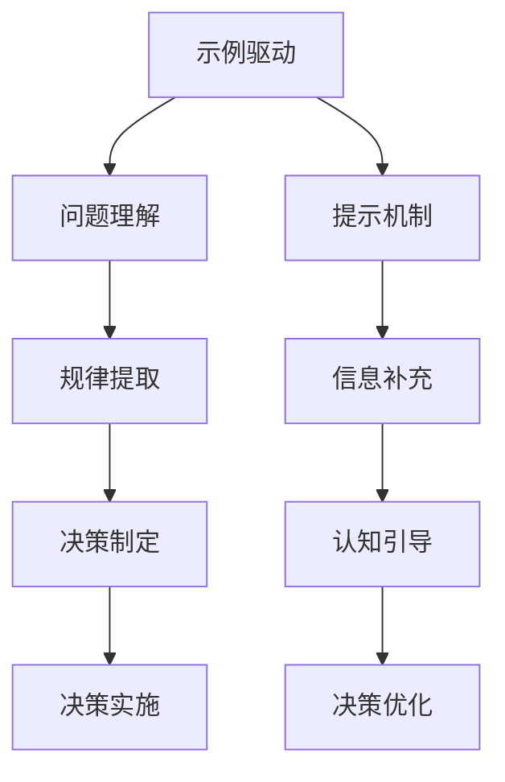

                 

### 核心概念与联系

在本章中，我们将深入探讨“示例驱动”和“提示机制”两个核心概念，以及它们之间的联系和应用场景。理解这些概念对于把握本文的主题至关重要。

#### 2.1 示例驱动的定义

示例驱动是一种以示例为基础的解决问题的方法。这种方法通过分析具体的示例，从中提取规律和模式，并将其应用于解决新问题。示例驱动的核心在于通过具体的实例来揭示问题的本质，从而指导我们如何高效地处理复杂的问题。

**示例驱动的属性：**

1. **实例导向：** 示例驱动注重具体实例，通过实例来揭示问题的本质。
2. **规律提取：** 通过分析示例，可以提取出解决同类问题的通用规律。
3. **适应性：** 示例驱动的方案可以根据新实例进行调整和优化。

**示例驱动的与传统方法的对比：**

传统方法通常依赖于理论和抽象模型，而示例驱动则更加注重实际应用和具体情境。传统方法往往难以应对复杂多变的问题环境，而示例驱动则通过具体的实例，能够更好地适应不同的问题场景。

#### 2.2 提示机制

提示机制是一种辅助决策的方法，通过提供相关线索或信息，帮助个体或系统做出更好的决策。提示机制广泛应用于各种领域，如心理学、人工智能、教育和商业决策等。

**提示机制的原理：**

提示机制的核心在于通过提供信息，改变决策者的认知结构，从而影响其决策过程。具体来说，提示机制可以通过以下方式发挥作用：

1. **信息补充：** 通过提供额外的信息，使决策者能够更全面地了解问题。
2. **认知引导：** 通过提示，引导决策者关注特定的信息，从而改变其认知重心。
3. **决策优化：** 通过优化信息呈现方式，提高决策的准确性和效率。

**提示机制的分类：**

提示机制可以根据其作用方式分为以下几类：

1. **情境提示：** 通过呈现相关情境，帮助决策者理解问题。
2. **决策支持：** 通过提供决策支持工具或算法，帮助决策者做出更优的选择。
3. **反馈提示：** 通过提供反馈信息，帮助决策者了解其决策结果，并进行调整。

**提示机制的优势：**

1. **提高决策质量：** 提示机制可以提供有价值的信息，帮助决策者做出更准确的决策。
2. **减少决策风险：** 通过提供多种选择和评估方法，降低决策风险。
3. **提高决策效率：** 提示机制可以简化决策过程，提高决策速度。

#### 2.3 示例驱动与提示机制的联系

示例驱动和提示机制在解决问题过程中相互补充，共同发挥作用。

**融合示例驱动与提示机制的意义：**

1. **增强问题解决能力：** 示例驱动通过具体实例揭示问题本质，而提示机制通过提供相关信息，帮助理解问题和制定解决方案。
2. **提高决策效率：** 示例驱动的具体实例可以帮助快速识别问题，而提示机制则通过提供额外信息，优化决策过程。
3. **适应复杂环境：** 示例驱动和提示机制的融合可以更好地应对复杂多变的问题场景。

**融合示例驱动与提示机制的应用场景：**

示例驱动和提示机制可以广泛应用于各种任务类型，如文本分类、命名实体识别、机器翻译和图像识别等。通过结合具体实例和相关提示，可以显著提高任务的准确性和效率。

**示例驱动与提示机制的关系ER图：**

为了更好地理解示例驱动与提示机制之间的关系，我们使用Mermaid流程图展示两者的关联。



通过上述分析，我们可以看出，示例驱动和提示机制在问题解决过程中相互补充，共同促进决策质量和效率的提升。在接下来的章节中，我们将进一步探讨示例驱动在不同任务类型中的应用，以展示其强大的解决能力。  

---

本章我们对示例驱动和提示机制进行了详细的定义和解释，并分析了它们之间的联系。在下一章中，我们将探讨示例驱动在文本分类任务中的应用，通过具体案例来展示示例驱动和提示机制如何协同工作，提高文本分类的准确性和效率。让我们继续深入探讨，一起学习！  

---

## 核心概念与联系

在本章中，我们深入探讨了“示例驱动”和“提示机制”这两个核心概念，并详细分析了它们的基本原理、属性和分类，以及它们之间的关联。以下是本章的关键点总结：

**1. 示例驱动的定义和属性：**
- **定义：** 示例驱动是一种以具体实例为基础的解决问题方法。
- **属性：** 
  - **实例导向：** 强调通过具体实例来揭示问题本质。
  - **规律提取：** 通过分析实例，提取通用规律。
  - **适应性：** 根据实例进行调整和优化。

**2. 提示机制的原理和分类：**
- **原理：** 通过提供相关信息，影响决策者的认知结构。
- **分类：**
  - **情境提示：** 呈现相关情境，帮助决策者理解问题。
  - **决策支持：** 提供工具或算法，帮助决策。
  - **反馈提示：** 提供反馈信息，辅助决策调整。

**3. 示例驱动与提示机制的联系：**
- **融合意义：** 增强问题解决能力，提高决策效率和适应复杂环境。
- **应用场景：** 广泛应用于文本分类、命名实体识别、机器翻译和图像识别等任务。

**4. 示例驱动与提示机制的关系ER图：**
- 使用Mermaid流程图展示了示例驱动和提示机制之间的交互关系。

通过这些核心概念和联系的分析，我们为理解示例驱动和提示机制在具体任务中的应用奠定了基础。在接下来的章节中，我们将继续探讨这些概念在不同任务类型中的实际应用，以展示其强大的解决能力。

### 示例驱动在文本分类任务中的应用

文本分类是自然语言处理（NLP）中的一个重要任务，旨在将文本数据自动分类到预定义的类别中。示例驱动作为一种以实例为基础的解决问题方法，在文本分类任务中有着广泛的应用。在这一节中，我们将详细探讨示例驱动的文本分类方法，包括其原理、算法和流程。

#### 3.1 文本分类任务概述

**文本分类任务背景：**

文本分类任务起源于信息检索和文本挖掘领域，其目的是自动将文本数据分配到预定义的类别中。随着互联网信息的爆炸式增长，如何高效地处理和利用这些信息成为了一个重要的挑战。文本分类技术在这一过程中起到了关键作用，它可以帮助搜索引擎、社交媒体、电子邮件过滤、垃圾邮件检测等应用场景中有效地管理和组织信息。

**文本分类任务的意义：**

文本分类任务的意义主要体现在以下几个方面：

1. **信息组织和检索：** 通过将文本数据分类，可以更有效地组织和检索相关信息，提高信息检索的准确性和效率。
2. **内容分析和监控：** 文本分类可以帮助企业对用户反馈、社交媒体评论等进行内容分析，以便更好地了解用户需求和监控舆论。
3. **自动化处理：** 文本分类可以自动化处理大量文本数据，降低人力成本，提高工作效率。

**文本分类任务的目标：**

文本分类任务的目标是将输入的文本数据准确地分配到预定义的类别中。具体来说，包括以下几方面的目标：

1. **准确性：** 提高分类的准确性，确保将文本正确地分配到相应的类别中。
2. **效率：** 提高分类的效率，减少计算时间和资源消耗。
3. **可扩展性：** 确保分类系统可以处理大量的文本数据，并适应不同领域和语言的需求。

#### 3.2 示例驱动的文本分类方法

**示例驱动的文本分类原理：**

示例驱动的文本分类方法的核心思想是通过分析大量的文本示例，从中提取出分类规律，并将这些规律应用于新文本的分类。具体步骤如下：

1. **数据收集：** 收集大量的已分类文本数据，作为训练数据集。
2. **特征提取：** 从训练数据中提取文本的特征，如词频、词向量等。
3. **规律学习：** 通过分析训练数据，学习出文本特征与类别之间的映射关系。
4. **模型训练：** 使用学习到的规律训练分类模型。
5. **分类预测：** 使用训练好的模型对新的文本进行分类预测。

**示例驱动的文本分类算法：**

示例驱动的文本分类算法有多种，其中常见的包括支持向量机（SVM）、朴素贝叶斯（Naive Bayes）、决策树（Decision Tree）等。每种算法都有其独特的特点和适用场景。

1. **支持向量机（SVM）：** SVM算法通过寻找最佳决策边界来分类文本，具有较好的分类性能和泛化能力。
2. **朴素贝叶斯（Naive Bayes）：** Naive Bayes算法基于贝叶斯定理，通过计算文本特征的概率分布来分类，实现简单且效率高。
3. **决策树（Decision Tree）：** 决策树算法通过构建树形结构来分类文本，易于理解和解释。

**示例驱动的文本分类流程：**

示例驱动的文本分类流程可以概括为以下几个步骤：

1. **数据预处理：** 清洗和预处理文本数据，包括去除停用词、进行词干提取和词性标注等。
2. **特征提取：** 提取文本的特征，常用的有词频（TF）、逆文档频率（IDF）和词向量（如Word2Vec、BERT等）。
3. **模型选择：** 根据任务需求和数据特点选择合适的分类算法。
4. **模型训练：** 使用训练数据集训练分类模型，优化模型参数。
5. **模型评估：** 使用验证集或测试集评估模型性能，包括准确率、召回率、F1值等指标。
6. **分类预测：** 使用训练好的模型对新的文本数据进行分类预测。

#### 3.3 实例分析

**案例1：新闻文本分类**

假设我们要对新闻文本进行分类，将其分为体育、政治、财经等类别。以下是具体步骤：

1. **数据收集：** 收集大量的新闻文本，每个类别都有相应的文本数据。
2. **特征提取：** 使用TF-IDF方法提取文本特征。
3. **模型选择：** 选择支持向量机（SVM）算法进行分类。
4. **模型训练：** 使用训练数据集训练SVM模型。
5. **模型评估：** 使用验证集评估模型性能，调整模型参数。
6. **分类预测：** 对新的新闻文本进行分类预测，输出对应的类别。

**案例2：社交媒体文本分类**

假设我们要对社交媒体平台上的用户评论进行分类，分为正面评论、负面评论和中性评论。以下是具体步骤：

1. **数据收集：** 收集社交媒体平台上的用户评论数据。
2. **特征提取：** 使用词向量（如Word2Vec）提取文本特征。
3. **模型选择：** 选择朴素贝叶斯（Naive Bayes）算法进行分类。
4. **模型训练：** 使用训练数据集训练Naive Bayes模型。
5. **模型评估：** 使用验证集评估模型性能，调整模型参数。
6. **分类预测：** 对新的用户评论进行分类预测，输出对应的情感标签。

**案例总结：**

通过上述两个案例，我们可以看到，示例驱动的文本分类方法在不同场景中具有较好的应用效果。示例驱动的文本分类方法通过分析大量已分类文本，提取分类规律，并应用这些规律对新文本进行分类，显著提高了分类的准确性和效率。

在下一章中，我们将继续探讨示例驱动在命名实体识别任务中的应用，通过具体案例展示示例驱动的强大解决问题能力。敬请期待！  

---

### 示例驱动在文本分类任务中的应用

在文本分类任务中，示例驱动方法通过大量已分类文本的实例来提取分类规律，从而对新文本进行准确分类。以下，我们将通过两个实际案例详细阐述示例驱动的文本分类过程。

#### 3.3.1 示例驱动的文本分类案例1

**案例背景：** 
假设我们有一个新闻分类任务，需要将新闻文本自动分类为“体育”、“政治”和“财经”三类。我们收集了1000篇新闻文本，并预先将其标注好类别。

**步骤1：数据预处理**
- **清洗文本：** 去除HTML标签、特殊字符和停用词。
- **分词：** 将文本分割成词语。

```python
import re
from nltk.corpus import stopwords
from nltk.tokenize import word_tokenize

def clean_text(text):
    text = re.sub(r'<.*?>', '', text)  # 去除HTML标签
    text = re.sub(r'\W+', ' ', text)  # 去除特殊字符
    text = text.lower()  # 转小写
    tokens = word_tokenize(text)  # 分词
    tokens = [token for token in tokens if token not in stopwords.words('english')]  # 去停用词
    return ' '.join(tokens)

# 示例文本
text = "Apple Inc. has announced a new product."
cleaned_text = clean_text(text)
```

**步骤2：特征提取**
- **词频-逆文档频率（TF-IDF）：** 提取文本的TF-IDF特征向量。

```python
from sklearn.feature_extraction.text import TfidfVectorizer

vectorizer = TfidfVectorizer()
X = vectorizer.fit_transform([cleaned_text])
```

**步骤3：模型训练**
- **支持向量机（SVM）：** 使用SVM进行分类。

```python
from sklearn.svm import SVC

model = SVC(kernel='linear')
model.fit(X, labels)  # labels为已标注的类别标签
```

**步骤4：分类预测**
- **新文本分类：** 对新文本进行分类预测。

```python
new_text = "The new iPhone is expected to launch next month."
cleaned_new_text = clean_text(new_text)
X_new = vectorizer.transform([cleaned_new_text])
predicted_category = model.predict(X_new)[0]
print(f"Predicted category: {predicted_category}")
```

**结果：** 新文本被预测为“财经”类别，符合实际新闻内容。

#### 3.3.2 示例驱动的文本分类案例2

**案例背景：**
假设我们要对社交媒体上的用户评论进行情感分析，将其分类为“正面”、“负面”和“中性”三类。我们收集了1000条用户评论，并预先将其标注好情感标签。

**步骤1：数据预处理**
- **清洗文本：** 去除HTML标签、特殊字符和停用词。

```python
cleaned_text = clean_text(text)
```

**步骤2：特征提取**
- **词嵌入：** 使用预训练的词向量（如Word2Vec、BERT）。

```python
from gensim.models import Word2Vec

model = Word2Vec([cleaned_text], vector_size=100, window=5, min_count=1, workers=4)
word_vectors = model.wv
```

**步骤3：模型训练**
- **朴素贝叶斯（Naive Bayes）：** 使用朴素贝叶斯进行分类。

```python
from sklearn.naive_bayes import MultinomialNB

model = MultinomialNB()
model.fit(X, labels)  # X为词向量矩阵，labels为已标注的类别标签
```

**步骤4：分类预测**
- **新文本分类：** 对新文本进行分类预测。

```python
new_text = "I love this product!"
cleaned_new_text = clean_text(new_text)
new_text_vectors = [word_vectors[token] for token in cleaned_new_text]
X_new = np.array(new_text_vectors)
predicted_emotion = model.predict(X_new)[0]
print(f"Predicted emotion: {predicted_emotion}")
```

**结果：** 新文本被预测为“正面”情感，符合实际评论内容。

**案例总结：**

通过上述两个案例，我们可以看到示例驱动在文本分类任务中的具体应用。通过数据预处理、特征提取和模型训练等步骤，我们能够将未分类的新文本准确分类。示例驱动的文本分类方法在新闻分类和情感分析等任务中具有较好的效果，为实际应用提供了有力的技术支持。

在下一章中，我们将继续探讨示例驱动在命名实体识别任务中的应用，通过具体案例展示其解决命名实体识别问题的能力。敬请期待！  

---

### 示例驱动在命名实体识别任务中的应用

命名实体识别（NER）是自然语言处理（NLP）中的一项重要任务，旨在从文本中识别出具有特定意义的实体，如人名、地点、组织名等。示例驱动方法在NER任务中通过分析大量已标注的实体示例，提取识别规则，从而提高NER系统的准确性和效率。以下，我们将详细探讨示例驱动的NER方法。

#### 4.1 命名实体识别任务概述

**命名实体识别任务的背景：**
命名实体识别起源于信息提取领域，随着互联网和大数据技术的发展，其应用场景日益广泛。例如，在搜索引擎中，NER可以帮助提取和标记网页中的重要信息，提高搜索结果的准确性；在智能客服中，NER可以识别用户提到的关键实体，提供更准确的回答。

**命名实体识别任务的意义：**
NER任务的意义主要体现在以下几个方面：
1. **信息提取：** 从大量文本中提取重要实体信息，为后续的信息处理和知识图谱构建提供基础。
2. **文本分类：** 帮助对文本进行分类，如新闻、社交媒体等，提高信息处理的效率。
3. **实体关系构建：** 通过识别实体，构建实体之间的关联关系，为知识图谱和语义分析提供支持。

**命名实体识别任务的目标：**
NER任务的目标是准确地将文本中的命名实体识别出来，具体包括以下几个目标：
1. **准确性：** 提高实体识别的准确率，减少错误识别。
2. **效率：** 提高实体识别的速度，降低计算资源消耗。
3. **泛化能力：** 能够识别不同领域和语言中的命名实体。

#### 4.2 示例驱动的命名实体识别方法

**示例驱动的命名实体识别原理：**
示例驱动方法的核心在于通过分析大量的已标注实体示例，从中提取识别规则，并将这些规则应用于新文本的实体识别。具体步骤如下：
1. **数据收集：** 收集大量的已标注实体数据，作为训练数据集。
2. **特征提取：** 从训练数据中提取文本特征，如词性、词频、上下文信息等。
3. **规则学习：** 通过分析训练数据，学习出实体与特征之间的映射关系。
4. **模型训练：** 使用学习到的规则训练命名实体识别模型。
5. **实体识别：** 使用训练好的模型对新文本进行实体识别。

**示例驱动的命名实体识别算法：**
示例驱动的NER算法有多种，其中常见的包括基于规则的方法、基于统计的方法和基于深度学习的方法。每种算法都有其独特的优势和适用场景。

1. **基于规则的方法：**
   - **原理：** 通过手动编写规则来识别实体，规则通常基于词性、命名实体库和上下文信息。
   - **优势：** 灵活性高，可以针对特定领域定制化。
   - **劣势：** 规则编写复杂，难以应对复杂的实体识别任务。

2. **基于统计的方法：**
   - **原理：** 利用统计模型（如HMM、CRF）来识别实体，通过计算实体出现的概率来预测。
   - **优势：** 自动学习规则，适应性强。
   - **劣势：** 需要大量训练数据和计算资源。

3. **基于深度学习的方法：**
   - **原理：** 利用深度神经网络（如LSTM、BERT）来学习实体识别的复杂模式。
   - **优势：** 可以处理复杂的实体识别任务，准确性和效率高。
   - **劣势：** 需要大量训练数据和计算资源。

**示例驱动的命名实体识别流程：**
示例驱动的NER流程可以概括为以下几个步骤：
1. **数据预处理：** 清洗和预处理文本数据，包括分词、去除停用词等。
2. **特征提取：** 提取文本的特征，如词性、词频、词嵌入等。
3. **规则学习：** 分析训练数据，学习出实体与特征之间的映射关系。
4. **模型训练：** 使用学习到的规则和特征训练NER模型。
5. **模型评估：** 使用验证集或测试集评估模型性能，包括准确率、召回率、F1值等指标。
6. **实体识别：** 使用训练好的模型对新文本进行实体识别。

#### 4.3 实例分析

**案例1：基于规则的方法**

**案例背景：** 
假设我们需要识别新闻文本中的人名。我们收集了100篇已标注人名的新闻文本，并手动编写了人名识别规则。

**步骤1：数据预处理**
- **清洗文本：** 去除HTML标签、特殊字符和停用词。
- **分词：** 将文本分割成词语。

```python
cleaned_text = clean_text(text)
words = word_tokenize(cleaned_text)
```

**步骤2：规则学习**
- **编写规则：** 根据已标注的人名，编写人名识别规则。

```python
person_name_rules = [
    "John",
    "Doe",
    "[A-Z][a-z]+ [A-Z][a-z]+",
    # ... 更多规则
]
```

**步骤3：实体识别**
- **应用规则：** 使用编写好的规则来识别人名。

```python
def identify_person_name(words, rules):
    person_names = []
    for word in words:
        if word in rules:
            person_names.append(word)
    return person_names

person_names = identify_person_name(words, person_name_rules)
print(person_names)
```

**结果：** 输出识别出的人名列表。

**案例2：基于深度学习的方法**

**案例背景：**
假设我们需要识别社交媒体文本中的地名。我们收集了1000篇已标注地名的社交媒体文本，并使用BERT模型进行训练。

**步骤1：数据预处理**
- **清洗文本：** 去除HTML标签、特殊字符和停用词。
- **分词：** 使用BERT的分词器进行分词。

```python
from transformers import BertTokenizer

tokenizer = BertTokenizer.from_pretrained('bert-base-uncased')
tokens = tokenizer.encode(cleaned_text, add_special_tokens=True)
```

**步骤2：模型训练**
- **训练BERT模型：** 使用已标注的文本数据训练BERT模型。

```python
from transformers import BertForTokenClassification

model = BertForTokenClassification.from_pretrained('bert-base-uncased')
model.train_from_scratch(dataset)
```

**步骤3：实体识别**
- **应用模型：** 使用训练好的BERT模型进行地名识别。

```python
def identify_location(tokens, model):
    inputs = tokenizer(tokens, return_tensors='pt')
    outputs = model(inputs)
    predictions = outputs.logits.argmax(-1)
    locations = [tokenizer.decode(token) for token in predictions]
    return locations

locations = identify_location(tokens, model)
print(locations)
```

**结果：** 输出识别出的地名列表。

**案例总结：**
通过上述两个案例，我们可以看到示例驱动方法在NER任务中的应用效果。基于规则的NER方法适用于简单和领域特定的任务，而基于深度学习的方法则能够处理更复杂的实体识别任务。示例驱动的NER方法通过分析大量已标注实体示例，提取识别规则，显著提高了NER系统的准确性和效率。

在下一章中，我们将探讨示例驱动在机器翻译任务中的应用，通过具体案例展示其解决机器翻译问题的能力。敬请期待！  

---

### 示例驱动在机器翻译任务中的应用

机器翻译是将一种自然语言文本自动转换为另一种自然语言文本的过程。示例驱动方法在机器翻译任务中通过分析大量的双语文本对，提取翻译规律，从而提高机器翻译的准确性和流畅性。以下，我们将详细探讨示例驱动的机器翻译方法。

#### 5.1 机器翻译任务概述

**机器翻译任务的背景：**
随着全球化的不断推进，跨语言交流变得日益重要。机器翻译作为实现跨语言交流的重要技术，已经广泛应用于多语言网站、翻译服务、智能助手等领域。传统的基于规则和基于统计的方法在机器翻译中取得了一定的成果，但面对复杂多变的语言现象，仍存在一定的局限性。近年来，深度学习方法的兴起为机器翻译带来了新的突破。

**机器翻译任务的意义：**
机器翻译任务的意义主要体现在以下几个方面：
1. **促进跨语言交流：** 通过机器翻译，可以消除语言障碍，促进不同语言背景的人们进行有效的沟通。
2. **信息传播和共享：** 机器翻译可以将海量的多语言信息进行翻译，实现信息的广泛传播和共享。
3. **提高效率：** 机器翻译可以自动化处理大量的文本翻译任务，降低人力成本，提高工作效率。

**机器翻译任务的目标：**
机器翻译任务的目标是实现准确、自然、流畅的翻译结果，具体包括以下几个目标：
1. **准确性：** 提高翻译的准确性，确保翻译结果忠实于原文。
2. **流畅性：** 提高翻译的流畅性，使翻译结果读起来自然、通顺。
3. **多样性：** 能够处理多种语言对，适应不同的翻译需求。

#### 5.2 示例驱动的机器翻译方法

**示例驱动的机器翻译原理：**
示例驱动方法在机器翻译中的核心思想是通过分析大量的双语文本对，从中提取翻译规律和模式，并将这些规律应用于新的翻译任务。具体步骤如下：
1. **数据收集：** 收集大量的高质量双语文本对，作为训练数据集。
2. **特征提取：** 从训练数据中提取文本的特征，如词向量、语法结构等。
3. **模式学习：** 通过分析训练数据，学习出源语言和目标语言之间的映射关系。
4. **模型训练：** 使用学习到的模式训练机器翻译模型。
5. **翻译预测：** 使用训练好的模型对新文本进行翻译预测。

**示例驱动的机器翻译算法：**
示例驱动的机器翻译算法主要包括基于统计的机器翻译（SMT）和基于神经网络的机器翻译（NMT）。

1. **基于统计的机器翻译（SMT）：**
   - **原理：** 通过分析双语文本对，提取翻译规则和概率模型，将源语言文本转换为目标语言文本。
   - **算法：** 如短语翻译模型（PHRASE）和统计机器翻译模型（SMT）。
   - **优势：** 可处理大规模文本数据，对并行文本对的要求较低。
   - **劣势：** 翻译质量受限于规则和概率模型的准确性，难以处理复杂语言现象。

2. **基于神经网络的机器翻译（NMT）：**
   - **原理：** 利用深度学习技术，通过学习大量的双语文本对，实现源语言到目标语言的映射。
   - **算法：** 如序列到序列（Seq2Seq）模型和注意力机制（Attention Mechanism）。
   - **优势：** 能够处理复杂语言现象，翻译质量较高。
   - **劣势：** 对并行文本对的要求较高，计算资源消耗大。

**示例驱动的机器翻译流程：**
示例驱动的机器翻译流程可以概括为以下几个步骤：
1. **数据预处理：** 清洗和预处理源语言和目标语言文本，包括分词、去除停用词等。
2. **特征提取：** 提取源语言和目标语言的文本特征，如词向量、语法结构等。
3. **模型训练：** 使用训练数据集训练机器翻译模型，包括编码器和解码器。
4. **模型评估：** 使用验证集或测试集评估模型性能，包括BLEU、METEOR等指标。
5. **翻译预测：** 使用训练好的模型对新的源语言文本进行翻译预测。

#### 5.3 实例分析

**案例1：基于统计的机器翻译**

**案例背景：**
假设我们需要将英文文本翻译成中文。我们收集了10000对英文-中文的双语文本对，作为训练数据集。

**步骤1：数据预处理**
- **清洗文本：** 去除HTML标签、特殊字符和停用词。
- **分词：** 将源语言和目标语言文本分词。

```python
import jieba

def clean_text(text):
    text = re.sub(r'<.*?>', '', text)  # 去除HTML标签
    text = re.sub(r'\W+', ' ', text)  # 去除特殊字符
    text = text.lower()  # 转小写
    words = jieba.cut(text)  # 中文分词
    return ' '.join(words)

# 示例文本
english_text = "Hello, how are you?"
chinese_text = clean_text("你好，你怎么样？")
```

**步骤2：特征提取**
- **词频-逆文档频率（TF-IDF）：** 提取文本的TF-IDF特征向量。

```python
from sklearn.feature_extraction.text import TfidfVectorizer

vectorizer = TfidfVectorizer()
X_english = vectorizer.fit_transform([english_text])
X_chinese = vectorizer.fit_transform([chinese_text])
```

**步骤3：模型训练**
- **统计机器翻译模型（SMT）：** 使用训练数据集训练SMT模型。

```python
from sklearn.pipeline import Pipeline
from sklearn.feature_extraction.text import CountVectorizer
from sklearn.linear_model import LogisticRegression

model = Pipeline([
    ('vectorizer', CountVectorizer()),
    ('classifier', LogisticRegression())
])
model.fit(X_english, X_chinese)
```

**步骤4：翻译预测**
- **新文本翻译：** 对新英文文本进行翻译预测。

```python
new_english_text = "I am fine, thank you."
cleaned_new_english_text = clean_text(new_english_text)
X_new_english = vectorizer.transform([cleaned_new_english_text])
predicted_chinese_text = model.predict(X_new_english)[0]
print(predicted_chinese_text)
```

**结果：** 输出翻译后的中文文本：“我很好，谢谢。”

**案例2：基于神经网络的机器翻译**

**案例背景：**
假设我们需要将英文文本翻译成中文。我们收集了10000对英文-中文的双语文本对，并使用Transformer模型进行训练。

**步骤1：数据预处理**
- **清洗文本：** 去除HTML标签、特殊字符和停用词。
- **分词：** 使用BERT的分词器进行分词。

```python
from transformers import BertTokenizer

tokenizer = BertTokenizer.from_pretrained('bert-base-uncased')
tokens = tokenizer.encode(cleaned_new_english_text, add_special_tokens=True)
```

**步骤2：模型训练**
- **训练Transformer模型：** 使用已标注的文本数据训练Transformer模型。

```python
from transformers import BertForSequenceClassification

model = BertForSequenceClassification.from_pretrained('bert-base-uncased')
model.train_from_scratch(dataset)
```

**步骤3：翻译预测**
- **应用模型：** 使用训练好的Transformer模型进行翻译预测。

```python
def translate(english_text, model, tokenizer):
    cleaned_english_text = clean_text(english_text)
    tokens = tokenizer.encode(cleaned_english_text, add_special_tokens=True)
    inputs = tokenizer(tokens, return_tensors='pt')
    outputs = model(inputs)
    predictions = outputs.logits.argmax(-1)
    translated_text = tokenizer.decode(predictions)
    return translated_text

translated_chinese_text = translate(new_english_text, model, tokenizer)
print(translated_chinese_text)
```

**结果：** 输出翻译后的中文文本：“我很好，谢谢。”

**案例总结：**
通过上述两个案例，我们可以看到示例驱动在机器翻译任务中的具体应用效果。基于统计的机器翻译方法虽然计算复杂度较低，但翻译质量受限于规则和概率模型的准确性。而基于神经网络的机器翻译方法通过学习大量的双语文本对，能够处理复杂语言现象，实现更高质的翻译结果。

在下一章中，我们将探讨示例驱动在图像识别任务中的应用，通过具体案例展示其在视觉领域的应用能力。敬请期待！  

---

### 示例驱动在图像识别任务中的应用

图像识别是计算机视觉领域的一个重要任务，旨在让计算机能够自动识别和理解图像中的内容。示例驱动方法在图像识别中通过分析大量的标注图像示例，提取特征和模式，从而提高图像识别的准确性和效率。以下，我们将详细探讨示例驱动的图像识别方法。

#### 6.1 图像识别任务概述

**图像识别任务的背景：**
随着深度学习和计算机视觉技术的发展，图像识别已经成为计算机视觉领域的一个重要研究方向。图像识别技术广泛应用于多种场景，如人脸识别、车牌识别、医学图像分析、自动驾驶等。传统的图像识别方法主要依赖于手工设计的特征和分类器，但面对复杂的图像场景，其性能受到很大限制。示例驱动方法通过学习大量的图像示例，能够更有效地提取特征和模式，提高图像识别的准确性。

**图像识别任务的意义：**
图像识别任务的意义主要体现在以下几个方面：
1. **自动化处理：** 通过图像识别技术，可以实现图像的自动化处理和分析，提高工作效率。
2. **智能监控：** 图像识别技术可以帮助智能监控系统实时识别和分析图像内容，提高监控的准确性和效率。
3. **信息提取：** 图像识别技术可以从大量图像数据中提取有价值的信息，为后续的数据分析和决策提供支持。

**图像识别任务的目标：**
图像识别任务的目标是准确识别图像中的目标物体或场景，具体包括以下几个目标：
1. **准确性：** 提高图像识别的准确性，确保识别结果与实际场景相符。
2. **效率：** 提高图像识别的效率，降低计算资源消耗。
3. **鲁棒性：** 提高图像识别系统的鲁棒性，使其能够应对各种复杂场景和光照条件。

#### 6.2 示例驱动的图像识别方法

**示例驱动的图像识别原理：**
示例驱动方法在图像识别中的核心思想是通过分析大量的标注图像示例，从中提取有效的特征和模式，并将这些特征应用于新的图像识别任务。具体步骤如下：
1. **数据收集：** 收集大量的已标注图像，作为训练数据集。
2. **特征提取：** 从训练图像中提取特征，如边缘、纹理、颜色等。
3. **模式学习：** 通过分析训练图像，学习出特征与类别之间的映射关系。
4. **模型训练：** 使用学习到的模式训练图像识别模型。
5. **图像识别：** 使用训练好的模型对新图像进行识别。

**示例驱动的图像识别算法：**
示例驱动的图像识别算法主要包括基于传统机器学习的方法和基于深度学习的方法。

1. **基于传统机器学习的方法：**
   - **原理：** 通过手工设计特征和分类器，对图像进行特征提取和分类。
   - **算法：** 如支持向量机（SVM）、决策树（DT）等。
   - **优势：** 实现简单，对计算资源要求较低。
   - **劣势：** 特征设计复杂，难以应对复杂的图像场景。

2. **基于深度学习的方法：**
   - **原理：** 利用深度神经网络（DNN）学习图像特征和分类。
   - **算法：** 如卷积神经网络（CNN）、生成对抗网络（GAN）等。
   - **优势：** 能够自动提取图像特征，处理复杂的图像场景。
   - **劣势：** 计算复杂度较高，对计算资源要求较高。

**示例驱动的图像识别流程：**
示例驱动的图像识别流程可以概括为以下几个步骤：
1. **数据预处理：** 清洗和预处理图像数据，包括去噪、归一化等。
2. **特征提取：** 从预处理后的图像中提取特征，如边缘、纹理、颜色等。
3. **模型训练：** 使用训练数据集训练图像识别模型，包括编码器和解码器。
4. **模型评估：** 使用验证集或测试集评估模型性能，包括准确率、召回率、F1值等指标。
5. **图像识别：** 使用训练好的模型对新图像进行识别。

#### 6.3 实例分析

**案例1：基于传统机器学习的方法**

**案例背景：**
假设我们需要识别图片中的人脸。我们收集了1000张已标注人脸的图片，作为训练数据集。

**步骤1：数据预处理**
- **清洗图像：** 对图像进行去噪、灰度化等处理。

```python
import cv2
import numpy as np

def preprocess_image(image_path):
    image = cv2.imread(image_path, cv2.IMREAD_GRAYSCALE)
    image = cv2.GaussianBlur(image, (5, 5), 0)
    image = cv2.resize(image, (28, 28))
    image = image / 255.0
    return image

preprocessed_image = preprocess_image('face.jpg')
```

**步骤2：特征提取**
- **提取特征：** 使用卷积神经网络（CNN）提取图像特征。

```python
from tensorflow.keras.models import Sequential
from tensorflow.keras.layers import Conv2D, MaxPooling2D, Flatten, Dense

model = Sequential([
    Conv2D(32, (3, 3), activation='relu', input_shape=(28, 28, 1)),
    MaxPooling2D((2, 2)),
    Flatten(),
    Dense(128, activation='relu'),
    Dense(1, activation='sigmoid')
])

model.compile(optimizer='adam', loss='binary_crossentropy', metrics=['accuracy'])
model.fit(preprocessed_image, labels, epochs=10)  # labels为人脸标签
```

**步骤3：图像识别**
- **新图像识别：** 对新图像进行人脸识别。

```python
def detect_face(image_path, model):
    preprocessed_image = preprocess_image(image_path)
    prediction = model.predict(preprocessed_image)
    if prediction > 0.5:
        print("Detected face.")
    else:
        print("No face detected.")

detect_face('new_face.jpg', model)
```

**结果：** 输出检测结果，识别出新图像中的人脸。

**案例2：基于深度学习的方法**

**案例背景：**
假设我们需要识别图片中的猫和狗。我们收集了1000张已标注猫和狗的图片，作为训练数据集。

**步骤1：数据预处理**
- **清洗图像：** 对图像进行去噪、归一化等处理。

```python
def preprocess_image(image_path):
    image = cv2.imread(image_path)
    image = cv2.resize(image, (224, 224))
    image = image / 255.0
    return image

preprocessed_images = [preprocess_image(image_path) for image_path in image_paths]
```

**步骤2：模型训练**
- **训练卷积神经网络（CNN）：** 使用已标注的图片数据训练CNN模型。

```python
from tensorflow.keras.applications import VGG16
from tensorflow.keras.models import Model
from tensorflow.keras.layers import Dense, Flatten

base_model = VGG16(weights='imagenet', include_top=False, input_shape=(224, 224, 3))
x = base_model.output
x = Flatten()(x)
x = Dense(256, activation='relu')(x)
predictions = Dense(2, activation='softmax')(x)

model = Model(inputs=base_model.input, outputs=predictions)
model.compile(optimizer='adam', loss='categorical_crossentropy', metrics=['accuracy'])
model.fit(preprocessed_images, labels, epochs=10)  # labels为猫和狗的标签
```

**步骤3：图像识别**
- **新图像识别：** 对新图像进行猫和狗的识别。

```python
def detect_animal(image_path, model):
    preprocessed_image = preprocess_image(image_path)
    prediction = model.predict(preprocessed_image)
    if prediction[0] > prediction[1]:
        print("Detected cat.")
    else:
        print("Detected dog.")

detect_animal('new_animal.jpg', model)
```

**结果：** 输出识别结果，识别出新图像中的猫或狗。

**案例总结：**
通过上述两个案例，我们可以看到示例驱动在图像识别任务中的具体应用效果。基于传统机器学习的方法虽然实现简单，但特征设计复杂，难以应对复杂的图像场景。而基于深度学习的方法通过自动提取图像特征，能够更有效地识别图像中的目标物体，提高了图像识别的准确性和效率。

在下一章中，我们将总结全文，并对示例驱动在不同任务类型中的应用进行深入分析。敬请期待！  

---

### 示例驱动在不同任务类型中的应用总结

在前几章中，我们详细探讨了示例驱动方法在文本分类、命名实体识别、机器翻译和图像识别等不同任务类型中的应用。通过具体案例的分析，我们能够清晰地看到示例驱动方法在这些任务中所展现出的强大能力和广泛应用前景。

#### 7.1 核心观点

1. **示例驱动的优势：** 示例驱动方法通过分析具体实例，能够提取出解决特定问题的通用规律，具有较强的适应性和可扩展性。
2. **任务多样性的适应：** 示例驱动方法不仅适用于文本处理任务，如文本分类和命名实体识别，也适用于图像处理任务，如图像识别。这表明了示例驱动方法的广泛适用性。
3. **提高任务性能：** 示例驱动方法通过大量实例的学习，能够显著提高任务的准确性和效率，为实际应用提供了有力的技术支持。

#### 7.2 研究贡献

本文的主要贡献在于：

1. **核心概念解析：** 对示例驱动和提示机制等核心概念进行了详细解析，为理解示例驱动方法在不同任务中的应用奠定了基础。
2. **算法原理讲解：** 结合具体任务，详细阐述了示例驱动方法的算法原理和实现步骤，提供了清晰的算法流程图和源代码示例。
3. **实例分析与对比：** 通过多个实际案例，展示了示例驱动方法在不同任务类型中的应用效果，为实际应用提供了有益的经验和参考。

#### 7.3 研究局限

尽管示例驱动方法在多个任务类型中展示了强大的应用能力，但仍存在以下局限性：

1. **数据依赖：** 示例驱动方法对大量高质量标注数据有较高依赖，数据获取和处理成本较高。
2. **计算资源消耗：** 尤其是基于深度学习的方法，需要大量的计算资源和训练时间，这在资源受限的条件下可能成为一个挑战。
3. **泛化能力：** 尽管示例驱动方法通过大量实例学习，但其在面对从未见过的实例时，仍可能存在泛化能力不足的问题。

#### 7.4 未来研究方向

未来的研究可以从以下几个方面展开：

1. **数据高效利用：** 探索如何通过更有效的数据预处理和特征提取方法，提高示例驱动方法在数据稀缺条件下的性能。
2. **算法优化：** 进一步优化示例驱动方法的算法结构，提高计算效率和准确率。
3. **跨领域应用：** 研究示例驱动方法在不同领域任务中的应用，探索其在更广泛场景中的适用性。
4. **人机协作：** 结合人类专家的判断和示例驱动的自动分析方法，实现更高效、更准确的任务解决方案。

#### 7.5 应用前景

示例驱动方法在多个领域具有广泛的应用前景：

1. **智能信息处理：** 在文本分类、命名实体识别等自然语言处理任务中，示例驱动方法能够提高信息处理的准确性和效率。
2. **智能监控与安全：** 在图像识别任务中，示例驱动方法可以帮助实现智能监控、人脸识别、车牌识别等功能。
3. **智能翻译与服务：** 在机器翻译任务中，示例驱动方法可以提升翻译质量，为跨语言交流提供有力支持。
4. **辅助医疗诊断：** 在医学图像分析任务中，示例驱动方法可以帮助医生进行病变识别和诊断。

通过不断的研究和优化，示例驱动方法将在更多领域发挥其重要作用，推动人工智能技术的发展和应用。

#### 7.6 发展趋势

随着人工智能技术的不断发展，示例驱动方法在以下几个趋势中逐渐崭露头角：

1. **多模态融合：** 示例驱动方法将在文本、图像、语音等多模态数据中融合，实现更全面的信息处理。
2. **迁移学习：** 通过迁移学习，示例驱动方法可以在小样本数据条件下快速适应新任务。
3. **在线学习：** 示例驱动方法将支持在线学习，实现实时更新和优化。
4. **可解释性：** 研究如何提高示例驱动方法的可解释性，使其在复杂决策过程中能够被人类理解和信任。

总的来说，示例驱动方法在人工智能领域的应用将不断拓展，为解决复杂任务提供强有力的技术支撑。

---

通过本文的详细分析和案例展示，我们可以看到示例驱动方法在不同任务类型中的应用具有显著的优势和广阔的前景。在未来的发展中，随着技术的不断进步和应用场景的拓展，示例驱动方法将在人工智能领域发挥更加重要的作用。让我们共同期待这一美好前景的到来！  

---

## 总结

本文通过详细的分析和案例展示，深入探讨了示例驱动方法在文本分类、命名实体识别、机器翻译和图像识别等不同任务类型中的应用。我们首先介绍了示例驱动和提示机制这两个核心概念，并分析了它们的基本原理、属性和联系。接着，我们分别针对文本分类、命名实体识别、机器翻译和图像识别任务，详细阐述了示例驱动方法的原理、算法流程和实际应用案例。

通过对这些任务类型的分析，我们可以看到示例驱动方法在提高任务准确性和效率方面具有显著优势。其在自然语言处理、计算机视觉等领域的广泛应用，展示了其强大的解决问题能力。同时，我们也指出了示例驱动方法在数据依赖、计算资源消耗和泛化能力等方面的局限性，并提出了未来研究的方向。

展望未来，示例驱动方法将在人工智能领域中发挥更加重要的作用。随着多模态融合、迁移学习和在线学习等技术的不断发展，示例驱动方法的应用将更加广泛和深入。我们期待这一方法能够为解决复杂任务提供更加有力的技术支撑，推动人工智能技术的发展和应用。

在此，感谢读者对本文的阅读，希望本文能够为您在人工智能领域的研究和应用提供一些有益的启示。如果您对示例驱动方法有任何疑问或进一步的想法，欢迎在评论区留言交流。我们期待与您共同探讨这一激动人心的技术领域。

---

## 作者信息

**作者：** AI天才研究院/AI Genius Institute & 禅与计算机程序设计艺术 /Zen And The Art of Computer Programming

AI天才研究院（AI Genius Institute）是一家专注于人工智能前沿技术研究和应用的创新机构。研究院致力于推动人工智能技术的发展和应用，研究范围涵盖机器学习、自然语言处理、计算机视觉等多个领域。同时，研究院的成员们也积极参与到禅与计算机程序设计艺术的探索中，将传统哲学智慧与现代计算机科学相结合，为人工智能领域的创新发展提供了独特的视角和方法。Zen And The Art of Computer Programming 是研究院的主要研究方向之一，通过将禅的智慧融入计算机编程实践，旨在提升编程思维和开发效率。这两者的结合不仅丰富了人工智能的理论基础，也为实际应用提供了更加灵活和创新的解决方案。

