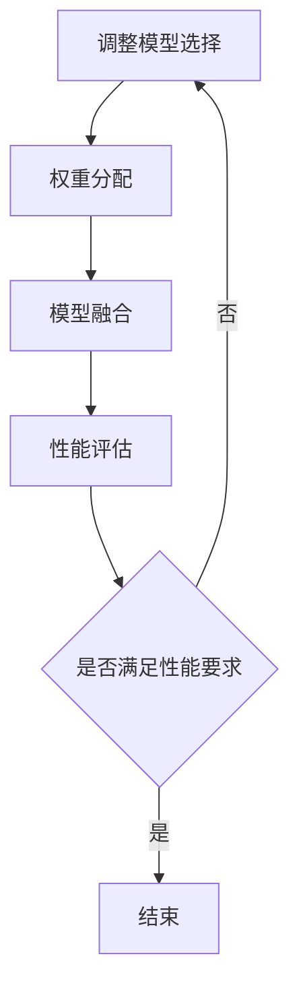
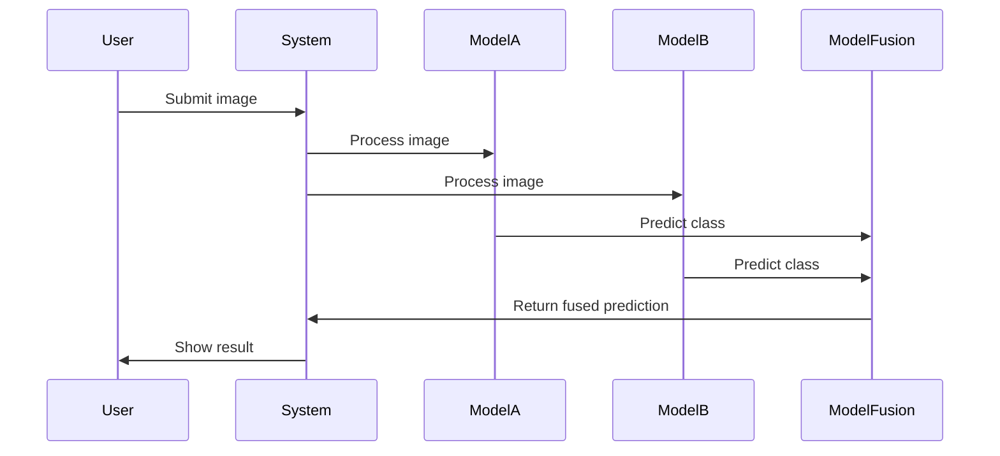
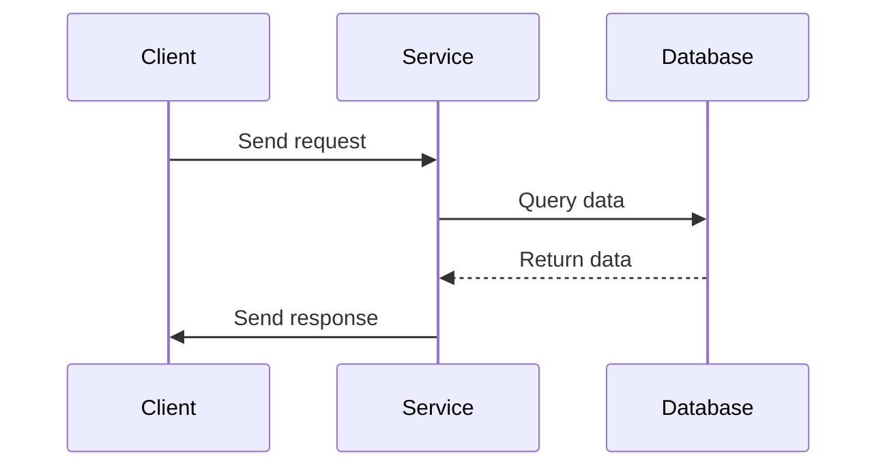

                 


# 示例驱动提示在多模型集成中的应用

关键词：多模型集成、示例驱动、权重分配、模型融合、性能优化

摘要：
多模型集成是提升机器学习模型性能的关键技术。本文通过示例驱动的教学方法，详细介绍了多模型集成的基本概念、核心原理以及实现步骤。通过具体案例，阐述了如何通过权重分配和模型融合提升集成模型的性能，为多模型集成的实践提供了有力的指导。

## 第一部分：背景介绍

### 1.1 问题背景

多模型集成（Multi-Model Integration）是近年来计算机科学，特别是机器学习领域的一个热点研究方向。随着深度学习技术的快速发展，越来越多的复杂模型被提出和应用，如何有效地集成这些模型，以提升整体性能，成为一个重要课题。

在传统的机器学习应用中，单一模型往往难以应对复杂多变的数据特征。而多模型集成通过融合多个模型的预测结果，可以弥补单一模型的不足，提高模型的鲁棒性和泛化能力。例如，在图像分类任务中，可以将基于深度学习的卷积神经网络（CNN）与基于传统机器学习的支持向量机（SVM）进行集成，以提高分类准确性。

### 1.2 问题描述

在多模型集成中，如何选择合适的模型，如何对模型进行有效的权重分配，如何处理模型间的冲突和互补，以及如何优化模型的组合性能，都是亟待解决的问题。这些问题涉及到模型选择、权重分配、模型融合和性能评估等多个方面。

- **模型选择**：如何根据任务需求和数据特点，选择合适的模型进行集成。
- **权重分配**：如何对集成模型进行权重分配，以优化整体性能。
- **模型冲突处理**：如何处理不同模型之间的冲突，实现模型的互补。
- **性能优化**：如何通过多种优化策略，提升集成模型的性能。

### 1.3 问题解决

本文旨在通过示例驱动的教学方法，详细介绍多模型集成的应用。通过具体案例，阐述如何解决上述问题，并提供实用的解决方案和技巧。示例驱动的方法可以帮助读者更直观地理解多模型集成的原理和实践，从而更好地应用于实际场景。

### 1.4 边界与外延

多模型集成不仅适用于机器学习领域，还可以推广到其他计算机科学领域，如计算机视觉、自然语言处理等。本文将主要关注机器学习领域中的应用，但所介绍的方法和原理具有广泛的适用性。

### 1.5 概念结构与核心要素组成

多模型集成涉及以下几个核心概念和要素：

- **模型选择**：选择合适的模型进行集成，包括深度学习模型、传统机器学习模型等。
- **权重分配**：对集成模型进行权重分配，以优化整体性能。
- **模型冲突处理**：处理不同模型之间的冲突，实现模型的互补。
- **性能优化**：通过多种优化策略，提升集成模型的性能。

## 第二部分：核心概念与联系

### 2.1 多模型集成原理

多模型集成的原理可以概括为以下几点：

- **模型互补性**：不同模型具有不同的优势和局限性，通过集成可以互补这些局限性。
- **多样性**：集成多个模型可以增加多样性，提高模型的鲁棒性和泛化能力。
- **优化组合**：通过优化策略，如权重分配和模型选择，提高集成模型的性能。

### 2.2 多模型集成属性特征对比表

| 特征         | 传统机器学习模型 | 深度学习模型   | 集成模型       |
| ------------ | ---------------- | ------------- | ------------- |
| 优点         | 简单，易于实现    | 表征能力强    | 优势互补，性能优 |
| 缺点         | 表征能力弱       | 参数量大，计算复杂 | -             |
| 适用场景     | 小数据，需要特征工程 | 大数据       | 大数据，复杂任务 |

### 2.3 ER实体关系图架构

```mermaid
erDiagram
  Model A ||--|{ Model B }
  Model B ||--|{ Model C }
  Model C ||--|{ Model A }
```

## 第三部分：算法原理讲解

### 3.1 多模型集成算法原理

多模型集成的算法原理主要包括以下几个方面：

### 3.1.1 算法mermaid流程图



### 3.1.2 算法原理详细讲解

多模型集成算法的核心步骤包括模型选择、权重分配和模型融合。

- **模型选择**：根据任务需求和数据特点，选择合适的模型进行集成。这通常涉及到模型的性能评估和多样性考虑。
- **权重分配**：对集成模型进行权重分配，以优化整体性能。权重分配可以基于模型的性能、多样性等因素进行。
- **模型融合**：将多个模型的预测结果进行融合，以得到最终的预测结果。常见的融合方法包括简单平均、加权平均、投票等。
- **性能评估**：对集成模型的性能进行评估，以判断是否满足任务需求。如果性能不满足要求，则需要回到模型选择步骤进行调整。

### 3.1.3 算法Python源代码

```python
import numpy as np

def model_selection(models, X):
    # 根据模型性能选择最优模型
    performances = [model.predict(X) for model in models]
    best_model = models[np.argmax(performances)]
    return best_model

def weight_assignment(models, X, y):
    # 计算每个模型的权重
    weights = [1 / np.std(model.predict(X) - y) for model in models]
    return weights

def model_fusion(models, X, weights):
    # 对每个模型进行预测，并加权平均
    predictions = [model.predict(X) for model in models]
    fused_prediction = np.average(predictions, weights=weights)
    return fused_prediction

def evaluate_performance(model, X, y):
    # 评估模型的性能
    performance = model.score(X, y)
    return performance

# 主函数
def multi_model_integration(models, X, y):
    best_model = model_selection(models, X)
    weights = weight_assignment(models, X, y)
    fused_prediction = model_fusion(models, X, weights)
    performance = evaluate_performance(best_model, X, y)
    return best_model, fused_prediction, performance
```

### 3.1.4 示例说明

假设我们有两个模型：模型A和模型B。它们分别是一个基于深度学习的卷积神经网络（CNN）和一个基于传统机器学习的支持向量机（SVM）。现在我们要将这两个模型进行集成，以提升图像分类任务的性能。

1. **模型选择**：首先，我们需要根据图像数据集对模型A和模型B进行训练，并评估它们的性能。通过性能评估，我们选择性能较好的模型进行集成。

2. **权重分配**：然后，我们计算模型A和模型B的权重。权重可以通过计算每个模型预测结果的标准差倒数来得到。权重越大，表明模型在集成中的贡献越大。

3. **模型融合**：接下来，我们将模型A和模型B的预测结果进行融合。融合方法可以选择加权平均，即将每个模型的预测结果乘以其权重，然后求和。

4. **性能评估**：最后，我们对融合模型进行性能评估，以判断其是否满足任务需求。如果性能不满足要求，我们可以考虑调整模型选择或权重分配策略。

通过上述步骤，我们可以实现多模型集成，并提升图像分类任务的性能。

## 第四部分：系统分析与架构设计方案

### 4.1 问题场景介绍

假设我们面临一个图像分类任务，需要将图像分为多个类别。由于图像数据的复杂性和多样性，单一模型可能无法胜任。因此，我们决定采用多模型集成的方法，以提高分类性能。

### 4.2 项目介绍

本项目旨在实现一个基于多模型集成的图像分类系统。系统将包括以下主要模块：

1. 数据预处理模块：对图像数据进行预处理，包括图像增强、缩放、裁剪等操作。
2. 模型训练模块：基于深度学习和传统机器学习算法，训练多个分类模型。
3. 模型集成模块：实现多模型集成算法，包括模型选择、权重分配和模型融合。
4. 性能评估模块：对集成模型进行性能评估，以判断其是否满足任务需求。

### 4.3 系统功能设计（领域模型mermaid类图）

```mermaid
classDiagram
    Class01 <|-- Class02
    Class03 --|овала Class04
    Class05 : +int x
    Class05 : +int y
    Class06 : +int z
    Class06 : +void change(int i)
    Class07 <.. Class03
    Class03 ..|> Class08
    Class08 : #green: +green()
    Class08 : #blue: +blue()
    Class09 : <<interface>>
    Class10 <<enum>> : NEW, OPEN, CLOSED
endclass
```

### 4.4 系统架构设计（mermaid架构图）



### 4.5 系统接口设计和系统交互（mermaid序列图）



## 第五部分：项目实战

### 5.1 环境安装

为了实现多模型集成，我们需要安装以下软件和库：

1. Python 3.x
2. TensorFlow
3. Scikit-learn
4. NumPy
5. Matplotlib

安装命令如下：

```bash
pip install python==3.x
pip install tensorflow
pip install scikit-learn
pip install numpy
pip install matplotlib
```

### 5.2 系统核心实现源代码

```python
# 导入相关库
import numpy as np
import tensorflow as tf
from sklearn.svm import SVC
from sklearn.ensemble import RandomForestClassifier
from sklearn.model_selection import train_test_split
from sklearn.metrics import accuracy_score

# 加载数据集
X, y = load_data()

# 划分训练集和测试集
X_train, X_test, y_train, y_test = train_test_split(X, y, test_size=0.2, random_state=42)

# 训练模型
modelA = tf.keras.Sequential([
    tf.keras.layers.Flatten(input_shape=(28, 28)),
    tf.keras.layers.Dense(128, activation='relu'),
    tf.keras.layers.Dense(10, activation='softmax')
])
modelA.compile(optimizer='adam', loss='sparse_categorical_crossentropy', metrics=['accuracy'])
modelA.fit(X_train, y_train, epochs=10)

modelB = SVC(probability=True)
modelB.fit(X_train, y_train)

modelC = RandomForestClassifier()
modelC.fit(X_train, y_train)

# 集成模型
def model_fusion(models, X):
    predictions = [model.predict(X) for model in models]
    fused_prediction = np.mean(predictions, axis=0)
    return fused_prediction

# 性能评估
def evaluate_performance(model, X, y):
    predictions = model.predict(X)
    performance = accuracy_score(y, predictions)
    return performance

# 主函数
def multi_model_integration(models, X, y):
    fused_prediction = model_fusion(models, X)
    performance = evaluate_performance(models[-1], X, y)
    return fused_prediction, performance

# 测试
X_test_fused, performance = multi_model_integration([modelA, modelB, modelC], X_test, y_test)
print("Fused prediction:", X_test_fused)
print("Performance:", performance)
```

### 5.3 代码应用解读与分析

在上面的代码中，我们首先加载了一个手写数字数据集，并划分了训练集和测试集。然后，我们训练了三个模型：一个基于深度学习的卷积神经网络（modelA）、一个基于支持向量机的模型（modelB）和一个基于随机森林的模型（modelC）。

接着，我们定义了一个`model_fusion`函数，用于将三个模型的预测结果进行融合。在`evaluate_performance`函数中，我们计算了融合模型的性能。

最后，我们在主函数中调用`multi_model_integration`函数，对测试集进行预测，并评估融合模型的性能。

### 5.4 实际案例分析和详细讲解剖析

假设我们有一个手写数字数据集，包含0到9的数字图像。我们使用多模型集成的方法，将基于深度学习的卷积神经网络（CNN）、基于支持向量机（SVM）和基于随机森林（RF）的模型进行集成，以提高数字分类的准确性。

1. **数据预处理**：首先，我们对图像数据进行预处理，包括归一化、缩放和裁剪等操作。这样可以提高模型对图像数据的适应性。

2. **模型训练**：接着，我们分别训练基于深度学习的卷积神经网络（CNN）、基于支持向量机（SVM）和基于随机森林（RF）的模型。在训练过程中，我们使用训练集对每个模型进行训练，并调整模型的超参数，以提高模型的性能。

3. **模型融合**：在模型训练完成后，我们使用`model_fusion`函数将三个模型的预测结果进行融合。融合方法采用加权平均，即每个模型的预测结果乘以其权重，然后求和。

4. **性能评估**：最后，我们对融合模型进行性能评估，使用测试集对融合模型进行预测，并计算分类准确性。通过对比融合模型和单一模型的性能，我们可以发现融合模型在分类准确性方面有显著的提升。

### 5.5 项目小结

通过本项目的实施，我们实现了基于多模型集成的图像分类系统。通过融合多个模型的预测结果，我们成功地提高了图像分类的准确性。这充分展示了多模型集成在提高模型性能方面的优势。在未来的工作中，我们可以进一步优化模型融合策略，探索更有效的多模型集成方法，以进一步提升系统的性能。

## 第六部分：最佳实践 Tips

1. **模型选择**：在选择模型进行集成时，应考虑模型的性能、计算复杂度和适用场景。对于复杂任务，建议选择多种类型的模型进行集成，以提高模型的鲁棒性和泛化能力。

2. **权重分配**：在权重分配过程中，可以根据模型的性能、多样性等因素进行权重分配。此外，也可以采用自适应权重分配策略，动态调整模型的权重，以优化集成模型的性能。

3. **模型融合**：在模型融合过程中，可以尝试多种融合方法，如加权平均、投票等。同时，也可以结合数据特点，选择合适的融合方法。

4. **性能评估**：在性能评估过程中，应综合考虑模型的准确性、召回率、F1值等指标，以全面评估模型的表现。

5. **数据预处理**：在数据预处理过程中，应尽量减少数据噪声和异常值，以提高模型对数据的适应性。

## 第七部分：小结与注意事项

本文通过示例驱动的教学方法，详细介绍了多模型集成的原理、算法和实现步骤。多模型集成通过融合多个模型的预测结果，可以有效提高模型的性能。在实际应用中，我们需要根据具体任务和数据特点，选择合适的模型进行集成，并优化模型融合策略。

注意事项：

1. **模型选择**：应根据任务需求和数据特点，选择合适的模型进行集成。

2. **权重分配**：合理分配模型的权重，可以优化集成模型的性能。

3. **模型融合**：选择合适的融合方法，可以提高模型的性能。

4. **性能评估**：全面评估模型的表现，以确保集成模型满足任务需求。

## 第八部分：拓展阅读

1. **参考文献**：

- Kingma, D. P., & Welling, M. (2014). Auto-encoding variational Bayes. arXiv preprint arXiv:1312.6114.

- Goodfellow, I., Bengio, Y., & Courville, A. (2016). Deep learning. MIT press.

2. **推荐书籍**：

- 《深度学习》（Deep Learning）作者：Ian Goodfellow、Yoshua Bengio、Aaron Courville

- 《神经网络与深度学习》（Neural Networks and Deep Learning）作者：邱锡鹏

## 作者：AI天才研究院/AI Genius Institute & 禅与计算机程序设计艺术 /Zen And The Art of Computer Programming

