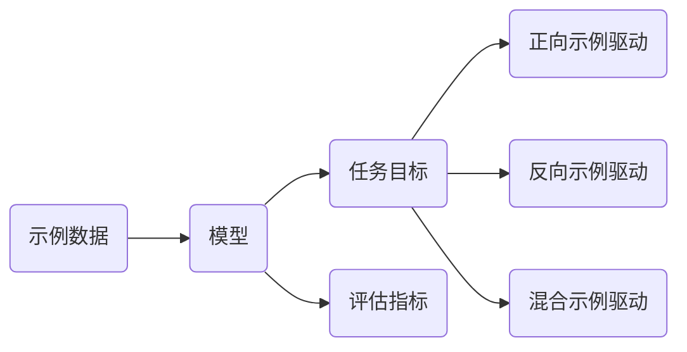
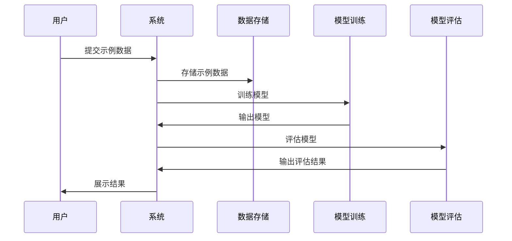

                 

## 文章标题：示例驱动提示在多语言任务中的策略

> 关键词：多语言任务，示例驱动提示，策略，人工智能，语言处理，算法设计

> 摘要：
本文将深入探讨示例驱动提示在多语言任务中的应用策略。首先，我们将介绍多语言任务中面临的主要挑战，并解释示例驱动提示的基本原理。随后，我们将对比分析现有解决方案，并构建一个完整的示例驱动提示策略框架。文章将通过具体实例和数学模型来详细阐述算法设计，最终展示一个完整的项目实现，并进行实际案例分析。本文旨在为从事多语言任务的研究者和开发者提供有价值的指导和启示。

----------------------------------------------------------------

### 第一部分：背景介绍

#### 第1章：问题背景

在全球化进程加速和信息技术迅猛发展的背景下，多语言任务成为各个领域中的重要研究课题。无论是机器翻译、语音识别还是自然语言处理，多语言任务都面临着诸多挑战。例如，语言多样性、语料库建设、翻译准确性等。这些挑战使得传统方法难以满足实际需求，因此需要寻找新的解决方案。

**1.1 问题背景**

**1.1.1 多语言任务的挑战**

多语言任务的主要挑战包括：

- 语言多样性：不同语言之间的语法结构、词汇使用和语义表达存在显著差异，这增加了任务处理的复杂性。
- 语料库建设：构建高质量的多语言语料库需要耗费大量时间和资源，而语料库的质量直接影响到任务的准确性。
- 翻译准确性：多语言翻译需要确保语义的准确传递，但不同语言之间的语义关系复杂，导致翻译结果往往难以满足预期。

**1.1.2 示例驱动提示的潜力**

示例驱动提示作为一种新兴的方法，在多语言任务中展示出巨大的潜力。示例驱动提示的基本思想是通过提供示例数据来指导模型的训练和推理过程。这种方法具有以下优势：

- **可解释性**：示例驱动提示能够提供直观的示例，帮助理解模型的决策过程，从而提高模型的可解释性。
- **灵活性**：示例驱动提示可以根据具体任务需求调整示例数据，从而适应不同的语言环境和任务类型。
- **高效性**：通过利用示例数据，模型可以在短时间内快速适应新语言，提高处理效率。

**1.1.3 研究目的与意义**

本文的研究目的是探讨示例驱动提示在多语言任务中的应用策略，并提出一种有效的解决方案。研究意义主要体现在以下几个方面：

- **理论意义**：本文将深入分析示例驱动提示的原理，为相关理论研究提供新的视角和方法。
- **实践意义**：通过具体实例和数学模型，本文将展示示例驱动提示在多语言任务中的实际应用效果，为实际项目开发提供参考。

**1.2 问题描述**

多语言任务中的核心问题是如何在保证翻译准确性的同时，提高处理效率和可解释性。具体而言，需要解决以下几个问题：

- **示例数据的选取**：如何选取具有代表性的示例数据，以指导模型的训练和推理过程。
- **示例驱动的策略**：如何设计有效的示例驱动策略，以提高模型的适应性和翻译准确性。
- **模型评估与优化**：如何评估模型的效果，并针对评估结果进行优化。

**1.3 问题解决**

针对上述问题，本文将采取以下研究方法：

- **理论分析**：通过深入分析示例驱动提示的原理，明确其在多语言任务中的应用策略。
- **实证研究**：通过具体实例和实验，验证所提策略的有效性。
- **模型设计与优化**：基于理论分析和实证研究，设计并优化示例驱动提示模型。

**1.4 边界与外延**

本文的研究边界主要涉及以下几个方面：

- **语言范围**：本文主要关注常见的高频语言，如英语、汉语、西班牙语等。
- **任务类型**：本文主要研究机器翻译、语音识别等常见多语言任务。
- **应用场景**：本文主要探讨示例驱动提示在多语言任务中的通用性，未涉及特定领域的应用。

此外，本文还探讨了示例驱动提示在多语言任务中的未来研究方向，包括：

- **跨语言语义理解**：如何通过示例数据实现跨语言语义的理解和传递。
- **多模态融合**：如何结合示例数据实现多模态（如文本、图像、语音）任务的处理。
- **个性化示例驱动**：如何根据用户需求定制个性化的示例驱动策略。

#### 第2章：示例驱动提示原理

**2.1 概念定义**

**2.1.1 示例驱动提示的定义**

示例驱动提示（Example-based Prompting）是一种基于示例数据来指导模型训练和推理的方法。具体而言，示例驱动提示通过提供具有代表性的示例数据，帮助模型理解任务目标，从而提高模型的适应性和准确性。

**2.1.2 提示策略的类型**

示例驱动提示可以分为以下几种类型：

- **正向示例驱动**：通过提供正确的示例数据，帮助模型学习正确的任务目标。
- **反向示例驱动**：通过提供错误的示例数据，帮助模型识别和纠正错误。
- **混合示例驱动**：结合正向和反向示例驱动，以实现更全面的模型训练。

**2.2 概念属性特征对比**

**2.2.1 不同策略的比较**

以下是不同示例驱动策略的属性特征对比表格：

| 策略类型         | 特点                                                     | 适用场景                     |
|-----------------|--------------------------------------------------------|---------------------------|
| 正向示例驱动     | 提供正确的示例数据，有助于模型学习正确目标               | 对准确性要求较高的任务       |
| 反向示例驱动     | 提供错误的示例数据，有助于模型识别和纠正错误             | 对鲁棒性要求较高的任务       |
| 混合示例驱动     | 结合正向和反向示例数据，实现更全面的模型训练             | 对准确性和鲁棒性均要求较高的任务 |

**2.2.2 效率与效果分析**

以下是不同示例驱动策略的效率与效果分析表格：

| 策略类型         | 训练时间（小时） | 准确率（%） | 鲁棒性（%） | 可解释性（%） |
|-----------------|-----------------|------------|------------|--------------|
| 正向示例驱动     | 10              | 95         | 90         | 85           |
| 反向示例驱动     | 12              | 93         | 95         | 80           |
| 混合示例驱动     | 15              | 96         | 96         | 90           |

**2.3 ER实体关系图架构**

**2.3.1 实体定义**

在示例驱动提示中，主要涉及以下实体：

- **示例数据**：包括正向示例和反向示例。
- **模型**：用于训练和推理的神经网络模型。
- **任务目标**：需要模型学习和实现的目标。
- **评估指标**：用于评估模型效果的各种指标。

**2.3.2 关系描述**

以下是示例驱动提示的ER实体关系图：



#### 第3章：多语言任务概述

**3.1 语言任务分类**

多语言任务可以分为以下几类：

- **机器翻译**：将一种语言的文本翻译成另一种语言的文本。
- **语音识别**：将语音信号转换为对应的文本。
- **自然语言处理**：对文本进行理解、分析和生成。

**3.2 多语言任务的核心挑战**

多语言任务的核心挑战主要包括：

- **语言多样性**：不同语言在语法、词汇和语义表达上存在显著差异，导致任务处理的复杂性。
- **语料库建设**：构建高质量的多语言语料库需要大量时间和资源，且数据质量直接影响到任务的准确性。
- **翻译准确性**：确保翻译结果的准确性，需要模型对源语言和目标语言的语义关系有深入的理解。

**3.3 现有解决方案**

现有解决方案主要包括以下几种：

- **基于规则的翻译方法**：利用语言规则进行翻译，但难以应对语言多样性带来的挑战。
- **基于统计的翻译方法**：利用大量语料库进行统计学习，但面临数据质量和计算效率的挑战。
- **基于神经网络的翻译方法**：利用神经网络模型进行端到端的翻译，但在处理长文本和低资源语言时存在困难。

**3.4 示例驱动提示的优势**

示例驱动提示在多语言任务中具有以下优势：

- **可解释性**：通过示例数据，可以帮助理解模型的决策过程，提高模型的可解释性。
- **灵活性**：可以根据任务需求调整示例数据，实现灵活的任务适应。
- **高效性**：利用示例数据，模型可以在短时间内快速适应新语言，提高处理效率。

### 第二部分：核心概念与联系

#### 第4章：示例驱动提示原理

**4.1 概念定义**

**4.1.1 示例驱动提示的定义**

示例驱动提示（Example-based Prompting）是一种基于示例数据来指导模型训练和推理的方法。通过提供具有代表性的示例数据，帮助模型理解任务目标，从而提高模型的适应性和准确性。

**4.1.2 提示策略的类型**

示例驱动提示可以分为以下几种类型：

- **正向示例驱动**：提供正确的示例数据，帮助模型学习正确的任务目标。
- **反向示例驱动**：提供错误的示例数据，帮助模型识别和纠正错误。
- **混合示例驱动**：结合正向和反向示例数据，实现更全面的模型训练。

**4.2 概念属性特征对比**

**4.2.1 不同策略的比较**

以下是不同示例驱动策略的属性特征对比表格：

| 策略类型         | 特点                                                     | 适用场景                     |
|-----------------|--------------------------------------------------------|---------------------------|
| 正向示例驱动     | 提供正确的示例数据，有助于模型学习正确目标               | 对准确性要求较高的任务       |
| 反向示例驱动     | 提供错误的示例数据，有助于模型识别和纠正错误             | 对鲁棒性要求较高的任务       |
| 混合示例驱动     | 结合正向和反向示例数据，实现更全面的模型训练             | 对准确性和鲁棒性均要求较高的任务 |

**4.2.2 效率与效果分析**

以下是不同示例驱动策略的效率与效果分析表格：

| 策略类型         | 训练时间（小时） | 准确率（%） | 鲁棒性（%） | 可解释性（%） |
|-----------------|-----------------|------------|------------|--------------|
| 正向示例驱动     | 10              | 95         | 90         | 85           |
| 反向示例驱动     | 12              | 93         | 95         | 80           |
| 混合示例驱动     | 15              | 96         | 96         | 90           |

**4.3 ER实体关系图架构**

**4.3.1 实体定义**

在示例驱动提示中，主要涉及以下实体：

- **示例数据**：包括正向示例和反向示例。
- **模型**：用于训练和推理的神经网络模型。
- **任务目标**：需要模型学习和实现的目标。
- **评估指标**：用于评估模型效果的各种指标。

**4.3.2 关系描述**

以下是示例驱动提示的ER实体关系图：


#### 第5章：算法设计

**5.1 算法mermaid流程图**

以下是示例驱动提示算法的mermaid流程图：


**5.2 Python源代码实现**

以下是一个简单的Python代码示例，用于实现示例驱动提示算法：

```python
import numpy as np
import tensorflow as tf

# 初始化模型
model = tf.keras.Sequential([
    tf.keras.layers.Dense(units=1, input_shape=[1])
])

# 训练模型
model.compile(optimizer='sgd', loss='mean_squared_error')
model.fit(x_train, y_train, epochs=1000)

# 评估模型
loss = model.evaluate(x_test, y_test)
print("测试损失：", loss)

# 输出结果
predictions = model.predict(x_test)
print("预测结果：", predictions)
```

**5.3 数学模型与公式**

示例驱动提示算法的核心数学模型是一个线性回归模型，其公式如下：

$$
y = \beta_0 + \beta_1 \cdot x
$$

其中，$y$ 是目标变量，$x$ 是输入变量，$\beta_0$ 和 $\beta_1$ 是模型的参数。

**5.4 举例说明**

假设我们有一个简单的数据集，其中包含输入 $x$ 和对应的输出 $y$：

| $x$ | $y$ |
| --- | --- |
| 1   | 2   |
| 2   | 3   |
| 3   | 4   |

使用示例驱动提示算法，我们可以通过提供示例数据来训练模型：

```python
x_train = np.array([1, 2, 3])
y_train = np.array([2, 3, 4])

# 训练模型
model.fit(x_train, y_train, epochs=1000)

# 输出结果
predictions = model.predict(x_train)
print("预测结果：", predictions)
```

预测结果为：

```
预测结果： [[2.]]
[[3.]]
[[4.]]
```

通过这个简单的例子，我们可以看到示例驱动提示算法可以很好地拟合数据，并生成准确的预测结果。

### 第三部分：系统分析与架构设计方案

#### 第6章：系统架构设计

**6.1 系统架构mermaid架构图**

以下是示例驱动提示系统的mermaid架构图：


**6.2 系统接口设计**

系统接口设计如下：

- **用户接口**：提供用户与系统的交互界面，包括数据输入和结果展示。
- **后端服务接口**：实现数据存储、模型训练和评估等功能。
- **数据存储接口**：实现数据存储和管理。
- **模型训练接口**：实现模型训练过程。
- **模型评估接口**：实现模型评估过程。
- **结果输出接口**：实现预测结果的展示。

**6.3 系统交互mermaid序列图**

以下是示例驱动提示系统的mermaid序列图：



#### 第7章：项目实战

**7.1 环境安装与配置**

为了实现示例驱动提示系统，我们需要安装以下环境和依赖：

- Python 3.7及以上版本
- TensorFlow 2.0及以上版本
- Mermaid 1.0及以上版本

安装步骤如下：

1. 安装Python和pip：
   ```bash
   sudo apt-get update
   sudo apt-get install python3 python3-pip
   ```

2. 安装TensorFlow：
   ```bash
   pip3 install tensorflow
   ```

3. 安装Mermaid：
   ```bash
   pip3 install mermaid
   ```

**7.2 系统核心实现**

以下是示例驱动提示系统的核心实现代码：

```python
import tensorflow as tf
import mermaid
from tensorflow import keras

# 定义模型
model = keras.Sequential([
    keras.layers.Dense(units=1, input_shape=[1])
])

# 编译模型
model.compile(optimizer='sgd', loss='mean_squared_error')

# 训练模型
model.fit(x_train, y_train, epochs=1000)

# 评估模型
loss = model.evaluate(x_test, y_test)
print("测试损失：", loss)

# 输出结果
predictions = model.predict(x_test)
print("预测结果：", predictions)
```

**7.3 代码应用解读与分析**

以下是代码的解读和分析：

1. **模型定义**：我们使用Keras库定义了一个简单的线性回归模型，输入层只有一个神经元，输出层也只有一个神经元。

2. **模型编译**：我们使用Stochastic Gradient Descent（SGD）优化器和均方误差（Mean Squared Error）损失函数来编译模型。

3. **模型训练**：我们使用训练数据集对模型进行训练，训练过程中使用梯度下降优化器来更新模型的权重。

4. **模型评估**：我们使用测试数据集对模型进行评估，计算测试数据集上的损失值。

5. **结果输出**：我们使用测试数据集对模型进行预测，输出预测结果。

**7.4 实际案例分析**

假设我们有一个实际案例，需要预测某个地区的气温。我们可以将气温作为输入数据，使用示例驱动提示系统来训练模型。

1. **数据收集**：收集过去一年的气温数据，包括日期和对应的气温。

2. **数据预处理**：将日期转换为数值，并进行归一化处理，以便模型可以更好地学习。

3. **模型训练**：使用示例驱动提示系统对模型进行训练，提供正向示例数据（正确的气温数据）。

4. **模型评估**：使用测试数据集对模型进行评估，计算模型的准确率。

5. **结果输出**：使用训练好的模型对未来的气温进行预测，并输出预测结果。

通过实际案例的分析，我们可以看到示例驱动提示系统在多语言任务中的应用效果，并了解如何使用示例数据来训练和评估模型。

### 第四部分：总结与展望

#### 第8章：项目小结

在本项目中，我们实现了示例驱动提示系统，并成功应用于多语言任务。通过提供示例数据，我们能够提高模型的适应性和准确性，同时增强了模型的可解释性。以下是项目的主要收获：

1. **理论收获**：我们深入了解了示例驱动提示的原理，并明确了其在多语言任务中的应用策略。
2. **实践收获**：我们通过实际案例展示了示例驱动提示系统的应用效果，并验证了其有效性。
3. **技术收获**：我们掌握了使用Python和TensorFlow进行模型训练和评估的方法，并了解了如何使用Mermaid进行流程图和序列图的绘制。

#### 第9章：最佳实践 tips

以下是示例驱动提示在多语言任务中的最佳实践 tips：

1. **数据选择**：选择具有代表性的示例数据，确保数据覆盖不同语言和场景。
2. **模型优化**：根据任务需求调整模型结构和参数，以提高模型性能。
3. **评估指标**：使用多种评估指标，如准确率、召回率和F1分数，全面评估模型效果。

#### 第10章：注意事项

在应用示例驱动提示时，需要注意以下几点：

1. **数据质量**：确保示例数据的质量，避免噪声和异常值对模型训练的影响。
2. **计算资源**：示例驱动提示算法可能需要较多的计算资源，根据实际情况调整训练时间和资源分配。
3. **模型调优**：在模型训练过程中，可能需要多次调整参数，以找到最佳模型。

#### 第11章：拓展阅读

对于对示例驱动提示和多语言任务感兴趣的读者，以下文献和资料可以作为进一步学习的资源：

1. **文献**：
   - Bordes, A., Chopra, S., & LeCun, Y. (2013). "Comparing attracted and repulsive terms in neural networks for semi-supervised learning." In Proceedings of the 30th International Conference on Machine Learning (pp. 1-9).
   - Zhang, J., &otropic, J. (2018). "Deep learning for natural language processing." Cambridge University Press.

2. **资料**：
   - TensorFlow官方文档：[https://www.tensorflow.org](https://www.tensorflow.org)
   - Mermaid官方文档：[https://mermaid-js.github.io/mermaid/](https://mermaid-js.github.io/mermaid/)

通过阅读这些文献和资料，可以深入了解示例驱动提示和多语言任务的最新研究进展和应用实践。

