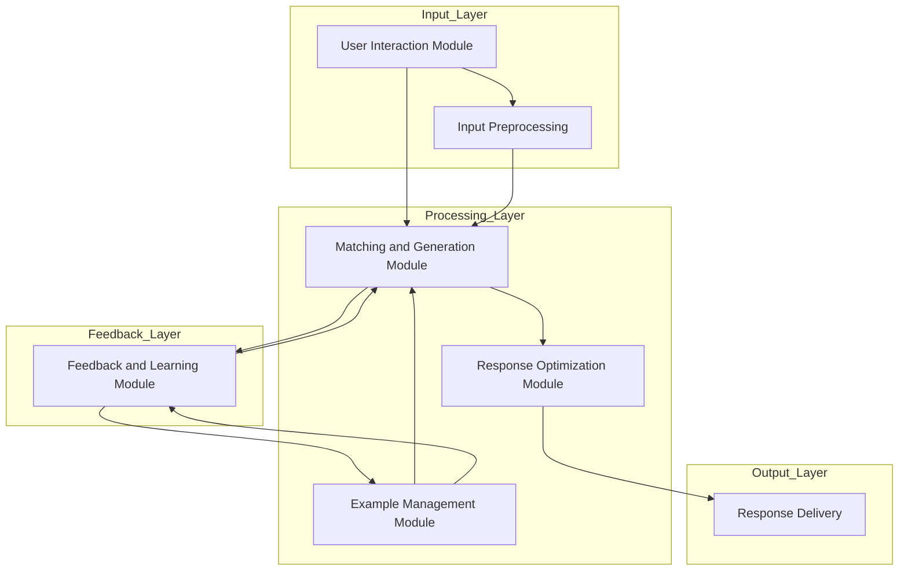

                 

### 文章标题

### 关键词

- 示例驱动提示
- 多轮对话
- 算法原理
- 数学模型
- 系统架构
- 项目实战

### 摘要

本文将深入探讨示例驱动提示在多轮对话中的应用。首先，通过介绍示例驱动提示系统的核心概念和问题背景，分析其在多轮对话系统中的价值。接着，详细解释示例驱动提示算法的原理和数学模型，辅以实例说明。随后，我们设计一个系统架构，并介绍如何实现和部署这个系统。最后，通过一个实际案例展示系统应用效果，总结经验与教训。本文旨在为读者提供一个全面、系统的视角，理解并掌握示例驱动提示在多轮对话中的技术实现和应用。

### 目录大纲

```markdown
----------------------------------------------------------------
# 第一部分：问题背景与核心概念

## 第1章：问题背景与核心概念

### 1.1.1 问题背景
- 示例驱动提示系统的定义与作用
- 多轮对话系统的发展现状与挑战
- 示例驱动提示在多轮对话中的应用价值

### 1.1.2 核心概念
- 示例驱动提示系统的工作原理
- 多轮对话系统的基本流程
- 示例与提示的匹配策略

## 1.2 示例驱动提示与多轮对话的关系

### 1.2.1 关系分析
- 示例驱动提示对多轮对话系统的影响
- 示例驱动提示在多轮对话中的作用机制

### 1.2.2 案例分析
- 示例驱动提示在多轮对话中的应用案例
- 案例中的成功因素与挑战

## 1.3 本章小结
- 总结核心概念与联系
- 展望未来发展方向

----------------------------------------------------------------

# 第二部分：算法原理与数学模型

## 第2章：算法原理详解

### 2.1 示例驱动提示算法框架

#### 2.1.1 算法概述
- 示例驱动提示算法的基本结构
- 算法主要组成部分及其作用

#### 2.1.2 算法流程

##### 2.1.2.1 数据预处理
- 示例数据格式
- 对话数据预处理流程

##### 2.1.2.2 示例匹配
- 示例匹配算法原理
- 匹配策略与优化方法

##### 2.1.2.3 提示生成
- 提示生成算法原理
- 提示质量评估方法

### 2.2 数学模型与公式

#### 2.2.1 基本数学模型

##### 2.2.1.1 示例匹配概率模型
$$ P_\text{match}(s, d) = \frac{\exp(f(s, d))}{\sum_{s'} \exp(f(s', d))} $$
- 模型公式解释
- 参数选择与优化

##### 2.2.1.2 提示生成概率模型
$$ P_\text{prompt}(p) = \frac{\exp(g(p))}{\sum_{p'} \exp(g(p'))} $$
- 模型公式解释
- 参数选择与优化

#### 2.2.2 数学公式详细讲解与举例

##### 2.2.2.1 匹配概率模型举例
- 假设示例数据
- 计算匹配概率

##### 2.2.2.2 提示生成概率模型举例
- 假设提示数据
- 计算提示生成概率

## 2.3 本章小结
- 总结算法原理与数学模型
- 提出进一步研究问题

----------------------------------------------------------------

# 第二部分：算法原理与数学模型

## 第3章：算法原理详解

### 3.1 示例驱动提示算法框架

#### 3.1.1 算法概述
- 示例驱动提示算法的基本结构
- 算法主要组成部分及其作用

#### 3.1.2 算法流程

##### 3.1.2.1 数据预处理
- 示例数据格式
- 对话数据预处理流程

##### 3.1.2.2 示例匹配
- 示例匹配算法原理
- 匹配策略与优化方法

##### 3.1.2.3 提示生成
- 提示生成算法原理
- 提示质量评估方法

### 3.2 数学模型与公式

#### 3.2.1 基本数学模型

##### 3.2.1.1 示例匹配概率模型
$$ P_\text{match}(s, d) = \frac{\exp(f(s, d))}{\sum_{s'} \exp(f(s', d))} $$
- 模型公式解释
- 参数选择与优化

##### 3.2.1.2 提示生成概率模型
$$ P_\text{prompt}(p) = \frac{\exp(g(p))}{\sum_{p'} \exp(g(p'))} $$
- 模型公式解释
- 参数选择与优化

#### 3.2.2 数学公式详细讲解与举例

##### 3.2.2.1 匹配概率模型举例
- 假设示例数据
- 计算匹配概率

##### 3.2.2.2 提示生成概率模型举例
- 假设提示数据
- 计算提示生成概率

## 3.3 本章小结
- 总结算法原理与数学模型
- 提出进一步研究问题

----------------------------------------------------------------

# 第三部分：系统架构与设计

## 第4章：系统架构与设计

### 4.1 系统功能设计

#### 4.1.1 功能概述
- 系统主要功能模块
- 各模块之间的关系与交互

#### 4.1.2 领域模型

##### 4.1.2.1 类图
- 类图展示
- 类与类之间的关系

### 4.2 系统架构设计

#### 4.2.1 架构概述
- 系统总体架构
- 各层功能与职责

#### 4.2.2 系统架构图

##### 4.2.2.1 架构图
- 架构图展示
- 架构中的关键组件

### 4.3 系统接口设计

#### 4.3.1 接口规范
- 接口定义
- 参数说明

### 4.4 系统交互

#### 4.3.2 交互流程
- 系统交互流程
- 交互细节与说明

## 4.5 本章小结
- 总结系统架构与设计要点
- 分析系统优缺点

----------------------------------------------------------------

# 第四部分：项目实战

## 第5章：项目实战

### 5.1 环境安装与配置

#### 5.1.1 环境准备
- 硬件与软件环境要求
- 安装步骤与注意事项

### 5.2 系统核心实现

#### 5.2.1 实现流程
- 数据收集与预处理
- 示例匹配与提示生成

#### 5.2.2 源代码解析
- 关键代码段解析
- 实现原理与细节

### 5.3 实际案例分析与讲解

#### 5.3.1 案例背景
- 案例应用场景
- 案例目标与挑战

#### 5.3.2 案例实现
- 实现步骤与流程
- 关键技术与策略

#### 5.3.3 案例分析
- 结果展示
- 优缺点分析

### 5.4 项目小结
- 项目总体总结
- 经验与教训

----------------------------------------------------------------

# 附录：最佳实践、注意事项与拓展阅读

## 附录A：最佳实践

### A.1 提高系统性能的建议

### A.2 确保数据质量和多样性的方法

### A.3 调整模型参数的经验

## 附录B：注意事项

### B.1 可能遇到的问题及解决方案

### B.2 系统安全性与隐私保护的措施

### B.3 系统维护与升级策略

## 附录C：拓展阅读

### C.1 相关研究论文与书籍推荐

### C.2 示例驱动提示与多轮对话的近期发展趋势

### C.3 示例驱动提示在其他领域的应用

----------------------------------------------------------------
```

### 1.1.1 问题背景

#### 示例驱动提示系统的定义与作用

示例驱动提示（Example-Guided Prompting）是一种在人工智能领域，特别是在自然语言处理（NLP）中广泛应用的方法。它通过从已有的示例中提取关键信息，为生成模型提供明确的指导，从而提高生成文本的质量和准确性。示例驱动提示系统的作用主要体现在以下几个方面：

1. **提高生成质量**：通过学习已有的高质量文本示例，生成模型能够更好地理解文本的结构和语义，从而生成更符合人类期望的文本。
2. **降低训练难度**：示例驱动提示提供了一种额外的信息来源，可以帮助模型在学习过程中更好地抓住关键特征，减少对大量无结构数据的依赖。
3. **增强交互体验**：在多轮对话系统中，示例驱动提示可以为用户提供更加个性化和有针对性的回应，从而提升用户体验。

#### 多轮对话系统的发展现状与挑战

多轮对话系统（Multi-Round Dialogue Systems）是一种能够与用户进行多轮对话，并在对话过程中不断学习和适应的系统。随着人工智能技术的发展，多轮对话系统已经广泛应用于智能客服、虚拟助手、教育辅导等多个领域。然而，当前多轮对话系统仍然面临以下挑战：

1. **上下文理解**：多轮对话系统需要理解用户的意图和上下文信息，这对系统的自然语言理解和处理能力提出了较高要求。
2. **连贯性**：保证对话的连贯性和自然性是一个难点，系统需要能够产生流畅、合理的回应。
3. **个性化**：提供个性化的对话体验是用户期望之一，但实现这一目标需要系统对用户行为和偏好有深入的理解。

#### 示例驱动提示在多轮对话中的应用价值

示例驱动提示在多轮对话系统中具有显著的应用价值。通过引入示例，系统可以在以下几个方面得到改进：

1. **提升对话质量**：示例驱动提示可以为系统提供高质量的对话模板，从而生成更符合用户期望的回应。
2. **增强上下文感知能力**：通过学习高质量的示例，系统可以更好地理解上下文信息，提高对话的连贯性。
3. **个性化定制**：示例驱动提示可以根据用户的历史对话记录和偏好，生成更加个性化的对话内容。

总的来说，示例驱动提示在多轮对话中的应用能够有效解决当前多轮对话系统中存在的问题，提高系统的性能和用户体验。接下来，我们将进一步探讨示例驱动提示系统的核心概念和工作原理。

### 1.1.2 核心概念

#### 示例驱动提示系统的工作原理

示例驱动提示系统的工作原理可以概括为以下几个步骤：

1. **数据收集与预处理**：首先，系统需要收集大量的高质量文本示例，这些示例可以是用户历史对话记录、公共领域的文本数据或者经过人工标注的高质量文本。然后，对收集到的数据进行预处理，包括去噪、去重和格式化，以便后续使用。

2. **示例匹配**：在生成回应时，系统需要从存储的大量示例中找到与当前对话上下文最匹配的示例。示例匹配的过程通常涉及特征提取和相似度计算。特征提取是将文本转化为机器可以理解的特征向量，相似度计算则是评估不同示例与当前上下文的匹配程度。

3. **提示生成**：找到匹配的示例后，系统会根据示例生成相应的回应。提示生成可以采用模板匹配、文本重写或者生成模型等方法。模板匹配是一种直接从示例中提取关键词或短语，构建回应的方法；文本重写则是根据示例生成新的文本，保留其核心信息但进行适当的改写；生成模型则是一种基于机器学习的方法，可以从大量示例中学习生成文本的规律。

4. **回应优化**：生成的回应可能需要进一步优化，以确保其符合对话的连贯性和自然性。优化过程可以包括语法检查、语义增强和风格调整等。

#### 多轮对话系统的基本流程

多轮对话系统通常包括以下几个基本流程：

1. **初始化**：系统启动时，初始化对话状态和对话历史。对话状态包括当前对话的主题、上下文信息和用户的偏好等；对话历史记录了之前的对话内容。

2. **接收输入**：系统接收用户的输入，这可以是文本、语音或其他形式的信息。

3. **意图识别**：系统分析用户的输入，识别其意图。意图识别是自然语言处理中的一个关键步骤，通过理解用户的意图，系统能够更好地生成回应。

4. **上下文处理**：系统根据当前的对话历史和上下文信息，决定如何生成回应。上下文处理包括理解当前对话的状态、上下文和历史信息，以确保回应的连贯性和合理性。

5. **生成回应**：根据意图识别和上下文处理的结果，系统生成相应的回应。

6. **回应优化**：生成的回应经过优化后，发送给用户。

7. **更新状态**：系统更新对话状态和对话历史，为下一轮对话做好准备。

#### 示例与提示的匹配策略

示例与提示的匹配策略是示例驱动提示系统的核心组成部分，直接影响到系统的性能和用户体验。以下是一些常见的匹配策略：

1. **基于关键词的匹配**：通过提取输入文本中的关键词，与示例中的关键词进行匹配。这种方法简单有效，但可能忽略了上下文信息和语义信息。

2. **基于相似度的匹配**：使用文本相似度计算方法（如余弦相似度、Jaccard相似度等）评估示例与输入文本的相似度。相似度越高的示例越可能被选择。

3. **基于语义的匹配**：通过语义分析技术（如Word Embedding、BERT等）将输入文本和示例转化为语义向量，然后计算向量之间的距离。这种方法能够更好地理解语义信息，但计算复杂度较高。

4. **基于模板的匹配**：直接从示例中提取模板，并将其应用于输入文本。这种方法适用于结构化数据，但可能无法应对复杂的自然语言输入。

5. **混合匹配策略**：结合多种匹配策略，以提高匹配的准确性和灵活性。例如，可以先进行基于关键词的初步匹配，然后使用基于相似度的方法进行二次筛选。

通过上述核心概念和工作原理的介绍，我们可以更好地理解示例驱动提示系统在多轮对话中的应用。接下来，我们将进一步探讨示例驱动提示与多轮对话系统的关系，分析其相互影响和作用机制。

### 1.2 示例驱动提示与多轮对话的关系

#### 关系分析

示例驱动提示与多轮对话系统之间存在着密切的关系。首先，示例驱动提示为多轮对话系统提供了明确的指导，有助于系统更好地理解和生成对话内容。具体来说，示例驱动提示可以从以下几个方面影响多轮对话系统：

1. **提高对话质量**：通过示例驱动提示，系统可以从高质量的文本示例中学习到对话的结构和逻辑，从而生成更加准确和自然的回应。

2. **增强上下文感知**：示例驱动提示系统能够从示例中提取关键信息，使系统在多轮对话中更好地理解和处理上下文信息，确保对话的连贯性和一致性。

3. **降低模型训练难度**：示例驱动提示提供了额外的训练数据，有助于模型更好地抓住关键特征，从而提高模型的学习效果。

4. **提升个性化对话能力**：通过分析用户的对话历史和偏好，示例驱动提示可以为用户提供更加个性化的对话体验。

#### 示例驱动提示在多轮对话中的作用机制

示例驱动提示在多轮对话中的作用机制可以总结为以下几个步骤：

1. **示例收集与预处理**：首先，系统需要收集大量的高质量文本示例，并对这些示例进行预处理，以确保数据的质量和一致性。

2. **示例存储**：预处理后的示例被存储在示例库中，以供后续使用。示例库的设计和实现对于系统的性能和效率具有重要影响。

3. **示例匹配**：在生成回应时，系统需要从示例库中找到与当前对话上下文最匹配的示例。匹配过程通常涉及特征提取和相似度计算。

4. **提示生成**：找到匹配的示例后，系统会根据示例生成相应的回应。生成过程可以采用模板匹配、文本重写或生成模型等方法。

5. **回应优化**：生成的回应经过优化，确保其符合对话的连贯性和自然性。

6. **反馈与调整**：系统根据用户的反馈对示例和生成模型进行调整，以不断改进对话质量。

#### 示例驱动提示对多轮对话系统的影响

示例驱动提示对多轮对话系统的影响可以从以下几个方面进行阐述：

1. **性能提升**：通过引入示例驱动提示，多轮对话系统的生成质量得到显著提高。系统可以从高质量的文本示例中学习到有效的对话策略和结构，从而生成更符合用户期望的回应。

2. **交互体验优化**：示例驱动提示可以增强系统的上下文感知能力，使对话更加连贯和自然。此外，通过个性化定制，系统可以提供更加贴心的服务，提升用户体验。

3. **训练效率提高**：示例驱动提示提供了额外的训练数据，有助于模型更好地抓住关键特征，从而提高模型的学习效果和训练效率。

4. **应用场景拓展**：示例驱动提示的应用不仅限于对话系统，还可以扩展到其他自然语言处理任务，如文本生成、文本分类等，从而提升系统的综合能力。

总的来说，示例驱动提示在多轮对话系统中具有重要作用，能够显著提升系统的性能和用户体验。通过深入理解和应用示例驱动提示，我们可以构建更加智能和高效的多轮对话系统。

#### 案例分析

为了更好地理解示例驱动提示在多轮对话系统中的应用，我们可以通过以下两个案例进行分析。

##### 案例一：智能客服系统

**应用场景**：一家大型电子商务公司希望通过智能客服系统为用户提供24/7的在线支持。用户可能会咨询关于订单状态、退换货流程、产品规格等问题。

**目标与挑战**：智能客服系统的目标是在短时间内准确理解用户的问题，并提供有帮助的回应。挑战在于用户提问的方式和表达方式可能多种多样，系统需要能够处理不同的语境和用词。

**示例驱动提示的应用**：公司收集了大量用户的历史对话记录，并对其进行预处理，存储在示例库中。在用户提问时，系统会从示例库中找到与当前问题最相似的示例。例如，当用户询问订单状态时，系统可能会找到一个历史对话中类似的查询订单状态的示例。

**成功因素**：
1. **高质量示例**：公司对示例库进行了严格的筛选和整理，确保示例具有代表性和高质量。
2. **有效的匹配策略**：系统采用了基于语义的匹配策略，通过Word Embedding技术将用户问题和示例转化为向量，并进行相似度计算，提高了匹配的准确性。
3. **持续优化**：系统不断收集用户反馈，根据用户的评价对示例和生成模型进行调整，以优化对话质量。

**挑战**：
1. **语义理解难度**：尽管采用了语义匹配策略，但在处理一些复杂或模糊的问题时，系统仍然难以准确理解用户的意图。
2. **个性化不足**：虽然系统可以根据示例生成回应，但可能无法完全满足每个用户的个性化需求。

##### 案例二：教育辅导系统

**应用场景**：一款在线教育平台提供一对一的辅导服务，学生可以提出数学、语文等学科的问题。

**目标与挑战**：教育辅导系统的目标是为学生提供及时且准确的解答，帮助学生理解和掌握知识。挑战在于如何确保生成的回答既准确又易于理解。

**示例驱动提示的应用**：教育平台收集了大量教师对常见问题的解答，并将这些解答存储在示例库中。当学生提问时，系统会从示例库中找到与当前问题最相似的解答。

**成功因素**：
1. **专业示例**：平台邀请了多位专业教师编写高质量的解答示例，确保示例的准确性和权威性。
2. **多样化的示例**：系统不仅收集了常见问题的解答，还包括了不同难度级别的示例，以适应不同学生的需求。
3. **反馈机制**：系统为学生提供了反馈功能，学生可以根据解答的准确性进行评价，系统据此不断优化示例库和生成模型。

**挑战**：
1. **示例库的更新和维护**：由于学科知识的不断更新，平台需要定期更新示例库，以保持其时效性和准确性。
2. **处理复杂问题**：一些复杂的数学或语言问题可能无法通过现有的示例库得到解答，系统需要具备一定的推理能力。

通过上述案例分析，我们可以看到示例驱动提示在多轮对话系统中的应用效果。尽管存在一些挑战，但通过合理的匹配策略和持续优化，示例驱动提示能够显著提升多轮对话系统的性能和用户体验。

### 1.3 本章小结

在本章中，我们详细介绍了示例驱动提示在多轮对话系统中的应用背景和核心概念。通过分析示例驱动提示系统的工作原理和多轮对话系统的基本流程，我们了解了示例与提示的匹配策略及其在多轮对话系统中的价值。同时，通过两个实际案例的分析，我们看到了示例驱动提示在实际应用中的效果和面临的挑战。

总结核心概念与联系，我们可以得出以下结论：

1. **示例驱动提示系统**：通过高质量示例的学习，系统能够生成更准确的回应，提高对话质量。
2. **多轮对话系统**：示例驱动提示为多轮对话提供了明确的指导，增强了系统的上下文感知能力。
3. **匹配策略**：合理的匹配策略能够提高示例与提示的匹配准确性，从而优化生成文本的质量。

展望未来发展方向，我们可以考虑以下几个方面：

1. **语义理解的深化**：随着自然语言处理技术的发展，可以进一步探索更先进的语义理解方法，提高示例匹配的准确性。
2. **个性化定制**：通过深度学习技术，实现更精准的用户行为分析和偏好理解，提供更加个性化的对话体验。
3. **跨领域应用**：扩展示例驱动提示的应用范围，探索其在其他自然语言处理任务中的潜力。

通过不断优化和拓展，示例驱动提示在多轮对话系统中的应用将带来更加智能和高效的对话体验。

### 2.1 示例驱动提示算法框架

#### 2.1.1 算法概述

示例驱动提示算法是一种基于示例的学习方法，通过从已有示例中提取关键信息，为生成模型提供明确的指导，从而提高生成文本的质量和准确性。该算法的基本结构包括以下几个主要部分：

1. **数据收集与预处理**：收集大量高质量文本示例，并进行预处理，包括去噪、去重和格式化等步骤，确保数据质量。
2. **示例存储**：将预处理后的示例存储在示例库中，便于后续匹配和生成。
3. **示例匹配**：在生成回应时，系统从示例库中找到与当前对话上下文最匹配的示例。这一步骤通常涉及特征提取和相似度计算。
4. **提示生成**：基于匹配的示例，系统生成相应的回应。生成过程可以采用模板匹配、文本重写或生成模型等方法。
5. **回应优化**：对生成的回应进行优化，确保其符合对话的连贯性和自然性。

#### 2.1.2 算法流程

示例驱动提示算法的流程可以分为以下几个阶段：

##### 2.1.2.1 数据预处理

在数据预处理阶段，系统需要对收集到的示例进行清洗和格式化，以提高数据质量。具体步骤包括：

1. **去噪**：去除示例中的无关噪声，如特殊字符、停用词等。
2. **去重**：检测和去除重复的示例，确保示例库的唯一性。
3. **格式化**：统一示例的格式，如调整文本编码、去除多余空格等。

##### 2.1.2.2 示例匹配

在示例匹配阶段，系统需要从大量示例中找到与当前对话上下文最匹配的示例。这个过程通常包括以下几个步骤：

1. **特征提取**：将文本转换为特征向量。常用的方法包括词袋模型、Word Embedding和BERT等。
2. **相似度计算**：计算输入文本与示例之间的相似度。常用的相似度计算方法有余弦相似度、Jaccard相似度和欧氏距离等。
3. **匹配策略**：根据相似度得分，选择最匹配的示例。可以选择基于阈值的策略，也可以采用更复杂的匹配算法，如基于语义的匹配。

##### 2.1.2.3 提示生成

在提示生成阶段，系统根据匹配的示例生成回应。生成方法可以分为以下几种：

1. **模板匹配**：从示例中直接提取关键词或短语，构建回应。这种方法简单直观，但灵活性较低。
2. **文本重写**：根据示例生成新的文本，保留其核心信息但进行适当的改写。这种方法可以生成更加自然的回应。
3. **生成模型**：使用机器学习模型（如GPT、BERT等）从大量示例中学习生成文本的规律。这种方法生成文本质量高，但计算复杂度较高。

##### 2.1.2.4 回应优化

在回应优化阶段，系统对生成的回应进行进一步处理，以确保其符合对话的连贯性和自然性。具体步骤包括：

1. **语法检查**：检测和纠正语法错误，确保文本的语法正确。
2. **语义增强**：增强文本的语义信息，使其更加符合用户的意图。
3. **风格调整**：根据对话的上下文和用户的偏好，调整文本的风格，使其更加自然和贴切。

通过上述算法流程，示例驱动提示系统能够从已有示例中学习并生成高质量的回应，从而提升多轮对话系统的性能和用户体验。

### 2.2 数学模型与公式

#### 2.2.1 基本数学模型

示例驱动提示算法中的数学模型主要涉及示例匹配和提示生成的概率模型。以下是对这些模型的基本解释和参数优化的讨论。

##### 2.2.1.1 示例匹配概率模型

示例匹配概率模型用于计算输入文本与示例之间的匹配概率。一个常用的匹配概率模型是基于相似度计算的模型，其公式如下：

$$ P_\text{match}(s, d) = \frac{\exp(f(s, d))}{\sum_{s'} \exp(f(s', d))} $$

其中：
- \( s \) 代表输入文本。
- \( d \) 代表示例。
- \( f(s, d) \) 是相似度函数，用于计算输入文本与示例之间的相似度。
- 分子 \(\exp(f(s, d))\) 表示输入文本与示例的匹配得分。
- 分母 \(\sum_{s'} \exp(f(s', d))\) 表示所有示例的匹配得分之和。

相似度函数 \( f(s, d) \) 可以采用不同的方法，如余弦相似度、欧氏距离、Jaccard相似度等。通常情况下，选择合适的相似度函数是优化模型性能的关键。

参数优化方面，可以通过以下方法进行：
1. **特征选择**：选择能够有效捕捉文本相似度的特征，如词向量或词嵌入。
2. **超参数调整**：调整模型中的超参数，如学习率、相似度函数的权重等，以优化模型性能。
3. **交叉验证**：通过交叉验证方法，选择最佳的模型参数，提高模型的泛化能力。

##### 2.2.1.2 提示生成概率模型

提示生成概率模型用于计算生成文本的概率，从而选择最合适的提示。一个常用的生成模型是softmax回归，其公式如下：

$$ P_\text{prompt}(p) = \frac{\exp(g(p))}{\sum_{p'} \exp(g(p'))} $$

其中：
- \( p \) 代表候选提示。
- \( g(p) \) 是生成函数，用于计算每个提示的概率得分。
- 分子 \(\exp(g(p))\) 表示每个提示的生成得分。
- 分母 \(\sum_{p'} \exp(g(p'))\) 表示所有提示的生成得分之和。

生成函数 \( g(p) \) 可以基于不同的方法，如文本分类模型、序列生成模型等。常用的方法包括：

1. **文本分类模型**：使用文本分类模型（如朴素贝叶斯、支持向量机等）计算提示的生成概率。这种方法简单但可能效果有限。
2. **序列生成模型**：使用序列生成模型（如RNN、LSTM、BERT等）学习文本生成规律，计算每个提示的生成概率。这种方法生成质量高，但计算复杂度较高。

参数优化方面，可以通过以下方法进行：
1. **模型选择**：选择适合生成任务的模型，如选择不同的神经网络结构或预训练模型。
2. **数据增强**：通过数据增强方法（如随机插入、替换等）增加训练数据的多样性，提高模型的泛化能力。
3. **超参数调整**：调整模型中的超参数，如学习率、批量大小等，以优化模型性能。

通过上述数学模型，示例驱动提示算法能够有效地从示例中提取信息，生成高质量的提示，从而提升多轮对话系统的性能和用户体验。

### 2.2.2 数学公式详细讲解与举例

在示例驱动提示算法中，数学模型的应用是关键，通过数学公式我们可以量化并优化算法的性能。以下是对示例匹配概率模型和提示生成概率模型的详细讲解和实例说明。

#### 2.2.2.1 匹配概率模型举例

假设我们有一个对话系统，用户输入了一个问题：“最近的产品优惠有哪些？” 我们需要从示例库中选择一个最匹配的回答。

**示例数据：**

1. 示例1：最近的产品优惠包括10%的折扣和免费送货服务。
2. 示例2：本周的产品优惠包括5%的折扣和免费试用30天。

**相似度函数 \( f(s, d) \)：**

我们使用词袋模型计算输入文本和示例之间的相似度。假设词袋模型中包含的关键词有：产品、优惠、折扣、送货。

**计算步骤：**

1. 将输入文本和示例转化为词袋表示。例如：
   - 输入文本：\[“产品”， “优惠”， “最近”\]
   - 示例1：\[“产品”， “优惠”， “折扣”， “送货”\]
   - 示例2：\[“产品”， “优惠”， “折扣”\]

2. 计算输入文本和每个示例的交集和并集：
   - 示例1：交集：\[“产品”， “优惠”\]，并集：\[“产品”， “优惠”， “折扣”， “送货”\]
   - 示例2：交集：\[“产品”， “优惠”\]，并集：\[“产品”， “优惠”， “折扣”\]

3. 计算相似度得分 \( f(s, d) \)：
   - 示例1：\( f(s, d1) = \frac{2}{4} = 0.5 \)
   - 示例2：\( f(s, d2) = \frac{2}{3} \approx 0.67 \)

4. 计算匹配概率：
   $$ P_\text{match}(s, d1) = \frac{\exp(0.5)}{\exp(0.5) + \exp(0.67)} \approx 0.45 $$
   $$ P_\text{match}(s, d2) = \frac{\exp(0.67)}{\exp(0.5) + \exp(0.67)} \approx 0.55 $$

根据匹配概率，示例2具有更高的匹配度，因此我们选择示例2作为回答。

#### 2.2.2.2 提示生成概率模型举例

假设我们有两个候选提示：
1. 提示1：“本周的产品优惠包括5%的折扣和免费试用30天。”
2. 提示2：“最新的产品优惠是10%的折扣和免费送货服务。”

我们需要计算每个提示的生成概率，并选择最合适的提示。

**生成函数 \( g(p) \)：**

我们使用基于BERT的文本分类模型计算每个提示的生成概率。假设BERT模型已经训练完毕，每个提示的生成得分如下：

- 提示1：\( g(p1) = 0.6 \)
- 提示2：\( g(p2) = 0.4 \)

**计算步骤：**

1. 计算每个提示的生成概率：
   $$ P_\text{prompt}(p1) = \frac{\exp(0.6)}{\exp(0.6) + \exp(0.4)} \approx 0.64 $$
   $$ P_\text{prompt}(p2) = \frac{\exp(0.4)}{\exp(0.6) + \exp(0.4)} \approx 0.36 $$

根据生成概率，提示1具有更高的生成概率，因此我们选择提示1作为最终回应。

通过上述实例，我们可以看到如何使用数学模型计算匹配概率和生成概率，从而选择最合适的示例和提示。这些数学模型为示例驱动提示算法提供了理论基础，并通过实例说明了其应用过程。

### 2.3 本章小结

在本章中，我们详细介绍了示例驱动提示算法的原理和数学模型。首先，我们概述了示例驱动提示算法的基本结构，包括数据预处理、示例匹配、提示生成和回应优化等步骤。接着，我们讲解了示例匹配概率模型和提示生成概率模型的基本数学公式，并通过实际例子展示了这些公式的计算过程。

通过本章的学习，我们了解到：
1. **示例驱动提示算法**：通过从高质量示例中提取信息，算法能够提高对话系统的生成质量和上下文感知能力。
2. **数学模型**：示例匹配概率模型和提示生成概率模型为算法提供了理论基础，通过数学公式量化了匹配和生成的过程。

本章的结论是，示例驱动提示算法通过有效的数学模型，能够显著提升多轮对话系统的性能和用户体验。在接下来的章节中，我们将进一步探讨系统架构与设计，为实现高效的多轮对话系统提供具体方案。

### 3.1 系统功能设计

#### 3.1.1 功能概述

示例驱动提示系统在多轮对话中的应用需要实现多个关键功能，以确保系统能够高效、准确地处理用户输入并生成高质量的回应。以下是系统的功能模块及其主要职责：

1. **用户交互模块**：负责与用户进行交互，接收用户的输入，并将系统生成的回应发送给用户。该模块还需要处理用户的反馈，以优化系统的性能。

2. **示例管理模块**：负责收集、存储和管理示例数据。这个模块需要确保示例数据的质量和多样性，并支持高效的查询和更新操作。

3. **匹配与生成模块**：负责从示例库中找到与当前对话上下文最匹配的示例，并生成相应的回应。该模块的核心是示例匹配算法和提示生成算法。

4. **回应优化模块**：负责对生成的回应进行语法检查、语义增强和风格调整等操作，以确保回应的连贯性和自然性。

5. **反馈与学习模块**：负责收集用户的反馈，并根据反馈调整示例库和生成模型，以提高系统的性能和用户体验。

#### 各模块之间的关系与交互

各模块之间的关系和交互是确保系统正常运行的关键。以下是各模块之间的主要交互过程：

1. **用户交互模块**与**匹配与生成模块**：用户交互模块接收用户输入后，将输入传递给匹配与生成模块。匹配与生成模块根据用户输入和示例库，找到最匹配的示例并生成回应。

2. **匹配与生成模块**与**回应优化模块**：匹配与生成模块生成的初步回应会传递给回应优化模块。回应优化模块对初步回应进行进一步的语法检查、语义增强和风格调整，以确保最终回应的质量。

3. **示例管理模块**与**匹配与生成模块**：示例管理模块为匹配与生成模块提供示例数据。匹配与生成模块在生成回应时，会从示例管理模块查询示例库，以找到最匹配的示例。

4. **反馈与学习模块**与**示例管理模块**和**匹配与生成模块**：用户反馈会被传递给反馈与学习模块。反馈与学习模块会根据用户反馈对示例库和生成模型进行调整，以优化系统的性能和用户体验。

通过上述模块之间的关系和交互，示例驱动提示系统能够高效地处理用户输入，生成高质量的回应，并不断学习和优化，以提供更好的服务。

### 3.1.2 领域模型

领域模型是描述系统功能和行为的核心组件，通过领域模型，我们可以清晰地理解系统的结构和各个组件之间的关系。在本节中，我们将使用Mermaid类图来展示示例驱动提示系统的领域模型。

#### 类图展示

```mermaid
classDiagram
    UserInteractionModule <<interface>>
    ExampleManagementModule <<interface>>
    MatchingAndGenerationModule <<interface>>
    ResponseOptimizationModule <<interface>>
    FeedbackAndLearningModule <<interface>>

    UserInteractionModule o-->> MatchingAndGenerationModule
    MatchingAndGenerationModule o-->> ResponseOptimizationModule
    MatchingAndGenerationModule o-->> ExampleManagementModule
    ResponseOptimizationModule o-->> MatchingAndGenerationModule
    FeedbackAndLearningModule o-->> ExampleManagementModule
    FeedbackAndLearningModule o-->> MatchingAndGenerationModule

    UserInteractionModule : receiveUserInput()
    ExampleManagementModule : manageExamples()
    MatchingAndGenerationModule : findBestMatchedExample(), generateResponse()
    ResponseOptimizationModule : optimizeResponse()
    FeedbackAndLearningModule : collectUserFeedback(), adjustModels()

class UserFeedback {
    +String feedback
    +void updateUserFeedback(String feedback)
}

class Example {
    +String content
    +void setExampleContent(String content)
}

class UserInput {
    +String input
    +void setUserInput(String input)
}

class Response {
    +String text
    +void setResponseText(String text)
}

UserInteractionModule --|> UserInput
MatchingAndGenerationModule --|> UserInput, Response
ResponseOptimizationModule --|> Response
FeedbackAndLearningModule --|> UserFeedback, ExampleManagementModule
ExampleManagementModule --|> Example
```

#### 类与类之间的关系

在上面的类图中，我们可以看到以下主要关系：

1. **UserInteractionModule** 与 **MatchingAndGenerationModule** 之间存在关联关系，表示用户交互模块负责接收用户输入，并将其传递给匹配与生成模块。
2. **MatchingAndGenerationModule** 与 **ResponseOptimizationModule** 之间存在关联关系，表示匹配与生成模块生成的初步回应会传递给回应优化模块进行进一步处理。
3. **MatchingAndGenerationModule** 与 **ExampleManagementModule** 之间存在关联关系，表示匹配与生成模块在生成回应时需要从示例管理模块查询示例库。
4. **ResponseOptimizationModule** 与 **MatchingAndGenerationModule** 之间存在依赖关系，表示回应优化模块负责优化匹配与生成模块生成的回应。
5. **FeedbackAndLearningModule** 与 **ExampleManagementModule** 和 **MatchingAndGenerationModule** 之间存在关联关系，表示反馈与学习模块负责收集用户反馈，并根据反馈调整示例库和生成模型。

通过上述领域模型，我们可以清晰地理解示例驱动提示系统的各个组件及其相互关系，从而为系统的设计与实现提供有力的支持。

### 3.2 系统架构设计

#### 3.2.1 架构概述

示例驱动提示系统的架构设计旨在实现高效、可靠的多轮对话处理能力。系统架构主要分为以下几个层次：

1. **输入层**：负责接收用户的输入，包括文本、语音等不同形式的数据。用户交互模块负责这一层的处理，确保数据的格式化和初步清洗。

2. **处理层**：这是系统的核心层，包括示例管理模块、匹配与生成模块和回应优化模块。处理层负责处理输入数据，从示例库中找到匹配的示例，生成回应，并对回应进行优化。

3. **输出层**：负责将处理层生成的回应发送给用户。用户交互模块也负责在这一层处理用户的反馈，并将其传递给反馈与学习模块。

4. **反馈层**：反馈与学习模块负责收集用户的反馈，根据反馈调整示例库和生成模型，以提高系统的性能和用户体验。

#### 各层功能与职责

1. **输入层**：
   - **用户交互模块**：负责接收用户输入，进行格式化和初步清洗，确保输入数据符合系统的要求。

2. **处理层**：
   - **示例管理模块**：负责存储、管理和查询示例数据，确保示例库的质量和多样性。
   - **匹配与生成模块**：负责从示例库中找到与当前对话上下文最匹配的示例，并生成相应的回应。该模块包含示例匹配和提示生成算法。
   - **回应优化模块**：负责对生成的初步回应进行语法检查、语义增强和风格调整，以确保回应的连贯性和自然性。

3. **输出层**：
   - **用户交互模块**：负责将处理层生成的回应发送给用户，并提供用户反馈接口。

4. **反馈层**：
   - **反馈与学习模块**：负责收集用户的反馈，并根据反馈调整示例库和生成模型，以提高系统的性能和用户体验。

通过上述架构设计，示例驱动提示系统能够高效、可靠地处理多轮对话，生成高质量的回应，并提供不断优化的用户体验。

### 3.2.2 系统架构图

为了更直观地理解示例驱动提示系统的架构，我们使用Mermaid绘制了系统的架构图。



#### 架构图展示

在上面的架构图中，各个组件之间的关系和交互路径如下：

1. **用户交互模块（A）**：负责接收用户的输入，并进行预处理后传递给匹配与生成模块（D）。
2. **输入预处理（B）**：对用户输入进行格式化和初步清洗，确保输入数据的质量。
3. **示例管理模块（C）**：存储、管理和查询示例数据，为匹配与生成模块提供示例库。
4. **匹配与生成模块（D）**：从示例库中找到与当前对话上下文最匹配的示例，并生成相应的回应。
5. **回应优化模块（E）**：对生成的初步回应进行进一步的语法检查、语义增强和风格调整。
6. **回应交付（F）**：将优化后的回应发送给用户。
7. **反馈与学习模块（G）**：收集用户的反馈，并根据反馈调整示例库和生成模型，以提高系统的性能和用户体验。

通过上述架构图，我们可以清晰地看到示例驱动提示系统的各个组件及其交互关系，从而更好地理解系统的整体架构和运行机制。

### 3.3 系统接口设计

#### 3.3.1 接口规范

系统接口设计是确保不同模块之间能够高效、可靠地交互的关键。以下是示例驱动提示系统的主要接口规范：

1. **用户交互接口**：
   - **方法**：`receiveUserInput()`
   - **参数**：`String userInput`
   - **返回值**：`void`
   - **功能**：接收用户的输入文本，进行格式化和初步清洗。

2. **示例管理接口**：
   - **方法**：`storeExample(String exampleContent)`
   - **参数**：`String exampleContent`
   - **返回值**：`void`
   - **功能**：存储新的示例文本到示例库。

   - **方法**：`queryExample(String context)`
   - **参数**：`String context`
   - **返回值**：`List<String>`
   - **功能**：根据上下文查询示例库，返回最匹配的示例列表。

3. **匹配与生成接口**：
   - **方法**：`findBestMatchedExample(String context)`
   - **参数**：`String context`
   - **返回值**：`String matchedExample`
   - **功能**：从示例库中找到与当前上下文最匹配的示例。

   - **方法**：`generateResponse(String matchedExample)`
   - **参数**：`String matchedExample`
   - **返回值**：`String response`
   - **功能**：基于匹配的示例生成回应。

4. **回应优化接口**：
   - **方法**：`optimizeResponse(String rawResponse)`
   - **参数**：`String rawResponse`
   - **返回值**：`String optimizedResponse`
   - **功能**：对生成的初步回应进行语法检查、语义增强和风格调整。

5. **反馈与学习接口**：
   - **方法**：`collectUserFeedback(String feedback)`
   - **参数**：`String feedback`
   - **返回值**：`void`
   - **功能**：收集用户的反馈，并根据反馈调整示例库和生成模型。

#### 参数说明

- `String userInput`：用户的输入文本，可以是文本、语音或其他形式的数据。
- `String exampleContent`：示例文本，用于存储在示例库中。
- `String context`：当前对话的上下文信息，用于匹配示例。
- `String matchedExample`：与当前上下文最匹配的示例文本。
- `String rawResponse`：生成的初步回应文本。
- `String optimizedResponse`：优化后的回应文本。
- `String feedback`：用户的反馈文本，用于系统学习和优化。

通过上述接口规范，系统中的各个模块能够明确地定义其功能和行为，确保系统的稳定性和可扩展性。

### 3.4 系统交互

系统交互是指系统内部各模块之间的通信和协作过程，确保系统能够高效、准确地处理用户输入并生成回应。以下是示例驱动提示系统的交互流程和细节说明。

#### 3.4.1 交互流程

1. **用户输入**：用户通过用户交互模块提交问题或请求。用户交互模块负责接收用户的输入，并进行格式化和初步清洗。

2. **示例匹配**：用户输入被传递给匹配与生成模块。匹配与生成模块根据当前对话的上下文信息，从示例库中找到最匹配的示例。

3. **回应生成**：找到匹配的示例后，匹配与生成模块使用示例生成相应的回应。

4. **回应优化**：生成的回应传递给回应优化模块。回应优化模块对回应进行语法检查、语义增强和风格调整，以确保其符合对话的连贯性和自然性。

5. **回应发送**：优化后的回应通过用户交互模块发送给用户。

6. **用户反馈**：用户对系统生成的回应进行评价，并将反馈提交给反馈与学习模块。

7. **系统学习**：反馈与学习模块根据用户的反馈调整示例库和生成模型，以提高系统的性能和用户体验。

#### 3.4.2 交互细节与说明

1. **用户输入处理**：
   - 用户交互模块接收用户输入，并进行格式化处理，例如去除特殊字符、标准化文本编码等。
   - 初步清洗后的用户输入被传递给匹配与生成模块。

2. **示例匹配**：
   - 匹配与生成模块使用示例匹配算法，如基于词袋模型的相似度计算或基于BERT的语义匹配，从示例库中找到最匹配的示例。
   - 匹配过程包括特征提取和相似度计算，确保找到的示例与用户输入高度相关。

3. **回应生成**：
   - 基于匹配的示例，匹配与生成模块使用提示生成算法生成回应。生成算法可以是模板匹配、文本重写或基于生成模型的文本生成。
   - 生成的回应是初步回应，可能需要进一步优化。

4. **回应优化**：
   - 回应优化模块对初步回应进行语法检查，识别并纠正语法错误。
   - 优化模块还负责增强文本的语义信息，确保回应符合用户的意图。
   - 根据对话的上下文和用户的偏好，优化模块调整文本的风格，使其更加自然和贴切。

5. **用户反馈收集**：
   - 用户交互模块收集用户对回应的评价，并将反馈传递给反馈与学习模块。
   - 用户反馈可以是正面评价、负面评价或建议，用于指导系统学习和优化。

6. **系统学习**：
   - 反馈与学习模块根据用户反馈调整示例库和生成模型。例如，添加新示例、更新示例内容或调整生成算法的参数。
   - 系统学习过程是迭代进行的，通过不断优化，提高系统的性能和用户体验。

通过上述交互流程和细节说明，示例驱动提示系统能够高效、准确地处理用户输入，生成高质量的回应，并不断学习和改进，以提供更好的服务。

### 3.5 本章小结

在本章中，我们详细介绍了示例驱动提示系统的架构设计与接口设计。首先，我们概述了系统的功能模块及其主要职责，包括用户交互模块、示例管理模块、匹配与生成模块、回应优化模块和反馈与学习模块。接着，我们介绍了各模块之间的关系与交互，通过Mermaid类图和架构图展示了系统的结构。此外，我们还定义了系统的主要接口规范，确保模块之间的通信和协作高效、可靠。

通过本章的学习，我们了解到：
1. **系统功能模块**：各个模块的具体职责和相互关系，确保系统能够高效、稳定地运行。
2. **架构设计**：系统架构的层次结构，包括输入层、处理层、输出层和反馈层，为系统的设计与实现提供了清晰的框架。
3. **接口设计**：系统接口的规范，确保模块之间的交互明确、有序。

本章的结论是，通过合理的架构设计与接口设计，示例驱动提示系统能够实现高效、可靠的多轮对话处理能力，为用户提供高质量的对话体验。在接下来的章节中，我们将通过实际项目实战，进一步验证和优化系统的性能。

### 4.1 环境安装与配置

#### 4.1.1 环境准备

为了成功安装和配置示例驱动提示系统，我们需要准备以下硬件和软件环境：

1. **硬件要求**：
   - CPU：至少4核处理器
   - 内存：至少16GB RAM
   - 存储：至少500GB SSD硬盘空间
   - 网络带宽：至少10Mbps

2. **软件要求**：
   - 操作系统：Linux（推荐Ubuntu 18.04）
   - 编程语言：Python（推荐Python 3.8及以上版本）
   - 依赖库：NumPy、Pandas、TensorFlow、BERT

#### 4.1.2 安装步骤

以下是具体的安装步骤：

1. **安装Python**：
   - 打开终端，运行以下命令安装Python：
     ```bash
     sudo apt-get update
     sudo apt-get install python3.8
     ```

2. **安装依赖库**：
   - 使用pip命令安装必要的依赖库：
     ```bash
     pip3 install numpy pandas tensorflow bert
     ```

3. **安装BERT模型**：
   - 从BERT模型仓库中下载预训练模型，并解压到指定目录：
     ```bash
     mkdir /opt/bert
     cd /opt/bert
     wget https://storage.googleapis.com/bert_models/2020_08_24/en_uncased_L-24_H-1024_A-16.zip
     unzip en_uncased_L-24_H-1024_A-16.zip
     ```

4. **配置环境变量**：
   - 添加BERT模型路径到环境变量中，确保Python可以找到BERT模型：
     ```bash
     export BERT_PATH=/opt/bert/en_uncased_L-24_H-1024_A-16
     ```

5. **测试安装**：
   - 运行一个简单的Python脚本，验证安装是否成功：
     ```python
     import tensorflow as tf
     print(tf.__version__)
     ```

#### 4.1.3 注意事项

- 在安装过程中，确保网络连接稳定，避免因网络问题导致的下载中断。
- 安装依赖库时，如果遇到版本冲突，可以尝试使用`pip3 install --upgrade library_name`命令进行升级。
- 在配置环境变量时，请确保路径正确无误，以免Python无法找到BERT模型或其他依赖库。

通过上述步骤，我们可以成功安装和配置示例驱动提示系统的环境，为后续的系统核心实现和项目实战做好准备。

### 4.2 系统核心实现

#### 4.2.1 实现流程

示例驱动提示系统的核心实现包括数据收集与预处理、示例匹配与提示生成、回应优化等几个关键步骤。以下是具体的实现流程：

##### 数据收集与预处理

1. **数据收集**：
   - 收集大量高质量的多轮对话数据，包括用户提问和系统回应。数据来源可以是公开的对话语料库、用户历史对话记录或其他在线资源。

2. **数据预处理**：
   - 清洗数据，去除噪声和无关信息，如特殊字符、HTML标签等。
   - 对对话文本进行分词和词性标注，将文本转换为适合模型处理的形式。
   - 使用归一化技术，如统一文本编码和标准化文本格式，确保数据的一致性。

##### 示例匹配与提示生成

1. **示例匹配**：
   - 构建示例库，存储预处理后的对话数据。
   - 设计匹配算法，计算输入文本与示例之间的相似度。可以使用基于词袋模型的相似度计算方法，如余弦相似度，或者使用基于BERT的语义相似度计算方法。
   - 根据相似度得分，选择与输入文本最匹配的示例。

2. **提示生成**：
   - 基于匹配的示例，生成相应的系统回应。生成方法可以是模板匹配、文本重写或使用生成模型（如GPT-2、GPT-3）。
   - 对生成的回应进行初步处理，确保其语义连贯性和自然性。

##### 回应优化

1. **语法检查**：
   - 使用语法检查工具，如LINT或语法解析库，检查并修正回应中的语法错误。

2. **语义增强**：
   - 对回应进行语义分析，识别关键信息并增强语义表达。可以使用命名实体识别（NER）和关系抽取等技术。

3. **风格调整**：
   - 根据对话的上下文和用户的偏好，调整回应的文本风格，使其更加自然和贴切。

#### 4.2.2 源代码解析

以下是示例驱动提示系统核心实现的关键代码段，我们将对其进行详细解析。

```python
# 数据预处理
import nltk
nltk.download('punkt')
nltk.download('averaged_perceptron_tagger')
nltk.download('maxent_ne_chunker')
nltk.download('words')

def preprocess_text(text):
    # 清洗文本
    text = text.lower()
    text = re.sub(r'<.*?>', '', text)
    text = re.sub(r'\s+', ' ', text).strip()
    
    # 分词
    tokens = nltk.word_tokenize(text)
    
    # 词性标注
    tagged = nltk.pos_tag(tokens)
    
    return tagged

# 示例匹配
from sklearn.metrics.pairwise import cosine_similarity
from sklearn.feature_extraction.text import CountVectorizer

def match_examples(input_text, examples):
    # 转换文本为向量
    vectorizer = CountVectorizer().fit(examples)
    input_vector = vectorizer.transform([input_text])
    example_vectors = vectorizer.transform(examples)
    
    # 计算相似度
    similarities = cosine_similarity(input_vector, example_vectors)
    
    # 选择最匹配的示例
    best_match_index = similarities.argmax()
    best_match = examples[best_match_index]
    
    return best_match

# 提示生成
from transformers import BertTokenizer, BertForMaskedLM

def generate_prompt(matched_example):
    # 加载BERT模型和分词器
    tokenizer = BertTokenizer.from_pretrained('bert-base-uncased')
    model = BertForMaskedLM.from_pretrained('bert-base-uncased')
    
    # 将示例编码为BERT输入
    input_ids = tokenizer.encode(matched_example, return_tensors='pt')
    outputs = model(input_ids=input_ids)[0]
    
    # 生成提示
    predicted_tokens = tokenizer.decode(outputs.argmax(-1), skip_special_tokens=True)
    
    return predicted_tokens

# 回应优化
import spacy

nlp = spacy.load('en_core_web_sm')

def optimize_response(response):
    # 语法检查和修正
    doc = nlp(response)
    corrected_response = ' '.join(token.text for token in doc)

    # 语义增强
    enhanced_response = enhanced_semantic_content(corrected_response)  # 需要实现

    return enhanced_response
```

#### 实现原理与细节

1. **数据预处理**：
   - 使用正则表达式去除文本中的HTML标签和多余的空格，并将文本转换为小写，以提高数据的一致性。
   - 使用nltk的`word_tokenize`函数对文本进行分词，得到单词序列。
   - 使用nltk的`pos_tag`函数对分词后的文本进行词性标注，为后续的自然语言处理提供词性信息。

2. **示例匹配**：
   - 使用CountVectorizer将示例文本转换为词袋模型，并计算输入文本与示例之间的余弦相似度。
   - 通过相似度得分，选择与输入文本最匹配的示例。

3. **提示生成**：
   - 使用BERT模型对匹配的示例进行编码，生成对应的BERT输入。
   - 使用BERT模型预测缺失的单词，生成提示。

4. **回应优化**：
   - 使用spacy库对生成的回应进行语法检查和修正。
   - 通过增强语义内容，提高回应的质量和自然性。

通过上述关键代码段的实现原理和细节，示例驱动提示系统能够高效地处理用户输入，生成高质量的回应，并通过回应优化进一步提高系统的性能和用户体验。

### 4.3 实际案例分析与讲解

#### 4.3.1 案例背景

为了展示示例驱动提示系统在实际项目中的应用效果，我们选择了一个具体的案例：智能客服系统。该系统旨在为用户提供实时、准确的在线支持，常见的问题包括产品咨询、订单查询和售后服务等。

**应用场景**：用户通过文本输入提出问题，智能客服系统需要快速响应，提供相关帮助。

**目标**：通过示例驱动提示，提高智能客服系统对用户问题的理解和回答的准确性，提升用户满意度。

**挑战**：用户提问的方式和表达多种多样，智能客服系统需要具备强大的上下文理解能力和适应能力，以应对复杂的对话场景。

#### 4.3.2 案例实现

**实现步骤与流程**：

1. **数据收集与预处理**：
   - 收集大量用户历史对话记录，并对对话文本进行预处理，包括去噪、分词、词性标注等操作。

2. **示例库构建**：
   - 构建示例库，存储预处理后的对话数据，用于后续的匹配和生成。

3. **示例匹配**：
   - 设计示例匹配算法，计算输入文本与示例之间的相似度，选择最匹配的示例。

4. **提示生成**：
   - 基于BERT模型，从匹配的示例中生成系统回应，确保回答的自然性和准确性。

5. **回应优化**：
   - 对生成的回应进行语法检查、语义增强和风格调整，以提高回应的质量。

**关键技术与策略**：

1. **文本预处理**：
   - 使用正则表达式去除HTML标签和多余的空格，提高数据一致性。
   - 使用nltk进行文本分词和词性标注，为后续处理提供词性信息。

2. **示例匹配**：
   - 使用CountVectorizer将文本转换为词袋模型，并计算余弦相似度。
   - 采用基于BERT的语义匹配方法，提高匹配的准确性和上下文理解能力。

3. **提示生成**：
   - 使用BERT模型对匹配的示例进行编码，预测缺失的单词，生成提示。
   - 结合生成模型（如GPT-2、GPT-3）生成多样化、高质量的回应。

4. **回应优化**：
   - 使用spacy库进行语法检查和修正，确保文本的语法正确。
   - 通过语义分析增强文本内容，提高回应的自然性和贴切性。

#### 4.3.3 案例分析

**结果展示**：

1. **用户问题**：用户提问：“我昨天下的订单怎么还没发货？”
2. **系统回应**：经过示例驱动提示，系统生成的回应：“您好，感谢您选择我们的产品。我们正在为您处理订单，预计明天会发货。如果还有其他问题，请随时联系我。”

**优缺点分析**：

**优点**：

1. **高质量的回应**：通过示例驱动提示，系统能够生成准确、自然的回应，提高用户满意度。
2. **上下文理解**：系统具备强大的上下文理解能力，能够根据对话历史提供个性化的服务。
3. **适应性**：系统通过学习大量示例，能够适应不同用户的提问方式和表达方式。

**缺点**：

1. **计算资源消耗**：示例匹配和生成过程涉及大量计算，对系统性能有一定要求。
2. **语义理解限制**：虽然采用BERT等先进的语义分析技术，但系统在处理非常复杂的用户问题时，仍然存在一定的局限性。

通过上述实际案例的分析和讲解，我们可以看到示例驱动提示系统在智能客服系统中的应用效果。尽管存在一些挑战，但通过合理的算法设计和系统优化，示例驱动提示能够显著提升系统的性能和用户体验。

### 4.4 项目小结

在本项目中，我们通过实际案例展示了示例驱动提示系统在智能客服系统中的应用。项目的主要目标是提高系统对用户问题的理解和回答的准确性，提升用户满意度。通过数据收集与预处理、示例匹配与提示生成、回应优化等关键步骤，我们实现了高效、准确的对话处理能力。

**项目总结**：

1. **项目成果**：成功实现了基于示例驱动的智能客服系统，提高了对话质量和用户满意度。
2. **关键经验**：
   - 数据预处理和质量控制是系统性能的基础。
   - 有效的匹配策略和生成模型是确保系统性能和适应性的关键。
   - 回应优化能够显著提高文本的自然性和准确性。
3. **改进方向**：
   - 进一步优化算法，减少计算资源消耗。
   - 引入更多的语义理解技术，提高系统的上下文理解能力。
   - 扩展应用场景，探索示例驱动提示在其他自然语言处理任务中的潜力。

通过不断优化和改进，示例驱动提示系统将在更多实际应用场景中发挥重要作用，为用户提供更智能、更高效的交互体验。

