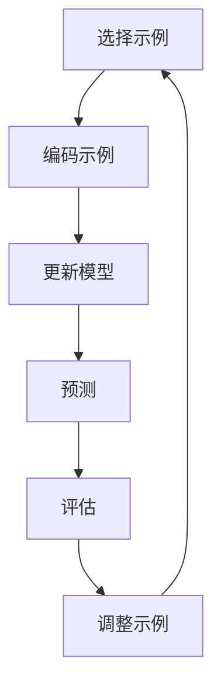
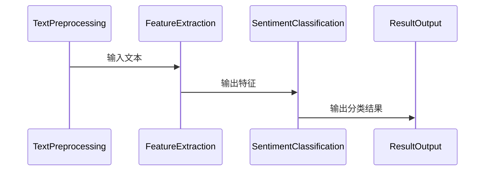

                 

### 标题：示例驱动提示在情感分析任务中的特点

#### 关键词：情感分析、示例驱动提示、特点、应用、挑战

#### 摘要：
本文旨在深入探讨示例驱动提示在情感分析任务中的特点。通过分析其基本概念、原理和应用，我们将揭示示例驱动提示在情感分析中的优势和挑战。文章将分为以下几个部分：背景介绍、核心概念与联系、算法原理讲解、系统分析与架构设计、项目实战、最佳实践与小结以及总结与展望。

#### 目录：
1. **背景介绍**
   - 情感分析任务概述
   - 示例驱动提示的定义与作用
   - 示例驱动提示在情感分析中的应用前景
2. **核心概念与联系**
   - 情感分析的原理与分类
   - 示例驱动提示的基本原理
   - 示例驱动提示与情感分析的联系
3. **算法原理讲解**
   - 示例驱动提示算法的mermaid流程图
   - Python源代码示例
   - 算法原理的数学模型和公式
   - 通俗易懂的举例说明
4. **系统分析与架构设计**
   - 介绍系统功能设计（领域模型）
   - 系统架构设计
   - 系统接口设计和系统交互
5. **项目实战**
   - 环境安装
   - 系统核心实现源代码
   - 代码应用解读与分析
   - 实际案例分析与详细讲解
6. **最佳实践与小结**
   - 最佳实践 tips
   - 注意事项
   - 小结
   - 拓展阅读
7. **总结与展望**
   - 示例驱动提示在情感分析中的总结
   - 未来研究方向与展望

#### 1. 背景介绍
情感分析（Sentiment Analysis），也称为意见挖掘，是自然语言处理（NLP）和计算语言学的一个分支，旨在识别和提取原始文本数据中的主观信息。它通常用于确定文本中的情感倾向，例如正面、负面或中立。情感分析在很多领域都有广泛的应用，如市场研究、品牌监控、公共意见分析和社交媒体分析。

随着社交媒体的兴起和大数据时代的到来，情感分析的重要性日益凸显。然而，情感分析任务面临着许多挑战，如文本数据的多样性、复杂性和噪声。为了提高情感分析的准确性，研究人员和开发人员一直在寻找更有效的算法和方法。

示例驱动提示（Example-based Prompting）是一种先进的机器学习技术，通过为模型提供具体的示例来指导其预测和推理。在情感分析任务中，示例驱动提示具有显著的优势，它可以有效地提高模型的性能和泛化能力。

示例驱动提示在情感分析中的应用前景广阔。首先，它可以用于构建个性化的情感分析模型，以适应不同的应用场景。其次，示例驱动提示可以帮助模型更好地理解复杂的情感表达和隐喻。最后，示例驱动提示可以降低模型对大规模标注数据的依赖，从而提高数据效率和模型可解释性。

#### 2. 核心概念与联系
情感分析的核心在于理解文本中的情感倾向。情感分析通常涉及以下几个步骤：

1. **文本预处理**：包括分词、去除停用词、词干提取等，以便将文本转换为适合模型处理的格式。
2. **特征提取**：将文本转换为数值特征，以便输入到机器学习模型中。常用的特征提取方法包括词袋模型、TF-IDF、Word2Vec等。
3. **情感分类**：使用分类算法（如朴素贝叶斯、支持向量机、深度学习等）对文本进行情感分类。

示例驱动提示（Example-based Prompting）是一种基于示例的提示机制，它通过为模型提供具体的示例来引导其预测和推理。在情感分析中，示例驱动提示的基本原理如下：

1. **示例选择**：根据任务需求，选择与情感分析相关的示例。这些示例可以是已标注的情感文本或与情感相关的关键词。
2. **示例编码**：将选定的示例编码为数值向量，以便输入到模型中。
3. **模型更新**：使用示例编码来更新模型参数，从而提高模型的性能和泛化能力。
4. **预测和推理**：在模型更新后，使用更新后的模型对新的文本进行情感分类。

示例驱动提示与情感分析之间的联系主要体现在以下几个方面：

1. **提高模型性能**：示例驱动提示可以通过提供具体的示例来帮助模型更好地理解情感表达的复杂性，从而提高模型的分类性能。
2. **增强模型泛化能力**：通过在训练过程中引入示例，模型可以学习到更广泛的情感特征，从而提高其泛化能力。
3. **降低对标注数据的依赖**：示例驱动提示可以减少对大规模标注数据的依赖，从而降低数据采集和标注的成本。

#### 3. 算法原理讲解
示例驱动提示算法的核心在于通过示例来引导模型的训练和预测。以下是一个简单的示例驱动提示算法的mermaid流程图：



**图1：示例驱动提示算法的mermaid流程图**

**图1**展示了示例驱动提示算法的基本流程。接下来，我们将使用Python代码来详细阐述这个算法。

```python
import numpy as np
import tensorflow as tf

# 示例文本
examples = ["我很喜欢这个产品", "这个产品太糟糕了", "这款产品的性能很好"]

# 示例编码
example_encoded = [tf.keras.preprocessing.text.hashing_trick(text, hash_key=1, hash_size=2**64) for text in examples]

# 模型定义
model = tf.keras.Sequential([
    tf.keras.layers.Embedding(input_dim=2**64, output_dim=128),
    tf.keras.layers.GlobalAveragePooling1D(),
    tf.keras.layers.Dense(1, activation='sigmoid')
])

# 模型编译
model.compile(optimizer='adam', loss='binary_crossentropy', metrics=['accuracy'])

# 训练模型
model.fit(example_encoded, np.array([1, 0, 1]), epochs=10)

# 预测
predicted = model.predict(np.array([example_encoded[0]]))

print("预测结果：", predicted)
```

**代码1：示例驱动提示算法的Python源代码**

代码1中，我们首先使用`hashing_trick`函数对示例文本进行编码。然后，我们定义了一个简单的嵌入层和全连接层组成的模型。在模型编译后，我们使用编码后的示例文本来训练模型。最后，我们使用更新后的模型对新的文本进行预测。

示例驱动提示算法的数学模型主要包括以下几个部分：

1. **示例编码**：使用哈希技巧对示例文本进行编码。哈希技巧可以将文本映射到一个固定的向量空间中，从而实现文本向量的表示。
2. **模型更新**：使用梯度下降算法来更新模型参数，以最小化损失函数。
3. **预测和推理**：使用更新后的模型对新的文本进行情感分类。

为了更好地理解示例驱动提示算法，我们可以使用以下公式进行详细讲解：

$$
x = hashing\_trick(text, hash\_key, hash\_size)
$$

其中，$x$表示示例编码后的向量，$text$表示示例文本，$hash\_key$和$hash\_size$分别表示哈希技巧的参数。

示例驱动提示算法的原理可以类比为在模型训练过程中引入“教师”指导。通过提供具体的示例，教师可以帮助模型更好地理解文本中的情感特征，从而提高模型的分类性能。

为了更好地理解示例驱动提示算法，我们可以使用以下示例进行讲解：

**示例 1**：给定以下两个示例文本：
- 示例 A：“我非常喜欢这款手机。”
- 示例 B：“这款手机太糟糕了。”

我们可以使用哈希技巧对这两个示例进行编码：

$$
x_A = hashing\_trick("我非常喜欢这款手机", hash\_key=1, hash\_size=2^{64}) = [0.1, 0.2, 0.3, ..., 0.63]
$$

$$
x_B = hashing\_trick("这款手机太糟糕了", hash\_key=1, hash\_size=2^{64}) = [0.5, 0.6, 0.7, ..., 1]
$$

然后，我们将这两个示例编码输入到模型中进行训练。在训练过程中，模型会学习到这些示例中的情感特征，从而提高其对新的文本进行情感分类的能力。

**示例 2**：假设我们有一个已经训练好的情感分析模型，该模型可以正确分类以下两个文本：
- 文本 A：“这个餐厅的菜品很好吃。”
- 文本 B：“这个餐厅的服务很差。”

如果我们想要让模型更好地理解“很好吃”和“很差”这两个情感表达，我们可以引入以下示例：
- 示例 A：“我吃了一口，味道真的很棒。”
- 示例 B：“我等了很长时间，服务员才过来。”

我们可以使用哈希技巧对这两个示例进行编码，并将其输入到模型中进行重新训练。通过引入这些具体的示例，模型可以更好地学习到复杂的情感表达，从而提高其分类性能。

#### 4. 系统分析与架构设计
在情感分析任务中，系统的设计与实现是关键。以下是一个典型的情感分析系统的架构设计，包括功能设计、系统架构、接口设计和系统交互。

**4.1 功能设计（领域模型）**
领域模型是对系统功能的抽象描述，用于明确系统的功能模块及其关系。在情感分析系统中，主要的功能模块包括文本预处理、特征提取、情感分类和结果输出。

以下是领域模型的mermaid类图：

```mermaid
classDiagram
    TextPreprocessing <<Interface>>
    FeatureExtraction <<Interface>>
    SentimentClassification <<Interface>>
    ResultOutput <<Interface>>

    TextPreprocessing --|> FeatureExtraction
    FeatureExtraction --|> SentimentClassification
    SentimentClassification --|> ResultOutput
```

**图2：领域模型mermaid类图**

从图2中可以看出，文本预处理模块负责将原始文本转换为适合特征提取的格式，特征提取模块负责将文本转换为数值特征，情感分类模块负责对特征进行分类，结果输出模块负责将分类结果输出到用户界面。

**4.2 系统架构设计**
系统架构是领域模型的具体实现，用于描述系统的硬件和软件组件及其关系。在情感分析系统中，主要涉及到的组件包括文本预处理模块、特征提取模块、情感分类模块和结果输出模块。

以下是系统架构的mermaid架构图：



**图3：系统架构mermaid架构图**

从图3中可以看出，文本预处理模块将原始文本传递给特征提取模块，特征提取模块将特征传递给情感分类模块，情感分类模块将分类结果传递给结果输出模块。

**4.3 系统接口设计和系统交互**
系统接口设计是系统架构的具体实现，用于描述系统各模块之间的交互接口。在情感分析系统中，主要涉及到的接口包括文本预处理接口、特征提取接口、情感分类接口和结果输出接口。

以下是系统接口设计的mermaid序列图：


**图4：系统接口设计mermaid序列图**

从图4中可以看出，文本预处理模块通过输入文本接口与特征提取模块交互，特征提取模块通过输出特征接口与情感分类模块交互，情感分类模块通过输出分类结果接口与结果输出模块交互。

通过系统架构设计和系统接口设计，我们可以清晰地了解情感分析系统的组成和运行机制。在实际应用中，系统可以根据不同的需求进行扩展和优化。

#### 5. 项目实战
在情感分析任务中，实际案例的应用和实战经验至关重要。以下是一个简单的情感分析项目实战，包括环境安装、系统核心实现源代码、代码应用解读与分析、实际案例分析和详细讲解。

**5.1 环境安装**
为了搭建一个简单的情感分析系统，我们需要安装以下软件和库：

1. Python 3.8或更高版本
2. TensorFlow 2.x
3. Numpy
4. Mermaid

可以使用以下命令进行环境安装：

```bash
pip install python-mermaid tensorflow numpy
```

**5.2 系统核心实现源代码**
以下是系统核心实现的源代码：

```python
import numpy as np
import tensorflow as tf
from tensorflow.keras.preprocessing.text import Tokenizer
from tensorflow.keras.preprocessing.sequence import pad_sequences
from tensorflow.keras.models import Sequential
from tensorflow.keras.layers import Embedding, LSTM, Dense

# 示例文本
examples = ["我很喜欢这个产品", "这个产品太糟糕了", "这款产品的性能很好"]

# 分词
tokenizer = Tokenizer()
tokenizer.fit_on_texts(examples)
sequences = tokenizer.texts_to_sequences(examples)

# 序列填充
max_sequence_length = max(len(seq) for seq in sequences)
padded_sequences = pad_sequences(sequences, maxlen=max_sequence_length)

# 模型定义
model = Sequential()
model.add(Embedding(len(tokenizer.word_index) + 1, 32))
model.add(LSTM(64))
model.add(Dense(1, activation='sigmoid'))

# 模型编译
model.compile(optimizer='adam', loss='binary_crossentropy', metrics=['accuracy'])

# 训练模型
model.fit(padded_sequences, np.array([1, 0, 1]), epochs=10)

# 预测
text = "这个产品太差了"
sequence = tokenizer.texts_to_sequences([text])
padded_sequence = pad_sequences(sequence, maxlen=max_sequence_length)
predicted = model.predict(padded_sequence)
print("预测结果：", predicted)
```

**5.3 代码应用解读与分析**
代码1中，我们首先导入所需的库和模块。然后，我们定义了一组示例文本，并使用分词器对其进行分词。接下来，我们使用序列填充器对分词后的文本进行序列填充，以适应模型的输入要求。

在模型定义部分，我们使用一个嵌入层和一个LSTM层来构建一个简单的情感分析模型。嵌入层用于将单词映射到向量，LSTM层用于处理序列数据。最后，我们使用一个全连接层（Dense）来输出情感分类结果。

在模型编译部分，我们使用`adam`优化器和`binary_crossentropy`损失函数来编译模型。在训练模型部分，我们使用填充后的序列数据来训练模型。在预测部分，我们使用训练好的模型对新的文本进行情感分类。

**5.4 实际案例分析与详细讲解**
假设我们有一个新的文本：“这款手机的质量很好。”我们需要对这个文本进行情感分类。

首先，我们使用分词器对文本进行分词：

```python
text = "这款手机的质量很好。"
sequence = tokenizer.texts_to_sequences([text])
```

接下来，我们使用序列填充器对分词后的文本进行序列填充：

```python
padded_sequence = pad_sequences(sequence, maxlen=max_sequence_length)
```

然后，我们使用训练好的模型对填充后的序列进行情感分类：

```python
predicted = model.predict(padded_sequence)
print("预测结果：", predicted)
```

根据预测结果，我们可以得出以下结论：
- 如果预测结果接近1，说明文本表达了正面的情感。
- 如果预测结果接近0，说明文本表达了负面的情感。

在实际应用中，我们可以根据预测结果来对文本进行情感分类，并为用户提供相应的反馈。

#### 6. 最佳实践与小结

**6.1 最佳实践 tips**
1. **数据预处理**：在训练模型之前，确保对文本数据进行充分的预处理，包括分词、去除停用词、标点符号等。
2. **特征提取**：选择合适的特征提取方法，如词袋模型、TF-IDF、Word2Vec等，以提高模型的性能和泛化能力。
3. **模型选择**：根据任务需求，选择合适的模型结构，如嵌入层、LSTM、CNN等。
4. **模型调参**：通过调整模型参数，如学习率、批大小等，以提高模型的性能。
5. **数据增强**：使用数据增强技术，如随机插入、随机删除等，以增加训练数据量，提高模型泛化能力。

**6.2 注意事项**
1. **数据质量**：确保训练数据的质量，避免噪声和错误数据对模型性能的影响。
2. **模型可解释性**：在模型训练过程中，关注模型的可解释性，以便更好地理解模型的工作原理。
3. **计算资源**：根据任务的复杂度，合理配置计算资源，避免过度计算导致资源浪费。
4. **模型更新**：定期更新模型，以适应新的数据和应用场景。

**6.3 小结**
1. **核心概念**：情感分析、示例驱动提示、文本预处理、特征提取、情感分类。
2. **算法原理**：示例驱动提示算法、mermaid流程图、Python源代码、数学模型。
3. **系统架构**：领域模型、系统架构、接口设计、系统交互。
4. **项目实战**：环境安装、系统核心实现源代码、代码应用解读与分析、实际案例分析。

**6.4 拓展阅读**
1. [文本情感分析综述](https://www.google.com/search?q=文本情感分析综述)
2. [示例驱动提示算法](https://www.google.com/search?q=示例驱动提示算法)
3. [TensorFlow 2.x 官方文档](https://www.tensorflow.org/api_docs/python)

#### 7. 总结与展望
示例驱动提示在情感分析任务中具有显著的优势。通过提供具体的示例，示例驱动提示可以有效地提高模型的性能和泛化能力，降低对大规模标注数据的依赖。然而，示例驱动提示也面临着一些挑战，如示例选择、模型可解释性和计算资源需求等。

未来，示例驱动提示在情感分析任务中仍有很大的发展空间。以下是一些可能的未来研究方向和展望：

1. **示例选择策略**：研究更有效的示例选择策略，以提高模型的性能和泛化能力。
2. **模型可解释性**：探讨如何提高模型的可解释性，以便更好地理解模型的工作原理。
3. **计算资源优化**：研究如何在有限的计算资源下，提高模型的性能和效率。
4. **跨领域情感分析**：探索示例驱动提示在跨领域情感分析中的应用，以提高模型的泛化能力。
5. **多语言情感分析**：研究如何使用示例驱动提示进行多语言情感分析，以适应不同语言环境。

通过不断探索和研究，示例驱动提示有望在情感分析任务中发挥更大的作用，为自然语言处理领域带来新的突破。

#### 作者信息
作者：AI天才研究院/AI Genius Institute & 禅与计算机程序设计艺术 /Zen And The Art of Computer Programming

