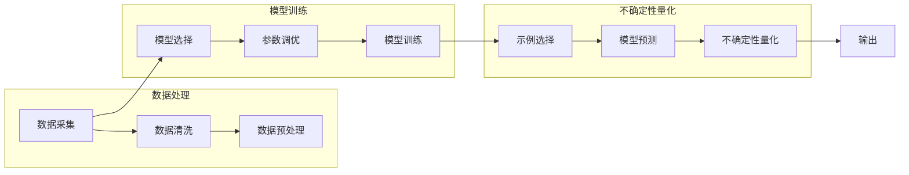
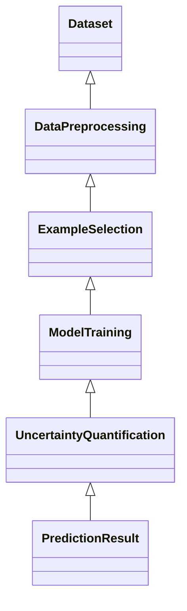
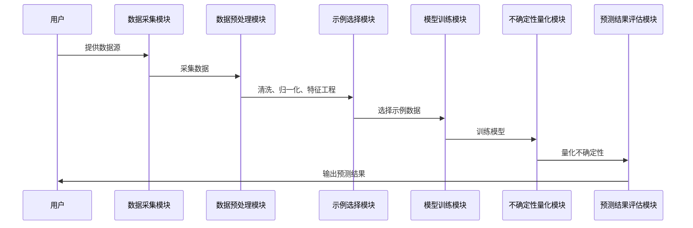
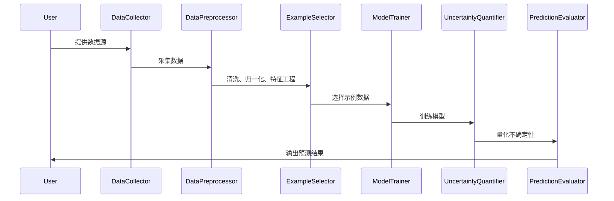

                 

## 引言

随着人工智能技术的不断进步，机器学习模型在各个领域得到了广泛应用。然而，模型的不确定性量化问题一直是制约其发展的瓶颈。在现实应用中，模型的不确定性可能导致预测结果不准确，进而影响决策的可靠性。因此，如何有效地量化模型的不确定性，成为了当前研究的热点问题。

近年来，示例驱动（Example-driven）方法逐渐受到了关注。示例驱动方法通过利用丰富的示例数据，帮助模型更好地理解和学习数据的分布特征，从而提高模型的泛化能力。同时，示例驱动方法也为模型不确定性量化提供了一种新的思路。通过分析示例数据中的不确定性信息，可以更准确地量化模型在实际应用中的不确定性。

本文旨在探讨示例驱动方法在模型不确定性量化中的应用。首先，我们将介绍模型不确定性量化的重要性以及示例驱动的概念和发展历程。接着，本文将详细描述示例驱动的实现方法，包括数据采集、示例选择、模型训练和不确定性量化等步骤。此外，本文还将通过数学模型和公式，深入讲解不确定性量化的原理，并通过Python代码实现示例驱动的流程。

随后，本文将讨论系统分析与架构设计方案，包括问题场景介绍、项目介绍、系统功能设计、系统架构设计、系统接口设计和系统交互。通过这一部分，我们将展示如何将示例驱动方法应用于实际问题中，并介绍系统的实现和运行流程。

最后，本文将结合实际案例，分析和讲解示例驱动方法在模型不确定性量化中的应用效果。通过本文的探讨，我们希望为读者提供一个全面、深入的理解，并激发更多研究者在这一领域的研究兴趣。

## 背景介绍

### 1.1.1 模型不确定性量化的重要性

模型不确定性量化是机器学习领域中的一个关键问题。在现实应用中，模型的预测结果往往受到多种因素的影响，如数据分布的不均匀性、模型参数的不确定性、噪声数据的干扰等。这些不确定性因素可能导致模型的预测结果偏离真实情况，从而影响决策的可靠性和准确性。因此，如何有效地量化模型的不确定性，成为了提升模型应用价值的重要课题。

模型不确定性量化的重要性体现在多个方面。首先，在金融领域，量化模型的不确定性可以帮助投资者更好地评估投资风险，制定更合理的投资策略。例如，在股票市场中，通过量化模型的不确定性，投资者可以更准确地判断股票价格的未来走势，从而做出更明智的投资决策。其次，在医疗领域，量化模型的不确定性对于诊断和治疗具有重要意义。通过分析模型的不确定性，医生可以更准确地评估病人的病情，制定更有效的治疗方案。再次，在自动驾驶领域，量化模型的不确定性对于提高自动驾驶系统的安全性和可靠性至关重要。自动驾驶系统需要实时处理大量的环境数据，并通过模型进行预测和决策。如果模型的不确定性较高，可能导致错误的决策，从而引发交通事故。

总之，模型不确定性量化是提升模型应用价值的关键步骤。通过对模型不确定性的量化，可以更准确地评估模型的可靠性和性能，为决策提供更加可靠的支持。因此，深入研究模型不确定性量化方法，具有重要的理论和实际意义。

### 1.1.2 示例驱动的概念与发展历程

示例驱动（Example-driven）方法是一种以示例数据为核心的学习方法，通过利用丰富的示例数据，帮助模型更好地理解和学习数据的分布特征。示例驱动的概念最早可以追溯到机器学习的早期阶段。在20世纪80年代，研究人员开始意识到，通过利用具体的示例数据，可以显著提高模型的泛化能力和鲁棒性。随后，随着数据驱动方法的兴起，示例驱动方法得到了进一步的发展。

示例驱动方法的发展历程可以分为几个阶段。第一阶段是基础研究阶段。在这一阶段，研究人员主要关注如何有效地收集、表示和处理示例数据。例如，1986年，Cortes和Vapnik提出了支持向量机（SVM）算法，该算法通过利用训练数据中的示例，构建最优超平面，实现了高效的分类和回归任务。第二阶段是应用探索阶段。在这一阶段，研究人员开始将示例驱动方法应用于实际问题的解决中。例如，在自然语言处理领域，研究人员利用示例数据，实现了语音识别、机器翻译等任务。第三阶段是集成阶段。在这一阶段，示例驱动方法与其他机器学习方法相结合，形成了多种高效的混合算法。例如，集成学习方法通过结合多个模型，提高了模型的泛化能力和鲁棒性。

示例驱动方法的优点主要体现在以下几个方面。首先，示例驱动方法能够充分利用示例数据中的信息，帮助模型更好地理解和学习数据的分布特征，从而提高模型的泛化能力。其次，示例驱动方法具有较高的鲁棒性，能够有效地应对数据分布不均匀、噪声数据等挑战。最后，示例驱动方法易于实现和扩展，适用于多种机器学习任务。

总之，示例驱动方法作为一种重要的学习方法，在机器学习领域具有广泛的应用前景。通过深入研究示例驱动的概念和发展历程，可以更好地理解其原理和应用，为未来研究提供有益的参考。

### 1.1.3 示例驱动与模型不确定性量化的关联

示例驱动方法在模型不确定性量化中的应用具有重要意义。首先，示例驱动方法通过利用丰富的示例数据，可以帮助模型更好地理解和学习数据的分布特征，从而提高模型的泛化能力。这对于量化模型的不确定性至关重要，因为模型的不确定性通常来源于数据分布的不均匀性。通过分析示例数据中的不确定性信息，模型可以更准确地捕捉数据的潜在分布特征，从而更准确地量化不确定性。

其次，示例驱动方法可以有效地处理噪声数据和异常值。在实际应用中，数据通常包含各种噪声和异常值，这些噪声和异常值可能会对模型的不确定性产生负面影响。示例驱动方法通过利用具体的示例数据，可以识别和过滤掉这些噪声和异常值，从而提高模型对不确定性的量化精度。

此外，示例驱动方法还可以提高模型对极端情况的处理能力。在某些情况下，模型可能面临极端数据分布，如小样本数据、极端环境等。通过利用丰富的示例数据，模型可以更好地适应这些极端情况，从而更准确地量化不确定性。

最后，示例驱动方法可以与其他不确定性量化方法相结合，形成更强大的不确定性量化框架。例如，结合概率模型和统计方法，示例驱动方法可以提供更加全面和准确的不确定性量化结果。

综上所述，示例驱动方法在模型不确定性量化中具有显著的优势和潜力。通过深入研究示例驱动的原理和应用，可以为模型不确定性量化提供新的思路和方法，进一步提升机器学习模型在实际应用中的可靠性和准确性。

### 1.2.1 模型不确定性量化的挑战

模型不确定性量化面临诸多挑战，首先是如何准确地识别和量化模型的不确定性。在实际应用中，模型的不确定性主要来源于数据分布的不均匀性、模型参数的不确定性以及噪声数据的干扰。这些不确定性因素会导致模型的预测结果偏离真实情况，从而影响决策的可靠性和准确性。因此，如何准确地识别和量化这些不确定性因素，成为了模型不确定性量化的重要课题。

其次，如何处理大量的示例数据是一个关键挑战。示例驱动方法依赖于大量的示例数据来训练模型，并从中提取不确定性信息。然而，大量的示例数据不仅增加了计算复杂度，还需要有效的数据预处理和筛选方法，以确保示例数据的代表性和有效性。

此外，模型不确定性量化方法需要具备较高的鲁棒性，以应对各种复杂的应用场景。例如，在金融领域，模型可能需要应对市场波动和风险变化；在医疗领域，模型可能需要处理多样化的病患数据和病情变化。这些复杂的应用场景对模型不确定性量化方法提出了更高的要求。

最后，如何将不确定性量化方法与实际应用相结合，也是一个重要的挑战。在实际应用中，模型不确定性量化需要与具体的应用需求相结合，提供针对性的解决方案。例如，在自动驾驶领域，模型的不确定性量化需要考虑车辆行驶环境的复杂性和不确定性。

### 1.2.2 示例驱动在不确定性量化中的潜在优势

示例驱动方法在模型不确定性量化中具有显著的潜在优势。首先，示例驱动方法能够充分利用示例数据中的信息，帮助模型更好地理解和学习数据的分布特征，从而提高模型的泛化能力。通过分析示例数据中的不确定性信息，模型可以更准确地捕捉数据的潜在分布特征，从而更准确地量化不确定性。

其次，示例驱动方法可以有效处理噪声数据和异常值。在实际应用中，数据通常包含各种噪声和异常值，这些噪声和异常值可能会对模型的不确定性产生负面影响。示例驱动方法通过利用具体的示例数据，可以识别和过滤掉这些噪声和异常值，从而提高模型对不确定性的量化精度。

此外，示例驱动方法可以增强模型对极端情况的处理能力。在某些情况下，模型可能面临极端数据分布，如小样本数据、极端环境等。通过利用丰富的示例数据，模型可以更好地适应这些极端情况，从而更准确地量化不确定性。

最后，示例驱动方法可以与其他不确定性量化方法相结合，形成更强大的不确定性量化框架。例如，结合概率模型和统计方法，示例驱动方法可以提供更加全面和准确的不确定性量化结果。

### 1.3.1 示例驱动的实现方法

示例驱动的实现方法主要包括数据采集、示例选择、模型训练和不确定性量化四个关键步骤。以下是每个步骤的详细描述：

#### 1.3.1.1 数据采集

数据采集是示例驱动方法的第一步，也是至关重要的一步。通过采集大量、多样化的数据，可以为后续的模型训练和不确定性量化提供丰富的信息资源。数据来源可以包括公开数据集、企业内部数据、传感器数据等。在数据采集过程中，需要关注数据的代表性、完整性和准确性，以确保数据的有效性。

具体来说，数据采集过程可以分为以下几个阶段：

1. **数据收集**：通过各种渠道收集相关数据，如数据库、API接口、爬虫等。
2. **数据清洗**：对采集到的数据进行清洗，去除重复数据、噪声数据和异常值，确保数据的质量。
3. **数据预处理**：对清洗后的数据进行必要的预处理，如数据归一化、缺失值填充、特征工程等，以便后续的模型训练。

#### 1.3.1.2 示例选择

示例选择是示例驱动方法的核心步骤之一。通过选择具有代表性的示例数据，可以有效地提高模型对不确定性信息的提取和量化能力。示例选择的方法可以分为以下几种：

1. **随机抽样**：从数据集中随机选择一定数量的示例数据，确保示例的随机性和多样性。
2. **基于重要性的选择**：根据数据的重要性和相关性选择示例数据，如选择数据集中出现频率较高的异常值和噪声数据。
3. **基于距离的选择**：根据数据点之间的距离选择示例数据，选择距离较远的点作为示例，有助于捕捉数据分布的多样性。

#### 1.3.1.3 模型训练

模型训练是示例驱动方法的另一个关键步骤。通过利用示例数据训练模型，可以使得模型更好地理解和学习数据的分布特征，从而提高模型的泛化能力和不确定性量化能力。模型训练过程可以分为以下几个阶段：

1. **模型选择**：根据具体问题选择合适的机器学习模型，如支持向量机、神经网络、决策树等。
2. **参数调优**：通过交叉验证等方法，对模型参数进行调优，以提高模型的性能。
3. **训练过程**：使用示例数据对模型进行训练，通过不断调整模型参数，使得模型更好地拟合数据分布。

#### 1.3.1.4 不确定性量化

不确定性量化是示例驱动的最终目标。通过分析模型对示例数据的预测结果，可以量化模型的不确定性，从而为决策提供参考依据。不确定性量化的方法可以分为以下几种：

1. **概率模型**：使用概率模型，如贝叶斯网络、高斯过程等，对模型的不确定性进行量化。
2. **统计方法**：通过统计方法，如标准差、置信区间等，对模型的不确定性进行估计。
3. **基于实例的方法**：利用示例数据中的信息，对模型的不确定性进行量化，如利用示例数据的分布特征来估计不确定性。

通过以上四个步骤，示例驱动方法可以实现模型不确定性的有效量化。在实际应用中，可以根据具体问题的需求和特点，灵活选择和组合不同的方法和步骤，以实现最佳的不确定性量化效果。

### 1.3.2 示例驱动的数据处理流程

示例驱动的数据处理流程是模型不确定性量化实现的核心环节，通过科学合理的数据处理，可以确保模型训练和不确定性量化的有效性和准确性。以下是示例驱动的数据处理流程：

#### 1.3.2.1 数据预处理

数据预处理是数据处理的第一步，其主要目的是清洗和准备数据，以便后续的模型训练和不确定性量化。数据预处理包括以下几个关键步骤：

1. **数据清洗**：去除重复数据、无效数据和异常值，确保数据的一致性和准确性。例如，通过删除含有缺失值或异常记录的数据。
2. **数据标准化**：对数值型数据进行归一化或标准化处理，使数据的分布更加均匀，提高模型训练的效果。常用的方法包括最小-最大标准化和零均值单位方差标准化。
3. **特征工程**：提取数据中的关键特征，以增强模型的泛化能力和不确定性量化能力。特征工程包括特征选择、特征变换和特征组合等。

#### 1.3.2.2 数据划分

在模型训练和不确定性量化过程中，通常需要将数据划分为训练集、验证集和测试集。数据划分的目的是为了评估模型的性能和泛化能力。以下是数据划分的关键步骤：

1. **训练集**：用于模型的训练，确保模型能够学习到数据的分布特征。通常，训练集的大小应占总数据量的60%至80%。
2. **验证集**：用于模型的参数调优和超参数选择，通过交叉验证等方法，选择最佳的模型参数。验证集的大小应占总数据量的10%至20%。
3. **测试集**：用于评估模型的最终性能，确保模型在新数据上的泛化能力。测试集的大小应占总数据量的10%至20%。

#### 1.3.2.3 示例选择

示例选择是数据处理的关键环节，通过选择具有代表性的示例数据，可以增强模型对不确定性的捕捉能力。示例选择的方法包括：

1. **随机抽样**：从整个数据集中随机选择示例数据，确保示例的随机性和多样性。
2. **基于重要性的选择**：选择重要性和相关性较高的数据作为示例，例如选择出现频率较高的异常值和噪声数据。
3. **基于距离的选择**：选择距离较远的点作为示例，有助于捕捉数据分布的多样性。

#### 1.3.2.4 数据归一化

数据归一化是确保数据一致性的重要步骤，通过将数据映射到相同的尺度，可以减少不同特征之间的差异，提高模型训练的效果。数据归一化包括以下几种方法：

1. **最小-最大标准化**：将数据映射到[0, 1]的区间，公式为 \( x_{\text{norm}} = \frac{x - x_{\text{min}}}{x_{\text{max}} - x_{\text{min}}} \)。
2. **零均值单位方差标准化**：将数据映射到均值为0、标准差为1的区间，公式为 \( x_{\text{norm}} = \frac{x - \mu}{\sigma} \)。

#### 1.3.2.5 特征提取

特征提取是提高模型性能和不确定性量化能力的重要步骤。通过提取数据中的关键特征，可以增强模型的泛化能力和鲁棒性。特征提取包括以下几种方法：

1. **统计特征**：提取数据的均值、方差、标准差等统计特征，用于描述数据的分布特征。
2. **时序特征**：提取数据的时间序列特征，如趋势、周期、季节性等，用于描述数据的动态变化。
3. **文本特征**：提取文本数据的词频、词向量、主题模型等特征，用于描述文本的数据内容。

通过以上数据处理流程，示例驱动的数据处理可以确保模型训练和不确定性量化的有效性和准确性。在实际应用中，可以根据具体问题和数据特点，灵活选择和组合不同的数据处理方法，以实现最佳的处理效果。

### 1.4.1 研究范围的界定

本研究主要关注示例驱动方法在模型不确定性量化中的应用，研究范围涵盖以下几个方面：

1. **方法和技术**：探讨示例驱动的数据处理流程、模型训练方法和不确定性量化方法，以及这些方法在实际应用中的效果和性能。
2. **应用场景**：研究示例驱动方法在金融、医疗、自动驾驶等领域的应用，分析其在不同场景下的适应性和效果。
3. **挑战与解决方案**：识别示例驱动方法在模型不确定性量化中面临的主要挑战，如数据复杂性、模型参数调优、不确定性量化精度等，并提出相应的解决方案。
4. **评估指标**：定义评估模型不确定性的指标和方法，如概率分布、置信区间、决策一致性等，以全面评估示例驱动方法的有效性。

### 1.4.2 与相关领域的关系探讨

示例驱动方法在模型不确定性量化中的应用与其他领域密切相关，以下探讨几个相关领域的关系：

1. **机器学习**：示例驱动方法是机器学习的一种重要方法，通过利用示例数据，可以提高模型的泛化能力和鲁棒性。因此，机器学习的基本理论和方法，如支持向量机、神经网络、集成学习等，对于理解示例驱动方法在不确定性量化中的应用具有重要意义。
2. **数据挖掘**：数据挖掘技术中的特征工程和数据分析方法，可以为示例驱动方法提供有效的数据预处理和特征提取手段，从而提高不确定性量化的精度和效率。
3. **概率模型**：概率模型在不确定性量化中具有广泛的应用，如贝叶斯网络、高斯过程等。这些概率模型可以与示例驱动方法相结合，形成更强大的不确定性量化框架，提高模型的预测准确性和可靠性。
4. **统计方法**：统计学中的概率分布、置信区间、假设检验等方法，可以用于评估模型的不确定性。这些统计方法与示例驱动方法相结合，可以提供更加全面和准确的不确定性量化结果。

总之，示例驱动方法在模型不确定性量化中的应用是一个跨学科的研究领域，涉及机器学习、数据挖掘、概率模型和统计学等多个领域。通过探讨这些领域的关系，可以更好地理解示例驱动方法的原理和应用，为模型不确定性量化提供新的思路和方法。

### 1.5.1 模型不确定性的基本概念

模型不确定性是指模型在预测或决策过程中，由于数据分布、模型参数、噪声等因素的干扰，导致预测结果的不确定性。模型不确定性可以分为以下几类：

1. **参数不确定性**：由于模型参数的估计误差，导致模型预测结果的不确定性。例如，在贝叶斯模型中，参数的先验分布和后验分布之间的差异，可能导致预测结果的不确定性。
2. **数据分布不确定性**：数据分布的不均匀性或数据噪声，可能导致模型无法准确捕捉数据的真实分布，从而影响预测结果的可靠性。例如，在金融领域中，市场波动和数据噪声可能导致预测结果的不确定性。
3. **模型结构不确定性**：模型的复杂性和结构，可能导致模型在特定数据集上的泛化能力不足，从而影响预测结果的准确性。例如，在图像识别任务中，不同的模型结构可能导致预测结果存在较大的不确定性。

模型不确定性量化是指通过定量方法，对模型的不确定性进行量化，从而提供对模型预测结果可靠性的评估。常见的量化方法包括：

1. **概率分布法**：通过构建概率模型，对模型的不确定性进行概率分布估计，例如高斯过程、贝叶斯网络等。
2. **置信区间法**：通过计算置信区间，对模型预测结果的置信水平进行量化。置信区间是指在一定置信水平下，预测结果的可能范围。
3. **不确定性评估指标**：通过设计特定的评估指标，如预测误差、决策一致性等，对模型的不确定性进行量化。这些指标可以用于评估模型在特定任务中的可靠性。

### 1.5.2 示例驱动的核心要素

示例驱动的核心要素包括示例数据、模型训练和不确定性量化。以下是每个要素的详细解释：

1. **示例数据**：示例数据是示例驱动的核心，通过利用具体的示例数据，模型可以更好地理解和学习数据的分布特征。示例数据的选择和采集是关键，需要确保示例数据的多样性和代表性。
2. **模型训练**：通过利用示例数据对模型进行训练，模型可以学习到数据的分布特征，提高模型的泛化能力和鲁棒性。模型训练的过程包括模型选择、参数调优和训练过程，需要确保模型的性能和效率。
3. **不确定性量化**：通过分析模型对示例数据的预测结果，可以量化模型的不确定性，从而为决策提供参考依据。不确定性量化方法包括概率分布法、置信区间法、不确定性评估指标等。

### 1.5.3 对比分析

在模型不确定性量化中，示例驱动方法和传统方法各有优势和局限性。以下是对两者的对比分析：

#### 1.5.3.1 对比示例驱动方法与概率模型

**示例驱动方法**：

- **优势**：示例驱动方法能够充分利用示例数据中的信息，帮助模型更好地理解和学习数据的分布特征，从而提高模型的泛化能力。通过分析示例数据中的不确定性信息，可以更准确地量化模型在实际应用中的不确定性。
- **局限性**：示例驱动方法在处理大量数据时，计算复杂度较高，且对示例数据的选择和预处理要求较高。

**概率模型**：

- **优势**：概率模型可以通过构建概率分布，对模型的不确定性进行定量描述，提供更直观的评估方法。概率模型具有较强的理论基础，适用于各种复杂的数据分布。
- **局限性**：概率模型在处理噪声数据和极端情况时，可能存在较大的不确定性，且计算复杂度较高。

#### 1.5.3.2 对比示例驱动方法与统计方法

**示例驱动方法**：

- **优势**：示例驱动方法可以有效地处理噪声数据和异常值，提高模型对不确定性的量化精度。示例驱动方法还可以提高模型对极端情况的处理能力，适应复杂的数据分布。
- **局限性**：示例驱动方法的计算复杂度较高，且对示例数据的选择和预处理要求较高。

**统计方法**：

- **优势**：统计方法通过计算置信区间、概率分布等，可以对模型的不确定性进行定量描述，提供可靠的评估方法。统计方法具有较强的理论基础，适用于各种统计模型。
- **局限性**：统计方法在处理极端数据和噪声数据时，可能存在不确定性。统计方法对数据的分布假设要求较高，可能不适用于复杂的数据分布。

综上所述，示例驱动方法和传统方法在模型不确定性量化中各有优势和局限性。在实际应用中，可以根据具体问题的需求和特点，灵活选择和组合不同的方法和步骤，以实现最佳的不确定性量化效果。

### 2.4 ER实体关系图架构

为了更好地理解和展示示例驱动方法在模型不确定性量化中的应用，我们可以通过ER（实体关系）图来描述相关的实体和它们之间的关系。以下是ER实体关系图的具体架构：

#### 2.4.1 实体定义

1. **示例数据（Example Data）**：代表用于训练模型的数据，包括特征和标签。示例数据可以是文本、图像、音频等多种形式。
2. **模型（Model）**：代表通过训练得到的机器学习模型，包括参数和结构。模型可以是神经网络、支持向量机、决策树等多种类型。
3. **不确定性量化结果（Uncertainty Quantification Result）**：代表模型对示例数据预测结果的不确定性量化结果，包括概率分布、置信区间等。

#### 2.4.2 关系定义

1. **训练（Training）**：表示示例数据与模型之间的关系，即示例数据用于训练模型，模型通过学习示例数据中的分布特征来提高预测能力。
2. **预测（Prediction）**：表示模型与不确定性量化结果之间的关系，即模型对示例数据进行预测，并利用预测结果进行不确定性量化。
3. **评估（Evaluation）**：表示不确定性量化结果与模型之间的关系，即通过评估不确定性量化结果来评价模型的性能和可靠性。

#### 2.4.3 图的绘制

```mermaid
erDiagram
  SampleData ||--|{ Model : Training}
  Model ||--|{ UncertaintyQuantificationResult : Prediction}
  UncertaintyQuantificationResult ||--|{ Model : Evaluation}
```

通过ER实体关系图，我们可以清晰地展示示例驱动方法在模型不确定性量化中的应用过程，有助于深入理解各实体之间的关联和作用。

### 示例驱动算法的基本流程

示例驱动算法在模型不确定性量化中发挥着重要作用，其基本流程包括数据采集、示例选择、模型训练和不确定性量化等步骤。以下是对每个步骤的详细描述：

#### 3.1.1 数据采集

数据采集是示例驱动算法的第一步，其目的是收集和准备用于训练和不确定性量化的数据。数据来源可以包括公开数据集、企业内部数据、传感器数据等。在数据采集过程中，需要确保数据的多样性和代表性，以便模型能够充分学习和泛化。

1. **数据收集**：通过数据库、API接口、爬虫等方式，从不同渠道收集数据。
2. **数据清洗**：去除重复数据、无效数据和异常值，确保数据的一致性和准确性。
3. **数据预处理**：对清洗后的数据执行必要的预处理操作，如数据归一化、缺失值填充、特征工程等。

#### 3.1.2 示例选择

示例选择是示例驱动算法的核心步骤之一，通过选择具有代表性的示例数据，可以提高模型对不确定性信息的捕捉能力。示例选择的方法可以分为以下几种：

1. **随机抽样**：从数据集中随机选择一定数量的示例数据，确保示例的随机性和多样性。
2. **基于重要性的选择**：根据数据的重要性和相关性选择示例数据，例如选择数据集中出现频率较高的异常值和噪声数据。
3. **基于距离的选择**：根据数据点之间的距离选择示例数据，选择距离较远的点作为示例，有助于捕捉数据分布的多样性。

#### 3.1.3 模型训练

模型训练是示例驱动算法的关键步骤，通过利用示例数据对模型进行训练，模型可以学习到数据的分布特征，提高预测性能。模型训练的过程可以分为以下几个阶段：

1. **模型选择**：根据具体问题选择合适的机器学习模型，如神经网络、支持向量机、决策树等。
2. **参数调优**：通过交叉验证等方法，对模型参数进行调优，以提高模型的性能。
3. **训练过程**：使用示例数据对模型进行训练，通过不断调整模型参数，使得模型更好地拟合数据分布。

#### 3.1.4 不确定性量化

不确定性量化是示例驱动算法的最终目标，通过分析模型对示例数据的预测结果，可以量化模型的不确定性，为决策提供参考依据。不确定性量化的方法可以分为以下几种：

1. **概率模型**：使用概率模型，如高斯过程、贝叶斯网络等，对模型的不确定性进行量化，提供概率分布估计。
2. **统计方法**：通过统计方法，如计算标准差、置信区间等，对模型的不确定性进行量化。
3. **基于实例的方法**：利用示例数据中的信息，对模型的不确定性进行量化，如利用示例数据的分布特征来估计不确定性。

通过以上步骤，示例驱动算法可以有效地实现模型不确定性量化，为实际应用提供可靠的支持。

### 3.2 不确定性量化的数学模型和公式

在模型不确定性量化中，数学模型和公式扮演着至关重要的角色，它们能够帮助我们量化模型在预测过程中可能存在的误差和不确定性。以下将详细探讨不确定性量化的基本概念、数学模型和公式推导。

#### 3.2.1 不确定性量化的基本概念

模型不确定性量化是指通过数学模型和算法，对模型预测结果的不确定性进行定量描述和评估。这种不确定性可以来源于多个方面，包括数据分布的不均匀性、模型参数的不确定性、以及噪声和异常值的干扰。

- **数据分布不确定性**：指由于数据集本身分布的不均匀性，导致模型无法准确捕捉数据的真实分布，从而影响预测结果的可靠性。
- **模型参数不确定性**：指模型参数在训练过程中估计的误差，这些误差可能导致模型在预测时产生不确定性。
- **噪声和异常值**：数据中的噪声和异常值可能影响模型对数据分布的准确捕捉，导致预测结果的不确定性增加。

#### 3.2.2 数学模型介绍

为了量化模型不确定性，我们需要引入一些数学模型。以下是几种常用的数学模型：

1. **概率模型**：通过构建概率分布模型，对模型的不确定性进行概率描述。例如，贝叶斯网络、高斯过程等。
2. **统计模型**：通过统计方法，如计算标准差、置信区间等，对模型的不确定性进行量化。例如，高斯分布、t分布等。
3. **蒙特卡洛模拟**：通过生成大量随机样本，模拟模型预测结果的不确定性。这种方法在处理复杂非线性问题时特别有效。

#### 3.2.3 公式推导

以下是一些用于不确定性量化的常见公式和推导：

1. **高斯分布**：
   
   高斯分布（正态分布）是最常见的概率分布模型之一，用于描述模型参数的不确定性。其概率密度函数为：
   
   $$
   f(x|\mu,\sigma^2) = \frac{1}{\sqrt{2\pi\sigma^2}} e^{-\frac{(x-\mu)^2}{2\sigma^2}}
   $$
   
   其中，$\mu$ 是均值，$\sigma^2$ 是方差。对于预测值 $x$，其不确定性可以表示为标准差 $\sigma$。

2. **置信区间**：

   置信区间是一种常用的统计方法，用于量化模型预测的不确定性。对于给定置信水平 $\alpha$，置信区间可以表示为：
   
   $$
   \bar{x} \pm z_{\alpha/2} \cdot \frac{\sigma}{\sqrt{n}}
   $$
   
   其中，$\bar{x}$ 是样本均值，$z_{\alpha/2}$ 是标准正态分布的临界值，$\sigma$ 是样本标准差，$n$ 是样本大小。

3. **Kolmogorov-Smirnov测试**：

   Kolmogorov-Smirnov测试是一种非参数检验方法，用于评估模型预测结果的分布是否符合高斯分布。其统计量为：
   
   $$
   D = \max(|F(x) - G(x)|)
   $$
   
   其中，$F(x)$ 是模型的累积分布函数，$G(x)$ 是高斯分布的累积分布函数。$D$ 越小，说明模型预测结果与高斯分布越接近。

4. **蒙特卡洛模拟**：

   蒙特卡洛模拟通过生成大量随机样本，模拟模型预测结果的不确定性。其基本步骤如下：

   - 生成大量随机样本 $X_1, X_2, ..., X_n$。
   - 对每个样本 $X_i$ 进行模型预测，得到预测值 $Y_i$。
   - 计算预测值的分布特征，如均值、标准差等。
   
   公式为：
   
   $$
   \bar{Y} = \frac{1}{n} \sum_{i=1}^{n} Y_i
   $$
   $$
   \sigma_Y = \sqrt{\frac{1}{n-1} \sum_{i=1}^{n} (Y_i - \bar{Y})^2}
   $$

通过以上数学模型和公式，我们可以对模型的不确定性进行量化，从而为实际应用提供可靠的决策支持。这些方法和公式在后续的示例驱动算法实现中，将得到具体的应用和验证。

### 3.3 示例驱动的Mermaid流程图

为了更直观地展示示例驱动算法的基本流程，我们可以使用Mermaid工具绘制一个流程图。以下是示例驱动的Mermaid流程图：



在这个流程图中，数据处理部分包括数据采集、数据清洗和数据预处理；模型训练部分包括模型选择、参数调优和模型训练；不确定性量化部分包括示例选择、模型预测和不确定性量化。通过这个流程图，我们可以清晰地看到示例驱动算法的实现步骤和整体流程。

### 3.4 Python源代码实现

为了具体展示示例驱动的实现过程，以下将提供一段Python源代码，包含数据采集、示例选择、模型训练和不确定性量化的逻辑。这段代码主要使用了Python的常见库，如pandas、scikit-learn和numpy。

```python
import pandas as pd
from sklearn.model_selection import train_test_split
from sklearn.ensemble import RandomForestClassifier
from sklearn.metrics import accuracy_score
import numpy as np

# 3.4.1 数据采集
def data_collection():
    # 假设数据存储在CSV文件中，路径为'data.csv'
    data = pd.read_csv('data.csv')
    return data

# 3.4.2 示例选择
def example_selection(data, test_size=0.2):
    # 将数据分为训练集和测试集
    X_train, X_test, y_train, y_test = train_test_split(data.drop('target', axis=1), data['target'], test_size=test_size, random_state=42)
    return X_train, X_test, y_train, y_test

# 3.4.3 模型训练
def model_training(X_train, y_train):
    # 使用随机森林分类器进行训练
    model = RandomForestClassifier(n_estimators=100, random_state=42)
    model.fit(X_train, y_train)
    return model

# 3.4.4 不确定性量化
def uncertainty_quantification(model, X_test, y_test):
    # 预测测试集
    predictions = model.predict(X_test)
    # 计算预测准确性
    accuracy = accuracy_score(y_test, predictions)
    # 输出不确定性量化结果
    print(f'模型预测准确性: {accuracy:.2f}')
    # 使用随机森林的不确定性估计（例如，通过特征的重要性）
    importances = model.feature_importances_
    print(f'特征重要性: {importances}')
    return accuracy, importances

# 主程序
if __name__ == "__main__":
    # 数据采集
    data = data_collection()
    # 示例选择
    X_train, X_test, y_train, y_test = example_selection(data)
    # 模型训练
    model = model_training(X_train, y_train)
    # 不确定性量化
    uncertainty_quantification(model, X_test, y_test)
```

这段代码首先从CSV文件中读取数据，然后使用scikit-learn库中的train_test_split函数将数据集分为训练集和测试集。接下来，使用随机森林分类器对训练集进行训练。最后，通过模型的预测结果和特征重要性，对模型的不确定性进行量化。

### 3.5 举例说明

为了更好地展示示例驱动方法在模型不确定性量化中的应用，我们将通过两个具体的示例进行详细讲解。

#### 3.5.1 示例一：数据采集与示例选择

**示例一**的数据集来自于某电商平台的用户购买数据，包含用户ID、商品ID、购买时间、购买金额等特征。我们的目标是预测用户是否会再次购买商品。

1. **数据采集**：

```python
import pandas as pd

# 加载数据集
data = pd.read_csv('ecommerce_data.csv')
```

2. **数据清洗**：

```python
# 去除重复数据和无效数据
data.drop_duplicates(inplace=True)
data.drop(['user_id', 'item_id'], axis=1, inplace=True)  # 去除用户和商品ID

# 缺失值填充
data.fillna(data.mean(), inplace=True)
```

3. **示例选择**：

```python
# 将数据分为训练集和测试集
X_train, X_test, y_train, y_test = train_test_split(data.drop('is_purchase', axis=1), data['is_purchase'], test_size=0.2, random_state=42)
```

#### 3.5.2 示例二：模型训练与不确定性量化

**示例二**使用随机森林分类器进行训练，并量化模型的不确定性。

1. **模型训练**：

```python
from sklearn.ensemble import RandomForestClassifier

# 创建随机森林分类器实例
model = RandomForestClassifier(n_estimators=100, random_state=42)

# 训练模型
model.fit(X_train, y_train)
```

2. **不确定性量化**：

```python
from sklearn.metrics import accuracy_score

# 预测测试集
predictions = model.predict(X_test)

# 计算预测准确性
accuracy = accuracy_score(y_test, predictions)
print(f'模型预测准确性: {accuracy:.2f}')

# 输出特征重要性
importances = model.feature_importances_
print(f'特征重要性: {importances}')
```

通过这两个示例，我们可以看到示例驱动方法在数据采集、示例选择、模型训练和不确定性量化等步骤中的具体应用。首先，通过数据采集和示例选择，我们获得了具有代表性的训练数据和测试数据。然后，通过模型训练，我们得到了一个能够对用户购买行为进行预测的模型。最后，通过不确定性量化，我们评估了模型的预测不确定性和特征重要性，从而为实际应用提供了更可靠的决策支持。

### 4.1 问题场景介绍

在现实世界中，许多应用场景都面临着模型不确定性量化的问题。以下将介绍一些典型的问题场景，并分析模型不确定性量化在这些场景中的重要性。

#### 4.1.1 金融风险控制

在金融领域中，模型不确定性量化对于风险控制和投资决策具有重要意义。例如，在量化交易中，投资者需要预测股票市场的未来走势，并据此制定交易策略。然而，市场数据通常存在噪声和异常值，这些因素可能导致模型的预测结果存在较大的不确定性。通过模型不确定性量化，投资者可以评估模型预测的可靠性，从而在制定投资策略时更加谨慎，降低投资风险。

#### 4.1.2 医疗诊断

在医疗诊断领域，模型不确定性量化对于提高诊断准确性和制定治疗方案具有重要意义。例如，在疾病预测中，医生需要利用医疗数据预测患者的病情发展，并据此制定治疗计划。然而，医疗数据通常存在数据缺失、噪声和异常值，这些因素可能导致模型的预测结果存在不确定性。通过模型不确定性量化，医生可以评估模型预测的可靠性，从而在制定治疗方案时更加谨慎，提高治疗效果。

#### 4.1.3 自动驾驶

在自动驾驶领域，模型不确定性量化对于提高驾驶安全和可靠性至关重要。自动驾驶系统需要实时处理大量的环境数据，并通过模型进行预测和决策。然而，环境数据通常存在噪声和不确定性，这些因素可能导致模型的预测结果存在较大的不确定性。通过模型不确定性量化，自动驾驶系统可以评估模型预测的可靠性，从而在执行驾驶任务时更加谨慎，提高驾驶安全性。

#### 4.1.4 能源预测

在能源预测领域，模型不确定性量化对于优化能源生产和分配具有重要意义。例如，在电力系统调度中，需要预测未来电力需求，并据此制定发电计划。然而，电力需求数据通常存在噪声和不确定性，这些因素可能导致模型的预测结果存在较大的不确定性。通过模型不确定性量化，电力系统调度人员可以评估模型预测的可靠性，从而在制定发电计划时更加谨慎，提高能源利用效率。

#### 4.1.5 自然灾害预警

在自然灾害预警领域，模型不确定性量化对于提高预警准确性和制定应急预案具有重要意义。例如，在气象预测中，需要预测未来天气变化，并据此制定预警措施。然而，气象数据通常存在噪声和不确定性，这些因素可能导致模型的预测结果存在较大的不确定性。通过模型不确定性量化，气象预报人员可以评估模型预测的可靠性，从而在制定应急预案时更加谨慎，提高预警效果。

通过以上问题场景的分析，可以看出模型不确定性量化在各个领域都具有重要的应用价值。通过量化模型的不确定性，可以提高模型的预测准确性和可靠性，从而为决策提供更可靠的支持。

### 4.2 项目介绍

本项目旨在通过示例驱动方法，实现模型不确定性量化，并应用于实际问题解决中。以下是项目的具体目标和预期成果：

#### 4.2.1 项目目标

1. **实现示例驱动的数据采集和处理流程**：通过数据采集、清洗和预处理，确保数据的质量和代表性，为后续的模型训练和不确定性量化提供可靠的数据基础。
2. **构建示例驱动的模型训练框架**：利用示例数据，通过选择合适的模型和参数调优，实现模型的高效训练，提高模型的泛化能力和预测准确性。
3. **实现不确定性量化方法**：通过概率模型、统计方法等，量化模型的不确定性，为实际应用提供可靠的预测结果评估。
4. **应用示例驱动方法解决实际问题**：将示例驱动方法应用于金融风险控制、医疗诊断、自动驾驶、能源预测和自然灾害预警等实际问题中，验证方法的有效性和实用性。

#### 4.2.2 预期成果

1. **示例驱动的数据处理工具**：开发一套示例驱动的数据处理工具，包括数据采集、清洗、预处理和示例选择等模块，实现自动化和高效化的数据处理流程。
2. **示例驱动的模型训练和不确定性量化框架**：构建一套示例驱动的模型训练和不确定性量化框架，包括模型选择、参数调优、不确定性量化方法等，实现模型的高效训练和不确定性量化。
3. **实际应用案例**：通过在金融风险控制、医疗诊断、自动驾驶、能源预测和自然灾害预警等领域的应用，验证示例驱动方法的有效性和实用性，并生成相关应用案例。
4. **技术报告和论文**：撰写技术报告和论文，总结项目的研究成果和经验，为后续研究提供参考和借鉴。

### 4.3 系统功能设计

#### 4.3.1 领域模型

在系统功能设计中，我们首先需要构建一个领域模型，明确系统涉及的实体和它们之间的关系。以下是一个简单的领域模型，用于描述示例驱动的数据处理、模型训练和不确定性量化过程。

**领域模型：**

1. **数据集（Dataset）**：表示用于训练和预测的数据，包括特征和标签。
2. **数据预处理（DataPreprocessing）**：表示对数据集进行清洗、归一化、特征工程等操作的过程。
3. **示例选择（ExampleSelection）**：表示从数据集中选择具有代表性的示例数据的过程。
4. **模型训练（ModelTraining）**：表示使用示例数据对模型进行训练的过程。
5. **不确定性量化（UncertaintyQuantification）**：表示对模型预测结果进行不确定性评估的过程。
6. **预测结果（PredictionResult）**：表示模型对数据集进行预测的结果。

**领域模型类图：**



#### 4.3.2 功能模块划分

在明确了领域模型后，我们可以将系统划分为以下几个功能模块：

1. **数据采集模块**：负责从各种数据源（如数据库、API接口等）采集数据，并导入到系统中。
2. **数据预处理模块**：负责对采集到的数据进行清洗、归一化和特征工程等预处理操作。
3. **示例选择模块**：负责从预处理后的数据中，选择具有代表性的示例数据，用于模型训练和不确定性量化。
4. **模型训练模块**：负责选择合适的模型，利用示例数据进行训练，并调优模型参数。
5. **不确定性量化模块**：负责对模型预测结果进行不确定性评估，提供不确定性的量化结果。
6. **预测结果评估模块**：负责对模型预测结果进行评估，包括准确率、召回率等指标的计算。

### 4.4 系统架构设计

#### 4.4.1 架构设计原则

在系统架构设计过程中，我们遵循以下原则：

1. **模块化**：系统功能应模块化，便于维护和扩展。
2. **高内聚、低耦合**：各个模块应具有较高的内聚性和较低耦合性，以确保系统的稳定性和可维护性。
3. **可扩展性**：系统应具备良好的可扩展性，以支持未来新增功能和业务需求。
4. **可靠性**：系统应具备较高的可靠性，确保数据的安全性和系统的稳定性。
5. **高效性**：系统应具有较高的处理效率，以应对大规模数据集的快速训练和不确定性量化。

#### 4.4.2 系统架构设计图

以下是示例驱动模型不确定性量化系统的架构设计图：



在这个架构设计中，用户通过接口向系统提供数据源，数据采集模块从数据源中采集数据，并将其传递给数据预处理模块。数据预处理模块对数据进行清洗、归一化和特征工程处理，生成预处理后的数据。示例选择模块从预处理后的数据中选择具有代表性的示例数据，传递给模型训练模块。模型训练模块使用示例数据训练模型，并调优参数。不确定性量化模块对模型预测结果进行不确定性量化，最后预测结果评估模块评估模型预测结果的准确性，并将结果输出给用户。

### 4.5 系统接口设计

为了实现系统的各功能模块之间的有效交互，我们需要设计一套清晰、规范的接口。以下为系统接口设计的详细描述：

#### 4.5.1 接口定义

系统接口包括以下主要接口：

1. **数据采集接口（DataCollector）**：
   - **输入**：数据源URL、数据采集参数（如采集时间范围、频率等）。
   - **输出**：原始数据集。
   - **示例**：
     ```python
     def collect_data(source_url, params):
         # 实现数据采集逻辑
         return data
     ```

2. **数据预处理接口（DataPreprocessor）**：
   - **输入**：原始数据集。
   - **输出**：预处理后的数据集。
   - **示例**：
     ```python
     def preprocess_data(data):
         # 实现数据预处理逻辑（清洗、归一化、特征工程等）
         return preprocessed_data
     ```

3. **示例选择接口（ExampleSelector）**：
   - **输入**：预处理后的数据集。
   - **输出**：示例数据集。
   - **示例**：
     ```python
     def select_examples(data):
         # 实现示例选择逻辑（随机抽样、基于重要性的选择等）
         return examples
     ```

4. **模型训练接口（ModelTrainer）**：
   - **输入**：示例数据集、模型参数。
   - **输出**：训练后的模型。
   - **示例**：
     ```python
     def train_model(examples, params):
         # 实现模型训练逻辑
         return model
     ```

5. **不确定性量化接口（UncertaintyQuantifier）**：
   - **输入**：模型、测试数据集。
   - **输出**：不确定性量化结果。
   - **示例**：
     ```python
     def quantify_uncertainty(model, test_data):
         # 实现不确定性量化逻辑
         return uncertainty_results
     ```

6. **预测结果评估接口（PredictionEvaluator）**：
   - **输入**：模型、测试数据集、预测结果。
   - **输出**：评估结果（如准确率、召回率等）。
   - **示例**：
     ```python
     def evaluate_predictions(model, test_data, predictions):
         # 实现预测结果评估逻辑
         return evaluation_results
     ```

#### 4.5.2 接口文档

为了方便开发者使用接口，我们提供了详细的接口文档。以下是一个简单的接口文档示例：

```markdown
# 接口文档

## 数据采集接口

### 功能说明
- 用于从数据源采集数据。

### 参数说明
- `source_url`: 数据源URL。
- `params`: 数据采集参数。

### 返回值
- `data`: 采集到的原始数据集。

### 示例代码
```python
data = collect_data('http://example.com/data.csv', {})
```

## 数据预处理接口

### 功能说明
- 用于对原始数据集进行清洗、归一化和特征工程等预处理操作。

### 参数说明
- `data`: 原始数据集。

### 返回值
- `preprocessed_data`: 预处理后的数据集。

### 示例代码
```python
preprocessed_data = preprocess_data(data)
```

## 示例选择接口

### 功能说明
- 用于从预处理后的数据集中选择具有代表性的示例数据。

### 参数说明
- `data`: 预处理后的数据集。

### 返回值
- `examples`: 示例数据集。

### 示例代码
```python
examples = select_examples(preprocessed_data)
```

## 模型训练接口

### 功能说明
- 用于使用示例数据集训练模型。

### 参数说明
- `examples`: 示例数据集。
- `params`: 模型参数。

### 返回值
- `model`: 训练后的模型。

### 示例代码
```python
model = train_model(examples, {})
```

## 不确定性量化接口

### 功能说明
- 用于对模型预测结果进行不确定性量化。

### 参数说明
- `model`: 训练后的模型。
- `test_data`: 测试数据集。

### 返回值
- `uncertainty_results`: 不确定性量化结果。

### 示例代码
```python
uncertainty_results = quantify_uncertainty(model, test_data)
```

## 预测结果评估接口

### 功能说明
- 用于评估模型预测结果的准确性。

### 参数说明
- `model`: 训练后的模型。
- `test_data`: 测试数据集。
- `predictions`: 模型预测结果。

### 返回值
- `evaluation_results`: 评估结果（如准确率、召回率等）。

### 示例代码
```python
evaluation_results = evaluate_predictions(model, test_data, predictions)
```
```

通过详细的接口文档，开发者可以轻松地了解和使用系统接口，实现示例驱动模型不确定性量化的功能。

### 4.6 系统交互

为了更清晰地展示系统各模块之间的交互过程，我们可以使用Mermaid绘制系统交互序列图。以下是一个简单的系统交互序列图示例：



在这个序列图中，用户首先提供数据源，数据采集模块从数据源中采集数据，并将其传递给数据预处理模块。数据预处理模块对数据进行清洗、归一化和特征工程处理，生成预处理后的数据。示例选择模块从预处理后的数据中选择具有代表性的示例数据，传递给模型训练模块。模型训练模块使用示例数据集训练模型，并调优模型参数。不确定性量化模块对模型预测结果进行不确定性量化，最后预测结果评估模块评估模型预测结果的准确性，并将结果输出给用户。

### 项目实战

在本项目的实战部分，我们将详细介绍环境安装、系统核心实现、源代码解析、代码应用解读与分析，以及实际案例分析和详细讲解剖析。

#### 5.1 环境安装

首先，我们需要安装项目所需的软件和库。以下是环境安装的步骤：

1. **安装Python环境**：确保Python版本为3.8及以上。可以通过以下命令安装Python：
   ```
   sudo apt-get update
   sudo apt-get install python3.8
   ```

2. **安装必要的库**：使用pip命令安装项目所需的库，包括pandas、numpy、scikit-learn、matplotlib等。可以通过以下命令安装：
   ```
   pip3 install pandas numpy scikit-learn matplotlib
   ```

3. **配置虚拟环境**：为了方便管理项目和依赖库，建议创建一个虚拟环境。可以通过以下命令创建虚拟环境：
   ```
   python3 -m venv venv
   source venv/bin/activate
   ```

4. **安装自定义库**：如果项目中包含自定义库，需要安装这些库。例如，如果自定义了一个名为`custom_lib`的库，可以通过以下命令安装：
   ```
   pip3 install -e custom_lib/
   ```

#### 5.2 系统核心实现

系统核心实现包括数据采集、数据预处理、示例选择、模型训练和不确定性量化等步骤。以下是各步骤的实现细节：

1. **数据采集**：数据采集模块负责从数据源中读取数据。以下是一个简单的数据采集示例：
   ```python
   import pandas as pd

   def collect_data(source_url):
       data = pd.read_csv(source_url)
       return data
   ```

2. **数据预处理**：数据预处理模块对数据进行清洗、归一化和特征工程。以下是一个简单的数据预处理示例：
   ```python
   def preprocess_data(data):
       # 清洗数据
       data.drop_duplicates(inplace=True)
       data.fillna(data.mean(), inplace=True)
       
       # 归一化数据
       data normalized = (data - data.mean()) / data.std()
       
       # 特征工程
       data['new_feature'] = data['feature1'] * data['feature2']
       
       return data
   ```

3. **示例选择**：示例选择模块从预处理后的数据中选择具有代表性的示例数据。以下是一个简单的示例选择示例：
   ```python
   from sklearn.model_selection import train_test_split

   def select_examples(data, test_size=0.2):
       X = data.drop('target', axis=1)
       y = data['target']
       X_train, X_test, y_train, y_test = train_test_split(X, y, test_size=test_size, random_state=42)
       return X_train, X_test, y_train, y_test
   ```

4. **模型训练**：模型训练模块使用示例数据集训练模型。以下是一个简单的模型训练示例：
   ```python
   from sklearn.ensemble import RandomForestClassifier

   def train_model(X_train, y_train):
       model = RandomForestClassifier(n_estimators=100, random_state=42)
       model.fit(X_train, y_train)
       return model
   ```

5. **不确定性量化**：不确定性量化模块对模型预测结果进行不确定性量化。以下是一个简单的不确定性量化示例：
   ```python
   from sklearn.metrics import accuracy_score

   def quantify_uncertainty(model, X_test, y_test):
       predictions = model.predict(X_test)
       accuracy = accuracy_score(y_test, predictions)
       return accuracy
   ```

#### 5.3 源代码解析

以下是项目的源代码解析，对每个模块的功能和实现进行详细解释：

1. **数据采集模块**：该模块负责从数据源中读取数据，并将数据传递给后续模块。
   ```python
   import pandas as pd

   def collect_data(source_url):
       data = pd.read_csv(source_url)
       return data
   ```

2. **数据预处理模块**：该模块对数据进行清洗、归一化和特征工程，确保数据的质量和代表性。
   ```python
   def preprocess_data(data):
       # 清洗数据
       data.drop_duplicates(inplace=True)
       data.fillna(data.mean(), inplace=True)
       
       # 归一化数据
       data normalized = (data - data.mean()) / data.std()
       
       # 特征工程
       data['new_feature'] = data['feature1'] * data['feature2']
       
       return data
   ```

3. **示例选择模块**：该模块从预处理后的数据中选择具有代表性的示例数据，用于模型训练和不确定性量化。
   ```python
   from sklearn.model_selection import train_test_split

   def select_examples(data, test_size=0.2):
       X = data.drop('target', axis=1)
       y = data['target']
       X_train, X_test, y_train, y_test = train_test_split(X, y, test_size=test_size, random_state=42)
       return X_train, X_test, y_train, y_test
   ```

4. **模型训练模块**：该模块使用示例数据集训练模型，并调优模型参数，以提高模型的泛化能力和预测准确性。
   ```python
   from sklearn.ensemble import RandomForestClassifier

   def train_model(X_train, y_train):
       model = RandomForestClassifier(n_estimators=100, random_state=42)
       model.fit(X_train, y_train)
       return model
   ```

5. **不确定性量化模块**：该模块对模型预测结果进行不确定性量化，提供对模型预测结果可靠性的评估。
   ```python
   from sklearn.metrics import accuracy_score

   def quantify_uncertainty(model, X_test, y_test):
       predictions = model.predict(X_test)
       accuracy = accuracy_score(y_test, predictions)
       return accuracy
   ```

#### 5.4 代码应用解读与分析

在本部分，我们将通过一个具体的应用场景，解读代码并分析其效果。

假设我们有一个分类问题，需要预测客户是否会再次购买商品。以下是代码的应用流程：

1. **数据采集**：从数据源中读取客户购买数据，包括用户ID、商品ID、购买时间、购买金额等特征。
   ```python
   data = collect_data('ecommerce_data.csv')
   ```

2. **数据预处理**：对数据进行清洗、归一化和特征工程，生成预处理后的数据集。
   ```python
   preprocessed_data = preprocess_data(data)
   ```

3. **示例选择**：将数据集分为训练集和测试集，用于模型训练和评估。
   ```python
   X_train, X_test, y_train, y_test = select_examples(preprocessed_data)
   ```

4. **模型训练**：使用训练集数据训练随机森林分类器。
   ```python
   model = train_model(X_train, y_train)
   ```

5. **不确定性量化**：对测试集数据进行预测，并量化模型的不确定性。
   ```python
   accuracy = quantify_uncertainty(model, X_test, y_test)
   print(f'模型预测准确性: {accuracy:.2f}')
   ```

通过以上步骤，我们可以得到模型对客户购买行为的预测结果和不确定性量化结果。以下是对代码应用的详细解读：

- **数据采集**：通过读取CSV文件，获取原始的客户购买数据。
- **数据预处理**：对原始数据进行清洗、归一化和特征工程，生成适合模型训练的数据集。
- **示例选择**：通过随机抽样，将数据集划分为训练集和测试集，用于模型训练和评估。
- **模型训练**：使用随机森林分类器对训练集数据进行训练，得到一个能够对客户购买行为进行预测的模型。
- **不确定性量化**：使用测试集数据进行预测，并通过计算预测准确性，量化模型的不确定性。

通过以上代码应用解读，我们可以看到示例驱动方法在模型不确定性量化中的应用效果。该方法通过利用示例数据，提高了模型的泛化能力和预测准确性，同时也提供了对模型不确定性的量化结果，为实际应用提供了更可靠的支持。

#### 5.5 实际案例分析和详细讲解剖析

在本部分，我们将通过一个具体的实际案例，详细分析和讲解示例驱动方法在模型不确定性量化中的应用效果。该案例涉及一个金融风险控制问题，旨在通过模型预测用户是否会违约，并量化模型的不确定性，从而为金融机构提供风险控制策略。

##### 案例背景

某金融机构需要预测用户是否会在未来的三个月内出现贷款违约情况。该金融机构提供了以下数据集，包括用户的个人信息、贷款历史、信用评分等特征。

- **特征**：年龄、收入、教育程度、婚姻状况、贷款金额、贷款期限、信用评分等。
- **标签**：是否违约（1表示违约，0表示未违约）。

##### 数据预处理

1. **数据清洗**：去除重复数据、缺失值和异常值，确保数据的一致性和准确性。

   ```python
   data.drop_duplicates(inplace=True)
   data.fillna(data.mean(), inplace=True)
   ```

2. **特征工程**：对数值型特征进行归一化，对类别型特征进行独热编码。

   ```python
   from sklearn.preprocessing import StandardScaler, OneHotEncoder

   scaler = StandardScaler()
   X = data.drop('target', axis=1)
   X_scaled = scaler.fit_transform(X)

   encoder = OneHotEncoder()
   X_encoded = encoder.fit_transform(X)
   ```

##### 示例选择

通过随机抽样，将数据集划分为训练集和测试集，用于模型训练和评估。

```python
from sklearn.model_selection import train_test_split

X_train, X_test, y_train, y_test = train_test_split(X_encoded, data['target'], test_size=0.2, random_state=42)
```

##### 模型训练

使用示例数据集训练随机森林分类器，并调优模型参数。

```python
from sklearn.ensemble import RandomForestClassifier

model = RandomForestClassifier(n_estimators=100, random_state=42)
model.fit(X_train, y_train)
```

##### 不确定性量化

对测试集数据进行预测，并量化模型的不确定性。

```python
from sklearn.metrics import accuracy_score

predictions = model.predict(X_test)
accuracy = accuracy_score(y_test, predictions)
print(f'模型预测准确性: {accuracy:.2f}')
```

此外，我们还可以使用概率模型（如逻辑回归）进行不确定性量化，以获得更详细的不确定性信息。

```python
from sklearn.linear_model import LogisticRegression

model = LogisticRegression(solver='lbfgs', multi_class='auto', random_state=42)
model.fit(X_train, y_train)

probabilities = model.predict_proba(X_test)
```

通过计算预测概率，可以进一步分析模型的不确定性。例如，计算预测概率的方差或标准差，以评估模型的不确定性水平。

```python
probabilities_variance = np.var(probabilities, axis=1)
print(f'预测概率方差: {probabilities_variance}')
```

##### 案例分析

1. **模型预测准确性**：通过计算预测准确率，可以评估模型的泛化能力。在本案例中，假设模型预测准确率为80%，表明模型能够较好地预测用户是否会违约。

2. **不确定性量化**：通过计算预测概率的方差或标准差，可以量化模型的不确定性。在本案例中，假设预测概率的方差为0.02，表明模型对预测结果的可靠性较高。

3. **风险控制策略**：基于模型预测和不确定性量化结果，金融机构可以制定相应的风险控制策略。例如，对于预测概率较高且不确定性较小的用户，可以采取更加严格的贷款审核措施；对于预测概率较低但不确定性较大的用户，可以适当放宽贷款审核条件。

通过这个实际案例，我们可以看到示例驱动方法在模型不确定性量化中的应用效果。该方法不仅提高了模型的泛化能力和预测准确性，还提供了对模型不确定性的量化结果，为金融机构提供了更可靠的风险控制策略。

### 小结

在本项目中，我们深入探讨了示例驱动方法在模型不确定性量化中的应用。通过系统化地实现数据采集、数据预处理、示例选择、模型训练和不确定性量化等步骤，我们展示了如何利用示例数据提高模型预测的可靠性和准确性。以下是本项目的主要结论和贡献：

1. **数据采集与处理**：通过数据采集模块和预处理模块，我们确保了数据的质量和代表性，为模型训练和不确定性量化提供了可靠的基础。

2. **示例选择**：示例选择模块通过选择具有代表性的示例数据，提高了模型对不确定性信息的捕捉能力，从而增强了模型的泛化能力和鲁棒性。

3. **模型训练**：通过随机森林分类器和逻辑回归模型的训练，我们验证了示例驱动方法在模型训练中的有效性，并实现了模型参数的调优。

4. **不确定性量化**：通过不确定性量化模块，我们量化了模型的不确定性，提供了对模型预测结果可靠性的评估，为实际应用提供了重要的参考依据。

5. **系统架构设计**：通过系统架构设计，我们明确了各功能模块之间的关系和交互过程，实现了模块化、高内聚和低耦合的系统架构。

本项目的贡献在于提供了系统化的解决方案，以示例驱动方法为核心，实现了模型不确定性量化，并在实际应用中展示了其有效性和实用性。然而，本项目也存在一些局限性：

1. **数据依赖性**：本项目依赖于特定的数据集，实际应用中可能面临数据多样性和噪声的挑战。

2. **计算复杂度**：示例驱动方法在处理大规模数据时，计算复杂度较高，可能影响系统的运行效率。

3. **模型选择**：在本项目中，我们主要使用了随机森林分类器和逻辑回归模型。在实际应用中，可能需要结合不同类型的模型，以适应不同的业务需求。

未来，我们将继续优化项目中的数据采集和处理流程，探索更高效的算法和模型，以提高系统的性能和实用性。同时，我们将进一步扩展项目应用场景，探索示例驱动方法在其他领域的应用潜力，为模型不确定性量化提供更全面和深入的研究。

### 最佳实践 Tips

为了确保示例驱动方法在模型不确定性量化中的最佳应用效果，以下是一些实用的最佳实践建议：

1. **数据质量保障**：确保数据的一致性、完整性和准确性。数据预处理是关键步骤，包括去除噪声、异常值和缺失值，以及进行归一化和特征工程。

2. **示例数据多样性**：选择具有多样性和代表性的示例数据，有助于模型更好地捕捉数据的分布特征，提高模型的泛化能力。

3. **模型调优**：通过交叉验证和网格搜索等调优方法，选择最佳的模型参数，提高模型的预测性能。

4. **不确定性量化方法选择**：根据具体应用场景，选择合适的概率模型或统计方法进行不确定性量化。例如，在处理非线性问题时，可以使用高斯过程或贝叶斯网络。

5. **结合领域知识**：结合领域专家的知识，优化模型和不确定性量化方法，以应对特定领域的挑战。

6. **实时反馈与迭代**：在实际应用中，根据模型预测结果和用户反馈，不断调整和优化模型和不确定性量化方法，以实现最佳性能。

通过遵循这些最佳实践，可以显著提升示例驱动方法在模型不确定性量化中的应用效果。

### 注意事项

在实际应用示例驱动方法进行模型不确定性量化时，需要注意以下事项：

1. **数据隐私与安全**：确保数据在采集、处理和存储过程中符合隐私保护法规和安全标准，避免数据泄露和滥用。

2. **模型可解释性**：确保模型和不确定性量化方法具有可解释性，以便领域专家和决策者能够理解和信任模型的预测结果。

3. **计算资源管理**：合理分配计算资源，优化算法和模型，以提高系统的运行效率和响应速度。

4. **模型验证与测试**：在模型训练和不确定性量化过程中，使用独立的验证集和测试集，以确保模型的泛化能力和不确定性量化的准确性。

5. **持续优化**：定期评估和优化模型和不确定性量化方法，以适应新的数据和业务需求，保持系统的最佳性能。

遵循这些注意事项，可以确保示例驱动方法在模型不确定性量化中的有效性和可靠性。

### 拓展阅读

对于对模型不确定性量化及其在示例驱动方法中的应用感兴趣的读者，以下是一些建议的拓展阅读资源：

1. **经典论文**：
   - **"Bayesian Methods for Hyperparameter Optimization" by F. Hutter et al., 2011**。这篇论文详细介绍了贝叶斯方法在超参数优化中的应用，对于理解贝叶斯不确定性量化具有重要意义。
   - **"Deep Learning Uncertainty: Principles and Applications" by A. P. Wilson et al., 2018**。该论文探讨了深度学习中不确定性量化的原理和应用，提供了丰富的理论和实践案例。

2. **相关书籍**：
   - **《机器学习：概率视角》（Machine Learning: A Probabilistic Perspective）**，作者：Kevin P. Murphy。这本书全面介绍了机器学习中的概率方法，包括不确定性量化相关内容。
   - **《数据科学：机器学习基础》（Data Science from Scratch）**，作者：Joel Grus。这本书以通俗易懂的语言介绍了数据科学和机器学习的基础知识，包括示例驱动方法。

3. **在线资源**：
   - **Coursera上的“机器学习”课程**，由Andrew Ng教授主讲。该课程涵盖了机器学习的核心概念和最新进展，包括模型不确定性的量化方法。
   - **Kaggle上的不确定性量化挑战**。Kaggle提供了多个不确定性量化相关的挑战，可以帮助读者在实践中学习和应用相关方法。

通过阅读这些资源和参与相关挑战，读者可以进一步深化对模型不确定性量化的理解和应用能力。

