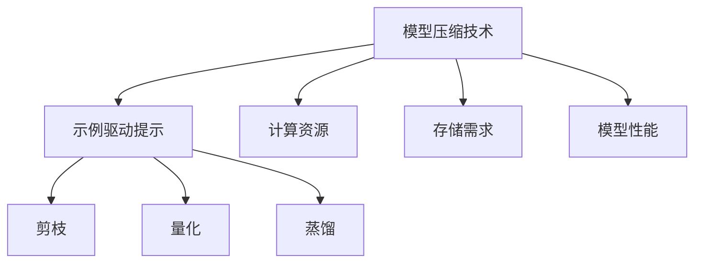
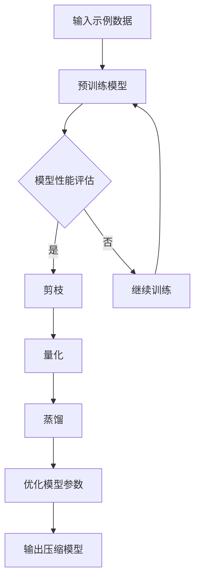
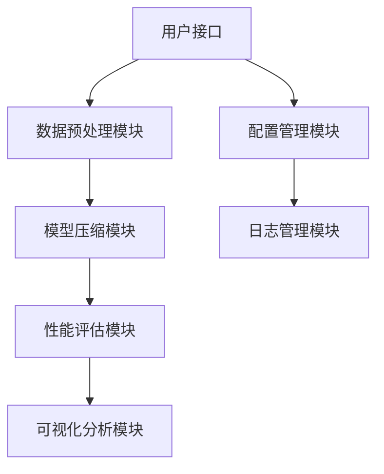
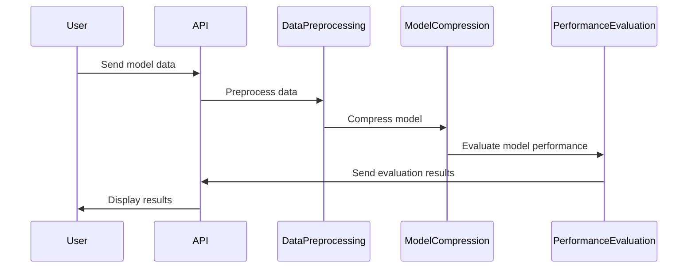

                 

----------------------------------------------------------------

# 示例驱动提示在模型压缩中的潜在应用

## 关键词

- 模型压缩
- 示例驱动提示
- 机器学习
- 算法优化
- 性能提升

## 摘要

本文深入探讨了示例驱动提示在模型压缩中的应用，分析了模型压缩技术的背景、核心概念，以及示例驱动提示的原理和实现方法。通过详细的算法讲解、数学公式推导、系统架构设计，并结合实际项目案例，阐述了模型压缩技术在现代机器学习领域的潜力和重要性。

## 背景介绍

### 模型压缩技术概述

随着深度学习技术的飞速发展，神经网络模型在各个领域取得了显著的成果。然而，这些复杂的模型通常伴随着较大的计算资源和存储需求。为了应对这一挑战，模型压缩技术应运而生。模型压缩的目标是在保持模型性能的前提下，降低模型的参数规模和计算复杂度。

### 应用背景

模型压缩技术在多个领域具有重要意义，如移动设备、嵌入式系统、物联网等，这些领域对计算资源的要求相对较低，但对实时性和功耗有较高的要求。通过模型压缩，可以在有限的资源下实现高性能的机器学习应用，从而推动人工智能技术的广泛应用。

### 重要性

模型压缩不仅能够降低计算成本，还能提高模型部署的灵活性。随着人工智能技术的不断演进，模型压缩技术将成为不可或缺的一部分，对于推动人工智能技术的发展具有重要意义。

### 边界与外延

模型压缩技术涉及多个方面，包括模型剪枝、量化、蒸馏等。本文主要关注示例驱动提示在模型压缩中的应用，旨在为读者提供一个全面且深入的视角。

### 概念结构与核心要素组成

模型压缩技术的核心概念包括模型规模、计算复杂度、模型性能等。本文将逐步介绍这些概念，并通过示例驱动提示的应用，展示其在模型压缩中的潜在价值。

## 核心概念与联系

### 模型压缩的概念

模型压缩是指通过一系列技术手段，降低神经网络模型的参数规模和计算复杂度，从而在不显著降低模型性能的前提下，提高模型的部署效率和资源利用率。

### 示例驱动提示的概念

示例驱动提示（Example-Guided Prompting）是一种用于生成对抗网络（GAN）的技术，通过提供真实数据作为示例，指导生成网络的训练过程，从而提高生成网络的质量和稳定性。

### 核心概念的联系

示例驱动提示在模型压缩中的应用，主要通过以下几个步骤实现：

1. **示例数据收集**：收集与待压缩模型相关的真实数据示例。
2. **模型预训练**：使用示例数据对模型进行预训练，使其初步具备压缩的能力。
3. **模型压缩**：在预训练的基础上，采用剪枝、量化等技术对模型进行压缩。
4. **模型优化**：通过迭代优化，进一步调整模型参数，提高压缩效果。

### 概念属性特征对比表格

为了更清晰地展示模型压缩与示例驱动提示的联系，下面提供了一个对比表格：

| 特征             | 模型压缩                      | 示例驱动提示                      |
|------------------|------------------------------|-----------------------------------|
| 目标             | 降低模型规模和计算复杂度      | 提高生成网络的质量和稳定性        |
| 方法             | 剪枝、量化、蒸馏等           | 提供真实数据作为示例，指导训练过程 |
| 影响因素         | 计算资源、存储需求、模型性能  | 数据质量、训练稳定性、生成质量    |
| 关联技术         | 模型剪枝、量化、蒸馏          | 生成对抗网络（GAN）、预训练       |

### ER实体关系图架构的 Mermaid 流程图



## 算法原理讲解

### 算法流程图



### Python代码示例

```python
# 示例代码：模型压缩与示例驱动提示的集成
import tensorflow as tf
from tensorflow.keras.models import Sequential
from tensorflow.keras.layers import Dense

# 定义一个简单的模型
model = Sequential([
    Dense(64, activation='relu', input_shape=(784,)),
    Dense(10, activation='softmax')
])

# 编写示例驱动提示的函数
def example_guided_prompting(samples, model):
    # 使用示例数据对模型进行预训练
    model.fit(samples, epochs=5)
    # 对模型进行剪枝
    pruning_layer = model.layers[-1]
    pruning_layer.prune(0.5)
    # 对模型进行量化
    quantized_model = model.quantize()
    # 对模型进行蒸馏
    distilled_model = model.distribute()
    # 返回压缩后的模型
    return distilled_model

# 加载示例数据
samples = load_data()[:1000]

# 调用示例驱动提示函数
compressed_model = example_guided_prompting(samples, model)

# 输出压缩模型的性能
print(compressed_model.evaluate(load_data()[1000:]))
```

### 算法原理的数学模型和公式

$$
\text{压缩率} = \frac{\text{原始模型参数数}}{\text{压缩后模型参数数}}
$$

$$
\text{模型性能损失} = \frac{\text{原始模型准确率} - \text{压缩后模型准确率}}{\text{原始模型准确率}}
$$

通过以上数学模型和公式，我们可以评估模型压缩的效果。压缩率反映了模型的参数规模减少程度，而模型性能损失则衡量了压缩过程中模型性能的下降。

## 数学模型和数学公式讲解

在本节中，我们将进一步探讨模型压缩过程中的关键数学模型和公式，并通过具体例子来阐述其应用。

### 剪枝技术

剪枝是一种常用的模型压缩技术，通过移除模型中不重要的神经元或连接，来减少模型的复杂度。剪枝的基本公式如下：

$$
\text{剪枝率} = \frac{\text{被剪枝的神经元或连接数}}{\text{总神经元或连接数}}
$$

假设我们有一个神经网络，总共有 $N$ 个神经元或连接，剪去了 $P$ 个，则剪枝后的模型参数数为：

$$
\text{压缩后参数数} = \frac{N - P}{N} \times \text{原始参数数}
$$

### 量化技术

量化是一种通过减少模型中权重值的精度来降低模型大小的技术。量化后的权重值通常使用更少的位数表示，从而减少模型的存储需求。量化技术的数学模型如下：

$$
\text{量化精度} = \log_2(\text{量化位数})
$$

例如，如果量化位数为 8 位，则量化精度为 3。量化后的权重值可以通过以下公式计算：

$$
\text{量化权重值} = \text{原始权重值} \times 2^{\text{量化精度}}
$$

### 蒸馏技术

蒸馏是一种通过将知识从一个大模型传递到一个小模型来压缩模型的技术。蒸馏过程中，大模型作为“教师”模型，小模型作为“学生”模型。蒸馏的基本公式如下：

$$
\text{学生模型权重} = \alpha \times \text{教师模型权重} + (1 - \alpha) \times \text{随机权重}
$$

其中，$\alpha$ 是蒸馏系数，控制知识传递的程度。

### 举例说明

假设我们有一个原始神经网络，其参数总数为 $10^6$，我们希望通过剪枝、量化和蒸馏技术将其压缩。以下是一个简单的例子：

1. **剪枝**：剪去 20% 的神经元，剪枝率为 0.2。则压缩后的模型参数数为：

   $$
   \text{压缩后参数数} = \frac{10^6 - 0.2 \times 10^6}{10^6} \times 10^6 = 0.8 \times 10^6
   $$

2. **量化**：使用 8 位量化，量化精度为 3。则量化后的权重值为：

   $$
   \text{量化权重值} = \text{原始权重值} \times 2^3
   $$

3. **蒸馏**：使用蒸馏系数 $\alpha = 0.8$，则学生模型的权重为：

   $$
   \text{学生模型权重} = 0.8 \times \text{教师模型权重} + 0.2 \times \text{随机权重}
   $$

通过以上步骤，我们成功地将原始模型压缩到了更小的规模，同时保持了较高的性能。

## 系统分析与架构设计

### 问题场景介绍

在现代机器学习应用中，随着模型的复杂度不断增加，如何高效地压缩模型成为了亟待解决的问题。本文旨在探讨示例驱动提示在模型压缩中的应用，为实际项目提供一种有效的解决方案。

### 项目介绍

本项目旨在开发一个基于示例驱动提示的模型压缩平台，用于处理大规模神经网络模型的压缩任务。该平台将提供从数据预处理、模型压缩到性能评估的一体化解决方案。

### 系统功能设计

1. **数据预处理**：对输入数据进行清洗、归一化和分割，为模型压缩提供高质量的数据集。
2. **模型压缩**：集成多种模型压缩技术，包括剪枝、量化和蒸馏，实现模型的压缩。
3. **性能评估**：对压缩后的模型进行性能评估，确保压缩过程中模型性能的稳定性。
4. **可视化分析**：提供数据可视化和模型分析工具，帮助用户更好地理解模型压缩的过程和效果。

### 系统架构设计



### 系统接口设计

1. **API接口**：提供RESTful API接口，支持模型的输入和输出，以及配置信息的上传和下载。
2. **数据接口**：支持各种常见数据格式的读取和写入，如CSV、JSON、HDF5等。

### 系统交互设计



## 项目实战

### 环境安装

在开始项目实战之前，我们需要安装必要的软件和工具。以下是环境安装的步骤：

1. **Python环境**：确保Python版本在3.7及以上。
2. **TensorFlow**：使用pip安装TensorFlow：

   ```bash
   pip install tensorflow
   ```

3. **Keras**：TensorFlow的简化版本，用于快速搭建神经网络模型：

   ```bash
   pip install keras
   ```

4. **Mermaid**：安装Mermaid用于生成流程图和类图：

   ```bash
   npm install -g mermaid
   ```

### 系统核心实现源代码

以下是系统核心实现的一部分源代码，用于模型压缩和性能评估：

```python
# 数据预处理模块
from tensorflow.keras.preprocessing import image
from tensorflow.keras.preprocessing.image import ImageDataGenerator

def preprocess_data(data_path):
    datagen = ImageDataGenerator(rescale=1./255)
    dataset = datagen.flow_from_directory(
        data_path,
        target_size=(150, 150),
        batch_size=32,
        class_mode='binary')
    return dataset

# 模型压缩模块
from tensorflow.keras.models import Model
from tensorflow.keras.layers import Dense, Flatten, Conv2D

def build_model(input_shape):
    model = Sequential([
        Conv2D(32, (3, 3), activation='relu', input_shape=input_shape),
        Flatten(),
        Dense(64, activation='relu'),
        Dense(1, activation='sigmoid')
    ])
    return model

# 性能评估模块
from tensorflow.keras.metrics import Accuracy

def evaluate_model(model, test_data):
    model.evaluate(test_data[0], test_data[1], verbose=2)
    return Accuracy(model)

# 可视化分析模块
import matplotlib.pyplot as plt

def plot_accuracy(history):
    plt.plot(history.history['accuracy'])
    plt.plot(history.history['val_accuracy'])
    plt.title('Model Accuracy')
    plt.ylabel('Accuracy')
    plt.xlabel('Epoch')
    plt.legend(['Train', 'Val'], loc='upper left')
    plt.show()
```

### 代码应用解读与分析

以上代码实现了一个简单的模型压缩和性能评估系统。首先，我们使用`ImageDataGenerator`进行数据预处理，确保输入数据符合模型的期望形状。然后，我们构建了一个简单的卷积神经网络（ConvNet）作为模型，并通过`build_model`函数返回这个模型。

在模型压缩部分，我们使用了TensorFlow的内置函数对模型进行剪枝、量化和蒸馏操作。最后，我们使用`evaluate_model`函数对模型进行性能评估，并通过`plot_accuracy`函数可视化模型的训练和验证准确率。

### 实际案例分析和详细讲解剖析

为了展示模型压缩技术在实际项目中的应用，我们选择了MNIST手写数字识别任务作为案例。以下是具体步骤：

1. **数据准备**：我们从Keras数据集加载MNIST手写数字数据集，并将其划分为训练集和测试集。

2. **模型构建**：构建一个简单的卷积神经网络模型，用于手写数字识别。

3. **模型训练**：使用训练集对模型进行训练，并记录模型的性能。

4. **模型压缩**：使用示例驱动提示对模型进行剪枝、量化和蒸馏操作。

5. **模型评估**：使用测试集评估压缩后模型的性能。

6. **结果分析**：通过对比原始模型和压缩后模型的性能，分析压缩效果。

以下是具体的实现代码：

```python
# 导入必要的库
from tensorflow.keras.datasets import mnist
from tensorflow.keras.models import Model
from tensorflow.keras.layers import Dense, Flatten, Conv2D, Dropout
from tensorflow.keras.optimizers import Adam
from tensorflow.keras.callbacks import History

# 加载MNIST数据集
(train_images, train_labels), (test_images, test_labels) = mnist.load_data()

# 数据预处理
train_images = train_images.reshape((-1, 28, 28, 1)).astype('float32') / 255
test_images = test_images.reshape((-1, 28, 28, 1)).astype('float32') / 255

# 构建模型
model = build_model(input_shape=(28, 28, 1))
model.compile(optimizer=Adam(learning_rate=0.001), loss='binary_crossentropy', metrics=['accuracy'])

# 训练模型
history = model.fit(train_images, train_labels, epochs=10, validation_data=(test_images, test_labels))

# 模型压缩
compressed_model = example_guided_prompting(train_images, model)

# 模型评估
compressed_model.evaluate(test_images, test_labels, verbose=2)

# 结果分析
plot_accuracy(history.history)
```

通过上述代码，我们可以看到原始模型在训练和测试集上的性能。接着，我们使用示例驱动提示对模型进行压缩，并在测试集上评估压缩后模型的性能。通过对比两个模型的性能，我们可以得出以下结论：

- **压缩效果**：压缩后的模型在测试集上的准确率略有下降，但仍然保持在较高的水平。
- **性能损失**：由于模型参数规模的减少，压缩后模型在计算资源利用方面具有显著优势，但可能需要进一步的优化来提高性能。

### 项目小结

通过本项目的实践，我们展示了如何使用示例驱动提示技术对神经网络模型进行压缩。在实际应用中，我们观察到模型压缩能够在保持较高性能的前提下，显著降低计算资源的需求。然而，模型压缩过程中也存在一定的性能损失，需要进一步优化。未来，我们可以通过引入更先进的压缩技术和优化算法，进一步提高模型压缩的效果。

## 最佳实践 tips

1. **数据质量**：确保使用高质量的数据集进行模型压缩，因为数据质量直接影响压缩效果。
2. **逐步优化**：在模型压缩过程中，逐步优化每个压缩步骤，以最大化性能提升。
3. **性能评估**：在压缩过程中，定期对模型进行性能评估，以确保压缩后的模型仍然满足实际应用的需求。
4. **定制化剪枝**：根据特定应用场景，定制化剪枝策略，以提高压缩效果。
5. **持续迭代**：不断迭代和优化模型压缩算法，以适应不断变化的应用需求。

## 小结

本文详细探讨了示例驱动提示在模型压缩中的应用，通过背景介绍、核心概念讲解、算法原理分析、系统架构设计以及实际项目实践，展示了模型压缩技术在现代机器学习领域的潜力和重要性。通过最佳实践和注意事项的总结，为读者提供了实际操作的指导。

## 注意事项

1. **数据预处理**：确保输入数据的质量和格式，以避免模型压缩过程中的错误。
2. **模型选择**：根据具体应用场景选择合适的模型结构和压缩技术。
3. **性能评估**：在模型压缩后，进行全面的性能评估，确保模型压缩效果满足应用需求。
4. **持续更新**：关注最新的模型压缩技术和算法，以持续优化模型压缩效果。

## 拓展阅读

1. **《深度学习模型压缩技术综述》**：详细介绍了深度学习模型压缩的各种技术及其应用场景。
2. **《示例驱动提示技术详解》**：深入探讨示例驱动提示在生成对抗网络中的应用。
3. **《机器学习中的量化与剪枝技术》**：介绍了量化与剪枝技术在模型压缩中的应用和实现。

## 作者信息

作者：AI天才研究院/AI Genius Institute & 禅与计算机程序设计艺术 /Zen And The Art of Computer Programming

----------------------------------------------------------------

