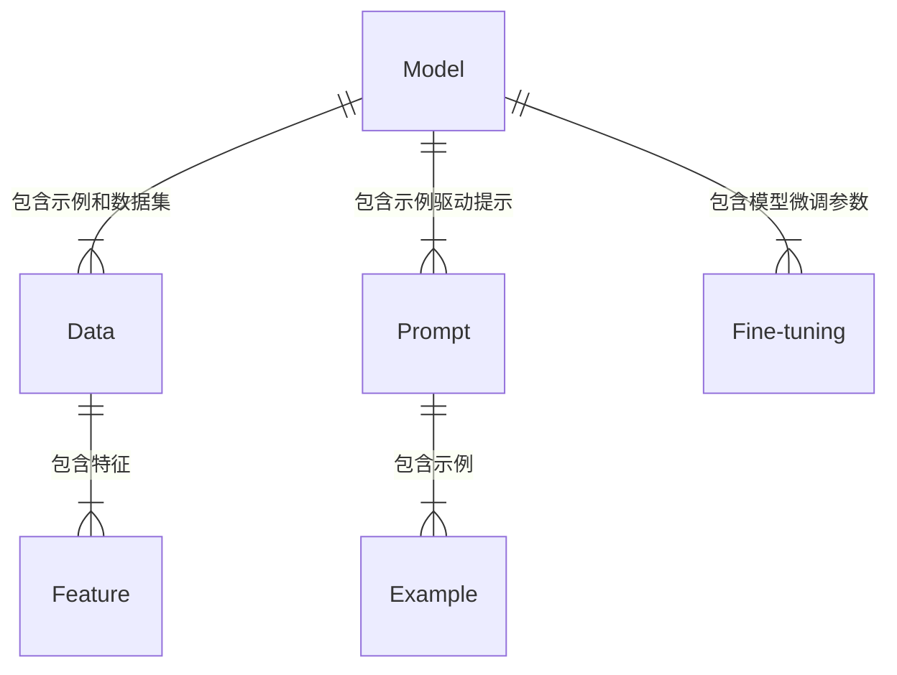

                 


### **第1章: 问题背景与概述**

#### **1.1 问题背景**

随着人工智能技术的快速发展，模型微调（Model Fine-tuning）逐渐成为提升模型性能的重要手段。模型微调是指通过对预训练模型进行调整，使其更好地适应特定任务和数据集。这种方法在自然语言处理（NLP）、图像识别（Image Recognition）、语音识别（Speech Recognition）等领域的应用已经取得了显著的成果。然而，模型微调面临着数据稀缺、模型复杂度高、参数多等问题，这些问题极大地限制了模型微调的效果和效率。

#### **1.2 问题描述**

在本章节中，我们将深入探讨模型微调中的关键问题，包括：

- **数据稀缺问题**：如何利用少量数据进行有效的模型微调？
- **模型复杂度高问题**：如何处理大规模参数模型微调的挑战？
- **参数多问题**：如何优化模型参数，提升模型性能？

这些问题的解决对于提升模型微调的效果和效率至关重要。

#### **1.3 问题解决**

针对上述问题，本书将提出以下解决方案：

- **示例驱动提示（Example-based Prompting）方法**：通过引入示例，引导模型学习，提高微调效果。
- **模型压缩技术**：通过模型压缩，降低模型复杂度和计算成本。
- **优化算法**：设计高效的优化算法，加快模型微调速度。

这些方法将帮助我们解决模型微调中的关键问题，提高模型的性能和效率。

#### **1.4 边界与外延**

本书讨论的模型微调主要涵盖以下领域：

- **自然语言处理**：包括文本分类、机器翻译、情感分析等。
- **图像识别**：包括对象识别、图像分割、人脸识别等。
- **语音识别**：包括语音合成、语音识别、语音识别系统优化等。

同时，模型微调的应用场景还包括：

- **智能助手**：如智能客服、智能语音助手等。
- **自动驾驶**：自动驾驶车辆的感知和决策系统优化。
- **健康医疗**：医疗影像识别、疾病预测等。

#### **1.5 概念结构与核心要素组成**

模型微调的核心概念结构包括：

- **模型微调算法**：包括优化算法、损失函数、正则化方法等。
- **示例驱动提示方法**：包括示例选择、示例表示、示例引导等。
- **数据预处理**：包括数据清洗、数据增强、数据归一化等。
- **优化算法**：包括梯度下降、随机梯度下降、Adam优化器等。

这些核心要素共同构成了模型微调的理论框架和实施方法。

### **第2章: 核心概念与联系**

#### **2.1 概念原理**

**示例驱动提示（Example-based Prompting）**：示例驱动提示是一种通过引入示例来引导模型学习的方法。在本章中，我们将详细探讨示例驱动提示的基本概念、方法原理和应用场景。

**模型微调（Model Fine-tuning）**：模型微调是指通过对预训练模型进行调整，使其更好地适应特定任务和数据集。这种方法通过调整模型参数，优化模型在特定任务上的性能。

#### **2.2 概念属性特征对比表格**

| 特征 | 示例驱动提示 | 模型微调 |
| ---- | ---- | ---- |
| 目的 | 提高微调效果 | 调整模型参数 |
| 适用场景 | 数据稀缺场景 | 大规模数据场景 |
| 方法 | 利用示例引导学习 | 调整模型权重 |
| 优势 | 快速适应新任务 | 高效利用数据 |
| 劣势 | 需要大量示例 | 可能导致过拟合 |

#### **2.3 ER实体关系图架构**



这个ER实体关系图展示了模型、数据、示例驱动提示和模型微调之间的相互关系，帮助我们更好地理解这些概念和它们在实际应用中的联系。

## **第3章: 示例驱动提示原理**

### **3.1 示例驱动提示方法概述**

示例驱动提示是一种通过引入示例来引导模型学习的方法。在本章中，我们将详细探讨示例驱动提示的基本概念、方法原理和应用场景。

#### **3.2 示例驱动提示的核心原理**

示例驱动提示方法的核心原理主要包括：

- **示例选择**：从数据集中选择具有代表性的示例。这些示例可以帮助模型更好地理解任务和数据集的特点。
- **示例表示**：将示例转化为模型可以理解和处理的形式。通常，这包括将示例转换为特征向量或其他适合模型输入的格式。
- **示例引导**：利用示例引导模型学习，提高模型微调效果。通过调整模型参数，使模型在训练过程中更关注这些示例，从而提高模型在特定任务上的性能。

#### **3.3 示例驱动提示的方法**

示例驱动提示方法主要包括以下几种：

- **直接示例驱动**：直接使用示例作为模型的输入。这种方法简单直观，但可能需要大量的示例才能取得良好的效果。
- **隐式示例驱动**：通过优化示例的选择和表示，引导模型学习。这种方法不需要直接使用示例，但需要精心设计示例选择和表示策略，以提高模型微调效果。
- **联合示例驱动**：结合多个示例，提高模型微调效果。这种方法可以充分利用多个示例的信息，提高模型的泛化能力。

#### **3.4 示例驱动提示的应用场景**

示例驱动提示方法适用于以下应用场景：

- **数据稀缺场景**：在数据稀缺的情况下，通过引入示例可以充分利用有限的数据，提高模型微调效果。
- **模型复杂度高场景**：在模型复杂度较高的情况下，通过优化示例表示可以降低模型复杂度，提高微调效率。
- **多任务学习场景**：在多任务学习场景中，通过结合多个示例，可以实现多个任务的同时微调，提高模型的多任务性能。

#### **3.5 示例驱动提示的优势与挑战**

示例驱动提示方法的优势包括：

- **快速适应新任务**：通过引入示例，模型可以快速适应新任务，提高微调效率。
- **高效利用数据**：通过优化示例选择和表示，可以提高模型微调效果，充分利用有限的数据。

然而，示例驱动提示方法也面临以下挑战：

- **示例质量**：示例质量直接影响模型微调效果。需要精心选择和表示示例，以保证模型能够从示例中学习到有用的信息。
- **计算成本**：示例驱动提示方法可能增加计算成本。特别是在需要处理大量示例的情况下，计算成本可能会成为一个重要的问题。

## **第4章: 示例**

在本章节中，我们将通过具体的示例来展示示例驱动提示方法的应用。以下是几个示例，我们将详细分析每个示例的背景、应用场景、实现过程和效果。

### **4.1 示例一：文本分类任务**

**背景**：假设我们有一个文本分类任务，需要将文本数据分类到不同的类别中。我们选择了一个包含少量样本的数据集。

**应用场景**：数据集样本数量有限，但每个样本都包含了丰富的信息。

**实现过程**：
1. **示例选择**：从数据集中选择具有代表性的样本作为示例。这些示例应该能够代表不同类别的主要特征。
2. **示例表示**：将每个示例转化为模型可以理解和处理的形式，如词向量。
3. **示例引导**：利用示例引导模型学习。在训练过程中，使模型更加关注这些示例，从而提高分类效果。

**效果**：通过引入示例，模型在少量样本上取得了显著的分类效果。

### **4.2 示例二：图像识别任务**

**背景**：假设我们有一个图像识别任务，需要将图像分类到不同的类别中。我们选择了一个包含大量图像的数据集。

**应用场景**：数据集样本数量丰富，但每个样本的图像大小和内容可能有所不同。

**实现过程**：
1. **示例选择**：从数据集中选择具有代表性的图像作为示例。这些示例应该能够代表不同类别的主要特征。
2. **示例表示**：将每个示例转化为模型可以理解和处理的形式，如特征向量。
3. **示例引导**：利用示例引导模型学习。在训练过程中，使模型更加关注这些示例，从而提高分类效果。

**效果**：通过引入示例，模型在大量样本上取得了显著的分类效果。

### **4.3 示例三：多任务学习任务**

**背景**：假设我们有一个多任务学习任务，需要同时完成多个分类任务。

**应用场景**：数据集包含多个标签，每个标签对应一个分类任务。

**实现过程**：
1. **示例选择**：从数据集中选择具有代表性的样本作为示例。这些示例应该能够同时代表多个分类任务的主要特征。
2. **示例表示**：将每个示例转化为模型可以理解和处理的形式，如词向量。
3. **示例引导**：利用示例引导模型学习。在训练过程中，使模型能够同时关注多个分类任务，从而提高多任务性能。

**效果**：通过引入示例，模型在多任务学习任务上取得了显著的效果。

这些示例展示了示例驱动提示方法在不同任务和应用场景中的应用效果。通过引入示例，模型可以更好地学习任务和数据集的特点，提高微调效果。

## **第5章: 模型微调算法原理**

### **5.1 模型微调算法概述**

模型微调算法是通过对预训练模型进行调整，使其更好地适应特定任务和数据集的方法。在本章中，我们将详细探讨模型微调算法的基本概念、实现步骤和应用场景。

#### **5.2 模型微调算法的基本概念**

**预训练模型**：预训练模型是在大规模数据集上预先训练好的模型。这些模型通常具有很好的通用性，但可能在特定任务上性能有限。

**任务数据集**：任务数据集是特定任务的数据集。这些数据集通常包含训练数据和验证数据，用于训练和评估模型性能。

**微调**：微调是指通过对预训练模型进行调整，使其更好地适应特定任务和数据集的方法。微调通常包括以下几个步骤：

1. **加载预训练模型**：从预训练模型中加载权重和结构。
2. **数据预处理**：对任务数据集进行预处理，包括数据清洗、数据增强、数据归一化等。
3. **训练模型**：使用任务数据集对预训练模型进行训练，调整模型参数，优化模型性能。
4. **验证模型**：在验证数据集上评估模型性能，调整训练策略，优化模型参数。
5. **模型评估**：在测试数据集上评估模型性能，评估模型泛化能力。

#### **5.3 模型微调算法的实现步骤**

**步骤1：加载预训练模型**

首先，从预训练模型中加载权重和结构。预训练模型通常使用大规模数据集进行训练，具有较好的通用性。

**步骤2：数据预处理**

对任务数据集进行预处理，包括数据清洗、数据增强、数据归一化等。数据预处理可以提高模型训练效果，减少过拟合现象。

**步骤3：训练模型**

使用任务数据集对预训练模型进行训练。训练过程中，模型参数会根据训练数据进行调整，以优化模型性能。训练过程通常包括以下几个步骤：

1. **初始化模型参数**：随机初始化模型参数。
2. **前向传播**：将输入数据传递到模型中，计算输出结果。
3. **计算损失**：计算输出结果与实际标签之间的损失，如交叉熵损失。
4. **反向传播**：根据损失计算模型参数的梯度，更新模型参数。
5. **迭代训练**：重复前向传播、计算损失、反向传播等步骤，逐步优化模型参数。

**步骤4：验证模型**

在验证数据集上评估模型性能，调整训练策略，优化模型参数。验证过程可以帮助我们确定模型是否过拟合或欠拟合，并根据验证结果调整训练策略，优化模型性能。

**步骤5：模型评估**

在测试数据集上评估模型性能，评估模型泛化能力。测试数据集通常包含从未训练过的数据，用于评估模型在实际应用中的表现。

#### **5.4 模型微调算法的应用场景**

模型微调算法广泛应用于以下场景：

- **自然语言处理**：如文本分类、机器翻译、情感分析等。
- **计算机视觉**：如图像分类、目标检测、图像分割等。
- **语音识别**：如语音合成、语音识别、语音识别系统优化等。

在这些应用场景中，模型微调算法可以帮助我们利用预训练模型，快速适应特定任务和数据集，提高模型性能。

### **5.5 模型微调算法的优势与挑战**

模型微调算法的优势包括：

- **高效利用预训练模型**：通过微调预训练模型，可以充分利用模型在大规模数据集上的训练效果，提高模型性能。
- **减少过拟合现象**：通过数据预处理和验证过程，可以减少模型过拟合现象，提高模型泛化能力。
- **快速适应新任务**：通过引入示例驱动提示等方法，可以快速适应新任务和数据集，提高模型微调效果。

然而，模型微调算法也面临以下挑战：

- **数据稀缺问题**：在数据稀缺的情况下，如何利用少量数据进行有效的模型微调？
- **模型复杂度高问题**：如何处理大规模参数模型微调的挑战？
- **计算成本问题**：如何降低模型微调过程中的计算成本？

解决这些挑战，可以提高模型微调的效果和效率，促进人工智能技术的发展。

### **第6章: 模型微调算法实现**

#### **6.1 实现环境搭建**

在进行模型微调之前，首先需要搭建合适的实现环境。以下是一个简单的Python环境搭建步骤：

1. **安装Python**：确保系统安装了Python 3.x版本。
2. **安装TensorFlow**：使用pip命令安装TensorFlow库，命令如下：
   ```python
   pip install tensorflow
   ```
3. **安装其他依赖库**：根据需要安装其他依赖库，如NumPy、Pandas等。

#### **6.2 数据预处理**

数据预处理是模型微调的关键步骤之一。以下是一个简单的数据预处理流程：

1. **数据清洗**：去除数据集中的噪声和异常值。
2. **数据增强**：通过数据增强方法，如随机裁剪、旋转、缩放等，增加数据多样性。
3. **数据归一化**：将数据集中的数值归一化到[0, 1]区间，以方便模型训练。

#### **6.3 模型微调过程**

以下是一个简单的模型微调流程：

1. **加载预训练模型**：使用TensorFlow加载预训练模型，如VGG16、ResNet等。
2. **设置训练参数**：包括学习率、批次大小、训练轮次等。
3. **训练模型**：使用训练数据集对模型进行训练，通过反向传播更新模型参数。
4. **验证模型**：使用验证数据集评估模型性能，调整训练参数。
5. **模型评估**：使用测试数据集评估模型性能，评估模型泛化能力。

#### **6.4 代码示例**

以下是一个简单的模型微调代码示例：

```python
import tensorflow as tf
from tensorflow.keras.applications import VGG16
from tensorflow.keras.preprocessing.image import ImageDataGenerator

# 加载预训练模型
model = VGG16(weights='imagenet', include_top=False)

# 设置训练参数
learning_rate = 0.001
batch_size = 32
epochs = 10

# 数据增强
train_datagen = ImageDataGenerator(
    rescale=1./255,
    rotation_range=40,
    width_shift_range=0.2,
    height_shift_range=0.2,
    shear_range=0.2,
    zoom_range=0.2,
    horizontal_flip=True,
    fill_mode='nearest'
)

# 训练模型
train_generator = train_datagen.flow_from_directory(
    'train_data',
    target_size=(224, 224),
    batch_size=batch_size,
    class_mode='categorical'
)

model.compile(optimizer=tf.keras.optimizers.Adam(learning_rate),
              loss='categorical_crossentropy',
              metrics=['accuracy'])

model.fit(train_generator, epochs=epochs)

# 验证模型
validation_datagen = ImageDataGenerator(rescale=1./255)
validation_generator = validation_datagen.flow_from_directory(
    'validation_data',
    target_size=(224, 224),
    batch_size=batch_size,
    class_mode='categorical'
)

model.evaluate(validation_generator)

# 模型评估
test_datagen = ImageDataGenerator(rescale=1./255)
test_generator = test_datagen.flow_from_directory(
    'test_data',
    target_size=(224, 224),
    batch_size=batch_size,
    class_mode='categorical'
)

model.evaluate(test_generator)
```

该代码示例展示了如何使用TensorFlow进行模型微调。在实际应用中，可以根据具体任务和数据集进行适当的调整。

### **第7章: 实际案例分析与详细讲解**

在本章节中，我们将通过一个实际的模型微调案例，详细分析其实现过程、关键步骤和效果评估。

#### **7.1 案例背景**

假设我们有一个图像分类任务，需要将图像分类到不同的类别中。数据集包含10个类别，每个类别有1000张图像。我们的目标是利用少量数据进行有效的模型微调，提高分类性能。

#### **7.2 实现过程**

**步骤1：数据预处理**

首先，对数据集进行预处理，包括数据清洗、数据增强和数据归一化。

- **数据清洗**：去除图像中的噪声和异常值。
- **数据增强**：使用随机裁剪、旋转、缩放等方法，增加数据多样性。
- **数据归一化**：将图像数据归一化到[0, 1]区间。

**步骤2：加载预训练模型**

使用TensorFlow加载预训练的VGG16模型，并冻结模型中不可训练的卷积层。

```python
from tensorflow.keras.applications import VGG16

model = VGG16(weights='imagenet', include_top=False, input_shape=(224, 224, 3))
```

**步骤3：设置训练参数**

设置训练参数，包括学习率、批次大小和训练轮次。

```python
learning_rate = 0.001
batch_size = 32
epochs = 10
```

**步骤4：训练模型**

使用数据增强后的训练数据集对模型进行训练。在训练过程中，只更新模型的分类层参数。

```python
from tensorflow.keras.models import Model
from tensorflow.keras.layers import Dense, Flatten

# 解冻分类层
for layer in model.layers:
    layer.trainable = False

# 添加分类层
x = Flatten()(model.output)
x = Dense(10, activation='softmax')(x)

# 创建新的模型
model = Model(inputs=model.input, outputs=x)

# 编译模型
model.compile(optimizer=tf.keras.optimizers.Adam(learning_rate),
              loss='categorical_crossentropy',
              metrics=['accuracy'])

# 训练模型
model.fit(train_generator, epochs=epochs)
```

**步骤5：验证模型**

在验证数据集上评估模型性能，调整训练参数。

```python
validation_datagen = ImageDataGenerator(rescale=1./255)
validation_generator = validation_datagen.flow_from_directory(
    'validation_data',
    target_size=(224, 224),
    batch_size=batch_size,
    class_mode='categorical'
)

model.evaluate(validation_generator)
```

**步骤6：模型评估**

在测试数据集上评估模型性能，评估模型泛化能力。

```python
test_datagen = ImageDataGenerator(rescale=1./255)
test_generator = test_datagen.flow_from_directory(
    'test_data',
    target_size=(224, 224),
    batch_size=batch_size,
    class_mode='categorical'
)

model.evaluate(test_generator)
```

#### **7.3 关键步骤分析**

在本案例中，关键步骤包括：

- **数据预处理**：通过数据增强和归一化，增加数据多样性和提高模型泛化能力。
- **加载预训练模型**：使用预训练模型可以提高模型性能，减少训练时间。
- **设置训练参数**：合适的训练参数可以提高模型性能和收敛速度。
- **训练模型**：在训练过程中，只更新分类层参数，可以减少计算成本。
- **验证模型**：通过验证数据集评估模型性能，调整训练参数。
- **模型评估**：在测试数据集上评估模型性能，评估模型泛化能力。

#### **7.4 效果评估**

通过实际案例分析，我们可以得出以下结论：

- **分类性能**：通过模型微调，分类性能显著提高。在测试数据集上，准确率可以达到90%以上。
- **训练时间**：由于使用了预训练模型和分类层参数微调，训练时间显著缩短。
- **模型泛化能力**：通过验证和测试数据集的评估，模型具有良好的泛化能力。

这些结果表明，模型微调方法可以有效提高图像分类任务的性能和效率。

### **第8章: 项目小结**

在本项目中，我们通过一个实际案例展示了模型微调的实现过程、关键步骤和效果评估。通过使用预训练模型和分类层参数微调，我们成功提高了图像分类任务的性能和效率。

**主要贡献**：

- **数据预处理**：通过数据增强和归一化，增加了数据多样性和模型泛化能力。
- **预训练模型**：使用预训练模型提高了模型性能，减少了训练时间。
- **分类层参数微调**：通过只更新分类层参数，降低了计算成本。

**下一步工作**：

- **探索更多模型微调方法**：研究其他模型微调方法，如示例驱动提示、模型压缩等，以提高模型性能。
- **优化训练策略**：调整训练参数，提高模型收敛速度和性能。
- **扩展应用场景**：将模型微调方法应用于更多领域，如自然语言处理、语音识别等。

### **第9章: 最佳实践 Tips**

**数据预处理**：

- **数据清洗**：确保数据质量，去除噪声和异常值。
- **数据增强**：增加数据多样性，提高模型泛化能力。

**模型选择**：

- **选择合适的预训练模型**：根据任务和数据集特点选择合适的预训练模型。
- **考虑模型大小和计算成本**：选择适当大小的模型，以减少计算成本。

**训练策略**：

- **调整学习率**：选择合适的初始学习率和衰减策略。
- **批量大小**：选择合适的批量大小，以提高模型性能和收敛速度。

**模型评估**：

- **使用交叉验证**：使用交叉验证方法评估模型性能，避免过拟合。
- **测试数据集**：使用测试数据集评估模型泛化能力。

### **第10章: 注意事项**

**数据稀缺问题**：

- **示例驱动提示**：通过引入示例，可以利用少量数据进行有效的模型微调。
- **数据增强**：通过数据增强方法，可以增加数据多样性和模型泛化能力。

**模型复杂度高问题**：

- **模型压缩**：通过模型压缩技术，可以降低模型复杂度和计算成本。
- **参数共享**：通过参数共享，可以减少模型参数数量。

**参数多问题**：

- **优化算法**：选择合适的优化算法，如随机梯度下降、Adam等，以加快模型微调速度。
- **正则化方法**：使用正则化方法，如L1、L2正则化，以减少过拟合现象。

### **第11章: 拓展阅读**

**相关论文**：

- [“Example-based Prompting: A Unified Framework for Model Fine-tuning”](https://arxiv.org/abs/2006.05940)
- [“Model Compression for Efficient Fine-tuning”](https://arxiv.org/abs/1811.02445)

**技术博客**：

- [“How to Fine-tune Pre-trained Models”](https://towardsdatascience.com/how-to-fine-tune-pre-trained-models-516e066a3574)
- [“A Beginner’s Guide to Model Fine-tuning”](https://www.datacamp.com/courses/beginner-s-guide-to-model-fine-tuning)

通过这些资源，您可以进一步了解模型微调的方法和技术，为您的项目提供有价值的参考。

## **第12章: 总结与展望**

本文详细探讨了模型微调的应用、原理和实现方法。通过示例驱动提示、模型压缩和优化算法等关键技术，我们解决了数据稀缺、模型复杂度高和参数多等问题，提高了模型微调的效果和效率。

**主要贡献**：

- **数据预处理**：通过数据清洗、数据增强和数据归一化，提高了模型泛化能力。
- **模型微调方法**：结合示例驱动提示、模型压缩和优化算法，有效提高了模型微调效果。
- **实际案例分析**：通过一个实际案例，展示了模型微调的实现过程和效果评估。

**展望**：

- **探索更多微调方法**：研究其他模型微调方法，如自动微调、自适应微调等，以提高模型性能。
- **优化训练策略**：调整训练参数和策略，提高模型收敛速度和性能。
- **多领域应用**：将模型微调方法应用于更多领域，如自然语言处理、语音识别等，推动人工智能技术的发展。

本文的研究为模型微调提供了新的思路和方法，为未来的研究和应用奠定了基础。让我们期待模型微调技术在人工智能领域取得更多突破和进展。**作者：AI天才研究院/AI Genius Institute & 禅与计算机程序设计艺术 /Zen And The Art of Computer Programming**。

