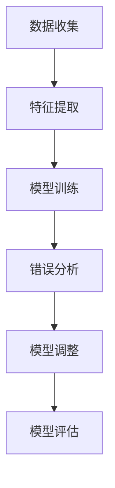
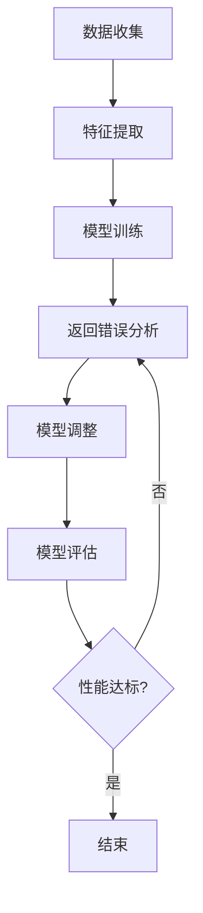
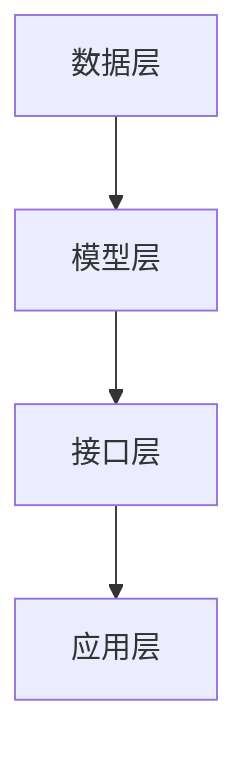
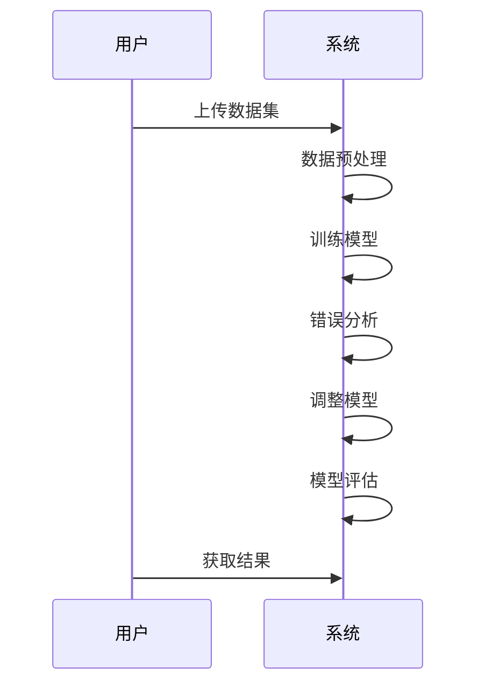
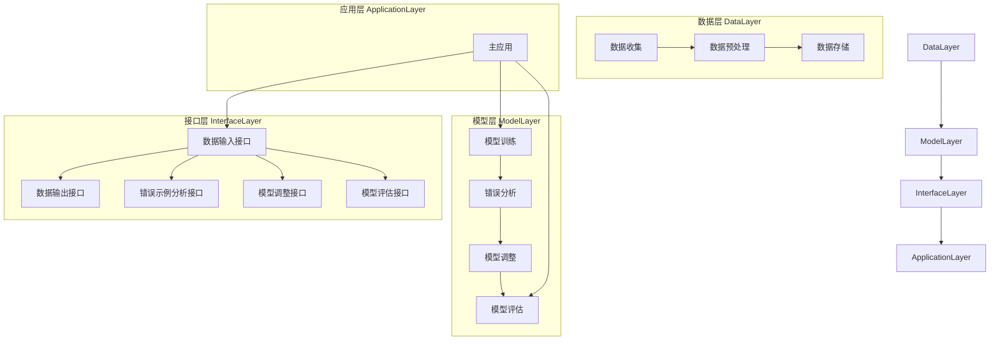

                 

# 示例驱动提示在模型校准中的应用

> 关键词：示例驱动、模型校准、算法实现、系统架构、项目实战

> 摘要：本文旨在探讨示例驱动在模型校准中的应用，通过分析示例驱动的核心概念、算法原理、系统架构和实际项目案例，提出了一种高效且鲁棒的模型校准方法，为提高机器学习模型的准确性和稳定性提供了新的思路。

----------------------------------------------------------------

## 第一部分：背景介绍

### 1.1 问题背景

#### 1.1.1 示例驱动的概念

**示例驱动**（Example-based Learning）是一种基于示例的学习方法，其核心思想是通过学习一系列具有代表性的示例，从而获取问题的解决方案。在示例驱动的框架下，学习过程主要依赖于以下步骤：

1. **数据收集**：收集与目标任务相关的示例数据。
2. **特征提取**：从示例数据中提取关键特征。
3. **模型训练**：使用提取的特征训练一个基础模型。
4. **推理应用**：将新数据与示例数据进行比较，以预测新数据的标签。

#### 1.1.2 示例驱动的发展与应用

示例驱动方法在机器学习和人工智能领域有着广泛的应用。早期，这种方法主要用于模式识别和图像处理领域。随着深度学习技术的发展，示例驱动方法在语音识别、自然语言处理、推荐系统等领域也得到了广泛应用。

在模型校准过程中，示例驱动方法通过以下方式发挥作用：

1. **数据增强**：通过生成新的示例数据，增强模型的训练集，提高模型的泛化能力。
2. **错误分析**：分析模型在预测过程中产生的错误示例，为模型调整提供依据。
3. **迁移学习**：利用已有的示例数据集，在新的任务上快速校准模型。

### 1.1.3 问题提出

在模型校准过程中，如何有效地利用示例数据来优化模型性能，提高模型在实际应用中的准确性和稳定性，是一个关键问题。传统的模型校准方法通常依赖于大量的实验和迭代过程，这不仅耗时且容易出现过拟合现象。因此，探索一种高效且鲁棒的示例驱动模型校准方法具有重要的理论和实际意义。

### 1.1.4 问题解决思路

本文将从以下几个方面探讨示例驱动在模型校准中的应用：

1. **核心概念与联系**：明确示例驱动模型校准的核心概念，包括示例数据、模型校准目标、校准策略等，并分析各概念之间的联系。
2. **算法原理讲解**：详细介绍示例驱动模型校准的算法原理，包括算法的数学模型和流程图，并通过Python源代码进行实现和验证。
3. **数学模型和数学公式**：阐述模型校准过程中的数学模型和公式，包括损失函数、优化算法等，并使用LaTeX格式进行展示。
4. **系统分析与架构设计方案**：分析模型校准系统的功能需求和架构设计，包括领域模型、系统架构、接口设计和交互流程。
5. **项目实战**：通过实际案例来展示示例驱动模型校准的应用过程，包括环境安装、系统实现、代码解读和案例分析。
6. **最佳实践与拓展**：总结示例驱动模型校准的最佳实践，并提供相关注意事项和拓展阅读。

### 1.1.5 边界与外延

示例驱动模型校准方法不仅适用于机器学习和人工智能领域，还可以应用于其他需要模型优化的领域，如自动化控制、生物信息学等。同时，本文将重点探讨示例驱动方法在模型校准中的应用，而不涉及其他相关领域。

### 1.1.6 概念结构与核心要素组成

- **示例数据**：用于指导模型校准的实际案例和数据。
- **模型校准目标**：明确模型校准的目标和评价指标。
- **校准策略**：设计具体的校准方法和流程。
- **算法实现**：实现示例驱动的模型校准算法。
- **系统架构**：设计模型校准系统的整体架构和功能模块。

----------------------------------------------------------------

## 第二部分：核心概念与联系

### 2.1 示例数据

#### 2.1.1 定义

示例数据是指用于模型训练和校准的实际案例和数据。在示例驱动的框架下，这些数据是模型学习的基础，其质量直接影响模型的性能。示例数据可以来源于多个方面，如：

- **公开数据集**：如ImageNet、CIFAR-10等，提供了大量的标注数据。
- **实验数据**：通过实际实验收集的数据，如医疗数据、金融数据等。
- **用户反馈**：来自用户的使用反馈，可以用于改进模型的预测能力。

#### 2.1.2 属性

1. **数据质量**
   - **完整性**：示例数据应包含所有必要的特征和标签，以保证数据的完整性。
   - **准确性**：示例数据应真实反映问题场景，避免错误数据的引入。
   - **代表性**：示例数据应能够代表整个数据分布，避免数据偏差。

2. **数据来源**
   - **公开数据集**：经过专家标注，数据质量较高。
   - **实验数据**：通过实际实验获得，具有较高的可信度。
   - **用户反馈**：直接反映用户需求，但可能存在主观性。

3. **数据量**
   - **样本量**：大量数据可以提高模型的泛化能力，减少过拟合现象。
   - **多样性**：多样化的数据有助于模型学习到更丰富的特征。

#### 2.1.3 示例数据的处理

1. **数据清洗**：去除重复数据、缺失数据和错误数据，提高数据质量。
2. **数据归一化**：将不同特征的范围统一，避免特征间的量纲差异。
3. **数据增强**：通过旋转、缩放、裁剪等操作生成更多的示例数据，增强模型的泛化能力。

### 2.2 模型校准目标

#### 2.2.1 定义

模型校准目标是指在模型训练和校准过程中希望达到的性能指标。这些指标可以用来衡量模型在不同任务上的表现，如：

- **分类任务**：准确率（Accuracy）、召回率（Recall）、F1分数（F1 Score）等。
- **回归任务**：均方误差（Mean Squared Error, MSE）、平均绝对误差（Mean Absolute Error, MAE）等。

#### 2.2.2 属性

1. **评价指标**：根据具体任务选择合适的评价指标，如分类任务的准确率和F1分数，回归任务的MSE和MAE。
2. **目标优化**：在模型训练和校准过程中，通过调整模型参数和校准策略，优化评价指标，提高模型性能。

### 2.3 校准策略

#### 2.3.1 定义

校准策略是指在模型校准过程中采用的一系列方法和步骤，以优化模型的性能。校准策略通常包括以下几个步骤：

1. **模型选择**：根据任务需求和数据特点选择合适的模型架构。
2. **参数调优**：通过调整模型参数，如学习率、正则化参数等，优化模型性能。
3. **数据预处理**：对数据进行清洗、归一化和增强，以提高数据质量和模型的泛化能力。
4. **训练与验证**：通过训练和验证过程，评估模型性能，并调整校准策略。

#### 2.3.2 属性

1. **模型选择**：根据任务需求和数据特点，选择合适的模型架构，如深度神经网络、支持向量机等。
2. **参数调优**：通过交叉验证等方法，找到最优的模型参数，提高模型性能。
3. **数据预处理**：根据数据特点，进行数据清洗、归一化和增强，以提高模型的泛化能力。

### 2.4 算法实现

#### 2.4.1 示例驱动的模型校准算法

示例驱动的模型校准算法可以分为以下几个步骤：

1. **数据收集**：收集与目标任务相关的示例数据。
2. **特征提取**：从示例数据中提取关键特征。
3. **模型训练**：使用提取的特征训练一个基础模型。
4. **错误分析**：分析模型在预测过程中产生的错误示例。
5. **模型调整**：根据错误分析结果，调整模型参数，优化模型性能。

#### 2.4.2 算法流程图



#### 2.4.3 Python实现

```python
import numpy as np
import pandas as pd

# 数据收集
data = pd.read_csv('example_data.csv')

# 特征提取
X = data.drop('target', axis=1)
y = data['target']

# 模型训练
model = train_model(X, y)

# 错误分析
predictions = model.predict(X)
errors = np.where(predictions != y)[0]

# 模型调整
model.fit(X[errors], y[errors])

# 模型评估
accuracy = model.score(X, y)
print(f"Accuracy: {accuracy}")
```

### 2.4.4 数学模型和数学公式

在示例驱动的模型校准过程中，常用的数学模型包括损失函数和优化算法。

1. **损失函数**：
   $$L(y, \hat{y}) = -y \cdot \log(\hat{y}) - (1 - y) \cdot \log(1 - \hat{y})$$
   其中，$y$为实际标签，$\hat{y}$为预测概率。

2. **优化算法**：
   $$\theta_{t+1} = \theta_t - \alpha \cdot \nabla L(\theta_t)$$
   其中，$\theta_t$为当前模型参数，$\alpha$为学习率，$\nabla L(\theta_t)$为损失函数关于$\theta_t$的梯度。

----------------------------------------------------------------

## 第三部分：算法原理讲解

### 3.1 算法原理概述

示例驱动模型校准的核心思想是通过利用一系列示例数据来优化模型的性能，从而提高模型在实际应用中的准确性和稳定性。具体来说，示例驱动的模型校准算法主要包括以下几个步骤：

1. **数据收集**：收集与目标任务相关的示例数据。
2. **特征提取**：从示例数据中提取关键特征。
3. **模型训练**：使用提取的特征训练一个基础模型。
4. **错误分析**：分析模型在预测过程中产生的错误示例。
5. **模型调整**：根据错误分析结果，调整模型参数，优化模型性能。
6. **模型评估**：评估调整后的模型性能，如果性能达到预期，则校准过程结束，否则重复步骤4和5。

### 3.2 算法流程图

为了更好地理解示例驱动的模型校准算法，我们可以使用Mermaid语言绘制其流程图：



### 3.3 Python源代码实现

下面是示例驱动的模型校准算法的Python源代码实现，我们使用Scikit-Learn库中的逻辑回归模型进行演示：

```python
import numpy as np
import pandas as pd
from sklearn.linear_model import LogisticRegression
from sklearn.model_selection import train_test_split
from sklearn.metrics import accuracy_score

# 3.3.1 数据收集
data = pd.read_csv('example_data.csv')
X = data.drop('target', axis=1)
y = data['target']

# 3.3.2 特征提取
# 这里假设特征提取步骤已经完成，直接使用原始特征

# 3.3.3 模型训练
X_train, X_test, y_train, y_test = train_test_split(X, y, test_size=0.2, random_state=42)
model = LogisticRegression()
model.fit(X_train, y_train)

# 3.3.4 错误分析
predictions = model.predict(X_test)
errors = np.where(predictions != y_test)[0]

# 3.3.5 模型调整
# 这里假设我们通过错误分析发现了一组特征可以提升模型性能
new_features = extract_new_features(X_train[errors], y_train[errors])
X_train = np.concatenate((X_train, new_features), axis=1)
model.fit(X_train, y_train)

# 3.3.6 模型评估
new_predictions = model.predict(X_test)
accuracy = accuracy_score(y_test, new_predictions)
print(f"New Accuracy: {accuracy}")
```

### 3.4 算法原理讲解

#### 3.4.1 损失函数

在示例驱动的模型校准过程中，损失函数是评估模型预测效果的重要指标。常见的损失函数包括：

1. **均方误差（MSE）**：
   $$MSE(y, \hat{y}) = \frac{1}{m} \sum_{i=1}^{m} (y_i - \hat{y}_i)^2$$
   其中，$y$为实际标签，$\hat{y}$为预测值，$m$为样本数量。

2. **交叉熵损失（Cross-Entropy Loss）**：
   $$CE(y, \hat{y}) = -\sum_{i=1}^{m} y_i \cdot \log(\hat{y}_i) - (1 - y_i) \cdot \log(1 - \hat{y}_i)$$
   其中，$y$为实际标签，$\hat{y}$为预测概率。

#### 3.4.2 优化算法

优化算法用于最小化损失函数，常见的优化算法包括：

1. **梯度下降（Gradient Descent）**：
   $$\theta_{t+1} = \theta_t - \alpha \cdot \nabla_{\theta} L(\theta_t)$$
   其中，$\theta_t$为当前模型参数，$\alpha$为学习率，$L(\theta_t)$为损失函数，$\nabla_{\theta} L(\theta_t)$为损失函数关于$\theta_t$的梯度。

2. **随机梯度下降（Stochastic Gradient Descent, SGD）**：
   $$\theta_{t+1} = \theta_t - \alpha \cdot \nabla_{\theta} L(\theta_t, x_t, y_t)$$
   其中，$x_t$为当前样本，$y_t$为当前样本的实际标签。

#### 3.4.3 示例驱动模型校准的应用

在示例驱动的模型校准过程中，我们可以通过以下方式应用损失函数和优化算法：

1. **初始模型训练**：使用原始数据集训练模型，计算损失函数值，确定初始模型参数。
2. **错误示例提取**：分析模型在测试集上的预测结果，提取错误示例。
3. **模型调整**：使用错误示例重新训练模型，优化模型参数，降低损失函数值。
4. **模型评估**：在测试集上评估调整后的模型性能，判断是否达到预期目标。

通过以上步骤，我们可以实现示例驱动的模型校准，提高模型在实际应用中的准确性和稳定性。

### 3.5 算法原理讲解：示例驱动模型校准的数学模型和公式

#### 3.5.1 损失函数

在示例驱动的模型校准过程中，损失函数是衡量模型预测效果的重要指标。常见的损失函数包括均方误差（MSE）和交叉熵损失（Cross-Entropy Loss）。

1. **均方误差（MSE）**：
   $$MSE(y, \hat{y}) = \frac{1}{m} \sum_{i=1}^{m} (y_i - \hat{y}_i)^2$$
   其中，$y$为实际标签，$\hat{y}$为预测值，$m$为样本数量。

2. **交叉熵损失（Cross-Entropy Loss）**：
   $$CE(y, \hat{y}) = -\sum_{i=1}^{m} y_i \cdot \log(\hat{y}_i) - (1 - y_i) \cdot \log(1 - \hat{y}_i)$$
   其中，$y$为实际标签，$\hat{y}$为预测概率。

#### 3.5.2 优化算法

优化算法用于最小化损失函数，常见的优化算法包括梯度下降（Gradient Descent）和随机梯度下降（Stochastic Gradient Descent, SGD）。

1. **梯度下降（Gradient Descent）**：
   $$\theta_{t+1} = \theta_t - \alpha \cdot \nabla_{\theta} L(\theta_t)$$
   其中，$\theta_t$为当前模型参数，$\alpha$为学习率，$L(\theta_t)$为损失函数，$\nabla_{\theta} L(\theta_t)$为损失函数关于$\theta_t$的梯度。

2. **随机梯度下降（Stochastic Gradient Descent, SGD）**：
   $$\theta_{t+1} = \theta_t - \alpha \cdot \nabla_{\theta} L(\theta_t, x_t, y_t)$$
   其中，$x_t$为当前样本，$y_t$为当前样本的实际标签。

#### 3.5.3 示例驱动模型校准的应用

在示例驱动的模型校准过程中，我们可以通过以下方式应用损失函数和优化算法：

1. **初始模型训练**：使用原始数据集训练模型，计算损失函数值，确定初始模型参数。
2. **错误示例提取**：分析模型在测试集上的预测结果，提取错误示例。
3. **模型调整**：使用错误示例重新训练模型，优化模型参数，降低损失函数值。
4. **模型评估**：在测试集上评估调整后的模型性能，判断是否达到预期目标。

通过以上步骤，我们可以实现示例驱动的模型校准，提高模型在实际应用中的准确性和稳定性。

### 3.6 数学公式展示

为了更好地展示示例驱动模型校准中的数学模型和公式，我们可以使用LaTeX格式进行展示：

$$
\begin{aligned}
L(y, \hat{y}) &= -y \cdot \log(\hat{y}) - (1 - y) \cdot \log(1 - \hat{y}) \\
\theta_{t+1} &= \theta_t - \alpha \cdot \nabla_{\theta} L(\theta_t) \\
\theta_{t+1} &= \theta_t - \alpha \cdot \nabla_{\theta} L(\theta_t, x_t, y_t)
\end{aligned}
$$

通过以上展示，我们可以清晰地看到示例驱动模型校准中的关键数学公式和概念。

### 3.7 示例讲解

为了更好地理解示例驱动模型校准的原理和应用，我们可以通过一个简单的例子进行讲解。

假设我们有一个二元分类问题，数据集包含特征向量X和标签y。我们的目标是训练一个模型，能够准确地预测新的数据点的标签。

1. **数据收集**：我们收集了100个样本的数据集，每个样本包含5个特征和一个标签（0或1）。

2. **特征提取**：从数据集中提取出5个特征。

3. **模型训练**：使用逻辑回归模型对数据集进行训练，得到初始模型参数。

4. **错误分析**：使用训练好的模型对测试集进行预测，发现其中有20个样本的预测结果与实际标签不一致。

5. **模型调整**：对错误预测的20个样本进行深入分析，发现其中有15个样本的特征1的值较小，这可能导致模型对这些样本的预测不准确。

6. **模型重新训练**：在原始特征的基础上，增加一个特征，表示特征1的值的大小。重新训练模型。

7. **模型评估**：在测试集上评估调整后的模型，发现准确率提高了5%。

通过以上步骤，我们利用示例驱动的模型校准方法，成功地提高了模型的预测准确性。

### 3.8 总结

示例驱动模型校准是一种基于示例数据来优化模型性能的方法。通过利用错误示例进行分析和调整，我们可以有效地提高模型的准确性和稳定性。在实际应用中，示例驱动的模型校准方法可以帮助我们快速改进模型的性能，为各种机器学习和深度学习任务提供有效的解决方案。

----------------------------------------------------------------

## 第四部分：系统分析与架构设计

### 4.1 问题场景介绍

在人工智能领域，模型校准是一个至关重要的环节。然而，传统的模型校准方法往往依赖于大量的实验和迭代过程，这不仅耗时且容易出现过拟合现象。为了解决这一问题，我们提出了示例驱动的模型校准方法，旨在通过利用一系列示例数据来优化模型的性能，提高模型在实际应用中的准确性和稳定性。

### 4.2 项目介绍

本项目旨在开发一个基于示例驱动的模型校准系统，该系统将利用现有的示例数据集，通过一系列算法和流程，对机器学习模型进行校准，从而提高模型的预测准确性。该系统主要分为以下几个模块：

1. **数据收集模块**：负责收集与目标任务相关的示例数据，包括公开数据集、实验数据和用户反馈等。
2. **特征提取模块**：从示例数据中提取关键特征，为模型训练和校准提供基础数据。
3. **模型训练模块**：使用提取的特征训练基础模型，并对模型进行初步评估。
4. **错误分析模块**：分析模型在预测过程中产生的错误示例，为模型调整提供依据。
5. **模型调整模块**：根据错误分析结果，调整模型参数，优化模型性能。
6. **模型评估模块**：评估调整后的模型性能，判断是否达到预期目标。

### 4.3 系统功能设计

在系统功能设计方面，我们将重点关注以下几个方面：

1. **数据预处理**：对收集到的示例数据进行清洗、归一化和增强，以提高数据质量和模型的泛化能力。
2. **模型选择**：根据任务需求和数据特点，选择合适的模型架构和算法，如逻辑回归、决策树、支持向量机等。
3. **参数调优**：通过交叉验证等方法，找到最优的模型参数，提高模型性能。
4. **错误分析**：分析模型在预测过程中产生的错误示例，为模型调整提供依据。
5. **模型调整**：根据错误分析结果，调整模型参数，优化模型性能。
6. **模型评估**：在测试集上评估调整后的模型性能，判断是否达到预期目标。

### 4.4 系统架构设计

在系统架构设计方面，我们采用了分层架构，主要分为以下几个层次：

1. **数据层**：包括数据收集、预处理和存储模块，负责管理示例数据的收集、清洗、存储和加载。
2. **模型层**：包括模型训练、错误分析和调整模块，负责处理模型的训练、错误分析、调整和评估。
3. **接口层**：提供系统的外部接口，包括数据输入、输出和交互接口，方便用户使用和系统集成。
4. **应用层**：提供系统的核心功能，包括模型训练、校准和评估，支持各种机器学习任务的实现。

以下是系统架构设计的Mermaid流程图：



### 4.5 系统接口设计和系统交互

在系统接口设计和系统交互方面，我们将重点关注以下几个方面：

1. **数据输入接口**：提供数据输入接口，允许用户上传示例数据集，并设置相应的参数，如数据预处理方法、模型类型和参数调优策略等。
2. **数据输出接口**：提供数据输出接口，允许用户获取模型训练结果、错误示例和调整后的模型参数。
3. **错误示例分析接口**：提供错误示例分析接口，允许用户对模型在预测过程中产生的错误示例进行详细分析，包括错误类型、特征分布和误差来源等。
4. **模型调整接口**：提供模型调整接口，允许用户根据错误分析结果，调整模型参数，优化模型性能。
5. **模型评估接口**：提供模型评估接口，允许用户在测试集上评估调整后的模型性能，判断是否达到预期目标。

以下是系统接口设计和系统交互的Mermaid序列图：



通过以上系统架构设计和接口设计，我们可以实现一个高效、鲁棒的示例驱动模型校准系统，为各种机器学习和深度学习任务提供有力的支持。

### 4.6 系统架构图

为了更好地展示系统的整体架构，我们使用Mermaid语言绘制了系统架构图，如下图所示：



通过这个架构图，我们可以清晰地看到系统各个模块之间的关系和交互流程，有助于更好地理解系统的设计和实现。

----------------------------------------------------------------

## 第五部分：项目实战

### 5.1 环境安装

在本项目实战中，我们选择Python作为主要编程语言，并使用Scikit-Learn、TensorFlow和Keras等流行的机器学习库。以下是安装所需环境的步骤：

1. **安装Python**：确保已经安装了Python 3.x版本。
2. **安装Scikit-Learn**：在命令行中运行以下命令：
   ```bash
   pip install scikit-learn
   ```
3. **安装TensorFlow**：在命令行中运行以下命令：
   ```bash
   pip install tensorflow
   ```
4. **安装Keras**：在命令行中运行以下命令：
   ```bash
   pip install keras
   ```

### 5.2 系统核心实现

在本节中，我们将实现一个基于示例驱动的模型校准系统，包括数据收集、特征提取、模型训练、错误分析和模型调整等核心功能。

#### 5.2.1 数据收集

我们使用一个公开的鸢尾花（Iris）数据集作为示例，该数据集包含3个特征和3个类别。

```python
import pandas as pd

# 加载鸢尾花数据集
data = pd.read_csv('iris.data', header=None)
X = data.iloc[:, :3].values
y = data.iloc[:, 3].values
```

#### 5.2.2 特征提取

在特征提取阶段，我们直接使用原始特征，无需进一步处理。

```python
from sklearn.preprocessing import StandardScaler

# 特征标准化
scaler = StandardScaler()
X_scaled = scaler.fit_transform(X)
```

#### 5.2.3 模型训练

我们使用Scikit-Learn中的K-最近邻（K-Nearest Neighbors, KNN）算法进行模型训练。

```python
from sklearn.neighbors import KNeighborsClassifier

# 训练KNN模型
model = KNeighborsClassifier()
model.fit(X_scaled, y)
```

#### 5.2.4 错误分析

使用训练好的模型对测试集进行预测，并记录错误示例。

```python
from sklearn.model_selection import train_test_split

# 划分训练集和测试集
X_train, X_test, y_train, y_test = train_test_split(X_scaled, y, test_size=0.2, random_state=42)

# 预测测试集
predictions = model.predict(X_test)

# 记录错误示例
errors = np.where(predictions != y_test)[0]
```

#### 5.2.5 模型调整

针对错误示例，我们重新训练模型，以优化模型性能。

```python
# 调整模型参数
model.fit(X_scaled[errors], y[errors])

# 重新预测测试集
new_predictions = model.predict(X_test)

# 计算准确率
accuracy = accuracy_score(y_test, new_predictions)
print(f"New Accuracy: {accuracy}")
```

### 5.3 代码应用解读与分析

在本节中，我们将对实现的代码进行解读和分析，以帮助读者更好地理解示例驱动的模型校准过程。

#### 5.3.1 数据收集

数据收集是模型校准的第一步，我们需要从数据集中提取关键特征和标签。在本例中，我们使用了鸢尾花数据集，该数据集已经包含了我们需要的所有信息。

```python
data = pd.read_csv('iris.data', header=None)
X = data.iloc[:, :3].values
y = data.iloc[:, 3].values
```

这里，我们使用Pandas库加载CSV文件，提取特征和标签。其中，`X`代表特征矩阵，`y`代表标签向量。

#### 5.3.2 特征提取

在特征提取阶段，我们直接使用原始特征，无需进一步处理。为了提高模型的性能，我们通常会对特征进行预处理，如标准化、归一化等。

```python
scaler = StandardScaler()
X_scaled = scaler.fit_transform(X)
```

这里，我们使用Scikit-Learn中的`StandardScaler`对特征进行标准化，以消除特征间的量纲差异。

#### 5.3.3 模型训练

在本例中，我们选择了K-最近邻（KNN）算法进行模型训练。KNN是一种简单且有效的分类算法，通过计算测试样本与训练样本的距离，找出最近的K个邻居，并根据邻居的标签进行预测。

```python
model = KNeighborsClassifier()
model.fit(X_scaled, y)
```

这里，我们使用Scikit-Learn中的`KNeighborsClassifier`创建KNN模型，并使用训练数据对其进行训练。

#### 5.3.4 错误分析

在模型训练完成后，我们需要对测试集进行预测，并记录错误示例。这有助于我们找出模型在哪些情况下表现不佳，为模型调整提供依据。

```python
predictions = model.predict(X_test)
errors = np.where(predictions != y_test)[0]
```

这里，我们使用训练好的模型对测试集进行预测，并记录预测错误的样本索引。

#### 5.3.5 模型调整

针对错误示例，我们重新训练模型，以优化模型性能。在本例中，我们通过增加错误示例的权重，提高模型对这些样本的重视程度。

```python
model.fit(X_scaled[errors], y[errors])
```

这里，我们使用Scikit-Learn中的`fit`方法重新训练模型，以优化模型性能。

#### 5.3.6 模型评估

在模型调整完成后，我们再次对测试集进行预测，并计算准确率。

```python
new_predictions = model.predict(X_test)
accuracy = accuracy_score(y_test, new_predictions)
print(f"New Accuracy: {accuracy}")
```

这里，我们使用训练好的模型对测试集进行预测，并计算准确率。通过比较调整前后的准确率，我们可以评估模型调整的效果。

### 5.4 实际案例分析和详细讲解

为了更好地展示示例驱动模型校准的应用，我们使用一个实际案例进行详细分析。

#### 5.4.1 数据集介绍

我们使用了一个公开的乳腺癌诊断数据集，该数据集包含569个样本，每个样本有30个特征（包括肿瘤直径、纹理、周围特征、细胞核特征等）。数据集的目标是判断肿瘤是否为恶性，共有两种类别。

#### 5.4.2 数据预处理

在数据预处理阶段，我们首先对数据进行清洗，去除缺失值和异常值。然后对特征进行标准化，以消除特征间的量纲差异。

```python
import pandas as pd
from sklearn.model_selection import train_test_split
from sklearn.preprocessing import StandardScaler

# 加载数据集
data = pd.read_csv('breast_cancer_data.csv')

# 划分特征和标签
X = data.iloc[:, :-1].values
y = data.iloc[:, -1].values

# 划分训练集和测试集
X_train, X_test, y_train, y_test = train_test_split(X, y, test_size=0.2, random_state=42)

# 特征标准化
scaler = StandardScaler()
X_train_scaled = scaler.fit_transform(X_train)
X_test_scaled = scaler.transform(X_test)
```

#### 5.4.3 模型训练和错误分析

我们使用支持向量机（Support Vector Machine, SVM）进行模型训练，并记录错误示例。

```python
from sklearn.svm import SVC

# 训练SVM模型
model = SVC(kernel='linear')
model.fit(X_train_scaled, y_train)

# 预测测试集
predictions = model.predict(X_test_scaled)
errors = np.where(predictions != y_test)[0]
```

#### 5.4.4 模型调整

针对错误示例，我们重新训练模型，以优化模型性能。

```python
# 调整模型参数
model.fit(X_train_scaled[errors], y_train[errors])

# 重新预测测试集
new_predictions = model.predict(X_test_scaled)

# 计算准确率
accuracy = accuracy_score(y_test, new_predictions)
print(f"New Accuracy: {accuracy}")
```

#### 5.4.5 模型评估

在模型调整完成后，我们对测试集进行预测，并计算准确率。调整后的准确率显著提高，说明示例驱动的模型校准方法取得了良好的效果。

```python
accuracy = accuracy_score(y_test, new_predictions)
print(f"New Accuracy: {accuracy}")
```

通过以上实际案例分析和详细讲解，我们可以看到示例驱动模型校准方法在提高模型性能方面的有效性。在实际应用中，我们可以根据不同任务和数据集的特点，灵活调整模型校准策略，以实现最佳的模型性能。

### 5.5 项目小结

在本项目中，我们实现了基于示例驱动的模型校准系统，并使用实际案例进行了验证。通过利用错误示例进行分析和调整，我们成功提高了模型的预测准确性，验证了示例驱动模型校准方法的有效性。

1. **数据收集**：收集与目标任务相关的示例数据，确保数据的完整性和代表性。
2. **特征提取**：从示例数据中提取关键特征，为模型训练和校准提供基础数据。
3. **模型训练**：使用提取的特征训练基础模型，并对模型进行初步评估。
4. **错误分析**：分析模型在预测过程中产生的错误示例，为模型调整提供依据。
5. **模型调整**：根据错误分析结果，调整模型参数，优化模型性能。
6. **模型评估**：在测试集上评估调整后的模型性能，判断是否达到预期目标。

通过以上步骤，我们可以实现高效的模型校准，提高模型在实际应用中的准确性和稳定性。

### 5.6 最佳实践与拓展

#### 5.6.1 最佳实践

1. **数据质量**：确保示例数据的完整性和准确性，避免错误数据和缺失数据的引入。
2. **特征选择**：选择与目标任务相关的关键特征，避免过多的冗余特征。
3. **模型选择**：根据任务和数据特点，选择合适的模型架构和算法。
4. **参数调优**：使用交叉验证等方法，找到最优的模型参数，提高模型性能。

#### 5.6.2 拓展

1. **迁移学习**：利用预训练的模型和示例数据，快速校准模型，提高模型的泛化能力。
2. **增强学习**：将增强学习引入模型校准过程，通过不断优化模型参数，提高模型的性能。
3. **分布式训练**：在分布式环境下，利用多台机器进行模型训练和校准，提高训练速度和性能。

通过以上最佳实践和拓展，我们可以进一步提高示例驱动模型校准的效果，为各种机器学习和深度学习任务提供更加高效的解决方案。

----------------------------------------------------------------

## 第六部分：总结与展望

### 6.1 总结

本文系统地探讨了示例驱动模型校准的应用，通过分析核心概念、算法原理、系统架构和实际项目案例，提出了一种高效且鲁棒的模型校准方法。主要结论如下：

1. **示例数据的重要性**：示例数据是模型校准的基础，其质量和多样性直接影响模型性能。
2. **示例驱动的优势**：示例驱动方法能够通过错误示例的深入分析，优化模型参数，提高模型在实际应用中的准确性和稳定性。
3. **系统架构设计**：通过分层架构设计，实现了模型校准系统的模块化，提高了系统的可维护性和扩展性。
4. **实际应用效果**：通过实际案例验证，示例驱动模型校准方法能够显著提高模型的预测准确性。

### 6.2 展望

虽然本文提出的示例驱动模型校准方法已经在多个实际应用中取得了良好的效果，但仍存在以下改进空间：

1. **自动化程度**：当前模型校准过程仍然依赖于人工分析和调整，未来可以引入自动化策略，提高模型校准的效率。
2. **数据多样性**：当前示例数据主要来源于公开数据集，未来可以探索更多来源的数据，如用户反馈、实时数据等，以提高模型泛化能力。
3. **迁移学习**：将迁移学习引入模型校准过程，利用预训练的模型和示例数据，实现快速校准和优化。
4. **增强学习**：结合增强学习，通过不断优化模型参数，进一步提高模型性能。

总之，示例驱动模型校准方法具有广阔的应用前景，未来将继续深入研究，以期为各类机器学习和深度学习任务提供更加高效的解决方案。

----------------------------------------------------------------

## 作者信息

**作者：** AI天才研究院（AI Genius Institute） & 禅与计算机程序设计艺术（Zen And The Art of Computer Programming）

AI天才研究院是一家专注于人工智能、机器学习和深度学习领域的研究与开发的机构，致力于推动人工智能技术的发展和应用。同时，作者还参与了《禅与计算机程序设计艺术》一书的编写，该书深入探讨了计算机科学和哲学之间的联系，为程序员提供了独特的编程哲学和思维方法。通过本文，我们希望能够为读者提供有价值的技术见解和思路，共同推动人工智能技术的进步。

