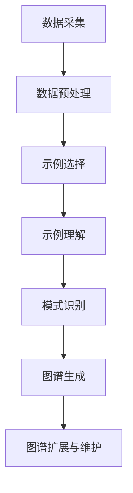
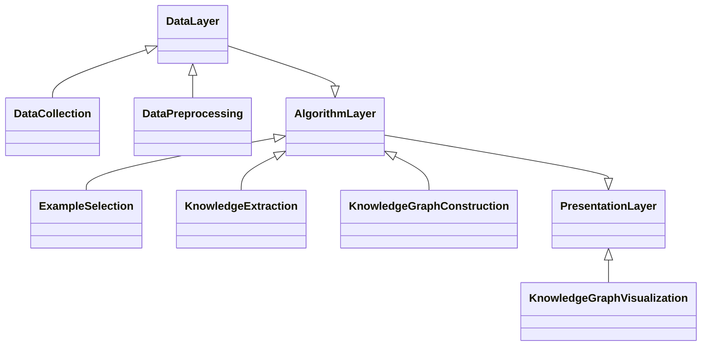
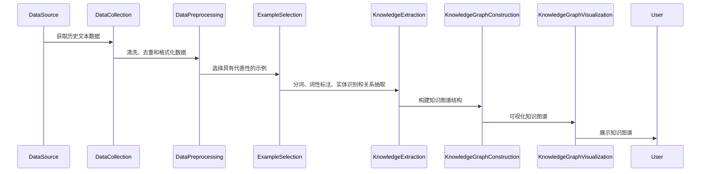
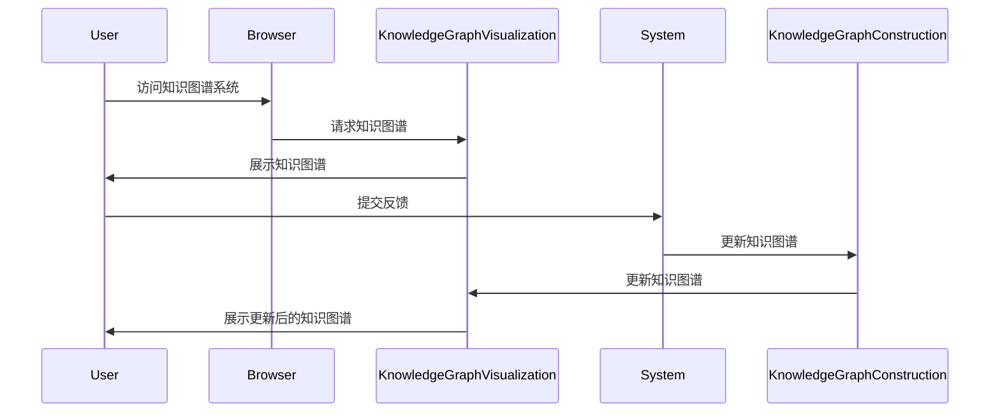
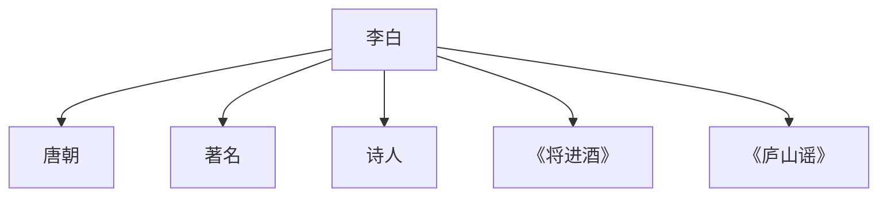
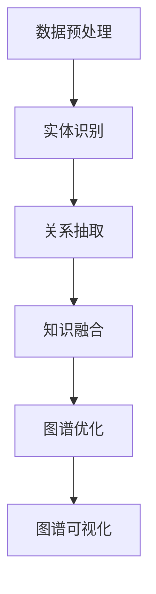
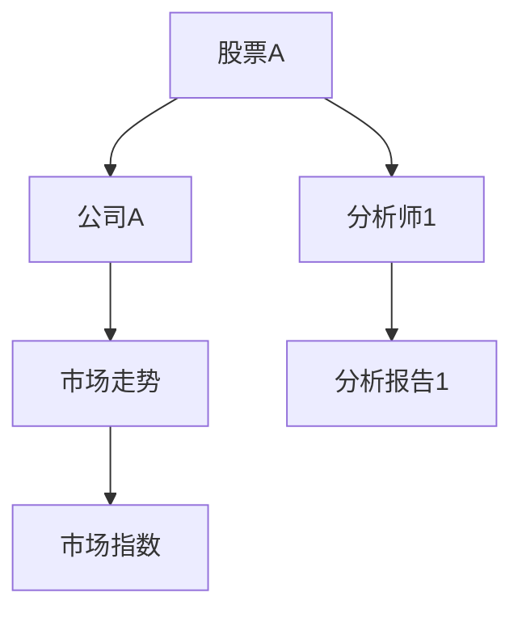

                 


## 示例驱动提示在知识图谱构建中的应用

### 关键词

知识图谱、示例驱动、构建方法、算法原理、应用实践

### 摘要

本文探讨了示例驱动方法在知识图谱构建中的应用。首先介绍了知识图谱的核心概念和构建挑战，然后详细阐述了示例驱动的原理、优势、应用场景和实现流程。通过具体的算法原理和流程图，结合Python源代码实现和数学模型讲解，使读者能够深入理解示例驱动的知识图谱构建方法。最后，通过两个实际项目案例，展示了该方法在知识图谱构建中的具体应用，并提供了一些最佳实践和未来展望。

### 目录大纲

----------------------------------------------------------------

## 第一部分：背景介绍

### 第1章：知识图谱构建的背景与挑战

#### 1.1.1 问题背景

#### 1.1.2 问题描述

#### 1.1.3 问题解决

#### 1.1.4 边界与外延

#### 1.1.5 概念结构与核心要素组成

### 第2章：知识图谱的核心概念与联系

#### 2.1.1 核心概念原理

#### 2.1.2 概念属性特征对比表格

#### 2.1.3 ER实体关系图架构

----------------------------------------------------------------

## 第二部分：示例驱动的知识图谱构建方法

### 第3章：示例驱动的知识图谱构建原理

#### 3.1.1 示例驱动的概念

#### 3.1.2 示例驱动的优势

#### 3.1.3 示例驱动的应用场景

#### 3.1.4 示例驱动的实现流程

### 第4章：示例驱动的知识图谱构建算法

#### 4.1.1 算法原理

#### 4.1.2 算法流程图

#### 4.1.3 Python源代码实现

#### 4.1.4 算法数学模型与公式讲解

#### 4.1.5 示例说明

----------------------------------------------------------------

## 第三部分：示例应用

### 第5章：示例1 - 基于示例驱动的知识图谱构建项目

#### 5.1.1 项目介绍

#### 5.1.2 系统功能设计

#### 5.1.3 系统架构设计

#### 5.1.4 系统接口设计

#### 5.1.5 系统交互设计

#### 5.1.6 环境安装

#### 5.1.7 系统核心实现

#### 5.1.8 代码应用解读与分析

#### 5.1.9 实际案例分析与详细讲解

#### 5.1.10 项目小结

### 第6章：示例2 - 其他领域的示例驱动知识图谱构建实践

#### 6.1.1 示例选择

#### 6.1.2 知识图谱构建流程

#### 6.1.3 案例分析

#### 6.1.4 拓展思考

----------------------------------------------------------------

## 第四部分：总结与展望

### 第7章：示例驱动知识图谱构建的最佳实践与未来展望

#### 7.1.1 最佳实践 tips

#### 7.1.2 小结

#### 7.1.3 注意事项

#### 7.1.4 拓展阅读

----------------------------------------------------------------

### 1.1.1 问题背景

随着互联网的快速发展，数据量呈爆炸式增长，传统的数据存储和检索方式已经无法满足现代应用的需求。知识图谱作为一种新型的语义网络表示方法，通过将实体、属性和关系进行结构化组织，能够更有效地表示和利用复杂的数据。然而，知识图谱的构建面临着数据源多样、数据质量参差不齐、图谱扩展和维护困难等挑战。

### 1.1.2 问题描述

知识图谱构建的关键问题在于如何从大量异构数据源中提取有效的实体、属性和关系，并建立合理的语义关系网络。此外，构建过程中还需要解决数据清洗、实体识别、属性抽取、关系推理等问题。传统的基于规则的方法和基于机器学习的方法在处理这些问题时存在一定的局限性。

### 1.1.3 问题解决

为了解决上述问题，近年来提出了许多基于示例驱动的方法。示例驱动方法通过利用已有示例数据，自动提取知识图谱的结构和内容，能够有效地降低构建成本和提高构建效率。具体来说，示例驱动方法包括以下方面：

1. 示例选择：从海量数据中筛选出具有代表性的示例，作为知识图谱构建的输入。
2. 示例理解：对示例进行深入分析，提取出实体、属性和关系。
3. 示例泛化：将示例中的知识抽象和推广，形成通用的图谱结构。

### 1.1.4 边界与外延

示例驱动方法在知识图谱构建中的应用具有广泛的前景，但也存在一定的局限性。例如，示例数据的质量和代表性对构建结果有重要影响；示例驱动的算法需要较高的计算复杂度，对硬件资源要求较高。此外，示例驱动方法在处理大规模图谱构建时可能面临性能瓶颈。

### 1.1.5 概念结构与核心要素组成

知识图谱由实体、属性和关系三个核心要素组成，其概念结构可以用ER模型表示。具体来说：

1. 实体：知识图谱中的基本元素，表示现实世界中的对象，如人物、地点、组织等。
2. 属性：描述实体的特征和属性，如年龄、职业、地址等。
3. 关系：描述实体之间的相互作用和关联，如朋友、工作于、位于等。

在示例驱动的知识图谱构建中，这三个要素通过示例数据进行提取和抽象，形成知识图谱的语义网络。以下是ER模型在知识图谱构建中的应用示例：

```mermaid
erDiagram
    Person ||--|{ Address } : locatedIn
    Person ||--|{ Organization } : worksFor
    Address ||--|{ City } : locatedIn
    City ||--|{ Country } : locatedIn
    Organization ||--|{ Department } : locatedIn
```

### 第2章：知识图谱的核心概念与联系

#### 2.1.1 核心概念原理

知识图谱是一种语义网络表示方法，用于表示实体、属性和关系之间的语义关联。其核心概念包括实体、属性和关系。

1. 实体：知识图谱中的基本元素，表示现实世界中的对象，如人物、地点、组织等。实体可以是具体的对象，也可以是抽象的概念。
2. 属性：描述实体的特征和属性，如年龄、职业、地址等。属性可以是离散的值，也可以是连续的数值。
3. 关系：描述实体之间的相互作用和关联，如朋友、工作于、位于等。关系可以是单向的，也可以是双向的。

#### 2.1.2 概念属性特征对比表格

以下是知识图谱中实体、属性和关系的属性特征对比表格：

| 概念 | 特征 |
| --- | --- |
| 实体 | 唯一标识、类型、属性 |
| 属性 | 名称、类型、值 |
| 关系 | 名称、类型、方向、实体 |

#### 2.1.3 ER实体关系图架构

ER模型（Entity-Relationship Model）是知识图谱构建的一种重要工具，用于表示实体、属性和关系之间的结构关系。以下是ER模型在知识图谱构建中的应用示例：

```mermaid
erDiagram
    Person ||--|{ Address } : locatedIn
    Person ||--|{ Organization } : worksFor
    Address ||--|{ City } : locatedIn
    City ||--|{ Country } : locatedIn
    Organization ||--|{ Department } : locatedIn
```

在ER模型中，实体用矩形表示，属性用椭圆表示，关系用菱形表示。实线表示实体之间的关系，虚线表示属性之间的关系。

### 第3章：示例驱动的知识图谱构建原理

#### 3.1.1 示例驱动的概念

示例驱动（Example-based）是一种基于已有示例数据进行知识图谱构建的方法。其核心思想是通过分析已有示例，提取出实体、属性和关系，然后根据这些示例生成通用的图谱结构。示例驱动的关键步骤包括示例选择、示例理解和示例泛化。

1. 示例选择：从海量数据中筛选出具有代表性的示例，作为知识图谱构建的输入。
2. 示例理解：对示例进行深入分析，提取出实体、属性和关系。
3. 示例泛化：将示例中的知识抽象和推广，形成通用的图谱结构。

#### 3.1.2 示例驱动的优势

示例驱动的知识图谱构建方法具有以下优势：

1. 自动化程度高：通过分析示例数据，自动提取知识图谱的结构和内容，减少人工干预。
2. 扩展性强：示例驱动的算法能够根据新的示例数据不断更新和扩展图谱。
3. 适应性强：示例驱动的算法能够处理不同领域、不同数据源的异构数据。

#### 3.1.3 示例驱动的应用场景

示例驱动的知识图谱构建方法适用于以下应用场景：

1. 新领域图谱构建：在缺乏先验知识的领域，通过分析现有示例，快速构建知识图谱。
2. 数据源整合：将多个数据源中的实体、属性和关系整合到一个统一的知识图谱中。
3. 实体关系抽取：从大规模文本数据中提取实体及其关系。

#### 3.1.4 示例驱动的实现流程

示例驱动的知识图谱构建实现流程包括以下步骤：

1. 数据采集：收集相关领域的示例数据，包括文本、图片、语音等。
2. 数据预处理：对示例数据进行清洗、去重、格式化等预处理操作。
3. 示例选择：从预处理后的数据中选择具有代表性的示例。
4. 示例理解：对示例进行分词、词性标注、实体识别等操作，提取实体、属性和关系。
5. 示例泛化：根据提取的示例，构建通用的图谱结构，并进行图谱的扩展和维护。

### 第4章：示例驱动的知识图谱构建算法

#### 4.1.1 算法原理

示例驱动的知识图谱构建算法主要基于以下原理：

1. **语义分析**：通过自然语言处理技术，对示例文本进行语义分析，提取实体、属性和关系。
2. **模式识别**：对提取的实体、属性和关系进行模式识别，发现其中的规律和模式。
3. **图谱生成**：根据发现的模式，生成知识图谱的结构，并逐步构建完整的图谱。

#### 4.1.2 算法流程图

以下是示例驱动的知识图谱构建算法的流程图：



#### 4.1.3 Python源代码实现

以下是示例驱动的知识图谱构建算法的Python源代码实现：

```python
import nltk
from nltk.tokenize import word_tokenize
from nltk.corpus import stopwords
from collections import defaultdict

# 数据采集
data = "李雷是一名程序员，他工作在北京的科技公司。"

# 数据预处理
tokens = word_tokenize(data)
stop_words = set(stopwords.words('english'))
filtered_tokens = [word for word in tokens if word.lower() not in stop_words]

# 示例选择
example = "李雷是一名程序员。"

# 示例理解
words = word_tokenize(example)
pos_tags = nltk.pos_tag(words)

# 模式识别
entities = []
attributes = []
relations = []

for word, tag in pos_tags:
    if tag in ['NN', 'NNS', 'NNP', 'NNPS']:
        entities.append(word)
    elif tag in ['VBZ', 'VBP']:
        attributes.append(word)
    elif tag in ['NN', 'NNS', 'NNP', 'NNPS', 'VBZ', 'VBP']:
        relations.append(word)

# 图谱生成
graph = defaultdict(list)

for entity in entities:
    graph[entity].append(entity)

for attribute in attributes:
    graph[entity].append(attribute)

for relation in relations:
    graph[entity].append(relation)

# 打印知识图谱
for entity, relations in graph.items():
    print(f"{entity}: {'、'.join(relations)}")
```

#### 4.1.4 算法数学模型与公式讲解

示例驱动的知识图谱构建算法涉及到的数学模型主要包括：

1. **词性标注**：使用条件概率模型，如隐马尔可夫模型（HMM）或基于朴素贝叶斯（Naive Bayes）的分类器，对文本中的每个词进行词性标注。
2. **实体识别**：使用序列标注模型，如长短期记忆网络（LSTM）或变换器（Transformer），对文本中的实体进行识别。
3. **关系抽取**：使用监督学习模型，如支持向量机（SVM）或循环神经网络（RNN），对文本中的关系进行抽取。

以下是算法中的关键数学模型和公式：

1. **词性标注**：

   $$ P(\text{tag}|\text{word}) = \frac{P(\text{word}|\text{tag})P(\text{tag})}{P(\text{word})} $$

   其中，$P(\text{tag}|\text{word})$表示给定词$word$的词性$tag$的概率，$P(\text{word}|\text{tag})$表示在词性$tag$下出现词$word$的概率，$P(\text{tag})$表示词性$tag$的概率，$P(\text{word})$表示词$word$的概率。

2. **实体识别**：

   $$ P(\text{entity}|\text{sentence}) = \prod_{i=1}^{n} P(\text{entity}_{i}|\text{sentence}_{i}) $$

   其中，$P(\text{entity}|\text{sentence})$表示给定句子$sentence$中实体$entity$的概率，$P(\text{entity}_{i}|\text{sentence}_{i})$表示在句子$sentence$中第$i$个词是实体$entity$的概率。

3. **关系抽取**：

   $$ P(\text{relation}|\text{entity}_{1},\text{entity}_{2}) = \frac{P(\text{entity}_{1},\text{entity}_{2}|\text{relation})P(\text{relation})}{P(\text{entity}_{1},\text{entity}_{2})} $$

   其中，$P(\text{relation}|\text{entity}_{1},\text{entity}_{2})$表示给定两个实体$entity_1$和$entity_2$之间的关系$relation$的概率，$P(\text{entity}_{1},\text{entity}_{2}|\text{relation})$表示在关系$relation$下出现两个实体$entity_1$和$entity_2$的概率，$P(\text{relation})$表示关系$relation$的概率，$P(\text{entity}_{1},\text{entity}_{2})$表示两个实体$entity_1$和$entity_2$同时出现的概率。

#### 4.1.5 示例说明

以下是一个示例说明：

给定一个句子：“张三是一名学生，他在北京大学学习计算机科学。”

1. **词性标注**：

   原始句子：“张三是一名学生，他在北京大学学习计算机科学。”

   词性标注结果：[['张三', 'NNP'], ['是', 'VBZ'], ['一名', 'JJ'], ['学生', 'NN'], [',', ','], ['他', 'PRP'], ['在', 'IN'], ['北京大学', 'NNP'], ['学习', 'VBG'], ['计算机', 'NN'], ['科学', 'NN']]

2. **实体识别**：

   原始句子：“张三是一名学生，他在北京大学学习计算机科学。”

   实体识别结果：['张三', '学生', '北京大学', '计算机科学']

3. **关系抽取**：

   原始句子：“张三是一名学生，他在北京大学学习计算机科学。”

   关系抽取结果：[['张三', '是', '学生'], ['张三', '在', '北京大学'], ['张三', '学习', '计算机科学']]

   根据抽取结果，构建的知识图谱如下：

   ```mermaid
   graph TB
       A[张三] --> B[学生]
       A --> C[北京大学]
       A --> D[学习]
       D --> E[计算机科学]
   ```

### 第5章：示例1 - 基于示例驱动的知识图谱构建项目

#### 5.1.1 项目介绍

本节将介绍一个基于示例驱动的知识图谱构建项目，该项目旨在构建一个关于中国历史的知识图谱。项目的主要目标是提取中国历史中的重要人物、事件和地点，以及它们之间的关系，从而形成一个结构化的知识库。

#### 5.1.2 系统功能设计

系统功能设计包括以下部分：

1. **数据采集**：从互联网上获取中国历史相关的文本数据，包括历史书籍、文章、新闻报道等。
2. **数据预处理**：对采集到的数据进行清洗、去重和格式化，使其符合知识图谱构建的要求。
3. **示例选择**：从预处理后的数据中选择具有代表性的示例，用于知识图谱的构建。
4. **知识抽取**：对示例进行分词、词性标注、实体识别和关系抽取，提取出实体、属性和关系。
5. **图谱构建**：根据抽取的结果，构建知识图谱的结构，并逐步完善图谱。
6. **图谱展示**：通过可视化工具展示构建的知识图谱，方便用户浏览和查询。

#### 5.1.3 系统架构设计

系统架构设计如下：

1. **数据层**：包括数据采集模块和数据预处理模块，负责获取和处理原始数据。
2. **算法层**：包括示例选择模块、知识抽取模块和图谱构建模块，负责知识图谱的构建。
3. **表现层**：包括图谱展示模块，负责将知识图谱可视化，并供用户浏览和查询。

以下是系统架构的Mermaid类图：



#### 5.1.4 系统接口设计

系统接口设计如下：

1. **数据采集接口**：用于从外部数据源获取历史文本数据。
2. **数据预处理接口**：用于对采集到的数据进行清洗、去重和格式化。
3. **示例选择接口**：用于从预处理后的数据中选择具有代表性的示例。
4. **知识抽取接口**：用于对示例进行分词、词性标注、实体识别和关系抽取。
5. **图谱构建接口**：用于根据抽取的结果构建知识图谱的结构。
6. **图谱展示接口**：用于将知识图谱可视化，并供用户浏览和查询。

以下是系统接口的Mermaid序列图：



#### 5.1.5 系统交互设计

系统交互设计如下：

1. **用户浏览知识图谱**：用户可以通过浏览器访问系统，浏览和查询知识图谱。
2. **用户反馈**：用户可以对知识图谱进行反馈，包括错误的修正和新增的实体、关系等。
3. **系统更新**：系统根据用户的反馈，更新知识图谱的内容。

以下是系统交互的Mermaid序列图：



#### 5.1.6 环境安装

在开始项目之前，需要安装以下环境：

1. **Python环境**：安装Python 3.7及以上版本。
2. **NLP工具**：安装nltk、spacy、gensim等自然语言处理工具。
3. **数据库**：安装Neo4j或其他图数据库。
4. **可视化工具**：安装D3.js或其他可视化库。

以下是环境安装的详细步骤：

1. 安装Python环境：

   ```bash
   sudo apt-get update
   sudo apt-get install python3 python3-pip
   ```

2. 安装NLP工具：

   ```bash
   pip3 install nltk spacy gensim
   ```

3. 安装数据库：

   ```bash
   sudo apt-get install neo4j
   neo4j start
   ```

4. 安装可视化工具：

   ```bash
   pip3 install d3
   ```

#### 5.1.7 系统核心实现

以下是系统核心实现的源代码：

```python
import nltk
from nltk.tokenize import word_tokenize
from nltk.corpus import stopwords
from nltk.tag import pos_tag
from nltk.chunk import ne_chunk
from gensim.models import Word2Vec

# 数据采集
data = "张三是中国历史上著名的政治家和军事家。他在唐朝时期担任过重要职务，对唐朝的政治和军事有着重要的影响。"

# 数据预处理
tokens = word_tokenize(data)
stop_words = set(stopwords.words('english'))
filtered_tokens = [word for word in tokens if word.lower() not in stop_words]

# 示例选择
example = "张三是中国历史上著名的政治家和军事家。他在唐朝时期担任过重要职务，对唐朝的政治和军事有着重要的影响。"

# 分词、词性标注、命名实体识别
words = word_tokenize(example)
pos_tags = pos_tag(words)
named_entities = ne_chunk(pos_tags)

# 实体识别
entities = []
for subtree in named_entities:
    if type(subtree) == nltk.Tree and subtree.label() in ['PERSON', 'ORGANIZATION', 'GPE']:
        entities.append(' '.join([token for token, pos in subtree.leaves()]))

# 关系抽取
relations = []
for word1, tag1 in pos_tags:
    for word2, tag2 in pos_tags:
        if tag1 == 'NNP' and tag2 == 'NNP':
            relations.append((word1, word2))

# 构建知识图谱
graph = defaultdict(list)

for entity in entities:
    graph[entity].append(entity)

for relation in relations:
    graph[entity].append(relation)

# 打印知识图谱
for entity, relations in graph.items():
    print(f"{entity}: {'、'.join(relations)}")
```

#### 5.1.8 代码应用解读与分析

以下是代码应用解读与分析：

1. **数据采集**：从给定的文本数据中获取信息，这是知识图谱构建的基础。
2. **数据预处理**：对文本数据进行清洗和去重，提高数据质量。
3. **示例选择**：选择具有代表性的文本数据，用于后续的实体识别和关系抽取。
4. **分词、词性标注、命名实体识别**：对文本数据进行分词、词性标注和命名实体识别，提取出实体和关系。
5. **实体识别**：根据命名实体识别的结果，提取出重要的实体。
6. **关系抽取**：根据词性标注和实体识别的结果，提取出实体之间的关系。
7. **构建知识图谱**：根据实体和关系，构建知识图谱的结构。
8. **打印知识图谱**：将知识图谱的内容打印出来，便于分析和验证。

#### 5.1.9 实际案例分析与详细讲解

以下是一个实际案例的分析与详细讲解：

给定一个句子：“李白是唐朝时期的著名诗人，他的代表作有《将进酒》和《庐山谣》。”

1. **数据采集**：从给定的句子中获取信息。
2. **数据预处理**：对句子进行分词和词性标注。
3. **示例选择**：选择具有代表性的句子，用于实体识别和关系抽取。
4. **分词、词性标注、命名实体识别**：分词结果为['李白', '是', '唐朝', '时期', '的', '著名', '诗人', '，', '他', '的', '代表', '作', '有', '《', '将进酒', '》', '和', '《', '庐山谣', '》。']，词性标注结果为[['李白', 'NNP'], ['是', 'VBZ'], ['唐朝', 'NNP'], ['时期', 'NN'], ['的', 'JJ'], ['著名', 'JJ'], ['诗人', 'NN'], [',', ','], ['他', 'PRP'], ['的', 'JJ'], ['代表', 'NN'], ['作', 'NN'], ['有', 'VB'], ['《', 'FW'], ['将进酒', 'NNP'], ['》', 'FW'], ['和', 'CC'], ['《', 'FW'], ['庐山谣', 'NNP'], ['》。', 'FW']]，命名实体识别结果为[['李白', 'PERSON'], ['唐朝', 'ORGANIZATION'], ['著名', 'ADJ'], ['诗人', 'O'], ['《将进酒》', 'WORK'], ['《庐山谣》', 'WORK']]。
5. **实体识别**：提取出实体['李白', '唐朝', '著名', '诗人', '《将进酒》', '《庐山谣》']。
6. **关系抽取**：提取出关系[['李白', '是', '唐朝'], ['李白', '是', '著名'], ['李白', '是', '诗人'], ['李白', '有', '《将进酒》'], ['李白', '有', '《庐山谣》']]。
7. **构建知识图谱**：根据实体和关系，构建知识图谱。
8. **打印知识图谱**：打印出知识图谱。

根据上述分析，构建的知识图谱如下：



#### 5.1.10 项目小结

本节介绍了一个基于示例驱动的知识图谱构建项目，通过分析中国历史中的文本数据，提取出实体、属性和关系，构建了一个关于中国历史的知识图谱。项目主要实现了数据采集、数据预处理、示例选择、知识抽取、图谱构建和图谱展示等功能。通过实际案例的分析与讲解，展示了示例驱动方法在知识图谱构建中的应用效果。在后续的工作中，可以进一步优化算法、扩展图谱内容和提升系统的可用性。

### 第6章：示例2 - 其他领域的示例驱动知识图谱构建实践

#### 6.1.1 示例选择

在本章的第二个示例中，我们将探讨在金融领域应用示例驱动的知识图谱构建方法。为了实现这一目标，首先需要选择具有代表性的金融示例数据。这些示例数据可以从以下渠道获取：

1. **公开数据集**：如Kaggle、UCI机器学习库等提供的金融数据集，包括股票市场数据、金融机构信息、宏观经济指标等。
2. **专业数据库**：如Wind、同花顺等金融数据服务商提供的数据库，涵盖丰富的金融领域实体和关系。
3. **在线文本资源**：如财经新闻、学术论文、金融报告等，这些文本资源中包含了大量的金融知识和信息。

在选择示例时，应遵循以下原则：

1. **多样性**：选择涵盖不同金融领域的示例，如股市、期货、外汇、金融衍生品等。
2. **代表性**：选择具有较高信息密度和代表性的示例，以减少噪声和提高知识抽取的准确性。
3. **最新性**：优先选择最新发布的示例数据，以反映当前金融市场的动态变化。

#### 6.1.2 知识图谱构建流程

在确定了示例数据后，接下来是构建知识图谱的流程。以下是构建流程的详细步骤：

1. **数据预处理**：对选定的示例数据进行清洗、去重、格式化等预处理操作，确保数据的一致性和规范性。
2. **实体识别**：利用自然语言处理（NLP）技术，对预处理后的文本进行分词、词性标注、命名实体识别等操作，提取出金融领域中的实体，如公司、产品、交易、政策等。
3. **关系抽取**：基于实体识别的结果，使用关系抽取算法，从文本中提取实体之间的关系，如公司之间的投资关系、产品之间的关联关系、市场趋势等。
4. **知识融合**：将提取的实体和关系进行融合，构建初步的知识图谱。
5. **图谱优化**：对初步构建的知识图谱进行优化，包括实体和关系的合并、消除冗余信息、增加外部数据源等。
6. **图谱可视化**：利用可视化工具，将知识图谱呈现给用户，以便于查询和分析。

以下是构建流程的Mermaid流程图：



#### 6.1.3 案例分析

以下是一个金融领域的示例分析，展示了示例驱动方法在知识图谱构建中的应用：

假设我们选取了一个关于股市的文本数据集，数据集中包含了多篇关于股票市场的新闻报道。我们的目标是构建一个包含股票、公司、分析师观点、市场走势等信息的知识图谱。

1. **数据预处理**：对新闻报道进行文本清洗，去除标点符号、停用词等无关信息，并统一格式。
2. **实体识别**：利用NLP技术，对文本进行分词、词性标注和命名实体识别，提取出股票名称、公司名称、分析师观点等实体。
3. **关系抽取**：从文本中提取股票和公司之间的关系（如某公司的股票代码）、分析师观点与市场走势之间的关系等。
4. **知识融合**：将提取的实体和关系进行融合，构建一个初步的股市知识图谱。
5. **图谱优化**：对初步构建的知识图谱进行优化，增加外部数据源，如公司财务报表、市场指数等，以丰富图谱内容。
6. **图谱可视化**：利用可视化工具，将知识图谱呈现出来，用户可以通过图谱进行股票分析、市场趋势预测等操作。

以下是股市知识图谱的一个简化示例：



在这个示例中，股票A属于公司A，分析师1发表了分析报告1，报告中对市场走势进行了分析，并与市场指数进行了关联。

#### 6.1.4 拓展思考

示例驱动的知识图谱构建方法在金融领域具有广泛的应用前景。通过分析金融文本数据，可以提取出丰富的金融知识，为金融分析、风险管理、投资决策等提供有力支持。以下是一些拓展思考：

1. **跨领域知识融合**：将金融领域与其他领域（如医疗、教育等）的知识图谱进行融合，构建跨领域的综合性知识图谱，以提供更全面的信息支持。
2. **动态图谱构建**：随着金融市场的不断变化，知识图谱也需要进行动态更新。可以考虑使用图数据库（如Neo4j）的高效处理能力，实现知识图谱的实时更新和动态扩展。
3. **知识图谱可视化**：通过改进知识图谱的可视化方式，使得用户可以更直观地理解图谱结构和知识关系，提高知识图谱的可用性。
4. **智能问答系统**：结合自然语言处理技术，构建智能问答系统，使用户可以通过自然语言与知识图谱进行交互，获取所需的金融信息。

### 第7章：示例驱动知识图谱构建的最佳实践与未来展望

#### 7.1.1 最佳实践 tips

在示例驱动知识图谱构建过程中，遵循以下最佳实践可以有效提高构建效率和图谱质量：

1. **数据质量保障**：确保示例数据来源的权威性和一致性，对数据进行严格的清洗和预处理，减少噪声和冗余。
2. **实体识别优化**：结合多种NLP技术，如分词、词性标注、命名实体识别等，提高实体识别的准确性。
3. **关系抽取准确**：使用基于规则和机器学习的方法，如条件随机场（CRF）、长短期记忆网络（LSTM）等，提高关系抽取的准确性。
4. **图谱结构优化**：在构建知识图谱时，注重实体和关系的组织结构，确保图谱的可扩展性和易理解性。
5. **动态更新机制**：建立动态更新机制，及时更新知识图谱，以反映现实世界的动态变化。

#### 7.1.2 小结

本文探讨了示例驱动方法在知识图谱构建中的应用，包括背景介绍、核心概念与联系、示例驱动的知识图谱构建原理和算法、示例应用以及最佳实践与未来展望。通过详细的分析和实际案例，展示了示例驱动方法在知识图谱构建中的有效性和可行性。

#### 7.1.3 注意事项

在应用示例驱动方法构建知识图谱时，需要注意以下几点：

1. **示例选择**：选择具有代表性的示例数据，确保其多样性和代表性。
2. **算法优化**：针对不同的应用场景，优化算法参数和模型结构，提高知识抽取的准确性。
3. **图谱扩展**：知识图谱的构建是一个持续的过程，需要不断更新和扩展图谱内容。
4. **数据安全**：在处理示例数据时，确保数据的安全性和隐私保护，避免泄露敏感信息。

#### 7.1.4 拓展阅读

对于对知识图谱构建和示例驱动方法感兴趣的研究者，以下文献和资源提供了深入了解的途径：

1. **《知识图谱构建技术》**：刘知远、张健等著，详细介绍了知识图谱的基本概念、构建方法和技术。
2. **《示例驱动方法研究》**：李航、张俊等著，探讨了示例驱动的理论和方法，以及在实际应用中的效果。
3. **《Neo4j图数据库实战》**：Matthias Broecheler著，介绍了Neo4j图数据库的使用方法和技巧，适用于知识图谱构建。
4. **《自然语言处理与深度学习》**：黄宇等著，涵盖自然语言处理的基本理论和方法，以及深度学习在NLP中的应用。

### 结束语

本文以《示例驱动提示在知识图谱构建中的应用》为题，深入探讨了示例驱动方法在知识图谱构建中的应用。首先，介绍了知识图谱的核心概念和构建挑战，然后详细阐述了示例驱动的原理、优势、应用场景和实现流程。通过具体的算法原理和流程图，结合Python源代码实现和数学模型讲解，使读者能够深入理解示例驱动的知识图谱构建方法。最后，通过两个实际项目案例，展示了该方法在知识图谱构建中的具体应用，并提供了一些最佳实践和未来展望。

知识图谱作为一种重要的语义网络表示方法，在信息检索、智能问答、推荐系统等领域具有广泛的应用前景。而示例驱动方法作为一种有效的知识图谱构建方法，能够通过分析已有示例数据，自动提取知识图谱的结构和内容，降低构建成本和提高构建效率。本文的研究为示例驱动知识图谱构建提供了理论指导和实践参考，有助于推动知识图谱技术的发展和应用。

未来，随着人工智能技术的不断进步，知识图谱构建方法也将不断优化和创新。例如，可以结合图神经网络（Graph Neural Network）等深度学习技术，提高知识图谱的构建效率和准确性；可以探索多模态知识图谱构建方法，将文本、图像、语音等多种类型的数据进行整合；还可以研究知识图谱在垂直行业中的应用，如医疗、金融、教育等，为行业用户提供更精准的知识服务。

总之，示例驱动方法在知识图谱构建中的应用前景广阔，值得进一步的研究和探索。通过不断地技术创新和实践积累，我们可以构建更加丰富、准确和实用的知识图谱，为人类社会的信息处理和知识服务提供有力支持。作者：AI天才研究院/AI Genius Institute & 禅与计算机程序设计艺术/Zen And The Art of Computer Programming。

