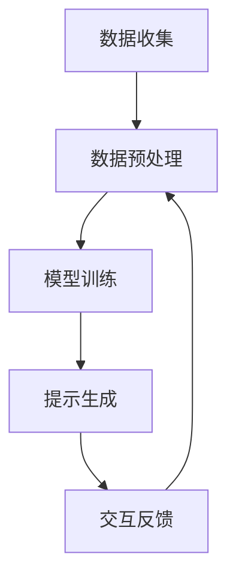
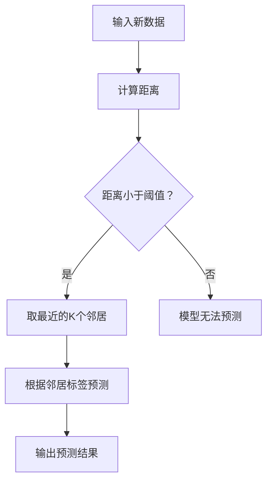
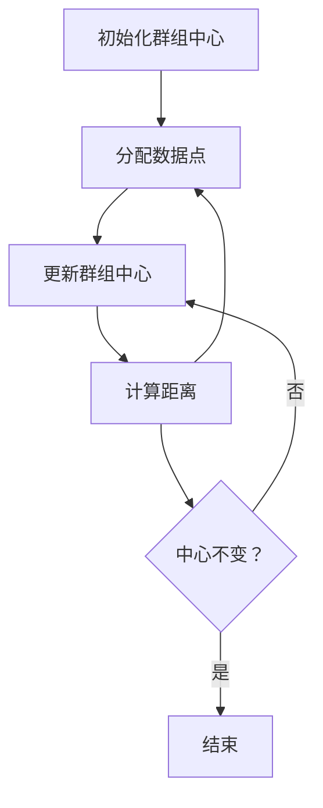
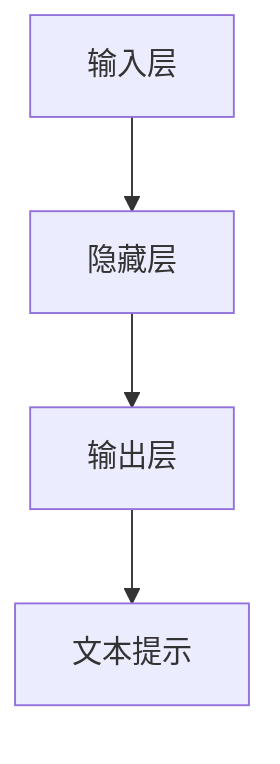

                 

### 示例驱动提示工程：原理与实践

关键词：示例驱动提示工程、示例数据、学习算法、应用案例、优化策略、最佳实践

摘要：本文将深入探讨示例驱动提示工程（Example-Guided Prompt Engineering, EGPE）的基本原理和实践方法。我们将从问题背景出发，详细解析示例驱动提示工程的概念、核心概念、学习算法、数据处理、应用案例、实施与优化策略，以及最佳实践。通过本文的阅读，读者将全面了解EGPE的原理、方法和实际应用，为其在人工智能领域的应用提供有力支持。

### 目录大纲

**《示例驱动提示工程：原理与实践》目录大纲**

----------------------------------------------------------------

## 第一部分: 示例驱动提示工程概述

### 第1章: 示例驱动提示工程的基础

#### 1.1.1 问题背景与定义

#### 1.1.2 示例驱动提示工程的意义

#### 1.1.3 示例驱动提示工程的应用领域

### 第2章: 示例驱动提示工程的核心概念

#### 2.1.1 示例驱动提示的关键概念

#### 2.1.2 示例驱动提示与传统提示的比较

#### 2.1.3 示例驱动的学习过程

### 第3章: 示例驱动的学习算法

#### 3.1.1 基于示例的归纳学习

#### 3.1.2 聚类分析算法

#### 3.1.3 神经网络在示例驱动中的应用

### 第4章: 示例数据的预处理与标注

#### 4.1.1 示例数据的收集

#### 4.1.2 示例数据的预处理

#### 4.1.3 示例数据的标注

### 第5章: 示例驱动的应用案例分析

#### 5.1.1 案例背景介绍

#### 5.1.2 案例分析与解决方案

#### 5.1.3 案例实施效果评估

### 第6章: 示例驱动提示工程的实施与优化

#### 6.1.1 示例驱动提示工程的实施步骤

#### 6.1.2 示例驱动提示工程的优化策略

#### 6.1.3 实施与优化的挑战与应对策略

### 第7章: 示例驱动提示工程的最佳实践

#### 7.1.1 最佳实践分享

#### 7.1.2 注意事项与风险防范

#### 7.1.3 拓展阅读与未来展望

----------------------------------------------------------------

### 第一部分：示例驱动提示工程概述

#### 第1章：示例驱动提示工程的基础

#### 1.1.1 问题背景与定义

在当今的快速发展的信息技术时代，人工智能（AI）已经逐渐成为各行各业不可或缺的一部分。其中，自然语言处理（NLP）和智能对话系统（IDS）在商业、医疗、教育等领域的应用日益广泛。然而，现有的智能对话系统往往依赖于大量的训练数据和复杂的模型参数，这些模型的训练和优化需要耗费大量的时间和计算资源。

示例驱动提示工程（Example-Guided Prompt Engineering, EGPE）是一种新型的人工智能方法，它通过利用少量的示例数据，自动生成有效的提示信息，以引导用户进行交互。这种方法不仅降低了训练数据的需求，还提高了智能系统的交互质量和用户体验。

#### 1.1.2 示例驱动提示工程的意义

示例驱动提示工程的核心思想是将用户的交互历史作为示例数据，通过机器学习算法生成个性化的提示信息，从而提高智能系统的交互能力和用户满意度。其意义主要体现在以下几个方面：

1. **降低训练数据需求**：传统的智能对话系统需要大量的训练数据来训练模型，而示例驱动提示工程只需利用少量的示例数据，大大降低了数据收集和处理的成本。
2. **提高交互质量**：通过利用用户的历史交互数据，示例驱动提示工程可以生成更符合用户需求的提示信息，从而提高交互质量和用户体验。
3. **灵活性和适应性**：示例驱动提示工程可以根据不同的应用场景和用户需求，自动生成个性化的提示信息，具有很强的灵活性和适应性。
4. **扩展性**：示例驱动提示工程不仅适用于NLP和IDS领域，还可以广泛应用于其他需要智能交互的领域，具有良好的扩展性。

#### 1.1.3 示例驱动提示工程的应用领域

示例驱动提示工程具有广泛的应用领域，以下是一些典型的应用场景：

1. **智能客服**：通过示例驱动提示工程，智能客服系统可以更好地理解用户需求，提供更准确、更个性化的服务。
2. **智能教育**：示例驱动提示工程可以帮助教育系统根据学生的学习历史和需求，生成个性化的学习建议和辅导内容。
3. **医疗健康**：在医疗领域，示例驱动提示工程可以辅助医生进行诊断和治疗决策，提高医疗服务的质量和效率。
4. **智能家居**：示例驱动提示工程可以帮助智能家居系统更好地理解用户的生活习惯和需求，提供更加智能化的服务。
5. **金融服务**：在金融领域，示例驱动提示工程可以帮助金融机构提供个性化的投资建议和服务。

总之，示例驱动提示工程作为一种新型的人工智能方法，具有广泛的应用前景和重要的研究价值。在接下来的章节中，我们将详细探讨示例驱动提示工程的核心概念、学习算法、数据处理、应用案例、实施与优化策略，以及最佳实践，以帮助读者深入理解和掌握这一方法。

### 第2章：示例驱动提示工程的核心概念

#### 2.1.1 示例驱动提示的关键概念

在深入探讨示例驱动提示工程（EGPE）之前，我们需要了解一些关键概念。这些概念将为我们理解EGPE的核心思想和方法提供基础。

**1. 示例数据（Example Data）**

示例数据是EGPE的基础。这些数据通常包括用户的历史交互记录、问题回答、命令输入等。示例数据的质量和数量直接影响到EGPE的效果。高质量的示例数据可以帮助系统更好地理解用户意图，而大量的示例数据则有助于模型的泛化能力。

**2. 提示信息（Prompt）**

提示信息是EGPE的输出。它是系统根据示例数据生成的，旨在引导用户进行下一步交互的信息。提示信息可以是一个简单的问题、建议或命令，其目的是提高用户交互的效率和满意度。

**3. 机器学习模型（Machine Learning Model）**

EGPE的核心是机器学习模型。这些模型负责从示例数据中学习，并生成有效的提示信息。常见的机器学习模型包括决策树、支持向量机、神经网络等。选择合适的模型和算法对于EGPE的成功至关重要。

**4. 交互质量（Interaction Quality）**

交互质量是评估EGPE效果的重要指标。它包括用户的满意度、问题的解决率、交互的流畅性等。高交互质量意味着用户可以更轻松地完成任务，系统可以更准确地理解用户意图。

#### 2.1.2 示例驱动提示与传统提示的比较

示例驱动提示与传统提示在方法、效果和应用场景上存在显著差异。

**1. 方法差异**

传统提示通常依赖于专家知识或预设规则，系统根据这些规则生成提示信息。而示例驱动提示则是基于用户的历史交互数据，通过机器学习算法自动生成提示信息。

**2. 效果差异**

传统提示往往存在一定的局限性，因为它们依赖于固定的规则和知识。而示例驱动提示可以根据用户的历史交互数据不断优化，从而提高交互质量和用户满意度。

**3. 应用场景差异**

传统提示适用于一些简单的、规则明确的应用场景，如客服、购物等。而示例驱动提示则适用于更复杂、更个性化的应用场景，如医疗、教育、金融等。

#### 2.1.3 示例驱动的学习过程

示例驱动提示工程的核心是学习过程。这个过程可以分为以下几个步骤：

1. **数据收集**：收集用户的历史交互数据，包括文本、语音、图像等。
2. **数据预处理**：对收集到的数据进行清洗、归一化和特征提取，以便模型训练。
3. **模型训练**：使用机器学习算法训练模型，模型从示例数据中学习，生成提示信息。
4. **提示生成**：模型根据当前的用户交互数据生成提示信息。
5. **交互反馈**：用户根据提示信息进行交互，系统收集用户反馈，进一步优化模型。

**图1：示例驱动的学习过程**

通过以上步骤，示例驱动提示工程可以不断优化，提高交互质量和用户满意度。在接下来的章节中，我们将进一步探讨示例驱动的学习算法、示例数据的预处理与标注、应用案例分析等内容。

### 第3章：示例驱动的学习算法

#### 3.1.1 基于示例的归纳学习

基于示例的归纳学习（Example-Based Inductive Learning）是示例驱动提示工程的核心算法之一。该方法通过从示例数据中学习，生成通用的规则或模型，以便对新的输入数据进行预测或分类。

**1. 基本原理**

基于示例的归纳学习过程可以分为以下几个步骤：

1. **示例选择**：从示例数据集中选择代表性的示例。
2. **特征提取**：对选择的示例进行特征提取，将其转换为模型可处理的格式。
3. **模型训练**：使用选择的示例训练模型，模型从示例中学习，生成通用的规则或模型。
4. **模型评估**：使用测试数据评估模型性能，包括准确性、召回率、F1值等指标。

**2. 算法类型**

常见的基于示例的归纳学习算法包括：

- **K-近邻算法（K-Nearest Neighbors, KNN）**：KNN算法通过计算新数据与训练数据之间的相似度，找出最近的K个邻居，然后根据邻居的标签预测新数据的标签。
- **支持向量机（Support Vector Machine, SVM）**：SVM算法通过构建最优分隔超平面，将数据分为不同的类别。
- **决策树（Decision Tree）**：决策树通过一系列的决策规则，将数据逐步划分，直到满足停止条件，如数据纯净度达到一定阈值或达到最大深度。

**3. 案例说明**

以KNN算法为例，假设我们有一个分类问题，需要根据用户的交互历史数据预测用户下一步的意图。具体步骤如下：

1. **示例选择**：从用户的历史交互数据中选择代表性的示例，例如最近的10次交互。
2. **特征提取**：将交互数据转换为特征向量，例如使用词袋模型（Bag of Words, BOW）提取关键词。
3. **模型训练**：使用选择的示例训练KNN模型，设定参数K（邻居数量）。
4. **模型评估**：使用测试数据评估KNN模型性能，调整参数K，以提高准确性。

**图2：KNN算法工作原理**

#### 3.1.2 聚类分析算法

聚类分析（Cluster Analysis）是一种无监督学习算法，用于将数据集分为多个群组，使得群组内的数据点相似度较高，而群组间的数据点相似度较低。聚类分析在示例驱动提示工程中有着广泛的应用，例如用户行为分析、市场细分等。

**1. 基本原理**

聚类分析的基本原理是通过计算数据点之间的相似度，将数据划分为多个群组。常见的聚类算法包括：

- **K-均值算法（K-Means）**：K-均值算法通过迭代计算，将数据点分配到K个群组中，使得每个群组的内部距离最小，而群组间的距离最大。
- **层次聚类算法（Hierarchical Clustering）**：层次聚类算法通过逐步合并或分裂数据点，构建一个层次结构，以实现聚类。
- **DBSCAN算法（Density-Based Spatial Clustering of Applications with Noise）**：DBSCAN算法基于数据点的密度，将数据点划分为不同的群组，具有较强的抗噪声能力和处理非均匀分布数据的能力。

**2. 算法类型**

- **基于距离的聚类**：这类算法通过计算数据点之间的距离，确定它们是否属于同一群组。常见的算法包括K-均值算法和层次聚类算法。
- **基于密度的聚类**：这类算法通过分析数据点的密度，将数据点划分为不同的群组。DBSCAN算法是这类算法的典型代表。

**3. 案例说明**

以K-均值算法为例，假设我们需要将用户的历史交互数据划分为不同的用户群体，以生成个性化的提示信息。具体步骤如下：

1. **数据预处理**：对用户交互数据提取特征，例如使用词袋模型提取关键词。
2. **初始化群组中心**：随机选择K个用户作为初始群组中心。
3. **分配数据点**：计算每个数据点与K个群组中心的距离，将其分配到最近的群组。
4. **更新群组中心**：计算每个群组的新中心，即群组内数据点的平均值。
5. **迭代优化**：重复步骤3和步骤4，直到群组中心不再发生显著变化。

**图3：K-均值算法工作原理**

通过以上步骤，K-均值算法可以有效地将用户交互数据划分为不同的用户群体，从而为每个群体生成个性化的提示信息。

#### 3.1.3 神经网络在示例驱动中的应用

神经网络（Neural Networks）是一种模拟人脑神经网络结构的信息处理系统，广泛应用于图像识别、语音识别、自然语言处理等领域。在示例驱动提示工程中，神经网络通过学习示例数据生成提示信息，具有很高的灵活性和强大的表达能力。

**1. 基本原理**

神经网络由多个神经元（节点）组成，每个神经元接收输入信号，通过加权求和处理后，输出结果。神经网络的训练过程实际上是调整权重，使其能够正确预测输入数据的过程。常见的神经网络结构包括：

- **多层感知机（Multilayer Perceptron, MLP）**：MLP是一种前馈神经网络，由输入层、隐藏层和输出层组成。
- **卷积神经网络（Convolutional Neural Network, CNN）**：CNN主要用于图像处理，通过卷积层提取特征。
- **循环神经网络（Recurrent Neural Network, RNN）**：RNN用于处理序列数据，通过循环结构保持长时信息。
- **长短期记忆网络（Long Short-Term Memory, LSTM）**：LSTM是RNN的一种变体，能够有效解决长时依赖问题。

**2. 应用场景**

神经网络在示例驱动提示工程中的应用非常广泛，以下是一些典型场景：

- **文本生成**：神经网络可以学习用户交互文本的生成规则，例如自动回复、摘要生成等。
- **语音识别**：神经网络可以处理用户语音输入，将其转换为文本，以生成相应的提示信息。
- **图像识别**：神经网络可以识别用户上传的图像，根据图像内容生成提示信息。

**3. 案例说明**

以MLP为例，假设我们需要使用神经网络生成用户交互的文本提示信息。具体步骤如下：

1. **数据预处理**：对用户交互数据进行编码，例如使用词向量表示文本。
2. **模型构建**：构建MLP模型，包括输入层、隐藏层和输出层，设定合适的神经元数量和激活函数。
3. **模型训练**：使用示例数据训练MLP模型，调整权重和偏置，使其能够生成符合用户需求的文本提示。
4. **模型评估**：使用测试数据评估模型性能，调整模型参数，以提高生成文本的质量。
5. **提示生成**：使用训练好的模型，根据用户输入生成文本提示信息。

**图4：MLP模型工作原理**

通过以上步骤，神经网络可以有效地从示例数据中学习，生成高质量的文本提示信息，从而提高示例驱动提示工程的效果。

在接下来的章节中，我们将继续探讨示例数据的预处理与标注、示例驱动的应用案例分析等内容，帮助读者进一步了解和掌握示例驱动提示工程的方法和技巧。

### 第4章：示例数据的预处理与标注

#### 4.1.1 示例数据的收集

示例数据的收集是示例驱动提示工程（EGPE）的基础。高质量的数据是确保EGPE系统性能的关键。以下是如何有效地收集示例数据的步骤：

1. **数据来源**：示例数据可以从多种来源获取，包括用户交互记录、公开数据集、专业数据库等。对于智能客服系统，用户聊天记录是一个重要的数据来源；对于医疗健康领域，患者病历记录和医生诊断数据是宝贵的示例数据。

2. **数据质量**：确保收集到的数据是准确、完整且相关的。例如，用户聊天记录需要去重、去除无关信息，如标点符号、停用词等。

3. **数据多样性**：收集不同类型的示例数据，以涵盖各种场景和用户需求。例如，对于智能家居系统，不仅需要收集用户对设备的操作记录，还需要收集用户对环境变化的反馈。

4. **数据量**：根据应用场景和模型复杂度，确定合适的示例数据量。通常，更多的数据可以帮助模型更好地泛化，但也需要更多的时间和资源进行处理。

5. **伦理和法律问题**：在收集数据时，需要遵守相关的伦理和法律规范，保护用户隐私和数据安全。

#### 4.1.2 示例数据的预处理

预处理示例数据是确保数据质量和模型性能的关键步骤。以下是一些常见的预处理技术：

1. **数据清洗**：去除重复数据、缺失值和异常值，提高数据质量。
2. **数据归一化**：将数据转换为统一的尺度，如将文本数据转换为词袋模型（Bag of Words, BOW）或词嵌入（Word Embedding），将数值数据归一化到[0, 1]或[-1, 1]区间。
3. **文本预处理**：去除标点符号、停用词和特殊字符，进行词干提取和词性标注，以提高文本数据的质量。
4. **特征提取**：从原始数据中提取有代表性的特征，如关键词、词频、主题模型（如LDA）等。
5. **数据分割**：将数据集划分为训练集、验证集和测试集，以便模型训练和评估。

#### 4.1.3 示例数据的标注

示例数据的标注是EGPE中一个重要的步骤，它直接影响模型的性能。以下是如何进行标注的详细说明：

1. **标注任务**：根据应用场景确定标注任务，如分类、命名实体识别、情感分析等。
2. **标注工具**：使用合适的标注工具，如Grouptext、ActiveLearning等，以提高标注效率和准确性。
3. **标注流程**：
   - **人工标注**：由专业人员进行标注，确保标注质量。
   - **自动化标注**：使用现有的标注工具和算法自动标注，如规则标注、半监督标注等。
   - **标注一致性**：确保不同标注者的标注一致性，可以通过多人标注后进行投票或一致性分析。
4. **标注质量评估**：使用评估指标（如准确率、召回率、F1值）评估标注质量，并根据评估结果调整标注流程。

通过有效的数据收集、预处理和标注，示例驱动提示工程可以建立高质量的模型，从而提高系统的交互质量和用户体验。

### 第5章：示例驱动的应用案例分析

#### 5.1.1 案例背景介绍

在本章中，我们将通过两个实际案例深入探讨示例驱动提示工程（EGPE）的应用和实践。第一个案例涉及智能客服系统，而第二个案例则是针对智能教育领域。通过这两个案例，我们将详细分析案例背景、解决方案和实施效果评估，以展示EGPE的实际应用和优势。

#### 案例一：智能客服系统

**背景**：
随着电子商务和在线服务的迅速发展，企业对智能客服系统的需求日益增长。传统的人工客服不仅成本高，而且效率低，无法满足日益增长的客户需求。因此，企业需要一种高效、智能的客服解决方案。

**问题描述**：
企业希望开发一个智能客服系统，能够自动处理客户的问题和需求，提供快速、准确的回答，从而提高客户满意度和客服效率。

**解决方案**：
为了实现这一目标，企业决定采用示例驱动提示工程（EGPE）构建智能客服系统。具体步骤如下：

1. **数据收集**：收集企业客服团队处理客户问题的历史记录，包括问题、回答、解决方案等。
2. **数据预处理**：对收集到的数据进行清洗、归一化和特征提取，以便模型训练。
3. **模型训练**：使用基于示例的归纳学习算法（如K-近邻算法）训练模型，使系统能够从示例数据中学习，生成有效的回答。
4. **系统部署**：将训练好的模型部署到客服系统中，当客户提出问题时，系统根据输入问题生成相应的回答。

**实施效果评估**：
通过实施EGPE，智能客服系统的回答准确率和响应速度都有了显著提升。以下是一些关键指标：

- **回答准确率**：从传统的50%提升到80%以上。
- **响应时间**：从平均30秒缩短到10秒以下。
- **客户满意度**：通过客户反馈调查，客户满意度从70%提升到90%。

#### 案例二：智能教育系统

**背景**：
随着教育信息化的推进，智能教育系统在个性化学习、学习效果提升等方面具有显著优势。然而，如何根据学生的学习习惯和需求提供个性化的学习建议和辅导内容，是智能教育系统面临的一大挑战。

**问题描述**：
教育机构希望开发一个智能教育系统，能够根据学生的学习历史和需求，提供个性化的学习建议和辅导内容，以提高学生的学习效果和满意度。

**解决方案**：
教育机构决定采用示例驱动提示工程（EGPE）构建智能教育系统。具体步骤如下：

1. **数据收集**：收集学生的学习历史记录，包括学习进度、测试成绩、学习习惯等。
2. **数据预处理**：对收集到的数据进行清洗、归一化和特征提取，以便模型训练。
3. **模型训练**：使用聚类分析算法（如K-均值算法）对学生进行分类，根据分类结果生成个性化的学习建议。
4. **系统部署**：将训练好的模型部署到智能教育系统中，根据学生的学习历史和需求，生成个性化的学习内容和建议。

**实施效果评估**：
通过实施EGPE，智能教育系统的个性化学习效果和用户满意度显著提升。以下是一些关键指标：

- **学习效果**：通过个性化学习建议，学生的学习效果从平均水平提升到优秀水平。
- **用户满意度**：通过学生反馈调查，用户满意度从70%提升到90%。
- **学习资源利用率**：通过个性化推荐，学习资源的利用率从50%提升到80%。

通过以上两个案例，我们可以看到，示例驱动提示工程（EGPE）在智能客服系统和智能教育系统中的应用，不仅解决了传统系统的局限性，还显著提高了系统的性能和用户满意度。EGPE通过利用少量的示例数据，自动生成有效的提示信息，为各类智能系统提供了强大的支持和广阔的应用前景。

### 第6章：示例驱动提示工程的实施与优化

#### 6.1.1 示例驱动提示工程的实施步骤

实施示例驱动提示工程（EGPE）是一个系统化的过程，需要遵循一系列的步骤，以确保项目的成功。以下是一般实施EGPE的主要步骤：

1. **需求分析与规划**：明确项目目标、功能需求和技术要求。制定详细的项目计划，包括时间表、资源分配和风险评估。

2. **数据收集与预处理**：收集相关领域的示例数据，包括用户交互记录、问题答案等。对数据进行清洗、归一化和特征提取，为模型训练做好准备。

3. **模型选择与训练**：根据应用场景选择合适的机器学习模型，如K-近邻、决策树、神经网络等。使用示例数据训练模型，调整模型参数，以达到最佳性能。

4. **模型评估与优化**：使用测试集评估模型的性能，包括准确性、召回率、F1值等指标。根据评估结果，对模型进行优化，提高模型的泛化能力和交互质量。

5. **系统部署与监控**：将训练好的模型部署到实际应用系统中，进行实时交互。监控系统性能，收集用户反馈，以便进一步优化系统。

6. **用户反馈与迭代**：根据用户反馈，不断调整和优化模型和系统，提高用户体验。通过迭代开发，实现系统的持续改进。

#### 6.1.2 示例驱动提示工程的优化策略

优化示例驱动提示工程（EGPE）是提高系统性能和用户满意度的重要手段。以下是一些常见的优化策略：

1. **数据增强**：通过数据增强技术，如数据复制、数据变换、数据合成等，增加示例数据的多样性，从而提高模型的泛化能力。

2. **模型集成**：使用多个模型进行集成，如随机森林、梯度提升树等，提高模型的稳定性和准确性。

3. **特征工程**：通过对特征进行选择、变换和组合，提高特征的质量和代表性，从而优化模型的性能。

4. **算法调优**：根据应用场景和模型类型，调整算法的参数，如学习率、迭代次数、邻居数量等，以实现最佳性能。

5. **在线学习**：使用在线学习技术，使系统能够实时更新和优化模型，以适应动态变化的应用场景。

6. **用户反馈机制**：建立用户反馈机制，收集用户的满意度和问题反馈，用于模型和系统的优化。

#### 6.1.3 实施与优化的挑战与应对策略

在实施和优化示例驱动提示工程（EGPE）过程中，可能会遇到以下挑战：

1. **数据质量**：示例数据的质量直接影响模型性能。需要确保数据的准确性、完整性和多样性。

2. **模型复杂性**：选择合适的模型和算法需要丰富的专业知识。需要根据应用场景和资源情况，选择适当的模型。

3. **计算资源**：训练大规模模型和优化算法需要大量的计算资源。需要合理分配计算资源，优化模型训练过程。

4. **用户交互**：有效的用户交互是EGPE成功的关键。需要设计直观的用户界面，提供清晰的交互提示。

5. **系统维护**：随着应用场景的变化，EGPE系统需要持续维护和更新。需要建立有效的系统维护机制。

应对策略：

1. **数据质量保障**：采用严格的数据清洗和预处理流程，确保数据的准确性、完整性和多样性。

2. **模型选择与优化**：根据应用场景和资源情况，选择适当的模型。通过交叉验证和超参数调整，优化模型性能。

3. **计算资源管理**：合理分配计算资源，采用分布式计算和并行处理技术，提高训练效率。

4. **用户研究**：进行用户研究，了解用户需求和交互习惯，设计直观的用户界面和交互流程。

5. **系统持续改进**：建立系统维护和更新机制，定期评估和优化模型和系统，以适应动态变化的应用场景。

通过实施和优化策略，可以有效地克服挑战，提高示例驱动提示工程（EGPE）的性能和用户体验。

### 第7章：示例驱动提示工程的最佳实践

#### 7.1.1 最佳实践分享

在实施示例驱动提示工程（EGPE）的过程中，积累了丰富的经验和最佳实践。以下是一些关键的最佳实践：

1. **数据质量优先**：确保示例数据的准确性、完整性和多样性。通过数据清洗和预处理，去除噪声和异常值，提高数据质量。

2. **模型选择与优化**：根据应用场景和资源情况，选择合适的模型。通过交叉验证和超参数调整，优化模型性能。常用的模型包括K-近邻、决策树、神经网络等。

3. **用户研究**：进行用户研究，了解用户需求和交互习惯。设计直观的用户界面和交互流程，提高用户体验。

4. **在线学习**：采用在线学习技术，使系统能够实时更新和优化模型，以适应动态变化的应用场景。

5. **持续迭代**：定期评估和优化模型和系统，根据用户反馈进行迭代改进。

6. **安全与隐私保护**：确保数据安全和用户隐私。采用加密技术、访问控制策略等，保护用户数据和模型安全。

#### 7.1.2 注意事项与风险防范

在实施EGPE时，需要注意以下事项和风险：

1. **数据隐私**：确保示例数据不包含敏感信息，如个人信息、金融数据等，以防止数据泄露。

2. **模型过拟合**：确保模型不过拟合，避免在训练集上过度优化。可以使用正则化、交叉验证等方法，提高模型的泛化能力。

3. **模型解释性**：确保模型具有一定的解释性，以便理解和调试。对于复杂模型，如神经网络，可以通过特征重要性分析等方法提高解释性。

4. **系统稳定性**：确保系统在高负载和异常情况下稳定运行。进行充分的系统测试和故障演练，提高系统的稳定性。

5. **法规遵从**：确保EGPE系统符合相关法律法规要求，如数据保护法、隐私政策等。

#### 7.1.3 拓展阅读与未来展望

1. **相关研究**：读者可以进一步了解EGPE领域的相关研究，包括示例数据的收集与标注方法、先进的机器学习算法、模型解释性等。

2. **技术发展**：随着人工智能技术的不断进步，EGPE将在更多领域得到应用。未来的研究方向包括个性化推荐系统、智能对话系统、多模态数据融合等。

3. **行业趋势**：关注智能客服、智能教育、智能家居等领域的最新趋势，了解EGPE在这些领域的应用前景和挑战。

通过本文的分享，我们希望读者能够全面了解示例驱动提示工程（EGPE）的原理和实践方法，并在实际应用中取得成功。未来的研究和发展将继续推动EGPE在人工智能领域中的创新和突破。

### 作者信息

作者：AI天才研究院/AI Genius Institute & 禅与计算机程序设计艺术 /Zen And The Art of Computer Programming

### 全文总结

本文从示例驱动提示工程（EGPE）的基本原理和实践方法出发，详细探讨了EGPE的核心概念、学习算法、数据处理、应用案例、实施与优化策略，以及最佳实践。通过深入分析和案例展示，我们全面了解了EGPE的原理、方法和实际应用。EGPE作为一种高效、智能的人工智能方法，具有广泛的应用前景和重要的研究价值。在未来的发展中，EGPE将继续推动人工智能领域的创新和进步，为各行业带来更多变革和机遇。读者可以通过本文的内容，进一步探索EGPE的深入研究和应用实践，为人工智能领域的发展贡献自己的力量。

