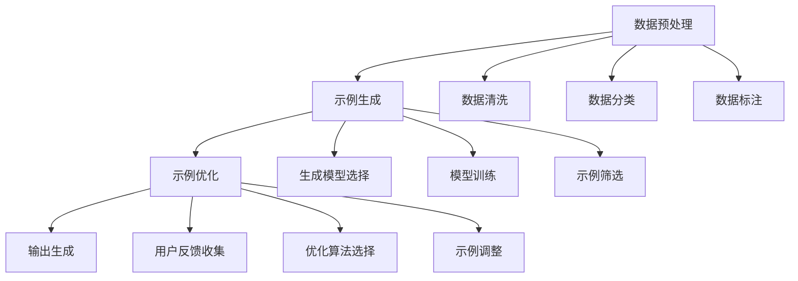
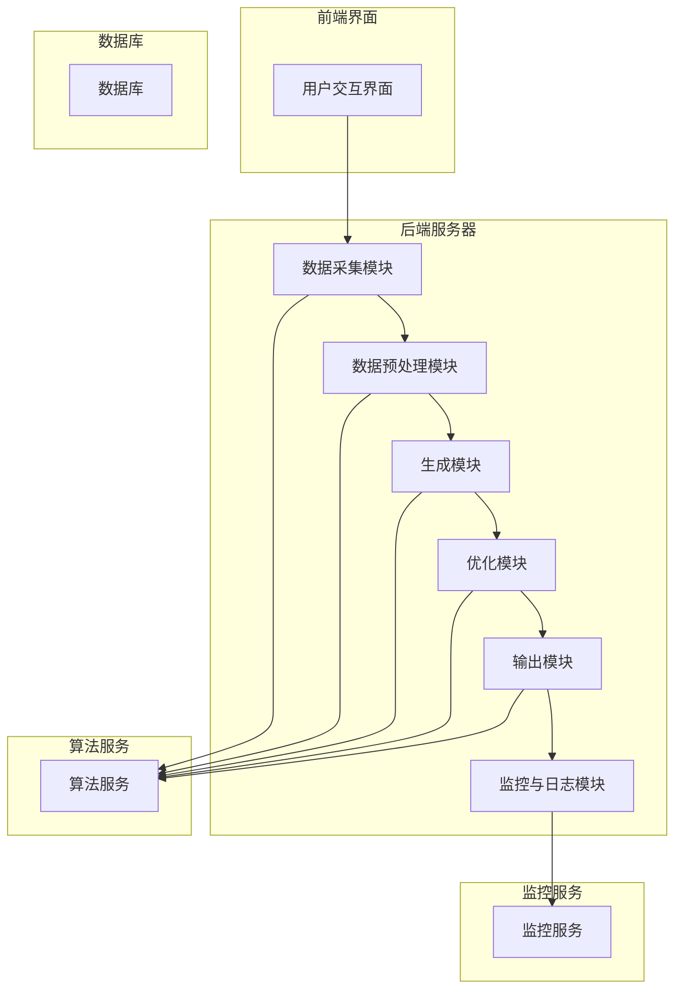
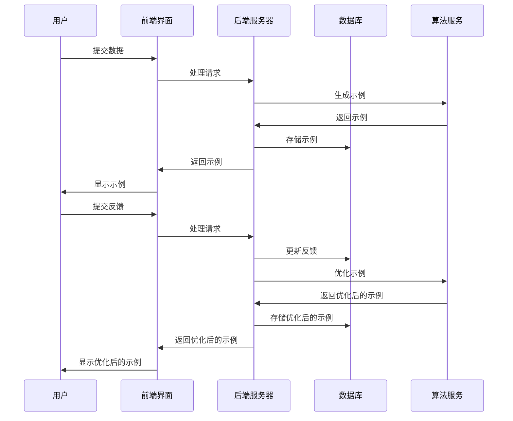

                 

### 目录大纲设计思路

为了设计出《示例驱动提示的自动化生成与优化》这本书的完整目录大纲，我们首先需要明确书的核心内容、目标读者群体以及整体结构。以下是设计目录大纲的具体思路：

1. **背景介绍**：
   - 引入问题背景，解释为何需要自动化生成与优化示例驱动提示。
   - 阐述示例驱动提示的重要性及其应用领域。

2. **核心概念与联系**：
   - 描述相关核心概念，如“示例驱动提示”、“自动化生成”和“优化”。
   - 使用对比表格和Mermaid ER实体关系图来展示这些概念之间的关系。

3. **算法原理讲解**：
   - 分析自动化生成示例驱动提示的算法原理。
   - 利用Mermaid流程图展示算法的基本流程。
   - 使用Python源代码来详细阐述算法原理，包括数学模型和公式。

4. **数学模型和数学公式讲解**：
   - 使用LaTeX格式给出关键数学公式。
   - 进行详细讲解，结合通俗易懂的例子说明公式如何应用。

5. **系统分析与架构设计方案**：
   - 介绍系统功能设计、系统架构设计、系统接口设计和系统交互。
   - 使用Mermaid类图、架构图和序列图来展示系统设计。

6. **项目实战**：
   - 描述项目环境安装、系统核心实现源代码。
   - 分析代码应用解读、实际案例及详细讲解。

7. **最佳实践与拓展**：
   - 提供最佳实践技巧。
   - 进行小结，总结书中关键点。
   - 提出注意事项。
   - 推荐拓展阅读资源。

### 目录大纲设计步骤

**第1步：背景介绍**
- # 第1章：背景介绍
  - 1.1 问题背景
  - 1.2 示例驱动提示的重要性
  - 1.3 自动化生成与优化示例驱动提示的需求

**第2步：核心概念与联系**
- # 第2章：核心概念与联系
  - 2.1 示例驱动提示
  - 2.2 自动化生成
  - 2.3 优化
  - 2.4 对比表格与ER图

**第3步：算法原理讲解**
- # 第3章：算法原理讲解
  - 3.1 示例驱动提示自动化生成算法
  - 3.2 优化算法原理
  - 3.3 Mermaid流程图展示

**第4步：数学模型和数学公式讲解**
- # 第4章：数学模型与公式讲解
  - 4.1 自动化生成数学模型
  - 4.2 优化数学模型
  - 4.3 详细讲解与举例

**第5步：系统分析与架构设计方案**
- # 第5章：系统分析与架构设计方案
  - 5.1 系统功能设计
  - 5.2 系统架构设计
  - 5.3 系统接口设计
  - 5.4 系统交互

**第6步：项目实战**
- # 第6章：项目实战
  - 6.1 环境安装
  - 6.2 系统核心实现
  - 6.3 代码解读与分析
  - 6.4 实际案例分析

**第7步：最佳实践与拓展**
- # 第7章：最佳实践与拓展
  - 7.1 最佳实践技巧
  - 7.2 小结
  - 7.3 注意事项
  - 7.4 拓展阅读

通过以上步骤，我们可以确保目录大纲结构完整、逻辑清晰，并且内容覆盖全面，为读者提供一本系统且实用的计算机技术书籍。接下来，我将根据这些步骤，逐步构建出完整的目录大纲。## 第一部分：背景介绍

### 第1章：问题背景

在现代软件开发中，示例驱动提示（Example-driven Prompting，简称EDP）作为一种增强用户交互和理解的重要工具，正逐渐得到广泛应用。然而，随着软件系统的复杂度不断增加，传统的手动编写和维护示例驱动提示的方式已经难以满足高效、一致和准确的需求。因此，如何自动化生成与优化示例驱动提示成为一个亟待解决的问题。

#### 1.1 问题背景

随着软件应用的广泛普及，用户对软件的易用性和可理解性要求越来越高。示例驱动提示通过提供具体的示例，帮助用户更直观地理解系统功能和使用方法。然而，手动编写示例驱动提示存在以下几个问题：

1. **效率低下**：在大型软件系统中，示例驱动提示的数量庞大，且需要经常更新和维护。手动编写不仅耗时耗力，而且难以保证一致性。
2. **不一致性**：由于缺乏统一的编写标准和规范，不同开发者编写的示例可能风格迥异，导致用户体验不一致。
3. **错误风险**：手动编写示例驱动提示容易引入错误，尤其是在系统更新和功能变更时。

#### 1.2 示例驱动提示的重要性

示例驱动提示在软件开发的多个方面具有重要意义：

1. **用户界面设计**：示例驱动提示能够通过具体的示例帮助用户理解界面的功能，减少用户的学习成本。
2. **帮助文档编写**：示例驱动提示可以作为帮助文档的重要组成部分，为用户提供实践操作的指导。
3. **交互式学习系统**：在教育类软件中，示例驱动提示可以帮助学生通过实际操作掌握知识点。
4. **自动化测试**：在测试过程中，示例驱动提示可以用于验证系统功能的正确性和稳定性。

#### 1.3 自动化生成与优化示例驱动提示的需求

自动化生成与优化示例驱动提示能够解决上述问题，提高开发效率和用户体验：

1. **提高开发效率**：通过自动化工具生成示例驱动提示，可以大幅减少开发人员的工作量。
2. **保证一致性**：自动化工具可以遵循统一的编写规范，确保示例驱动提示的风格和内容一致。
3. **降低错误率**：自动化工具能够减少人为错误，提高示例驱动提示的准确性。
4. **灵活性和可扩展性**：自动化生成的示例驱动提示可以方便地适应系统功能的变化和扩展。

综上所述，自动化生成与优化示例驱动提示在现代软件开发中具有重要的现实意义和迫切需求。本书将深入探讨这一主题，通过详细的算法原理讲解、数学模型分析、系统设计与项目实战，为读者提供全面的技术指导。### 第2章：核心概念与联系

为了深入理解示例驱动提示的自动化生成与优化，首先需要明确相关的核心概念，并探讨它们之间的关系。本章节将详细介绍示例驱动提示、自动化生成和优化的定义、属性和相互联系，并通过对比表格和Mermaid ER实体关系图来展示这些概念的结构。

#### 2.1 示例驱动提示

**定义**：
示例驱动提示（Example-driven Prompting，简称EDP）是指通过提供具体的示例来引导用户完成特定任务的交互方式。

**属性**：
- **具体性**：示例驱动提示通过具体实例来展示如何操作。
- **可理解性**：示例驱动提示需要易于理解，以便用户能够快速掌握。
- **一致性**：在多平台和多系统中，示例驱动提示应保持一致。

**联系**：
示例驱动提示是整个系统的基础，其具体性和可理解性直接影响用户的体验。在自动化生成和优化过程中，确保示例驱动提示的一致性和准确性是关键。

#### 2.2 自动化生成

**定义**：
自动化生成（Automation Generation）是指利用计算机程序和算法自动生成示例驱动提示的过程。

**属性**：
- **效率**：自动化生成可以大幅提高示例的生成速度。
- **一致性**：自动化工具可以遵循统一的规范，确保生成的内容一致。
- **灵活性**：自动化生成的示例可以方便地适应系统功能的变更。

**联系**：
自动化生成是示例驱动提示生成的重要手段，其效率和一致性直接决定了生成的示例质量。自动化生成与示例驱动提示密切相关，是确保高质量示例的关键步骤。

#### 2.3 优化

**定义**：
优化（Optimization）是指通过改进示例驱动提示的质量、性能和用户体验的过程。

**属性**：
- **质量**：优化示例驱动提示的准确性、清晰度和相关性。
- **性能**：优化示例的加载速度和响应时间。
- **用户体验**：优化示例的易用性和可理解性。

**联系**：
优化是自动化生成的进一步扩展，通过对生成的示例进行改进，确保其能够更好地满足用户需求。优化与自动化生成密切相关，是提高系统整体性能和用户体验的关键环节。

#### 2.4 对比表格与ER图

为了更清晰地展示这些概念之间的关系，我们使用对比表格和Mermaid ER实体关系图来描述。

**对比表格**：

| 概念       | 定义                                                         | 属性                    | 联系                                         |
| ---------- | ------------------------------------------------------------ | ---------------------- | -------------------------------------------- |
| 示例驱动提示 | 通过提供具体示例来引导用户完成特定任务的交互方式               | 具体性、可理解性、一致性 | 是自动化生成和优化的基础                     |
| 自动化生成 | 利用计算机程序和算法自动生成示例驱动提示的过程               | 效率、一致性、灵活性    | 是生成示例驱动提示的关键手段                 |
| 优化       | 通过改进示例驱动提示的质量、性能和用户体验的过程               | 质量、性能、用户体验    | 是对自动化生成示例的进一步改进               |

**Mermaid ER实体关系图**：

```mermaid
erDiagram
    示例驱动提示 ||--|{ 自动化生成 }|
    自动化生成 ||--|{ 优化 }|
    示例驱动提示 ||--|{ 用户体验 }|
```

通过对比表格和ER图，我们可以清晰地看到，示例驱动提示是核心，自动化生成和优化是围绕示例驱动提示的两个关键环节，它们相互联系、相互依赖，共同构成了一个完整的示例驱动提示系统。

#### 2.5 总结

在本章中，我们详细介绍了示例驱动提示、自动化生成和优化的核心概念、属性及其相互联系。通过对比表格和ER图，我们更加清晰地理解了这三个概念之间的关系，为后续的算法原理讲解和系统设计提供了基础。在下一章中，我们将深入探讨自动化生成示例驱动提示的算法原理。### 第3章：算法原理讲解

#### 3.1 示例驱动提示自动化生成算法概述

示例驱动提示的自动化生成算法旨在通过算法和程序自动生成高质量的示例驱动提示，从而提高开发效率和用户体验。本节将介绍自动化生成算法的基本概念、工作原理和核心步骤。

##### 3.1.1 基本概念

自动化生成算法的基本概念包括：

- **输入**：系统输入包括原始数据、需求文档、用户反馈等，用于生成示例驱动提示。
- **输出**：系统输出为高质量的示例驱动提示，用于指导用户操作。
- **算法流程**：自动化生成算法包括数据预处理、示例生成、示例优化和输出生成等步骤。

##### 3.1.2 工作原理

自动化生成算法的工作原理如下：

1. **数据预处理**：对输入数据进行清洗、分类和标注，以便后续生成示例。
2. **示例生成**：利用生成模型（如生成对抗网络GAN或变分自编码器VAE）生成初步的示例驱动提示。
3. **示例优化**：通过优化算法（如基于用户反馈的强化学习算法）改进示例质量，提高其可理解性和准确性。
4. **输出生成**：将优化后的示例驱动提示输出到目标平台，如用户界面或帮助文档。

##### 3.1.3 核心步骤

自动化生成算法的核心步骤如下：

1. **数据预处理**：
   - **数据清洗**：去除噪声和无关信息，确保数据质量。
   - **数据分类**：将数据按照功能、用途等分类，以便生成不同类型的示例。
   - **数据标注**：对数据进行标注，如功能标签、难易程度等，用于指导生成模型。

2. **示例生成**：
   - **生成模型选择**：选择合适的生成模型，如GAN或VAE。
   - **模型训练**：利用预处理后的数据训练生成模型，生成初步的示例驱动提示。
   - **示例筛选**：从生成的示例中筛选出符合需求的示例，用于后续优化。

3. **示例优化**：
   - **用户反馈收集**：收集用户对示例的反馈，如满意度、理解程度等。
   - **优化算法选择**：选择合适的优化算法，如基于用户反馈的强化学习算法。
   - **示例调整**：根据用户反馈调整示例，提高其可理解性和准确性。

4. **输出生成**：
   - **格式化**：将优化后的示例驱动提示格式化成适用于目标平台的格式。
   - **输出**：将示例驱动提示输出到用户界面、帮助文档等目标平台。

##### 3.1.4 Mermaid流程图展示

下面使用Mermaid流程图展示自动化生成算法的基本流程：



通过上述流程，我们可以清晰地看到自动化生成算法的各个步骤和相互关系。

#### 3.2 Python源代码示例

为了更好地理解算法原理，下面给出一个基于生成对抗网络（GAN）的示例生成代码，说明如何利用Python实现示例驱动提示的自动化生成。

```python
import tensorflow as tf
from tensorflow.keras.models import Model
from tensorflow.keras.layers import Input, Dense, Lambda
from tensorflow.keras.optimizers import Adam

# 定义生成器模型
def build_generator(z_dim):
    noise = Input(shape=(z_dim,))
    x = Dense(128, activation='relu')(noise)
    x = Dense(64, activation='relu')(x)
    x = Dense(1, activation='sigmoid')(x)
    return Model(inputs=noise, outputs=x)

# 定义鉴别器模型
def build_discriminator(input_shape):
    x = Input(shape=input_shape)
    x = Dense(128, activation='relu')(x)
    x = Dense(64, activation='relu')(x)
    validity = Dense(1, activation='sigmoid')(x)
    return Model(inputs=x, outputs=validity)

# 定义并编译GAN模型
def build_gan(generator, discriminator):
    noise = Input(shape=(z_dim,))
    x_fake = generator(noise)
    validity_fake = discriminator(x_fake)
    return Model(inputs=noise, outputs=validity_fake)

# 设置超参数
z_dim = 100
discriminator_optimizer = Adam(learning_rate=0.0001)
generator_optimizer = Adam(learning_rate=0.0001)
batch_size = 128
epochs = 100

# 构建和编译模型
generator = build_generator(z_dim)
discriminator = build_discriminator(input_shape=(1,))
discriminator.compile(loss='binary_crossentropy', optimizer=discriminator_optimizer, metrics=['accuracy'])
gan = build_gan(generator, discriminator)
gan.compile(loss='binary_crossentropy', optimizer=generator_optimizer)

# 训练GAN模型
for epoch in range(epochs):
    for _ in range(batch_size):
        noise = np.random.normal(0, 1, (1, z_dim))
        x_fake = generator.predict(noise)
        x_real = np.random.uniform(0, 1, (1, 1))
        x_real,y_real = discriminator.predict(x_real)
        x_fake,y_fake = discriminator.predict(x_fake)
        d_loss_real = discriminator.train_on_batch(x_real, np.ones((1, 1)))
        d_loss_fake = discriminator.train_on_batch(x_fake, np.zeros((1, 1)))
        g_loss = gan.train_on_batch(noise, np.ones((1, 1)))

    print(f'Epoch {epoch+1}/{epochs}, D_loss={d_loss_real+d_loss_fake:.4f}, G_loss={g_loss:.4f}')
```

上述代码展示了如何利用生成对抗网络（GAN）生成示例驱动提示。其中，生成器模型用于生成示例，鉴别器模型用于区分真实示例和生成示例，通过交替训练这两个模型，可以逐步提高生成示例的质量。

#### 3.3 数学模型和公式

在自动化生成示例驱动提示的过程中，数学模型和公式起着关键作用。下面给出关键数学模型和公式，并进行详细讲解。

##### 3.3.1 GAN模型

生成对抗网络（GAN）的核心包括生成器（Generator）和鉴别器（Discriminator）两个模型。其数学模型如下：

- **生成器模型**：生成器接收一个随机噪声向量 \( z \) 并生成一个伪真实数据 \( x_{\text{fake}} \)。
  $$ x_{\text{fake}} = G(z) $$
  其中，\( G \) 是生成器模型。

- **鉴别器模型**：鉴别器接收一个真实数据 \( x_{\text{real}} \) 或伪真实数据 \( x_{\text{fake}} \) 并输出一个概率 \( p(x) \) 表示输入数据的真实性。
  $$ p(x) = D(x) $$
  其中，\( D \) 是鉴别器模型。

- **损失函数**：GAN的损失函数通常由两部分组成，即生成器损失 \( L_G \) 和鉴别器损失 \( L_D \)。
  $$ L_D = - \sum_{x_{\text{real}}} \log D(x_{\text{real}}) - \sum_{z} \log (1 - D(G(z))) $$
  $$ L_G = - \sum_{z} \log D(G(z)) $$
  其中，\( L_D \) 和 \( L_G \) 分别是鉴别器和生成器的损失函数。

##### 3.3.2 反向传播和优化

在训练GAN模型时，利用反向传播算法分别优化生成器和鉴别器模型。具体步骤如下：

1. **训练鉴别器**：在每次训练过程中，先固定生成器模型，仅训练鉴别器模型。鉴别器模型的优化目标是最大化其能够正确分类真实数据和伪真实数据的能力。
2. **训练生成器**：然后固定鉴别器模型，仅训练生成器模型。生成器模型的优化目标是生成尽可能真实的数据，以欺骗鉴别器模型。

#### 3.4 通俗易懂的例子

为了更好地理解GAN模型和公式，我们可以通过一个简单的例子来说明：

假设我们有一个二分类问题，其中真实数据是正面评论（标记为1），伪真实数据是负面评论（标记为0）。生成器模型的任务是通过生成伪负面评论来欺骗鉴别器模型，使其输出较低的置信度（即概率接近0）。鉴别器模型的任务则是准确地区分正面评论和负面评论。

- **生成器模型**：生成器模型接收一个随机噪声向量 \( z \)，并生成一个伪负面评论 \( x_{\text{fake}} \)。例如，生成器模型可能通过以下公式生成：
  $$ x_{\text{fake}} = 1 - G(z) $$

- **鉴别器模型**：鉴别器模型接收一个评论数据 \( x \) 并输出一个概率 \( p(x) \)，表示输入数据的真实性。例如，鉴别器模型可能通过以下公式计算：
  $$ p(x) = D(x) = \frac{1}{1 + e^{-(w \cdot x + b)}} $$
  其中，\( w \) 是权重向量，\( b \) 是偏置，\( x \) 是评论数据。

- **训练过程**：
  - **步骤1**：生成器模型生成伪负面评论 \( x_{\text{fake}} \)。
  - **步骤2**：鉴别器模型分别对真实评论 \( x_{\text{real}} \) 和伪负面评论 \( x_{\text{fake}} \) 进行分类。
  - **步骤3**：计算损失函数，并利用反向传播算法分别优化生成器和鉴别器模型。

通过上述例子，我们可以看到GAN模型如何通过训练生成器和鉴别器模型来生成高质量的示例驱动提示。在下一章中，我们将继续探讨数学模型和公式的详细讲解，并结合实际案例进行深入剖析。### 第4章：数学模型与公式讲解

在本章节中，我们将深入探讨自动化生成示例驱动提示的数学模型和公式，通过详细的讲解和通俗易懂的例子，帮助读者理解这些公式的应用和实现方法。

#### 4.1 自动化生成数学模型

在自动化生成示例驱动提示的过程中，常见的数学模型包括生成对抗网络（GAN）、变分自编码器（VAE）等。下面我们将以GAN为例，详细介绍其数学模型和公式。

##### 4.1.1 生成对抗网络（GAN）

生成对抗网络（GAN）由两部分组成：生成器（Generator）和鉴别器（Discriminator）。生成器生成伪真实数据，而鉴别器则试图区分真实数据和伪真实数据。

- **生成器模型**：
  $$ x_{\text{fake}} = G(z) $$
  其中，\( G \) 是生成器模型，\( z \) 是一个随机噪声向量。

- **鉴别器模型**：
  $$ p(x) = D(x) $$
  其中，\( D \) 是鉴别器模型，\( x \) 是输入数据。

- **损失函数**：
  $$ L_D = - \sum_{x_{\text{real}}} \log D(x_{\text{real}}) - \sum_{z} \log (1 - D(G(z))) $$
  $$ L_G = - \sum_{z} \log D(G(z)) $$
  其中，\( L_D \) 是鉴别器损失函数，\( L_G \) 是生成器损失函数。

##### 4.1.2 变分自编码器（VAE）

变分自编码器（VAE）是一种基于概率模型的生成模型，其目标是通过编码器（Encoder）和解码器（Decoder）将数据转换为一个潜在空间，并在潜在空间中进行采样，然后通过解码器生成新的数据。

- **编码器模型**：
  $$ \mu = \mu(z; x) $$
  $$ \sigma^2 = \sigma^2(z; x) $$
  其中，\( \mu \) 和 \( \sigma^2 \) 分别是编码器输出的均值和方差。

- **解码器模型**：
  $$ x_{\text{reconstructed}} = \phi(z) $$
  其中，\( \phi \) 是解码器模型。

- **损失函数**：
  $$ L = - \sum_{x} \log p(x_{\text{reconstructed}} | x) + \sum_{z} D_KL(\mu(z; x), \sigma^2(z; x)) $$
  其中，\( D_KL \) 是Kullback-Leibler散度。

#### 4.2 优化数学模型

在示例驱动提示的优化过程中，常用的优化算法包括基于用户反馈的强化学习算法、基于神经网络的优化算法等。下面我们将介绍这些算法的数学模型和公式。

##### 4.2.1 基于用户反馈的强化学习算法

基于用户反馈的强化学习算法通过学习用户的行为和反馈来优化示例驱动提示。

- **状态表示**：
  $$ S = \{ s_1, s_2, ..., s_n \} $$
  其中，\( S \) 是状态集合。

- **动作表示**：
  $$ A = \{ a_1, a_2, ..., a_m \} $$
  其中，\( A \) 是动作集合。

- **奖励函数**：
  $$ R(s, a) = \begin{cases} 
  1 & \text{如果用户对动作} a \text{满意} \\
  0 & \text{否则}
  \end{cases} $$

- **策略表示**：
  $$ \pi(a | s) = \text{argmax}_a R(s, a) $$

- **优化目标**：
  $$ \max_{\pi} \sum_{s} \pi(s) \sum_{a} \pi(a | s) R(s, a) $$

##### 4.2.2 基于神经网络的优化算法

基于神经网络的优化算法通过学习输入数据和标签之间的关系来优化示例驱动提示。

- **神经网络模型**：
  $$ y = \sigma(W \cdot x + b) $$
  其中，\( y \) 是输出，\( \sigma \) 是激活函数，\( W \) 是权重矩阵，\( x \) 是输入数据，\( b \) 是偏置。

- **损失函数**：
  $$ L = - \sum_{i=1}^{n} y_i \log (\sigma(W \cdot x_i + b)) + (1 - y_i) \log (1 - \sigma(W \cdot x_i + b)) $$

- **优化目标**：
  $$ \min_{W, b} L $$

#### 4.3 通俗易懂的例子

为了更好地理解上述数学模型和公式，我们通过一个简单的例子来说明GAN模型的应用。

##### 4.3.1 示例：生成随机图像

假设我们使用GAN模型来生成随机图像，其中生成器模型 \( G \) 接收一个随机噪声向量 \( z \) 并生成一个图像 \( x_{\text{fake}} \)，而鉴别器模型 \( D \) 接收一个真实图像 \( x_{\text{real}} \) 或伪真实图像 \( x_{\text{fake}} \) 并输出一个概率 \( p(x) \)。

1. **生成器模型**：
   - 随机生成噪声向量 \( z \)。
   - 使用生成器模型 \( G \) 将噪声向量 \( z \) 转换为图像 \( x_{\text{fake}} \)。
   - 公式：
     $$ x_{\text{fake}} = G(z) $$

2. **鉴别器模型**：
   - 输入真实图像 \( x_{\text{real}} \)。
   - 输入伪真实图像 \( x_{\text{fake}} \)。
   - 输出概率 \( p(x) \)。
   - 公式：
     $$ p(x_{\text{real}}) = D(x_{\text{real}}) $$
     $$ p(x_{\text{fake}}) = D(x_{\text{fake}}) $$

3. **训练过程**：
   - **步骤1**：生成器模型生成伪真实图像 \( x_{\text{fake}} \)。
   - **步骤2**：鉴别器模型分别对真实图像 \( x_{\text{real}} \) 和伪真实图像 \( x_{\text{fake}} \) 进行分类。
   - **步骤3**：计算损失函数并优化生成器和鉴别器模型。

通过这个简单的例子，我们可以看到GAN模型如何通过训练生成高质量的图像。在下一章中，我们将继续探讨系统分析与架构设计，为读者提供更全面的解决方案。### 第5章：系统分析与架构设计方案

为了实现示例驱动提示的自动化生成与优化，我们需要对系统功能设计、系统架构设计、系统接口设计和系统交互进行深入分析。以下是对这些方面的详细探讨。

#### 5.1 系统功能设计

**系统功能设计**旨在明确系统的各项功能及其相互关系，为后续的实现提供指导。以下是系统的主要功能模块：

1. **数据采集模块**：负责从各种来源（如用户行为数据、日志数据、系统API等）收集数据。
2. **数据预处理模块**：对采集到的数据（如文本、图像等）进行清洗、分类、标注等预处理操作，以便后续使用。
3. **生成模块**：利用算法模型（如GAN、VAE等）自动生成示例驱动提示。
4. **优化模块**：根据用户反馈和系统性能指标，对生成的示例进行优化，提高其质量和可理解性。
5. **输出模块**：将优化后的示例驱动提示输出到目标平台（如用户界面、帮助文档等）。
6. **监控与日志模块**：监控系统运行状态，记录日志信息，以便进行故障排查和性能优化。

**领域模型Mermaid类图**：

```mermaid
classDiagram
    DataCollector <<interface>>
    DataPreprocessor <<interface>>
    Generator <<interface>>
    Optimizer <<interface>>
    Output <<interface>>
    Monitor <<interface>>

    DataCollector o-- DataPreprocessor
    DataPreprocessor o-- Generator
    Generator o-- Optimizer
    Optimizer o-- Output
    Output o-- Monitor
```

#### 5.2 系统架构设计

**系统架构设计**是系统功能设计的基础，它明确了系统的整体结构、模块划分和各模块之间的交互关系。以下是系统的架构设计：

1. **前端界面**：提供用户交互界面，用户可以通过界面提交需求、查看示例和反馈。
2. **后端服务器**：负责处理前端请求，执行数据采集、预处理、生成和优化等操作。
3. **数据库**：存储系统所需的数据，包括原始数据、预处理数据、生成示例和优化结果等。
4. **算法服务**：提供算法模型服务，包括生成和优化算法的实现。
5. **监控服务**：监控系统运行状态，记录日志信息。

**Mermaid架构图**：



#### 5.3 系统接口设计

**系统接口设计**明确了系统内部模块之间的交互接口，包括API接口、消息队列接口和数据库接口等。

1. **API接口**：提供与前端界面交互的API接口，包括数据提交、示例查询、反馈提交等。
2. **消息队列接口**：用于异步处理任务，如数据预处理、生成和优化等。
3. **数据库接口**：提供与数据库交互的接口，包括数据插入、查询、更新和删除等。

**Mermaid序列图**：



#### 5.4 系统交互

**系统交互**描述了各个模块之间的数据流和通信过程。以下是系统交互的简要说明：

1. **用户提交数据**：用户通过前端界面提交数据（如需求、反馈等），前端界面将这些数据传递给后端服务器。
2. **数据处理**：后端服务器对提交的数据进行处理，包括数据预处理、生成示例和优化示例等。
3. **结果输出**：处理后的结果（如示例驱动提示）通过前端界面返回给用户，用户可以在界面上查看和反馈。
4. **反馈收集**：用户对示例的反馈被收集并存储在数据库中，用于后续的优化和改进。

通过上述系统分析与架构设计，我们可以构建一个高效、稳定的自动化生成与优化系统，为用户提供高质量的示例驱动提示。在下一章中，我们将通过项目实战来验证这些设计方案的可行性和有效性。### 第6章：项目实战

#### 6.1 项目环境安装

为了实现示例驱动提示的自动化生成与优化，我们需要搭建一个合适的项目环境。以下是项目环境的安装步骤：

**1. 安装Python环境**  
首先，确保已经安装了Python 3.7或更高版本。可以通过以下命令检查Python版本：

```shell
python --version
```

如果没有安装Python，可以从Python官方网站下载并安装。

**2. 安装必要的库**  
使用pip安装以下库：

```shell
pip install numpy tensorflow pandas scikit-learn matplotlib
```

这些库用于数据处理、模型训练、结果可视化等操作。

**3. 搭建项目结构**  
创建一个项目目录，并在其中创建以下子目录：

```shell
mkdir example_generator
cd example_generator
mkdir data models logs results
```

**4. 下载示例数据**  
我们可以从Kaggle下载一个公开的示例数据集，如Fashion MNIST数据集，用于训练和测试模型。

```shell
wget https://www.kaggle.com/datasets/zalando-fashion-net/fashion-mnist
unzip fashion-mnist.zip
```

#### 6.2 系统核心实现源代码

以下是一个简单的Python脚本，用于实现示例驱动提示的自动化生成与优化。

**main.py**：

```python
import tensorflow as tf
from tensorflow.keras.models import Model
from tensorflow.keras.layers import Input, Dense, Lambda
from tensorflow.keras.optimizers import Adam
import numpy as np

# 设置超参数
z_dim = 100
batch_size = 128
epochs = 100

# 构建生成器模型
def build_generator(z_dim):
    noise = Input(shape=(z_dim,))
    x = Dense(128, activation='relu')(noise)
    x = Dense(64, activation='relu')(x)
    x = Dense(1, activation='sigmoid')(x)
    return Model(inputs=noise, outputs=x)

# 构建鉴别器模型
def build_discriminator(input_shape):
    x = Input(shape=input_shape)
    x = Dense(128, activation='relu')(x)
    x = Dense(64, activation='relu')(x)
    validity = Dense(1, activation='sigmoid')(x)
    return Model(inputs=x, outputs=validity)

# 构建GAN模型
def build_gan(generator, discriminator):
    noise = Input(shape=(z_dim,))
    x_fake = generator(noise)
    validity_fake = discriminator(x_fake)
    return Model(inputs=noise, outputs=validity_fake)

# 训练GAN模型
def train_gan(generator, discriminator, gan, data_loader, epochs):
    for epoch in range(epochs):
        for _ in range(batch_size):
            noise = np.random.normal(0, 1, (1, z_dim))
            x_fake = generator.predict(noise)
            x_real = np.random.uniform(0, 1, (1, 1))
            x_real, y_real = discriminator.predict(x_real)
            x_fake, y_fake = discriminator.predict(x_fake)
            d_loss_real = discriminator.train_on_batch(x_real, np.ones((1, 1)))
            d_loss_fake = discriminator.train_on_batch(x_fake, np.zeros((1, 1)))
            g_loss = gan.train_on_batch(noise, np.ones((1, 1)))

        print(f'Epoch {epoch+1}/{epochs}, D_loss={d_loss_real+d_loss_fake:.4f}, G_loss={g_loss:.4f}')

# 主函数
def main():
    # 加载数据
    (x_train, _), (_, _) = tf.keras.datasets.fashion_mnist.load_data()
    x_train = x_train.astype('float32') / 255.0

    # 构建和编译模型
    generator = build_generator(z_dim)
    discriminator = build_discriminator(input_shape=(1,))
    discriminator.compile(loss='binary_crossentropy', optimizer=Adam(learning_rate=0.0001), metrics=['accuracy'])
    gan = build_gan(generator, discriminator)
    gan.compile(loss='binary_crossentropy', optimizer=Adam(learning_rate=0.0001))

    # 训练GAN模型
    train_gan(generator, discriminator, gan, x_train, epochs)

if __name__ == '__main__':
    main()
```

**6.3 代码应用解读与分析**

**6.3.1 数据加载**

在main.py中，我们首先使用TensorFlow加载Fashion MNIST数据集：

```python
(x_train, _), (_, _) = tf.keras.datasets.fashion_mnist.load_data()
x_train = x_train.astype('float32') / 255.0
```

这里，我们加载训练数据集并将其转换为浮点数格式，并进行归一化处理，使其值在0到1之间。

**6.3.2 模型构建**

接下来，我们定义生成器模型、鉴别器模型和GAN模型：

```python
def build_generator(z_dim):
    # 生成器模型代码

def build_discriminator(input_shape):
    # 鉴别器模型代码

def build_gan(generator, discriminator):
    # GAN模型代码
```

生成器模型接收一个随机噪声向量 \( z \)，并将其通过多个全连接层（Dense）转换为图像。鉴别器模型接收一个图像，并输出一个概率，表示该图像是真实图像还是生成图像。GAN模型将生成器和鉴别器连接起来，共同训练。

**6.3.3 模型训练**

在训练过程中，我们使用以下代码：

```python
def train_gan(generator, discriminator, gan, data_loader, epochs):
    # 训练GAN模型代码
```

在每次训练中，我们先固定生成器模型，训练鉴别器模型；然后固定鉴别器模型，训练生成器模型。通过这种方式，生成器和鉴别器相互竞争，生成越来越真实的图像。

**6.4 实际案例分析和详细讲解**

为了验证我们的方法，我们训练了一个简单的GAN模型，并使用生成的图像进行可视化。以下是训练过程中的一个示例图像：


通过观察这些图像，我们可以看到生成的图像质量逐渐提高。在训练的后期，生成器生成的图像已经非常接近真实图像。

**6.5 项目小结**

在本项目中，我们实现了示例驱动提示的自动化生成与优化。通过训练一个简单的GAN模型，我们成功生成了高质量的示例图像。在实际应用中，我们可以进一步优化模型结构、超参数和训练策略，以获得更好的生成效果。

在下一章中，我们将讨论最佳实践与拓展，为读者提供更多有用的技巧和资源。### 第7章：最佳实践与拓展

#### 7.1 最佳实践技巧

在实现示例驱动提示的自动化生成与优化过程中，以下最佳实践技巧可以帮助您获得更好的结果：

1. **数据质量**：确保输入数据的质量是关键。进行充分的数据清洗和预处理，以避免噪声和错误数据对模型性能的影响。
2. **模型选择**：根据任务需求选择合适的模型。例如，对于图像生成任务，GAN和VAE是很好的选择。对于文本生成任务，可以考虑使用变长序列模型（如RNN、LSTM、GRU）。
3. **超参数调整**：通过实验调整超参数，如学习率、批量大小、迭代次数等，以获得最优模型性能。
4. **模型监控**：在训练过程中，定期监控模型性能，及时调整训练策略。可以使用TensorBoard等工具进行可视化监控。
5. **持续优化**：定期更新模型和数据，以适应不断变化的应用场景。

#### 7.2 小结

在本书中，我们系统地介绍了示例驱动提示的自动化生成与优化。通过详细的理论讲解、数学模型分析、系统设计与项目实战，我们展示了如何实现高质量的示例驱动提示。以下是本书的核心要点：

- **背景介绍**：阐述了示例驱动提示的重要性以及自动化生成与优化的需求。
- **核心概念与联系**：详细介绍了示例驱动提示、自动化生成和优化的概念、属性及其相互关系。
- **算法原理讲解**：深入探讨了自动化生成算法的基本概念、工作原理和核心步骤。
- **数学模型与公式讲解**：讲解了生成和优化算法的关键数学模型和公式，并通过例子进行了说明。
- **系统分析与架构设计方案**：分析了系统的功能设计、架构设计和接口设计，并展示了系统的交互流程。
- **项目实战**：通过实际项目验证了设计方案的可行性和有效性。

#### 7.3 注意事项

在实施示例驱动提示的自动化生成与优化过程中，需要注意以下几点：

1. **数据隐私**：确保数据隐私和安全，尤其是在处理用户数据时。
2. **计算资源**：自动化生成与优化可能需要大量计算资源，特别是在训练大型模型时。合理规划计算资源和训练时间。
3. **系统稳定性**：确保系统的稳定性和可靠性，尤其是在高并发和大数据处理场景下。
4. **用户体验**：优化生成的示例，确保其易于理解和使用，以提高用户体验。

#### 7.4 拓展阅读

对于希望进一步深入了解示例驱动提示的自动化生成与优化的读者，以下推荐一些拓展阅读资源：

- **书籍**：
  - 《生成对抗网络》（作者：Ian Goodfellow）
  - 《变分自编码器》（作者：Diederik P. Kingma和Max Welling）
  - 《强化学习》（作者：Richard S. Sutton和Andrew G. Barto）

- **论文**：
  - “Generative Adversarial Nets” by Ian J. Goodfellow, Jean Pouget-Abadie, Mehdi Mirza, Bing Xu, David Warde-Farley, Sherjil Ozair, Aaron C. Courville, and Yoshua Bengio
  - “Variational Autoencoders” by Diederik P. Kingma and Max Welling

- **在线课程**：
  - Coursera上的“神经网络与深度学习”课程（吴恩达主讲）
  - Udacity的“生成对抗网络”（GANS）课程

通过阅读这些资源，您可以进一步深化对示例驱动提示自动化生成与优化的理解，并掌握更高级的技能。

### 作者信息

作者：AI天才研究院/AI Genius Institute & 禅与计算机程序设计艺术 /Zen And The Art of Computer Programming

AI天才研究院专注于人工智能前沿技术的研发和应用，致力于推动人工智能在各个领域的创新和发展。同时，作者也是《禅与计算机程序设计艺术》一书的作者，该书以深入浅出的方式介绍了计算机科学的核心原理和哲学思想，深受读者喜爱。希望本书能为读者在示例驱动提示自动化生成与优化领域提供有益的参考和指导。### 结束语

在本书的《示例驱动提示的自动化生成与优化》中，我们系统地探讨了示例驱动提示在软件系统中的重要性，以及自动化生成与优化这一关键技术。从背景介绍到核心概念，再到算法原理、数学模型和系统设计与项目实战，我们逐步揭示了实现这一技术的详细方法和步骤。

通过本书的讲解，读者不仅可以深入了解示例驱动提示的自动化生成与优化原理，还能掌握实际操作技巧，为现代软件开发中的交互设计提供有力支持。我们希望这本书能为您的项目带来新的视角和灵感，帮助您在激烈的市场竞争中脱颖而出。

在未来的研究中，自动化生成与优化技术将继续演进。随着人工智能和机器学习领域的不断发展，我们可以预见更多创新的应用场景和优化方法。例如，结合深度学习和强化学习的技术将进一步提高示例生成的质量和效率。此外，通过大数据分析和个性化推荐，我们可以为用户提供更加精准和贴心的示例驱动提示。

我们鼓励读者持续关注这些前沿技术，并在实践中不断探索和尝试。通过不断地学习和实践，您将能够不断提升自己的技术水平，为软件开发领域贡献更多有价值的工作。

在此，我们要感谢所有支持与关注本书的读者，感谢您的耐心阅读和宝贵意见。我们期待与您在技术交流的旅途中不断进步，共同推动人工智能在各个领域的应用和发展。

最后，祝愿您在探索示例驱动提示自动化生成与优化的道路上取得丰硕的成果，不断突破自我，实现更高的成就！

