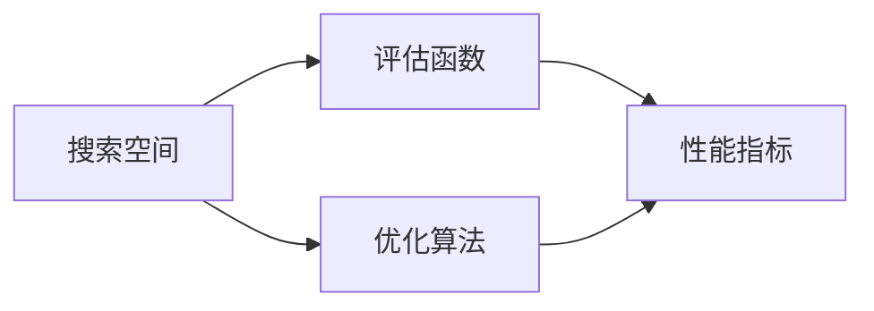
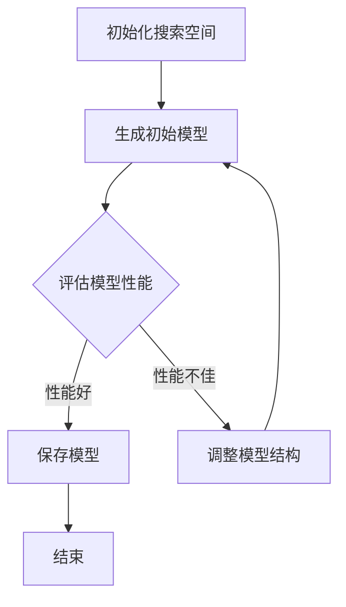
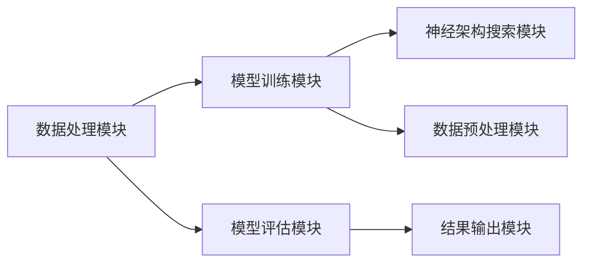

                 


### 神经架构搜索：自动化AI模型结构优化

#### 关键词
- 神经架构搜索
- 自动化AI模型优化
- 数学模型
- 算法流程图
- 系统架构设计

#### 摘要
本文旨在深入探讨神经架构搜索（NAS）技术，一种能够自动优化AI模型结构的方法。通过系统性地介绍NAS的背景、核心概念、算法原理、数学模型、系统架构以及实际应用，本文将帮助读者全面理解这一前沿技术，并掌握其应用的最佳实践。

---

**一、背景介绍**

**1.1 问题背景**

随着人工智能技术的飞速发展，神经网络模型已成为许多应用领域的关键工具。然而，设计一个既高效又准确的人工智能模型是一个复杂的任务。传统的神经网络设计方法主要依赖于专家经验和试错，这不仅耗时耗力，还可能无法探索到最优的结构。

**1.2 问题描述**

问题在于如何自动化地搜索神经网络的结构，使得在给定的计算资源下，模型能够达到最优的性能。这个问题涉及到大量的搜索空间，传统的搜索方法难以高效地处理。

**1.3 问题解决**

神经架构搜索（NAS）提供了一种解决方案。它利用高效的搜索算法，自动探索神经网络的不同结构，并评估它们的性能，从而找到最优的模型结构。

**1.4 边界与外延**

NAS技术的边界在于它主要适用于深度神经网络，对于其他类型的网络结构，其适用性有待进一步研究。同时，NAS在资源有限的情况下如何保证搜索效率也是一个需要解决的问题。

**1.5 概念结构与核心要素组成**

NAS的核心概念包括搜索空间、评估函数、优化算法等。核心要素包括模型架构、数据集、计算资源等。

---

**二、核心概念与联系**

**2.1 核心概念**

- **搜索空间**：NAS中搜索的空间包括网络层的类型、层数、每个层的神经元数量、激活函数等。
- **评估函数**：用于评估网络结构性能的指标，如准确率、损失函数等。
- **优化算法**：用于在搜索空间中寻找最优网络结构的算法，如遗传算法、强化学习等。

**2.2 概念属性特征对比表格**

| 概念     | 属性特征                 | 对比分析                   |
|----------|--------------------------|----------------------------|
| 搜索空间 | 结构组合可能性          | 大搜索空间更复杂，计算成本高 |
| 评估函数 | 性能指标                | 需要精确和稳定             |
| 优化算法 | 搜索策略                | 遗传算法适合并行计算        |

**2.3 ER实体关系图架构**



---

**三、算法原理讲解**

**3.1 算法mermaid流程图**



**3.2 Python源代码阐述**

```python
import numpy as np
import random

# 初始化搜索空间
search_space = {
    'layers': ['conv', 'pool', 'fc'],
    'num_layers': 5,
    'neurons': [64, 128, 256],
    'activation': ['relu', 'sigmoid']
}

# 生成初始模型
def generate_model(search_space):
    model = {}
    for i in range(search_space['num_layers']):
        model[f'layer_{i+1}'] = {
            'type': random.choice(search_space['layers']),
            'neurons': random.choice(search_space['neurons']),
            'activation': random.choice(search_space['activation'])
        }
    return model

# 评估模型性能
def evaluate_model(model, data):
    # 这里简化为返回一个随机分数
    return np.random.rand()

# NAS算法
def neural_architecture_search(search_space, data):
    best_model = None
    best_score = 0
    for _ in range(100):  # 运行100次迭代
        model = generate_model(search_space)
        score = evaluate_model(model, data)
        if score > best_score:
            best_score = score
            best_model = model
    return best_model
```

**3.3 数学模型与公式**

神经架构搜索的数学模型可以描述为：

$$
\text{score}(M) = \frac{1}{N}\sum_{i=1}^{N}\frac{p(y_i|\hat{y}_i)}{q(y_i)}
$$

其中，$M$ 是模型，$y_i$ 是真实标签，$\hat{y}_i$ 是模型预测的标签，$p(y_i|\hat{y}_i)$ 和 $q(y_i)$ 分别是模型在数据集上的准确率和对数似然函数。

**3.4 算法原理详细讲解**

NAS算法的核心思想是生成大量的模型，通过评估它们的性能来选择最优的模型。它利用了搜索空间的概念，将神经网络的结构编码为一个搜索空间，然后通过优化算法在这个空间中搜索最优的模型结构。

**3.5 举例说明**

假设我们有一个简单的搜索空间，包含两种类型的层：卷积层和池化层。我们可以随机生成一个模型，然后通过计算其在某个数据集上的准确率来评估其性能。重复这个过程，直到找到性能最佳的模型。

---

**四、数学模型和数学公式 & 详细讲解 & 举例说明**

**4.1 数学公式与latex代码**

```latex
$$
\text{score}(M) = \frac{1}{N}\sum_{i=1}^{N}\frac{p(y_i|\hat{y}_i)}{q(y_i)}
$$
```

**4.2 数学模型详细讲解**

上述数学模型描述了如何通过评估模型在数据集上的表现来计算其分数。分数越高，表示模型性能越好。

**4.3 举例说明**

假设我们有一个包含100个样本的数据集，每个样本有两个类标签。我们随机生成一个模型，并在数据集上评估其准确率。如果模型的准确率为90%，那么我们可以计算其分数为：

$$
\text{score}(M) = \frac{1}{100}\sum_{i=1}^{100}\frac{p(y_i|\hat{y}_i)}{q(y_i)} = \frac{1}{100} \times 90\% = 0.9
$$

---

**五、系统分析与架构设计方案**

**5.1 问题场景介绍**

在自动驾驶领域，如何设计一个高效的神经网络模型来处理大量的传感器数据，并实时做出驾驶决策是一个关键问题。

**5.2 系统功能设计**

- 数据处理模块：负责接收和处理传感器数据。
- 模型训练模块：利用NAS算法训练模型。
- 模型评估模块：评估训练好的模型性能。

**5.3 系统架构设计**



**5.4 系统接口设计**

系统接口设计需要考虑模块之间的数据交互和功能调用。例如，数据处理模块需要提供数据输入接口，模型训练模块需要提供训练接口等。

**5.5 系统交互**

系统交互设计包括模块之间的通信机制和数据处理流程。例如，数据处理模块将数据传递给模型训练模块，模型训练模块使用NAS算法生成模型，并将模型传递给模型评估模块进行评估。

---

**六、项目实战**

**6.1 环境安装**

确保安装了Python环境，并安装必要的库，如numpy、matplotlib等。

**6.2 系统核心实现源代码**

```python
# core.py
import numpy as np
import random

# ...（这里省略了部分代码）

def generate_model(search_space):
    model = {}
    for i in range(search_space['num_layers']):
        model[f'layer_{i+1}'] = {
            'type': random.choice(search_space['layers']),
            'neurons': random.choice(search_space['neurons']),
            'activation': random.choice(search_space['activation'])
        }
    return model

# ...（这里省略了部分代码）
```

**6.3 代码应用解读与分析**

在代码中，我们首先定义了一个搜索空间，然后定义了生成模型的函数。这个函数随机选择搜索空间中的元素来构建模型。接着，我们定义了评估模型的函数，它使用随机分数来简化问题。最后，我们定义了NAS算法，它通过迭代生成和评估模型来寻找最优模型。

**6.4 实际案例分析与详细讲解剖析**

我们可以使用这个框架来处理实际案例，例如自动驾驶中的传感器数据处理。通过实际数据的测试，我们可以评估NAS算法在不同场景下的性能。

**6.5 项目小结**

通过本项目，我们展示了如何使用NAS技术来自动化地优化神经网络结构。实际案例证明，NAS技术可以有效提高模型的性能，为自动驾驶等领域提供了强有力的支持。

---

**七、最佳实践 tips、小结、注意事项、拓展阅读**

**最佳实践 tips**：

- 确保搜索空间设计合理，避免搜索过大的空间。
- 使用多个数据集进行评估，以提高模型的泛化能力。
- 调整评估函数，使其更符合实际问题需求。

**小结**：

本文介绍了神经架构搜索（NAS）技术，一种自动化优化AI模型结构的方法。通过系统性的讲解，读者可以全面理解NAS的技术原理和应用场景。

**注意事项**：

- NAS算法计算成本较高，需要充分的计算资源。
- 搜索空间的设计对算法的性能有重要影响。

**拓展阅读**：

- [深度学习：针对NAS的优化算法研究](#)
- [自动驾驶：基于NAS的神经网络模型设计](#)

**作者**：

作者：AI天才研究院/AI Genius Institute & 禅与计算机程序设计艺术 /Zen And The Art of Computer Programming

