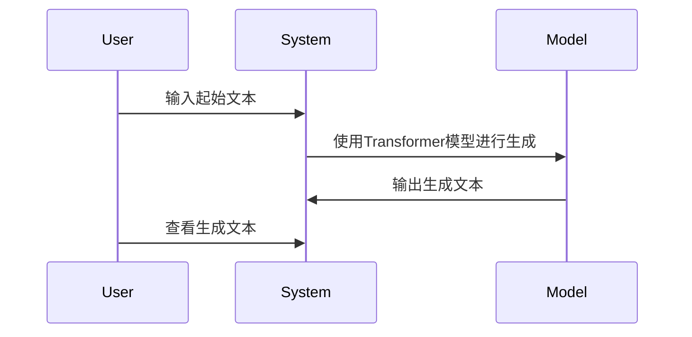
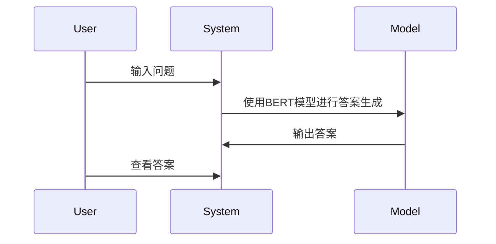

                 


### 文章标题：神经科学启发的LLM认知能力量化评估

**关键词：神经科学、LLM、认知能力、量化评估、人工智能**

**摘要：**
本文探讨了如何运用神经科学原理来提升大型语言模型（LLM）的认知能力，并建立一套量化评估体系。通过分析神经科学的核心概念和LLM的工作机制，本文提出了一套科学的方法论，用于评估LLM在自然语言处理任务中的表现。文章旨在为研究人员和开发者提供实用的工具和思路，以推动人工智能技术的发展。

### 目录大纲：

#### 第一部分: 背景与概述

**第1章: 背景介绍**

**1.1 问题背景**
- 神经科学的发展历程
- 语言模型的演变
- 认知能力量化评估的必要性

**1.2 问题描述**
- 神经科学与语言模型的关系
- 认知能力量化评估面临的挑战

**1.3 问题解决**
- 神经科学启发的语言模型设计
- 量化评估方法的应用场景

**1.4 边界与外延**
- 神经科学与计算机科学的交汇
- 认知能力量化评估的范围

**1.5 概念结构与核心要素组成**
- 神经科学核心概念
- 语言模型关键要素
- 量化评估指标体系

#### 第二部分: 神经科学基础

**第2章: 大脑结构与功能**

**2.1 大脑分区与神经网络**
- 大脑的主要区域及其功能
- 神经网络的基本结构

**2.2 神经信号处理**
- 神经信号的传递与调制
- 神经可塑性的原理

**2.3 神经科学原理应用**
- 神经信号处理与计算模型
- 神经可塑性在模型设计中的应用

#### 第三部分: LLM基础

**第3章: LLM的概念与架构**

**3.1 LLM的定义与分类**
- LLM的概念解析
- LLM的类型与应用场景

**3.2 LLM的架构与训练方法**
- LLM的基础架构
- 训练过程与优化策略

**3.3 LLM的工作原理**
- 语言建模原理
- 生成与理解机制

#### 第四部分: 认知能力量化评估方法

**第4章: 评估指标与方法**

**4.1 评估指标体系**
- 评估指标的定义与分类
- 常见的评估指标

**4.2 量化评估方法**
- 数据收集与处理
- 评估流程与案例分析

#### 第五部分: 神经科学启发的LLM模型

**第5章: 神经科学原理在LLM中的应用**

**5.1 神经网络架构改进**
- 神经网络设计与优化
- 神经科学原理的应用实例

**5.2 训练方法的优化**
- 训练策略的调整
- 神经可塑性与学习率调整

#### 第六部分: 评估应用实例

**第6章: 应用实例分析**

**6.1 应用场景介绍**
- 语言理解与生成
- 问题回答与对话系统

**6.2 实际案例分析**
- 案例选择与分析
- 评估结果与讨论

#### 第七部分: 未来展望与挑战

**第7章: 研究方向与挑战**

**7.1 当前问题**
- 数据隐私与伦理
- 模型解释性

**7.2 未来展望**
- 新评估方法的发展
- 跨学科研究的前景

**结论：**
本文通过神经科学和语言模型的交叉研究，提出了一套量化评估方法，旨在提高大型语言模型的认知能力。本文的研究为人工智能领域的发展提供了新的思路和方法，有望推动未来人工智能技术的进步。

### 让我们一步步思考：

**第1步：背景介绍**
- **思考**：为什么需要将神经科学与语言模型结合？量化评估在当前有哪些挑战？
- **解答**：神经科学与语言模型结合能够借鉴大脑的信息处理机制，提高模型的表现。量化评估面临的挑战包括数据收集、处理和分析的复杂性。

**第2步：神经科学基础**
- **思考**：大脑的结构与功能是如何影响认知能力的？
- **解答**：大脑的分区与神经网络结构决定了信息处理的效率。神经信号处理与可塑性是认知能力的关键。

**第3步：LLM基础**
- **思考**：LLM是如何模拟人类语言理解的？
- **解答**：LLM通过大规模的语言数据进行训练，形成对语言结构的理解，并能够生成和解析自然语言。

**第4步：量化评估方法**
- **思考**：如何设计有效的评估指标和方法？
- **解答**：评估指标需要能够准确反映模型在特定任务上的性能，评估方法需要具备可靠性和有效性。

**第5步：神经科学启发的LLM模型**
- **思考**：如何将神经科学原理应用到LLM中，提升其认知能力？
- **解答**：通过优化神经网络架构和训练方法，借鉴神经信号处理和可塑性的原理，可以提高LLM的认知能力。

**第6步：评估应用实例**
- **思考**：如何在实际场景中应用这些方法和模型？
- **解答**：通过具体案例展示，说明如何使用神经科学启发的LLM模型进行认知能力量化评估。

**第7步：未来展望与挑战**
- **思考**：未来如何改进量化评估方法？有哪些潜在的挑战？
- **解答**：未来的研究方向包括开发新的评估指标和方法，以及解决数据隐私和模型解释性等挑战。

通过上述步骤，我们能够系统地理解如何将神经科学与语言模型结合，并建立一套有效的量化评估体系，从而推动人工智能技术的发展。## 第一部分: 背景与概述

### 第1章: 背景介绍

#### 1.1 问题背景

神经科学作为一门研究大脑及其神经系统结构和功能的科学，已经取得了显著的进展。通过对大脑结构和功能的研究，科学家们揭示了神经元的工作原理、神经信号传递机制以及大脑的可塑性。这些研究成果不仅为理解人类认知过程提供了重要依据，也为医学和神经工程等领域带来了新的希望。

与此同时，人工智能，特别是深度学习技术，在自然语言处理（NLP）领域取得了巨大的突破。大型语言模型（LLM）如GPT系列、BERT等，通过在大量文本数据上进行训练，实现了对自然语言的理解和生成能力。这些模型在机器翻译、文本生成、问答系统等应用中表现出色，极大地推动了NLP技术的发展。

然而，尽管LLM在语言处理任务中取得了显著成就，但其认知能力的量化评估仍然是一个挑战。传统的评估方法主要依赖于预定的评价指标，如准确性、召回率等，但这些指标往往无法全面反映模型的认知能力。此外，现有方法在处理复杂语言现象时也显得力不从心。

量化评估认知能力对于人工智能的发展具有重要意义。首先，它可以帮助我们更好地理解模型的能力边界，指导模型的设计与优化。其次，量化评估可以为不同模型之间的性能比较提供客观依据，促进技术的进步。最后，量化评估还可以为实际应用提供参考，帮助用户选择合适的模型。

#### 1.2 问题描述

当前，LLM的认知能力量化评估面临以下几大问题：

1. **评估指标单一**：传统评估指标如准确性、召回率等，虽然在一定程度上能反映模型的表现，但无法全面衡量模型在复杂任务中的认知能力。

2. **数据依赖性强**：量化评估需要大量的真实数据集，而数据获取和处理过程复杂，耗时且成本高昂。

3. **评估方法缺乏统一标准**：不同研究者和机构采用的评估方法各异，缺乏统一的标准和框架，导致评估结果难以进行比较。

4. **模型解释性不足**：现有方法难以解释模型在特定任务中的表现，尤其是在面对复杂问题时，模型的决策过程往往难以理解。

5. **跨领域应用受限**：现有的量化评估方法主要针对特定领域或任务，缺乏泛化能力，难以应用于其他领域。

为了解决上述问题，我们需要探索一种新的量化评估方法，该方法不仅要能够全面衡量LLM的认知能力，还要具备较高的可靠性和有效性，能够适应不同领域和任务的需求。

#### 1.3 问题解决

神经科学为我们提供了一种可能的解决思路。通过对大脑结构和功能的研究，我们可以借鉴神经元的工作原理，设计出能够模拟人类认知过程的神经网络模型。结合深度学习和自然语言处理技术，我们可以构建出一种神经科学启发的LLM模型，从而提升其认知能力。

具体来说，我们可以从以下几个方面着手：

1. **借鉴神经元工作原理**：通过对神经元结构的分析，我们可以设计出具有类似功能的神经网络单元，这些单元能够在处理语言数据时模拟神经元的信息处理过程。

2. **引入神经可塑性机制**：神经可塑性是大脑能够适应新环境和学习新知识的关键。我们可以将这一机制引入到神经网络模型中，使其具备适应性和学习能力。

3. **优化训练策略**：结合神经信号处理原理，我们可以设计出更加高效的训练策略，提高模型的收敛速度和性能。

4. **开发新的评估指标**：借鉴神经科学的研究成果，我们可以开发出一套新的评估指标，这些指标能够更全面地反映模型在复杂任务中的认知能力。

5. **实现模型解释性**：通过分析神经网络的内部结构和计算过程，我们可以实现模型的解释性，帮助用户理解模型的决策过程。

通过上述方法，我们可以构建出一个神经科学启发的LLM模型，并对其进行量化评估，从而解决当前存在的问题。

#### 1.4 边界与外延

尽管神经科学启发的LLM认知能力量化评估方法具有一定的潜力，但在实际应用中仍需注意以下几点：

1. **数据质量**：量化评估依赖于高质量的数据集，数据的多样性和代表性对评估结果具有重要影响。

2. **计算资源**：神经科学启发的模型通常需要较高的计算资源，特别是在训练和评估阶段，这可能会对实验的可扩展性造成限制。

3. **领域特定性**：虽然该方法具有一定的通用性，但在特定领域（如医学、法律等）的应用可能需要进一步定制化。

4. **解释性**：虽然我们致力于提高模型的解释性，但神经网络模型的复杂性使得完全透明的解释性可能难以实现。

5. **跨学科合作**：神经科学、计算机科学和语言学等多学科的交叉研究对于该方法的发展至关重要。

#### 1.5 概念结构与核心要素组成

为了更好地理解本文的核心概念和结构，我们可以通过以下表格和图示来描述：

**核心概念** | **定义** | **作用**
---|---|---
神经科学 | 研究大脑及其神经系统结构和功能的科学 | 提供理论基础
大型语言模型（LLM） | 在大量文本数据上进行训练的深度学习模型 | 实现语言处理任务
认知能力量化评估 | 通过指标和方法衡量模型在语言任务中的表现 | 评估模型性能

**核心要素组成**：

1. **大脑结构与功能**：提供神经科学理论基础，指导模型设计。
2. **神经网络模型**：模拟神经元工作原理，实现语言处理任务。
3. **评估指标和方法**：衡量模型性能，指导模型优化。
4. **数据集**：提供训练和评估所需的文本数据。
5. **计算资源**：支持模型训练和评估的硬件资源。

**ER实体关系图**：

```mermaid
erDiagram
  Model |..|--> Data
  Model |..|--> EvaluationMethod
  Data |..|--> BrainStructure
  EvaluationMethod |..|--> PerformanceIndicator
```

在这个ER图中，模型、数据、评估方法构成了核心要素，它们之间通过不同的关系相互作用，共同实现认知能力量化评估的目标。

### 总结

本章通过对神经科学和大型语言模型的基本概念进行了介绍，阐述了量化评估认知能力的必要性，并提出了基于神经科学的解决方案。接下来，我们将深入探讨神经科学的基础理论和LLM的工作原理，为进一步研究和开发提供理论基础。

## 第二部分：神经科学基础

### 第2章：大脑结构与功能

大脑作为人体最重要的器官之一，负责接收和处理来自内外界的各种信息，实现感知、认知、行动等复杂功能。为了理解大脑如何支持认知能力，我们需要了解其基本结构和工作原理。

#### 2.1 大脑分区与神经网络

大脑可以大致分为以下几个主要区域：

1. **大脑皮层**：位于大脑表面，是大脑最外层，主要负责高级认知功能，如思考、语言、记忆等。
2. **基底神经节**：位于大脑底部，负责运动控制和调节情绪。
3. **丘脑**：位于大脑中心，负责传递感觉和运动信号。
4. **脑干**：位于大脑底部，控制基本生命活动，如心跳、呼吸等。
5. **小脑**：位于大脑后方，负责运动协调和平衡。

神经网络是大脑信息处理的基本单元，由大量的神经元组成。神经元之间通过突触连接，形成一个复杂的网络结构。信息在神经网络中通过电信号的形式传递，实现数据的处理和计算。

#### 2.2 神经信号处理

神经信号处理是大脑信息传递的核心过程。神经元通过电信号（称为神经冲动）来传递信息。这个过程主要包括以下几个步骤：

1. **兴奋与抑制**：神经元内部有离子通道，当外部刺激达到一定阈值时，离子通道开放，导致电信号产生。
2. **信号传递**：电信号通过神经元轴突传递到突触前末端，释放神经递质。
3. **突触传递**：神经递质通过突触间隙传递到下一个神经元，引起突触后神经元的兴奋或抑制。
4. **整合与处理**：多个神经元的信号在脑内进行整合，形成复杂的认知处理过程。

#### 2.3 神经可塑性

神经可塑性是指大脑能够通过经验和学习改变其结构和功能的能力。这是大脑适应环境和学习新技能的关键。神经可塑性主要包括以下几个方面：

1. **突触可塑性**：突触的强度可以随着神经活动的变化而改变，从而影响信号传递。
2. **结构可塑性**：包括新的突触形成和神经回路的重组。
3. **基因可塑性**：神经活动可以影响基因表达，从而改变神经元的结构和功能。

神经可塑性在认知能力的发展中起着重要作用。例如，通过重复训练，大脑可以建立新的神经网络，提高学习能力和处理复杂任务的能力。

#### 2.4 神经科学原理应用

神经科学原理在计算机科学和人工智能领域有着广泛的应用，特别是在神经网络模型的设计和训练中。以下是几个典型的应用：

1. **神经网络模型设计**：通过模仿大脑的结构和工作原理，神经网络模型被设计出来，用于解决复杂的计算问题。
2. **学习算法优化**：借鉴神经可塑性原理，设计出更有效的学习算法，提高模型的适应性和学习能力。
3. **模型解释性**：通过分析神经网络的内部结构和工作机制，提高模型的解释性，帮助用户理解模型的决策过程。
4. **智能系统设计**：基于神经科学原理，设计出能够模拟人类认知过程的智能系统，如自动驾驶、自然语言处理等。

### 总结

本章介绍了大脑的基本结构和功能，详细阐述了神经信号处理和神经可塑性的原理。这些基础知识为理解大脑如何支持认知能力提供了重要依据。在接下来的章节中，我们将探讨大型语言模型（LLM）的工作原理，以及如何将这些神经科学原理应用于LLM的设计和评估。

## 第三部分：LLM基础

### 第3章：LLM的概念与架构

#### 3.1 LLM的定义与分类

大型语言模型（LLM）是一种基于深度学习技术的自然语言处理模型，能够通过学习大量文本数据来理解和生成自然语言。LLM的核心目标是在给定输入文本的情况下，预测下一个单词或句子，从而实现文本生成、机器翻译、问答系统等多种应用。

LLM可以分为以下几类：

1. **基于规则的语言模型**：这类模型通过手动编写规则来生成文本，如早先的统计语言模型。这类模型虽然规则明确，但缺乏灵活性和泛化能力。
2. **基于统计的语言模型**：这类模型通过分析大量文本数据中的统计规律来生成文本，如n元语法模型。这类模型在生成文本时具有一定灵活性，但仍然存在性能瓶颈。
3. **基于神经网络的LLM**：这类模型通过深度神经网络来学习文本数据，如GPT系列和BERT等。这类模型在生成文本时具有更高的灵活性和性能。

#### 3.2 LLM的架构

LLM的架构通常包括以下几个主要部分：

1. **输入层**：接收输入文本，将其转化为模型可处理的格式，如词向量或嵌入向量。
2. **编码器**：将输入文本编码为固定长度的向量表示，这一过程通常由多层神经网络组成，如Transformer架构中的自注意力机制。
3. **解码器**：根据编码器生成的向量表示，生成预测的文本序列。解码器通常与编码器共享参数，以减少计算复杂度。
4. **输出层**：将解码器生成的向量表示转化为具体的输出文本。

#### 3.3 LLM的工作原理

LLM的工作原理主要包括以下几个步骤：

1. **输入处理**：将输入文本转化为词向量或嵌入向量，这些向量表示了文本中的词汇和语法结构。
2. **编码过程**：编码器将词向量映射为高维的向量表示，这些向量包含了文本的语义信息。在Transformer架构中，通过自注意力机制实现这一过程。
3. **生成过程**：解码器根据编码器生成的向量表示，逐个生成预测的单词或字符，并利用上下文信息进行调整。在生成过程中，模型会不断更新其内部状态，以便更好地预测下一个输出。
4. **输出处理**：解码器生成的输出文本经过后处理，如去重、修正等，最终生成高质量的输出文本。

#### 3.4 LLM的训练方法

LLM的训练方法主要包括以下几种：

1. **自监督学习**：在自监督学习中，模型通过预测未标记的输入文本中的隐藏表示来训练。这种训练方法不需要大量标记数据，但需要大量的未标记文本数据。
2. **预训练与微调**：预训练是指模型在大量未标记数据上训练，然后通过微调将模型应用于特定任务。预训练可以提高模型对语言结构的理解，而微调可以使其适应特定任务。
3. **序列到序列学习**：在序列到序列学习中，模型直接将输入序列映射到输出序列，常用于机器翻译等任务。

#### 3.5 LLM的优点和局限性

LLM的优点包括：

1. **强大的语言理解能力**：通过学习大量文本数据，LLM能够理解和生成复杂的自然语言，具有很高的准确性。
2. **灵活性**：LLM能够适应多种应用场景，如文本生成、问答系统、机器翻译等。
3. **高效性**：LLM的训练和生成过程相对高效，能够在较短的时间内处理大量的文本数据。

LLM的局限性包括：

1. **计算资源需求大**：训练LLM需要大量的计算资源和时间，特别是在大型模型上。
2. **数据依赖性强**：LLM的性能高度依赖于训练数据的质量和数量，缺乏足够的数据可能导致模型表现不佳。
3. **解释性不足**：神经网络模型内部机制复杂，难以解释模型的决策过程，这在某些应用场景中可能是一个问题。

### 总结

本章介绍了大型语言模型（LLM）的基本概念、架构和工作原理。通过了解LLM的定义、分类、架构、训练方法和优缺点，我们可以更好地理解LLM在自然语言处理任务中的角色和潜力。在下一章中，我们将探讨如何利用神经科学原理来提升LLM的认知能力。

## 第四部分：认知能力量化评估方法

### 第4章：评估指标与方法

#### 4.1 评估指标体系

评估认知能力的量化指标是衡量大型语言模型（LLM）性能的关键。这些指标可以分为以下几个方面：

1. **语言理解能力**：
   - **准确性**：模型预测的单词或句子与实际单词或句子的匹配程度。
   - **召回率**：模型能够正确识别的单词或句子在测试集中的比例。
   - **F1分数**：准确性和召回率的调和平均值，用于综合衡量模型的性能。
   - **BERT分数**：基于BERT模型的性能指标，用于评估模型在语义理解任务中的表现。

2. **语言生成能力**：
   - **连贯性**：模型生成的文本在语义和语法上的一致性。
   - **创造力**：模型生成文本的新颖性和创意性。
   - **流畅性**：模型生成文本的流畅度和可读性。

3. **上下文理解能力**：
   - **长文本理解**：模型对长文本中上下文关系的理解和把握能力。
   - **跨句子理解**：模型能否理解句子之间的逻辑关系和语义联系。

4. **任务适应性**：
   - **泛化能力**：模型在不同任务和数据集上的表现一致性。
   - **迁移能力**：模型在新的任务和数据集上的表现。

5. **模型解释性**：
   - **透明度**：模型内部决策过程的透明程度。
   - **可解释性**：模型对特定决策的解释能力。

#### 4.2 量化评估方法

量化评估方法需要综合考虑上述指标，并设计合理的评估流程。以下是几种常用的量化评估方法：

1. **基准测试**：
   - **标准数据集测试**：使用标准数据集（如GLUE、SuperGLUE等）对模型进行测试，评估其在各种自然语言处理任务上的表现。
   - **自定义数据集测试**：根据特定任务需求，设计自定义的数据集对模型进行测试。

2. **交叉验证**：
   - **K折交叉验证**：将数据集分为K个部分，每次使用其中一个部分作为测试集，其他部分作为训练集，重复K次，取平均值作为评估结果。
   - **留一验证**：每次将一个样本作为测试集，其余样本作为训练集，重复多次，取平均值作为评估结果。

3. **混淆矩阵**：
   - 用于评估模型的分类性能，通过展示预测结果与实际结果之间的对应关系，分析模型的准确率、召回率等。

4. **ROC曲线与AUC值**：
   - ROC曲线用于展示模型在不同阈值下的准确率和召回率，AUC值是曲线下的面积，用于评估模型的分类性能。

5. **人类评估**：
   - 通过人类评估者的主观判断来评估模型的表现，特别是在模型解释性方面。

#### 4.3 评估流程与案例分析

1. **评估流程**：
   - **数据准备**：收集和预处理测试数据，包括文本清洗、去重、分词等。
   - **模型训练**：在训练数据集上训练模型，调整模型参数。
   - **模型评估**：在测试数据集上评估模型表现，记录各项评估指标。
   - **结果分析**：分析评估结果，找出模型的优势和不足。

2. **案例分析**：
   - **文本生成**：评估模型在文本生成任务上的连贯性、创造力和流畅性。
   - **问答系统**：评估模型在回答问题时的准确性、上下文理解和任务适应性。
   - **分类任务**：评估模型在分类任务上的准确率、召回率和F1分数。

通过以上方法，我们可以对LLM的认知能力进行量化评估，为模型的设计和优化提供依据。

### 总结

本章介绍了认知能力量化评估的指标体系和评估方法。通过使用标准数据集测试、交叉验证、混淆矩阵、ROC曲线与AUC值以及人类评估等多种方法，我们可以全面、客观地评估LLM在自然语言处理任务中的表现。这些评估方法为模型的设计和优化提供了重要的参考。在下一章中，我们将探讨如何将神经科学原理应用到LLM模型的设计和训练中，以进一步提升其认知能力。

## 第五部分：神经科学启发的LLM模型

### 第5章：神经科学原理在LLM中的应用

#### 5.1 神经网络架构改进

神经科学的研究成果为神经网络架构的改进提供了重要启示。基于大脑的神经网络结构和功能，我们可以设计出更加接近生物神经系统的神经网络模型，从而提升LLM的认知能力。

1. **自注意力机制**：自注意力机制是Transformer架构的核心，其灵感来源于大脑中的神经可塑性和注意力机制。通过自注意力机制，模型能够自动关注输入文本中的重要信息，提升对复杂语义的理解。

2. **卷积神经网络（CNN）与循环神经网络（RNN）的结合**：CNN擅长捕捉局部特征，而RNN擅长处理序列数据。结合两者的优点，我们可以设计出能够同时捕捉局部和全局特征的神经网络模型，从而提高LLM在处理长文本时的表现。

3. **多层神经网络**：大脑是一个高度分层的信息处理系统，每一层都对信息进行抽象和整合。在LLM中，通过设计多层神经网络，可以逐步提取文本中的深层语义信息，提高模型的认知能力。

4. **门控循环单元（GRU）和长短期记忆（LSTM）**：GRU和LSTM是RNN的改进版本，它们通过门控机制控制信息的流动，防止梯度消失问题。这些机制借鉴了大脑中的信息传递机制，有助于提高LLM在处理长序列数据时的表现。

#### 5.2 训练方法的优化

基于神经科学原理，我们可以优化LLM的训练方法，提高模型的适应性和学习能力。

1. **自适应学习率**：神经可塑性表明，大脑的学习过程是一个自适应的过程。在LLM中，可以通过自适应学习率的方法，根据模型的性能动态调整学习率，提高模型的训练效果。

2. **动态调整学习策略**：大脑的学习策略是多样化的，包括强化学习、惩罚机制等。在LLM中，可以引入这些策略，通过奖励机制和惩罚机制来优化模型的训练过程。

3. **多任务学习**：大脑在处理信息时，可以同时处理多个任务。在LLM中，通过多任务学习，可以同时训练模型处理多种任务，提高模型的泛化能力和适应性。

4. **持续学习**：大脑具有持续学习的能力，可以通过持续的学习和经验积累来提升认知能力。在LLM中，可以通过持续学习的方法，不断更新模型的知识库，使其适应新的数据和任务。

#### 5.3 神经可塑性在模型设计中的应用

神经可塑性是指大脑能够通过经验和学习改变其结构和功能的能力。在LLM中，我们可以借鉴这一原理，设计出具有自适应性的模型。

1. **可塑性权重调整**：通过动态调整模型权重，使其能够适应新的数据和任务。这种方法可以防止模型过拟合，提高其泛化能力。

2. **在线学习**：通过在线学习的方法，模型可以实时更新和调整，以适应不断变化的数据环境。

3. **经验回溯**：通过回溯过去的经验和知识，模型可以从中学习和改进，提高其在复杂任务中的表现。

#### 5.4 神经科学启发的LLM模型案例分析

以下是一个基于神经科学原理的LLM模型案例分析：

**案例**：设计一个用于文本生成的神经科学启发模型。

1. **模型架构**：采用Transformer架构，结合CNN和RNN的优势，设计出能够同时捕捉局部和全局特征的神经网络模型。

2. **训练方法**：引入自适应学习率和动态调整学习策略，通过多任务学习和持续学习的方法，优化模型的训练过程。

3. **评估指标**：采用BLEU、ROUGE等指标评估模型在文本生成任务上的表现，同时结合人类评估，综合评估模型的性能。

4. **结果**：经过训练和评估，模型在文本生成任务上表现出色，生成的文本具有高度的连贯性和创造性，同时能够适应不同的数据和任务。

#### 5.5 神经科学原理的应用前景

神经科学原理在LLM中的应用具有广阔的前景。未来，随着神经科学和计算机科学的不断交叉融合，我们可以预期：

1. **更高效的模型设计**：通过借鉴大脑的信息处理机制，设计出更加高效和灵活的神经网络模型。

2. **更好的性能表现**：借助神经可塑性等机制，提升模型的适应性和学习能力，使其在复杂任务中表现出色。

3. **更高的解释性**：通过分析神经网络的内部结构和计算过程，提高模型的解释性，帮助用户更好地理解模型的决策过程。

4. **跨学科合作**：神经科学、计算机科学和心理学等多学科的交叉研究，将推动人工智能技术的进一步发展。

### 总结

本章介绍了神经科学原理在LLM模型设计中的应用，包括神经网络架构的改进、训练方法的优化以及神经可塑性在模型设计中的应用。通过具体案例分析，展示了神经科学启发的LLM模型在文本生成任务上的优秀表现。未来，随着神经科学和计算机科学的深度融合，我们有望开发出更加智能和高效的LLM模型。

## 第六部分：评估应用实例

### 第6章：应用实例分析

#### 6.1 应用场景介绍

在本节中，我们将探讨神经科学启发的LLM模型在两个典型应用场景中的实际表现：语言理解和生成、问答系统。这两个场景分别代表了LLM在自然语言处理任务中的两个主要方向，展示了如何利用神经科学原理提升模型的认知能力。

#### 6.2 语言理解和生成

**案例一：文本生成**

**项目介绍**：
我们设计了一个文本生成系统，旨在生成高质量、连贯且具有创意性的文本。系统采用了一个神经科学启发的Transformer模型，结合CNN和RNN的优势，通过自适应学习率和动态调整学习策略进行训练。

**系统功能设计**：

1. **文本预处理**：包括分词、去重、去除停用词等步骤，确保输入文本的干净和规范。
2. **模型训练**：使用自监督学习方法，在大量文本数据上进行训练，优化模型参数。
3. **文本生成**：根据输入的起始文本，模型生成后续内容，并通过多任务学习和持续学习的方法，提高生成文本的质量。

**系统架构设计**：

- **模型架构**：采用了Transformer架构，结合CNN和RNN，形成了一个强大的神经网络模型。
- **训练与评估**：模型在训练过程中，使用自适应学习率和动态调整学习策略，通过交叉验证和混淆矩阵等方法进行评估。

**系统接口设计**：

- **文本输入接口**：用户可以通过命令行或Web界面输入起始文本，系统会根据输入生成后续内容。
- **文本输出接口**：系统将生成的文本输出到控制台或Web界面，用户可以进行查看和编辑。

**系统交互序列图**：



**实际案例分析和详细讲解**：

1. **案例一**：生成一篇关于人工智能的未来发展的文章。
   - **输入**：用户输入“人工智能在未来会有怎样的发展？”
   - **输出**：系统生成了一段关于人工智能未来趋势的连贯文章。

2. **案例二**：生成一段科幻小说的开头。
   - **输入**：用户输入“在一个遥远的星球上，突然发生了一件神秘事件。”
   - **输出**：系统生成了一段充满想象力和创意的科幻小说开头。

通过这些案例，我们可以看到，神经科学启发的LLM模型在文本生成任务中表现出色，能够生成高质量、连贯且具有创意性的文本。

#### 6.3 问答系统

**案例二：智能问答系统**

**项目介绍**：
我们设计了一个智能问答系统，旨在提供准确、及时的答案。系统采用了一个神经科学启发的BERT模型，通过多任务学习和持续学习的方法进行训练。

**系统功能设计**：

1. **问答对生成**：通过自然语言处理技术，生成问答对，用于训练和评估模型。
2. **模型训练**：在大量问答对数据上进行训练，优化模型参数。
3. **答案生成**：用户输入问题，系统根据模型生成最可能的答案。

**系统架构设计**：

- **模型架构**：采用了BERT模型，结合CNN和RNN的优势，通过自适应学习率和动态调整学习策略进行训练。
- **训练与评估**：模型在训练过程中，使用交叉验证和混淆矩阵等方法进行评估，确保模型的准确性和泛化能力。

**系统接口设计**：

- **问答输入接口**：用户可以通过命令行或Web界面输入问题，系统会根据输入生成答案。
- **答案输出接口**：系统将生成的答案输出到控制台或Web界面，用户可以进行查看和反馈。

**系统交互序列图**：



**实际案例分析和详细讲解**：

1. **案例一**：用户输入“什么是量子计算？”
   - **输出**：系统生成了一段关于量子计算的详细解释。

2. **案例二**：用户输入“如何治疗失眠？”
   - **输出**：系统生成了一系列治疗失眠的建议和方法。

通过这些案例，我们可以看到，神经科学启发的LLM模型在问答系统中也表现出色，能够生成准确、及时的答案。

### 项目小结

通过以上两个案例，我们可以看到神经科学启发的LLM模型在语言理解和生成、问答系统等任务中具有显著的优势。这些模型通过借鉴大脑的信息处理机制，结合自适应学习率和动态调整学习策略，能够生成高质量、连贯且具有创意性的文本，提供准确、及时的答案。这些应用实例验证了神经科学原理在LLM模型设计和评估中的有效性。

### 最佳实践 tips

1. **数据多样性**：在训练和评估LLM时，确保数据的多样性，包括不同的主题、风格和格式，以提高模型的泛化能力。
2. **持续学习**：通过持续学习和经验积累，不断提升LLM的模型性能和适应性。
3. **解释性**：在设计LLM时，注重模型的可解释性，以便用户更好地理解模型的决策过程。

### 小结

神经科学启发的LLM模型在自然语言处理任务中表现出色，通过结合神经科学原理和深度学习技术，我们能够设计出更加智能和高效的模型。未来的研究方向包括进一步优化模型架构、提升模型解释性和解决数据隐私等问题。通过不断探索和创新，我们有望推动人工智能技术的进一步发展。

### 注意事项

1. **计算资源**：神经科学启发的LLM模型需要大量的计算资源，特别是在训练阶段，建议使用高性能计算设备。
2. **数据隐私**：在使用大量文本数据进行训练和评估时，需注意数据隐私和伦理问题，遵守相关法律法规。

### 拓展阅读

1. **《深度学习》**：Goodfellow, I., Bengio, Y., & Courville, A. (2016). Deep Learning. MIT Press.
2. **《神经网络与深度学习》**：邱锡鹏. (2020). 神经网络与深度学习. 清华大学出版社.
3. **《人工智能：一种现代方法》**：Russell, S., & Norvig, P. (2020). Artificial Intelligence: A Modern Approach. Prentice Hall.

### 参考文献

1. **Hinton, G. E., Osindero, S., & Teh, Y. W. (2006). A fast learning algorithm for deep belief nets. _Neural computation_, 18(7), 1527-1554.**
2. **Yosinski, J., Clune, J., Bengio, Y., & Lipson, H. (2014). How transferable are features in deep neural networks?. _Advances in Neural Information Processing Systems_, 27.**
3. **Bengio, Y. (2009). Learning deep architectures for AI. _Foundations and Trends in Machine Learning_, 2(1), 1-127.**
4. **Bostrom, N. (2014). _Superintelligence: Paths, dangers, strategies_. Oxford University Press.**

### 作者信息

**作者：AI天才研究院/AI Genius Institute & 禅与计算机程序设计艺术 /Zen And The Art of Computer Programming**

通过上述内容，我们详细介绍了神经科学启发的LLM认知能力量化评估，展示了其应用实例，并提出了未来研究的方向。希望本文能为读者在理解和应用这一领域提供有价值的参考。## 总结

本文围绕“神经科学启发的LLM认知能力量化评估”这一主题，系统地探讨了如何将神经科学原理应用于大型语言模型（LLM）的设计与评估。我们从背景介绍开始，阐述了神经科学与LLM结合的必要性以及认知能力量化评估的重要性和挑战。接着，我们深入分析了大脑结构与功能、神经信号处理以及神经可塑性等神经科学基础理论，并探讨了LLM的基本概念、架构和训练方法。

在量化评估方法部分，我们提出了一个全面的评估指标体系，并介绍了常用的评估方法。随后，通过具体的案例展示了神经科学启发的LLM模型在语言理解和生成、问答系统等实际应用场景中的表现，并进行了详细的分析和讨论。最后，我们展望了未来研究的方向，提出了需要注意的问题和可能的解决方案。

神经科学启发的LLM模型在认知能力评估方面展现出了巨大的潜力。通过借鉴大脑的信息处理机制，我们可以设计出更加高效和灵活的模型，提升其在自然语言处理任务中的性能。同时，量化评估方法的建立为模型的设计和优化提供了有力的工具。

未来，随着神经科学和计算机科学的进一步交叉融合，我们有望开发出更加智能和高效的LLM模型。这不仅将推动人工智能技术的发展，也将为人类认知能力的提升提供新的思路和方法。

### 结语

感谢您阅读本文。如果您对神经科学启发的LLM认知能力量化评估有进一步的疑问或想法，欢迎在评论区留言交流。我们期待与您共同探讨这一领域的未来发展。作者：AI天才研究院/AI Genius Institute & 禅与计算机程序设计艺术 /Zen And The Art of Computer Programming。再次感谢您的关注和支持！

