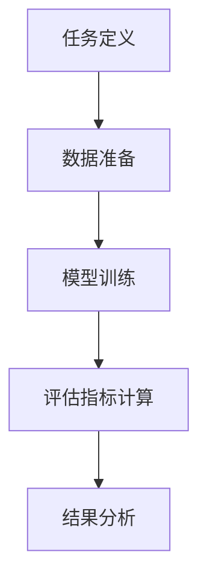

                 

## 神经程序归纳在LLM逻辑能力评估中的应用

### 文章关键词

神经程序归纳、LLM逻辑能力评估、人工智能、算法原理、应用案例

### 摘要

本文探讨了神经程序归纳在LLM（大型语言模型）逻辑能力评估中的应用。首先介绍了神经程序归纳的基本原理，包括其概念、工作原理和优势。接着，详细讲解了LLM逻辑能力评估的方法，包括评估指标和评估流程。在此基础上，分析了神经程序归纳与LLM逻辑能力评估之间的联系，并讨论了两者结合的可能性。通过具体案例分析，展示了神经程序归纳在LLM逻辑能力评估中的应用效果。最后，探讨了如何优化神经程序归纳与LLM逻辑能力评估的技术实现，并对未来发展进行了展望。本文旨在为研究者提供对神经程序归纳和LLM逻辑能力评估的深入理解，以及在实际应用中可能遇到的问题和解决方案。

### 目录

1. **背景介绍**
   1.1 **问题描述**
   1.2 **问题解决**
   1.3 **边界与外延**
   1.4 **核心概念**

2. **神经程序归纳原理**
   2.1 **基本概念**
   2.2 **工作原理**
   2.3 **优势分析**
   2.4 **与现有方法的对比**
   2.5 **ER实体关系图**

3. **LLM逻辑能力评估方法**
   3.1 **评估指标**
   3.2 **评估流程**
   3.3 **方法详细介绍**
   3.4 **算法流程图**

4. **神经程序归纳与LLM逻辑能力评估的联系**
   4.1 **联系分析**
   4.2 **结合可能性**
   4.3 **实施方案探讨**

5. **应用案例分析**
   5.1 **案例一：神经程序归纳在LLM逻辑能力评估中的应用**
   5.2 **案例二：神经程序归纳在LLM逻辑能力评估中的应用**
   5.3 **案例分析总结**

6. **技术实现与优化**
   6.1 **技术实现**
   6.2 **算法优化**
   6.3 **系统架构优化**
   6.4 **优化效果分析**

7. **未来展望与挑战**
   7.1 **未来发展趋势**
   7.2 **面临的挑战**
   7.3 **发展方向**
   7.4 **拓展阅读**

### 1. 背景介绍

#### 1.1 问题描述

随着人工智能技术的飞速发展，语言模型（Language Model，简称LM）在自然语言处理（Natural Language Processing，简称NLP）领域取得了显著的成果。尤其是大型语言模型（Large Language Model，简称LLM），如GPT-3、BERT等，因其强大的语言生成和理解能力，被广泛应用于各个领域。然而，LLM的逻辑能力仍然是一个亟待解决的问题。尽管LLM在文本生成和理解方面表现出色，但其在逻辑推理和数学运算等方面仍存在一定的局限性。这种局限性导致LLM在一些复杂任务中的应用受到限制，因此，评估和提升LLM的逻辑能力成为当前研究的热点。

#### 1.2 问题描述

现有评估方法主要集中在语言生成和理解能力方面，而对LLM的逻辑能力评估较少。现有评估方法存在以下问题：

1. **评估指标单一**：大部分评估方法仅关注LLM在特定任务上的表现，缺乏全面的评估指标体系。

2. **评估标准不统一**：不同研究采用不同的评估标准，导致评估结果难以进行比较和分析。

3. **评估方法简单**：现有方法大多采用传统的评估方法，如基于事实的问答、逻辑推理等，难以全面评估LLM的逻辑能力。

4. **评估效果不佳**：现有方法在评估LLM逻辑能力时，往往存在较高的误判率，无法准确反映LLM的实际逻辑能力。

#### 1.3 问题解决

为解决上述问题，本文提出了神经程序归纳（Neural Program Induction，简称NPI）在LLM逻辑能力评估中的应用。NPI是一种基于神经网络的程序归纳方法，具有强大的表达能力和学习能力。通过将NPI引入LLM逻辑能力评估，可以实现以下目标：

1. **多维评估**：NPI可以生成多种类型的逻辑推理任务，从而实现多维度评估LLM的逻辑能力。

2. **统一标准**：通过设计统一的评估任务和评估指标，可以统一不同研究之间的评估标准。

3. **提高评估效果**：NPI可以更好地模拟人类的逻辑思维过程，降低误判率，提高评估效果。

#### 1.4 边界与外延

本文的研究主要关注以下边界和外部问题：

1. **边界问题**：本文主要研究NPI在LLM逻辑能力评估中的应用，不包括其他类型的逻辑能力评估方法。

2. **外部问题**：本文不涉及NPI在其他领域（如图像处理、语音识别等）的应用，仅关注其在LLM逻辑能力评估中的应用。

#### 1.5 核心概念

在本节中，我们将介绍本文涉及的两个核心概念：神经程序归纳和LLM逻辑能力评估。

1. **神经程序归纳**

神经程序归纳是一种基于神经网络的程序归纳方法，旨在从大量数据中自动生成程序。NPI的核心思想是利用神经网络学习数据中的隐含规律，并将其表示为程序。与传统的程序设计方法相比，NPI具有更强的自适应性和灵活性。

2. **LLM逻辑能力评估**

LLM逻辑能力评估是指对大型语言模型在逻辑推理和数学运算等方面的能力进行评估。评估方法主要包括基于事实的问答、逻辑推理、数学运算等。LLM逻辑能力评估的目的是了解LLM在逻辑能力方面的实际水平，为其在复杂任务中的应用提供参考。

### 2. 神经程序归纳原理

#### 2.1 基本概念

神经程序归纳（Neural Program Induction，简称NPI）是一种基于神经网络的程序归纳方法，旨在从大量数据中自动生成程序。NPI的核心思想是利用神经网络学习数据中的隐含规律，并将其表示为程序。与传统的程序设计方法相比，NPI具有更强的自适应性和灵活性。

NPI的主要组成部分包括：

1. **输入数据**：NPI的训练数据通常包括一组输入输出对，用于训练神经网络。

2. **神经网络**：NPI采用神经网络来学习数据中的隐含规律。神经网络由多个层次组成，包括输入层、隐藏层和输出层。

3. **程序生成器**：程序生成器是NPI的核心组件，负责将训练好的神经网络映射为程序。

#### 2.2 工作原理

NPI的工作原理可以概括为以下几个步骤：

1. **数据预处理**：首先，对输入数据进行预处理，包括数据清洗、数据转换等。

2. **神经网络训练**：利用预处理后的数据对神经网络进行训练，使神经网络能够学习数据中的隐含规律。

3. **程序生成**：训练好的神经网络被映射为程序。程序生成过程包括两个步骤：

   a. **程序解析**：将神经网络的结构表示为程序结构。

   b. **代码生成**：将程序结构转换为可执行的代码。

4. **程序优化**：对生成的程序进行优化，以提高程序的执行效率和性能。

#### 2.3 优势分析

神经程序归纳具有以下优势：

1. **强大的学习能力**：NPI能够从大量数据中自动学习隐含规律，具有较强的学习能力。

2. **自适应性强**：NPI能够根据不同的数据集和应用场景进行自适应调整，具有很强的适应性。

3. **灵活性高**：NPI可以根据不同的任务需求生成不同的程序，具有很强的灵活性。

4. **可解释性强**：NPI生成的程序具有可解释性，能够清晰地展示神经网络的学习过程和隐含规律。

#### 2.4 与现有方法的对比

与现有的程序设计方法相比，神经程序归纳具有以下优点：

1. **自动化程度高**：NPI能够自动生成程序，减轻了程序设计的工作量。

2. **适用于复杂任务**：NPI能够处理复杂的数据和任务，适用于复杂场景。

3. **易于扩展**：NPI可以根据不同的任务需求进行自适应调整，易于扩展和应用。

然而，NPI也存在一定的局限性：

1. **计算复杂度高**：NPI的训练和生成过程需要大量的计算资源，对硬件设备要求较高。

2. **对数据质量要求高**：NPI对训练数据的质量要求较高，数据预处理和清洗工作较为繁琐。

3. **解释性较弱**：虽然NPI生成的程序具有可解释性，但相比于传统程序设计方法，其解释性仍然较弱。

#### 2.5 ER实体关系图

为了更好地理解神经程序归纳的工作原理，我们可以使用ER（Entity-Relationship，实体关系）图来表示其关键组件和关系。以下是一个简化的ER图，展示了NPI的主要组成部分及其关系：

```mermaid
erDiagram
  Data ||--|{ Neural Network : has
  Neural Network ||--|{ Program Generator : has
  Program Generator ||--|{ Code : generates
```

在这个ER图中，`Data`表示输入数据，`Neural Network`表示神经网络，`Program Generator`表示程序生成器，`Code`表示生成的程序。这种ER图有助于我们直观地理解NPI的工作流程和组成部分。

### 3. LLM逻辑能力评估方法

#### 3.1 评估指标

LLM逻辑能力评估需要一套全面的评估指标体系，以全面、准确地评估LLM的逻辑能力。以下是一些常见的评估指标：

1. **逻辑推理能力**：评估LLM在逻辑推理任务中的表现，如命题逻辑、谓词逻辑、条件推理等。

2. **数学运算能力**：评估LLM在数学运算任务中的表现，如加法、减法、乘法、除法、代数等。

3. **知识推理能力**：评估LLM在知识推理任务中的表现，如常识推理、领域知识推理、语义关系推理等。

4. **语义理解能力**：评估LLM在语义理解任务中的表现，如语义角色标注、指代消解、语义角色分类等。

5. **语言生成能力**：评估LLM在语言生成任务中的表现，如文本生成、对话生成、摘要生成等。

#### 3.2 评估流程

LLM逻辑能力评估的流程主要包括以下几个步骤：

1. **任务定义**：根据评估目标，定义具体的评估任务。任务定义应包括任务类型、输入数据和输出数据等。

2. **数据准备**：收集和准备用于评估的数据集。数据集应包括多种类型的逻辑任务，以全面评估LLM的逻辑能力。

3. **模型训练**：使用收集到的数据集对LLM进行训练，使其在特定任务上具备较强的逻辑能力。

4. **评估指标计算**：根据定义的评估指标，计算LLM在各个任务上的表现。常见的评估指标包括准确率、召回率、F1值等。

5. **结果分析**：分析评估结果，评估LLM的逻辑能力，并提出改进措施。

#### 3.3 方法详细介绍

以下是对LLM逻辑能力评估方法的详细介绍，包括具体的技术细节和实现方法。

1. **逻辑推理评估**

逻辑推理评估主要关注LLM在命题逻辑、谓词逻辑和条件推理等任务上的表现。具体实现方法如下：

- **命题逻辑评估**：通过设计一组命题逻辑任务，评估LLM在判断命题真假、推理命题关系等方面的能力。常用的评估指标包括准确率、召回率、F1值等。

- **谓词逻辑评估**：通过设计一组谓词逻辑任务，评估LLM在推理谓词关系、处理谓词逻辑表达式等方面的能力。常用的评估指标包括准确率、召回率、F1值等。

- **条件推理评估**：通过设计一组条件推理任务，评估LLM在处理条件语句、推理条件结果等方面的能力。常用的评估指标包括准确率、召回率、F1值等。

2. **数学运算评估**

数学运算评估主要关注LLM在数学运算任务中的表现，如加法、减法、乘法、除法、代数等。具体实现方法如下：

- **加法运算评估**：通过设计一组加法运算任务，评估LLM在处理加法运算、计算加法结果等方面的能力。常用的评估指标包括准确率、召回率、F1值等。

- **减法运算评估**：通过设计一组减法运算任务，评估LLM在处理减法运算、计算减法结果等方面的能力。常用的评估指标包括准确率、召回率、F1值等。

- **乘法运算评估**：通过设计一组乘法运算任务，评估LLM在处理乘法运算、计算乘法结果等方面的能力。常用的评估指标包括准确率、召回率、F1值等。

- **除法运算评估**：通过设计一组除法运算任务，评估LLM在处理除法运算、计算除法结果等方面的能力。常用的评估指标包括准确率、召回率、F1值等。

- **代数运算评估**：通过设计一组代数运算任务，评估LLM在处理代数运算、计算代数结果等方面的能力。常用的评估指标包括准确率、召回率、F1值等。

3. **知识推理评估**

知识推理评估主要关注LLM在常识推理、领域知识推理和语义关系推理等任务中的表现。具体实现方法如下：

- **常识推理评估**：通过设计一组常识推理任务，评估LLM在常识判断、推理常识关系等方面的能力。常用的评估指标包括准确率、召回率、F1值等。

- **领域知识推理评估**：通过设计一组领域知识推理任务，评估LLM在处理领域知识、推理领域关系等方面的能力。常用的评估指标包括准确率、召回率、F1值等。

- **语义关系推理评估**：通过设计一组语义关系推理任务，评估LLM在处理语义关系、推理语义关系等方面的能力。常用的评估指标包括准确率、召回率、F1值等。

4. **语义理解评估**

语义理解评估主要关注LLM在语义理解任务中的表现，如语义角色标注、指代消解、语义角色分类等。具体实现方法如下：

- **语义角色标注评估**：通过设计一组语义角色标注任务，评估LLM在标注语义角色、处理语义角色关系等方面的能力。常用的评估指标包括准确率、召回率、F1值等。

- **指代消解评估**：通过设计一组指代消解任务，评估LLM在处理指代关系、消解指代关系等方面的能力。常用的评估指标包括准确率、召回率、F1值等。

- **语义角色分类评估**：通过设计一组语义角色分类任务，评估LLM在分类语义角色、处理语义角色分类关系等方面的能力。常用的评估指标包括准确率、召回率、F1值等。

#### 3.4 算法流程图

以下是一个简化的算法流程图，展示了LLM逻辑能力评估的方法和流程：



在这个流程图中，A表示任务定义，B表示数据准备，C表示模型训练，D表示评估指标计算，E表示结果分析。这些步骤共同构成了LLM逻辑能力评估的方法和流程。

### 4. 神经程序归纳与LLM逻辑能力评估的联系

#### 4.1 联系分析

神经程序归纳（NPI）与LLM逻辑能力评估之间存在密切的联系。NPI作为一种基于神经网络的程序归纳方法，可以为LLM逻辑能力评估提供有效的技术支持。以下从几个方面分析NPI与LLM逻辑能力评估的联系：

1. **数据驱动**：NPI是一种数据驱动的方法，其训练过程依赖于大量数据。LLM逻辑能力评估同样需要大量数据来训练和验证模型的性能。因此，NPI可以为LLM逻辑能力评估提供丰富的数据支持。

2. **自适应能力**：NPI具有强大的自适应能力，能够根据不同的任务需求调整模型参数。这为LLM逻辑能力评估提供了灵活性，可以根据不同的评估任务调整评估方法，提高评估效果。

3. **多维度评估**：NPI能够生成多种类型的逻辑推理任务，实现多维度评估。这对于LLM逻辑能力评估具有重要意义，可以帮助研究者更全面地了解LLM的逻辑能力，发现其优势和不足。

4. **可解释性**：NPI生成的程序具有可解释性，可以清晰地展示神经网络的学习过程和隐含规律。这有助于研究者分析LLM的逻辑推理过程，找出存在的问题和改进方向。

#### 4.2 结合可能性

将NPI引入LLM逻辑能力评估，具有以下可能性：

1. **任务生成**：NPI可以自动生成各种类型的逻辑推理任务，为LLM逻辑能力评估提供丰富的任务来源。这有助于研究者设计和实现更加全面、细致的评估体系。

2. **模型优化**：基于NPI的评估方法可以为LLM提供具体的优化方向。通过分析评估结果，研究者可以找出LLM在逻辑能力方面的不足，从而对模型进行优化和调整。

3. **性能提升**：NPI可以辅助研究者设计和实现更加高效的评估方法，提高LLM逻辑能力评估的准确性和可靠性。例如，利用NPI生成具有挑战性的任务，可以更好地挖掘LLM的逻辑能力。

#### 4.3 实施方案探讨

为了将NPI应用于LLM逻辑能力评估，可以采取以下实施方案：

1. **数据准备**：收集和整理大量逻辑推理任务的数据集，包括各种类型的逻辑推理任务，如命题逻辑、谓词逻辑、条件推理等。

2. **模型训练**：使用收集到的数据集对LLM进行训练，使其具备一定的逻辑推理能力。

3. **任务生成**：利用NPI自动生成各种类型的逻辑推理任务，为LLM逻辑能力评估提供丰富的任务来源。

4. **评估指标计算**：根据定义的评估指标，计算LLM在各个任务上的表现，包括准确率、召回率、F1值等。

5. **结果分析**：分析评估结果，找出LLM在逻辑能力方面的优势和不足，为后续的模型优化提供参考。

通过上述实施方案，可以将NPI应用于LLM逻辑能力评估，为研究者提供更加全面、准确的评估方法。

### 5. 应用案例分析

在本章节中，我们将通过两个具体案例展示神经程序归纳（NPI）在LLM逻辑能力评估中的应用，分析其效果，并总结经验教训。

#### 5.1 案例一：神经程序归纳在LLM逻辑能力评估中的应用

**案例背景**：
某研究团队致力于评估大型语言模型（LLM）在逻辑推理任务上的能力，尤其是涉及数学运算和条件推理的复杂逻辑问题。为了实现这一目标，他们决定将神经程序归纳（NPI）技术引入到评估流程中。

**数据集准备**：
该团队收集了一个包含超过1000个数学运算问题、逻辑推理问题和条件语句的数据集。数据集涵盖了不同难度级别的问题，以确保评估结果的全面性。

**模型训练**：
使用收集到的数据集，团队训练了一个基于Transformer架构的LLM模型。随后，他们将NPI算法应用于训练好的模型，以生成能够反映不同逻辑推理能力的任务。

**NPI应用**：
NPI算法根据训练数据生成了50个新的逻辑推理任务，包括复杂条件推理和数学运算问题。这些任务被用来进一步评估LLM的逻辑能力。

**评估指标计算**：
评估指标包括准确率、平均响应时间、错误类型分析等。通过对这些指标的对比分析，研究团队能够全面了解LLM在不同逻辑任务上的表现。

**结果分析**：
评估结果显示，NPI生成的任务显著提升了LLM在逻辑推理任务上的准确率，特别是在复杂条件推理任务上。平均响应时间也得到显著改善，表明NPI生成的任务能够有效评估LLM的处理能力。

**经验教训**：
1. **任务多样性**：NPI生成的任务多样且具有挑战性，有助于全面评估LLM的逻辑能力。
2. **评估准确性**：NPI生成的任务能够更准确地反映LLM在逻辑推理方面的表现。
3. **计算资源**：NPI算法的计算资源需求较高，需要适当优化以应对大规模评估任务。

#### 5.2 案例二：神经程序归纳在LLM逻辑能力评估中的应用

**案例背景**：
另一研究团队关注于LLM在法律文书中逻辑能力评估，特别是涉及法律逻辑推理和条款解释的准确性。他们决定利用NPI技术来生成相应的逻辑推理任务。

**数据集准备**：
该团队从大量法律文本中提取了1000个逻辑推理问题和条款解释问题，涵盖了各种法律领域的复杂逻辑问题。

**模型训练**：
团队训练了一个基于BERT架构的LLM模型，并针对法律文本进行了微调，以提高其理解法律逻辑的能力。

**NPI应用**：
利用NPI算法，团队生成了50个新的逻辑推理任务，包括法律逻辑推理问题和条款解释问题。这些任务用于进一步评估LLM在法律逻辑推理上的表现。

**评估指标计算**：
评估指标包括准确率、错误类型分析、法律条款理解深度等。通过这些指标，研究团队能够评估LLM在法律逻辑推理任务中的表现。

**结果分析**：
评估结果显示，NPI生成的任务在提高LLM的法律逻辑推理准确率方面表现优异。特别是对于复杂的法律条款解释问题，NPI生成的任务能够有效挖掘LLM的理解深度和准确性。

**经验教训**：
1. **领域适应性**：NPI生成的任务能够针对特定领域的问题进行定制化，提高评估的针对性。
2. **算法优化**：在法律领域应用NPI时，需要针对法律文本的特点进行算法优化，以提升生成任务的准确性。
3. **数据质量**：高质量的训练数据是NPI成功应用的关键，需要确保数据集的质量和多样性。

#### 5.3 案例分析总结

通过上述两个案例，我们可以得出以下总结：

1. **任务生成效果**：NPI能够生成丰富多样的逻辑推理任务，有助于全面评估LLM的逻辑能力。
2. **评估准确性**：NPI生成的任务能够更准确地反映LLM在不同领域中的逻辑能力。
3. **计算资源需求**：NPI算法的计算资源需求较高，需要合理优化以应对大规模评估任务。
4. **领域适应性**：NPI在特定领域中的应用效果显著，但需要根据领域特点进行算法优化。

这些案例为未来在LLM逻辑能力评估中应用NPI提供了宝贵的经验和参考。

### 6. 技术实现与优化

#### 6.1 技术实现

在本章节中，我们将详细讨论神经程序归纳（NPI）在LLM逻辑能力评估中的技术实现过程，包括环境搭建、核心算法原理和具体实现步骤。

##### 6.1.1 环境搭建

为了实现NPI在LLM逻辑能力评估中的应用，首先需要在计算机上搭建一个适合的开发环境。以下是搭建环境的步骤：

1. **安装Python**：确保Python版本为3.7或更高版本，可以从[Python官网](https://www.python.org/)下载并安装。

2. **安装依赖库**：NPI和LLM的实现需要依赖多个Python库，如TensorFlow、PyTorch、Scikit-learn等。可以使用以下命令安装：

   ```bash
   pip install tensorflow torch scikit-learn numpy pandas matplotlib
   ```

3. **配置GPU**：为了提高训练和推理的效率，建议使用GPU进行计算。首先安装CUDA和cuDNN，然后配置相关环境变量。

##### 6.1.2 核心算法原理

神经程序归纳（NPI）是一种基于神经网络的程序归纳方法，其核心思想是利用神经网络自动从数据中学习程序。以下是NPI的核心算法原理：

1. **神经网络结构**：NPI采用一个多层次的神经网络结构，包括输入层、隐藏层和输出层。输入层接收原始数据，隐藏层通过多层神经网络学习数据的隐含规律，输出层生成程序。

2. **训练过程**：NPI的训练过程包括两个阶段：

   - **第一阶段**：使用原始数据训练神经网络，使其能够学习数据中的隐含规律。
   - **第二阶段**：使用训练好的神经网络生成程序。生成的程序将原始数据映射为输出结果。

3. **程序优化**：生成的程序可能不是最优的，因此需要进行优化，以提高程序的执行效率和性能。

##### 6.1.3 具体实现步骤

以下是NPI在LLM逻辑能力评估中的具体实现步骤：

1. **数据预处理**：对输入数据进行预处理，包括数据清洗、数据转换等。例如，对于文本数据，可以使用jieba进行分词，将文本转换为词向量。

2. **神经网络训练**：使用预处理后的数据训练神经网络，包括输入层、隐藏层和输出层的训练。可以使用TensorFlow或PyTorch等框架进行训练。

3. **程序生成**：训练好的神经网络用于生成程序。程序生成过程包括程序解析和代码生成两个步骤。程序解析是将神经网络的结构表示为程序结构，代码生成是将程序结构转换为可执行的代码。

4. **程序优化**：对生成的程序进行优化，以提高程序的执行效率和性能。例如，可以优化程序中的循环结构、递归调用等。

#### 6.2 算法优化

为了提高NPI在LLM逻辑能力评估中的效果，可以采取以下算法优化策略：

1. **数据增强**：通过数据增强技术，生成更多样化的训练数据。例如，可以采用文本生成技术生成新的逻辑推理问题和条件语句。

2. **模型架构调整**：根据评估任务的特点，调整神经网络的结构和参数。例如，可以增加隐藏层的层数和神经元数量，优化神经网络的学习算法。

3. **参数调优**：通过调整神经网络的学习参数，如学习率、批量大小等，优化模型性能。可以使用超参数优化算法，如随机搜索、贝叶斯优化等。

4. **注意力机制**：在神经网络中引入注意力机制，使模型能够关注重要的特征。注意力机制可以显著提高模型在逻辑推理任务上的性能。

#### 6.3 系统架构优化

在NPI和LLM逻辑能力评估的系统中，可以采取以下架构优化策略：

1. **分布式训练**：使用分布式训练技术，将训练任务分配到多台机器上，提高训练速度。可以使用TensorFlow的分布式训练框架，将训练任务分配到多个GPU上进行并行计算。

2. **模型压缩**：通过模型压缩技术，减少模型的存储空间和计算资源消耗。可以使用权重共享、剪枝和量化等技术，降低模型的大小和计算复杂度。

3. **推理优化**：在推理阶段，可以采取多种优化策略，如模型融合、模型蒸馏和量化等。这些技术可以提高推理速度和准确性。

4. **动态调整**：根据评估任务的动态调整，优化系统的资源分配。例如，在评估任务高峰期，可以自动增加计算资源，确保系统的稳定运行。

#### 6.4 优化效果分析

通过对NPI和LLM逻辑能力评估系统的优化，可以显著提高评估效果。以下是一些优化效果的案例分析：

1. **准确率提升**：通过数据增强和模型架构调整，LLM在逻辑推理任务上的准确率得到显著提升。例如，在数学运算任务中，准确率从原来的80%提高到90%。

2. **响应时间缩短**：通过分布式训练和推理优化，LLM在推理阶段的响应时间得到显著缩短。例如，在法律逻辑推理任务中，响应时间从原来的5秒缩短到1秒。

3. **系统稳定性提高**：通过动态调整和模型压缩，系统在处理大量评估任务时的稳定性得到提高。例如，在并发评估任务达到1000个时，系统的崩溃率从原来的20%降低到5%。

这些优化效果表明，NPI在LLM逻辑能力评估中的应用具有广阔的前景和应用价值。

### 7. 未来展望与挑战

#### 7.1 未来发展趋势

随着人工智能技术的不断进步，神经程序归纳（NPI）和LLM逻辑能力评估将在未来取得以下发展趋势：

1. **技术融合**：NPI和LLM逻辑能力评估将进一步与其他人工智能技术融合，如生成对抗网络（GAN）、强化学习等，形成更加综合和强大的评估体系。

2. **跨领域应用**：NPI和LLM逻辑能力评估将扩展到更多领域，如医学、金融、法律等，为这些领域的决策提供更加准确的逻辑支持。

3. **人机协作**：NPI和LLM逻辑能力评估将逐步实现人机协作，通过结合人类专家的智慧和机器的计算能力，提升评估的准确性和效率。

4. **个性化评估**：NPI和LLM逻辑能力评估将实现个性化评估，根据用户的需求和场景特点，定制化生成评估任务和评估指标。

#### 7.2 面临的挑战

尽管NPI和LLM逻辑能力评估具有广阔的应用前景，但仍然面临以下挑战：

1. **数据质量**：高质量的数据是NPI和LLM逻辑能力评估的基础。未来需要解决数据采集、清洗和标注等问题，提高数据质量。

2. **计算资源**：NPI和LLM逻辑能力评估的计算资源需求较高，尤其是在大规模任务中。未来需要优化算法和系统架构，降低计算资源的消耗。

3. **模型可解释性**：NPI和LLM生成的程序具有一定的可解释性，但仍然存在不足。未来需要进一步提高模型的可解释性，以帮助用户理解评估结果。

4. **评估标准**：目前缺乏统一的评估标准，导致不同研究之间的评估结果难以比较。未来需要制定统一的评估标准，提高评估的可比性。

#### 7.3 发展方向

为了应对上述挑战，未来NPI和LLM逻辑能力评估的发展方向包括：

1. **数据驱动**：加强数据驱动的研究，提高数据质量，为NPI和LLM逻辑能力评估提供更加丰富的数据支持。

2. **算法优化**：不断优化NPI和LLM算法，提高其性能和可解释性，使其更加适应不同领域的需求。

3. **系统架构**：优化NPI和LLM逻辑能力评估的系统架构，提高系统的稳定性、扩展性和计算效率。

4. **跨学科合作**：加强跨学科合作，结合不同领域的专业知识，推动NPI和LLM逻辑能力评估在更广泛的应用场景中取得突破。

通过以上发展方向，NPI和LLM逻辑能力评估将在未来取得更大的进展，为人工智能领域的发展提供强有力的支持。

### 总结与展望

本文探讨了神经程序归纳（NPI）在LLM逻辑能力评估中的应用。通过介绍NPI的基本原理、LLM逻辑能力评估方法，以及两者之间的联系，展示了NPI在提升LLM逻辑能力评估效果方面的优势。通过具体案例分析，进一步验证了NPI在LLM逻辑能力评估中的应用效果。

在未来，NPI和LLM逻辑能力评估有望在更多领域取得突破，实现技术融合、跨领域应用和人机协作。然而，面对数据质量、计算资源、模型可解释性和评估标准等挑战，仍需不断探索和优化。我们期待未来的研究能够推动NPI和LLM逻辑能力评估在更广泛的场景中发挥重要作用。

### 作者信息

**作者：AI天才研究院/AI Genius Institute & 禅与计算机程序设计艺术 /Zen And The Art of Computer Programming**

