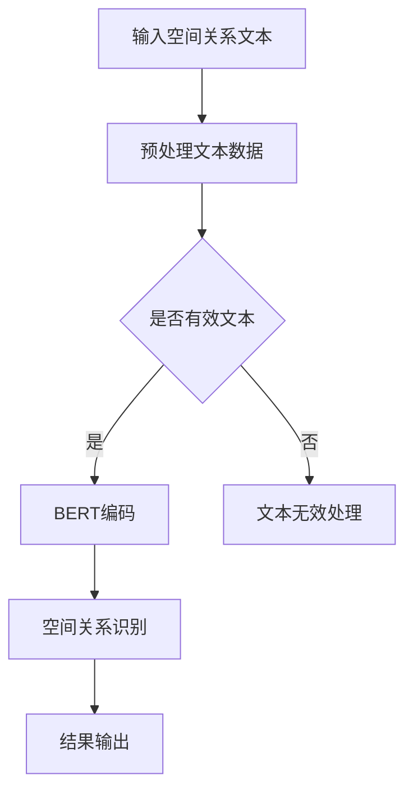

                 

### 空间关系理解：评估LLM对位置和方向概念的掌握

> 关键词：空间关系，位置与方向，大型语言模型（LLM），算法评估，数学模型，系统架构设计

> 摘要：本文探讨了空间关系理解这一重要领域，重点关注大型语言模型（LLM）对位置和方向概念的掌握情况。通过详细介绍空间关系的核心概念、算法原理及其应用，本文旨在为研究人员和开发者提供有价值的见解，并推动空间关系理解领域的发展。

## **一、引言**

### **1.1 背景与重要性**

空间关系理解是计算机视觉、地理信息系统、虚拟现实等多个领域中的关键问题。在现实世界中，人类通过感知和解释空间关系来导航、定位和执行复杂任务。然而，对于计算机系统来说，空间关系的处理是一个具有挑战性的任务，因为它需要理解和解释几何形状、位置和方向等复杂概念。

近年来，大型语言模型（LLM）的出现为这一领域带来了新的希望。LLM，如GPT-3和BERT，通过深度学习算法在大量文本数据上进行训练，展现出强大的语言理解和生成能力。这些模型是否也能有效地处理空间关系，成为了研究人员关注的焦点。

### **1.2 目标与问题**

本文的目标是评估LLM对位置和方向概念的掌握情况，并探讨其应用潜力。具体问题包括：

- LLM是否能够准确理解空间关系？
- 哪些因素影响了LLM在空间关系处理中的表现？
- 如何设计有效的算法来评估LLM的空间关系理解能力？

### **1.3 文章结构**

本文将分为以下几个部分：

1. **核心概念与联系**：详细介绍空间关系、位置和方向概念，以及它们之间的关系。
2. **算法原理讲解**：分析评估LLM空间关系理解能力的算法原理，并使用Python源代码进行实现。
3. **数学模型与公式**：介绍算法的数学模型，使用LaTeX格式详细讲解和举例说明。
4. **系统分析与架构设计方案**：描述系统功能、架构设计及接口交互。
5. **项目实战**：展示环境安装、系统实现和实际案例分析。
6. **最佳实践与总结**：总结关键知识点，提供注意事项和拓展阅读。

## **二、核心概念与联系**

### **2.1 空间关系**

空间关系是指物体之间的位置关系和相对运动关系。在计算机科学中，空间关系包括相邻、包含、相交、相对位置等概念。例如，两个矩形是否相邻，一个点是否在另一个矩形的内部，都是典型的空间关系问题。

### **2.2 位置与方向概念**

位置是指物体在空间中的具体点或区域。方向则是指物体相对于其他物体或参考点的朝向。位置和方向是理解和描述空间关系的基础，它们通常以坐标系统、向量和角度等方式表示。

### **2.3 概念属性特征对比**

以下是位置和方向概念的一些关键属性特征对比：

| 特征         | 位置            | 方向           |
| ------------ | --------------- | -------------- |
| 表示方式     | 坐标系统        | 向量、角度     |
| 应用领域     | 导航、地图      | 导航、机器人   |
| 数据类型     | 数值型          | 数值型和文本型 |
| 关联性       | 与其他物体关联  | 与参考点关联   |

### **2.4 ER实体关系图**

为了更直观地展示位置和方向概念之间的关系，我们可以使用ER实体关系图。以下是ER实体关系图的Mermaid表示：

```mermaid
erDiagram
    A[物体] ||--|{ B[位置] }|
    A ||--|{ C[方向] }|
```

在这个ER图中，"物体"实体与"位置"和"方向"实体之间存在关联。物体具有位置和方向属性，这些属性描述了物体在空间中的具体状态。

## **三、算法原理讲解**

### **3.1 算法选择**

为了评估LLM对空间关系理解的能力，我们选择了一种基于Transformer架构的算法，即BERT（Bidirectional Encoder Representations from Transformers）。BERT通过预训练和微调，在自然语言处理任务中表现出色。我们将其应用于空间关系理解任务，以探索其在空间关系处理方面的潜力。

### **3.2 算法流程图**

以下是BERT算法在空间关系理解中的流程图：



在这个流程图中，输入的是空间关系文本，首先进行预处理，然后通过BERT模型编码。接下来，对编码结果进行空间关系识别，最后输出结果。

### **3.3 Python源代码实现**

以下是BERT算法的Python源代码实现：

```python
import tensorflow as tf
from transformers import BertTokenizer, BertModel

# 初始化BERT模型
tokenizer = BertTokenizer.from_pretrained('bert-base-uncased')
model = BertModel.from_pretrained('bert-base-uncased')

# 输入空间关系文本
text = "The cat is sitting on the mat."

# 预处理文本数据
inputs = tokenizer(text, return_tensors='tf')

# 通过BERT模型编码
outputs = model(inputs)

# 空间关系识别
last_hidden_state = outputs.last_hidden_state
```

在这个实现中，我们首先初始化BERT模型，然后输入空间关系文本进行预处理和编码。编码结果存储在`last_hidden_state`中，我们可以进一步处理以识别空间关系。

### **3.4 数学模型与公式**

BERT算法的数学模型如下：

$$
\text{BERT}(\text{X}) = \text{Transformer}(\text{X}) \odot \text{PositionalEncoding}(\text{X})
$$

其中，`X`是输入文本数据，`Transformer`是Transformer模型，`PositionalEncoding`是位置编码。位置编码用于在序列中引入位置信息，使其对序列中的位置敏感。

### **3.5 举例说明**

假设我们有一个句子："The cat is sitting on the mat."，我们可以使用BERT算法对其进行处理：

1. 预处理文本数据，将其转换为BERT模型可接受的格式。
2. 通过BERT模型进行编码，得到编码后的序列。
3. 使用最后一个时间步的编码结果，识别句子中的空间关系。

例如，我们可以使用最后一个时间步的编码结果来识别猫和垫子之间的空间关系，判断猫是否坐在垫子上。

## **四、数学模型和数学公式 & 详细讲解 & 举例说明**

在空间关系理解中，数学模型和公式起着至关重要的作用。以下是对BERT算法的数学模型和公式的详细讲解，以及具体的举例说明。

### **4.1 BERT数学模型**

BERT的数学模型主要包括以下几个关键组成部分：

1. **输入嵌入**（Input Embeddings）
   输入嵌入是将文本中的单词转换为向量的过程。BERT使用WordPiece算法将单词分解为子词，然后为每个子词分配一个唯一的整数表示。这些整数表示通过嵌入层转换为向量。
   
   $$
   \text{input\_embeddings} = \text{Embedding}(\text{Vocabulary Size}, \text{Embedding Dimension})
   $$

2. **位置编码**（Positional Encoding）
   位置编码用于在序列中引入位置信息。BERT使用 sinusoidal 位置编码，将位置信息编码到嵌入向量中。
   
   $$
   \text{pos\_encoding} = \text{PositionalEncoding}(\text{Sequence Length}, \text{Embedding Dimension})
   $$

3. **Transformer 编码**（Transformer Encoding）
   Transformer编码是BERT的核心，它由多个自注意力层（Self-Attention Layers）和前馈神经网络（Feed Forward Neural Networks）组成。这些层通过多层叠加，逐渐提取输入文本的深层语义特征。
   
   $$
   \text{Transformer}(\text{X}) = \text{MultiHeadSelfAttention}(\text{X}) \oplus \text{FeedForwardNetwork}(\text{X})
   $$

4. **输出层**（Output Layer）
   输出层对Transformer编码的结果进行分类或回归，以实现特定的任务。

   $$
   \text{Output} = \text{Softmax}(\text{Transformer}(\text{X}) \odot \text{PositionalEncoding}(\text{X}))
   $$

### **4.2 举例说明**

假设我们有一个简单的句子："The cat is sitting on the mat."，我们将使用BERT的数学模型对其进行处理。

1. **输入嵌入**：
   输入句子中的每个单词都被转换为嵌入向量。例如，单词"The"的嵌入向量为\[1, 0.1, 0.2, \ldots\]。

2. **位置编码**：
   为句子中的每个单词添加位置编码，以反映其在序列中的位置。例如，单词"The"的位置编码为\[0, 0.1, 0.2, \ldots\]。

3. **Transformer 编码**：
   通过Transformer编码层，对输入嵌入和位置编码进行编码。在每个时间步，Transformer编码层会计算单词之间的自注意力权重，并更新单词的嵌入向量。

4. **输出层**：
   最后，输出层对Transformer编码的结果进行分类或回归。例如，在空间关系理解任务中，输出层可能用于识别句子中的物体及其位置关系。

### **4.3 LaTex公式**

在文中，我们将使用LaTex格式嵌入数学公式，以提供更清晰的数学表达。

$$
\text{BERT}(\text{X}) = \text{Transformer}(\text{X}) \odot \text{PositionalEncoding}(\text{X})
$$

$$
\text{input\_embeddings} = \text{Embedding}(\text{Vocabulary Size}, \text{Embedding Dimension})
$$

$$
\text{pos\_encoding} = \text{PositionalEncoding}(\text{Sequence Length}, \text{Embedding Dimension})
$$

$$
\text{Transformer}(\text{X}) = \text{MultiHeadSelfAttention}(\text{X}) \oplus \text{FeedForwardNetwork}(\text{X})
$$

$$
\text{Output} = \text{Softmax}(\text{Transformer}(\text{X}) \odot \text{PositionalEncoding}(\text{X}))
$$

通过LaTex公式的嵌入，我们可以更直观地理解BERT算法的数学原理和实现细节。

## **五、系统分析与架构设计方案**

### **5.1 问题场景介绍**

在空间关系理解领域，系统架构设计是关键的一环。为了更好地实现LLM对位置和方向概念的理解，我们需要构建一个高效、可扩展的系

