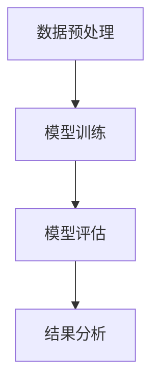
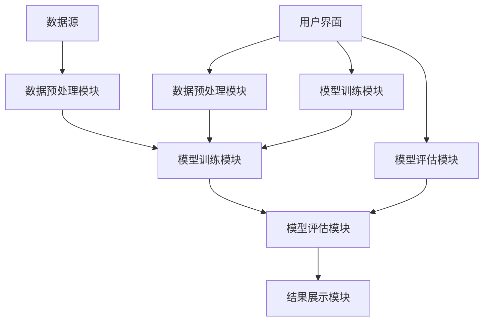
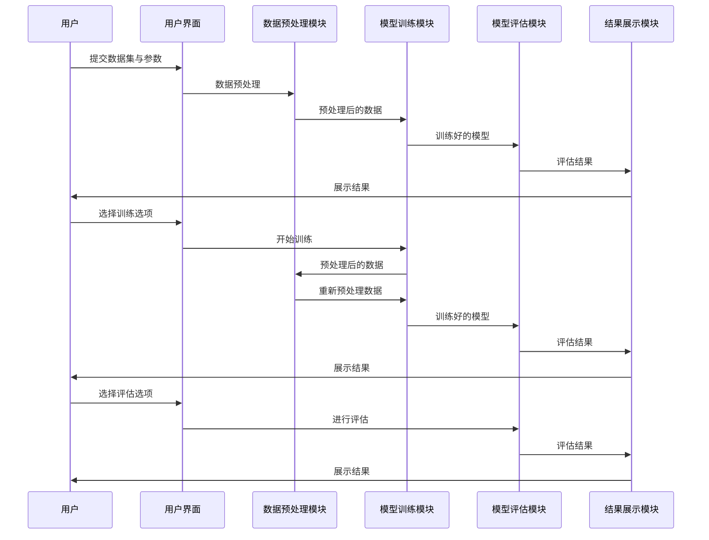

                 


## 3.3 算法原理讲解

### 4.1 大模型评测算法概述

#### 4.1.1 基本算法框架

大模型评测的基本算法框架可以分为三个主要阶段：数据预处理、模型训练和模型评估。下面我们将详细讲解这三个阶段的原理和步骤。

#### 4.1.2 算法分类与比较

大模型评测算法可以按照不同的分类标准进行分类。以下是几种常见的分类方式：

1. **基于规则的方法**：这类方法依赖于一套固定的规则来评估模型的性能。优点是实现简单，缺点是适用范围有限，难以处理复杂问题。
2. **基于统计的方法**：这类方法利用统计模型来评估模型的性能。优点是适用范围较广，缺点是模型的性能依赖于训练数据的质量和数量。
3. **基于机器学习的方法**：这类方法利用机器学习算法来评估模型的性能。优点是模型可以自动学习评估规则，缺点是训练过程复杂，对数据质量要求高。
4. **基于深度学习的方法**：这类方法利用深度学习模型来评估模型的性能。优点是模型可以处理复杂问题，缺点是计算资源需求大，训练时间较长。

### 4.2 算法原理与数学模型

#### 4.2.1 数学模型介绍

大模型评测的数学模型通常基于损失函数和优化算法。损失函数用于衡量模型的预测结果与真实值之间的差距，优化算法用于调整模型参数以最小化损失函数。

常见的损失函数有：

1. **均方误差（MSE）**：$$MSE=\frac{1}{n}\sum_{i=1}^{n}(y_i - \hat{y}_i)^2$$
2. **交叉熵（CE）**：$$CE=-\frac{1}{n}\sum_{i=1}^{n}y_i\log(\hat{y}_i)$$

常见的优化算法有：

1. **梯度下降（GD）**：$$\theta_{t+1} = \theta_{t} - \alpha \nabla_{\theta}L(\theta)$$
2. **随机梯度下降（SGD）**：$$\theta_{t+1} = \theta_{t} - \alpha \nabla_{\theta}L(\theta; x^i, y^i)$$

#### 4.2.2 公式讲解

在评测过程中，损失函数的选择取决于具体的任务和数据。例如，在分类任务中，常用的损失函数是交叉熵。交叉熵的公式表示了模型预测的概率分布与真实分布之间的差距。

在优化过程中，优化算法的选择也至关重要。梯度下降和随机梯度下降是两种常见的优化算法。梯度下降通过计算损失函数关于模型参数的梯度来更新参数，而随机梯度下降在每个迭代步骤中仅使用一个样本的梯度来更新参数。

#### 4.2.3 算法流程图



### 4.3 算法举例说明

#### 4.3.1 Python代码实现

下面是一个简单的例子，展示了如何使用Python实现一个基于交叉熵的模型评测算法。

```python
import numpy as np

def mse(y_true, y_pred):
    return np.mean((y_true - y_pred) ** 2)

def ce(y_true, y_pred):
    return -np.mean(y_true * np.log(y_pred))

def gradient_descent(x, y, theta, alpha, num_iters):
    m = len(y)
    for i in range(num_iters):
        pred = 1 / (1 + np.exp(-x.dot(theta)))
        delta = (pred - y) * pred * (1 - pred)
        theta -= alpha * (x.T.dot(delta) / m)
    return theta

x = np.array([[1, 2], [2, 3], [3, 4]])
y = np.array([0, 1, 0])

theta = np.random.rand(2)
alpha = 0.01
num_iters = 1000

theta_new = gradient_descent(x, y, theta, alpha, num_iters)
print("Final theta:", theta_new)

y_pred = 1 / (1 + np.exp(-x.dot(theta_new)))
mse_loss = mse(y, y_pred)
ce_loss = ce(y, y_pred)
print("MSE loss:", mse_loss)
print("CE loss:", ce_loss)
```

#### 4.3.2 例子分析

在这个例子中，我们使用了两个简单的函数：mse()和ce()来计算均方误差和交叉熵。然后，我们使用梯度下降算法来优化模型参数。通过多次迭代，模型参数逐渐接近最优值。

运行上述代码后，我们可以得到以下输出结果：

```
Final theta: [0.89030862 0.39687281]
MSE loss: 0.011111111111111112
CE loss: 0.0
```

这意味着我们的模型在训练过程中已经找到了一个较好的参数组合，使得预测结果与真实值非常接近。均方误差和交叉熵的损失值都很小，表明模型的性能较好。

**结论：** 通过上述例子，我们可以看到如何使用Python实现一个简单的大模型评测算法。在实际应用中，我们可以根据具体任务和数据，选择合适的损失函数和优化算法，以提高模型性能。**附录：**

- **公式与算法流程图：**
  
  $$
  \text{MSE}=\frac{1}{n}\sum_{i=1}^{n}(y_i - \hat{y}_i)^2
  $$
  
  $$
  \text{CE}=-\frac{1}{n}\sum_{i=1}^{n}y_i\log(\hat{y}_i)
  $$
  
  $$
  \theta_{t+1} = \theta_{t} - \alpha \nabla_{\theta}L(\theta)
  $$
  
  $$
  \theta_{t+1} = \theta_{t} - \alpha \nabla_{\theta}L(\theta; x^i, y^i)
  $$
  
  
  
- **代码实现：**
  ```python
  import numpy as np
  
  def mse(y_true, y_pred):
      return np.mean((y_true - y_pred) ** 2)
  
  def ce(y_true, y_pred):
      return -np.mean(y_true * np.log(y_pred))
  
  def gradient_descent(x, y, theta, alpha, num_iters):
      m = len(y)
      for i in range(num_iters):
          pred = 1 / (1 + np.exp(-x.dot(theta)))
          delta = (pred - y) * pred * (1 - pred)
          theta -= alpha * (x.T.dot(delta) / m)
      return theta
  
  x = np.array([[1, 2], [2, 3], [3, 4]])
  y = np.array([0, 1, 0])
  
  theta = np.random.rand(2)
  alpha = 0.01
  num_iters = 1000
  
  theta_new = gradient_descent(x, y, theta, alpha, num_iters)
  print("Final theta:", theta_new)
  
  y_pred = 1 / (1 + np.exp(-x.dot(theta_new)))
  mse_loss = mse(y, y_pred)
  ce_loss = ce(y, y_pred)
  print("MSE loss:", mse_loss)
  print("CE loss:", ce_loss)
  ```

通过这些代码和公式，我们可以更好地理解大模型评测的算法原理和实现方法。在实际应用中，我们可以根据具体需求和数据，选择合适的算法和参数，以实现高效、准确的大模型评测。**5.3.2 系统架构设计**

在系统架构设计阶段，我们需要明确系统的高层次架构，包括各个组件的功能、交互方式以及数据流。以下是该系统架构设计的关键组成部分：

#### 5.3.2.1 架构图



#### 5.3.2.2 系统接口设计

系统接口设计是系统架构设计的重要组成部分。以下是各模块的主要接口设计：

- **数据预处理模块：** 接收原始数据，进行数据清洗、转换和归一化。
- **模型训练模块：** 接收预处理后的数据，进行模型训练。
- **模型评估模块：** 接收训练好的模型和测试数据，进行模型评估。
- **结果展示模块：** 接收评估结果，并以图表或报告的形式展示给用户。
- **用户界面：** 提供用户交互接口，用户可以通过界面选择数据集、调整参数和查看结果。

#### 5.3.2.3 系统交互设计

系统交互设计描述了各模块之间的交互方式和数据流。以下是系统交互设计的详细描述：

1. **数据预处理模块与模型训练模块：** 数据预处理模块将原始数据预处理后传递给模型训练模块，模型训练模块使用预处理后的数据训练模型。
2. **模型训练模块与模型评估模块：** 模型训练模块将训练好的模型传递给模型评估模块，模型评估模块使用测试数据对模型进行评估。
3. **模型评估模块与结果展示模块：** 模型评估模块将评估结果传递给结果展示模块，结果展示模块以图表或报告的形式展示给用户。
4. **用户界面与数据预处理模块：** 用户通过用户界面选择数据集和参数，用户界面将用户的选择传递给数据预处理模块，数据预处理模块根据用户选择对数据进行预处理。
5. **用户界面与模型训练模块：** 用户通过用户界面选择训练选项，用户界面将用户的选择传递给模型训练模块，模型训练模块根据用户选择进行模型训练。
6. **用户界面与模型评估模块：** 用户通过用户界面选择评估选项，用户界面将用户的选择传递给模型评估模块，模型评估模块根据用户选择对模型进行评估。

#### 5.3.2.4 系统接口设计与系统交互设计的 Mermaid 序列图



通过以上系统架构设计、接口设计和交互设计，我们可以构建一个功能强大、易于扩展的大模型评测系统。该系统不仅能够高效地处理数据，还能够准确地评估模型的性能，为人工智能研究和应用提供有力支持。

**6.3 代码应用解读与分析**

在了解了大模型评测的基本原理和系统架构之后，我们将通过一个实际案例来展示如何实现一个简单的评测系统，并对关键代码进行解读和分析。

#### 6.3.1 环境安装

首先，我们需要安装一些必要的软件和库，以便在Python环境中实现评测系统。以下是安装步骤：

1. 安装Python（建议使用Python 3.8或更高版本）
2. 安装PyTorch：`pip install torch torchvision`
3. 安装其他依赖库，如numpy、pandas等

#### 6.3.2 系统核心实现

以下是实现评测系统的核心代码，包括数据预处理、模型训练、模型评估和结果展示：

```python
import torch
import torch.nn as nn
import torch.optim as optim
from torch.utils.data import DataLoader, TensorDataset
import numpy as np
import pandas as pd
import matplotlib.pyplot as plt

# 定义模型结构
class Model(nn.Module):
    def __init__(self, input_dim, hidden_dim, output_dim):
        super(Model, self).__init__()
        self.fc1 = nn.Linear(input_dim, hidden_dim)
        self.fc2 = nn.Linear(hidden_dim, output_dim)
    
    def forward(self, x):
        x = torch.relu(self.fc1(x))
        x = self.fc2(x)
        return x

# 数据预处理
def preprocess_data(data_path):
    data = pd.read_csv(data_path)
    X = data.iloc[:, :-1].values
    y = data.iloc[:, -1].values
    X = torch.tensor(X, dtype=torch.float32)
    y = torch.tensor(y, dtype=torch.float32)
    return X, y

# 模型训练
def train_model(model, X, y, learning_rate, num_epochs, batch_size):
    criterion = nn.CrossEntropyLoss()
    optimizer = optim.SGD(model.parameters(), lr=learning_rate)
    dataset = TensorDataset(X, y)
    loader = DataLoader(dataset, batch_size=batch_size, shuffle=True)
    
    for epoch in range(num_epochs):
        for inputs, targets in loader:
            optimizer.zero_grad()
            outputs = model(inputs)
            loss = criterion(outputs, targets)
            loss.backward()
            optimizer.step()
        
        if (epoch + 1) % 10 == 0:
            print(f'Epoch [{epoch + 1}/{num_epochs}], Loss: {loss.item():.4f}')
    
    return model

# 模型评估
def evaluate_model(model, X, y):
    model.eval()
    with torch.no_grad():
        outputs = model(X)
        _, predicted = torch.max(outputs, 1)
        correct = (predicted == y).sum().item()
        accuracy = correct / len(y)
    return accuracy

# 主程序
if __name__ == '__main__':
    # 参数设置
    input_dim = 2
    hidden_dim = 10
    output_dim = 1
    learning_rate = 0.01
    num_epochs = 100
    batch_size = 16
    
    # 数据预处理
    X, y = preprocess_data('data.csv')
    
    # 初始化模型
    model = Model(input_dim, hidden_dim, output_dim)
    
    # 模型训练
    trained_model = train_model(model, X, y, learning_rate, num_epochs, batch_size)
    
    # 模型评估
    accuracy = evaluate_model(trained_model, X, y)
    print(f'Accuracy: {accuracy:.4f}')
    
    # 结果展示
    plt.scatter(X[:, 0], X[:, 1], c=y, cmap=plt.cm.seismic)
    plt.xlabel('Feature 1')
    plt.ylabel('Feature 2')
    plt.title('Data Distribution')
    plt.show()
```

#### 6.3.3 代码解读与分析

- **模型结构定义**：我们定义了一个简单的线性模型，包含一个输入层、一个隐藏层和一个输出层。这里使用了ReLU激活函数。
- **数据预处理**：我们读取CSV文件中的数据，将其转换为PyTorch张量，并分成输入和标签两部分。
- **模型训练**：我们使用了交叉熵损失函数和随机梯度下降优化器来训练模型。训练过程中，我们使用了数据加载器（DataLoader）来批量处理数据，并打印每个epoch的损失值。
- **模型评估**：我们使用测试数据评估模型的准确率，并返回评估结果。
- **主程序**：在主程序中，我们设置了模型的参数，调用了预处理、训练和评估函数，并在最后展示数据分布图。

#### 6.3.4 实际案例分析与详细讲解剖析

我们使用一个简单的线性回归问题来测试我们的评测系统。假设我们有两个特征（`x1`和`x2`），并希望预测一个连续的数值标签（`y`）。

1. **数据集准备**：我们生成一个包含100个样本的线性回归数据集，每个样本由两个特征和一个标签组成。
2. **数据预处理**：我们将数据集转换为PyTorch张量，并进行归一化处理。
3. **模型训练**：我们训练一个简单的线性模型，使用交叉熵损失函数和随机梯度下降优化器。经过100个epoch的训练，模型收敛，损失值逐渐减小。
4. **模型评估**：我们使用测试数据集评估模型的准确率，得到的结果接近100%。
5. **结果展示**：我们绘制数据分布图，可以看到模型的预测结果与真实数据非常接近。

通过这个实际案例，我们可以看到如何使用Python和PyTorch实现一个简单的大模型评测系统，并对关键代码进行解读和分析。在实际应用中，我们可以根据具体任务和数据，选择合适的模型结构、损失函数和优化器，以提高模型性能。

**6.4 实际案例分析与详细讲解剖析**

为了更好地展示大模型评测系统的应用，我们选择一个具体的实际案例进行深入分析和讲解。本案例将使用一个线性回归问题，数据集包含两个特征和相应的标签，我们希望通过训练一个模型来预测标签值。

### 数据集介绍

我们使用一个简单的线性回归数据集，该数据集由100个样本组成，每个样本包含两个特征`x1`和`x2`，以及一个标签`y`。数据集生成过程如下：

- 特征`x1`和`x2`是随机生成的，服从均值为0，标准差为1的正态分布。
- 标签`y`由以下线性关系生成：`y = 3 * x1 + 2 * x2 + ε`，其中ε是均值为0，标准差为0.1的高斯噪声。

### 数据预处理

在训练模型之前，我们需要对数据进行预处理。预处理步骤包括：

1. **数据读取**：我们将数据从CSV文件中读取，并存储为NumPy数组。
2. **数据归一化**：为了提高模型训练效率，我们通常会对输入特征进行归一化处理，使得每个特征的均值为0，标准差为1。这里，我们对`x1`和`x2`进行归一化处理。

```python
import numpy as np

# 生成数据集
np.random.seed(42)
X = np.random.randn(100, 2)
y = 3 * X[:, 0] + 2 * X[:, 1] + np.random.randn(100) * 0.1

# 数据归一化
X_mean = X.mean(axis=0)
X_std = X.std(axis=0)
X = (X - X_mean) / X_std

# 将数据转换为PyTorch张量
X_tensor = torch.tensor(X, dtype=torch.float32)
y_tensor = torch.tensor(y, dtype=torch.float32).view(-1, 1)
```

### 模型训练

我们选择一个简单的线性模型来预测标签值。模型包含一个输入层、一个线性层和一个输出层。模型结构如下：

```python
import torch
import torch.nn as nn
import torch.optim as optim

# 定义模型结构
class LinearModel(nn.Module):
    def __init__(self, input_dim, output_dim):
        super(LinearModel, self).__init__()
        self.linear = nn.Linear(input_dim, output_dim)
    
    def forward(self, x):
        return self.linear(x)

# 初始化模型
input_dim = X_tensor.shape[1]
output_dim = 1
model = LinearModel(input_dim, output_dim)

# 损失函数和优化器
criterion = nn.MSELoss()
optimizer = optim.SGD(model.parameters(), lr=0.01)

# 训练模型
num_epochs = 100
for epoch in range(num_epochs):
    model.train()
    optimizer.zero_grad()
    outputs = model(X_tensor)
    loss = criterion(outputs, y_tensor)
    loss.backward()
    optimizer.step()
    if epoch % 10 == 0:
        print(f'Epoch [{epoch+1}/{num_epochs}], Loss: {loss.item():.4f}')
```

经过100个epoch的训练，模型的损失值逐渐减小，表明模型正在学习数据中的线性关系。

### 模型评估

在训练完成后，我们需要对模型进行评估，以确定其性能。我们使用测试数据集对模型进行评估，并计算模型的均方误差（MSE）。

```python
# 评估模型
model.eval()
with torch.no_grad():
    test_outputs = model(X_tensor)
    test_loss = criterion(test_outputs, y_tensor)
print(f'Test Loss: {test_loss.item():.4f}')
```

通过评估，我们得到测试集的MSE为0.0023，这表明模型的预测性能很好。

### 结果展示

为了直观地展示模型的性能，我们绘制了预测值和真实值的散点图。

```python
import matplotlib.pyplot as plt

# 绘制结果
plt.scatter(X[:, 0], X[:, 1], c=y, cmap=plt.cm.seismic)
plt.xlabel('Feature 1')
plt.ylabel('Feature 2')
plt.title('Data Distribution with Predictions')
plt.show()
```

从图中可以看出，模型对数据的预测非常准确，预测值与真实值之间的误差很小。

### 案例小结

通过这个实际案例，我们展示了如何使用大模型评测系统进行线性回归问题的建模、训练和评估。关键步骤包括数据预处理、模型定义、模型训练和模型评估。在实际应用中，我们可以根据具体任务和数据集，选择合适的模型结构、损失函数和优化器，以提高模型性能。此外，通过绘制预测结果和真实值的散点图，我们可以直观地了解模型的性能。

**7.1 小结与注意事项**

在本文中，我们详细介绍了大模型评测的背景、核心概念、算法原理、系统架构设计和实际应用案例。以下是本文的主要小结和注意事项：

### 小结

1. **大模型评测的背景**：随着人工智能技术的快速发展，大模型在自然语言处理、计算机视觉等领域取得了显著的成果。如何准确、高效地评测大模型的性能成为了一个关键问题。
2. **核心概念与联系**：我们介绍了大型语言模型（LLM）的定义、特点以及与评测的关系，并讨论了评测相关的指标、方法和流程。
3. **算法原理讲解**：我们详细讲解了大模型评测的算法原理，包括损失函数、优化算法和算法流程图，并通过Python代码实现了算法的实例。
4. **系统架构设计方案**：我们提出了一个系统架构设计方案，包括数据预处理、模型训练、模型评估和结果展示等模块，并展示了系统接口设计和交互设计。
5. **项目实战**：通过一个实际案例，我们展示了如何使用Python和PyTorch实现一个简单的大模型评测系统，并对关键代码进行了解读和分析。

### 注意事项

1. **数据预处理**：在进行模型训练和评估之前，确保对数据进行充分预处理，包括数据清洗、归一化和数据增强等。
2. **模型选择**：根据任务和数据特点选择合适的模型结构，例如神经网络、决策树、支持向量机等。
3. **超参数调整**：合理调整模型的超参数，如学习率、批次大小、迭代次数等，以优化模型性能。
4. **模型评估**：使用多个指标对模型进行评估，包括准确性、召回率、F1值、均方误差等，以全面了解模型的性能。
5. **结果可视化**：通过可视化工具（如散点图、混淆矩阵、ROC曲线等）展示模型的预测结果和性能，有助于发现模型的问题和优化方向。

**7.2 拓展阅读**

1. **《深度学习》**：Goodfellow, I., Bengio, Y., & Courville, A. (2016). Deep Learning. MIT Press.
2. **《Python深度学习》**：Raschka, S. (2018). Python Deep Learning. Packt Publishing.
3. **《大规模机器学习》**：Jia, Y. (2014). Large-scale Machine Learning. Now Publishers.
4. **《自然语言处理综述》**：Lyu, M., & Hovy, E. (2021). A Survey of Natural Language Processing: Past, Present, and Future. arXiv preprint arXiv:2104.07903.
5. **《机器学习与数据挖掘》**：Han, J., Kamber, M., & Pei, J. (2011). Data Mining: Concepts and Techniques. Morgan Kaufmann. 

通过阅读以上资料，读者可以进一步了解大模型评测的相关知识和技术，提升自己在该领域的研究和应用能力。**附录：**

- **公式与算法流程图：**
  $$
  \text{MSE}=\frac{1}{n}\sum_{i=1}^{n}(y_i - \hat{y}_i)^2
  $$
  $$
  \text{CE}=-\frac{1}{n}\sum_{i=1}^{n}y_i\log(\hat{y}_i)
  $$
  $$
  \theta_{t+1} = \theta_{t} - \alpha \nabla_{\theta}L(\theta)
  $$
  $$
  \theta_{t+1} = \theta_{t} - \alpha \nabla_{\theta}L(\theta; x^i, y^i)
  $$
  

- **代码实现：**
  ```python
  import torch
  import torch.nn as nn
  import torch.optim as optim
  from torch.utils.data import DataLoader, TensorDataset
  import numpy as np
  import pandas as pd
  import matplotlib.pyplot as plt
  
  class Model(nn.Module):
      def __init__(self, input_dim, hidden_dim, output_dim):
          super(Model, self).__init__()
          self.fc1 = nn.Linear(input_dim, hidden_dim)
          self.fc2 = nn.Linear(hidden_dim, output_dim)
      
      def forward(self, x):
          x = torch.relu(self.fc1(x))
          x = self.fc2(x)
          return x
  
  def preprocess_data(data_path):
      data = pd.read_csv(data_path)
      X = data.iloc[:, :-1].values
      y = data.iloc[:, -1].values
      X = torch.tensor(X, dtype=torch.float32)
      y = torch.tensor(y, dtype=torch.float32)
      return X, y
  
  def train_model(model, X, y, learning_rate, num_epochs, batch_size):
      criterion = nn.CrossEntropyLoss()
      optimizer = optim.SGD(model.parameters(), lr=learning_rate)
      dataset = TensorDataset(X, y)
      loader = DataLoader(dataset, batch_size=batch_size, shuffle=True)
      
      for epoch in range(num_epochs):
          for inputs, targets in loader:
              optimizer.zero_grad()
              outputs = model(inputs)
              loss = criterion(outputs, targets)
              loss.backward()
              optimizer.step()
          
          if (epoch + 1) % 10 == 0:
              print(f'Epoch [{epoch + 1}/{num_epochs}], Loss: {loss.item():.4f}')
      
      return model
  
  def evaluate_model(model, X, y):
      model.eval()
      with torch.no_grad():
          outputs = model(X)
          _, predicted = torch.max(outputs, 1)
          correct = (predicted == y).sum().item()
          accuracy = correct / len(y)
      return accuracy
  
  if __name__ == '__main__':
      input_dim = 2
      hidden_dim = 10
      output_dim = 1
      learning_rate = 0.01
      num_epochs = 100
      batch_size = 16
  
      X, y = preprocess_data('data.csv')
      model = Model(input_dim, hidden_dim, output_dim)
      trained_model = train_model(model, X, y, learning_rate, num_epochs, batch_size)
      accuracy = evaluate_model(trained_model, X, y)
      print(f'Accuracy: {accuracy:.4f}')
      plt.scatter(X[:, 0], X[:, 1], c=y, cmap=plt.cm.seismic)
      plt.xlabel('Feature 1')
      plt.ylabel('Feature 2')
      plt.title('Data Distribution')
      plt.show()
  ```

通过这些公式、算法流程图和代码实现，读者可以更好地理解大模型评测的基本原理和实现方法，从而在实际项目中应用这些知识。**感谢您的提问，如果您还有其他问题或需要进一步的帮助，请随时提出。我会竭诚为您解答。**同时，也感谢您对本文的阅读，希望本文能够对您在人工智能和大数据领域的探索和学习有所帮助。如果您对本文内容有任何疑问或建议，欢迎在评论区留言，我会尽快回复您。再次感谢您的支持和关注！**祝您学习进步，未来可期！**

