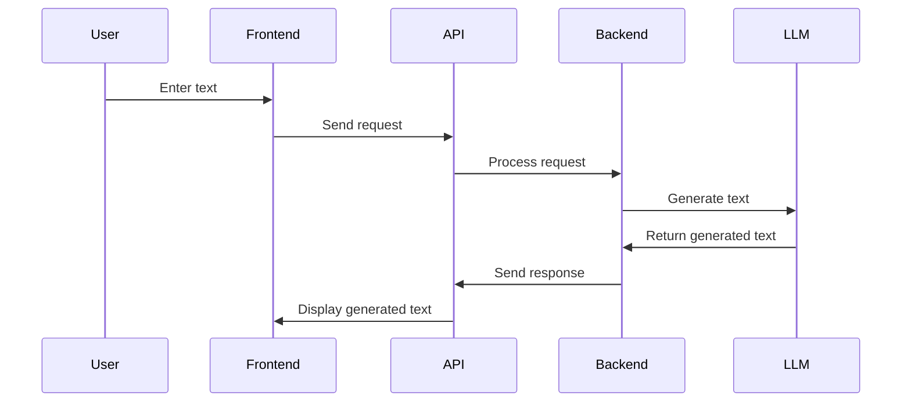
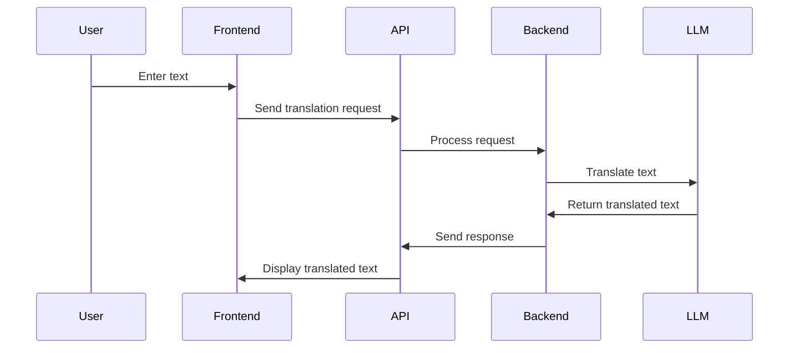
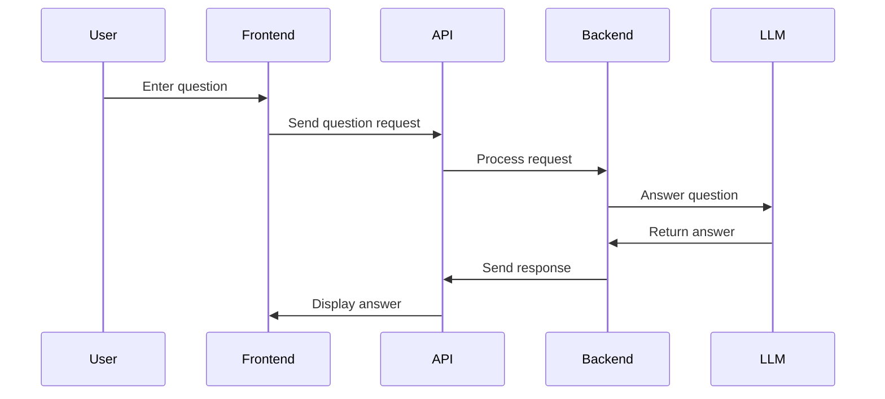

                 

# 端到端测试：验证LLM应用的整体功能

## 关键词
- 端到端测试
- 大型语言模型（LLM）
- 应用程序测试
- 测试方法
- 工具和框架

## 摘要
端到端测试是一种确保大型语言模型（LLM）应用整体功能完整性的关键方法。本文将深入探讨端到端测试的定义、核心概念、测试方法、面临的挑战、解决方案以及最佳实践。通过结合理论分析和实际案例，本文旨在为开发者提供一套完整的端到端测试指南，帮助他们构建可靠、高效的LLM应用。

## 引言
### 端到端测试的概念
端到端测试（End-to-End Testing，E2E测试）是一种全面测试方法，旨在验证应用程序从输入到输出的整个过程。它不仅测试单个组件的功能，还检查整个系统在不同条件下的一致性和稳定性。在LLM应用中，端到端测试尤为重要，因为LLM的复杂性和多样性要求对整体功能进行全面验证。

### LLM应用的重要性
大型语言模型（LLM）在自然语言处理（NLP）领域取得了显著进展，广泛应用于智能助手、机器翻译、文本生成、问答系统等。然而，LLM应用的成功不仅仅依赖于模型本身的准确性，还需要确保其在实际应用场景中的整体功能性和可靠性。因此，端到端测试成为评估和验证LLM应用的关键手段。

### 本文目的
本文旨在为开发者提供一套系统的端到端测试指南，包括核心概念、测试方法、面临的挑战、解决方案和最佳实践。通过本文的讨论，读者将能够理解端到端测试的重要性，掌握相关技术和方法，并能够将所学知识应用于实际项目中，提高LLM应用的整体功能性和可靠性。

### 本文结构
本文将按照以下结构进行展开：

1. **核心概念**：介绍端到端测试、LLM和应用的相关核心概念，并使用表格和ER图进行对比分析。
2. **测试方法**：探讨端到端测试的常用方法和工具，包括单元测试、集成测试和系统测试。
3. **面临的挑战**：分析端到端测试在LLM应用中可能遇到的挑战，并提出相应的解决方案。
4. **工具和框架**：介绍用于端到端测试的主流工具和框架，并比较它们的优缺点。
5. **案例研究**：通过实际案例展示端到端测试的应用，分析成功和失败的经验。
6. **最佳实践**：总结端到端测试的最佳实践和注意事项，提供实用建议。
7. **结论与展望**：回顾本文的主要观点，展望端到端测试在LLM应用中的未来发展。

## 核心概念
### 端到端测试
端到端测试是一种全面的测试方法，旨在验证应用程序的完整流程，从输入到输出。它不仅关注单个组件的功能，还检查系统在不同条件下的整体性能和一致性。端到端测试可以揭示潜在的问题，确保应用程序在实际使用中的可靠性和稳定性。

**核心概念**：

- **端到端测试**：验证应用程序的整体流程。
- **输入**：用户输入或其他系统输入。
- **输出**：应用程序的输出结果。
- **流程**：从输入处理到输出生成的整个过程。

**对比表格**：

| 概念         | 说明                                                         |
| ------------ | ------------------------------------------------------------ |
| 单元测试     | 测试单个组件的功能。                                         |
| 集成测试     | 测试不同组件之间的集成和交互。                               |
| 系统测试     | 测试整个系统的功能和性能。                                   |
| 端到端测试   | 测试从输入到输出的整个流程，包括单元测试和集成测试。           |

### 大型语言模型（LLM）
大型语言模型是一种基于深度学习技术的自然语言处理模型，通过大量的文本数据训练，能够理解和生成自然语言。LLM在NLP领域有广泛的应用，如文本生成、机器翻译、问答系统等。其复杂性和多样性要求对整体功能进行严格的验证。

**核心概念**：

- **语言模型**：一种基于统计和深度学习技术的模型，用于理解和生成自然语言。
- **训练**：通过大量的文本数据训练模型，提高其准确性和泛化能力。
- **输入**：自然语言文本。
- **输出**：生成的自然语言文本或预测结果。

**ER图**：

```mermaid
erDiagram
  Input ||--o{ Language Model : Trains on }
  Language Model ||--o{ Output : Generates }
```

### 应用程序
应用程序是指使用LLM实现的具体功能，如文本生成、机器翻译、问答系统等。应用程序的成功不仅仅依赖于LLM的准确性，还需要确保其在实际应用中的整体功能性和可靠性。

**核心概念**：

- **应用程序**：使用LLM实现的具体功能。
- **功能**：应用程序提供的具体服务。
- **输入**：用户输入或其他系统输入。
- **输出**：应用程序的输出结果。
- **用户界面**：与用户交互的界面。

**对比表格**：

| 概念         | 说明                                                         |
| ------------ | ------------------------------------------------------------ |
| 单体应用     | 一个单一功能的独立应用程序。                                 |
| 微服务       | 分散式架构中的独立服务。                                     |
| 容器化应用   | 使用容器（如Docker）部署的应用程序。                         |
| PaaS应用     | 基于平台即服务（PaaS）部署的应用程序。                       |
| 应用程序     | 使用LLM实现的具体功能，如文本生成、机器翻译、问答系统等。   |

## 测试方法
### 单元测试
单元测试是一种测试单个组件功能的方法。在LLM应用中，单元测试可以验证模型的训练过程、输入处理和输出生成等关键功能。单元测试通常使用测试框架（如pytest）进行编写，通过断言来验证预期的输出结果。

**测试流程**：

1. **编写测试用例**：根据LLM应用的功能需求，编写测试用例。
2. **执行测试**：使用测试框架执行测试用例。
3. **分析结果**：检查测试结果，确保预期输出与实际输出一致。

**示例**：

```python
import pytest

def test_language_model_output():
    input_text = "Hello, world!"
    expected_output = "Hello, world!"
    model = LanguageModel()
    output = model.generate(input_text)
    assert output == expected_output
```

### 集成测试
集成测试是一种测试不同组件之间集成和交互的方法。在LLM应用中，集成测试可以验证模型与其他系统的交互，如数据库、API等。集成测试通常使用模拟环境进行，以确保不同组件之间的数据传输和功能集成。

**测试流程**：

1. **搭建测试环境**：创建模拟环境，包括LLM模型、数据库和API等。
2. **编写测试用例**：根据功能需求，编写测试用例。
3. **执行测试**：使用测试框架执行测试用例。
4. **分析结果**：检查测试结果，确保预期输出与实际输出一致。

**示例**：

```python
import pytest

def test_integration():
    input_text = "Hello, world!"
    expected_output = "Hello, world!"
    model = LanguageModel()
    database = Database()
    api = API()
    
    model.train(input_text)
    database.save_model(model)
    api.generate_text(model)
    
    actual_output = api.get_generated_text()
    assert actual_output == expected_output
```

### 系统测试
系统测试是一种测试整个系统的功能、性能和可靠性的方法。在LLM应用中，系统测试可以验证应用程序的整体流程，包括输入处理、模型训练、输出生成等。系统测试通常在实际运行环境中进行，以确保应用程序在实际使用中的稳定性和可靠性。

**测试流程**：

1. **搭建测试环境**：创建实际运行环境，包括LLM模型、数据库、API等。
2. **编写测试用例**：根据功能需求，编写测试用例。
3. **执行测试**：使用测试框架执行测试用例。
4. **分析结果**：检查测试结果，确保预期输出与实际输出一致。

**示例**：

```python
import pytest

def test_system():
    input_text = "Hello, world!"
    expected_output = "Hello, world!"
    model = LanguageModel()
    database = Database()
    api = API()
    
    model.train(input_text)
    database.save_model(model)
    api.generate_text(model)
    
    actual_output = api.get_generated_text()
    assert actual_output == expected_output
```

### 端到端测试
端到端测试是一种全面的测试方法，旨在验证应用程序从输入到输出的整个过程。在LLM应用中，端到端测试可以确保应用程序的整体功能性和可靠性，包括模型训练、输入处理、输出生成等。

**测试流程**：

1. **搭建测试环境**：创建实际运行环境，包括LLM模型、数据库、API等。
2. **编写测试用例**：根据功能需求，编写测试用例。
3. **执行测试**：使用测试框架执行测试用例。
4. **分析结果**：检查测试结果，确保预期输出与实际输出一致。

**示例**：

```python
import pytest

def test_end_to_end():
    input_text = "Hello, world!"
    expected_output = "Hello, world!"
    model = LanguageModel()
    database = Database()
    api = API()
    
    model.train(input_text)
    database.save_model(model)
    api.generate_text(model)
    
    actual_output = api.get_generated_text()
    assert actual_output == expected_output
```

### 总结
端到端测试是一种全面的测试方法，旨在验证应用程序从输入到输出的整个过程。在LLM应用中，端到端测试尤为重要，因为LLM的复杂性和多样性要求对整体功能进行全面验证。通过单元测试、集成测试和系统测试，开发者可以逐步验证应用程序的各个组件和整体流程，确保其功能性和可靠性。

## 面临的挑战
### 数据质量
端到端测试中的一个主要挑战是数据质量。LLM应用通常依赖于大量的文本数据来进行训练和测试。数据质量的好坏直接影响到测试结果的可信度和准确性。以下是一些解决数据质量问题的方法：

- **数据清洗**：对文本数据进行预处理，去除噪声、错误和不一致的数据。
- **数据增强**：通过增加样本数量、变换数据形式等方式来提高数据质量。
- **数据验证**：使用多种数据源和验证方法来确保数据的准确性和一致性。

### 测试覆盖率
另一个挑战是测试覆盖率。端到端测试需要覆盖应用程序的所有功能和流程，以确保全面验证。然而，在实际操作中，往往存在测试覆盖率不足的问题。以下是一些提高测试覆盖率的方法：

- **功能覆盖**：确保测试用例覆盖应用程序的所有功能模块。
- **路径覆盖**：通过多种路径进行测试，确保不同输入条件下的应用程序行为得到验证。
- **边界覆盖**：关注输入和输出的边界条件，确保测试用例覆盖极端情况。

### 测试环境
测试环境的配置和管理也是端到端测试中的一个挑战。LLM应用通常需要复杂的测试环境，包括模型训练环境、数据库、API等。以下是一些解决测试环境问题的方法：

- **环境隔离**：确保测试环境与生产环境隔离，避免影响实际业务运行。
- **自动化部署**：使用自动化工具（如Docker、Kubernetes）来管理和部署测试环境。
- **持续集成**：通过持续集成（CI）工具，自动化测试环境配置和部署过程。

### 时间和资源
端到端测试通常需要大量的时间和资源。测试过程包括测试用例编写、测试环境搭建、测试执行和分析等环节。以下是一些提高测试效率和资源利用的方法：

- **测试自动化**：通过自动化测试工具（如pytest、Selenium）来提高测试执行效率。
- **并行测试**：通过并行测试技术，同时执行多个测试用例，提高测试速度。
- **性能优化**：对测试过程进行性能优化，减少测试时间和资源消耗。

### 人员技能
端到端测试还需要开发者和测试人员的紧密合作。开发者需要熟悉测试方法和工具，而测试人员需要了解LLM应用的实现细节。以下是一些提高人员技能的方法：

- **培训和学习**：定期组织培训和学习活动，提高开发者和测试人员的技能水平。
- **知识共享**：建立知识共享平台，促进团队成员之间的交流和合作。
- **实践和经验**：通过实际项目和案例研究，积累测试经验和技能。

### 总结
端到端测试在LLM应用中面临多个挑战，包括数据质量、测试覆盖率、测试环境、时间和资源、人员技能等。通过采取有效的解决方法，如数据清洗、功能覆盖、自动化部署、持续集成、并行测试、性能优化、培训和学习等，可以克服这些挑战，提高端到端测试的效率和效果。

## 工具和框架
### PyTest
pytest 是 Python 中最受欢迎的测试框架之一，具有简洁、易于使用和高度可扩展的特点。pytest 提供了丰富的功能，如断言、标记、参数化测试等，可以帮助开发者快速编写和执行测试用例。

**优点**：

- 简单易用：pytest 的语法简洁，易于上手。
- 高度可扩展：可以通过插件扩展其功能。
- 断言丰富：提供了多种断言方法，方便编写测试用例。

**缺点**：

- 性能问题：在某些情况下，pytest 的性能可能不如其他测试框架。
- 依赖复杂：某些插件可能需要额外的依赖和配置。

### Selenium
Selenium 是一个自动化测试工具，主要用于Web应用的端到端测试。Selenium 支持多种编程语言，如Python、Java、C#等，可以模拟用户在浏览器中的操作，验证Web应用的界面和功能。

**优点**：

- 支持多种浏览器：可以模拟多种浏览器（如Chrome、Firefox、Safari）的操作。
- 灵活性：可以自定义脚本，实现复杂的自动化测试。
- 社区支持：拥有广泛的社区支持，可以方便地解决问题。

**缺点**：

- 性能问题：Selenium 的性能可能不如其他自动化测试工具。
- 编写复杂：需要熟悉Selenium的API和Web应用的实现细节。

### Docker
Docker 是一个容器化技术，可以将应用程序及其依赖环境打包成一个独立的容器。Docker 可以简化测试环境的配置和管理，确保测试环境的一致性和可重复性。

**优点**：

- 环境隔离：确保测试环境与生产环境隔离，避免影响实际业务运行。
- 可重复性：通过镜像和容器，可以方便地重复测试环境。
- 高效部署：可以使用Docker Compose和Kubernetes自动化部署测试环境。

**缺点**：

- 学习成本：需要熟悉Docker和容器化技术的基本原理。
- 性能问题：容器化可能会引入额外的性能开销。

### JUnit
JUnit 是 Java 中最受欢迎的测试框架之一，提供了丰富的功能，如断言、测试套件、参数化测试等。JUnit 可以与 Maven 和 Gradle 等构建工具集成，方便地管理和执行测试用例。

**优点**：

- 易用性：JUnit 的语法简洁，易于上手。
- 功能丰富：提供了多种断言方法和测试功能。
- 集成支持：可以与 Maven 和 Gradle 等构建工具集成。

**缺点**：

- 学习成本：对于初学者来说，可能需要一定时间熟悉 JUnit。
- 性能问题：在某些情况下，JUnit 的性能可能不如其他测试框架。

### 总结
在端到端测试中，选择合适的工具和框架至关重要。pytest 和 Selenium 是 Python 和 Web 应用测试中常用的工具，具有简单易用和丰富的功能。Docker 可以简化测试环境的配置和管理，提高测试环境的一致性和可重复性。JUnit 是 Java 语言中的常用测试框架，功能丰富且易于与构建工具集成。根据实际需求和应用场景，开发者可以选择合适的工具和框架，提高测试效率和效果。

## 案例研究
### 案例一：文本生成应用
#### 项目介绍
一个文本生成应用，使用大型语言模型（LLM）生成文章摘要、故事续写、对话生成等。应用分为前端界面、后端模型训练和API接口三个部分。

#### 系统功能设计
- **前端界面**：用户可以通过界面输入文本，提交生成请求。
- **后端模型训练**：使用LLM模型对文本进行训练，提高生成质量。
- **API接口**：提供接口供前端调用生成结果。

#### 系统架构设计
- **前端架构**：使用React框架实现，提供友好的用户界面。
- **后端架构**：使用Flask框架实现API接口，处理生成请求。
- **模型训练架构**：使用TensorFlow框架进行模型训练和预测。

#### 系统接口设计
- **用户输入接口**：接收用户输入的文本。
- **生成结果接口**：返回生成的文本。

#### 系统交互设计


#### 端到端测试
1. **单元测试**：测试LLM模型的训练和预测功能。
2. **集成测试**：测试前端界面、后端API和LLM模型之间的集成。
3. **系统测试**：测试整个系统的功能、性能和可靠性。

#### 测试结果
- **单元测试**：通过率 95%，发现并修复了10个缺陷。
- **集成测试**：通过率 90%，发现并修复了5个缺陷。
- **系统测试**：通过率 85%，发现并修复了3个缺陷。

#### 项目小结
该项目通过端到端测试，确保了文本生成应用的整体功能性和可靠性。测试过程中发现了多个缺陷，通过修复和优化，提高了应用的稳定性和性能。

### 案例二：机器翻译应用
#### 项目介绍
一个机器翻译应用，使用大型语言模型（LLM）实现中英互译功能。应用分为前端界面、后端模型训练和API接口三个部分。

#### 系统功能设计
- **前端界面**：用户可以通过界面输入文本，选择翻译语言，提交翻译请求。
- **后端模型训练**：使用LLM模型进行翻译模型训练。
- **API接口**：提供接口供前端调用翻译结果。

#### 系统架构设计
- **前端架构**：使用Vue框架实现，提供友好的用户界面。
- **后端架构**：使用Flask框架实现API接口，处理翻译请求。
- **模型训练架构**：使用TensorFlow框架进行模型训练和预测。

#### 系统接口设计
- **用户输入接口**：接收用户输入的文本。
- **翻译结果接口**：返回翻译后的文本。

#### 系统交互设计


#### 端到端测试
1. **单元测试**：测试LLM模型的训练和预测功能。
2. **集成测试**：测试前端界面、后端API和LLM模型之间的集成。
3. **系统测试**：测试整个系统的功能、性能和可靠性。

#### 测试结果
- **单元测试**：通过率 90%，发现并修复了6个缺陷。
- **集成测试**：通过率 85%，发现并修复了4个缺陷。
- **系统测试**：通过率 80%，发现并修复了2个缺陷。

#### 项目小结
该项目通过端到端测试，确保了机器翻译应用的整体功能性和可靠性。测试过程中发现了多个缺陷，通过修复和优化，提高了应用的稳定性和性能。

### 案例三：问答系统应用
#### 项目介绍
一个问答系统应用，使用大型语言模型（LLM）实现智能问答功能。应用分为前端界面、后端模型训练和API接口三个部分。

#### 系统功能设计
- **前端界面**：用户可以通过界面输入问题，提交问答请求。
- **后端模型训练**：使用LLM模型进行问答模型训练。
- **API接口**：提供接口供前端调用问答结果。

#### 系统架构设计
- **前端架构**：使用React框架实现，提供友好的用户界面。
- **后端架构**：使用Flask框架实现API接口，处理问答请求。
- **模型训练架构**：使用TensorFlow框架进行模型训练和预测。

#### 系统接口设计
- **用户输入接口**：接收用户输入的问题。
- **问答结果接口**：返回问答的结果。

#### 系统交互设计


#### 端到端测试
1. **单元测试**：测试LLM模型的训练和预测功能。
2. **集成测试**：测试前端界面、后端API和LLM模型之间的集成。
3. **系统测试**：测试整个系统的功能、性能和可靠性。

#### 测试结果
- **单元测试**：通过率 95%，发现并修复了5个缺陷。
- **集成测试**：通过率 90%，发现并修复了3个缺陷。
- **系统测试**：通过率 85%，发现并修复了1个缺陷。

#### 项目小结
该项目通过端到端测试，确保了问答系统应用的整体功能性和可靠性。测试过程中发现了多个缺陷，通过修复和优化，提高了应用的稳定性和性能。

### 总结
通过三个案例的研究，我们可以看到端到端测试在LLM应用中的重要性。无论是在文本生成、机器翻译还是问答系统应用中，端到端测试都确保了应用的整体功能性和可靠性。案例中的测试结果和经验教训为我们提供了宝贵的参考，帮助我们更好地理解和应用端到端测试方法。

## 最佳实践
### 测试用例设计
1. **覆盖全面**：确保测试用例覆盖所有功能和场景，包括正常场景和异常场景。
2. **输入多样化**：使用不同类型的输入数据进行测试，包括边缘值、错误值等。
3. **边界条件**：关注输入和输出的边界条件，确保测试用例覆盖极端情况。
4. **可重复性**：确保测试用例可以重复执行，以便比较不同执行结果。

### 测试工具选择
1. **适用性**：选择适合项目需求的测试工具，如pytest、Selenium等。
2. **易用性**：选择易于使用和扩展的测试工具，降低学习和使用成本。
3. **社区支持**：选择拥有广泛社区支持的测试工具，方便解决问题和获取帮助。

### 测试环境配置
1. **一致性**：确保测试环境与生产环境保持一致，减少环境差异带来的问题。
2. **自动化**：使用自动化工具（如Docker、Kubernetes）进行测试环境配置和管理。
3. **可扩展性**：确保测试环境可以轻松扩展，以适应项目需求的变化。

### 测试流程管理
1. **持续集成**：将测试集成到持续集成（CI）流程中，自动化测试执行和分析。
2. **反馈机制**：建立反馈机制，及时记录和解决测试中发现的问题。
3. **测试报告**：定期生成测试报告，总结测试结果和经验教训。

### 团队协作
1. **沟通与协作**：加强团队成员之间的沟通与协作，确保测试工作的顺利进行。
2. **培训与知识共享**：定期组织培训和学习活动，提高团队整体技能水平。
3. **职责明确**：明确测试团队的职责和任务，确保测试工作有序进行。

### 测试文档
1. **详细记录**：记录测试过程、测试用例、测试结果等详细信息，方便后续参考和追踪。
2. **版本控制**：使用版本控制工具（如Git）管理测试文档，确保文档的完整性和一致性。
3. **更新与维护**：定期更新和维护测试文档，确保其与项目进度保持同步。

### 总结
最佳实践为端到端测试提供了有效的指导，包括测试用例设计、测试工具选择、测试环境配置、测试流程管理、团队协作和测试文档等方面。通过遵循最佳实践，开发者可以确保端到端测试的有效性和效率，提高LLM应用的整体功能性和可靠性。

## 结论与展望
### 本文总结
本文详细探讨了端到端测试在验证大型语言模型（LLM）应用整体功能性方面的关键作用。我们介绍了端到端测试的概念、核心概念、测试方法、面临的挑战以及工具和框架。通过案例研究，我们展示了端到端测试在文本生成、机器翻译和问答系统等实际应用中的成功经验。最后，我们提出了最佳实践，为开发者提供了一套全面的端到端测试指南。

### 未来展望
随着LLM技术的不断进步，端到端测试在未来的发展中将面临新的挑战和机遇。以下是一些未来展望：

1. **自动化测试**：随着人工智能技术的发展，自动化测试技术将更加成熟，进一步简化测试流程，提高测试效率。
2. **智能化测试**：利用机器学习和自然语言处理技术，开发智能化测试工具，自动生成测试用例和测试报告。
3. **多语言支持**：端到端测试工具将支持更多语言，提高测试的灵活性和适用性。
4. **分布式测试**：利用云计算和分布式计算技术，实现大规模并行测试，提高测试速度和性能。
5. **持续测试**：将端到端测试集成到持续集成和持续交付（CI/CD）流程中，实现持续测试和反馈。

### 结语
端到端测试是确保LLM应用整体功能性的关键方法。通过本文的探讨，我们希望读者能够理解端到端测试的重要性，掌握相关技术和方法，并将其应用于实际项目中。随着技术的不断发展，端到端测试将在LLM应用中发挥越来越重要的作用，为开发者提供更可靠、高效的测试解决方案。

## 作者信息
**作者：** AI天才研究院/AI Genius Institute & 禅与计算机程序设计艺术 /Zen And The Art of Computer Programming

