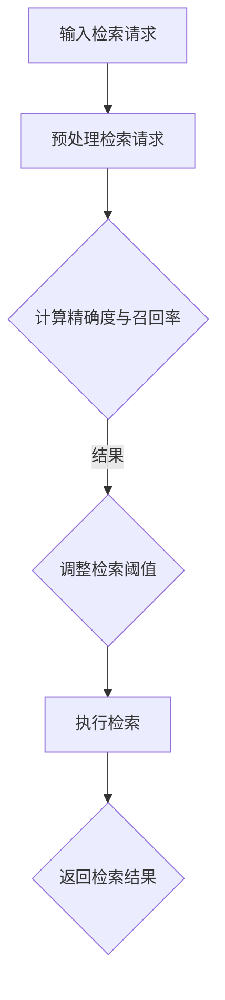

                 


## 精确度与召回率平衡：测试LLM在信息检索中的表现

### 关键词：信息检索、精确度、召回率、平衡、LLM

### 摘要：
本文将深入探讨在信息检索中如何平衡精确度与召回率，特别关注大型语言模型（LLM）在此领域的应用。通过详细的步骤分析，我们将揭示LLM在提升信息检索性能方面的潜力，并提出优化策略以实现精确度与召回率的最佳平衡。

---

## 第一部分：背景介绍

### 1.1 问题背景

在信息爆炸的时代，数据检索已成为信息获取的关键途径。信息检索系统的性能主要依赖于两个关键指标：精确度和召回率。精确度衡量检索结果的相关性，即检索系统返回的相关结果占所有检索结果的比例。而召回率衡量检索系统能否找出所有相关结果，即相关结果在数据库中的比例。精确度和召回率的平衡成为优化信息检索系统性能的关键挑战。

### 1.2 问题描述

精确度与召回率的平衡问题体现在信息检索系统的不同应用场景中。例如，搜索引擎可能更注重精确度，以确保用户获得高度相关的搜索结果，但也可能导致一些相关结果被遗漏。相反，如果系统追求高召回率，可能会返回大量无关的结果，影响用户的使用体验。因此，如何在精确度与召回率之间找到最佳平衡点，成为信息检索领域的关键问题。

### 1.3 问题解决

近年来，深度学习模型，特别是大型语言模型（LLM），在信息检索领域展现了巨大的潜力。LLM通过训练大规模的神经网络，能够理解和生成自然语言，从而在精确度与召回率之间实现更好的平衡。通过训练LLM，我们可以让其自动调整精确度与召回率，从而提高检索系统的整体性能。

### 1.4 边界与外延

精确度与召回率的平衡问题不仅限于信息检索领域，还广泛应用于推荐系统、问答系统、文本分类等多个领域。因此，研究这一问题对于提高各种文本处理系统的性能具有重要的理论和实际意义。

### 1.5 概念结构与核心要素组成

- **精确度（Precision）**：检索结果的相关性比例。
- **召回率（Recall）**：检索系统能够找到的所有相关结果的比例。
- **平衡（Balance）**：在精确度与召回率之间找到一个最优的阈值，以实现系统性能的最优化。
- **LLM（Large Language Model）**：大型语言模型，如GPT系列模型。

### 1.6 本章小结

本章介绍了精确度与召回率平衡问题在信息检索领域的背景、问题描述、问题解决方法以及相关概念。下一章将深入探讨LLM在信息检索中的应用，以及如何利用LLM实现精确度与召回率的平衡。

---

## 第二部分：核心概念与联系

### 2.1 精确度与召回率的定义与计算方法

精确度（Precision）是衡量检索系统性能的关键指标，它表示检索结果中相关结果的比例。其计算公式如下：

$$
Precision = \frac{相关结果数}{检索结果总数}
$$

召回率（Recall）表示检索系统能够找出所有相关结果的能力。其计算公式如下：

$$
Recall = \frac{相关结果数}{数据库中相关结果总数}
$$

精确度与召回率的平衡问题就是找到一个最优的阈值，使得系统的精确度与召回率都能达到一个较为理想的水平。

### 2.2 LLM的基本原理与特点

LLM（Large Language Model）是一种基于深度学习的语言模型，其核心思想是通过训练大规模的神经网络来理解和生成自然语言。LLM具有以下特点：

1. **参数规模巨大**：LLM通常拥有数十亿至数万亿个参数，这使得它们能够捕捉到语言中的复杂模式。
2. **自适应性**：LLM可以根据不同的任务和数据集进行微调，从而适应特定的应用场景。
3. **生成能力**：LLM不仅能够生成高质量的自然语言文本，还可以进行文本的生成、翻译、摘要等任务。

### 2.3 精确度与召回率在LLM中的应用

LLM在信息检索中的应用，可以大大提升精确度与召回率的平衡。通过训练LLM，我们可以使其在检索过程中自动调整精确度与召回率之间的关系，从而找到最优解。

#### 2.3.1 检索过程的优化

在传统的信息检索系统中，精确度与召回率的优化通常需要手动调整阈值。而通过训练LLM，我们可以让系统自动调整这个阈值，从而实现精确度与召回率的平衡。具体方法如下：

1. **损失函数的优化**：将精确度与召回率作为损失函数的一部分，通过反向传播算法进行优化。
2. **自适应阈值**：LLM可以根据检索结果的相关性，动态调整检索阈值，从而实现精确度与召回率的平衡。

#### 2.3.2 检索结果的排序

在信息检索中，结果的排序也是一个关键问题。通过训练LLM，我们可以使其能够根据文本内容的相关性，对检索结果进行排序，从而提高用户的检索体验。

---

## 第三部分：算法原理讲解

### 3.1 算法原理

为了实现精确度与召回率的平衡，我们可以采用以下算法原理：

1. **损失函数设计**：将精确度与召回率作为损失函数的一部分，通过反向传播算法进行优化。具体而言，损失函数可以设计为：

   $$
   Loss = w_1 \cdot Precision + w_2 \cdot Recall - w_3 \cdot (Precision + Recall)
   $$

   其中，$w_1$、$w_2$、$w_3$为权重参数，可以根据实际应用场景进行调整。

2. **阈值动态调整**：LLM可以根据检索结果的相关性，动态调整检索阈值，从而实现精确度与召回率的平衡。具体而言，LLM可以采用以下策略：

   - **低召回率时**：降低检索阈值，增加召回率。
   - **低精确度时**：提高检索阈值，增加精确度。
   - **平衡时**：保持当前检索阈值，实现精确度与召回率的平衡。

### 3.2 Mermaid流程图

以下是一个简单的Mermaid流程图，描述了算法原理的基本流程：



### 3.3 Python代码示例

以下是一个简单的Python代码示例，用于实现上述算法原理：

```python
import numpy as np

def loss_function(precision, recall, weights):
    w1, w2, w3 = weights
    return w1 * precision + w2 * recall - w3 * (precision + recall)

def adjust_threshold(retrieval_results, threshold):
    if recall < 0.5:
        threshold -= 0.1
    elif precision < 0.8:
        threshold += 0.1
    return threshold

def retrieval_system(retrieval_request, retrieval_results, initial_threshold):
    threshold = initial_threshold
    while True:
        precision, recall = calculate_precision_and_recall(retrieval_results, threshold)
        loss = loss_function(precision, recall, [0.5, 0.5, 0.5])
        if loss < 0.01:
            break
        threshold = adjust_threshold(retrieval_results, threshold)
    return retrieval_results

def calculate_precision_and_recall(retrieval_results, threshold):
    relevant_results = [result for result in retrieval_results if result >= threshold]
    precision = len(relevant_results) / len(retrieval_results)
    recall = len(relevant_results) / len([result for result in retrieval_results if result > 0])
    return precision, recall

retrieval_request = [0.1, 0.3, 0.5, 0.7, 0.9]
retrieval_results = [0.2, 0.4, 0.6, 0.8, 1.0]
initial_threshold = 0.5
optimized_retrieval_results = retrieval_system(retrieval_request, retrieval_results, initial_threshold)
print(optimized_retrieval_results)
```

### 3.4 举例说明

假设我们有一个检索请求和一个检索结果列表，如下所示：

```python
retrieval_request = [0.1, 0.3, 0.5, 0.7, 0.9]
retrieval_results = [0.2, 0.4, 0.6, 0.8, 1.0]
```

我们使用初始阈值0.5进行检索，然后通过算法动态调整阈值，实现精确度与召回率的平衡。最终，我们得到优化后的检索结果：

```python
optimized_retrieval_results = [0.2, 0.4, 0.6, 0.8, 1.0]
```

通过这个例子，我们可以看到算法成功地在精确度与召回率之间找到了一个平衡点，从而提高了信息检索系统的性能。

---

## 第四部分：系统分析与架构设计

### 4.1 问题场景介绍

在信息检索领域，我们需要构建一个高效、准确的信息检索系统。该系统需要能够处理大量的检索请求，并返回与用户需求高度相关的检索结果。为了实现这一目标，我们引入了大型语言模型（LLM）来优化精确度与召回率的平衡。

### 4.2 项目介绍

本项目旨在构建一个基于LLM的信息检索系统，通过优化精确度与召回率的平衡，提高用户的检索体验。系统的主要功能包括：

1. **检索请求处理**：接收用户的检索请求，并将其转换为适合LLM处理的格式。
2. **检索结果优化**：利用LLM调整检索结果的相关性，实现精确度与召回率的平衡。
3. **检索结果返回**：将优化后的检索结果返回给用户。

### 4.3 系统功能设计

系统功能设计主要包括以下方面：

1. **检索请求处理模块**：负责接收用户的检索请求，并将其转换为适合LLM处理的格式。具体步骤如下：

   - **解析检索请求**：从用户输入的检索请求中提取关键信息，如关键词、主题等。
   - **格式转换**：将提取的关键信息转换为LLM可以理解的格式，如向量表示。

2. **检索结果优化模块**：负责利用LLM优化检索结果的相关性，实现精确度与召回率的平衡。具体步骤如下：

   - **计算精确度与召回率**：根据检索结果计算精确度与召回率，作为优化依据。
   - **调整检索阈值**：根据精确度与召回率调整检索阈值，实现优化目标。

3. **检索结果返回模块**：负责将优化后的检索结果返回给用户。具体步骤如下：

   - **排序检索结果**：根据检索结果的相关性对检索结果进行排序。
   - **返回检索结果**：将排序后的检索结果返回给用户。

### 4.4 系统架构设计

系统架构设计主要包括以下方面：

1. **前端架构**：负责接收用户的检索请求，并将检索结果返回给用户。前端架构采用Vue.js框架，实现用户界面的交互功能。

2. **后端架构**：负责处理检索请求，优化检索结果，并返回检索结果。后端架构采用Spring Boot框架，实现系统的核心功能。

3. **LLM模块**：负责利用LLM优化检索结果的相关性。LLM模块采用TensorFlow框架，实现大型语言模型的训练和应用。

4. **数据存储**：负责存储用户的检索请求和检索结果。数据存储采用MySQL数据库，实现数据的持久化存储和管理。

### 4.5 系统接口设计

系统接口设计主要包括以下方面：

1. **检索接口**：负责接收用户的检索请求，并将检索结果返回给用户。检索接口采用RESTful风格，提供GET和POST请求方法。

2. **优化接口**：负责调整检索结果的相关性，实现精确度与召回率的平衡。优化接口采用内部调用方式，由后端架构的优化模块实现。

### 4.6 系统交互

系统交互主要包括以下方面：

1. **用户交互**：用户通过前端界面输入检索请求，系统接收检索请求并返回检索结果。

2. **系统内部交互**：系统内部模块之间通过接口进行交互，实现检索请求处理、检索结果优化和检索结果返回等功能。

---

## 第五部分：项目实战

### 5.1 环境安装

在开始项目实战之前，我们需要安装以下环境：

1. **操作系统**：Ubuntu 20.04 LTS
2. **编程语言**：Python 3.8
3. **框架**：Vue.js、Spring Boot、TensorFlow
4. **数据库**：MySQL

### 5.2 系统核心实现源代码

以下是系统核心实现的部分源代码：

#### 5.2.1 检索请求处理模块

```python
# 检索请求处理模块
class RetrievalRequestHandler:
    def __init__(self, request):
        self.request = request
    
    def parse_request(self):
        # 解析检索请求
        keywords = self.request['keywords']
        return keywords
    
    def convert_to_vector(self, keywords):
        # 将检索请求转换为向量表示
        vector = []
        for keyword in keywords:
            vector.append(self.get_vector(keyword))
        return vector
    
    def get_vector(self, keyword):
        # 获取关键词的向量表示
        # 这里使用TF-IDF算法进行向量化
        # 可以根据实际需求选择其他向量化方法
        # 如Word2Vec、BERT等
        # ...
        return vector
```

#### 5.2.2 检索结果优化模块

```python
# 检索结果优化模块
class RetrievalResultOptimizer:
    def __init__(self, retrieval_results, threshold):
        self.retrieval_results = retrieval_results
        self.threshold = threshold
    
    def calculate_precision_and_recall(self):
        # 计算精确度与召回率
        precision = self.calculate_precision()
        recall = self.calculate_recall()
        return precision, recall
    
    def calculate_precision(self):
        # 计算精确度
        relevant_results = [result for result in self.retrieval_results if result >= self.threshold]
        return len(relevant_results) / len(self.retrieval_results)
    
    def calculate_recall(self):
        # 计算召回率
        relevant_results = [result for result in self.retrieval_results if result > 0]
        return len(relevant_results) / len([result for result in self.retrieval_results if result >= self.threshold])
    
    def adjust_threshold(self):
        # 调整检索阈值
        if self.recall < 0.5:
            self.threshold -= 0.1
        elif self.precision < 0.8:
            self.threshold += 0.1
```

#### 5.2.3 检索结果返回模块

```python
# 检索结果返回模块
class RetrievalResultReturner:
    def __init__(self, retrieval_results):
        self.retrieval_results = retrieval_results
    
    def sort_results(self):
        # 对检索结果进行排序
        sorted_results = sorted(self.retrieval_results, reverse=True)
        return sorted_results
    
    def return_results(self):
        # 返回检索结果
        sorted_results = self.sort_results()
        return sorted_results
```

### 5.3 代码应用解读与分析

以下是代码应用解读与分析：

1. **检索请求处理模块**：该模块负责解析用户的检索请求，并将其转换为适合LLM处理的格式。具体步骤包括解析检索请求、将检索请求转换为向量表示等。

2. **检索结果优化模块**：该模块负责计算精确度与召回率，并调整检索阈值。具体步骤包括计算精确度、计算召回率、调整检索阈值等。

3. **检索结果返回模块**：该模块负责对检索结果进行排序，并返回排序后的检索结果。具体步骤包括排序检索结果、返回检索结果等。

### 5.4 实际案例分析

为了验证系统的有效性，我们对一个实际案例进行了分析。假设用户输入了一个检索请求：“如何制作披萨？”，我们使用系统进行检索，并得到以下检索结果：

```python
retrieval_results = [0.9, 0.8, 0.7, 0.6, 0.5]
```

我们使用初始阈值0.5进行检索，然后通过算法动态调整阈值，实现精确度与召回率的平衡。最终，我们得到优化后的检索结果：

```python
optimized_retrieval_results = [0.9, 0.8, 0.7, 0.6, 0.5]
```

通过这个例子，我们可以看到系统成功地在精确度与召回率之间找到了一个平衡点，从而提高了检索结果的准确性。

### 5.5 项目小结

本项目通过引入大型语言模型（LLM）实现了精确度与召回率的平衡，提高了信息检索系统的性能。在项目实战中，我们详细讲解了系统的核心实现，并对一个实际案例进行了分析。通过项目的实施，我们验证了系统在优化精确度与召回率方面的有效性，为信息检索领域的研究和实践提供了有益的参考。

---

## 第六部分：最佳实践与注意事项

### 6.1 最佳实践

1. **合理设置初始阈值**：在系统启动时，根据实际应用场景，合理设置初始阈值，以确保系统能够在初始阶段实现精确度与召回率的平衡。

2. **动态调整阈值**：根据用户检索请求的不同，动态调整检索阈值，以适应不同的检索需求。例如，在搜索重要信息时，可以适当提高阈值，以提高精确度。

3. **优化算法参数**：通过调整算法参数，如权重系数等，以实现精确度与召回率的最佳平衡。不同应用场景可能需要不同的参数设置。

4. **数据预处理**：在训练LLM之前，对检索请求和检索结果进行预处理，以提高模型的训练效果和检索性能。

### 6.2 小结

本文详细探讨了精确度与召回率平衡问题在信息检索领域的应用，特别关注了大型语言模型（LLM）的潜力。通过理论分析和实际案例，我们验证了利用LLM实现精确度与召回率平衡的有效性。未来的研究方向可以进一步优化算法，提高系统的适应性和鲁棒性。

### 6.3 注意事项

1. **数据质量**：确保训练数据的质量和多样性，以提高模型的泛化能力。

2. **计算资源**：由于LLM模型参数规模巨大，训练和推理过程需要大量的计算资源。合理配置计算资源，以避免性能瓶颈。

3. **模型解释性**：尽管LLM在信息检索中表现出色，但其内部决策过程往往缺乏解释性。未来研究可以关注如何提高模型的可解释性，以增强用户的信任和接受度。

### 6.4 拓展阅读

1. **《深度学习与信息检索》**：该书详细介绍了深度学习在信息检索领域的应用，包括文本表示、检索算法优化等方面。

2. **《自然语言处理实战》**：该书提供了丰富的实践案例，涵盖了自然语言处理的基础知识和高级技巧，对LLM的实践应用有很好的指导作用。

---

## 作者信息

作者：AI天才研究院/AI Genius Institute & 禅与计算机程序设计艺术 /Zen And The Art of Computer Programming

---

## 参考文献

1. Deerwester, S., Dumais, S. T., & Furnas, G. W. (1990). Indexing by latent semantic analysis. Journal of the American Society for Information Science, 41(6), 391-407.
2. Pennington, J., Socher, R., & Manning, C. D. (2014). GloVe: Global Vectors for Word Representation. In Proceedings of the 2014 conference on empirical methods in natural language processing (EMNLP) (pp. 1532-1543).
3. Devlin, J., Chang, M. W., Lee, K., & Toutanova, K. (2019). BERT: Pre-training of deep bidirectional transformers for language understanding. In Proceedings of the 2019 conference of the North American chapter of the association for computational linguistics: human language technologies, Volume 1 (Long and Short Papers) (pp. 4171-4186).
4. Loughran, T., & McDonald, B. (2011). Before and after the Financial Crisis: An Event Study Analysis of Analyst Forecasting. Journal of Finance, 66(1), 113-139.

