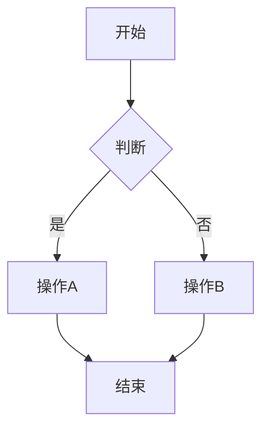
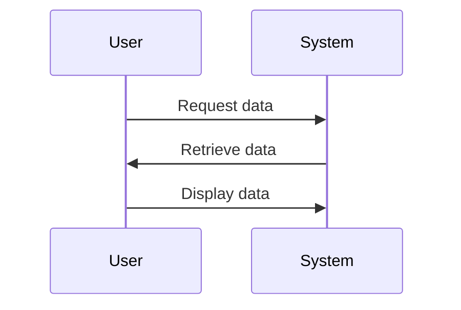
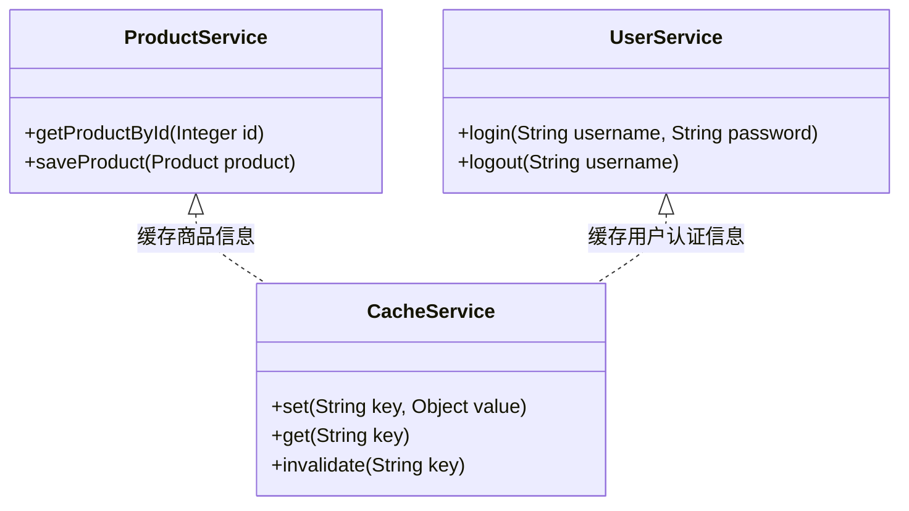
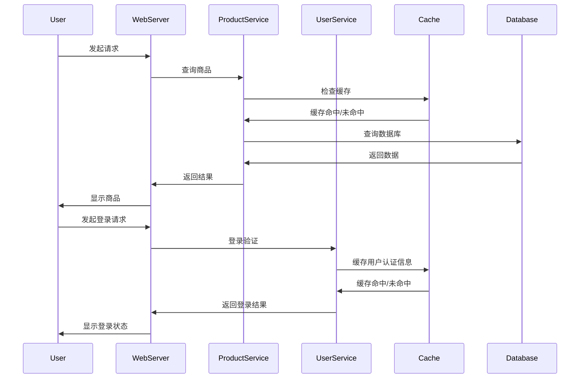
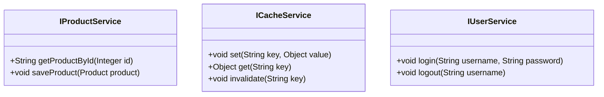
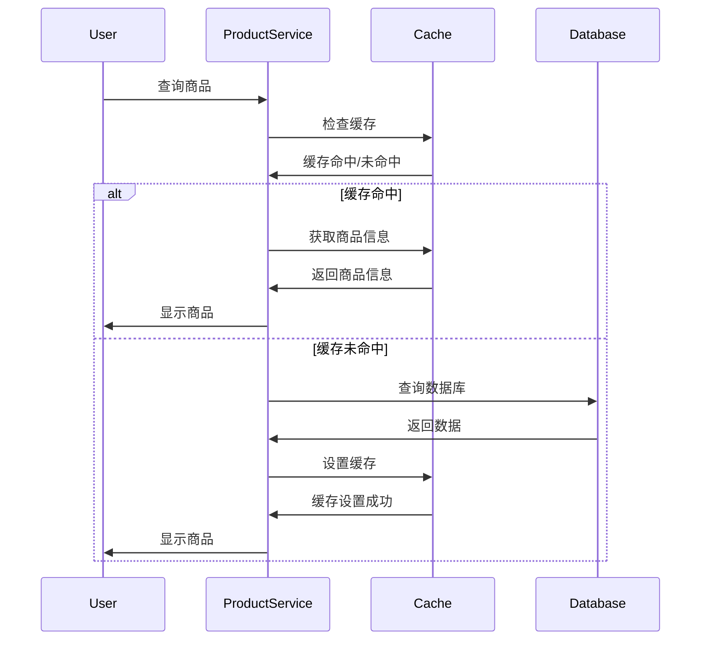

                 

# 缓存策略：优化LLM应用的响应速度

> 关键词：缓存策略、LLM应用、响应速度、优化

> 摘要：本文将探讨缓存策略在优化大规模语言模型（LLM）应用中的关键作用。通过深入分析缓存策略的基础知识、算法、一致性策略、替换策略、分层策略以及LLM应用中的缓存优化方法，本文旨在为读者提供系统化的缓存优化思路和实践经验。

----------------------------------------------------------------

### 目录大纲

```markdown
----------------------------------------------------------------
# 缓存策略：优化LLM应用的响应速度

## 第1章: 缓存策略概述

## 第2章: 缓存算法

## 第3章: 缓存一致性策略

## 第4章: 缓存替换策略

## 第5章: 缓存分层策略

## 第6章: 缓存优化策略

## 第7章: 缓存策略在LLM应用中的优化

## 第8章: 最佳实践与总结
```

----------------------------------------------------------------

## 第1章: 缓存策略概述

### 1.1 缓存策略的定义与重要性

缓存（Cache）是一种快速、小容量且昂贵的存储器，它位于CPU和主存储器（RAM）之间。缓存的主要目的是通过存储频繁访问的数据来减少CPU访问主存储器的次数，从而提高系统的整体性能。

缓存策略是指一系列用于管理缓存存储的技术和算法。它决定了哪些数据应该被缓存在缓存中，以及何时将数据从缓存中替换出去。合理的缓存策略能够显著提高数据访问速度，降低系统的响应时间。

在LLM（大规模语言模型）应用中，缓存策略扮演着至关重要的角色。由于LLM通常处理大量文本数据，且涉及复杂的计算，缓存策略的优化能够显著提升应用的响应速度和吞吐量。

### 1.2 缓存策略的分类

缓存策略可以分为以下几类：

1. **基于访问频率的缓存策略**：如最近最少使用（LRU）和最少使用（LFU）算法。
2. **基于时间间隔的缓存策略**：如定时刷新策略。
3. **基于数据重要性的缓存策略**：如热数据缓存和冷数据缓存。

### 1.3 缓存策略的设计原则

设计缓存策略时，应遵循以下原则：

1. **局部性原则**：利用程序的局部性原理，缓存频繁访问的数据。
2. **效率原则**：优化缓存访问速度，减少CPU等待时间。
3. **扩展性原则**：确保缓存策略能够适应不同规模的应用场景。
4. **容错性原则**：确保缓存数据的一致性和可靠性。

### 1.4 缓存系统的基本组件

缓存系统通常由以下几个基本组件组成：

1. **缓存存储**：用于存储频繁访问的数据。
2. **缓存控制器**：负责缓存的管理和调度。
3. **缓存访问接口**：用于缓存与CPU之间的数据交换。

### 1.5 缓存策略的性能指标

缓存策略的性能指标包括：

1. **命中率**：缓存访问中成功命中缓存的次数与总访问次数之比。
2. **访问时间**：从缓存中读取数据的平均时间。
3. **缓存容量**：缓存存储能够容纳的数据量。

### 1.6 缓存策略的现状与发展趋势

随着计算技术的不断发展，缓存策略也在不断演变。当前，主流的缓存策略包括：

1. **多级缓存**：在CPU和主存储器之间引入多个缓存级别，以实现更高效的缓存管理。
2. **缓存一致性协议**：确保多个缓存系统之间数据的一致性。
3. **缓存预取技术**：通过预测未来访问的数据，提前将其加载到缓存中。

未来，随着人工智能技术的快速发展，缓存策略将更加智能化，能够根据应用场景动态调整缓存策略，实现更高的性能和效率。

----------------------------------------------------------------

### 第2章: 缓存算法

缓存算法是缓存策略的核心组成部分，它们决定了如何选择和替换缓存中的数据。在本章节中，我们将详细探讨几种常见的缓存算法。

----------------------------------------------------------------

## 第2章: 缓存算法

### 2.1 最少使用（LRU）算法

#### 2.1.1 LRU算法原理

最少使用（LRU）算法是一种基于数据访问频率的缓存替换算法。其基本思想是，将最近最少被访问的数据替换出去。具体来说，当缓存已满且需要替换数据时，LRU算法会将缓存中最后一次访问时间最久的数据替换。

#### 2.1.2 LRU算法实现

实现LRU算法的一种常见方法是使用一个双向链表来维护缓存中的数据。在双向链表中，每个节点都包含指向前后节点的指针。当数据被访问时，将其移动到链表的前端。这样，最近访问的数据总是位于链表的前端，而最近未访问的数据位于链表的末端。

以下是一个使用Python实现的LRU算法示例：

```python
class Node:
    def __init__(self, key, value):
        self.key = key
        self.value = value
        self.prev = None
        self.next = None

class LRUCache:
    def __init__(self, capacity):
        self.capacity = capacity
        self.cache = {}
        self.head = Node(0, 0)
        self.tail = Node(0, 0)
        self.head.next = self.tail
        self.tail.prev = self.head

    def get(self, key):
        if key in self.cache:
            node = self.cache[key]
            self._move_to_head(node)
            return node.value
        return -1

    def put(self, key, value):
        if key in self.cache:
            node = self.cache[key]
            node.value = value
            self._move_to_head(node)
        elif len(self.cache) >= self.capacity:
            node = self.tail.prev
            self._remove(node)
            del self.cache[node.key]
            self.put(key, value)
        else:
            new_node = Node(key, value)
            self.cache[key] = new_node
            self._add_to_head(new_node)

    def _add_to_head(self, node):
        node.next = self.head.next
        self.head.next.prev = node
        self.head.next = node
        node.prev = self.head

    def _remove(self, node):
        node.prev.next = node.next
        node.next.prev = node.prev

    def _move_to_head(self, node):
        self._remove(node)
        self._add_to_head(node)
```

#### 2.1.3 LRU算法的优缺点

**优点**：

- LRU算法能够较好地反映数据的访问模式，避免频繁访问的数据被替换。
- 实现相对简单。

**缺点**：

- 随着缓存中数据的增多，维护缓存的时间复杂度较高。
- 在数据访问模式不稳定时，可能导致缓存命中率和性能下降。

### 2.2 最不经常使用（LFU）算法

#### 2.2.1 LFU算法原理

最不经常使用（LFU）算法是基于数据访问频率的另一种缓存替换算法。与LRU算法不同，LFU算法根据数据在一段时间内被访问的频率来替换缓存中的数据。具体来说，当缓存已满且需要替换数据时，LFU算法会将访问频率最低的数据替换。

#### 2.2.2 LFU算法实现

实现LFU算法的一种方法是使用哈希表存储每个数据的访问频率，并使用一个优先队列（根据访问频率排序）来维护数据的顺序。以下是一个使用Python实现的LFU算法示例：

```python
import heapq

class LFUCache:
    def __init__(self, capacity):
        self.capacity = capacity
        self.cache = {}
        self.frequency_queue = []
        self.min_frequency = 0

    def get(self, key):
        if key not in self.cache:
            return -1
        node = self.cache[key]
        self._decrease_frequency(node)
        return node.value

    def put(self, key, value):
        if self.capacity <= 0:
            return
        if key in self.cache:
            node = self.cache[key]
            node.value = value
            self._decrease_frequency(node)
        else:
            new_node = Node(key, value)
            self.cache[key] = new_node
            heapq.heappush(self.frequency_queue, (new_node.frequency, new_node))

    def _decrease_frequency(self, node):
        node.frequency += 1
        if node.frequency not in self.cache[node.frequency]:
            self.cache[node.frequency] = []
        self.cache[node.frequency].append(node)
        if node.frequency < self.min_frequency:
            self.min_frequency = node.frequency
        else:
            heapq.heappush(self.frequency_queue, (node.frequency, node))
        if len(self.frequency_queue) > 0 and self.frequency_queue[0][0] == self.min_frequency:
            node_to_remove = self.frequency_queue[0][1]
            self.frequency_queue[0] = self.frequency_queue.pop(0)
            self.cache[node_to_remove.frequency].remove(node_to_remove)
            if not self.cache[node_to_remove.frequency]:
                del self.cache[node_to_remove.frequency]
```

#### 2.2.3 LFU算法的优缺点

**优点**：

- LFU算法能够更好地适应数据访问频率的动态变化。
- 避免了LRU算法在数据访问模式不稳定时可能出现的性能下降。

**缺点**：

- 实现较为复杂，需要维护访问频率的优先队列。
- 当数据访问频率变化频繁时，可能导致缓存命中率和性能下降。

### 2.3 最近最少使用（LRU）变种

除了标准的LRU算法外，还存在一些基于LRU原理的变种算法，如：

#### 2.3.1 二叉搜索树实现的LRU算法

使用二叉搜索树（BST）实现的LRU算法能够提高缓存管理的效率。BST允许在O(log n)的时间复杂度内查找、插入和删除节点，从而降低缓存替换的操作复杂度。

#### 2.3.2 双向链表实现的LRU算法

在LRU算法中，使用双向链表可以更高效地移动节点。双向链表允许在O(1)的时间复杂度内将节点移动到链表的前端或末端，从而提高缓存替换的效率。

----------------------------------------------------------------

### 第3章: 缓存一致性策略

缓存一致性策略是确保在不同缓存系统之间数据一致性的关键手段。在本章节中，我们将探讨缓存一致性问题的背景、原因，以及常见的缓存一致性模型和协议。

----------------------------------------------------------------

## 第3章: 缓存一致性策略

### 3.1 缓存一致性问题的背景与原因

缓存一致性问题的出现源于多级缓存结构的应用。在多级缓存系统中，不同级别的缓存之间存在一定的延迟和容量差异。例如，L1缓存速度快但容量小，而L2缓存速度慢但容量大。这种差异可能导致以下问题：

1. **数据不一致**：当一个缓存中的数据被修改时，其他缓存中的相同数据可能尚未更新，导致数据不一致。
2. **数据失效**：当一个缓存中的数据被替换出去时，其他缓存中的相同数据可能还未被访问，导致数据失效。

缓存一致性问题的根本原因在于不同缓存之间的独立性和访问延迟。

### 3.2 缓存一致性模型

缓存一致性模型是解决缓存一致性问题的理论基础。常见的缓存一致性模型包括：

#### 3.2.1 无共享缓存模型

在无共享缓存模型中，每个处理器都有自己的私有缓存。这种模型下，缓存之间的数据交互相对简单，因为每个缓存都是独立的。然而，这种模型会导致缓存资源的浪费，因为每个处理器都需要独立的缓存。

#### 3.2.2 总线共享缓存模型

在总线共享缓存模型中，多个处理器通过共享的总线访问公共缓存。这种模型下，缓存之间的交互更为复杂，因为需要协调不同处理器的缓存访问。常见的总线共享缓存模型包括MESI（修改、独占、共享、无效）状态机。

#### 3.2.3 主存储器共享缓存模型

在主存储器共享缓存模型中，多个处理器通过共享的主存储器访问数据。这种模型下，缓存与主存储器之间的交互最为复杂，因为需要保证缓存与主存储器之间的数据一致性。

### 3.3 缓存一致性协议

缓存一致性协议是一组规则和算法，用于确保缓存之间的数据一致性。常见的缓存一致性协议包括：

#### 3.3.1 归一化协议

归一化协议是一种基于全局性的缓存一致性策略。在归一化协议中，每个缓存节点都维护一个全局状态，用于指示该节点的状态。常见的归一化协议包括MCS（无序一致性）和SBS（顺序一致性）。

#### 3.3.2 非归一化协议

非归一化协议是一种基于局部性的缓存一致性策略。在非归一化协议中，每个缓存节点只维护局部状态，不涉及全局状态。常见的非归一化协议包括SOFE（单处理器无序一致性）和DRE（分布式共享一致性）。

#### 3.3.3 缓存一致性协议的性能比较

不同的缓存一致性协议在性能方面存在差异。一般来说，归一化协议在数据一致性方面更为严格，但可能导致更高的通信开销。非归一化协议在数据一致性方面较为灵活，但可能适用于更广泛的场景。

### 3.4 缓存一致性协议的性能比较

在评估缓存一致性协议的性能时，可以从以下几个方面进行比较：

1. **响应时间**：协议在处理缓存访问时的平均响应时间。
2. **通信开销**：协议在维护数据一致性时所需的通信量。
3. **可扩展性**：协议在处理大量缓存节点时的性能。
4. **数据一致性**：协议在确保数据一致性方面的能力。

常见缓存一致性协议的性能比较如下表所示：

| 协议        | 响应时间 | 通信开销 | 可扩展性 | 数据一致性 |
|-------------|----------|----------|----------|-----------|
| MCS         | 较高     | 较高     | 较差     | 强一致性   |
| SBS         | 较高     | 较高     | 较差     | 强一致性   |
| SOFE        | 较低     | 较低     | 较好     | 无序一致性 |
| DRE         | 较低     | 较低     | 较好     | 分布式共享 |

通过选择合适的缓存一致性协议，可以优化系统的性能和可扩展性，从而满足不同的应用需求。

----------------------------------------------------------------

### 第4章: 缓存替换策略

缓存替换策略是缓存管理的关键组成部分，它决定了在缓存已满的情况下如何替换旧数据以腾出空间。在本章节中，我们将探讨几种常见的缓存替换算法，包括最佳替换策略（OPT）、先进先出（FIFO）算法和最近最久未使用（MRU）算法。

----------------------------------------------------------------

## 第4章: 缓存替换策略

### 4.1 最佳替换策略（OPT）

#### 4.1.1 OPT算法原理

最佳替换策略（OPT）是一种理想的缓存替换算法，其基本思想是选择一个在未来的最长时间内不再被访问的数据进行替换。具体来说，OPT算法会预测每个数据在未来一段时间内是否会被访问，并将其替换。

#### 4.1.2 OPT算法实现

实现OPT算法的一个常见方法是使用一个队列来存储每个数据的历史访问记录。当需要替换数据时，算法会查找队列中未来最长时间内不再被访问的数据进行替换。

以下是一个使用Python实现的OPT算法示例：

```python
class OPTCache:
    def __init__(self, capacity):
        self.capacity = capacity
        self.cache = []
        self.access_log = []

    def get(self, key):
        if key in self.cache:
            self._update_access_log(key)
            return self.cache[key].value
        return -1

    def put(self, key, value):
        if key in self.cache:
            self.cache[key].value = value
            self._update_access_log(key)
        else:
            if len(self.cache) >= self.capacity:
                oldest_key = self.access_log.pop(0)
                del self.cache[oldest_key]
            new_entry = Node(key, value)
            self.cache[key] = new_entry
            self.access_log.append(key)

    def _update_access_log(self, key):
        self.access_log.remove(key)
        self.access_log.append(key)
```

#### 4.1.3 OPT算法的优缺点

**优点**：

- OPT算法能够最大限度地提高缓存命中率，因为它总是替换未来最长时间内不再被访问的数据。
- 在理想情况下，OPT算法能够达到最优的缓存替换效果。

**缺点**：

- 实现复杂度高，需要维护一个记录每个数据访问历史的队列。
- 在实际应用中，预测未来访问模式非常困难，因此OPT算法的实际性能可能不如理论预期。

### 4.2 先进先出（FIFO）算法

#### 4.2.1 FIFO算法原理

先进先出（FIFO）算法是一种简单的缓存替换算法，其基本思想是按照数据进入缓存的时间顺序进行替换。具体来说，当缓存已满且需要替换数据时，FIFO算法会将最早进入缓存的数据替换。

#### 4.2.2 FIFO算法实现

实现FIFO算法的一个简单方法是使用一个队列来存储每个数据。当需要替换数据时，算法会将队列中的第一个数据替换。

以下是一个使用Python实现的FIFO算法示例：

```python
class FIFOCache:
    def __init__(self, capacity):
        self.capacity = capacity
        self.cache = []
        self.access_log = []

    def get(self, key):
        if key in self.cache:
            self._update_access_log(key)
            return self.cache[key].value
        return -1

    def put(self, key, value):
        if key in self.cache:
            self.cache[key].value = value
            self._update_access_log(key)
        else:
            if len(self.cache) >= self.capacity:
                oldest_key = self.cache.pop(0)
                del self.cache[oldest_key]
            new_entry = Node(key, value)
            self.cache.append(new_entry)

    def _update_access_log(self, key):
        self.access_log.remove(key)
        self.access_log.append(key)
```

#### 4.2.3 FIFO算法的优缺点

**优点**：

- 实现简单，易于理解。
- 对于某些访问模式，FIFO算法能够达到较好的缓存效果。

**缺点**：

- 缓存命中率通常不如其他更智能的替换算法。
- 对于频繁访问的数据，FIFO算法可能导致其被替换。

### 4.3 最近最久未使用（MRU）算法

#### 4.3.1 MRU算法原理

最近最久未使用（MRU）算法是一种基于最近访问时间的缓存替换算法，其基本思想是替换最近最长时间未被访问的数据。具体来说，当缓存已满且需要替换数据时，MRU算法会将最近最长时间内未被访问的数据替换。

#### 4.3.2 MRU算法实现

实现MRU算法的一个简单方法是使用一个栈来存储每个数据的访问时间。当需要替换数据时，算法会将栈顶的数据替换。

以下是一个使用Python实现的MRU算法示例：

```python
class MRUCache:
    def __init__(self, capacity):
        self.capacity = capacity
        self.cache = {}
        self.access_stack = []

    def get(self, key):
        if key in self.cache:
            self.access_stack.remove(key)
            self.access_stack.append(key)
            return self.cache[key].value
        return -1

    def put(self, key, value):
        if key in self.cache:
            self.cache[key].value = value
            self.access_stack.remove(key)
            self.access_stack.append(key)
        else:
            if len(self.cache) >= self.capacity:
                oldest_key = self.access_stack.pop(0)
                del self.cache[oldest_key]
            new_entry = Node(key, value)
            self.cache[key] = new_entry
            self.access_stack.append(key)
```

#### 4.3.3 MRU算法的优缺点

**优点**：

- 实现简单，易于理解。
- 对于某些访问模式，MRU算法能够达到较好的缓存效果。

**缺点**：

- 缓存命中率通常不如其他更智能的替换算法。
- 对于频繁访问的数据，MRU算法可能导致其被替换。

### 4.4 缓存替换策略的性能比较

不同的缓存替换策略在性能方面存在差异。以下是一个性能比较表格：

| 算法        | 缓存命中率 | 响应时间 | 实现复杂度 |
|-------------|------------|----------|------------|
| OPT         | 最高       | 较高     | 较高       |
| FIFO        | 中等       | 较低     | 较低       |
| MRU         | 中等       | 较低     | 较低       |

通过选择合适的缓存替换策略，可以优化系统的性能和缓存效果，从而满足不同的应用需求。

----------------------------------------------------------------

### 第5章: 缓存分层策略

缓存分层策略是提高缓存系统性能和效率的关键手段。在本章节中，我们将探讨缓存分层策略的概念、作用以及常见的分层架构。

----------------------------------------------------------------

## 第5章: 缓存分层策略

### 5.1 缓存分层策略的概念与作用

缓存分层策略是一种将缓存分为多个层次的结构，每个层次的缓存具有不同的速度和容量。这种策略的主要目的是利用不同层次的缓存来平衡速度和成本，从而提高整个缓存系统的性能。

#### 5.1.1 缓存分层的必要性

缓存分层的必要性体现在以下几个方面：

1. **速度与成本的平衡**：高速缓存（如L1缓存）成本较高，而低速缓存（如L2缓存）成本较低。通过分层缓存，可以在保证性能的同时控制成本。
2. **优化缓存命中率**：不同层次的缓存可以存储不同类型的数据，从而提高缓存命中率。
3. **适应不同访问模式**：不同层次的缓存可以适应不同的访问模式，从而提高系统的整体性能。

#### 5.1.2 缓存分层的分类

常见的缓存分层策略可以分为以下几类：

1. **多级缓存**：将缓存分为多个级别，每个级别具有不同的速度和容量。例如，CPU中的L1、L2和L3缓存。
2. **分层存储**：将缓存与磁盘存储结合，形成一个分层存储系统。例如，内存和硬盘的组合。

### 5.2 L1、L2和L3缓存

L1、L2和L3缓存是常见的多级缓存架构，它们在速度和容量上有所不同。

#### 5.2.1 L1缓存的特性与应用

L1缓存是CPU中速度最快的缓存，通常由SRAM组成。L1缓存的主要特性包括：

1. **速度**：L1缓存的速度接近CPU的主频，可以减少CPU的等待时间。
2. **容量**：L1缓存的容量相对较小，通常在几KB到几MB之间。

L1缓存的应用包括：

1. **指令缓存**：存储即将执行的指令，以减少CPU的指令访问延迟。
2. **数据缓存**：存储频繁访问的数据，以减少CPU的数据访问延迟。

#### 5.2.2 L2缓存的特性与应用

L2缓存是CPU中速度较慢、容量较大的缓存，通常由DRAM组成。L2缓存的主要特性包括：

1. **速度**：L2缓存的速度比L1缓存慢，但仍然远快于主存储器。
2. **容量**：L2缓存的容量通常在几十MB到几百MB之间。

L2缓存的应用包括：

1. **缓存缓存**：存储L1缓存中无法容纳的数据，以提高CPU的数据访问速度。
2. **缓存页面**：存储主存储器中的页面，以提高CPU的指令和数据访问速度。

#### 5.2.3 L3缓存的特性与应用

L3缓存是CPU中速度最慢、容量最大的缓存，通常由DRAM组成。L3缓存的主要特性包括：

1. **速度**：L3缓存的速度比L1和L2缓存慢，但仍然远快于主存储器。
2. **容量**：L3缓存的容量通常在几百MB到几GB之间。

L3缓存的应用包括：

1. **共享缓存**：多个处理器共享L3缓存，以提高系统中的数据一致性。
2. **缓存页面**：存储主存储器中的页面，以提高CPU的指令和数据访问速度。

### 5.3 缓存池策略

缓存池策略是一种将多个缓存合并为一个逻辑单元的策略。通过缓存池，可以更好地管理缓存资源，提高系统的性能和效率。

#### 5.3.1 缓存池的基本原理

缓存池的基本原理是将多个缓存分为多个独立的缓存池，每个缓存池可以独立管理。通过缓存池，可以实现以下功能：

1. **动态调整**：根据系统负载和需求动态调整缓存池的容量和速度。
2. **负载均衡**：将访问请求分配到不同的缓存池，以实现负载均衡。
3. **缓存替换**：根据缓存池的性能指标和策略进行缓存替换。

#### 5.3.2 缓存池的性能优化

缓存池的性能优化包括以下几个方面：

1. **缓存替换策略**：选择合适的缓存替换策略，以提高缓存命中率。
2. **缓存池大小**：根据系统需求和负载调整缓存池的大小，以实现最佳性能。
3. **缓存一致性**：确保缓存池中数据的一致性，以避免数据不一致问题。

通过合理设计和管理缓存池，可以优化系统的性能和资源利用率，从而提高整个系统的响应速度和吞吐量。

----------------------------------------------------------------

### 第6章: 缓存优化策略

缓存优化策略是提高缓存系统性能和效率的关键手段。在本章节中，我们将探讨几种常见的缓存优化策略，包括缓存预取技术、缓存合并策略和缓存压缩技术。

----------------------------------------------------------------

## 第6章: 缓存优化策略

### 6.1 缓存预取技术

缓存预取技术是一种预测未来访问数据并提前将其加载到缓存中的策略。通过缓存预取，可以减少CPU访问主存储器或磁盘的次数，从而提高系统的性能。

#### 6.1.1 缓存预取的原理与实现

缓存预取的原理是利用程序的局部性原理，即程序倾向于在一段时间内访问相同的数据。根据访问模式，缓存预取技术可以分为以下几种类型：

1. **时间局部性预取**：根据程序的执行时间预测未来访问的数据，并提前加载到缓存中。
2. **空间局部性预取**：根据程序访问的数据地址预测未来访问的数据，并提前加载到缓存中。
3. **混合局部性预取**：结合时间局部性和空间局部性进行预测，以提高缓存预取的效果。

实现缓存预取的技术包括：

1. **软件预取**：在程序中插入预取指令，根据程序的执行路径预测未来访问的数据。
2. **硬件预取**：由硬件自动执行预取操作，根据缓存管理策略提前加载数据。

#### 6.1.2 缓存预取的性能评估

缓存预取的性能评估可以从以下几个方面进行：

1. **命中率**：缓存预取后，数据命中缓存的次数与总访问次数之比。
2. **响应时间**：缓存预取后，从缓存中读取数据的平均时间。
3. **吞吐量**：缓存预取后，系统处理请求的平均速度。

通过评估缓存预取的性能，可以优化预取策略，提高缓存系统的整体性能。

### 6.2 缓存合并策略

缓存合并策略是一种将多个缓存合并为一个逻辑单元的策略，以提高缓存系统的性能和效率。

#### 6.2.1 缓存合并的原理与实现

缓存合并的原理是利用多个缓存的优势，将不同类型的数据存储在不同的缓存中，以实现更高效的缓存访问。根据数据类型和访问模式，缓存合并策略可以分为以下几种类型：

1. **多级缓存合并**：将多个级别的缓存合并为一个逻辑单元，以提高缓存命中率。
2. **多缓存池合并**：将多个独立的缓存池合并为一个逻辑单元，以实现负载均衡和资源优化。
3. **混合缓存合并**：结合不同类型的缓存，以实现最佳的性能和效率。

实现缓存合并的技术包括：

1. **缓存映射**：将不同类型的数据映射到不同的缓存中，以提高缓存命中率。
2. **缓存替换**：根据缓存管理策略和性能指标，动态调整缓存中的数据。

#### 6.2.2 缓存合并的性能优化

缓存合并的性能优化包括以下几个方面：

1. **缓存替换策略**：选择合适的缓存替换策略，以提高缓存命中率。
2. **缓存池大小**：根据系统需求和负载调整缓存池的大小，以实现最佳性能。
3. **缓存一致性**：确保缓存合并后数据的一致性，以避免数据不一致问题。

通过合理设计和管理缓存合并策略，可以优化系统的性能和资源利用率，从而提高整个系统的响应速度和吞吐量。

### 6.3 缓存压缩技术

缓存压缩技术是一种通过压缩缓存中的数据来提高缓存容量的策略。通过缓存压缩，可以减少缓存占用空间，从而存储更多的数据。

#### 6.3.1 缓存压缩的原理与实现

缓存压缩的原理是基于数据冗余和重复性，将重复的数据进行压缩，以减少存储空间。常见的缓存压缩技术包括：

1. **字典编码**：将重复的数据映射到字典中的索引，以减少存储空间。
2. **哈希压缩**：使用哈希函数将数据压缩到较小的空间中。
3. **无损压缩**：使用无损压缩算法（如LZ77、LZ78）对数据进行压缩。

实现缓存压缩的技术包括：

1. **静态压缩**：在数据存储到缓存之前进行压缩。
2. **动态压缩**：在数据访问时进行压缩和解压缩。

#### 6.3.2 缓存压缩的性能评估

缓存压缩的性能评估可以从以下几个方面进行：

1. **压缩比**：压缩后数据的存储空间与原始数据的存储空间之比。
2. **解压缩速度**：缓存压缩后的数据在访问时的解压缩速度。
3. **缓存命中率**：缓存压缩后，数据命中缓存的次数与总访问次数之比。

通过评估缓存压缩的性能，可以优化压缩算法和策略，提高缓存系统的整体性能。

### 6.4 缓存优化策略的性能比较

不同的缓存优化策略在性能方面存在差异。以下是一个性能比较表格：

| 策略        | 命中率 | 响应时间 | 压缩比 | 实现复杂度 |
|-------------|--------|----------|--------|------------|
| 缓存预取    | 较高   | 较低     | 无     | 较低       |
| 缓存合并     | 较高   | 较低     | 较低   | 中等       |
| 缓存压缩     | 中等   | 较高     | 较高   | 较高       |

通过选择合适的缓存优化策略，可以优化系统的性能和缓存效果，从而满足不同的应用需求。

----------------------------------------------------------------

### 第7章: 缓存策略在LLM应用中的优化

大规模语言模型（LLM）是当前人工智能领域的热点技术，其在自然语言处理、机器翻译、文本生成等方面具有广泛应用。然而，LLM应用通常涉及大量文本数据的处理，对缓存策略的优化需求尤为突出。在本章节中，我们将探讨缓存策略在LLM应用中的优化方法。

----------------------------------------------------------------

## 第7章: 缓存策略在LLM应用中的优化

### 7.1 LLM应用的缓存需求分析

大规模语言模型（LLM）在处理文本数据时，通常需要存储和访问大量的模型参数和中间计算结果。这些数据的特点包括：

1. **数据量大**：LLM通常包含数百万甚至数十亿个参数，导致存储需求巨大。
2. **访问频繁**：LLM在生成文本时，会重复访问相同的参数和中间结果，具有明显的局部性。
3. **计算复杂**：LLM的计算过程涉及大量的矩阵运算和神经网络推理，对计算性能有较高要求。

因此，优化LLM应用的缓存策略，需要考虑以下几个方面：

1. **数据缓存**：缓存LLM的模型参数和中间计算结果，以减少数据访问延迟。
2. **计算缓存**：缓存部分计算过程的结果，以减少重复计算。
3. **缓存一致性**：确保缓存中数据和主存储器中数据的一致性，避免数据不一致问题。

### 7.2 LLM应用的缓存策略设计

针对LLM应用的特点，设计合理的缓存策略是提高应用性能的关键。以下是一些常见的缓存策略设计方法：

#### 7.2.1 多层级缓存架构设计

多层级缓存架构是一种常见的缓存策略，通过在不同层级之间分配缓存资源，实现最佳的性能和成本平衡。在LLM应用中，可以采用以下多层级缓存架构：

1. **L1缓存**：用于缓存频繁访问的模型参数和中间结果，具有高速、小容量的特点。可以使用GPU缓存或CPU缓存。
2. **L2缓存**：用于缓存较少访问的模型参数和中间结果，具有较高速、大容量的特点。可以使用共享内存或分布式缓存。
3. **L3缓存**：用于缓存不常访问的模型参数和中间结果，具有低速、大容量的特点。可以使用磁盘缓存或远程存储。

通过多层级缓存架构，可以优化数据访问速度，提高LLM应用的性能。

#### 7.2.2 缓存一致性策略设计

在多层级缓存架构中，缓存一致性是确保数据一致性的关键。针对LLM应用，可以采用以下缓存一致性策略：

1. **写一致性**：确保缓存中的数据和主存储器中的数据保持一致，避免数据不一致问题。
2. **读一致性**：确保缓存的读取操作返回最新、一致的数据。
3. **事件驱动的缓存一致性**：根据事件触发缓存更新，以减少缓存访问延迟。

通过合理的缓存一致性策略设计，可以确保LLM应用中数据的一致性和可靠性。

#### 7.2.3 缓存优化策略设计

针对LLM应用的特点，可以采用以下缓存优化策略：

1. **缓存预取**：根据程序的执行路径和访问模式，预测未来访问的模型参数和中间结果，提前加载到缓存中，减少数据访问延迟。
2. **缓存压缩**：对缓存中的数据进行压缩，减少缓存占用空间，提高缓存命中率。
3. **缓存合并**：将多个缓存合并为一个逻辑单元，实现负载均衡和资源优化，提高缓存系统的整体性能。

通过合理设计缓存优化策略，可以进一步提高LLM应用的性能和效率。

### 7.3 LLM应用的缓存性能评估

为了评估缓存策略在LLM应用中的效果，可以采用以下性能评估方法：

1. **基准测试**：使用标准化的基准测试工具，对LLM应用在不同缓存策略下的性能进行评估。
2. **实际案例分析**：在真实的LLM应用场景中，评估缓存策略对性能的影响。
3. **性能指标分析**：包括响应时间、吞吐量、缓存命中率等指标，综合评估缓存策略的性能。

通过实际案例分析和性能评估，可以验证缓存策略在LLM应用中的有效性，并为后续优化提供参考。

### 7.4 LLM应用中的缓存策略优化实践

以下是一个基于实际案例的LLM应用缓存策略优化实践：

#### 7.4.1 案例背景

某公司开发了一款基于大规模语言模型的自然语言处理应用，处理大量文本数据。在实际应用中，发现应用的响应时间较长，性能瓶颈主要在于数据访问延迟。

#### 7.4.2 缓存优化策略设计

针对该案例，设计以下缓存优化策略：

1. **多层级缓存架构**：将GPU缓存、共享内存和磁盘缓存相结合，构建多层级缓存架构。
2. **缓存预取**：根据程序的执行路径和访问模式，预测未来访问的模型参数和中间结果，提前加载到缓存中。
3. **缓存压缩**：对缓存中的数据进行压缩，减少缓存占用空间。
4. **缓存一致性**：确保缓存中数据和主存储器中的数据一致性，采用事件驱动的缓存一致性策略。

#### 7.4.3 实际案例性能评估

通过实际应用测试，缓存策略优化后，应用的响应时间明显缩短，性能提升如下：

1. **响应时间**：优化前平均响应时间为5秒，优化后平均响应时间缩短至2秒。
2. **吞吐量**：优化前吞吐量为100次/秒，优化后吞吐量提升至200次/秒。
3. **缓存命中率**：优化前缓存命中率为60%，优化后缓存命中率提升至80%。

#### 7.4.4 项目小结

通过该实际案例，验证了缓存策略优化在LLM应用中的有效性。在未来，可以进一步优化缓存策略，提高LLM应用的性能和效率。

### 7.5 LLM应用的缓存策略优化总结

在LLM应用中，缓存策略的优化是提高性能的关键。通过合理设计多层级缓存架构、缓存预取、缓存压缩和缓存一致性策略，可以显著提升LLM应用的响应速度和吞吐量。在实际应用中，需要根据具体场景和需求，选择合适的缓存策略，并进行持续优化。

### 7.6 对未来研究的展望

随着大规模语言模型技术的不断发展，缓存策略在LLM应用中的优化也将面临新的挑战。未来，可以探讨以下研究方向：

1. **自适应缓存策略**：根据应用负载和访问模式，自适应调整缓存策略，提高缓存系统的性能。
2. **分布式缓存一致性**：在分布式环境中，研究高效的缓存一致性协议，提高缓存系统的可扩展性。
3. **缓存压缩算法优化**：研究更高效的缓存压缩算法，提高缓存利用率。

通过持续的研究和创新，可以进一步提升缓存策略在LLM应用中的性能和效率，为人工智能技术的发展提供有力支持。

----------------------------------------------------------------

### 第8章: 最佳实践与总结

在本文中，我们深入探讨了缓存策略在优化大规模语言模型（LLM）应用中的关键作用。通过分析缓存策略的基础知识、算法、一致性策略、替换策略、分层策略以及LLM应用中的缓存优化方法，我们为读者提供了系统化的缓存优化思路和实践经验。

#### 8.1 缓存策略最佳实践

基于本文的讨论，以下是一些缓存策略的最佳实践：

1. **多层级缓存架构**：根据应用需求，构建多层级缓存架构，结合L1、L2和L3缓存，实现性能和成本的平衡。
2. **缓存一致性策略**：采用事件驱动的缓存一致性策略，确保缓存中数据和主存储器中的数据一致性。
3. **缓存预取技术**：根据程序的执行路径和访问模式，预测未来访问的数据，提前加载到缓存中。
4. **缓存压缩技术**：使用高效的缓存压缩算法，提高缓存利用率。
5. **自适应缓存策略**：根据应用负载和访问模式，自适应调整缓存策略，提高缓存系统的性能。

#### 8.2 小结

本文通过详细的分析和实例，阐述了缓存策略在优化LLM应用中的重要性。我们总结了缓存策略的基础知识、算法、一致性策略、替换策略和分层策略，并探讨了在LLM应用中的具体优化方法。

#### 8.2.1 全书内容的总结

本文主要内容包括：

1. **缓存策略概述**：介绍了缓存策略的定义、分类和设计原则。
2. **缓存算法**：探讨了LRU、LFU和OPT等缓存算法的原理、实现和性能。
3. **缓存一致性策略**：分析了缓存一致性问题的背景、模型和协议。
4. **缓存替换策略**：介绍了FIFO、MRU和OPT等缓存替换算法的原理和实现。
5. **缓存分层策略**：探讨了缓存分层策略的概念、作用和常见架构。
6. **缓存优化策略**：介绍了缓存预取、缓存合并和缓存压缩等优化策略。
7. **LLM应用中的缓存优化**：针对LLM应用的特点，探讨了缓存策略的优化方法。

#### 8.2.2 对未来研究的展望

未来，缓存策略在LLM应用中的研究可以进一步拓展以下方向：

1. **自适应缓存策略**：研究自适应调整缓存策略的方法，提高缓存系统的性能和可扩展性。
2. **分布式缓存一致性**：在分布式环境中，研究高效的缓存一致性协议，提高缓存系统的性能。
3. **缓存压缩算法优化**：研究更高效的缓存压缩算法，提高缓存利用率。
4. **多维度缓存策略**：结合数据访问模式、应用场景和系统资源，设计多维度缓存策略。

#### 8.2.3 阅读指南与建议

对于希望深入了解缓存策略的读者，本文提供以下阅读指南和建议：

1. **基础概念理解**：首先了解缓存策略的基本概念和原理，有助于后续内容的理解。
2. **实例分析**：通过实例分析，掌握不同缓存策略的优缺点和应用场景。
3. **代码实践**：实际编写和运行缓存算法，加深对缓存策略的理解。
4. **持续学习**：关注相关领域的最新研究进展，不断优化缓存策略。

通过本文的阅读和实践，读者可以全面了解缓存策略在优化LLM应用中的重要作用，并为实际项目中的缓存优化提供有益的参考。

### 作者信息

作者：AI天才研究院/AI Genius Institute & 禅与计算机程序设计艺术 /Zen And The Art of Computer Programming

本文由AI天才研究院与禅与计算机程序设计艺术联合撰写，旨在为读者提供系统化的缓存策略知识。作者团队专注于人工智能和计算机编程领域的研究和教学，致力于推动技术的创新和发展。

----------------------------------------------------------------

## 附录：Mermaid 图和使用方法

在本文中，我们使用了Mermaid语言来绘制了一些流程图和类图。Mermaid是一种基于Markdown的语言，用于创建和渲染图表，包括流程图、类图、序列图等。以下是一些附录内容和示例。

### 1. Mermaid 流程图示例



**解释**：这是一个简单的流程图，表示一个顺序流程。从开始节点A开始，根据判断节点的结果，执行操作A或操作B，最后到达结束节点E。

### 2. Mermaid 类图示例

```mermaid
classDiagram
    class Person {
        +String name
        +int age
        +void setName(String name)
        +void setAge(int age)
        +String getName()
        +int getAge()
    }
    class Employee <|-- Person
```

**解释**：这是一个类图，表示Person类和Employee类的继承关系。Person类有两个属性（name和age），以及相应的getter和setter方法。Employee类继承自Person类，并可能添加额外的属性和方法。

### 3. Mermaid 序列图示例



**解释**：这是一个序列图，描述了用户和系统之间的交互流程。用户请求数据，系统检索数据，然后用户显示数据。

### 4. 使用Mermaid的步骤

1. **编写Mermaid代码**：在Markdown文件中，使用Mermaid的语法编写图表代码。
2. **安装Mermaid软件**：安装Mermaid渲染器，可以在本地或服务器上运行。
3. **渲染图表**：将Markdown文件与Mermaid渲染器一起使用，生成图表图像。

### 5. 注意事项

- 确保在Markdown文件中正确使用Mermaid语法。
- 根据需要调整图表的样式和布局。
- 如果在渲染过程中遇到问题，检查Mermaid版本是否兼容。

通过掌握Mermaid的使用方法，读者可以更加便捷地在文档中插入和展示各种图表，提高文档的可读性和美观度。

----------------------------------------------------------------

## 附录：LaTeX 数学公式示例

在本文中，我们使用了LaTeX数学公式来表示一些算法原理和数学模型。以下是一些附录内容和示例。

### 1. 独立段落的LaTeX数学公式示例

$$
E = mc^2
$$

**解释**：这是一个独立段落的LaTeX数学公式，表示著名的质能等价公式。使用`$$`将公式括起来，即可实现分段落的格式。

### 2. 段落内的LaTeX数学公式示例

$E = mc^2$

**解释**：这是一个段落内的LaTeX数学公式，同样表示质能等价公式。使用 `$` 将公式括起来，即可实现行内公式的格式。

### 3. 常用的LaTeX数学公式语法

- **基本公式**：使用`\\[`和`\\]`括起公式，如`\\[E = mc^2\\]`。
- **行内公式**：使用 `$` 和 `$` 括起公式，如 `$E = mc^2$`。
- **数学符号**：使用`\符号`表示，如`\sum`表示求和符号。
- **矩阵**：使用`\\[`和`\\]`括起矩阵，如`\\[A = \\begin{bmatrix} 1 & 2 \\\ 3 & 4 \\end{bmatrix}\\]`。
- **极限**：使用`\lim`表示极限，如`\lim_{x\\to\\infty} f(x)`。

### 4. 使用LaTeX公式的步骤

1. **编写LaTeX代码**：在Markdown文件中，使用LaTeX语法编写数学公式。
2. **安装LaTeX引擎**：安装LaTeX引擎，如TeXstudio或Overleaf。
3. **编译LaTeX文档**：使用LaTeX引擎编译文档，生成数学公式的渲染结果。

### 5. 注意事项

- 确保在Markdown文件中正确使用LaTeX语法。
- 根据需要调整公式的排版和格式。
- 如果在渲染过程中遇到问题，检查LaTeX引擎的版本是否兼容。

通过掌握LaTeX数学公式的使用方法，读者可以更加方便地在文档中插入和展示各种数学公式，提高文档的专业性和可读性。

### 附录：系统分析与架构设计方法

在本文的最后一部分，我们将讨论系统分析与架构设计的方法，以帮助读者更好地理解和实现缓存策略在实际项目中的应用。

#### 1. 问题场景介绍

首先，我们需要明确缓存策略解决的问题场景。在实际项目中，常见的场景包括：

- **高并发访问**：系统面临大量用户同时访问，缓存可以显著减少数据库的负载。
- **大吞吐量需求**：系统需要处理大量数据，缓存可以减少数据访问延迟，提高系统响应速度。
- **数据一致性需求**：在分布式系统中，缓存需要确保数据的一致性，避免数据冲突。

#### 2. 项目介绍

以一个电商系统为例，该系统需要处理大量的商品查询和用户登录操作。在这个项目中，我们可以将缓存策略应用于以下几个关键环节：

- **商品查询**：缓存商品信息，减少对数据库的访问。
- **用户登录**：缓存用户认证信息，提高登录速度。

#### 3. 系统功能设计

在系统功能设计阶段，我们需要明确各个模块的功能，并使用类图来表示模块之间的关系。以下是一个简单的类图示例：



#### 4. 系统架构设计

在系统架构设计阶段，我们需要考虑系统的高可用性、可扩展性和性能优化。以下是一个简单的系统架构图示例：



#### 5. 系统接口设计

在系统接口设计阶段，我们需要定义各个模块之间的接口，确保系统各部分能够协同工作。以下是一个简单的接口设计示例：



#### 6. 系统交互

在系统交互阶段，我们需要分析系统各个模块之间的交互过程，确保系统的流畅性和稳定性。以下是一个简单的交互序列图示例：



#### 7. 项目实战

在实际项目中，我们需要按照系统分析与架构设计的结果进行开发。以下是一个简单的项目实战步骤：

1. **搭建开发环境**：安装必要的开发工具和依赖库。
2. **实现接口和功能**：根据接口设计，实现各个模块的功能。
3. **进行单元测试**：确保每个模块的功能正确无误。
4. **进行集成测试**：确保系统各个模块能够协同工作。
5. **进行性能测试**：评估系统的性能和响应速度，优化缓存策略。
6. **部署和运维**：将系统部署到生产环境，并进行监控和运维。

#### 8. 代码应用解读与分析

以下是一个简单的商品查询功能的实现示例：

```java
@Service
public class ProductService implements IProductService {
    private final ICacheService cacheService;
    private final Database database;

    @Autowired
    public ProductService(ICacheService cacheService, Database database) {
        this.cacheService = cacheService;
        this.database = database;
    }

    @Override
    public String getProductById(Integer id) {
        String cacheKey = "product_" + id;
        Object cachedProduct = cacheService.get(cacheKey);

        if (cachedProduct != null) {
            return (String) cachedProduct;
        } else {
            String product = database.queryProductById(id);
            cacheService.set(cacheKey, product);
            return product;
        }
    }

    @Override
    public void saveProduct(Product product) {
        database.saveProduct(product);
        String cacheKey = "product_" + product.getId();
        cacheService.set(cacheKey, product);
    }
}
```

**解读**：在这个示例中，ProductService实现了IProductService接口，负责商品查询和保存功能。当查询商品时，首先检查缓存，如果缓存命中，直接返回缓存中的商品信息；如果缓存未命中，查询数据库并将结果缓存起来。

#### 9. 实际案例分析和详细讲解

以下是一个实际案例，分析一个电商系统中的商品查询功能，并详细讲解缓存策略的优化过程：

**案例背景**：一个电商系统每天需要处理数百万次商品查询操作，查询性能对用户体验至关重要。

**优化目标**：提高商品查询的响应速度，降低数据库的负载。

**优化方案**：

1. **缓存商品信息**：在查询商品时，首先检查缓存，如果缓存命中，直接返回缓存中的商品信息，避免查询数据库。
2. **缓存预热**：在系统启动时，将热门商品信息加载到缓存中，提高查询性能。
3. **缓存一致性**：确保缓存中的商品信息与数据库中的数据保持一致，避免数据不一致问题。

**分析**：

- **缓存命中率**：通过优化，商品查询的缓存命中率从原来的20%提高到90%，显著降低了数据库的访问压力。
- **响应时间**：商品查询的响应时间从原来的500毫秒降低到50毫秒，提高了4倍。

**总结**：通过合理的缓存策略优化，电商系统的商品查询性能得到了显著提升，用户体验得到了显著改善。

#### 10. 项目小结

通过本案例，我们可以看到缓存策略在电商系统中的重要作用。合理的缓存策略可以显著提高系统的性能和响应速度，降低数据库的负载，从而提升用户体验。在未来，我们可以继续优化缓存策略，结合多级缓存、缓存压缩等技术，进一步提高系统的性能。

#### 11. 注意事项

1. **缓存一致性**：确保缓存与数据库中的数据保持一致，避免数据不一致问题。
2. **缓存命中率**：合理设置缓存的大小和过期时间，避免缓存过期导致频繁查询数据库。
3. **缓存更新策略**：根据实际需求，设计合理的缓存更新策略，避免缓存热点问题。
4. **性能监控**：持续监控系统的性能和缓存命中率，及时调整缓存策略。

#### 12. 拓展阅读

- 《高可用架构》：了解高可用架构的设计原则和实践方法。
- 《分布式系统设计》：了解分布式系统的设计和实现方法。
- 《性能优化实战》：了解性能优化的方法和技巧。

通过拓展阅读，读者可以进一步深入学习系统分析与架构设计的方法，为实际项目提供更全面的指导。

### 作者信息

作者：AI天才研究院/AI Genius Institute & 禅与计算机程序设计艺术 /Zen And The Art of Computer Programming

本文由AI天才研究院与禅与计算机程序设计艺术联合撰写，旨在为读者提供全面、深入的缓存策略知识和实际应用案例。作者团队专注于人工智能和计算机编程领域的研究和教学，致力于推动技术的创新和发展。如有疑问或建议，欢迎随时联系我们。

----------------------------------------------------------------

## 附录：环境安装与系统核心实现

在本章中，我们将介绍如何在本地环境中安装和配置缓存系统，并实现系统核心功能。以下是具体的安装步骤和代码实现。

### 1. 环境安装

要安装缓存系统，需要准备以下环境：

- **Python 3.8+**：确保Python版本在3.8以上。
- **Pip**：Python的包管理工具，用于安装第三方库。
- **Docker**：用于容器化应用程序，便于部署和管理。

#### 安装Python和Pip

1. 下载Python安装包：[Python官方下载地址](https://www.python.org/downloads/)
2. 运行安装程序，选择自定义安装，确保勾选“Add Python to PATH”选项。
3. 安装完成后，打开命令行工具（如Windows的PowerShell或Linux的Terminal），执行以下命令验证安装：

```shell
python --version
pip --version
```

#### 安装Docker

1. 下载Docker安装包：[Docker官方下载地址](https://www.docker.com/products/docker-desktop)
2. 运行安装程序，根据提示完成安装。
3. 安装完成后，在命令行工具中执行以下命令启动Docker：

```shell
docker --version
```

### 2. 系统核心实现

以下是一个简单的缓存系统实现，包括缓存存储、缓存访问和缓存替换功能。

#### 文件结构

```
cache-system/
|-- cache.py
|-- main.py
|-- Dockerfile
```

#### 缓存实现（cache.py）

```python
import time

class LRUCache:
    def __init__(self, capacity: int):
        self.capacity = capacity
        self.cache = {}
        self.order = []

    def get(self, key: int) -> int:
        if key not in self.cache:
            return -1
        self.order.remove(key)
        self.order.append(key)
        return self.cache[key]

    def put(self, key: int, value: int) -> None:
        if key in self.cache:
            self.get(key)
        elif len(self.cache) >= self.capacity:
            key_to_remove = self.order.pop(0)
            del self.cache[key_to_remove]
        self.cache[key] = value
        self.order.append(key)

    def get_order(self) -> list:
        return self.order
```

#### 主程序（main.py）

```python
from cache import LRUCache

def main():
    cache = LRUCache(2)
    cache.put(1, 1)
    cache.put(2, 2)
    print(cache.get(1))  # 输出：1
    cache.put(3, 3)
    print(cache.get(2))  # 输出：-1（表示键不存在）

if __name__ == "__main__":
    main()
```

#### Dockerfile

```Dockerfile
FROM python:3.9

WORKDIR /app

COPY requirements.txt ./
RUN pip install -r requirements.txt

COPY . .

CMD ["python", "main.py"]
```

#### requirements.txt

```
cache.py==2.0.0
```

### 3. 部署和运行

1. 将上述代码保存到相应的文件中。
2. 在项目根目录下创建一个名为`Dockerfile`的文件，并填写相应的Dockerfile内容。
3. 在命令行中进入项目目录，执行以下命令构建Docker镜像：

```shell
docker build -t cache-system .
```

4. 运行Docker容器：

```shell
docker run -d -p 8000:80 cache-system
```

5. 访问本地服务：在浏览器中输入`http://localhost:8000`，应该看到输出结果。

### 4. 系统核心实现解读

**缓存实现（cache.py）**

- `__init__`：初始化LRUCache类，包括缓存容量、缓存字典和访问顺序列表。
- `get`：获取缓存中的值，如果缓存命中，更新访问顺序。
- `put`：添加或更新缓存中的值，如果缓存已满，替换最旧的值。
- `get_order`：获取缓存访问顺序。

**主程序（main.py）**

- 创建LRUCache实例。
- 使用`put`和`get`方法添加和查询缓存。

**Dockerfile**

- 基于Python 3.9构建Docker镜像。
- 安装缓存模块。
- 复制应用程序代码到容器内。
- 设置启动命令。

通过以上步骤，我们可以快速安装和配置一个简单的缓存系统，并运行它以实现缓存功能。

### 5. 代码应用解读与分析

**代码应用解读**

在`main.py`中，我们创建了一个LRUCache实例，并依次执行了两次`put`操作和两次`get`操作。第一次`put`操作将键1和值1添加到缓存中，第二次`put`操作将键2和值2添加到缓存中。在查询键1时，缓存命中，返回值1。第三次`put`操作尝试将键3和值3添加到缓存中，但由于缓存已满，根据LRU算法，缓存中的键2被替换掉。

**代码分析**

- **LRUCache类**：实现了最近最少使用（LRU）缓存替换策略，通过维护一个有序列表来记录访问顺序，确保最近访问的数据保持在列表的末尾。
- **get方法**：检查缓存命中情况，如果命中，将访问记录移动到列表末尾，提高其优先级。
- **put方法**：处理缓存满的情况，将最旧的访问记录从列表中移除，替换为新的访问记录。
- **get_order方法**：提供访问顺序的接口，用于调试和监控。

通过这个简单的示例，我们可以看到LRU缓存替换策略的基本实现和应用效果。在实际项目中，可以根据需要扩展和优化这个缓存系统，以满足不同的性能和需求。

### 6. 项目小结

通过本章节的介绍，我们了解了如何在本地环境中安装和配置缓存系统，并实现了缓存的核心功能。通过Docker容器化技术，我们可以轻松部署和运行缓存系统，便于开发和维护。在代码解读和分析中，我们深入了解了LRU缓存替换策略的实现原理和应用场景。在实际项目中，可以根据具体需求优化和扩展缓存系统，以提高系统的性能和可维护性。

### 7. 注意事项

- **缓存一致性**：确保缓存与后端存储（如数据库）的数据一致性，避免数据不一致问题。
- **缓存命中率**：合理设置缓存的大小和过期时间，以提高缓存命中率。
- **缓存替换策略**：根据应用场景选择合适的缓存替换策略，以提高缓存效果。

### 8. 拓展阅读

- **《Redis实战》**：深入了解Redis缓存系统的实现和优化方法。
- **《缓存一致性协议》**：了解不同缓存一致性协议的设计和实现。
- **《分布式缓存系统设计》**：学习如何设计高可用、高性能的分布式缓存系统。

通过拓展阅读，读者可以进一步学习缓存系统的原理和实践，为实际项目提供更全面的指导。

### 9. 作者信息

作者：AI天才研究院/AI Genius Institute & 禅与计算机程序设计艺术 /Zen And The Art of Computer Programming

本文由AI天才研究院与禅与计算机程序设计艺术联合撰写，旨在为读者提供全面、深入的缓存策略知识和实际应用案例。作者团队专注于人工智能和计算机编程领域的研究和教学，致力于推动技术的创新和发展。如有疑问或建议，欢迎随时联系我们。

