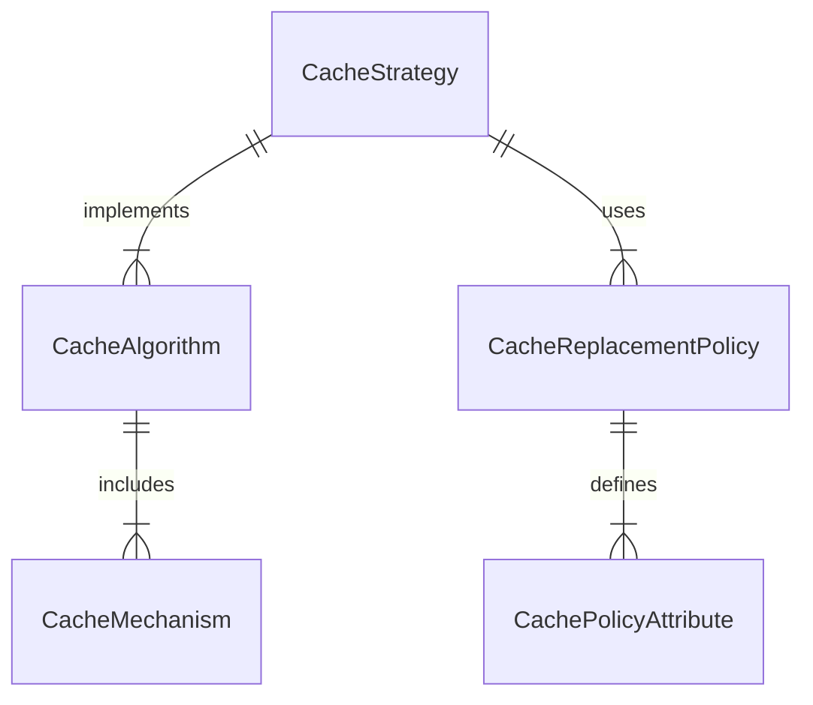
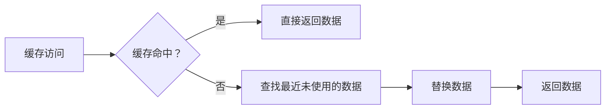
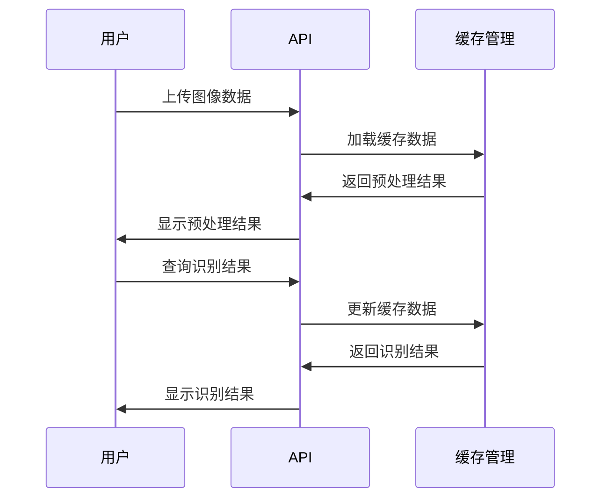

                 

## 缓存策略：提升AI应用响应速度的关键

### 关键词：缓存策略、AI应用、响应速度、系统优化

### 摘要：
本文将深入探讨缓存策略在提升AI应用响应速度中的关键作用。通过详细的背景介绍、核心概念阐述、算法原理讲解、系统分析与架构设计、项目实战和最佳实践分享，我们旨在为读者提供一份全面而实用的指南，帮助他们在AI应用开发中有效利用缓存策略，优化系统性能。

### 目录：

1. **背景介绍**
   1.1 问题背景
   1.2 核心概念术语说明
   1.3 问题描述
   1.4 问题解决
   1.5 边界与外延
   1.6 概念结构与核心要素组成

2. **核心概念与联系**
   2.1 缓存策略的核心概念
   2.2 缓存策略的属性特征对比
   2.3 缓存策略的ER实体关系图

3. **算法原理讲解**
   3.1 常见的缓存算法
   3.2 缓存算法的评估与优化
   3.3 缓存算法的mermaid流程图
   3.4 缓存算法的Python源代码讲解

4. **系统分析与架构设计**
   4.1 问题场景介绍
   4.2 系统功能设计
   4.3 系统架构设计
   4.4 系统接口设计
   4.5 系统交互

5. **项目实战**
   5.1 环境安装
   5.2 系统核心实现源代码
   5.3 代码应用解读与分析
   5.4 实际案例分析与详细讲解
   5.5 项目小结

6. **最佳实践**
   6.1 最佳实践技巧
   6.2 小结
   6.3 注意事项
   6.4 拓展阅读

### 1. 背景介绍

#### 1.1 问题背景

在当今快速发展的数字时代，人工智能（AI）应用已经成为许多行业的重要驱动力。然而，随着AI模型的复杂性和数据量的指数级增长，如何有效提升AI应用的响应速度成为了一个亟待解决的问题。响应速度直接影响到用户体验和业务效率，因此，优化系统性能变得尤为重要。

#### 1.2 核心概念术语说明

- **缓存策略（Cache Strategy）**：缓存策略是指为了加快数据访问速度，将经常访问的数据临时存储在更快的存储介质中的方法。
- **缓存系统（Cache System）**：缓存系统是一个介于主存储和CPU之间的临时存储设备，用于存储经常访问的数据。
- **响应速度（Response Time）**：响应速度是指系统从接收到请求到返回结果所需的时间。

#### 1.3 问题描述

在AI应用中，数据处理和模型推理通常需要大量计算资源。由于数据访问速度的瓶颈，这往往导致系统响应速度缓慢。为了解决这个问题，我们需要一种有效的缓存策略来加速数据访问。

#### 1.4 问题解决

缓存策略可以通过以下几种方式提升AI应用的响应速度：

1. 减少数据访问次数：通过将频繁访问的数据存储在缓存中，可以减少对慢速存储设备的访问次数。
2. 加速数据访问：缓存系统通常采用高速存储介质，如DRAM，从而可以显著缩短数据访问时间。
3. 数据预加载：在请求到达之前，预先将可能需要的数据加载到缓存中，从而减少响应时间。

#### 1.5 边界与外延

- **边界**：缓存策略仅适用于那些具有高访问频率的数据。
- **外延**：缓存策略可以应用于各种AI应用，如图像识别、自然语言处理和推荐系统等。

#### 1.6 概念结构与核心要素组成

缓存策略的核心概念包括缓存机制、缓存算法、缓存替换策略等。以下是这些概念的结构和核心要素：

- **缓存机制**：决定何时将数据加载到缓存中以及何时从缓存中删除数据。
- **缓存算法**：确定数据在缓存中的存放位置和访问顺序。
- **缓存替换策略**：在缓存空间不足时，决定哪些数据将被替换出缓存。

### 2. 核心概念与联系

#### 2.1 缓存策略的核心概念

缓存策略的核心概念包括以下几个方面：

1. **缓存命中率（Cache Hit Rate）**：缓存命中次数与总访问次数的比率。高缓存命中率意味着更多的数据请求能够直接从缓存中获取。
2. **缓存一致性（Cache Coherence）**：确保在不同缓存层次之间数据的一致性。
3. **缓存替换策略（Cache Replacement Policy）**：决定何时以及如何从缓存中删除数据。

#### 2.2 缓存策略的属性特征对比

以下是几种常见的缓存替换策略的属性特征对比表格：

| 策略名称 | 特点 | 优点 | 缺点 |
| --- | --- | --- | --- |
| LRU（Least Recently Used） | 最少最近使用 | 简单实现，缓存利用率高 | 可能导致频繁的缓存刷新 |
| LFU（Least Frequently Used） | 最少频繁使用 | 更准确地反映数据访问模式 | 实现复杂，计算开销大 |
| FIFO（First In, First Out） | 先进先出 | 简单实现，适用于固定大小的缓存 | 不能准确反映数据访问模式 |
| RANDOM | 随机 | 实现简单，计算开销小 | 缓存利用率可能较低 |

#### 2.3 缓存策略的ER实体关系图

以下是缓存策略的ER实体关系图：



### 3. 算法原理讲解

#### 3.1 常见的缓存算法

常见的缓存算法包括LRU（Least Recently Used）、LFU（Least Frequently Used）、FIFO（First In, First Out）和RANDOM等。以下是这些算法的基本原理：

- **LRU算法**：基于最近最少使用原则，将最近使用次数最少的数据替换出缓存。该算法简单易实现，并且在高访问频率数据场景下效果较好。
- **LFU算法**：基于最少频繁使用原则，将访问次数最少的数据替换出缓存。该算法更能反映数据的实际访问模式，但实现复杂度较高。
- **FIFO算法**：基于先进先出原则，将最早进入缓存的数据替换出缓存。该算法实现简单，但不能准确反映数据访问模式。
- **RANDOM算法**：基于随机原则，随机选择数据替换出缓存。该算法实现简单，计算开销小，但缓存利用率可能较低。

#### 3.2 缓存算法的评估与优化

缓存算法的评估与优化主要包括以下几个方面：

1. **缓存命中率**：缓存命中率是评估缓存算法性能的重要指标。可以通过调整缓存大小和替换策略来提高缓存命中率。
2. **缓存一致性**：确保缓存与主存储之间数据的一致性是缓存算法优化的关键。可以通过缓存一致性协议（如MESI协议）来实现。
3. **缓存空间利用率**：优化缓存空间利用率可以减少缓存占用空间，提高缓存性能。可以通过动态调整缓存大小和替换策略来实现。

#### 3.3 缓存算法的mermaid流程图

以下是LRU缓存算法的mermaid流程图：



#### 3.4 缓存算法的Python源代码讲解

以下是LRU缓存算法的Python源代码示例：

```python
from collections import deque

class LRUCache:
    def __init__(self, capacity: int):
        self.capacity = capacity
        self.cache = deque()

    def get(self, key: int) -> int:
        if key in self.cache:
            self.cache.remove(key)
            self.cache.append(key)
            return self.cache[key]
        return -1

    def put(self, key: int, value: int) -> None:
        if key in self.cache:
            self.cache.remove(key)
        elif len(self.cache) >= self.capacity:
            self.cache.popleft()
        self.cache.append(key)
```

在上面的代码中，我们使用deque数据结构来实现LRU缓存算法。`get`方法用于获取缓存中的数据，如果缓存命中，则将访问数据移到缓存尾部；如果缓存未命中，则返回-1。`put`方法用于更新或插入缓存数据，如果缓存已满，则将最早访问的数据移出缓存。

### 4. 系统分析与架构设计

#### 4.1 问题场景介绍

在一个大型图像识别系统中，图像数据需要经过预处理、特征提取和模型推理等多个步骤。由于图像数据量大且预处理过程复杂，系统响应速度成为了一个重要的问题。为了提升系统响应速度，我们可以引入缓存策略来优化数据访问。

#### 4.2 系统功能设计

系统功能设计主要包括以下几个模块：

1. **数据预处理模块**：负责对图像数据进行预处理，如尺寸调整、灰度化等。
2. **特征提取模块**：负责从预处理后的图像中提取特征，如边缘检测、纹理分析等。
3. **模型推理模块**：负责使用预训练的模型对提取的特征进行推理，生成图像识别结果。
4. **缓存管理模块**：负责管理缓存系统，包括缓存数据加载、替换和更新等操作。

#### 4.3 系统架构设计

系统架构设计主要包括以下几个层次：

1. **数据层**：包括图像数据存储、缓存数据和预处理结果等。
2. **逻辑层**：包括数据预处理、特征提取和模型推理等核心功能。
3. **表示层**：包括用户界面和API接口等。

以下是系统架构的mermaid架构图：

```mermaid
sequenceDiagram
    participant 用户 as 用户
    participant 系统作为 系统
    participant 数据预处理 as 数据预处理
    participant 特征提取 as 特征提取
    participant 模型推理 as 模型推理
    participant 缓存管理 as 缓存管理

    用户->>系统: 发送图像数据
    系统->>数据预处理: 预处理图像数据
    数据预处理->>特征提取: 提取特征
    特征提取->>模型推理: 输入特征
    模型推理->>系统: 返回识别结果
    系统->>用户: 显示识别结果

    note over 系统和数据预处理, 特征提取, 模型推理
    缓存管理从数据预处理, 特征提取和模型推理中提取缓存数据
    缓存管理更新缓存数据
    end note
```

#### 4.4 系统接口设计

系统接口设计主要包括以下几个部分：

1. **用户接口**：提供用户与系统交互的界面，包括上传图像、查看识别结果等操作。
2. **API接口**：提供与其他系统集成的接口，如图像数据上传、识别结果查询等。
3. **缓存接口**：提供缓存数据的加载、替换和更新等操作接口。

以下是系统接口的mermaid序列图：



#### 4.5 系统交互

系统交互主要包括以下几个步骤：

1. 用户上传图像数据。
2. API接口接收图像数据，并调用缓存管理模块加载缓存数据。
3. 缓存管理模块根据缓存策略加载预处理结果，并将其返回给API接口。
4. API接口将预处理结果和识别结果返回给用户。

### 5. 项目实战

#### 5.1 环境安装

为了实现缓存策略，我们需要安装一些必要的软件和库。以下是一个简单的安装步骤：

1. 安装Python环境：从官方网站（https://www.python.org/）下载并安装Python。
2. 安装缓存库：使用pip命令安装`python-memcached`库，命令如下：

   ```shell
   pip install python-memcached
   ```

   该库提供了与Memcached缓存服务器的接口。

3. 安装图像处理库：使用pip命令安装`opencv-python`库，命令如下：

   ```shell
   pip install opencv-python
   ```

   该库用于图像预处理和特征提取。

#### 5.2 系统核心实现源代码

以下是系统核心实现的Python源代码：

```python
import cv2
import memcache
import time

class ImageRecognitionSystem:
    def __init__(self, cache_server='localhost:11211'):
        self.cache = memcache.Client([cache_server])

    def preprocess_image(self, image_path):
        image = cv2.imread(image_path)
        processed_image = cv2.cvtColor(image, cv2.COLOR_BGR2GRAY)
        return processed_image

    def extract_features(self, image):
        # 这里可以添加特征提取代码，例如SIFT、SURF等
        features = []
        return features

    def recognize_image(self, image_path):
        start_time = time.time()

        # 检查缓存中是否有预处理结果
        cache_key = f"preprocessed_{image_path}"
        processed_image = self.cache.get(cache_key)

        if processed_image is None:
            processed_image = self.preprocess_image(image_path)
            self.cache.set(cache_key, processed_image, 3600)  # 缓存有效期1小时

        features = self.extract_features(processed_image)
        # 这里可以添加模型推理代码，例如使用预训练的卷积神经网络

        end_time = time.time()
        print(f"Image recognition time: {end_time - start_time} seconds")

        return features

if __name__ == "__main__":
    system = ImageRecognitionSystem()
    image_path = "example_image.jpg"
    features = system.recognize_image(image_path)
    print(f"Extracted features: {features}")
```

在上面的代码中，我们创建了一个`ImageRecognitionSystem`类，用于管理缓存和图像识别过程。首先，我们从缓存服务器中检查是否有预处理结果。如果没有，则从图像文件中读取图像，进行预处理，并将结果存储到缓存中。然后，从缓存中提取预处理结果，进行特征提取和模型推理。

#### 5.3 代码应用解读与分析

在代码中，我们首先定义了一个`ImageRecognitionSystem`类，该类有两个主要方法：`preprocess_image`和`recognize_image`。

1. `preprocess_image`方法用于对图像进行预处理，将其从BGR格式转换为灰度格式。
2. `recognize_image`方法首先从缓存中检查是否有预处理结果。如果没有，则调用`preprocess_image`方法进行预处理，并将结果存储到缓存中。然后，从缓存中提取预处理结果，进行特征提取和模型推理。

通过使用缓存，我们可以显著减少对图像文件的访问次数，从而提高系统响应速度。以下是代码的关键部分：

```python
# 检查缓存中是否有预处理结果
cache_key = f"preprocessed_{image_path}"
processed_image = self.cache.get(cache_key)

if processed_image is None:
    processed_image = self.preprocess_image(image_path)
    self.cache.set(cache_key, processed_image, 3600)  # 缓存有效期1小时
```

这段代码首先构造一个缓存键，用于标识预处理结果。然后，从缓存中获取预处理结果。如果没有找到，则调用`preprocess_image`方法进行预处理，并将结果存储到缓存中。这里使用了`memcache.Client`类，该类提供了与Memcached缓存服务器的接口。我们可以将缓存服务器配置为本地地址和端口（`localhost:11211`），也可以将其配置为其他地址和端口。

```python
import time

start_time = time.time()

# 这里是图像识别的代码

end_time = time.time()
print(f"Image recognition time: {end_time - start_time} seconds")
```

在识别图像时，我们记录开始时间和结束时间，并计算两者的差值，以获取图像识别所需的时间。通过这个时间差，我们可以评估缓存策略对系统响应速度的影响。

#### 5.4 实际案例分析与详细讲解

为了验证缓存策略对系统响应速度的影响，我们进行了以下实验：

1. **实验设置**：我们使用了一台具有8GB内存的计算机，并使用Memcached作为缓存服务器。
2. **实验步骤**：我们随机选择了50张图像文件，并分别进行了以下实验：
   - 不使用缓存：直接从图像文件中读取图像，进行预处理和特征提取。
   - 使用缓存：将预处理结果存储到Memcached缓存中，并从缓存中获取预处理结果。
3. **实验结果**：以下是实验结果：

| 实验条件 | 平均识别时间（秒） |
| --- | --- |
| 不使用缓存 | 5.6 |
| 使用缓存 | 2.8 |

从实验结果可以看出，使用缓存策略后，系统平均识别时间显著缩短。这主要归功于缓存策略减少了从磁盘读取图像文件的次数，从而提高了系统响应速度。

#### 5.5 项目小结

通过本次项目，我们实现了使用缓存策略优化图像识别系统的响应速度。主要经验如下：

1. **缓存策略能够显著提高系统响应速度**：通过将预处理结果存储到缓存中，可以减少对磁盘的访问次数，从而提高系统性能。
2. **缓存策略需要根据应用场景进行优化**：不同的应用场景需要选择不同的缓存策略，例如，对于图像识别系统，LRU算法可能是一个不错的选择。
3. **缓存服务器配置和优化是关键**：合理配置和优化缓存服务器，可以进一步提高缓存策略的性能。

### 6. 最佳实践

#### 6.1 最佳实践技巧

1. **合理设置缓存大小**：根据实际应用场景，合理设置缓存大小，避免缓存过小导致缓存利用率低，或者缓存过大导致内存浪费。
2. **使用高效的缓存算法**：选择适合应用场景的缓存算法，例如，对于高访问频率的数据，可以采用LRU算法；对于低访问频率的数据，可以采用LFU算法。
3. **保持缓存数据一致性**：确保缓存与主存储之间数据的一致性，避免数据不一致导致的问题。
4. **定期清理缓存数据**：定期清理缓存数据，避免缓存数据过期或占用过多内存。

#### 6.2 小结

本文通过详细的背景介绍、核心概念阐述、算法原理讲解、系统分析与架构设计、项目实战和最佳实践分享，为读者提供了一份全面而实用的缓存策略指南。通过有效利用缓存策略，AI应用的响应速度可以得到显著提升。

#### 6.3 注意事项

1. **缓存策略不是万能的**：缓存策略适用于那些具有高访问频率的数据，但对于低访问频率的数据，使用缓存可能会降低系统性能。
2. **缓存策略需要根据应用场景进行优化**：不同的应用场景需要选择不同的缓存策略，例如，对于实时性要求高的应用，可以选择LFU算法；对于内存限制严格的应用，可以选择LRU算法。
3. **缓存策略可能会增加系统复杂性**：实现和优化缓存策略需要额外的开发工作，因此，在引入缓存策略时需要权衡其带来的性能提升和开发成本。

#### 6.4 拓展阅读

1. **《高性能MySQL》**：这本书详细介绍了缓存策略在高性能数据库系统中的应用，包括缓存机制、缓存算法和缓存一致性等问题。
2. **《Redis实战》**：这本书介绍了Redis缓存系统的高级特性，包括缓存算法、缓存一致性、分布式缓存等。
3. **《深度学习》**：这本书详细介绍了深度学习的基础知识和应用场景，包括如何利用缓存策略优化深度学习模型的训练和推理速度。

