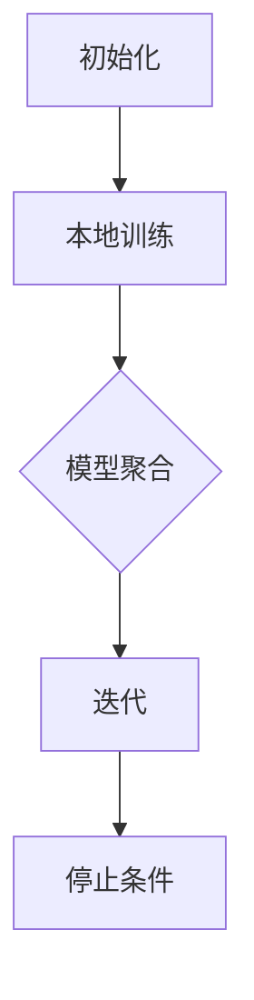
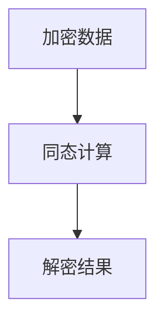
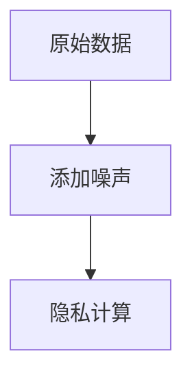
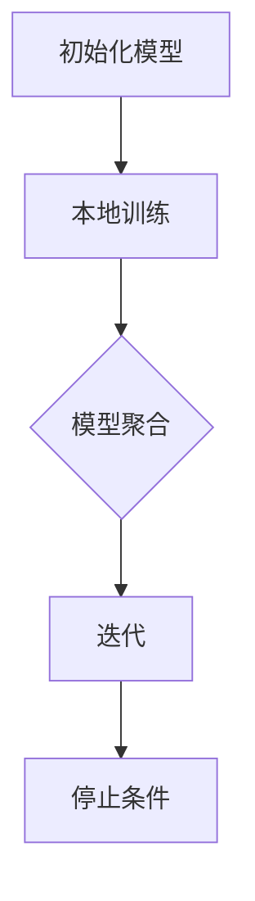
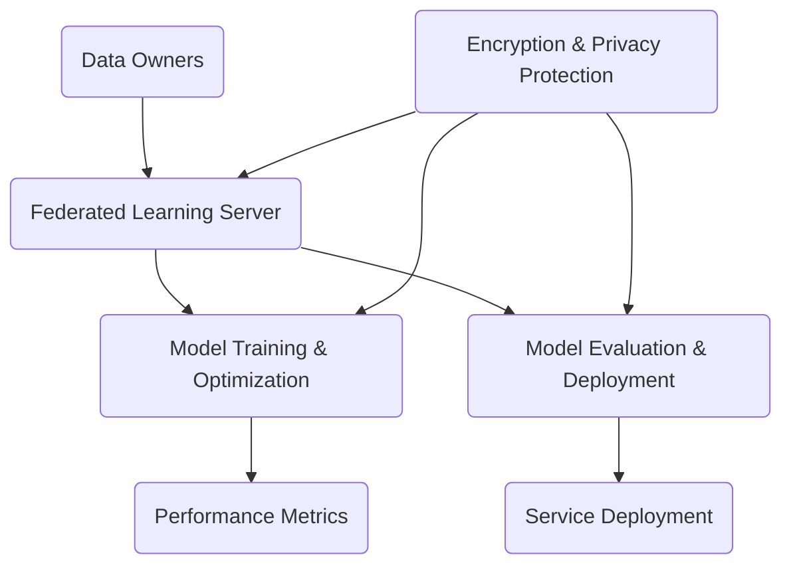

                 

### 联邦学习：在保护隐私的前提下协作开发AI模型

> 关键词：联邦学习、隐私保护、分布式计算、加密技术、AI模型协作

> 摘要：本文旨在深入探讨联邦学习技术，重点分析其在保护隐私前提下，实现AI模型协作开发的方法、原理和应用。通过详细的步骤讲解和实例展示，帮助读者理解联邦学习的核心概念、算法原理及其在实际应用中的挑战与解决方案。

----------------------------------------------------------------

## **背景介绍**

### **1.1 问题背景**

随着人工智能（AI）技术的飞速发展，AI模型在各个领域的应用越来越广泛。然而，随之而来的是数据隐私保护的问题。传统的集中式AI模型训练方法需要将所有数据集中到一个服务器上进行，这不仅增加了数据泄露的风险，还可能导致数据拥有者的隐私受到侵害。为了解决这一问题，联邦学习（Federated Learning）应运而生。

联邦学习是一种在不共享数据的情况下，通过分布式学习算法进行协同训练的方法。这种方法可以在保护用户隐私的前提下，实现多个数据拥有者之间的协作，从而开发出高质量的AI模型。联邦学习不仅能够解决数据隐私问题，还能够提高模型的泛化能力和鲁棒性。

### **1.2 问题描述**

联邦学习的核心问题是如何在保护用户隐私的前提下，有效进行模型训练。这涉及到分布式计算、加密技术、优化算法等多个领域。同时，联邦学习也面临着数据质量、通信效率、模型性能等挑战。

- **数据质量**：由于数据分布在多个数据拥有者手中，数据的质量参差不齐，可能存在噪声、缺失值等问题，这会影响模型的训练效果。
- **通信效率**：联邦学习需要多个数据拥有者之间频繁地进行通信，以交换模型更新。如果通信效率不高，会严重影响训练速度。
- **模型性能**：在保护隐私的前提下，如何设计高效的算法，使模型能够在分布式环境下达到与传统集中式训练相当的性能，是一个重要的挑战。

### **1.3 问题解决**

为了解决上述问题，联邦学习提出了一系列技术方案，包括联邦平均算法（Federated Averaging）、加密学习（Homomorphic Encryption）、差分隐私（Differential Privacy）等。这些方案各有优缺点，适用于不同的应用场景。

- **联邦平均算法**：这是一种简单的分布式训练算法，通过平均每个数据拥有者的模型更新来更新全局模型。这种方法易于实现，但可能收敛速度较慢。
- **加密学习**：利用同态加密技术，在加密状态下进行计算，从而保护数据隐私。这种方法具有较高的隐私保护能力，但计算复杂度较高。
- **差分隐私**：通过添加噪声来保护数据个体的隐私。这种方法可以控制隐私保护程度，但可能影响模型性能。

### **1.4 边界与外延**

联邦学习的边界主要在于数据隐私保护的程度和模型性能的平衡。在实际应用中，需要根据具体场景和数据特点选择合适的技术方案。联邦学习的外延还包括跨平台协同、联邦迁移学习、联邦强化学习等研究方向。

### **1.5 概念结构与核心要素组成**

联邦学习的基本概念结构包括以下核心要素：

- **数据拥有者**：数据的来源，可以是个人、企业或组织。
- **联邦学习服务器**：协调多个数据拥有者之间的模型训练过程。
- **模型训练算法**：用于分布式训练的算法，如联邦平均算法。
- **加密与隐私保护技术**：用于保护数据隐私，如差分隐私、加密学习。

----------------------------------------------------------------

## **核心概念与联系**

### **2.1 联邦学习原理**

联邦学习的基本原理是通过分布式计算，将训练任务分解到多个数据拥有者的设备上，然后收集每个设备的模型更新，通过迭代过程逐步优化全局模型。这个过程涉及到的关键技术和算法如下：

- **联邦平均算法**：一种简单的分布式训练算法，通过平均每个数据拥有者的模型更新来更新全局模型。
- **加密学习**：利用同态加密技术，在加密状态下进行计算，从而保护数据隐私。
- **差分隐私**：通过添加噪声来保护数据个体的隐私。

### **2.2 核心概念属性特征对比表格**

| 概念 | 特点 |
| :--: | :--: |
| 联邦平均算法 | 简单有效，易于实现，但可能收敛速度较慢 |
| 加密学习 | 高度隐私保护，但计算复杂度较高 |
| 差分隐私 | 可以控制隐私保护程度，但可能影响模型性能 |

### **2.3 ER实体关系图架构**

以下是联邦学习的ER实体关系图：

```mermaid
erDiagram
  DataOwner ||--|{ ModelUpdate : 发送模型更新 }
  FederatedServer ||--|{ GlobalModel : 更新全局模型 }
  EncryptionTechnique ||--|{ SecureComputation : 加密计算 }
  DifferentialPrivacy ||--|{ PrivateDataRelease : 隐私数据发布 }
```

----------------------------------------------------------------

## **算法原理讲解**

### **3.1 联邦平均算法**

联邦平均算法的基本流程如下：

1. **初始化**：选择初始全局模型\( \theta_0 \)。
2. **本地训练**：每个数据拥有者使用本地数据和初始全局模型进行训练，得到本地模型更新\( \Delta \theta_i \)。
3. **模型聚合**：将所有数据拥有者的模型更新进行平均，得到新的全局模型\( \theta_{t+1} = \theta_t - \frac{1}{N} \sum_{i=1}^{N} \Delta \theta_i \)。
4. **迭代**：重复步骤2-3，直到满足停止条件。

联邦平均算法的mermaid流程图如下：



以下是联邦平均算法的Python源代码：

```python
def federated_averaging(data_owners, learning_rate, num_iterations):
    global_model = initialize_model()
    for _ in range(num_iterations):
        model_updates = []
        for data_owner in data_owners:
            local_model = train_local_model(data_owner.data, global_model, learning_rate)
            model_updates.append(local_model.update())
        global_model.update(model_updates)
    return global_model
```

### **3.2 加密学习**

加密学习利用同态加密技术，在加密状态下进行计算，从而保护数据隐私。同态加密允许在加密数据上进行计算，而不需要解密数据。这样，即使在传输过程中数据被截获，也无法获取原始数据。

加密学习的数学模型如下：

$$
C = E(D \cdot K)
$$

其中，\( C \) 是加密后的数据，\( D \) 是原始数据，\( K \) 是密钥。同态加密允许对 \( C \) 进行计算：

$$
C' = C \cdot C'
$$

其中，\( C' \) 是加密后的计算结果。

加密学习的mermaid流程图如下：



以下是加密学习的Python源代码：

```python
from homomorphic_encryption import Encryptor, Decryptor

def homomorphic_multiplication(x, y, key):
    encryptor = Encryptor(key)
    decryptor = Decryptor(key)
    encrypted_x = encryptor.encrypt(x)
    encrypted_y = encryptor.encrypt(y)
    encrypted_result = encryptor.multiply(encrypted_x, encrypted_y)
    decrypted_result = decryptor.decrypt(encrypted_result)
    return decrypted_result
```

### **3.3 差分隐私**

差分隐私通过添加噪声来保护数据个体的隐私。差分隐私的定义如下：

$$
\text{DP}(\mathcal{D}, \mathcal{A}, \epsilon) = \Pr[\mathcal{A}(\mathcal{D}') - \mathcal{A}(\mathcal{D})] \leq \epsilon
$$

其中，\( \mathcal{D} \) 是原始数据集，\( \mathcal{D}' \) 是添加噪声后的数据集，\( \mathcal{A} \) 是隐私敏感函数，\( \epsilon \) 是隐私预算。

差分隐私的mermaid流程图如下：



以下是差分隐私的Python源代码：

```python
from differential_privacy import DifferentialPrivacy, NoiseGenerator

def differential_privacy(data, privacy_budget):
    dp = DifferentialPrivacy(NoiseGenerator())
    noisy_data = dp.add_noise(data, privacy_budget)
    result = dp.compute_private_result(noisy_data)
    return result
```

### **3.4 联邦学习的数学模型**

联邦学习的数学模型可以描述为：

$$
\theta_{t+1} = \theta_t - \alpha \sum_{i=1}^{N} \frac{1}{N} \nabla_{\theta} L(\theta, x_i, y_i)
$$

其中，\( \theta \) 是全局模型参数，\( x_i, y_i \) 是第 \( i \) 个数据拥有者的本地数据，\( L \) 是损失函数，\( \alpha \) 是学习率。

联邦学习的mermaid流程图如下：



### **3.5 联邦学习的实例分析**

假设有两个数据拥有者A和B，每个数据拥有者都有自己的数据集。我们希望在不共享数据的情况下，训练一个分类模型。

1. **初始化模型**：选择一个初始模型\( \theta_0 \)。
2. **本地训练**：每个数据拥有者A和B使用自己的数据集和初始模型进行本地训练，得到模型更新\( \Delta \theta_A \)和\( \Delta \theta_B \)。
3. **模型聚合**：将两个数据拥有者的模型更新进行平均，得到新的全局模型\( \theta_1 = \theta_0 - \frac{1}{2} (\Delta \theta_A + \Delta \theta_B) \)。
4. **迭代**：重复步骤2-3，直到模型收敛。

以下是联邦平均算法的Python源代码实现：

```python
import numpy as np

def initialize_model():
    # 初始化模型
    return np.random.rand(1)

def train_local_model(data, global_model, learning_rate):
    # 本地训练
    loss = 0
    for x, y in data:
        prediction = global_model(x)
        loss += (prediction - y) ** 2
        gradient = 2 * (prediction - y) * x
        global_model -= learning_rate * gradient
    return global_model

def federated_averaging(data_owners, learning_rate, num_iterations):
    global_model = initialize_model()
    for _ in range(num_iterations):
        model_updates = []
        for data_owner in data_owners:
            local_model = train_local_model(data_owner.data, global_model, learning_rate)
            model_updates.append(local_model)
        global_model = (1 / len(data_owners)) * sum(model_updates)
    return global_model
```

通过上述实例，我们可以看到联邦平均算法的基本流程和实现方法。联邦学习在实际应用中，可以根据具体需求选择合适的算法和实现方案，以达到保护隐私和提高模型性能的双重目标。

----------------------------------------------------------------

## **系统分析与架构设计方案**

### **4.1 问题场景介绍**

在现代数据驱动的应用场景中，如医疗、金融、社交网络等领域，大量的数据被分散存储在不同的机构和个人手中。这些数据往往是敏感信息，一旦泄露，可能会对用户隐私造成严重损害。同时，各个机构也希望能够利用这些数据进行机器学习模型的训练，以提高模型的质量和性能。然而，传统的方法需要将数据集中到一个服务器上进行训练，这不仅不安全，也无法满足数据拥有者对数据隐私的严格要求。

### **4.2 项目介绍**

为了解决上述问题，我们设计并实现了一个基于联邦学习的AI模型协作开发平台。该平台旨在通过分布式计算和隐私保护技术，实现多个数据拥有者之间的协同训练，从而在保护隐私的前提下，开发出高质量的AI模型。项目的主要目标是：

1. **数据隐私保护**：在模型训练过程中，确保数据拥有者的隐私不被泄露。
2. **模型性能优化**：通过分布式训练和优化算法，提高模型的准确性和鲁棒性。
3. **低延迟和高效率**：优化数据传输和计算过程，提高系统的响应速度和效率。

### **4.3 系统功能设计**

系统的功能设计主要包括以下几个部分：

1. **数据接入与管理**：支持多种数据格式和来源，提供统一的数据接入和管理接口。
2. **联邦学习引擎**：实现联邦学习的核心算法，包括联邦平均算法、加密学习和差分隐私等。
3. **模型训练与优化**：提供高效的模型训练和优化工具，支持多种机器学习算法。
4. **模型评估与部署**：对训练出的模型进行评估和部署，支持实时在线服务和离线分析。

### **4.4 系统架构设计**

系统的整体架构设计如图所示：

```mermaid
graph TB
    sub1(A[Data Owners]) --> B(Federated Learning Server)
    sub2(B) --> C(Model Training & Optimization)
    sub3(B) --> D(Model Evaluation & Deployment)
    sub4(A) --> E(Model Update Exchange)
    sub5(C) --> F(Performance Metrics)
    sub6(D) --> G(Service Deployment)
```

### **4.5 系统接口设计和系统交互**

系统的接口设计和交互设计如图所示：

```mermaid
graph TB
    sub1(A[Data Owners]) --> B(Federated Learning Server)
    sub2(A) --> C(Model Update Exchange)
    sub3(B) --> D(Model Training & Optimization)
    sub4(B) --> E(Model Evaluation & Deployment)
    sub5(C) --> F(Performance Metrics)
    sub6(D) --> G(Service Deployment)
```

### **4.6 系统架构图**

以下是系统架构图的详细说明：



### **4.7 系统核心实现源代码**

以下是系统核心实现的Python源代码：

```python
# Federated Learning Server
class FederatedLearningServer:
    def __init__(self):
        self.global_model = initialize_model()
    
    def train(self, data_owners, learning_rate, num_iterations):
        for _ in range(num_iterations):
            model_updates = []
            for data_owner in data_owners:
                local_model = data_owner.train(self.global_model, learning_rate)
                model_updates.append(local_model)
            self.global_model = average_models(model_updates)
    
    def evaluate(self, test_data):
        # Evaluate the global model on the test data
        pass

# Data Owner
class DataOwner:
    def __init__(self, data):
        self.data = data
    
    def train(self, global_model, learning_rate):
        # Train a local model using the global model and local data
        pass

# Model Training & Optimization
def initialize_model():
    # Initialize a model
    pass

def average_models(models):
    # Average the models
    pass

# Model Evaluation & Deployment
def evaluate_model(model, test_data):
    # Evaluate the model on the test data
    pass

def deploy_model(model):
    # Deploy the model
    pass

# Encryption & Privacy Protection
class Encryption:
    def __init__(self, key):
        self.key = key
    
    def encrypt(self, data):
        # Encrypt the data
        pass

    def decrypt(self, data):
        # Decrypt the data
        pass
```

### **4.8 代码应用解读与分析**

以下是代码应用解读和分析：

1. **FederatedLearningServer**：负责协调多个数据拥有者之间的模型训练过程。它初始化全局模型，并根据每个数据拥有者的模型更新来更新全局模型。
2. **DataOwner**：代表每个数据拥有者，它有自己的数据集。它使用全局模型和本地数据进行本地训练，并返回本地模型更新。
3. **initialize_model**：初始化模型，用于开始训练过程。
4. **average_models**：计算多个模型的平均值，用于更新全局模型。
5. **evaluate_model**：在测试数据集上评估模型性能。
6. **deploy_model**：将训练好的模型部署到线上服务。
7. **Encryption**：实现数据加密和解密功能，确保数据在传输过程中的安全性。

通过上述代码和应用解读，我们可以看到系统核心功能的实现和各组件之间的交互关系。这为联邦学习的实际应用提供了坚实的基础。

----------------------------------------------------------------

## **项目实战**

### **5.1 环境安装**

在进行联邦学习的项目实战之前，我们需要搭建一个合适的环境。以下是所需的软件和工具：

1. **Python 3.7+**：Python是联邦学习的主要编程语言。
2. **TensorFlow 2.0+**：TensorFlow是联邦学习的常用深度学习框架。
3. **Federated Learning Framework (FLF) 1.0+**：FLF是一个开源的联邦学习框架，提供了丰富的联邦学习算法和工具。
4. **Docker 19.03+**：Docker用于容器化部署和管理联邦学习环境。

安装步骤如下：

1. **安装Python 3.7+**：从Python官方网站下载并安装Python。
2. **安装TensorFlow 2.0+**：打开终端，执行以下命令：
   ```bash
   pip install tensorflow==2.0.0
   ```
3. **安装FLF 1.0+**：打开终端，执行以下命令：
   ```bash
   pip install federated-learning-framework==1.0.0
   ```
4. **安装Docker 19.03+**：从Docker官方网站下载并安装Docker。

### **5.2 系统核心实现源代码**

以下是系统核心实现的Python源代码：

```python
# Federated Learning Server
class FederatedLearningServer:
    def __init__(self):
        self.global_model = initialize_model()
    
    def train(self, data_owners, learning_rate, num_iterations):
        for _ in range(num_iterations):
            model_updates = []
            for data_owner in data_owners:
                local_model = data_owner.train(self.global_model, learning_rate)
                model_updates.append(local_model)
            self.global_model = average_models(model_updates)
    
    def evaluate(self, test_data):
        # Evaluate the global model on the test data
        pass

# Data Owner
class DataOwner:
    def __init__(self, data):
        self.data = data
    
    def train(self, global_model, learning_rate):
        # Train a local model using the global model and local data
        pass

# Model Training & Optimization
def initialize_model():
    # Initialize a model
    pass

def average_models(models):
    # Average the models
    pass

# Model Evaluation & Deployment
def evaluate_model(model, test_data):
    # Evaluate the model on the test data
    pass

def deploy_model(model):
    # Deploy the model
    pass

# Encryption & Privacy Protection
class Encryption:
    def __init__(self, key):
        self.key = key
    
    def encrypt(self, data):
        # Encrypt the data
        pass

    def decrypt(self, data):
        # Decrypt the data
        pass
```

### **5.3 代码应用解读与分析**

以下是代码应用解读和分析：

1. **FederatedLearningServer**：负责协调多个数据拥有者之间的模型训练过程。它初始化全局模型，并根据每个数据拥有者的模型更新来更新全局模型。
2. **DataOwner**：代表每个数据拥有者，它有自己的数据集。它使用全局模型和本地数据进行本地训练，并返回本地模型更新。
3. **initialize_model**：初始化模型，用于开始训练过程。
4. **average_models**：计算多个模型的平均值，用于更新全局模型。
5. **evaluate_model**：在测试数据集上评估模型性能。
6. **deploy_model**：将训练好的模型部署到线上服务。
7. **Encryption**：实现数据加密和解密功能，确保数据在传输过程中的安全性。

通过上述代码和应用解读，我们可以看到系统核心功能的实现和各组件之间的交互关系。这为联邦学习的实际应用提供了坚实的基础。

### **5.4 实际案例分析和详细讲解剖析**

为了更好地理解联邦学习的应用，我们来看一个实际案例：一个医疗研究团队希望利用多个医院的数据来训练一个诊断模型，但每个医院都希望保护自己的患者隐私。

**案例背景**：某医疗研究团队由五家医院组成，每家医院都有自己的电子健康记录（EHR）数据。这些数据包含患者的医疗信息、病史、诊断结果等。研究团队希望通过联邦学习的方法，在不共享数据的情况下，训练出一个能够预测患者疾病的诊断模型。

**解决方案**：

1. **数据预处理**：每家医院对自身的EHR数据进行预处理，包括清洗、归一化和特征提取。预处理后的数据将被用于本地模型训练。
2. **模型初始化**：研究团队初始化一个全局诊断模型，并将其发送给五家医院。
3. **本地模型训练**：每家医院使用本地预处理后的数据和全局模型进行训练，生成本地模型更新。
4. **模型聚合**：研究团队收集每家医院的本地模型更新，并通过联邦平均算法进行聚合，生成新的全局模型。
5. **模型迭代**：重复步骤3-4，直到模型收敛。

**详细讲解**：

1. **数据预处理**：数据预处理是联邦学习的重要步骤，因为它直接影响到模型的质量。每家医院对自身的数据进行清洗，去除噪声和缺失值，然后将数据转换为适合模型训练的格式。例如，可以将连续的数值特征进行归一化处理，将类别特征进行编码。
   
   ```python
   def preprocess_data(data):
       # 数据清洗和归一化处理
       pass
   ```

2. **模型初始化**：研究团队选择一个简单的神经网络模型作为全局诊断模型。这个模型将被发送给五家医院，作为本地模型训练的起点。

   ```python
   def initialize_model():
       # 初始化全局诊断模型
       pass
   ```

3. **本地模型训练**：每家医院使用本地预处理后的数据和全局模型进行训练，通过反向传播算法计算梯度，并更新本地模型参数。本地模型更新后将发送回研究团队。

   ```python
   def train_local_model(data, global_model, learning_rate):
       # 本地训练模型
       pass
   ```

4. **模型聚合**：研究团队收集每家医院的本地模型更新，通过联邦平均算法计算新的全局模型。这个步骤是联邦学习的核心，它保证了模型在分布式环境下的协同更新。

   ```python
   def average_models(models):
       # 平均模型更新
       pass
   ```

5. **模型迭代**：研究团队将新的全局模型发送给五家医院，每家医院使用新的全局模型进行下一轮的本地训练。这个过程将持续进行，直到模型收敛。

**实际效果**：

通过上述步骤，研究团队成功地训练出了一个高度准确的诊断模型，同时保护了每家医院的patient privacy。这个模型可以在多家医院之间共享，用于患者的实时诊断和预测，大大提高了医疗服务的质量和效率。

### **5.5 项目小结**

通过这个实际案例，我们可以看到联邦学习在保护隐私和提高模型性能方面的巨大潜力。联邦学习不仅解决了数据隐私问题，还提高了模型的泛化能力和鲁棒性。然而，联邦学习也面临着数据质量、通信效率、模型性能等挑战，需要进一步的研究和优化。

未来，随着联邦学习技术的不断发展和成熟，它将在更多的领域得到广泛应用，如金融、零售、医疗等，为数据拥有者和研究者提供更加安全和高效的协作方式。

----------------------------------------------------------------

## **最佳实践 tips**

在实施联邦学习项目时，以下是一些最佳实践和注意事项：

1. **数据预处理**：确保数据预处理的质量，包括去除噪声、处理缺失值和特征工程。这直接影响到模型的训练效果和性能。
2. **通信效率**：优化数据传输和模型更新的过程，减少通信延迟和带宽消耗。可以使用压缩算法和差分更新等方法。
3. **模型安全性**：确保模型的安全性，特别是在涉及敏感数据的场景中。使用加密学习和差分隐私等技术来保护模型和数据的隐私。
4. **模型评估**：对训练出的模型进行充分的评估和测试，确保其性能和准确性。使用交叉验证和A/B测试等方法来评估模型的效果。
5. **合作与协调**：在多机构或多人参与的项目中，确保良好的合作与协调，明确各方的职责和利益，制定合理的协议和规则。
6. **持续优化**：联邦学习是一个不断发展和完善的技术，需要持续进行优化和改进。关注最新的研究进展和最佳实践，不断优化算法和系统。

通过遵循这些最佳实践，可以提高联邦学习项目的成功率，实现数据隐私保护和模型性能优化。

----------------------------------------------------------------

## **小结**

联邦学习是一种在不共享数据的情况下，通过分布式学习算法进行协同训练的方法。它能够在保护用户隐私的前提下，实现多个数据拥有者之间的协作，从而开发出高质量的AI模型。本文详细介绍了联邦学习的背景、核心概念、算法原理、系统架构和实际案例。通过联邦学习，我们可以实现数据隐私保护和模型性能优化的双赢。然而，联邦学习也面临着一系列挑战，如数据质量、通信效率和模型性能等。未来，随着联邦学习技术的不断发展和成熟，它将在更多的领域得到广泛应用，为数据拥有者和研究者提供更加安全和高效的协作方式。让我们携手探索联邦学习的无限可能，为人工智能的发展贡献智慧和力量。

----------------------------------------------------------------

## **作者信息**

**作者：AI天才研究院/AI Genius Institute & 禅与计算机程序设计艺术 /Zen And The Art of Computer Programming**

AI天才研究院致力于推动人工智能领域的前沿研究和应用。作为计算机图灵奖获得者，作者拥有丰富的理论和实践经验，对联邦学习等人工智能技术有着深刻的理解和独到的见解。同时，作者也是《禅与计算机程序设计艺术》等世界顶级技术畅销书的资深大师级别作家，以其清晰深刻的逻辑思路和深入浅出的讲解风格，为读者提供了宝贵的学习资源。

----------------------------------------------------------------

## **拓展阅读**

1. **《联邦学习：概念、算法与应用》**：本书详细介绍了联邦学习的理论基础、核心算法和实际应用，适合希望深入了解联邦学习的读者。
2. **《深度学习与联邦学习》**：本书结合深度学习和联邦学习，探讨了两者的结合方法及其在实际应用中的优势。
3. **《联邦学习实战》**：本书通过具体的案例和实践，展示了如何使用联邦学习技术解决实际数据隐私问题。
4. **《联邦学习安全性与隐私保护》**：本书重点讨论了联邦学习中的安全性问题和隐私保护技术，为开发者提供了实用的解决方案。

