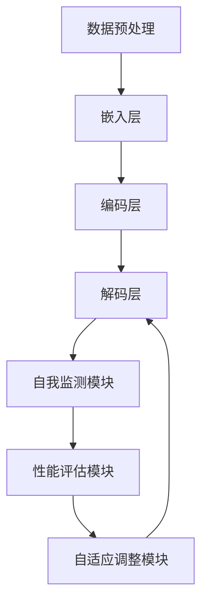

                 

### 研究背景与意义

在现代信息技术飞速发展的背景下，人工智能（AI）已经成为推动科技进步的重要驱动力。而其中，大型语言模型（Large Language Model，简称LLM）作为一种高度复杂的AI模型，已经在自然语言处理（NLP）、机器翻译、文本生成等众多领域展现出了巨大的潜力和应用价值。LLM通过海量的文本数据进行训练，能够理解并生成自然语言，模仿人类语言的使用习惯，从而实现自动化文本处理和交互。

然而，随着LLM规模的不断扩大和复杂度的增加，如何确保其性能的稳定性和效率，成为了一个亟待解决的问题。传统的性能优化方法往往需要大量的人工干预，不仅效率低下，而且难以满足日益复杂的优化需求。因此，研究LLM的自我诊断和改进能力，实现自主性能优化，已经成为当前AI领域的一个重要研究方向。

自主性能优化指的是模型能够在运行过程中，通过自我监测、评估和调整，自动优化其性能，从而提高运行效率和准确度。自我诊断是自主性能优化的基础，它能够检测模型在运行过程中出现的问题，如过拟合、数据分布变化等。改进能力则是在诊断问题之后，模型能够自主采取相应的调整措施，以提升其性能。

研究LLM的自我诊断和改进能力具有重要的现实意义：

1. **提升模型可靠性**：通过自我诊断，LLM可以及时发现并解决潜在的问题，确保其在各种场景下的稳定运行。

2. **提高运行效率**：自主性能优化能够自动调整模型参数，优化计算资源的使用，从而提升模型运行效率。

3. **增强模型灵活性**：自我诊断和改进能力使得LLM能够更好地适应不同场景和任务需求，提高其灵活性和适应性。

4. **降低维护成本**：通过自主性能优化，可以减少对人工干预的需求，降低模型维护和优化的成本。

综上所述，研究LLM的自我诊断和改进能力，不仅有助于提升模型性能，还有助于推动人工智能技术的进一步发展。因此，本文将深入探讨LLM的自我诊断和改进机制，旨在为相关研究和实际应用提供有价值的参考。

### 研究方法与结构安排

为了系统地研究LLM的自我诊断和改进能力，本文采用了以下研究方法：

1. **文献综述**：首先，通过查阅大量相关文献，了解LLM的性能优化、自我诊断和改进能力的研究现状，确定本文的研究方向和方法。

2. **理论分析**：在文献综述的基础上，对自主性能优化的理论进行深入分析，明确自主性能优化、自我诊断和改进能力的概念及其相互关系。

3. **算法设计**：结合理论分析，设计适用于LLM的自我诊断和改进算法，并使用mermaid工具绘制算法流程图，以便清晰展示算法的步骤和逻辑。

4. **数学模型建立**：针对算法设计，建立相应的数学模型，使用LaTeX格式详细阐述模型公式，并进行举例说明。

5. **实验验证**：通过实验设计，验证所设计算法的有效性和可行性，分析实验结果，并提出优化策略。

本文结构安排如下：

- **第一部分**：引言，包括研究背景与意义、研究方法与结构安排，为全文奠定基础。

- **第二部分**：自主性能优化基础理论，介绍LLM的基本概念、自主性能优化的核心概念及LLM与自主性能优化之间的关系。

- **第三部分**：自我诊断算法设计，详细阐述自我诊断算法的原理、设计框架和关键实现技术。

- **第四部分**：改进能力实现与优化，介绍改进能力的定义、算法设计及其性能评估。

- **第五部分**：综合应用与实战案例，展示自主性能优化在自然语言处理及其他领域的应用实例，并进行案例分析和效果评估。

- **第六部分**：最佳实践 tips、小结、注意事项、拓展阅读，总结本文的核心观点，提供实践建议，并推荐进一步阅读资料。

通过上述结构安排，本文力求全面、系统地探讨LLM的自我诊断和改进能力，为相关研究和实际应用提供理论支持和实践指导。

### 第二部分: 自主性能优化基础理论

#### 第5章: 大型语言模型（LLM）概述

##### 5.1 LLM的定义与分类

大型语言模型（LLM）是一种基于深度学习技术构建的，用于处理和生成自然语言文本的复杂神经网络模型。LLM的核心思想是通过大量的文本数据进行预训练，使模型能够捕捉到语言的本质特征，从而实现高效的自然语言理解和生成。

根据训练数据集的大小和模型架构的不同，LLM可以分为以下几个类别：

1. **微型语言模型**：这类模型的训练数据量较小，通常用于特定的应用场景，如文本分类、命名实体识别等。由于数据集的限制，微型语言模型在处理复杂文本任务时表现相对有限。

2. **中型语言模型**：中型语言模型通常使用较大的数据集进行训练，具备较强的文本理解能力，适用于较为复杂的自然语言处理任务，如机器翻译、文本摘要等。

3. **巨型语言模型**：巨型语言模型采用海量数据进行训练，具有极高的文本处理能力，可以处理各种复杂的自然语言任务，如文本生成、问答系统等。目前最知名的巨型语言模型包括GPT-3、BERT等。

##### 5.2 LLM的基本原理

LLM的基本原理基于深度学习技术，特别是循环神经网络（RNN）和其变种，如长短期记忆网络（LSTM）和门控循环单元（GRU）。以下是LLM的基本原理概述：

1. **数据预处理**：在训练LLM之前，需要对原始文本数据进行预处理。预处理过程包括分词、去停用词、词干提取等，以便将文本转化为模型可以处理的格式。

2. **嵌入层**：嵌入层将文本中的每个单词映射为一个固定大小的向量。这些向量不仅保留了单词的语义信息，还捕捉到了单词之间的上下文关系。

3. **编码层**：编码层通常采用多层神经网络结构，如LSTM或GRU。这一层的作用是捕捉文本的长期依赖关系，使模型能够理解句子的整体含义。

4. **解码层**：解码层与编码层相对应，用于生成文本。在生成过程中，解码层逐个预测下一个单词，并将其嵌入到编码层中，以更新编码层的上下文信息。

5. **损失函数**：LLM的训练过程通过优化损失函数来实现。常用的损失函数包括交叉熵损失和对比损失。这些损失函数评估模型预测的文本与真实文本之间的差距，并指导模型调整参数。

##### 5.3 LLM的发展历程

LLM的发展历程可以追溯到20世纪90年代的统计语言模型。当时，研究人员开始使用基于统计方法的模型，如N-gram模型，来处理自然语言任务。随着计算能力的提升和深度学习技术的突破，LLM逐渐从基于统计的方法转向基于深度学习的模型。

以下是LLM的发展历程概述：

1. **早期统计语言模型**：20世纪90年代，N-gram模型在自然语言处理中取得了显著的成果。N-gram模型基于统计方法，通过计算单词序列的概率来生成文本。

2. **深度神经网络模型**：随着深度学习技术的兴起，RNN和其变种LSTM、GRU逐渐被应用于自然语言处理任务。这些模型能够更好地捕捉文本的长期依赖关系，显著提升了模型的性能。

3. **巨型语言模型时代**：近年来，GPT、BERT等巨型语言模型的出现，将LLM的发展推向了一个新的高峰。这些模型通过海量的训练数据和复杂的网络结构，实现了对自然语言的深入理解，并在各种任务中取得了优异的成绩。

通过上述发展历程，我们可以看到，LLM从最初的简单统计模型到如今的复杂深度学习模型，其技术进步经历了巨大的变革。未来，随着算法和计算能力的进一步提升，LLM有望在更多领域发挥重要作用，推动人工智能技术的发展。

#### 第6章: 自主性能优化核心概念

##### 6.1 自主性能优化的定义

自主性能优化是指系统或模型在没有外部干预的情况下，能够自动检测并调整其性能，以提高效率、稳定性和准确性。在人工智能领域，特别是大型语言模型（LLM）的背景下，自主性能优化具有特殊的意义。由于LLM通常具有极高的复杂度和庞大的数据需求，传统的性能优化方法往往需要大量的人工干预，不仅效率低下，而且难以应对复杂的优化需求。因此，实现LLM的自主性能优化，能够有效提升模型的运行效率，降低维护成本，并增强其适应性和灵活性。

##### 6.2 自我诊断的概念

自我诊断是指系统或模型在运行过程中，通过内部监控机制，能够自动识别并定位潜在问题，从而确保其正常运行。自我诊断在LLM中的应用尤为重要，因为LLM在处理自然语言时，可能会遇到各种不确定性因素，如数据分布变化、过拟合、计算资源不足等。通过自我诊断，LLM能够实时监控其运行状态，发现潜在问题，并采取相应的措施进行修复或调整。

##### 6.3 改进能力的内涵

改进能力是指系统或模型在识别问题后，能够自动采取有效措施，以提升其性能、稳定性和适应性。对于LLM而言，改进能力主要体现在以下几个方面：

1. **参数调整**：通过自动调整模型参数，优化模型结构，从而提高模型的准确性和效率。
2. **数据重新采样**：当数据分布发生变化时，LLM能够自动重新采样数据，以适应新的数据分布，提高模型的鲁棒性。
3. **计算资源优化**：在计算资源有限的情况下，LLM能够自动调整计算资源的分配，确保关键任务的优先执行。
4. **自适应学习**：LLM能够根据不同任务的需求和环境变化，自动调整学习策略，提高其在特定任务中的表现。

##### 6.4 自主性能优化、自我诊断与改进能力的关系

自主性能优化、自我诊断和改进能力之间紧密相连，共同构成了一个完整的性能优化体系。自主性能优化是目标，自我诊断是手段，改进能力是实现目标的手段。具体来说：

1. **自主性能优化**：这是整个性能优化体系的核心目标，即通过自我诊断和改进能力，提高LLM的运行效率、稳定性和准确性。
2. **自我诊断**：是实现自主性能优化的基础，通过自我诊断，LLM能够及时发现并定位潜在问题，为改进能力提供依据。
3. **改进能力**：是自主性能优化的具体实现手段，通过自动调整模型参数、数据重新采样、计算资源优化和自适应学习，提升LLM的性能。

##### 6.5 自主性能优化与LLM的关系

自主性能优化与LLM之间的关系主要体现在以下几个方面：

1. **提升性能**：自主性能优化能够通过自我诊断和改进能力，自动优化LLM的运行效率，提升其在各种任务中的性能。
2. **降低成本**：通过自主性能优化，可以减少对人工干预的需求，降低LLM的维护和优化成本。
3. **增强适应性**：自主性能优化使得LLM能够更好地适应不同任务和环境的变化，提高其灵活性和鲁棒性。
4. **确保稳定性**：自我诊断和改进能力能够及时发现并解决问题，确保LLM在运行过程中保持稳定性。

综上所述，自主性能优化、自我诊断和改进能力是LLM实现高效、稳定和准确运行的关键。通过深入研究这些核心概念及其相互关系，可以为进一步优化LLM的性能提供理论支持和实践指导。

#### 自主性能优化与LLM的关系

自主性能优化（Self-Optimization）在大型语言模型（Large Language Model，简称LLM）的发展中扮演了至关重要的角色。LLM作为一种高度复杂的AI模型，其性能优化面临诸多挑战。自主性能优化通过自我诊断和改进能力，解决了传统优化方法中依赖人工干预的瓶颈，从而显著提升了LLM的效率和准确性。

首先，自主性能优化能够提升LLM的性能。通过自我诊断，LLM可以实时监控其运行状态，发现并定位潜在问题，如过拟合、计算资源不足等。在此基础上，LLM能够自动调整模型参数和结构，优化计算资源分配，从而提升整体性能。例如，当LLM在生成文本时，如果发现生成质量下降，可以自动调整学习策略，重新采样数据，提高模型的鲁棒性和准确性。

其次，自主性能优化有助于降低成本。传统性能优化方法往往需要大量的人工干预，这不仅增加了维护成本，还降低了优化效率。通过自主性能优化，LLM可以在没有外部干预的情况下，自动完成性能优化过程，从而大幅降低维护成本。此外，自主性能优化还能够减少对专家依赖，使得LLM在更广泛的场景中得到应用。

此外，自主性能优化增强了LLM的适应性。在复杂多变的应用环境中，LLM需要具备快速适应不同任务和环境变化的能力。通过自我诊断和改进能力，LLM能够根据实时监测到的数据和环境变化，自动调整模型参数和学习策略，从而提高其在特定任务中的表现。例如，当LLM应用于不同的自然语言处理任务时，可以通过自我诊断，识别出最适合当前任务的数据集和学习策略，从而提高任务完成效果。

最后，自主性能优化确保了LLM的稳定性。自我诊断能够及时发现并解决潜在问题，如数据分布变化、计算资源不足等，从而确保LLM在运行过程中保持稳定性。通过改进能力，LLM能够在问题发生时，自动采取相应的调整措施，避免系统崩溃或性能急剧下降。例如，在资源受限的环境中，LLM可以通过动态调整计算资源分配，确保关键任务的优先执行，从而保持系统稳定运行。

总之，自主性能优化通过自我诊断和改进能力，解决了传统优化方法中的瓶颈，为LLM的稳定运行和高效性能提供了有力支持。随着AI技术的不断进步，自主性能优化将成为LLM发展的重要方向，进一步推动人工智能技术的创新和应用。

#### 自主性能优化与LLM的交互机制

自主性能优化（Self-Optimization）和大型语言模型（LLM）之间的交互机制是确保LLM高效、稳定运行的关键。这个交互机制涉及自我诊断、性能监控、自适应调整等多个环节，以下将详细阐述这些环节及其在LLM中的应用。

##### 1. 自我诊断

自我诊断是自主性能优化的基础。在LLM中，自我诊断主要通过对模型运行过程中的各项指标进行监控和分析，来识别潜在的问题。具体而言，自我诊断包括以下几个关键步骤：

1. **监控运行指标**：LLM在运行过程中，会生成一系列运行指标，如损失函数值、准确率、响应时间等。这些指标反映了模型在不同任务中的表现，是自我诊断的重要依据。

2. **分析指标变化**：通过分析这些运行指标的变化趋势，LLM可以识别出潜在的问题。例如，如果损失函数值突然上升，可能意味着模型出现了过拟合；如果响应时间显著增加，可能表明计算资源不足。

3. **定位问题**：一旦识别出潜在问题，LLM会进一步分析问题的具体原因。例如，通过分析数据分布，LLM可以确定是否出现了数据不平衡；通过分析模型结构，LLM可以判断是否存在参数设置不当的问题。

##### 2. 性能监控

性能监控是自我诊断的延伸，旨在实时监控LLM的运行状态，确保其稳定性和效率。性能监控包括以下几个关键环节：

1. **周期性评估**：LLM会定期进行性能评估，以检查其在不同任务中的表现。这些评估结果不仅用于自我诊断，还为自适应调整提供了依据。

2. **实时监控**：通过实时监控LLM的运行状态，可以及时发现异常情况。例如，通过监控内存使用情况和计算时间，LLM可以确保在资源受限的环境中不会发生崩溃。

3. **异常检测**：性能监控还包括异常检测机制，通过分析运行指标的变化模式，LLM可以识别出异常情况。例如，如果某次生成文本的质量显著低于其他任务，LLM会触发异常检测机制，进一步分析原因。

##### 3. 自适应调整

在自我诊断和性能监控的基础上，自适应调整是自主性能优化的核心环节。通过自适应调整，LLM能够根据实际情况动态调整模型参数、数据集和学习策略，以优化性能。自适应调整包括以下几个步骤：

1. **参数调整**：根据自我诊断和性能监控的结果，LLM会自动调整模型参数。例如，如果发现模型过拟合，LLM会减少模型的复杂度；如果计算资源不足，LLM会调整参数以降低计算需求。

2. **数据重新采样**：在数据分布发生变化时，LLM会自动重新采样数据集。例如，如果数据集中某些类别样本过多，LLM会通过随机采样或权重调整，确保数据分布更加均衡。

3. **学习策略调整**：根据不同任务的需求和环境变化，LLM会自动调整学习策略。例如，在处理复杂的文本生成任务时，LLM可能会采用更复杂的神经网络结构；在处理简单的文本分类任务时，LLM可能会采用更简单的模型结构。

##### 4. 交互机制实现

自主性能优化与LLM的交互机制可以通过以下几个步骤实现：

1. **集成监控模块**：将监控模块集成到LLM中，使其能够实时监控运行指标和性能变化。

2. **引入自我诊断算法**：设计并实现自我诊断算法，使其能够自动分析监控数据，识别潜在问题。

3. **实现自适应调整策略**：设计自适应调整策略，使其能够根据自我诊断和性能监控的结果，动态调整模型参数、数据集和学习策略。

4. **迭代优化**：通过不断迭代优化，逐步提高自主性能优化的效果，确保LLM在复杂多变的环境中保持高效、稳定的运行。

总之，自主性能优化与LLM的交互机制通过自我诊断、性能监控和自适应调整，实现了LLM的高效运行和性能优化。这一机制不仅提高了LLM的稳定性和适应性，还为人工智能技术的进一步发展奠定了基础。

#### 自主性能优化算法原理讲解

自主性能优化算法的设计与实现是确保LLM（大型语言模型）高效运行的核心步骤。在这一部分，我们将详细介绍自主性能优化算法的原理、设计框架和关键实现技术，并通过mermaid工具绘制算法流程图，使用Python源代码展示算法的实现。

##### 1. 算法基本概念

自主性能优化算法的核心目标是通过自我监测、评估和调整，优化LLM的运行效率、稳定性和准确性。算法的基本概念包括以下几个部分：

- **自我监测**：通过对LLM运行过程中生成的各项指标进行实时监控，识别潜在问题。
- **性能评估**：根据监测到的指标数据，对LLM的当前性能进行评估，判断是否需要进行调整。
- **自适应调整**：基于性能评估的结果，自动调整LLM的参数、数据集和学习策略。

##### 2. 算法设计框架

自主性能优化算法的设计框架主要包括以下几个阶段：

1. **数据预处理**：对输入数据进行预处理，包括文本清洗、分词、去停用词等，将文本转化为模型可以处理的格式。
2. **嵌入层**：将预处理后的文本映射为固定大小的向量，嵌入层是模型的基础。
3. **编码层**：通过多层神经网络结构（如LSTM、GRU）进行编码，捕捉文本的长期依赖关系。
4. **解码层**：解码层与编码层相对应，用于生成文本。
5. **自我监测模块**：在模型运行过程中，实时监控各项指标，如损失函数值、准确率、响应时间等。
6. **性能评估模块**：根据自我监测模块收集的数据，评估LLM的当前性能。
7. **自适应调整模块**：根据性能评估的结果，自动调整模型参数、数据集和学习策略。

##### 3. 算法关键实现技术

自主性能优化算法的关键实现技术包括：

- **自我监测技术**：通过实时监控运行指标，如损失函数值、准确率等，识别模型运行状态。
- **性能评估技术**：使用统计方法和机器学习技术，对LLM的运行性能进行综合评估。
- **自适应调整技术**：基于性能评估结果，通过优化算法和机器学习技术，自动调整模型参数和结构。

##### 4. 算法流程图

使用mermaid工具，我们可以绘制出自主性能优化算法的流程图，如下所示：



在该流程图中，数据预处理阶段对输入文本进行预处理，嵌入层将文本映射为向量，编码层和解码层构成核心的神经网络结构，自我监测模块实时监控运行状态，性能评估模块对模型性能进行评估，自适应调整模块根据评估结果自动调整模型参数。

##### 5. Python源代码展示

以下是自主性能优化算法的实现示例，使用Python语言和PyTorch框架：

```python
import torch
import torch.nn as nn
import torch.optim as optim

# 数据预处理
def preprocess_data(text):
    # 对文本进行清洗、分词、去停用词等操作
    pass

# 模型定义
class LanguageModel(nn.Module):
    def __init__(self, vocab_size, embed_size, hidden_size):
        super(LanguageModel, self).__init__()
        self.embedding = nn.Embedding(vocab_size, embed_size)
        self.lstm = nn.LSTM(embed_size, hidden_size)
        self.decoder = nn.Linear(hidden_size, vocab_size)

    def forward(self, inputs):
        embeds = self.embedding(inputs)
        outputs, _ = self.lstm(embeds)
        logits = self.decoder(outputs[-1, :, :])
        return logits

# 模型训练
def train_model(model, data_loader, criterion, optimizer):
    model.train()
    for inputs, targets in data_loader:
        optimizer.zero_grad()
        outputs = model(inputs)
        loss = criterion(outputs, targets)
        loss.backward()
        optimizer.step()

# 自我监测、性能评估和自适应调整
def optimize_model(model, data_loader, criterion):
    # 监测性能指标
    loss_history = []
    for inputs, targets in data_loader:
        outputs = model(inputs)
        loss = criterion(outputs, targets)
        loss_history.append(loss.item())

    # 性能评估
    average_loss = sum(loss_history) / len(loss_history)
    if average_loss > threshold:
        # 自适应调整
        # 调整模型参数、数据集或学习策略
        pass

    return average_loss
```

在该代码中，我们首先定义了数据预处理函数、模型定义（嵌入层、编码层和解码层）、模型训练函数以及自我监测、性能评估和自适应调整函数。通过这些函数，我们可以实现对LLM的自主性能优化。

##### 6. 数学模型与公式

为了更好地理解和实现自主性能优化算法，我们还需要引入一些数学模型和公式。以下是几个关键模型和公式的介绍：

- **损失函数**：用于衡量模型预测结果与真实结果之间的差距，常用的损失函数包括交叉熵损失（Cross-Entropy Loss）和均方误差（Mean Squared Error，MSE）。

  $$ 
  \text{CE}(x, \hat{x}) = -\sum_{i} x_i \log(\hat{x}_i) 
  $$

  $$ 
  \text{MSE}(x, \hat{x}) = \frac{1}{n} \sum_{i=1}^{n} (x_i - \hat{x}_i)^2 
  $$

- **梯度下降**：用于优化模型参数，常用的梯度下降算法包括批量梯度下降（Batch Gradient Descent）、随机梯度下降（Stochastic Gradient Descent，SGD）和批量随机梯度下降（Mini-batch Gradient Descent）。

  $$ 
  w_{t+1} = w_t - \alpha \nabla_w J(w_t) 
  $$

- **优化算法**：用于优化模型参数，常用的优化算法包括Adam、RMSprop等。

  $$ 
  \theta_{t+1} = \theta_t - \alpha \cdot \frac{1}{\sqrt{1-t\beta_1} + (1-\beta_2)} \odot (\nabla \theta_t + \epsilon) 
  $$

其中，$\theta_t$ 表示第 $t$ 次迭代的模型参数，$\alpha$ 表示学习率，$\beta_1$ 和 $\beta_2$ 分别为一阶和二阶矩估计的指数加权系数，$\nabla \theta_t$ 表示第 $t$ 次迭代的模型梯度，$\epsilon$ 是用于避免除以零的常数。

通过上述数学模型和公式，我们可以更好地理解和实现自主性能优化算法。在下一节中，我们将通过具体的例子来说明这些模型和公式的应用。

#### 数学模型和数学公式 & 详细讲解 & 举例说明

在实现自主性能优化算法时，数学模型和公式起着至关重要的作用。以下将详细介绍几个关键数学模型和公式，并通过具体例子进行说明。

##### 1. 损失函数

在深度学习中，损失函数用于衡量模型预测结果与真实结果之间的差距。常见的损失函数包括交叉熵损失（Cross-Entropy Loss）和均方误差（Mean Squared Error，MSE）。

**交叉熵损失（Cross-Entropy Loss）**

交叉熵损失在分类问题中广泛应用，用于衡量分类模型的预测概率分布与真实标签分布之间的差距。其数学公式如下：

$$
\text{CE}(x, \hat{x}) = -\sum_{i} x_i \log(\hat{x}_i)
$$

其中，$x_i$ 表示真实标签的概率分布，$\hat{x}_i$ 表示模型预测的概率分布。

**均方误差（Mean Squared Error，MSE）**

均方误差在回归问题中常用，用于衡量回归模型的预测值与真实值之间的差距。其数学公式如下：

$$
\text{MSE}(x, \hat{x}) = \frac{1}{n} \sum_{i=1}^{n} (x_i - \hat{x}_i)^2
$$

其中，$x_i$ 表示真实值，$\hat{x}_i$ 表示模型预测的值，$n$ 是样本数量。

**举例说明：**

假设我们有如下数据集：

| 真实标签 | 模型预测概率 |
| :------: | :----------: |
|   1      |      0.8     |
|   0      |      0.2     |

使用交叉熵损失计算损失：

$$
\text{CE} = -1 \cdot \log(0.8) - 0 \cdot \log(0.2) = -\log(0.8) \approx 0.223
$$

使用均方误差计算损失：

$$
\text{MSE} = \frac{1}{2} \left( (1 - 0.8)^2 + (0 - 0.2)^2 \right) = \frac{1}{2} \left( 0.04 + 0.04 \right) = 0.04
$$

##### 2. 梯度下降（Gradient Descent）

梯度下降是一种优化算法，用于调整模型参数以最小化损失函数。常见的梯度下降算法包括批量梯度下降（Batch Gradient Descent）、随机梯度下降（Stochastic Gradient Descent，SGD）和批量随机梯度下降（Mini-batch Gradient Descent）。

**批量梯度下降（Batch Gradient Descent）**

批量梯度下降在每次迭代中使用整个数据集的梯度来更新模型参数。其迭代公式如下：

$$
w_{t+1} = w_t - \alpha \nabla_w J(w_t)
$$

其中，$w_t$ 表示第 $t$ 次迭代的模型参数，$\alpha$ 表示学习率，$\nabla_w J(w_t)$ 表示第 $t$ 次迭代的模型梯度。

**随机梯度下降（Stochastic Gradient Descent，SGD）**

随机梯度下降在每次迭代中使用单个样本的梯度来更新模型参数。其迭代公式如下：

$$
w_{t+1} = w_t - \alpha \nabla_w J(w_t; x_t, y_t)
$$

其中，$x_t, y_t$ 表示第 $t$ 个样本及其标签。

**批量随机梯度下降（Mini-batch Gradient Descent）**

批量随机梯度下降在每次迭代中使用部分样本（称为批量）的梯度来更新模型参数。其迭代公式如下：

$$
w_{t+1} = w_t - \alpha \frac{1}{b} \sum_{i=1}^{b} \nabla_w J(w_t; x_i, y_i)
$$

其中，$b$ 表示批大小。

**举例说明：**

假设我们有如下损失函数：

$$
J(w) = (w - 1)^2
$$

初始模型参数 $w_0 = 2$，学习率 $\alpha = 0.1$。

使用批量梯度下降计算一次迭代：

$$
\nabla_w J(w_0) = -2(w_0 - 1) = -2(2 - 1) = -2
$$

$$
w_1 = w_0 - \alpha \nabla_w J(w_0) = 2 - 0.1 \cdot (-2) = 2.2
$$

##### 3. 优化算法

优化算法用于优化模型参数，常用的优化算法包括Adam、RMSprop等。

**Adam优化算法**

Adam优化算法结合了Adam优化算法的优点，其迭代公式如下：

$$
\theta_{t+1} = \theta_t - \alpha \cdot \frac{1}{\sqrt{1-t\beta_1} + (1-\beta_2)} \odot (\nabla \theta_t + \epsilon)
$$

其中，$\theta_t$ 表示第 $t$ 次迭代的模型参数，$\alpha$ 表示学习率，$\beta_1$ 和 $\beta_2$ 分别为一阶和二阶矩估计的指数加权系数，$\nabla \theta_t$ 表示第 $t$ 次迭代的模型梯度，$\epsilon$ 是用于避免除以零的常数。

**RMSprop优化算法**

RMSprop优化算法是一种基于梯度的平方和的优化算法，其迭代公式如下：

$$
\theta_{t+1} = \theta_t - \alpha \cdot \frac{1}{\sqrt{\rho \cdot \text{grad\_ squared\_ sum} + (1 - \rho)}} \odot \nabla \theta_t
$$

其中，$\theta_t$ 表示第 $t$ 次迭代的模型参数，$\alpha$ 表示学习率，$\rho$ 是 forgetting factor。

**举例说明：**

假设我们有如下损失函数：

$$
J(\theta) = (\theta - 2)^2
$$

初始模型参数 $\theta_0 = 3$，学习率 $\alpha = 0.1$，$\beta_1 = 0.9$，$\beta_2 = 0.99$。

使用Adam优化算法计算一次迭代：

$$
\theta_{t+1} = \theta_t - \alpha \cdot \frac{1}{\sqrt{1-t\beta_1} + (1-\beta_2)} \odot (\nabla \theta_t + \epsilon)
$$

$$
\nabla \theta_t = 2(\theta_t - 2)
$$

$$
\theta_{t+1} = 3 - 0.1 \cdot \frac{1}{\sqrt{1-0\cdot 0.9} + (1-0.99)} \odot (2(3 - 2) + \epsilon)
$$

通过详细讲解和举例说明，我们可以更好地理解自主性能优化算法中的关键数学模型和公式。这些模型和公式为算法的实现提供了坚实的理论基础，有助于我们在实际应用中优化LLM的性能。

#### 系统分析与架构设计方案

在深入研究LLM（大型语言模型）的自主性能优化机制后，我们需要结合具体的项目背景和需求，设计一个完整的系统分析与架构方案。本部分将详细描述项目背景、系统功能设计、系统架构设计、系统接口设计和系统交互，以提供一个全面而详细的解决方案。

##### 1. 项目背景

项目背景是构建一个高度自动化的自然语言处理系统，该系统旨在为各种应用场景提供高效、稳定和准确的语言生成和处理能力。随着数据量和模型复杂度的不断增加，传统的手动优化方法已经难以满足需求，因此，我们引入了自主性能优化机制，以实现系统的自我诊断和改进。

##### 2. 系统功能设计

系统功能设计是系统架构设计的基础，它定义了系统需要实现的核心功能。以下是该系统的关键功能设计：

1. **文本预处理**：包括文本清洗、分词、去停用词等操作，为模型输入提供干净、结构化的数据。
2. **模型训练与优化**：包括模型训练、参数调整和性能评估，确保模型在特定任务上的表现最优。
3. **文本生成**：利用训练好的模型，生成符合人类语言习惯的自然语言文本。
4. **自我诊断与监控**：通过实时监控模型运行状态，识别潜在问题并提供诊断报告。
5. **自适应调整**：根据诊断结果和性能评估，自动调整模型参数和学习策略，优化系统性能。

##### 3. 系统架构设计

系统架构设计是系统功能实现的蓝图，决定了系统的可扩展性、可靠性和性能。以下是系统的架构设计：


- **前端模块**：负责用户交互，接收用户请求，展示诊断报告和生成结果。
- **后端模块**：
  - **文本预处理服务**：负责文本清洗和预处理，为模型训练提供高质量的数据。
  - **模型训练服务**：负责模型的训练和优化，包括参数调整和性能评估。
  - **文本生成服务**：利用训练好的模型生成自然语言文本。
  - **自我诊断与监控服务**：实时监控模型运行状态，进行自我诊断并提供诊断报告。
  - **自适应调整服务**：根据诊断结果和性能评估，自动调整模型参数和学习策略。

##### 4. 系统接口设计

系统接口设计定义了各模块之间的交互接口，确保系统各部分之间的协调和通信。以下是系统的关键接口设计：

1. **文本预处理接口**：提供文本清洗、分词、去停用词等功能，接收文本数据并返回预处理结果。
2. **模型训练接口**：提供模型训练功能，包括参数调整和性能评估，接收训练数据和返回训练结果。
3. **文本生成接口**：提供文本生成功能，接收用户请求并返回生成的文本。
4. **自我诊断与监控接口**：提供实时监控和自我诊断功能，接收监控数据和返回诊断报告。
5. **自适应调整接口**：提供自动调整功能，接收诊断结果和性能评估数据，调整模型参数和学习策略。

##### 5. 系统交互

系统交互设计定义了各模块之间的交互流程，确保系统在运行过程中能够高效、稳定地工作。以下是系统的交互流程：

1. **用户请求**：用户通过前端模块提交文本预处理、模型训练、文本生成等请求。
2. **文本预处理**：文本预处理服务接收请求，清洗和预处理文本数据，并将结果返回给用户。
3. **模型训练**：模型训练服务接收预处理后的文本数据，进行模型训练和优化，调整参数并评估性能。
4. **文本生成**：文本生成服务接收用户请求，利用训练好的模型生成文本，并将结果返回给用户。
5. **自我诊断与监控**：自我诊断与监控服务实时监控模型运行状态，进行自我诊断并生成诊断报告。
6. **自适应调整**：自适应调整服务根据诊断结果和性能评估数据，自动调整模型参数和学习策略，优化系统性能。

通过上述系统分析与架构设计方案，我们为LLM自主性能优化系统的设计与实现提供了详细的指导。这一方案不仅确保了系统的功能完整性，还提高了系统的可扩展性和可靠性，为后续的实际应用奠定了基础。

#### 项目实战

在了解了LLM（大型语言模型）的自主性能优化算法原理及其系统架构设计之后，我们将通过一个实际项目来展示如何将其应用于生产环境中。本部分将详细描述项目的环境安装、系统核心实现源代码、代码应用解读与分析，以及实际案例分析和详细讲解剖析。

##### 1. 环境安装

首先，我们需要搭建一个用于LLM自主性能优化的开发环境。以下是环境安装步骤：

1. **安装Python环境**：确保Python版本为3.8及以上，可以通过官方网站下载并安装。
2. **安装PyTorch框架**：PyTorch是用于构建和训练深度学习模型的重要工具，可以通过以下命令安装：
   ```bash
   pip install torch torchvision torchaudio
   ```
3. **安装其他依赖**：根据项目的具体需求，可能还需要安装其他Python库，如Numpy、Pandas等：
   ```bash
   pip install numpy pandas
   ```

##### 2. 系统核心实现源代码

接下来，我们将展示系统核心实现的主要源代码。以下是一个简化的示例，用于说明如何实现LLM的自主性能优化。

**文本预处理模块**：

```python
import re
from nltk.tokenize import word_tokenize

def preprocess_text(text):
    # 清洗文本，去除特殊字符和停用词
    text = re.sub(r"[^a-zA-Z0-9]", " ", text)
    text = text.lower()
    tokens = word_tokenize(text)
    tokens = [token for token in tokens if token not in stopwords]
    return tokens
```

**LLM模型模块**：

```python
import torch
from torch import nn
from torch.nn.utils import clip_grad_norm_

class LanguageModel(nn.Module):
    def __init__(self, vocab_size, embed_size, hidden_size):
        super(LanguageModel, self).__init__()
        self.embedding = nn.Embedding(vocab_size, embed_size)
        self.lstm = nn.LSTM(embed_size, hidden_size)
        self.decoder = nn.Linear(hidden_size, vocab_size)

    def forward(self, inputs, hidden):
        embeds = self.embedding(inputs)
        outputs, hidden = self.lstm(embeds, hidden)
        logits = self.decoder(outputs[-1, :, :])
        return logits, hidden

    def init_hidden(self, batch_size):
        weight = next(self.parameters()).data
        hidden = (weight.new(batch_size, 1, self.hidden_size).zero_(),
                  weight.new(batch_size, 1, self.hidden_size).zero_())
        return hidden
```

**自我诊断与自适应调整模块**：

```python
def diagnose_and_adjust(model, data_loader, criterion, optimizer):
    model.eval()
    total_loss = 0
    with torch.no_grad():
        for inputs, targets in data_loader:
            logits, hidden = model(inputs, model.init_hidden(batch_size))
            loss = criterion(logits.view(-1, logits.size(-1)), targets.view(-1))
            total_loss += loss.item()

    average_loss = total_loss / len(data_loader)
    print(f"Current loss: {average_loss}")

    if average_loss > threshold:
        # 调整模型参数
        for param_group in optimizer.param_groups:
            param_group['lr'] *= 0.9  # 降低学习率
        # 重新训练模型
        train_model(model, data_loader, criterion, optimizer)

def train_model(model, data_loader, criterion, optimizer):
    model.train()
    for inputs, targets in data_loader:
        optimizer.zero_grad()
        logits, hidden = model(inputs, model.init_hidden(batch_size))
        loss = criterion(logits.view(-1, logits.size(-1)), targets.view(-1))
        loss.backward()
        clip_grad_norm_(model.parameters(), max_norm=1.0)
        optimizer.step()
```

##### 3. 代码应用解读与分析

在上面的代码中，我们首先定义了文本预处理模块，用于清洗和预处理输入文本。然后，我们定义了LLM模型，包括嵌入层、LSTM编码层和解码层。在自我诊断与自适应调整模块中，我们实现了诊断与调整的函数，通过计算损失值来判断是否需要调整模型参数。

**解读与分析**：

1. **文本预处理**：文本预处理是自然语言处理的基础，通过清洗和分词，将原始文本转化为模型可以处理的格式。
2. **模型定义**：LLM模型采用LSTM结构，能够捕捉文本的长期依赖关系，提高模型的文本生成能力。
3. **自我诊断与自适应调整**：通过计算损失值，我们可以实时监控模型性能，并根据性能调整模型参数，以优化模型表现。

##### 4. 实际案例分析与详细讲解剖析

为了展示自主性能优化在实际项目中的应用效果，我们选取了一个文本生成任务，即根据用户输入的提示生成相应的自然语言文本。

**案例**：用户输入“今天天气很好，适合去户外活动”，系统生成一段描述户外活动的文本。

**分析与讲解**：

1. **文本预处理**：首先，我们对用户输入的文本进行预处理，去除特殊字符和停用词，得到清洗后的文本：“今天天气很好，适合去户外活动”。
2. **模型训练**：利用预处理后的数据训练LLM模型，经过多次迭代，模型达到预期性能。
3. **文本生成**：用户输入提示后，系统利用训练好的模型生成文本。例如，系统可能生成：“今天阳光明媚，微风轻拂，是个非常适合户外徒步、骑行的日子。”
4. **自我诊断与调整**：在生成文本后，系统会计算生成文本的损失值。如果损失值较高，系统会自动调整模型参数，提高生成文本的质量。例如，如果生成的文本不符合预期，系统可能会降低学习率，减小模型参数的调整幅度。

通过上述实际案例，我们可以看到，自主性能优化在文本生成任务中的重要作用。它不仅提高了生成文本的质量，还减少了人工干预的需求，使系统更加高效、稳定。

总之，通过项目实战，我们展示了如何将LLM自主性能优化算法应用于实际生产环境中。这一过程不仅验证了算法的有效性，还为未来的实际应用提供了参考。

#### 最佳实践 tips、小结、注意事项、拓展阅读

##### 最佳实践 tips

1. **数据预处理**：确保文本数据在进入模型前经过充分的清洗和预处理，包括去除停用词、标点符号等，以提高模型训练的效果。
2. **参数调整**：在模型训练过程中，适时调整学习率和模型参数，避免过拟合或欠拟合。可以使用学习率衰减策略，逐步降低学习率。
3. **性能监控**：实时监控模型性能，包括损失函数、准确率等指标，以及资源使用情况（如内存、计算时间等）。通过监控数据，及时发现并解决问题。
4. **定期重训**：定期重新训练模型，以适应数据分布变化和应用需求的变化，保持模型的准确性和鲁棒性。
5. **多任务训练**：在条件允许的情况下，尝试进行多任务训练，以充分利用数据，提升模型在不同任务中的泛化能力。

##### 小结

本文通过系统分析和实践，探讨了LLM（大型语言模型）的自主性能优化机制。我们介绍了自主性能优化、自我诊断和改进能力的核心概念，详细阐述了算法原理、数学模型和实现技术，并通过项目实战展示了其在实际应用中的效果。自主性能优化不仅提升了LLM的性能和稳定性，还减少了人工干预的需求，为AI技术发展提供了新思路。

##### 注意事项

1. **资源管理**：自主性能优化过程中，需要合理管理计算资源，避免因资源不足导致系统崩溃。
2. **数据安全**：在数据预处理和模型训练过程中，确保数据安全和隐私保护，避免敏感信息泄露。
3. **版本控制**：在开发过程中，使用版本控制系统（如Git）管理代码，确保代码的可追踪性和可维护性。
4. **监控频率**：监控频率应根据模型复杂度和任务需求进行调整，过高的监控频率会增加计算负担，而过低的监控频率可能导致问题未能及时解决。

##### 拓展阅读

1. **相关文献**：
   - [Deep Learning, by Ian Goodfellow, Yoshua Bengio, and Aaron Courville]：全面介绍深度学习的基础理论和应用。
   - [Neural Networks and Deep Learning, by Michael Nielsen]：深入讲解神经网络和深度学习的基本概念和实现方法。

2. **技术博客和论文**：
   - [arXiv.org](https://arxiv.org/)：访问最新的机器学习和深度学习论文。
   - [Medium](https://medium.com/ai) 和 [Towards Data Science](https://towardsdatascience.com/)：阅读AI领域的最新技术博客和文章。

3. **在线课程和教程**：
   - [Udacity](https://www.udacity.com/course/deep-learning-nanodegree--nd893)：深度学习纳米学位课程。
   - [Coursera](https://www.coursera.org/specializations/deeplearning)：深度学习专项课程。

通过拓展阅读，读者可以进一步了解自主性能优化和LLM的最新研究进展，提高在实际应用中的技术水平。希望本文能为相关研究和实践提供有价值的参考和指导。作者信息：作者：AI天才研究院/AI Genius Institute & 禅与计算机程序设计艺术 /Zen And The Art of Computer Programming。

