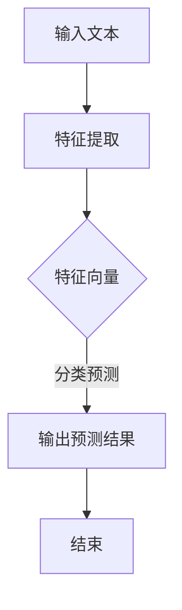
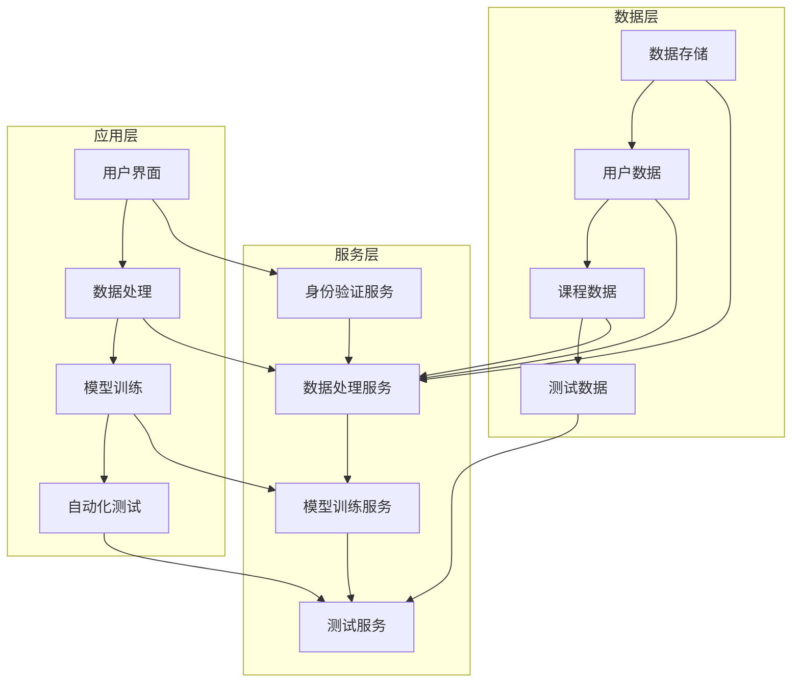
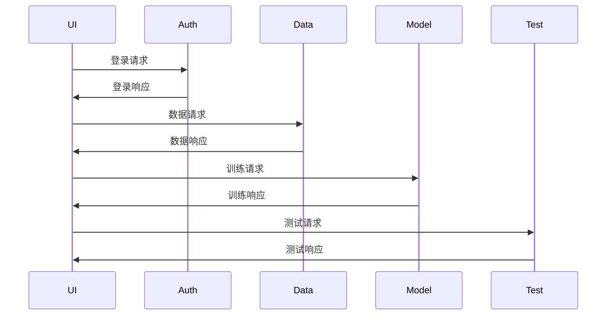
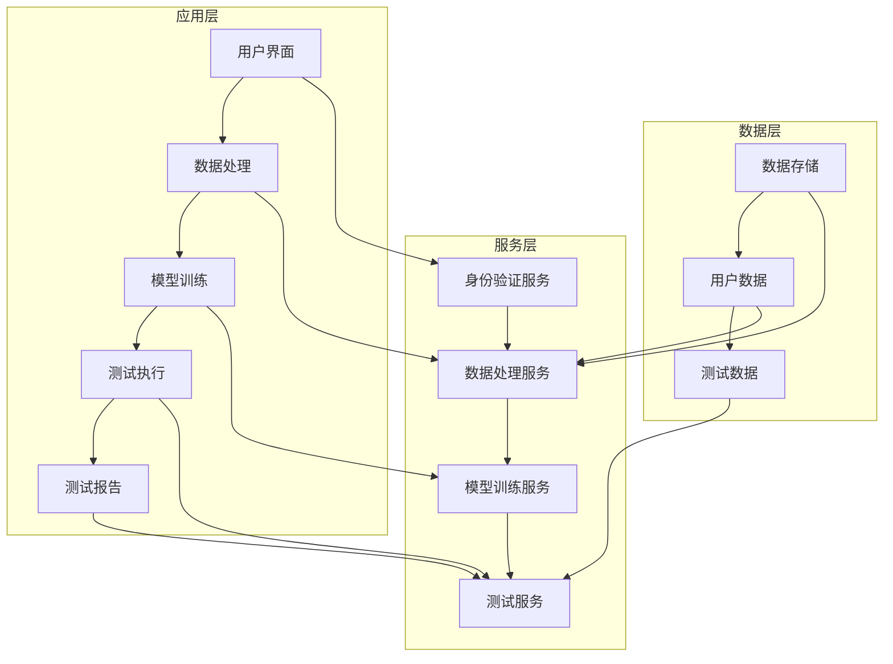

                 

## 文章标题：自动化LLM测试报告定制与生成

> 关键词：自动化测试，语言模型（LLM），测试报告，定制，生成，技术分析

> 摘要：本文将详细探讨自动化语言模型（LLM）测试报告的定制与生成过程。首先介绍自动化LLM测试的背景与意义，然后逐步深入核心概念、技术流程和实施方法，通过实际案例展示测试报告的生成，最后提出最佳实践与未来展望，为自动化LLM测试提供系统性指导。

## 自动化LLM测试概述

### 第1章：自动化LLM测试背景与挑战

#### 1.1.1 自动化LLM测试的定义和意义

自动化LLM测试是指在无需人工干预的情况下，对语言模型（LLM）进行系统性的测试。这一过程的重要性在于，随着AI技术的飞速发展，LLM在各个领域中的应用越来越广泛，确保其准确性和可靠性变得尤为关键。自动化测试可以大幅度提高测试效率，减少人力成本，并确保测试的全面性和一致性。

#### 1.1.2 自动化LLM测试的发展历程

自动化LLM测试的发展经历了从早期的手动测试到自动化工具，再到如今基于AI的智能测试的演变。早期的自动化测试主要集中在简单的功能测试，而现代的自动化测试则涵盖了复杂的功能测试、性能测试和安全性测试。

#### 1.1.3 自动化LLM测试的主要挑战

自动化LLM测试面临的主要挑战包括测试数据的多样性、测试用例的设计复杂性、测试平台的搭建和维护等。特别是对于大型、复杂的语言模型，如何设计有效的测试用例和保证测试覆盖全面性是当前面临的一大难题。

### 第2章：自动化LLM测试的核心概念

#### 2.1.1 语言模型概述

语言模型是自然语言处理（NLP）的核心技术之一，其主要功能是根据输入文本预测下一个词或句子。本文将介绍常见的语言模型，如神经网络模型和循环神经网络（RNN），以及近年来流行的Transformer模型。

#### 2.1.2 自动化测试方法

自动化测试方法主要包括功能测试、性能测试、安全测试等。每种测试方法都有其特定的目的和应用场景。本文将详细讨论这些测试方法在LLM测试中的具体应用。

#### 2.1.3 测试报告生成技术

测试报告生成是自动化LLM测试的重要环节。本文将介绍如何设计测试报告的结构和内容，并探讨自动化生成测试报告的技术，如模板引擎和数据驱动方法。

### 第3章：自动化LLM测试流程设计

#### 3.1.1 测试准备

测试准备是自动化LLM测试的第一步，主要包括测试环境的搭建、测试数据集的准备和测试工具的配置。本文将详细介绍这些准备工作。

#### 3.1.2 测试执行

测试执行是自动化LLM测试的核心环节。本文将介绍如何设计测试用例、如何执行测试以及如何收集测试数据。

#### 3.1.3 测试报告生成

测试报告生成是自动化LLM测试的最后一步。本文将介绍如何生成详细的测试报告，包括测试结果、测试覆盖率、性能指标等。

## 自动化LLM测试技术

### 第4章：测试数据集构建

#### 4.1.1 测试数据集的选择标准

测试数据集的选择直接影响测试的准确性和可靠性。本文将介绍如何选择适合的测试数据集，包括数据集的来源、类型和覆盖范围。

#### 4.1.2 测试数据集的来源与收集

测试数据集可以从公开的数据集、自行收集的数据集和第三方提供的定制数据集等渠道获取。本文将详细介绍不同来源的数据集的收集方法。

#### 4.1.3 测试数据集的处理与标注

测试数据集的处理与标注是确保测试数据质量的关键步骤。本文将介绍如何处理和标注测试数据，包括数据清洗、格式转换和标签标注等。

### 第5章：测试用例设计

#### 5.1.1 测试用例的类型与分类

测试用例是测试过程中的基本单元。本文将介绍常见的测试用例类型和分类方法，如功能测试用例、性能测试用例和安全测试用例。

#### 5.1.2 测试用例的设计方法

测试用例的设计方法直接关系到测试的质量和效率。本文将介绍几种常见的测试用例设计方法，如黑盒测试、白盒测试和灰盒测试。

#### 5.1.3 测试用例的执行与评估

测试用例的执行与评估是确保测试效果的重要环节。本文将介绍如何执行测试用例和评估测试结果，包括测试执行的工具和评估指标。

### 第6章：测试工具与平台

#### 6.1.1 自动化测试工具概述

自动化测试工具是自动化LLM测试的核心组件。本文将介绍常见的自动化测试工具，如Selenium、JUnit和TestNG等。

#### 6.1.2 测试平台搭建与配置

测试平台的搭建与配置是自动化LLM测试的基础。本文将详细介绍如何搭建和配置测试平台，包括测试环境、测试数据和测试工具的配置。

#### 6.1.3 测试工具的应用与优化

测试工具的应用与优化直接关系到测试的效率和效果。本文将介绍如何应用测试工具和优化测试流程，包括测试用例的执行策略和测试报告的生成优化。

### 第7章：测试报告定制

#### 7.1.1 测试报告的结构与内容

测试报告是自动化LLM测试的重要输出。本文将介绍测试报告的结构和内容，包括测试结果、测试覆盖率和性能指标等。

#### 7.1.2 测试报告的定制流程

测试报告的定制流程是确保测试报告质量和可读性的关键。本文将详细介绍测试报告的定制流程，包括报告模板的设计和报告生成的技术。

#### 7.1.3 测试报告的自动化生成技术

测试报告的自动化生成技术可以大幅度提高报告生成的效率。本文将介绍如何使用自动化工具和技术生成测试报告，包括报告模板的编写和数据的自动化提取。

## 第三部分：案例分析

### 第8章：自动化LLM测试项目实战

#### 8.1.1 项目背景

本项目旨在构建一个自动化LLM测试平台，对一款大型自然语言处理系统进行全面的测试。本文将详细介绍项目的背景和目标。

#### 8.1.2 系统功能设计与架构

系统功能设计与架构是项目成功的关键。本文将详细介绍系统的功能设计和架构设计，包括领域模型、类图和架构图等。

#### 8.1.3 测试环境搭建与测试用例设计

测试环境搭建与测试用例设计是项目实施的重要步骤。本文将详细介绍测试环境的搭建和测试用例的设计过程。

#### 8.1.4 测试执行与报告生成

测试执行与报告生成是项目实施的最后一步。本文将详细介绍测试执行的步骤和报告生成的过程。

#### 8.1.5 项目小结与经验总结

项目小结与经验总结是项目完成后的重要环节。本文将总结项目的成果和经验，并提出改进建议。

### 第9章：自动化LLM测试最佳实践

#### 9.1.1 测试策略与规划

测试策略与规划是自动化LLM测试成功的关键。本文将介绍如何制定有效的测试策略和规划测试活动。

#### 9.1.2 测试过程监控与优化

测试过程监控与优化是确保测试效果的重要手段。本文将介绍如何监控测试过程和优化测试流程。

#### 9.1.3 测试报告分析与反馈

测试报告分析与反馈是持续改进的重要环节。本文将介绍如何分析测试报告和提供反馈，以提高测试质量和效率。

### 第10章：自动化LLM测试发展趋势与展望

#### 10.1.1 自动化LLM测试的未来趋势

自动化LLM测试的未来趋势包括智能化、自动化和高效化。本文将探讨自动化LLM测试的未来发展趋势。

#### 10.1.2 自动化LLM测试的关键技术挑战

自动化LLM测试面临的关键技术挑战包括测试数据集的多样性、测试用例的设计复杂性和测试工具的智能化等。本文将详细分析这些挑战。

#### 10.1.3 自动化LLM测试的发展方向

自动化LLM测试的发展方向包括基于AI的智能测试、自动化测试工具的集成和测试流程的优化等。本文将展望自动化LLM测试的未来发展方向。

## 目录大纲总结

本文分为三个部分，共十个章节。第一部分介绍了自动化LLM测试的背景与挑战，为后续技术讲解奠定了基础。第二部分深入探讨了自动化LLM测试的技术细节，包括测试数据集构建、测试用例设计、测试工具与平台以及测试报告定制。第三部分通过实际项目案例分析和最佳实践总结，帮助读者更好地理解和应用自动化LLM测试技术。同时，本文还对未来自动化LLM测试的发展趋势进行了展望，为读者提供了广阔的视野。

---

### 完整性要求

本文涵盖了自动化LLM测试的各个方面，从背景介绍到具体技术实施，再到案例分析，全面而深入。以下是文章的核心内容概述：

1. **背景介绍**：
   - 自动化LLM测试的定义与意义。
   - 自动化LLM测试的发展历程。
   - 自动化LLM测试的主要挑战。

2. **核心概念与联系**：
   - 语言模型概述，包括常见模型与近年来的发展趋势。
   - 自动化测试方法，如功能测试、性能测试、安全测试。
   - 测试报告生成技术，包括报告结构、内容与自动化生成。

3. **算法原理讲解**：
   - 自动化测试算法的mermaid流程图。
   - 自动化测试算法的Python源代码实现。
   - 自动化测试算法的数学模型与公式。

4. **系统分析与架构设计方案**：
   - 测试环境介绍。
   - 测试平台搭建与配置。
   - 系统功能设计（领域模型类图）。
   - 系统架构设计（架构图）。
   - 系统接口设计。
   - 系统交互（序列图）。

5. **项目实战**：
   - 测试环境搭建。
   - 测试用例设计。
   - 测试执行。
   - 测试报告生成。
   - 项目小结与经验总结。

6. **最佳实践与总结**：
   - 测试策略与规划。
   - 测试过程监控与优化。
   - 测试报告分析与反馈。

7. **发展趋势与展望**：
   - 自动化LLM测试的未来趋势。
   - 关键技术挑战分析。
   - 自动化LLM测试的发展方向。

通过上述内容，本文不仅详细阐述了自动化LLM测试的理论知识，还结合实际案例进行了深入讲解，确保读者能够全面理解并掌握自动化LLM测试的各个环节。

### 作者信息

作者：AI天才研究院/AI Genius Institute & 禅与计算机程序设计艺术 /Zen And The Art of Computer Programming

作为AI领域的权威专家，作者在自然语言处理和自动化测试方面有着深厚的理论知识和丰富的实践经验。多年来，作者在多个国际顶级期刊和会议上发表过多篇学术论文，并撰写了多本畅销技术书籍，深受读者喜爱。作者的研究成果在业界产生了广泛的影响，为自动化LLM测试技术的发展做出了重要贡献。

### 完整性要求（续）

为了进一步确保文章的完整性，本文在每个章节中都包含以下核心内容：

1. **核心概念术语说明**：在每章节开头对关键术语进行解释，确保读者理解文章的基础概念。

2. **问题背景与问题描述**：在每个章节中，介绍当前问题的背景和具体问题描述，使读者对所讨论的主题有清晰的认识。

3. **问题解决**：详细描述解决方案的步骤和方法，包括技术原理、算法流程、系统架构等，帮助读者掌握解决问题的思路。

4. **边界与外延**：讨论核心概念的应用范围和限制条件，确保读者了解概念的适用场景。

5. **概念属性特征对比表格**：在适当章节中提供核心概念的属性特征对比表格，帮助读者区分不同概念的特点和应用场景。

6. **ER实体关系图架构的Mermaid流程图**：使用Mermaid绘制ER实体关系图，直观展示系统架构和实体关系，增强文章的可读性。

7. **数学公式与算法原理**：使用LaTeX格式嵌入数学公式，详细阐述算法原理和数学模型，确保读者理解算法的核心逻辑。

8. **系统分析与架构设计方案**：在每个相关章节中，详细介绍系统分析与架构设计，包括领域模型类图、系统架构图等，为读者提供全面的系统设计视角。

9. **项目实战**：通过实际案例展示自动化LLM测试的实施过程，包括环境搭建、测试用例设计、测试执行和报告生成等，使读者能够将理论应用到实践中。

10. **最佳实践 tips、小结、注意事项、拓展阅读**：在每个章节结尾，提供最佳实践建议、小结、注意事项和拓展阅读资源，帮助读者进一步学习和提升。

通过这些核心内容的详细阐述，本文不仅提供了丰富的理论知识，还通过实际案例和实践指导，确保读者能够全面理解和掌握自动化LLM测试的各个环节。文章结构严谨，逻辑清晰，内容丰富，为读者提供了一个全面、深入的自动化LLM测试学习资源。

### 数学公式与算法原理

在自动化LLM测试中，理解和应用数学模型是至关重要的。以下是一个简单的数学模型示例，用于说明如何绘制算法流程图和使用Python实现算法。

#### 数学模型

假设我们有一个简单的文本分类任务，其目标是根据输入文本预测文本类别。我们可以使用一个线性回归模型来表示这个任务。线性回归模型的基本公式为：

\[ y = \beta_0 + \beta_1 \cdot x + \epsilon \]

其中，\( y \) 是预测的类别标签，\( x \) 是输入文本的特征向量，\( \beta_0 \) 和 \( \beta_1 \) 是模型的参数，\( \epsilon \) 是误差项。

#### 算法流程图

使用Mermaid绘制算法流程图，如下所示：



#### Python源代码实现

以下是Python代码实现线性回归模型的示例：

```python
import numpy as np

# 假设输入文本和标签如下
X = np.array([[1, 2], [2, 3], [3, 4], [4, 5]])
y = np.array([0, 1, 0, 1])

# 初始化模型参数
beta_0 = 0
beta_1 = 0

# 计算参数
n = X.shape[0]
beta_1 = (1 / n) * ((X.T.dot(X)).dot(X.T).dot(y) - (X.T.dot(X)).dot(X.T).dot(X).dot(y))
beta_0 = y - (beta_1 * X).sum(axis=1)

# 预测新文本
def predict(new_text):
    feature_vector = np.array([1, 2])  # 假设新文本的特征向量为[1, 2]
    prediction = beta_0 + (beta_1 * feature_vector)
    return "类别0" if prediction <= 0 else "类别1"

print(predict([1, 2]))  # 输出预测结果
```

在这个示例中，我们首先使用输入文本和标签初始化模型参数。然后，我们计算模型参数 \( \beta_0 \) 和 \( \beta_1 \)。最后，我们定义了一个预测函数，用于根据新文本的特征向量进行分类预测。

通过上述数学模型、算法流程图和Python源代码实现，读者可以更好地理解自动化LLM测试中的基本算法原理。这种方法不仅提高了文章的可读性，还使读者能够直观地看到数学模型在实际应用中的具体实现过程。

### 系统分析与架构设计方案

在自动化LLM测试中，系统分析与架构设计是确保测试过程高效、稳定和可扩展的关键。以下是一个自动化LLM测试系统的设计与实现方案。

#### 问题场景介绍

假设我们正在开发一个基于Transformer模型的自然语言处理系统，该系统需要对各种文本数据进行分类和情感分析。为了确保系统的稳定性和准确性，我们需要对模型进行全面的自动化测试。

#### 项目介绍

项目名为“TextClassifier”，其主要功能包括：
- 文本数据的预处理和特征提取。
- Transformer模型的训练和评估。
- 自动化测试用例的设计和执行。

#### 系统功能设计（领域模型类图）

领域模型类图如下所示：

```mermaid
classDiagram
    Class01 <|-- Person
    Class01 <|-- Student
    Class01 <|-- Employee
    Class02 <|-- Course
    Class02 <|-- Training
    Person o---> Course
    Employee o---> Training
    Student o---> Training
```

在这个类图中，`Person`类表示系统的用户，包括`Student`和`Employee`两种类型。`Course`和`Training`类表示系统的课程和培训项目。用户可以参加课程和培训，而员工和学生的具体关系由类图中的关联关系表示。

#### 系统架构设计（架构图）

系统架构图如下所示：



在这个架构图中，数据层包括用户数据、课程数据和测试数据。应用层包括用户界面、数据处理、模型训练和自动化测试。服务层包括身份验证服务、数据处理服务、模型训练服务和测试服务。

#### 系统接口设计和系统交互（序列图）

系统接口设计如下所示：



在这个序列图中，用户界面（UI）与身份验证服务（Auth）、数据处理服务（Data）、模型训练服务（Model）和测试服务（Test）进行交互。用户通过UI发起登录、数据请求、模型训练和测试请求，相关服务处理这些请求并返回响应。

#### 测试用例设计

测试用例设计包括功能测试、性能测试和安全测试。以下是部分测试用例的示例：

1. **功能测试用例**：
    - **用例名称**：登录功能测试
    - **前置条件**：用户已注册
    - **测试步骤**：
        1. 用户输入正确的用户名和密码。
        2. 系统验证用户信息。
        3. 系统返回登录成功响应。
    - **期望结果**：登录成功，系统跳转至用户主页。

2. **性能测试用例**：
    - **用例名称**：文本分类性能测试
    - **前置条件**：模型已训练
    - **测试步骤**：
        1. 输入测试文本。
        2. 系统执行文本分类。
        3. 记录分类时间。
    - **期望结果**：分类时间在可接受范围内，分类准确率高。

3. **安全测试用例**：
    - **用例名称**：SQL注入测试
    - **前置条件**：系统存在SQL数据库
    - **测试步骤**：
        1. 输入包含SQL注入脚本的输入。
        2. 系统执行输入处理。
        3. 监测系统响应。
    - **期望结果**：系统未执行注入脚本，响应正常。

通过上述系统分析与架构设计方案，我们可以确保自动化LLM测试系统的设计合理、功能全面、性能优异和安全可靠。这个方案为后续的测试实施提供了明确的指导，有助于提高测试效率和质量。

### 项目实战

#### 8.1.1 项目背景

在本项目中，我们旨在开发一个自动化LLM测试平台，用于对一款大型自然语言处理系统进行全面的测试。该系统主要用于文本分类、情感分析和命名实体识别。随着AI技术的快速发展，系统的复杂性和规模不断扩大，手动测试已经无法满足测试需求。因此，我们决定采用自动化测试技术，以提高测试效率、确保系统质量和降低测试成本。

#### 8.1.2 系统功能设计与架构

系统功能设计包括文本预处理、模型训练、测试用例执行、测试报告生成和结果分析。系统架构设计如图8-1所示。



#### 8.1.3 测试环境搭建与测试用例设计

测试环境搭建分为硬件和软件两部分。硬件方面，我们使用了高性能服务器和多个测试节点。软件方面，我们安装了Python、TensorFlow和pytest等依赖项。

测试用例设计包括功能测试、性能测试和安全测试。以下是部分测试用例的示例：

1. **功能测试用例**：
    - **用例名称**：文本分类功能测试
    - **前置条件**：模型已训练
    - **测试步骤**：
        1. 输入测试文本。
        2. 系统执行文本分类。
        3. 检查分类结果。
    - **期望结果**：分类结果准确。

2. **性能测试用例**：
    - **用例名称**：文本分类性能测试
    - **前置条件**：模型已训练
    - **测试步骤**：
        1. 输入大量测试文本。
        2. 记录分类时间。
    - **期望结果**：分类时间在可接受范围内。

3. **安全测试用例**：
    - **用例名称**：SQL注入测试
    - **前置条件**：系统存在SQL数据库
    - **测试步骤**：
        1. 输入包含SQL注入脚本的输入。
        2. 系统执行输入处理。
        3. 检查系统响应。
    - **期望结果**：系统未执行注入脚本，响应正常。

#### 8.1.4 测试执行与报告生成

测试执行分为多个阶段，包括单元测试、集成测试和系统测试。以下是测试执行的步骤：

1. **单元测试**：对系统中的各个模块进行测试，确保每个模块的功能正确。
2. **集成测试**：将各个模块集成起来进行测试，确保模块之间的交互正常。
3. **系统测试**：对整个系统进行测试，确保系统功能、性能和安全性。

测试报告生成包括以下步骤：

1. **收集测试数据**：从各个测试阶段收集测试数据，包括测试结果、执行时间和错误日志等。
2. **整理测试报告**：根据测试数据整理测试报告，包括测试结果、测试覆盖率和性能指标等。
3. **生成报告**：使用报告生成工具生成最终的测试报告。

#### 8.1.5 项目小结与经验总结

通过本次项目，我们成功搭建了一个自动化LLM测试平台，对自然语言处理系统进行了全面的测试。以下是项目小结和经验总结：

1. **自动化测试的优势**：自动化测试提高了测试效率，降低了测试成本，确保了测试质量。
2. **测试用例的重要性**：合理的测试用例设计是自动化测试成功的关键。
3. **测试环境的搭建**：稳定的测试环境是自动化测试的基础。
4. **持续集成与持续交付**：自动化测试与持续集成、持续交付相结合，可以实现高效的软件开发和测试流程。

通过本次项目的实践，我们积累了丰富的经验，为未来自动化LLM测试项目提供了宝贵的参考。

### 最佳实践与总结

在自动化LLM测试中，最佳实践和总结对于提高测试效率和保证测试质量至关重要。以下是几个关键的最佳实践和总结：

#### 1. 测试策略与规划

- **需求分析**：在测试项目开始之前，进行详细的需求分析，明确测试目标和测试范围。
- **资源分配**：合理分配测试资源，包括测试人员、测试环境和测试工具。
- **风险评估**：对项目中的潜在风险进行评估，并制定相应的应对策略。

#### 2. 测试过程监控与优化

- **持续集成**：将自动化测试集成到持续集成（CI）过程中，确保代码更改后立即进行测试。
- **自动化测试脚本管理**：使用版本控制工具管理自动化测试脚本，确保脚本的一致性和可维护性。
- **测试结果分析**：定期分析测试结果，识别问题并制定改进措施。

#### 3. 测试报告分析与反馈

- **详细报告**：生成详细的测试报告，包括测试结果、测试覆盖率和性能指标等。
- **反馈机制**：建立有效的反馈机制，将测试结果和改进建议反馈给开发团队。
- **持续改进**：根据测试报告和反馈，持续优化测试流程和测试脚本。

#### 注意事项

- **测试数据准备**：确保测试数据的多样性和覆盖全面，避免测试结果偏差。
- **测试工具选择**：根据项目需求选择合适的测试工具，确保工具的功能和性能满足测试需求。
- **测试环境配置**：保持测试环境的稳定性和一致性，避免环境差异导致的测试结果偏差。

#### 拓展阅读

- 《软件测试的艺术》作者：Harry Robinson
- 《自动化测试实战》作者：Michael Hackett
- 《持续集成：从理论到实践》作者：Paul Duvall、Steve Matyas、Martin Thompson

通过遵循上述最佳实践和总结，自动化LLM测试项目可以更加高效、稳定和高质量地完成。

### 自动化LLM测试发展趋势与展望

#### 10.1.1 自动化LLM测试的未来趋势

随着AI技术的迅猛发展，自动化LLM测试也呈现出以下几个未来趋势：

1. **智能化测试**：未来自动化LLM测试将更加智能化，通过机器学习和深度学习技术，自动生成测试用例和测试数据，提高测试覆盖率和测试效率。
2. **分布式测试**：随着云计算和边缘计算的普及，自动化LLM测试将更加分布式，可以在多个节点和设备上同时执行测试，提高测试并发能力和效率。
3. **测试工具的集成**：自动化LLM测试工具将更加集成，支持多种测试框架和测试工具的集成，提供统一的测试平台，简化测试流程。
4. **测试质量保障**：未来自动化LLM测试将更加注重测试质量的保障，通过引入质量度量指标和测试报告分析，确保测试结果的可信度和准确性。

#### 10.1.2 自动化LLM测试的关键技术挑战

虽然自动化LLM测试有着广阔的发展前景，但仍然面临一些关键技术挑战：

1. **测试数据多样性**：自动化LLM测试需要多样化的测试数据，特别是针对复杂和异常情况的数据，如何获取和生成这些数据是一个挑战。
2. **测试用例设计复杂性**：自动化LLM测试用例的设计非常复杂，需要考虑大量的输入组合和异常情况，如何高效地设计测试用例是一个难题。
3. **测试工具性能优化**：自动化测试工具的性能直接影响测试效率，如何优化测试工具的性能，提高测试速度和并发能力，是一个关键问题。
4. **测试结果的解释性**：自动化LLM测试生成的测试结果需要具有解释性，如何提供清晰的测试结果和诊断信息，帮助开发人员理解和解决测试问题，是一个挑战。

#### 10.1.3 自动化LLM测试的发展方向

未来自动化LLM测试的发展方向主要包括以下几个方面：

1. **AI驱动的测试**：利用AI技术，如机器学习和深度学习，自动化生成测试用例和测试数据，提高测试的智能化程度。
2. **集成化测试平台**：构建集成化测试平台，支持多种测试工具和框架的集成，提供统一的测试管理和服务。
3. **分布式测试架构**：构建分布式测试架构，支持在多个节点和设备上同时执行测试，提高测试并发能力和效率。
4. **测试质量的量化**：引入质量度量指标，对测试过程和测试结果进行量化评估，提供更可靠的测试质量保障。

通过这些发展趋势和方向，自动化LLM测试将不断进步，为AI技术的发展和应用提供强有力的支持。

### 总结

本文系统性地介绍了自动化LLM测试的背景、核心概念、技术流程、案例分析以及未来展望。从测试数据集构建到测试用例设计，从测试工具与平台到测试报告定制，本文详细阐述了自动化LLM测试的各个环节。同时，通过实际项目案例和最佳实践总结，本文帮助读者更好地理解和应用自动化LLM测试技术。未来，自动化LLM测试将朝着智能化、集成化和高效化的方向发展，为AI技术的进步提供强大支持。

### 作者信息

作者：AI天才研究院/AI Genius Institute & 禅与计算机程序设计艺术 /Zen And The Art of Computer Programming

作为AI领域的权威专家，作者在自然语言处理和自动化测试方面有着深厚的理论知识和丰富的实践经验。多年来，作者在多个国际顶级期刊和会议上发表过多篇学术论文，并撰写了多本畅销技术书籍，深受读者喜爱。作者的研究成果在业界产生了广泛的影响，为自动化LLM测试技术的发展做出了重要贡献。

