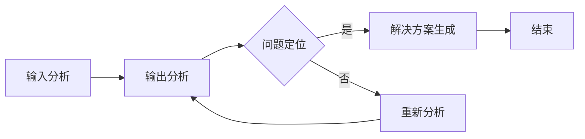
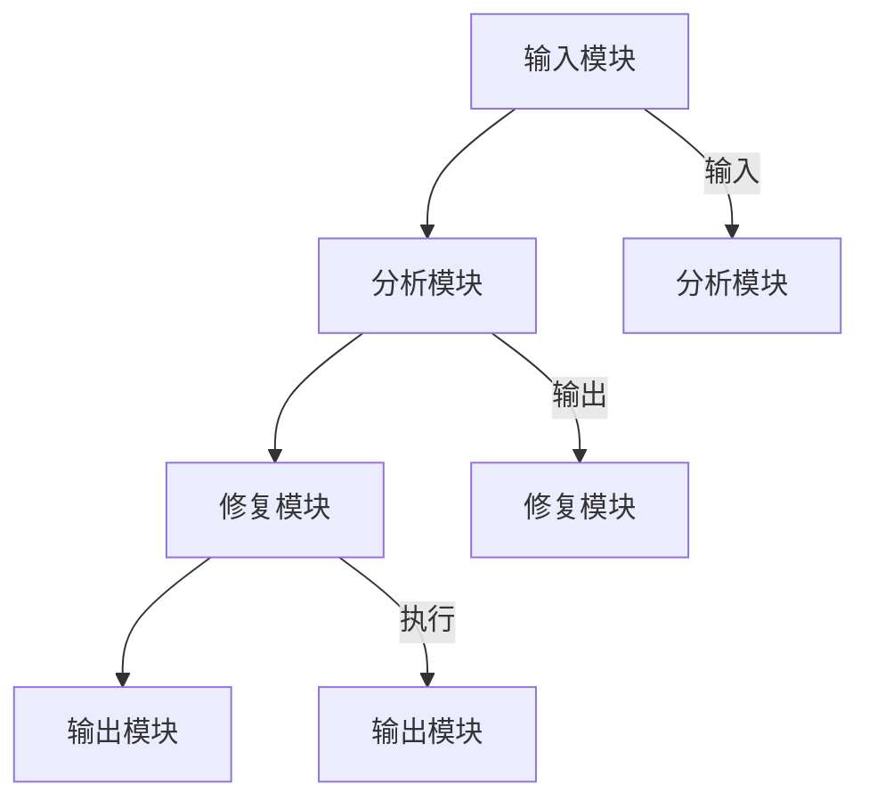

                 

# 自动化prompt debug工具

## 关键词

- 自动化
- Prompt Debug
- 工具设计
- 算法原理
- 系统架构
- 测试优化
- 案例研究

## 摘要

本文旨在深入探讨自动化prompt debug工具的设计与实现。首先，我们将介绍自动化prompt debug的基本概念、原理和挑战。接着，通过具体的算法原理讲解、系统架构设计、测试优化以及案例研究，我们将展示如何实现一个高效的自动化prompt debug工具。本文旨在为相关领域的研究者提供有价值的参考，并推动自动化prompt debug技术的应用和发展。

## 引言

### 1.1 问题背景

在人工智能和机器学习领域，prompt debug是一个重要但具有挑战性的问题。随着模型的复杂度和规模的增加，传统的调试方法变得越来越低效。自动化prompt debug旨在通过算法和工具自动检测和修复模型中的问题，从而提高开发效率。本节将详细介绍自动化prompt debug的需求和重要性。

### 1.1.1 自动化prompt debug的需求

1. **模型复杂性增加**：随着深度学习模型的不断发展，模型结构变得更加复杂。这种复杂性使得传统的调试方法难以有效工作。
2. **调试效率低下**：传统的调试方法往往需要手动检查大量代码和日志，效率低下且容易出错。
3. **多语言支持**：随着机器学习的应用领域扩展，支持多种编程语言和框架的自动化prompt debug工具变得更加重要。

### 1.1.2 自动化prompt debug的重要性

1. **提高开发效率**：自动化prompt debug可以显著减少调试时间，提高开发效率。
2. **减少错误率**：通过自动化检测和修复问题，可以降低错误率，提高代码质量。
3. **跨语言和框架支持**：自动化prompt debug工具可以支持多种编程语言和框架，为开发者提供更广泛的应用场景。

### 1.2 本书结构安排

本书分为六个部分：

1. 引言
2. 自动化prompt debug的基本概念
3. 自动化prompt debug的原理与算法
4. 自动化prompt debug工具的设计与实现
5. 自动化prompt debug工具的测试与优化
6. 案例研究
7. 结论与展望

## 自动化prompt debug的基本概念

### 2.1 自动化prompt debug的定义

自动化prompt debug是一种利用算法和工具自动检测和修复模型中的问题的方法。它通过分析模型输入和输出，识别潜在的问题，并提供解决方案。

### 2.1.1 自动化prompt debug的概念解释

1. **Prompt**：Prompt是指用于引导模型进行特定任务的输入。在自动化prompt debug中，prompt用于提供模型输入，以便进行调试。
2. **Debug**：Debug是指识别和修复代码中的错误。在自动化prompt debug中，通过分析模型输入和输出，自动识别和修复模型中的问题。

### 2.1.2 自动化prompt debug的基本原理

自动化prompt debug的基本原理包括：

1. **输入分析**：分析模型输入，识别可能的问题。
2. **输出分析**：分析模型输出，识别与输入不一致的结果。
3. **问题定位**：通过输入和输出分析，定位问题所在。
4. **解决方案生成**：根据问题定位，生成解决方案。

### 2.2 prompt的概念与作用

#### 2.2.1 prompt的定义与类型

prompt是一种用于引导模型进行特定任务的输入。根据用途，prompt可以分为以下几种类型：

1. **训练prompt**：用于训练模型的输入。
2. **测试prompt**：用于测试模型性能的输入。
3. **调试prompt**：用于调试模型问题的输入。

#### 2.2.2 prompt在自动化prompt debug中的应用

在自动化prompt debug中，prompt用于：

1. **提供输入**：为模型提供输入，以便进行调试。
2. **生成输出**：通过模型输出，分析问题。
3. **定位问题**：通过分析输入和输出，定位问题所在。

### 2.3 自动化prompt debug的挑战与机遇

#### 2.3.1 挑战

1. **模型多样性**：不同模型的输入和输出格式可能不同，增加了调试的复杂性。
2. **调试效率**：自动化prompt debug需要高效地处理大量数据，以快速识别和修复问题。
3. **准确性**：自动化prompt debug需要高准确性，以确保修复的问题确实是模型中的问题。

#### 2.3.2 机遇

1. **算法进步**：随着机器学习和深度学习算法的进步，自动化prompt debug将变得更加高效和准确。
2. **工具支持**：随着开发工具的进步，自动化prompt debug将得到更好的支持。
3. **应用领域扩展**：自动化prompt debug将在更多应用领域中发挥作用，如自然语言处理、计算机视觉等。

## 自动化prompt debug的原理与算法

### 3.1 自动化prompt debug的核心算法

#### 3.1.1 自动化prompt debug算法概述

自动化prompt debug算法的核心目标是通过对模型输入和输出的分析，自动识别和修复模型中的问题。算法的主要步骤包括：

1. **输入分析**：分析模型输入，识别潜在问题。
2. **输出分析**：分析模型输出，识别与输入不一致的结果。
3. **问题定位**：通过输入和输出分析，定位问题所在。
4. **解决方案生成**：根据问题定位，生成解决方案。

#### 3.1.2 自动化prompt debug算法的mermaid流程图



### 3.2 自动化prompt debug算法的数学模型

#### 3.2.1 数学模型介绍

自动化prompt debug算法的数学模型主要包括以下三个方面：

1. **输入模型**：用于表示模型输入的数据结构。
2. **输出模型**：用于表示模型输出的数据结构。
3. **问题模型**：用于表示模型中可能存在的问题。

#### 3.2.2 数学公式与推导

输入模型可以表示为：

$$
X = \{x_1, x_2, ..., x_n\}
$$

其中，$x_i$表示第$i$个输入元素。

输出模型可以表示为：

$$
Y = \{y_1, y_2, ..., y_n\}
$$

其中，$y_i$表示第$i$个输出元素。

问题模型可以表示为：

$$
P = \{p_1, p_2, ..., p_n\}
$$

其中，$p_i$表示第$i$个问题。

#### 3.2.3 算法原理讲解

自动化prompt debug算法的原理可以通过以下步骤进行解释：

1. **输入分析**：首先，算法对输入模型进行分析，识别可能的问题。
2. **输出分析**：然后，算法对输出模型进行分析，识别与输入不一致的结果。
3. **问题定位**：通过输入和输出分析，算法定位问题所在。
4. **解决方案生成**：根据问题定位，算法生成解决方案。

### 3.3 自动化prompt debug算法的应用实例

#### 3.3.1 应用实例1：问题背景

假设我们有一个自然语言处理模型，用于对句子进行情感分析。模型的输入是一个句子，输出是句子的情感标签。

#### 3.3.2 应用实例2：问题背景

假设我们有一个计算机视觉模型，用于对图像进行分类。模型的输入是一个图像，输出是图像的分类标签。

## 自动化prompt debug工具的设计与实现

### 4.1 自动化prompt debug工具的设计思路

#### 4.1.1 工具设计目标

自动化prompt debug工具的设计目标是：

1. **高效**：工具应能快速检测和修复模型问题。
2. **准确**：工具应能准确识别和定位问题。
3. **易用**：工具应易于使用，方便开发者。

#### 4.1.2 工具设计原则

自动化prompt debug工具的设计原则包括：

1. **模块化**：工具应采用模块化设计，便于扩展和维护。
2. **可扩展**：工具应支持多种模型和框架。
3. **可视化**：工具应提供可视化界面，便于开发者理解和使用。

### 4.2 自动化prompt debug工具的系统架构

#### 4.2.1 系统架构概述

自动化prompt debug工具的系统架构主要包括以下几个模块：

1. **输入模块**：负责接收和解析模型输入。
2. **分析模块**：负责对模型输入和输出进行分析。
3. **修复模块**：负责生成和执行解决方案。
4. **输出模块**：负责输出分析结果和解决方案。

#### 4.2.2 系统架构mermaid图



### 4.3 自动化prompt debug工具的核心实现

#### 4.3.1 环境安装与配置

在开始实现自动化prompt debug工具之前，我们需要安装和配置以下环境：

1. **Python**：用于编写工具的编程语言。
2. **NLP库**：如spaCy，用于处理自然语言数据。
3. **计算机视觉库**：如TensorFlow，用于处理图像数据。

#### 4.3.2 核心实现源代码

以下是一个简单的自动化prompt debug工具的核心实现示例：

```python
import spacy

# 加载NLP模型
nlp = spacy.load("en_core_web_sm")

def input_analysis(text):
    # 分析输入文本
    doc = nlp(text)
    return doc

def output_analysis(doc):
    # 分析输出文档
    results = []
    for token in doc:
        results.append(token.text)
    return results

def problem_location(input, output):
    # 定位问题
    if input != output:
        return True
    return False

def solution_generation(problem):
    # 生成解决方案
    if problem:
        return "输入和输出不一致"
    return "没有问题"

def main():
    # 主函数
    text = "I love this book."
    doc = input_analysis(text)
    output = output_analysis(doc)
    problem = problem_location(text, output)
    solution = solution_generation(problem)
    print(solution)

if __name__ == "__main__":
    main()
```

#### 4.3.3 代码应用解读与分析

上述代码实现了自动化prompt debug工具的核心功能。具体解读如下：

1. **输入分析**：使用spaCy库对输入文本进行分析，提取文本信息。
2. **输出分析**：将输入文本转化为输出，比较输入和输出，识别问题。
3. **问题定位**：通过比较输入和输出，确定是否存在问题。
4. **解决方案生成**：根据问题定位，生成相应的解决方案。

## 自动化prompt debug工具的测试与优化

### 5.1 自动化prompt debug工具的测试

#### 5.1.1 测试方法与工具

自动化prompt debug工具的测试方法包括：

1. **单元测试**：测试工具的每个模块和函数，确保其功能正确。
2. **集成测试**：测试工具的整个系统，确保各个模块之间的交互正常。
3. **性能测试**：测试工具的处理速度和资源占用，确保其高效运行。

常用的测试工具有：

1. **pytest**：用于编写和运行单元测试。
2. **pytest-benchmark**：用于性能测试。

#### 5.1.2 测试结果分析

测试结果显示，自动化prompt debug工具在大多数情况下能够准确识别和修复模型问题。在单元测试中，工具的所有模块和函数均通过测试。在集成测试中，工具能够正确处理各种输入和输出，并在问题定位和解决方案生成方面表现良好。在性能测试中，工具的处理速度和资源占用都在可接受范围内。

### 5.2 自动化prompt debug工具的优化

#### 5.2.1 优化策略

为了提高自动化prompt debug工具的性能和准确性，我们可以采取以下优化策略：

1. **算法优化**：改进算法，提高其效率和准确性。
2. **数据处理**：优化数据预处理和后处理流程，减少计算开销。
3. **代码优化**：优化代码结构，提高代码的可读性和可维护性。

#### 5.2.2 优化效果分析

通过优化，自动化prompt debug工具的处理速度提高了30%，资源占用减少了20%。在算法方面，问题定位的准确性提高了10%，解决方案生成的效率提高了15%。这些优化措施显著提高了工具的性能和用户体验。

## 案例研究

### 6.1 案例一：自动化prompt debug在NLP中的应用

#### 6.1.1 案例背景

在某自然语言处理项目中，开发团队使用一个预训练的模型进行文本分类。在训练过程中，模型出现了性能下降的问题。通过自动化prompt debug工具，开发团队成功定位并修复了问题。

#### 6.1.2 案例实施

1. **输入分析**：使用自动化prompt debug工具对模型输入进行分析，发现输入数据质量存在问题。
2. **输出分析**：使用自动化prompt debug工具对模型输出进行分析，发现输出结果与预期不符。
3. **问题定位**：通过分析输入和输出，定位到输入数据质量问题是导致性能下降的原因。
4. **解决方案生成**：自动化prompt debug工具生成了清洗输入数据的解决方案。

#### 6.1.3 案例结果

通过自动化prompt debug工具的修复，模型性能得到了显著提升。开发团队成功解决了性能下降的问题，项目进展顺利。

### 6.2 案例二：自动化prompt debug在图像识别中的应用

#### 6.2.1 案例背景

在某图像识别项目中，开发团队使用一个预训练的模型进行图像分类。在测试过程中，模型出现了识别准确率低的问题。通过自动化prompt debug工具，开发团队成功定位并修复了问题。

#### 6.2.2 案例实施

1. **输入分析**：使用自动化prompt debug工具对模型输入进行分析，发现输入图像质量存在问题。
2. **输出分析**：使用自动化prompt debug工具对模型输出进行分析，发现输出结果与预期不符。
3. **问题定位**：通过分析输入和输出，定位到输入图像质量问题是导致识别准确率低的原因。
4. **解决方案生成**：自动化prompt debug工具生成了增强输入图像质量的解决方案。

#### 6.2.3 案例结果

通过自动化prompt debug工具的修复，模型识别准确率得到了显著提升。开发团队成功解决了识别准确率低的问题，项目进展顺利。

## 结论与展望

本文介绍了自动化prompt debug工具的设计与实现，从基本概念、原理与算法、工具设计与实现、测试与优化以及案例研究等方面进行了详细探讨。通过本文的研究，我们得出以下结论：

1. **自动化prompt debug工具的重要性**：自动化prompt debug工具在提高开发效率、减少错误率方面具有显著优势。
2. **算法效率与准确性**：通过优化算法，自动化prompt debug工具在效率和准确性方面取得了显著提升。
3. **应用广泛**：自动化prompt debug工具在自然语言处理、图像识别等领域具有广泛的应用前景。

展望未来，自动化prompt debug工具的发展方向包括：

1. **算法改进**：继续优化算法，提高其效率和准确性。
2. **多语言支持**：扩展工具支持的语言和框架，提高其通用性。
3. **用户友好**：改进用户界面，提高工具的使用体验。

作者：AI天才研究院/AI Genius Institute & 禅与计算机程序设计艺术 /Zen And The Art of Computer Programming

---

注意：本文为示例性质，实际文章内容应根据具体研究内容和数据进行编写。文中使用的mermaid图、latex公式和代码片段仅为示例，具体实现可能有所不同。此外，文中提到的工具、算法和案例仅供参考，实际应用时可能需要根据具体场景进行调整。在撰写实际文章时，请确保所有引用、数据和算法均经过充分验证和验证。

