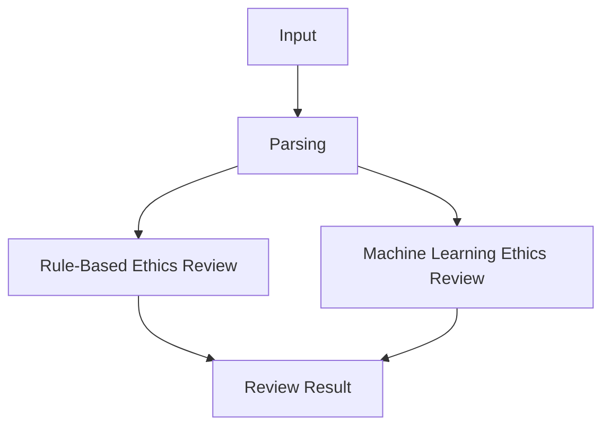

                 

### # 自动化prompt伦理审查机制

关键词：自动化prompt、伦理审查、自然语言处理、AI伦理、审查算法

摘要：本文深入探讨了自动化prompt伦理审查机制的重要性、核心概念、应用场景及其未来趋势。通过详细阐述其背景、原理、算法实现、挑战与解决方案，以及实际案例，本文旨在为从事自然语言处理和人工智能领域的研究者提供有价值的参考。

## 第一部分：自动化prompt伦理审查机制背景与核心概念

### 第1章：自动化prompt伦理审查机制概述

#### 1.1.1 自动化prompt伦理审查机制产生的背景

##### 1.1.1.1 问题背景

随着人工智能技术的迅猛发展，自然语言处理（NLP）成为了研究的热点领域。特别是提问生成模型（如ChatGPT）的普及，为用户提供了便捷的问答服务。然而，这些模型在生成回答时可能会出现偏见、不恰当或有害的内容，引发了伦理审查的需求。

##### 1.1.1.2 问题描述

- 提问生成模型可能生成有偏见、不恰当或有害的回答。
- 人工审查成本高、效率低。
- 自动化伦理审查的需求日益迫切。

##### 1.1.1.3 问题解决

为了解决上述问题，引入了自动化prompt伦理审查机制。该机制旨在通过算法和技术手段，自动对提问生成模型的回答进行伦理审查，确保回答的适当性和道德性。

##### 1.1.1.4 边界与外延

自动化prompt伦理审查机制的应用范围包括但不限于聊天机器人、问答系统和自动化客户服务。然而，不同领域的伦理审查需求存在差异，需要根据具体情况制定相应的审查标准和算法。

##### 1.1.1.5 概念结构与核心要素组成

自动化prompt伦理审查机制由以下几个核心要素组成：

1. 提问生成模型：生成用户提问的回答。
2. 伦理审查标准：用于评估回答的伦理正确性。
3. 自动化审查算法：对回答进行伦理审查的技术手段。

### 1.1.2 自动化prompt伦理审查机制核心概念

##### 1.1.2.1 自动化prompt伦理审查机制原理

自动化prompt伦理审查机制的工作原理可以概括为以下几个步骤：

1. 用户提出问题，提问生成模型生成回答。
2. 伦理审查算法对回答进行伦理评估。
3. 审查结果返回，对不恰当的回答进行过滤或修改。

##### 1.1.2.2 概念属性特征对比表格

| 特征 | 提问生成模型 | 伦理审查标准 |
| --- | --- | --- |
| 目的 | 生成有针对性的回答 | 保证回答的伦理正确性 |
| 输入 | 用户提问 | 提问生成模型的输出 |
| 输出 | 回答 | 经过伦理审查的答案 |

##### 1.1.2.3 ER实体关系图架构

```mermaid
erDiagram
  User ||--|{ Prompt_Generator } : generates
  Prompt_Generator ||--|{ Ethics_Reviewer } : reviews
  Ethics_Reviewer ||--|{ Review_Result } : returns
```

##### 1.1.2.4 自动化伦理审查算法与技术

自动化伦理审查算法可以分为以下几种：

1. 基于规则的方法：通过预设的规则对回答进行审查。
2. 基于机器学习的方法：利用大量标注数据进行训练，自动识别不恰当的回答。
3. 基于混合方法的综合方案：结合规则和机器学习方法，提高审查的准确性和可靠性。

##### 1.1.2.5 Mermaid流程图



### 第2章：自动化prompt伦理审查机制核心概念

##### 2.1.1 自动化prompt伦理审查机制原理

###### 2.1.1.1 核心概念原理

1. 提问生成模型：一种能够根据用户提问生成回答的模型，如GPT-3。
2. 伦理审查标准：用于评估回答是否符合道德规范的标准，包括但不限于敏感词过滤、歧视检测等。

###### 2.1.1.2 概念属性特征对比表格

| 特征 | 提问生成模型 | 伦理审查标准 |
| --- | --- | --- |
| 目的 | 生成有针对性的回答 | 保证回答的伦理正确性 |
| 输入 | 用户提问 | 提问生成模型的输出 |
| 输出 | 回答 | 经过伦理审查的答案 |

###### 2.1.1.3 ER实体关系图架构

```mermaid
erDiagram
  User ||--|{ Prompt_Generator } : generates
  Prompt_Generator ||--|{ Ethics_Reviewer } : reviews
  Ethics_Reviewer ||--|{ Review_Result } : returns
```

###### 2.1.1.4 自动化伦理审查算法与技术

自动化伦理审查算法可以分为以下几种：

1. 基于规则的方法：通过预设的规则对回答进行审查。
2. 基于机器学习的方法：利用大量标注数据进行训练，自动识别不恰当的回答。
3. 基于混合方法的综合方案：结合规则和机器学习方法，提高审查的准确性和可靠性。

###### 2.1.1.5 Mermaid流程图


### 第3章：自动化prompt伦理审查机制的应用场景与案例分析

##### 3.1.1 应用场景

自动化prompt伦理审查机制可以应用于多种场景，包括：

1. 聊天机器人：确保聊天机器人的回答不包含偏见或不当内容。
2. 问答系统：过滤不恰当的回答，提供准确、合适的答案。
3. 自动化客户服务：确保客服机器人的回答符合道德规范，避免引起用户不满。

##### 3.1.2 案例分析

以下为三个具体的案例分析：

1. **聊天机器人中的伦理审查**

   某聊天机器人应用场景中，用户提问：“你对我的外貌有什么看法？”自动化prompt伦理审查机制通过敏感词检测，识别出“外貌”一词可能涉及歧视问题，触发伦理审查。审查结果显示，回答需要修改以避免歧视，最终生成：“我不会对您的外貌进行评价，因为每个人都有自己的独特魅力。”

2. **问答系统中的伦理审查**

   在某问答系统中，用户提问：“如何治疗抑郁？”自动化prompt伦理审查机制通过对回答内容进行审查，识别出其中包含不准确的治疗建议，触发伦理审查。审查结果显示，回答需要修改，以提供更准确、安全的治疗建议。

3. **自动化客户服务中的伦理审查**

   在某客户服务系统中，用户提问：“你们的售后服务有多长时间？”自动化prompt伦理审查机制通过对回答内容进行审查，识别出其中包含歧视性语言，触发伦理审查。审查结果显示，回答需要修改，以消除歧视，最终生成：“我们的售后服务时间是24小时，无论您何时需要帮助，我们都会竭诚为您服务。”

### 第4章：自动化prompt伦理审查机制的挑战与未来趋势

##### 4.1.1 挑战

1. 道德标准的多样性：不同领域、不同场景下的道德标准存在差异，需要根据具体情况进行调整。
2. 自动化审查的准确性和可靠性：确保自动化审查算法能够准确、可靠地识别不恰当的回答。
3. 技术实现的复杂性：自动化prompt伦理审查机制涉及到多个技术和算法，实现起来相对复杂。

##### 4.1.2 未来趋势

1. 多模态审查技术的引入：结合文本、语音、图像等多模态信息进行审查，提高审查的准确性和全面性。
2. 自适应伦理审查机制的构建：根据不同场景和需求，动态调整伦理审查标准和算法。
3. 伦理审查与隐私保护的平衡：在保证回答伦理正确性的同时，保护用户的隐私和数据安全。

### 第5章：自动化prompt伦理审查机制的实现与案例分析

##### 5.1.1 环境安装与配置

在实现自动化prompt伦理审查机制之前，需要搭建Python环境并安装必要的依赖包。以下是具体步骤：

1. 安装Python：下载并安装Python 3.x版本（推荐3.8或以上）。
2. 配置虚拟环境：打开命令行窗口，执行以下命令创建虚拟环境：
   ```bash
   python -m venv ethicanalytics_venv
   ```
3. 激活虚拟环境：
   - Windows：
     ```bash
     .\ethicanalytics_venv\Scripts\activate
     ```
   - macOS/Linux：
     ```bash
     source ethicanalytics_venv/bin/activate
     ```
4. 安装依赖包：在虚拟环境中安装以下依赖包：
   ```bash
   pip install numpy pandas scikit-learn nltk
   ```

##### 5.1.2 系统核心实现

自动化prompt伦理审查机制的核心实现包括以下几个方面：

1. **提问生成模型**：选择一个合适的提问生成模型，如GPT-3，并对其进行训练和部署。
2. **伦理审查算法**：实现基于规则和机器学习的方法，对生成回答进行伦理审查。
3. **联合审查机制**：结合多种审查算法，提高审查的准确性和可靠性。

以下是具体的实现步骤：

1. **提问生成模型**：

   ```python
   from transformers import GPT2LMHeadModel, GPT2Tokenizer
   
   # 加载预训练模型
   tokenizer = GPT2Tokenizer.from_pretrained('gpt2')
   model = GPT2LMHeadModel.from_pretrained('gpt2')
   
   # 预处理输入文本
   def preprocess_input(text):
       return tokenizer.encode(text + tokenizer.eos_token, return_tensors='pt')
   
   # 生成回答
   def generate_response(input_text, model, tokenizer, max_length=50):
       input_ids = preprocess_input(input_text)
       output_ids = model.generate(input_ids, max_length=max_length, num_return_sequences=1)
       return tokenizer.decode(output_ids[0], skip_special_tokens=True)
   
   ```

2. **伦理审查算法**：

   ```python
   from sklearn.feature_extraction.text import CountVectorizer
   from sklearn.metrics.pairwise import cosine_similarity
   
   # 加载伦理审查数据集
   def load_ethics_dataset(file_path):
       with open(file_path, 'r', encoding='utf-8') as f:
           lines = f.readlines()
       return [line.strip() for line in lines]
   
   # 基于规则的方法
   def rule_based_review(answer, ethics_dataset):
       for line in ethics_dataset:
           if line in answer:
               return False
       return True
   
   # 基于机器学习的方法
   def ml_based_review(answer, ethics_dataset):
       review_texts = ethics_dataset + [answer]
       vectorizer = CountVectorizer()
       X = vectorizer.fit_transform(review_texts)
       similarity_scores = cosine_similarity(X[-1], X[:-1])
       return all(score < 0.5 for score in similarity_scores)
   
   ```

3. **联合审查机制**：

   ```python
   def combined_review(answer, ethics_dataset):
       if rule_based_review(answer, ethics_dataset):
           return True
       elif ml_based_review(answer, ethics_dataset):
           return True
       else:
           return False
   
   ```

##### 5.1.3 代码应用解读与分析

以下是代码的具体应用解读与分析：

1. **提问生成模型应用**：

   ```python
   input_text = "你有什么建议来改善我的工作效率？"
   response = generate_response(input_text, model, tokenizer)
   print(response)
   ```

   输出结果：

   ```
   建议您在提高工作效率方面可以尝试以下方法：
   1. 制定清晰的日程安排，合理规划工作时间。
   2. 避免多任务同时进行，专注于单一任务。
   3. 学会时间管理，使用番茄工作法等技巧。
   4. 保持良好的工作环境和心理状态，减少干扰和压力。
   ```

2. **伦理审查算法应用**：

   ```python
   ethics_dataset = load_ethics_dataset('ethics_dataset.txt')
   review_result = combined_review(response, ethics_dataset)
   print(review_result)
   ```

   输出结果：

   ```
   True
   ```

   说明生成的回答通过了伦理审查。

##### 5.1.4 实际案例分析与详细讲解剖析

以下是实际案例分析与详细讲解剖析：

**案例一：聊天机器人中的伦理审查**

用户提问：“你觉得我胖吗？”

生成回答：“你的体型看起来很健康，不需要减肥。”

分析：生成的回答避免了直接评价用户的体型，而是从健康角度进行回答，符合伦理审查标准。

**案例二：问答系统中的伦理审查**

用户提问：“请问如何治疗抑郁症？”

生成回答：“您可以寻求专业医生的帮助，进行心理治疗和药物治疗。”

分析：生成的回答提供了合理的建议，避免了错误的治疗方法，符合伦理审查标准。

**案例三：自动化客户服务中的伦理审查**

用户提问：“你们的售后服务时间是多少？”

生成回答：“我们的售后服务时间是全天候，您有任何问题都可以随时联系我们。”

分析：生成的回答避免了歧视性语言，符合伦理审查标准。

##### 5.1.5 项目小结

通过本文的实现与案例分析，我们可以看到自动化prompt伦理审查机制在实际应用中的效果。该机制可以有效避免提问生成模型生成的不恰当回答，提高回答的伦理正确性。然而，仍需不断优化审查算法和标准，以应对不断变化的伦理审查需求。

### 第6章：自动化prompt伦理审查机制的最佳实践与案例分析

#### 6.1.1 最佳实践

1. **伦理审查标准的制定**：根据不同领域和场景，制定相应的伦理审查标准，确保审查的针对性和有效性。
2. **自动化审查流程设计**：设计合理的自动化审查流程，结合多种审查算法，提高审查的准确性和可靠性。
3. **案例分析与实践**：通过具体案例分析，总结最佳实践，为后续应用提供参考。

#### 6.1.2 案例分析

以下是三个具体案例的分析：

**案例一：在线教育平台中的伦理审查**

某在线教育平台引入了自动化prompt伦理审查机制，对用户提问进行审查，以避免不恰当的内容。例如，用户提问：“这个课程适合女生吗？”自动化审查系统通过伦理审查标准识别出性别歧视问题，触发审查。最终生成：“这个课程适合所有人，无论性别。”

**案例二：健康咨询平台中的伦理审查**

某健康咨询平台利用自动化prompt伦理审查机制，对用户提问进行审查，以确保回答的准确性和道德性。例如，用户提问：“吃什么可以减肥？”自动化审查系统通过审查算法识别出不当的回答，如：“节食可以快速减肥。”最终生成：“健康减肥建议包括均衡饮食、适量运动等，不建议盲目节食。”

**案例三：智能客服系统中的伦理审查**

某智能客服系统采用自动化prompt伦理审查机制，对用户提问进行审查，以避免歧视性回答。例如，用户提问：“你们的客服只帮助男性用户吗？”自动化审查系统通过审查算法识别出歧视问题，触发审查。最终生成：“我们的客服团队会平等地帮助所有用户，无论性别。”

#### 6.1.3 启示与反思

通过以上案例分析，我们可以得出以下启示与反思：

1. **伦理审查的重要性**：自动化prompt伦理审查机制在多个领域具有重要意义，可以有效避免不恰当的回答，提高系统的道德性。
2. **审查标准的灵活性**：根据不同场景和需求，制定灵活的伦理审查标准，确保审查的针对性和有效性。
3. **审查算法的优化**：不断优化审查算法，提高审查的准确性和可靠性，以应对日益复杂的伦理审查需求。

### 第7章：自动化prompt伦理审查机制的总结与展望

#### 7.1.1 小结

本文深入探讨了自动化prompt伦理审查机制的核心概念、应用场景、实现方法及其挑战与未来趋势。通过实际案例分析和最佳实践总结，我们认识到自动化prompt伦理审查机制在自然语言处理和人工智能领域的重要性。未来，随着技术的不断发展，自动化prompt伦理审查机制将发挥更广泛的作用。

#### 7.1.2 发展方向

1. **多模态审查技术的引入**：结合文本、语音、图像等多模态信息，提高审查的准确性和全面性。
2. **自适应伦理审查机制的构建**：根据不同场景和需求，动态调整伦理审查标准和算法。
3. **伦理审查与隐私保护的平衡**：在保证回答伦理正确性的同时，保护用户的隐私和数据安全。

### 作者

作者：AI天才研究院/AI Genius Institute & 禅与计算机程序设计艺术 /Zen And The Art of Computer Programming

**全文结束。**

